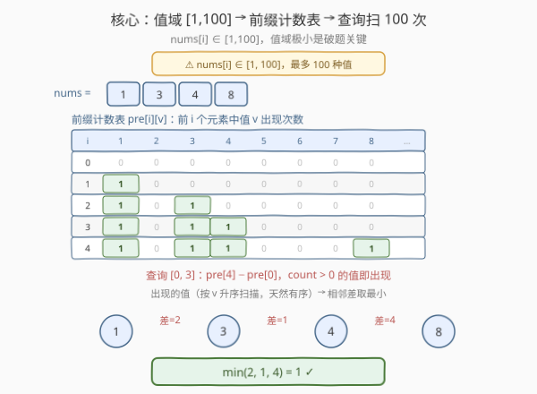
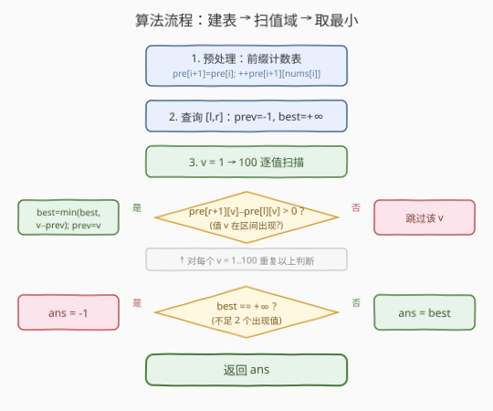
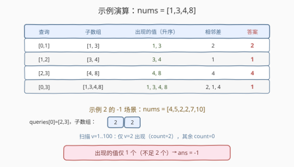

# LeetCode 查询差绝对值的最小值 题解

## 1. 题目概述

- **标题 / 题号**：查询差绝对值的最小值（#1906，medium）
- **链接**：https://leetcode.cn/problems/minimum-absolute-difference-queries/
- **难度**：中等
- **标签**：数组、前缀和

**题意**：数组 `a` 的**差绝对值的最小值**定义为：在所有满足 $0 \le i < j < |a|$ 且 $a[i] \ne a[j]$ 的对中，$|a[i] - a[j]|$ 的最小值。若 `a` 中所有元素都相同，则该值为 $-1$。

给定整数数组 `nums` 和查询数组 `queries`（`queries[i] = [l_i, r_i]`），对每个查询计算**子数组** `nums[l_i..r_i]` 的差绝对值的最小值，返回答案数组 `ans`。

> 💡 **审题关键**：① 只统计 $a[i] \ne a[j]$ 的对，所以全相同元素返回 $-1$；② 答案不是 $0$——相等元素对被排除；③ 子数组是**连续**区间。

**示例 1**：

```text
输入：nums = [1,3,4,8], queries = [[0,1],[1,2],[2,3],[0,3]]
输出：[2,1,4,1]
解释：
- queries[0] = [0,1]：子数组 [1,3]，最小差为 |1−3| = 2
- queries[1] = [1,2]：子数组 [3,4]，最小差为 |3−4| = 1
- queries[2] = [2,3]：子数组 [4,8]，最小差为 |4−8| = 4
- queries[3] = [0,3]：子数组 [1,3,4,8]，最小差为 |3−4| = 1
```

**示例 2**：

```text
输入：nums = [4,5,2,2,7,10], queries = [[2,3],[0,2],[0,5],[3,5]]
输出：[-1,1,1,3]
解释：
- queries[0] = [2,3]：子数组 [2,2]，所有元素相同 → -1
- queries[1] = [0,2]：子数组 [4,5,2]，最小差为 |4−5| = 1
- queries[2] = [0,5]：子数组 [4,5,2,2,7,10]，最小差为 |4−5| = 1
- queries[3] = [3,5]：子数组 [2,7,10]，最小差为 |7−10| = 3
```

**约束**：

- $2 \le \text{nums.length} \le 10^5$
- $1 \le \text{nums}[i] \le 100$
- $1 \le \text{queries.length} \le 2 \times 10^4$
- $0 \le l_i < r_i < \text{nums.length}$

> ⚠️ **关键约束**：$\text{nums}[i] \in [1, 100]$——值域极小（最多 100 种值），这是破题的突破口。若值域很大，则需用主席树/区间排序等重型数据结构。

## 2. 解题思路

### 2.1 暴力思路：逐查询排序扫差

对每个查询 $[l, r]$，取出子数组 `nums[l..r]`，排序后扫一遍相邻差取最小值。若子数组去重后不足 2 个值，返回 $-1$。

- **正确性**：排序后最小差必出现在相邻元素之间。
- **效率**：每个查询 $O(len \log len)$，最坏 $O(n \log n)$；$q$ 个查询共 $O(qn \log n)$，对 $n = 10^5$、$q = 2 \times 10^4$ 完全不可行。

> ⚠️ 暴力法的瓶颈在于「逐查询处理整个子数组」。但实际上值域只有 100 种——我们根本不需要排序子数组，只需知道**哪些值出现了**即可。

### 2.2 核心观察：值域 [1,100] → 前缀计数表



**关键洞察**：$\text{nums}[i] \in [1, 100]$，值域只有 100 种。最小差一定出现在**排序后相邻的两个出现过的值**之间（标准性质：有序数组中差最小的对必相邻）。因此：

1. **预处理**：建前缀计数表 `pre[i][v]`，表示 `nums[0..i-1]` 中值 $v$ 出现的次数。
   - 递推：`pre[i+1] = pre[i]` 的拷贝，再 `pre[i+1][nums[i]]++`。
   - 空间：$O(100n)$，对 $n = 10^5$ 约 $10^7$ 个整数，可接受。

2. **查询** $[l, r]$：值 $v$ 在区间内出现 $\iff$ `pre[r+1][v] - pre[l][v] > 0`。
   - 按 $v = 1, 2, \dots, 100$ 顺序扫描，收集所有出现的值（天然有序）。
   - 维护前一个出现的值 `prev`，逐对计算 $v - \text{prev}$ 取最小。
   - 不足 2 个值 → 返回 $-1$；否则返回最小差。

> 💡 **为什么最小差必在相邻出现值之间？** 设出现的值为 $v_1 < v_2 < \dots < v_k$。对任意 $i < j$，$v_j - v_i \ge v_{i+1} - v_i$（因为 $v_j \ge v_{i+1}$）。所以跨项差不会比相邻差更小，只需扫相邻对即可。

### 2.3 算法流程图



整体步骤：

1. 初始化 `pre[0]` 为全 0 的 101 维数组（下标 1–100 对应值 1–100）。
2. 遍历 `nums`，逐行递推：`pre[i+1] = pre[i]` 拷贝 + `pre[i+1][nums[i]]++`。
3. 对每个查询 $[l, r]$：
   - `prev = -1`，`best = +∞`
   - $v$ 从 1 到 100：若 `pre[r+1][v] - pre[l][v] > 0`，则更新 `best = min(best, v - prev)`，`prev = v`
   - `best` 仍为 $+\infty$ → $-1$，否则 → `best`

### 2.4 示例演算



以**示例 1** `nums = [1,3,4,8]` 演算前缀计数表与各查询：

| 查询 | 区间 | 出现的值 | 相邻差 | 答案 |
|------|------|----------|--------|------|
| $[0,1]$ | `[1,3]` | 1, 3 | $3-1=2$ | $2$ |
| $[1,2]$ | `[3,4]` | 3, 4 | $4-3=1$ | $1$ |
| $[2,3]$ | `[4,8]` | 4, 8 | $8-4=4$ | $4$ |
| $[0,3]$ | `[1,3,4,8]` | 1, 3, 4, 8 | $2, 1, 4$ | $1$ |

**示例 2** 的 `queries[0] = [2,3]`：子数组 `[2,2]`，值域扫描只有 $v=2$ 出现，不足 2 个值 → $-1$。

## 3. 参考代码

### C++

```cpp
class Solution {
public:
    vector<int> minDifference(vector<int>& nums, vector<vector<int>>& queries) {
        int n = nums.size();
        // pre[i][v]: 前 i 个元素中值 v 出现的次数（v ∈ [1,100]）
        vector<array<int, 101>> pre(n + 1);
        for (int i = 0; i < n; ++i) {
            pre[i + 1] = pre[i];
            ++pre[i + 1][nums[i]];
        }
        vector<int> ans;
        ans.reserve(queries.size());
        for (auto& q : queries) {
            int l = q[0], r = q[1], prev = -1, best = INT_MAX;
            auto& pl = pre[l];
            auto& pr = pre[r + 1];
            for (int v = 1; v <= 100; ++v) {
                if (pr[v] - pl[v] > 0) {
                    if (prev != -1) best = min(best, v - prev);
                    prev = v;
                }
            }
            ans.push_back(best == INT_MAX ? -1 : best);
        }
        return ans;
    }
};
```

### Python

```python
class Solution:
    def minDifference(self, nums: List[int], queries: List[List[int]]) -> List[int]:
        n = len(nums)
        # pre[i][v]: 前 i 个元素中值 v 出现的次数（v ∈ [1,100]）
        pre = [[0] * 101]
        for x in nums:
            cur = pre[-1][:]      # 拷贝上一行
            cur[x] += 1
            pre.append(cur)
        ans = []
        for l, r in queries:
            prev = -1
            best = 101             # 值域差上界为 99，用 101 当 +∞
            pl, pr = pre[l], pre[r + 1]
            for v in range(1, 101):
                if pr[v] - pl[v] > 0:
                    if prev != -1 and v - prev < best:
                        best = v - prev
                    prev = v
            ans.append(-1 if best == 101 else best)
        return ans
```

> ⚠️ **C++ 中 `array<int, 101>` 的拷贝**：`pre[i + 1] = pre[i]` 是值语义拷贝（101 个 int），总开销 $O(100n) \approx 10^7$，完全可接受。若改用 `vector<vector<int>>` 逐元素拷贝也行，但 `array` 更紧凑、缓存更友好。
>
> 💡 **Python 的 `pre[-1][:]`**：列表切片拷贝在 CPython 中是 C 层面操作，$O(101)$ 每行、总 $O(100n)$，实测对 $n = 10^5$ 可在时限内通过。

## 4. 复杂度分析

| 维度 | 复杂度 | 说明 |
|------|--------|------|
| 时间复杂度 | $O\big(100(n + q)\big)$ | 预处理 $O(100n)$ 行拷贝；每查询 $O(100)$ 扫值域 |
| 空间复杂度 | $O(100n)$ | 前缀计数表 $n+1$ 行 × $101$ 列 |

> 💡 对 $n = 10^5$、$q = 2 \times 10^4$：时间 $\approx 100 \times 1.2 \times 10^5 = 1.2 \times 10^7$，远低于时限。空间 $\approx 10^5 \times 101 \times 4\text{B} \approx 40\text{MB}$（C++ `int`），可接受。

## 5. 扩展：位置列表 + 二分查找

若值域更大（如 $10^9$）但**不同值的种类不多**，前缀计数表不再可行。替代方案：对每个值 $v$ 维护其出现的**下标排序列表** `pos[v]`，查询 $[l, r]$ 时对每个 $v$ 二分判断是否在区间内出现：

```cpp
// 预处理：pos[v] 存放值 v 出现的所有下标（升序）
vector<vector<int>> pos(101);
for (int i = 0; i < n; ++i) pos[nums[i]].push_back(i);

// 查询 [l, r]：值 v 出现 ⟺ pos[v] 中存在下标 ∈ [l, r]
auto it = lower_bound(pos[v].begin(), pos[v].end(), l);
bool appears = (it != pos[v].end() && *it <= r);
```

- **复杂度**：预处理 $O(n)$，每查询 $O(100 \log n)$，空间 $O(n)$。
- **适用场景**：值域大但不同值种类少时，比前缀计数表更省空间。

> 💡 当值域极大（$10^9$）且元素种类也多时，需用**主席树**（按位置建权值线段树）查询区间第 $k$ 小与相邻差，复杂度 $O(q \log n \log V)$，远超本题所需。

## 6. 面试要点

1. **为什么最小差一定出现在排序后相邻的两个值之间？**

   > 设出现的值为 $v_1 < v_2 < \dots < v_k$。对任意 $i < j$，$v_j - v_i = (v_j - v_{j-1}) + \dots + (v_{i+1} - v_i) \ge v_{i+1} - v_i$。所以非相邻对的差不小于某个相邻对的差，只需检查相邻对。

2. **值域 $[1,100]$ 这个约束为什么重要？**

   > 它让我们能用「前缀计数表」把「子数组中有哪些值」的查询降到 $O(100)$，而非 $O(\text{区间长度})$。若值域为 $10^9$，则需主席树或离散化 + 权值线段树，复杂度和实现难度都大幅上升。

3. **全相同元素返回 $-1$ 的逻辑如何体现？**

   > 扫描 100 个值后若不足 2 个出现（`best` 仍为 $+\infty$），说明区间内只有一种值或为空（题目保证 $l < r$ 故至少 2 个元素），即所有元素相同，返回 $-1$。

4. **前缀计数表的空间能否优化？**

   > 可改为「位置列表 + 二分」，空间从 $O(100n)$ 降到 $O(n)$，但每查询从 $O(100)$ 升到 $O(100 \log n)$。本题 $100 \log 10^5 \approx 1700$，$2 \times 10^4$ 查询约 $3.4 \times 10^7$，仍可接受。选择取决于空间是否紧张。

5. **如果允许 $a[i] = a[j]$（即答案可以为 0）会怎样？**

   > 只需在扫描时检查是否有任意值出现 $\ge 2$ 次（`pre[r+1][v] - pre[l][v] >= 2`），若有则答案为 0，否则继续找相邻差最小值。逻辑只需加一行特判。

## 同类练习题

| # | 题目 | 与本题的关联 |
|---|------|-------------|
| 3159 | [查询出现至少三次的元素](https://leetcode.cn/problems/find-occurrences-of-an-element-in-an-array/) | 同样利用 $\text{nums}[i] \in [1,100]$ 的小值域，前缀计数 + 区间查询 |
| 2080 | [区间内查询数字的频率](https://leetcode.cn/problems/range-frequency-queries/) | 区间内某值的出现次数，前缀计数 / 位置列表二分的经典应用 |
| 1310 | [子数组异或查询](https://leetcode.cn/problems/xor-queries-of-a-subarray/) | 前缀异或（可逆运算）做区间查询，对照前缀计数的不可逆场景 |
| 1170 | [比较字符串最小字母出现频次](https://leetcode.cn/problems/compare-strings-by-frequency-of-the-smallest-character/) | 预处理 + 查询映射，思路同源——离线预计算降低单次查询代价 |
