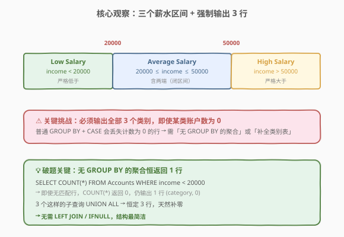
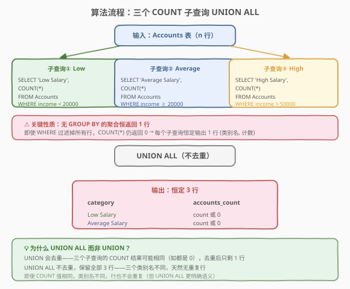
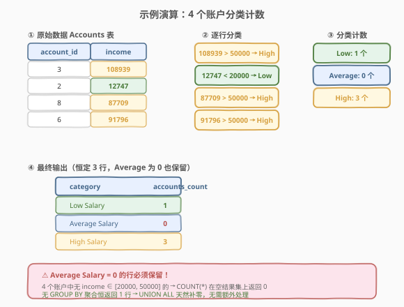

# 按分类统计薪水

- **题目名称**：按分类统计薪水
- **链接**：[1907. 按分类统计薪水](https://leetcode.cn/problems/count-salary-categories/)
- **难度**：中等
- **标签**：SQL、UNION ALL、聚合函数、COUNT、CASE WHEN、补零行

## 1. 题目概述

给定 `Accounts` 表，每行记录一个银行账户的月收入。编写 SQL 查询，按工资类别统计银行账户数量。工资类别如下：

- `"Low Salary"`：所有工资**严格低于** 20000 美元。
- `"Average Salary"`：**包含**范围 $[20000, 50000]$ 内的所有工资。
- `"High Salary"`：所有工资**严格大于** 50000 美元。

结果表**必须**包含所有三个类别。如果某个类别中没有账户，则报告 `0`。按**任意顺序**返回。

**表结构**：

```text
Table: Accounts
+-------------+------+
| Column Name | Type |
+-------------+------+
| account_id  | int  |
| income      | int  |
+-------------+------+
```

> ⚠️ `account_id` 是该表的主键。每一行包含一个银行账户的月收入信息。

**示例 1**：

```text
输入：
Accounts 表:
+------------+--------+
| account_id | income |
+------------+--------+
| 3          | 108939 |
| 2          | 12747  |
| 8          | 87709  |
| 6          | 91796  |
+------------+--------+

输出：
+----------------+----------------+
| category       | accounts_count |
+----------------+----------------+
| Low Salary     | 1              |
| Average Salary | 0              |
| High Salary    | 3              |
+----------------+----------------+
```

**解释**：

| account_id | income | 分类 | 说明 |
|------------|--------|------|------|
| 3 | 108939 | High Salary | $108939 > 50000$ |
| 2 | 12747 | Low Salary | $12747 < 20000$ |
| 8 | 87709 | High Salary | $87709 > 50000$ |
| 6 | 91796 | High Salary | $91796 > 50000$ |

- 低薪：1 个账户（account_id = 2）
- 中等薪水：0 个账户（无 income 落在 $[20000, 50000]$）
- 高薪：3 个账户（account_id = 3, 6, 8）

**约束条件**：

- `account_id` 是主键，无重复行
- `income` 为整数
- 结果必须包含全部 3 个类别，即使某类别计数为 0

> 💡 本题是 SQL **"分类统计 + 补零行"招牌题**——核心是把 `income` 映射到 3 个互斥区间，再统计每个区间的账户数。难点不在分类（`CASE WHEN` / `WHERE` 即可），而在**某类别为空时仍需输出 `0`**——普通 `GROUP BY` 会丢弃空分组，需用「无 `GROUP BY` 的聚合恒返回 1 行」或「预填类别表 + `LEFT JOIN`」来补零。考点覆盖 SQL 三要素：**区间分类（`CASE WHEN` / `WHERE` 条件）、聚合计数（`COUNT`）、补零行（`UNION ALL` 无分组聚合 / `LEFT JOIN` + `IFNULL`）**。

---

## 2. 解题思路

### 2.1 暴力思路：CASE WHEN + GROUP BY

最直觉的写法是先用 `CASE WHEN` 把 `income` 映射为类别名，再 `GROUP BY` 类别名统计：

```sql
SELECT
    CASE
        WHEN income < 20000 THEN 'Low Salary'
        WHEN income > 50000 THEN 'High Salary'
        ELSE 'Average Salary'
    END AS category,
    COUNT(*) AS accounts_count
FROM Accounts
GROUP BY category;
```

> ⚠️ **致命缺陷**：`GROUP BY` 只对**实际出现的类别**产生分组。若某个区间无账户（如示例 1 中 `Average Salary` 为空），该类别行会**直接丢失**——而题目要求输出 `Average Salary, 0`。这是所有「分类统计 + 强制全类别输出」题的通用陷阱，与 [1127. 用户购买平台](https://leetcode.cn/problems/user-purchase-platform/) 的「每日期强制 3 行」同源。

### 2.2 核心观察：无 GROUP BY 的聚合恒返回 1 行



**关键洞察**：SQL 中，**不带 `GROUP BY` 的聚合函数**（如 `SELECT COUNT(*) FROM t WHERE ...`）**恒定返回 1 行**——即使 `WHERE` 过滤掉了所有行，`COUNT(*)` 仍返回 `0`，结果集是 `(0)` 这一行。

利用这一性质，对每个类别写一个独立的 `COUNT` 子查询：

$$\text{子查询}_k = \text{SELECT } (\text{类别名}_k), \text{ COUNT}(*) \text{ FROM Accounts WHERE } (\text{区间条件}_k)$$

- **Low Salary**：`WHERE income < 20000` → 匹配行数或 0
- **Average Salary**：`WHERE income >= 20000 AND income <= 50000` → 匹配行数或 0
- **High Salary**：`WHERE income > 50000` → 匹配行数或 0

三个子查询用 `UNION ALL` 拼接，**恒定输出 3 行**——每个子查询贡献 1 行，空类别自动补 `0`，无需 `LEFT JOIN` / `IFNULL`。

> 💡 **为什么「无 `GROUP BY` 的聚合恒返回 1 行」？** SQL 标准规定：当 `SELECT` 包含聚合函数但无 `GROUP BY` 时，整个表视为一个分组。即使该分组为空（`WHERE` 过滤掉所有行），聚合函数仍对该空分组求值——`COUNT(*)` 返回 `0`，`SUM(x)` 返回 `NULL`，`MAX(x)` 返回 `NULL`。这与「有 `GROUP BY` 时空分组不产生行」的行为截然不同。

### 2.3 算法流程图



**逻辑执行步骤**：

| 步骤 | 子句 | 作用 |
|------|------|------|
| ① | `SELECT 'Low Salary', COUNT(*) FROM Accounts WHERE income < 20000` | 统计低薪账户数，恒返回 1 行 |
| ② | `SELECT 'Average Salary', COUNT(*) FROM Accounts WHERE income >= 20000 AND income <= 50000` | 统计中等薪水账户数，恒返回 1 行 |
| ③ | `SELECT 'High Salary', COUNT(*) FROM Accounts WHERE income > 50000` | 统计高薪账户数，恒返回 1 行 |
| ④ | `UNION ALL` | 拼接 3 行，不去重 |
| ⑤ | `AS category, AS accounts_count` | 列重命名 |

> 💡 **`UNION ALL` vs `UNION`**：`UNION` 会对结果去重——若三个子查询的 `COUNT` 值相同（如都是 0），去重后可能只剩 1 行。`UNION ALL` 不去重，保留全部 3 行。本题三个类别名不同，行天然不重复，但 `UNION ALL` 语义更明确且效率更高（省去去重排序）。

### 2.4 示例演算

以示例 1 数据 `Accounts = [(3, 108939), (2, 12747), (8, 87709), (6, 91796)]` 演算分类计数的完整过程：



**步骤 ①：逐行分类**

| account_id | income | 区间判定 | 分类 |
|------------|--------|----------|------|
| 3 | 108939 | $108939 > 50000$ | High Salary |
| 2 | 12747 | $12747 < 20000$ | Low Salary |
| 8 | 87709 | $87709 > 50000$ | High Salary |
| 6 | 91796 | $91796 > 50000$ | High Salary |

**步骤 ②：三个子查询分别计数**

| 子查询 | WHERE 条件 | 匹配行 | COUNT(*) |
|--------|-----------|--------|----------|
| ① Low | `income < 20000` | account 2 | 1 |
| ② Average | `income >= 20000 AND income <= 50000` | 无 | **0** |
| ③ High | `income > 50000` | accounts 3, 6, 8 | 3 |

> ⚠️ **子查询 ② 的关键**：`WHERE income >= 20000 AND income <= 50000` 过滤掉所有行后，结果集为空。但 `COUNT(*)` 是无 `GROUP BY` 的聚合，对空分组返回 `0`——仍输出 1 行 `('Average Salary', 0)`。这正是「补零行」的核心机制。

**步骤 ③：UNION ALL 拼接**

| category | accounts_count |
|----------|----------------|
| Low Salary | 1 |
| Average Salary | 0 |
| High Salary | 3 |

3 个子查询各贡献 1 行，`UNION ALL` 拼成 3 行最终结果，与示例输出一致。

---

## 3. 参考代码

### SQL（解法 A：UNION ALL 三子查询，推荐）

```sql
SELECT 'Low Salary' AS category,
       COUNT(*) AS accounts_count
FROM Accounts
WHERE income < 20000
UNION ALL
SELECT 'Average Salary' AS category,
       COUNT(*) AS accounts_count
FROM Accounts
WHERE income >= 20000 AND income <= 50000
UNION ALL
SELECT 'High Salary' AS category,
       COUNT(*) AS accounts_count
FROM Accounts
WHERE income > 50000;
```

> 💡 **写法要点**：
> - 三个子查询结构完全相同：`SELECT 类别名, COUNT(*) FROM Accounts WHERE 区间条件`。
> - 每个子查询**无 `GROUP BY`** → 聚合恒返回 1 行，空匹配时 `COUNT(*) = 0`，天然补零。
> - `UNION ALL` 不去重，保留全部 3 行。类别名不同故天然无重复。
> - ✓ **最简洁**：无需 `LEFT JOIN` / `IFNULL` / 预填类别表，结构清晰直观。
> - `BETWEEN` 也可替代 `>= AND <=`：`WHERE income BETWEEN 20000 AND 50000`，语义等价且更简洁。

### SQL（解法 B：CASE WHEN + 预填类别表 + LEFT JOIN，通用补零模板）

```sql
SELECT c.category,
       COUNT(a.account_id) AS accounts_count
FROM (
    SELECT 'Low Salary' AS category
    UNION ALL
    SELECT 'Average Salary'
    UNION ALL
    SELECT 'High Salary'
) c
LEFT JOIN Accounts a
    ON (c.category = 'Low Salary'     AND a.income < 20000)
    OR (c.category = 'Average Salary' AND a.income >= 20000 AND a.income <= 50000)
    OR (c.category = 'High Salary'    AND a.income > 50000)
GROUP BY c.category;
```

> 💡 **写法要点**：
> - **预填类别表 `c`**：用 `UNION ALL` 生成 3 行固定的类别名，作为 `LEFT JOIN` 的左表，保证 3 个类别恒定出现。
> - **`LEFT JOIN Accounts`**：`ON` 条件中把「类别名 ↔ 区间条件」绑定，无匹配行时 `a.account_id` 为 `NULL`。
> - **`COUNT(a.account_id)`**：`COUNT(列)` 忽略 `NULL`，无匹配时为 0。⚠️ 必须用 `COUNT(a.account_id)` 而非 `COUNT(*)`——`COUNT(*)` 会数 `LEFT JOIN` 的 `NULL` 行，返回 1。
> - ✓ **通用补零模板**：适用于「已知固定类别 + 可能缺失某些类别」的所有场景，与 [1127. 用户购买平台](https://leetcode.cn/problems/user-purchase-platform/) 的 `CROSS JOIN` 补网格同源。

### SQL（解法 C：CTE 分类 + 预填类别表 + LEFT JOIN）

```sql
WITH Classified AS (
    SELECT
        account_id,
        CASE
            WHEN income < 20000 THEN 'Low Salary'
            WHEN income > 50000 THEN 'High Salary'
            ELSE 'Average Salary'
        END AS category
    FROM Accounts
),
Categories AS (
    SELECT 'Low Salary' AS category
    UNION ALL
    SELECT 'Average Salary'
    UNION ALL
    SELECT 'High Salary'
)
SELECT c.category,
       COUNT(cl.account_id) AS accounts_count
FROM Categories c
LEFT JOIN Classified cl ON c.category = cl.category
GROUP BY c.category;
```

> 💡 **写法要点**：
> - **CTE `Classified`**：先用 `CASE WHEN` 给每个账户打上类别标签，这一步与 2.1 暴力思路相同。
> - **CTE `Categories`**：预填 3 个类别名作为骨架。
> - **`LEFT JOIN` + `COUNT(cl.account_id)`**：类别骨架左连接分类结果，空类别补零。
> - ✓ **逻辑分层最清晰**：分类（`Classified`）与补零（`LEFT JOIN`）解耦，适合复杂场景扩展。但代码量比解法 A 多，本题推荐解法 A。

### Python（pandas）

```python
import pandas as pd

def count_salary_categories(accounts: pd.DataFrame) -> pd.DataFrame:
    low = (accounts['income'] < 20000).sum()
    average = ((accounts['income'] >= 20000) & (accounts['income'] <= 50000)).sum()
    high = (accounts['income'] > 50000).sum()
    return pd.DataFrame({
        'category': ['Low Salary', 'Average Salary', 'High Salary'],
        'accounts_count': [low, average, high]
    })
```

> 💡 **pandas 对照**：
> - `(accounts['income'] < 20000).sum()` 对应 `SELECT COUNT(*) FROM Accounts WHERE income < 20000`——布尔 Series 的 `.sum()` 等价于条件计数。
> - 三个布尔条件互斥且覆盖全域（$< 20000$、$[20000, 50000]$、$> 50000$），故三计数的和等于总行数。
> - 直接构造 3 行 DataFrame，类别名硬编码——对应 SQL 的「预填类别表」，pandas 天然不会丢失空类别。
> - 也可用 `pd.cut` 分箱：`accounts['category'] = pd.cut(accounts['income'], bins=[-inf, 19999, 50000, inf], labels=['Low Salary', 'Average Salary', 'High Salary'])` 再 `groupby().size()`，但需额外处理空类别。

---

## 4. 复杂度分析

| 维度 | 解法 A（UNION ALL） | 解法 B（LEFT JOIN） | 解法 C（CTE + LEFT JOIN） |
|------|---------------------|---------------------|---------------------------|
| **时间** | $O(n)$ | $O(n)$ | $O(n)$ |
| **空间** | $O(1)$ | $O(1)$ | $O(n)$（CTE 物化） |
| **全表扫描次数** | 3 次 | 1 次 | 1 次 |
| **代码量** | ★★★ 最简洁 | ★★ 中等 | ★ 最多 |
| **推荐度** | ✓ **首选** | ✓ 通用模板 | ✓ 逻辑分层 |

> - $n$ = `Accounts` 表行数
> - **解法 A** 扫描全表 3 次（每个子查询独立 `WHERE` 扫描），但每次扫描 $O(n)$，总计 $O(3n) = O(n)$。实际执行中数据库可能优化为一次扫描（如 MySQL 对 `UNION ALL` 的子查询有合并扫描优化），但最坏仍为 3 次。
> - **解法 B/C** 只扫描 1 次全表，`LEFT JOIN` + `GROUP BY` 在内存中完成。但 `ON` 条件含 `OR` 可能导致嵌套循环连接 $O(3n)$，实际与解法 A 相当。
> - 三种解法空间均为 $O(1)$（结果恒定 3 行），解法 C 的 CTE 物化为 $O(n)$ 但执行器可能惰性求值。

---

## 5. 扩展：补零行的三种范式对比

### 5.1 三种补零机制

| 范式 | 核心思想 | 适用场景 | 代表题 |
|------|----------|----------|--------|
| **无 GROUP BY 聚合** | `COUNT(*)` 对空分组返回 0，恒输出 1 行 | 固定类别数少（≤5） | **本题 1907** |
| **预填表 + LEFT JOIN** | 生成完整类别骨架，左连接数据，`COUNT(列)` 补零 | 类别固定但需关联统计 | [1127. 用户购买平台](https://leetcode.cn/problems/user-purchase-platform/) |
| **CROSS JOIN 补网格** | 行维度 × 列维度笛卡尔积，`LEFT JOIN` + `IFNULL` 补零 | 二维网格（日期×类别） | [1097. 游戏玩法分析 V](https://leetcode.cn/problems/game-play-analysis-v/) |

> 💡 **选择口诀**：**类别少且无需关联 → 无 `GROUP BY` 聚合 + `UNION ALL`；类别固定需关联 → 预填表 + `LEFT JOIN`；二维网格补零 → `CROSS JOIN` 补网格**。本题只有 3 个固定类别、无关联统计，解法 A（无 `GROUP BY` 聚合）最简洁。

### 5.2 COUNT(*) vs COUNT(列) 的关键区别

> ⚠️ **`COUNT(*)` vs `COUNT(column)`**：
> - `COUNT(*)`：统计**行数**，包括 `NULL` 行。在 `LEFT JOIN` 补零场景中，无匹配的 `NULL` 行也会被数 1 → **补零失败**。
> - `COUNT(column)`：统计**非 NULL 值的数量**，忽略 `NULL`。无匹配时 `column` 为 `NULL` → 返回 0 → **正确补零**。
>
> 本题解法 A 中每个子查询是独立 `WHERE` 过滤后的 `COUNT(*)`——不存在 `LEFT JOIN` 的 `NULL` 行，故 `COUNT(*)` 正确。解法 B/C 用 `LEFT JOIN` 补零，**必须**用 `COUNT(a.account_id)` 而非 `COUNT(*)`。

### 5.3 区间边界：闭区间 vs 开区间

本题三个区间的边界处理是常见陷阱：

| 类别 | 条件 | 边界值 20000 | 边界值 50000 |
|------|------|-------------|-------------|
| Low Salary | `income < 20000` | ✗ 不含 | — |
| Average Salary | `income >= 20000 AND income <= 50000` | ✓ 含 | ✓ 含 |
| High Salary | `income > 50000` | — | ✗ 不含 |

> ⚠️ **边界归属**：`income = 20000` 属于 Average（Low 是严格小于）；`income = 50000` 也属于 Average（High 是严格大于）。三个区间**互斥且覆盖全域**，无遗漏无重叠。若误写 Low 为 `<= 20000`，则 `income = 20000` 同时落入 Low 和 Average，重复计数。

---

## 6. 面试要点

1. **为什么 `GROUP BY` + `CASE WHEN` 会丢失空类别行？**

   > `GROUP BY` 只对**实际出现的值**产生分组。若某区间无匹配行，`CASE WHEN` 不会产生该类别值，`GROUP BY` 自然没有该分组——结果集中该类别行直接消失。这与「无 `GROUP BY` 的聚合对空分组仍返回 1 行」的行为截然不同。解决方法是预填类别表 + `LEFT JOIN`，或直接用无 `GROUP BY` 的独立 `COUNT` 子查询 + `UNION ALL`。

2. **为什么「无 `GROUP BY` 的 `COUNT(*)`」在空结果集上返回 0 而非空？**

   > SQL 标准规定：当 `SELECT` 含聚合函数但无 `GROUP BY` 时，整个表视为一个分组。即使 `WHERE` 过滤掉所有行，该空分组仍存在，`COUNT(*)` 对空分组返回 `0`。这等价于「对一个空列表求长度 = 0」而非「没有列表」。利用这一性质，每个 `SELECT '类别', COUNT(*) FROM t WHERE ...` 恒返回 1 行，`UNION ALL` 后恒为 3 行。

3. **`UNION ALL` 和 `UNION` 的区别？本题为什么用 `UNION ALL`？**

   > `UNION` 会对拼接后的结果去重（额外排序/哈希），`UNION ALL` 不去重直接拼接。本题三个子查询的类别名不同（`'Low Salary'`、`'Average Salary'`、`'High Salary'`），行天然不重复。但若三个 `COUNT` 值恰好相同（如都是 0），`UNION` 去重可能误删行（因为整行 `(类别, 计数)` 中只有类别不同时才不重复，但如果类别名不同行就不会被去重——所以 `UNION` 实际也安全）。不过 `UNION ALL` 语义更明确（「我知道无重复，不需要去重」）且效率更高（省去去重开销），是最佳实践。

4. **解法 B 中为什么必须用 `COUNT(a.account_id)` 而非 `COUNT(*)`？**

   > 解法 B 用 `LEFT JOIN` 补零——当某类别无匹配账户时，`LEFT JOIN` 仍保留该类别行，但 `a.account_id` 为 `NULL`。`COUNT(*)` 会统计该 `NULL` 行，返回 1（错误）；`COUNT(a.account_id)` 忽略 `NULL`，返回 0（正确）。这是所有 `LEFT JOIN` 补零场景的通用陷阱——`COUNT(*)` 数行数，`COUNT(列)` 数非 NULL 值。

5. **如果题目改为「每个类别还需统计总收入的平均值」怎么办？**

   > 解法 A 的 `UNION ALL` 结构天然支持——每个子查询多加一个 `IFNULL(AVG(income), 0) AS avg_income` 即可。无 `GROUP BY` 的 `AVG` 对空分组返回 `NULL`，用 `IFNULL` 补 0。解法 B/C 的 `LEFT JOIN` 版则需 `IFNULL(AVG(a.income), 0)`——`AVG` 忽略 `NULL`（`LEFT JOIN` 的空行），空分组时返回 `NULL` → `IFNULL` 补 0。两种写法均可扩展。

> 💡 **一句话总结**：1907 是 SQL **"分类统计 + 补零行"招牌题**——核心利用「无 `GROUP BY` 的聚合恒返回 1 行」这一 SQL 标准特性，三个 `SELECT 类别, COUNT(*) FROM Accounts WHERE 区间条件` 子查询用 `UNION ALL` 拼接，天然输出 3 行、空类别自动补 0。考点覆盖：**区间分类（`WHERE` / `CASE WHEN`）、聚合计数（`COUNT`）、补零行（无分组聚合 / `LEFT JOIN` + `COUNT(列)`）**。记住「固定类别 + 可能缺失 → 无 `GROUP BY` 聚合 + `UNION ALL`」这个最简洁模板。

---

## 7. 同类练习题

- [1127. 用户购买平台](https://leetcode.cn/problems/user-purchase-platform/)（[题解](../1101-1200/1127_用户购买平台.md)）：每个日期强制输出 3 个平台分类（desktop / mobile / both），`CROSS JOIN` 补网格 + `LEFT JOIN` + `COUNT(列)` 补零——1907 的二维网格升级版
- [1097. 游戏玩法分析 V](https://leetcode.cn/problems/game-play-analysis-v/)：按安装日期统计次日留存用户数，缺失日期需补零——`LEFT JOIN` + `IFNULL` 补零的经典应用
- [1174. 即时食物配送 II](https://leetcode.cn/problems/immediate-food-delivery-ii/)：每个顾客首单的即时占比，子查询筛首单 + 聚合——与 1907 同为「分类 + 聚合统计」范式
- [1211. 查询结果质量](https://leetcode.cn/problems/queries-quality-and-percentage/)：按查询分组统计质量与占比，`GROUP BY` + `AVG` + `ROUND`——1907 的分组聚合变体（无需补零）
- [627. 变更性别](https://leetcode.cn/problems/swap-salary/)：`CASE WHEN` 条件表达式 `UPDATE`——对比 1907 中 `CASE WHEN` 用于 `SELECT` 分类，理解 `CASE WHEN` 在不同子句中的通用性
