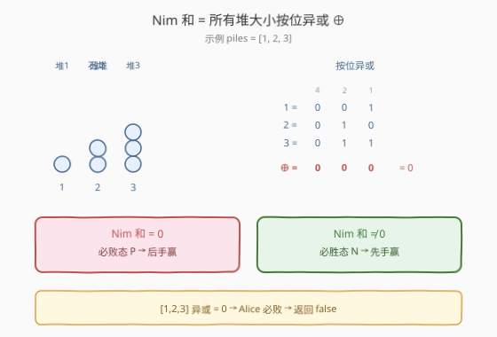
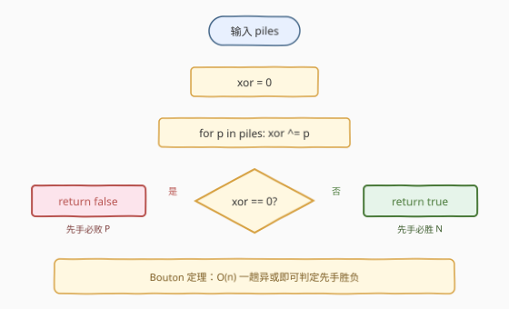
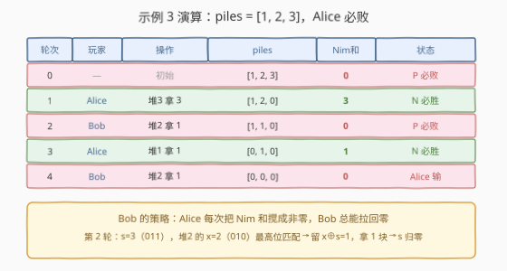

# Nim 游戏 II

- **题目名称**：Nim 游戏 II
- **链接**：[1908. Nim 游戏 II](https://leetcode.cn/problems/game-of-nim/)
- **难度**：中等
- **标签**：位运算、数学、博弈、动态规划、脑筋急转弯

## 1. 题目概述

Alice 和 Bob 交替进行一个游戏，**Alice 先手**。共有 $n$ 堆石头，每回合当前玩家必须**选择某一非空堆**，从中移除**任意非零数量**的石头。无法移除任何石头的玩家输掉游戏，另一方获胜。

给定整数数组 `piles`（`piles[i]` 为第 $i$ 堆石头数），双方都采取**最优策略**，当且仅当 Alice 能获胜返回 `true`。

**示例 1**：

```text
输入：piles = [1]
输出：true
解释：Alice 拿走第 1 堆的 1 块 → piles = [0]，Bob 无石可拿，Alice 胜。
```

**示例 2**：

```text
输入：piles = [1,1]
输出：false
解释：Alice 无论拿哪堆，Bob 拿走另一堆，Alice 无石可拿，Bob 胜。
```

**示例 3**：

```text
输入：piles = [1,2,3]
输出：false
解释：1⊕2⊕3 = 0，Alice 必败（详见 2.4 演算）。
```

**约束条件**：

- `n == piles.length`
- `1 <= n <= 7`
- `1 <= piles[i] <= 7`

**进阶**：你能想出**线性时间**的解法吗？

> 💡 本题是经典 **Nim 博弈**的标准形式：多堆、每次从某一堆取任意多。其最优判据是 1901 年由 Bouton 证明的 **Nim 和定理**——所有堆大小的**按位异或**决定胜负。约束 $n, piles[i] \le 7$ 让记忆化搜索也能过，但「进阶」要求的 $O(n)$ 解法才是这道题的灵魂。

---

## 2. 解题思路

### 2.1 暴力思路：记忆化搜索博弈树

把「各堆剩余石头数组成的元组」当作**状态**。定义 $\text{dfs}(s)$ 为「当前轮到的玩家面对该状态能否获胜」。转移：

$$
\text{dfs}(s) = \bigvee_{\text{合法操作 } s \to s'} \neg\, \text{dfs}(s')
$$

即「存在一步操作把对手送进必败态」。终态全零时无合法操作，返回 `false`。

约束 $n \le 7$、$piles[i] \le 7$，状态总数至多 $8^7 \approx 2 \times 10^6$，每个状态枚举至多 $7 \times 7 = 49$ 种操作，总复杂度约 $10^8$，可过。但这是「靠数据范围小」硬撑的解法——一旦堆数或堆高放大就立刻爆炸。需要寻找**不依赖枚举状态**的解析判据。

### 2.2 核心观察：Nim 和（Bouton 定理）



定义 **Nim 和** 为所有堆大小的按位异或：

$$
s = x_1 \oplus x_2 \oplus \cdots \oplus x_n
$$

**Bouton 定理**（1901）给出胜负判据：

| Nim 和 $s$ | 当前状态类型 | 含义 |
|------------|-------------|------|
| $s = 0$ | **P-position**（必败态） | 无论怎么走都给对手留下 $s' \ne 0$，先手必败 |
| $s \ne 0$ | **N-position**（必胜态） | 总存在一步操作使 $s' = 0$，先手必胜 |

Alice 先手，故返回 $s \ne 0$。

> 💡 **P/N 命名**：P = Previous（上一位玩家赢，即当前玩家输）；N = Next（下一位玩家赢，即当前玩家赢）。终态全零的 $s = 0$ 是天然的 P-position（当前玩家无路可走，直接输）。

**定理的两条关键性质**（证明见第 5 节）：

1. **从 $s = 0$ 出发，任意合法操作都使 $s' \ne 0$**：改某堆 $x_i \to x_i'$（$x_i' < x_i$），$s' = x_i \oplus x_i' \ne 0$。
2. **从 $s \ne 0$ 出发，总存在合法操作使 $s' = 0$**：取 $s$ 最高位 $k$，必有某堆 $x_i$ 的第 $k$ 位为 1，令 $x_i' = x_i \oplus s < x_i$，移除 $x_i - x_i'$ 即可。

这两条保证了「$s=0$ 是必败态、$s\ne0$ 是必胜态」的归纳成立。

### 2.3 算法流程图



只需一趟遍历累加异或，再判断是否为零：

1. 初始化 `xor = 0`。
2. 遍历 `piles`，`xor ^= p`。
3. 返回 `xor != 0`。

### 2.4 示例演算



以**示例 3** `piles = [1, 2, 3]` 演算，初始 Nim 和 $s = 1 \oplus 2 \oplus 3 = 0$，Alice 处于必败态：

| 轮次 | 玩家 | 操作 | piles | Nim 和 | 状态 |
|------|------|------|-------|--------|------|
| 0 | — | 初始 | [1,2,3] | 0 | P（必败） |
| 1 | Alice | 堆3 拿 3 | [1,2,0] | 3 | N（必胜） |
| 2 | Bob | 堆2 拿 1 | [1,1,0] | 0 | P（必败） |
| 3 | Alice | 堆1 拿 1 | [0,1,0] | 1 | N（必胜） |
| 4 | Bob | 堆2 拿 1 | [0,0,0] | 0 | Alice 无路 → 输 |

**Bob 的必胜策略**：每次 Alice 把 Nim 和搅成非零后，Bob 总能找到一步把 Nim 和拉回零（性质 2）。如此 Alice 永远被钉在 $s = 0$ 的必败态上，直到全零终态落败。

> 💡 **第 2 轮 Bob 的操作怎么选出来的？** 此时 $s = 1 \oplus 2 \oplus 0 = 3$（二进制 `011`），最高位 $k = 1$（值 2）。堆 2 的值 $x = 2$（`010`）第 1 位为 1，令 $x' = 2 \oplus 3 = 1 < 2$，移除 $2 - 1 = 1$ 块即可让新 Nim 和 $= 3 \oplus 2 \oplus 1 = 0$。

---

## 3. 参考代码

### C++

```cpp
class Solution {
public:
    bool nimGame(vector<int>& piles) {
        int x = 0;
        for (int p : piles) x ^= p;
        return x != 0;
    }
};
```

### Python

```python
class Solution:
    def nimGame(self, piles: List[int]) -> bool:
        x = 0
        for p in piles:
            x ^= p
        return x != 0
```

> 💡 **Python 一行版**：`return functools.reduce(xor, piles) != 0`（需 `from operator import xor`）。

> ⚠️ 本题 $1 \le piles[i] \le 7$，异或结果范围 $[0, 7]$，不会溢出，无需额外处理。

---

## 4. 复杂度分析

| 维度 | Nim 和（Bouton 定理） | 记忆化搜索 |
|------|----------------------|-----------|
| **时间复杂度** | $O(n)$ | $O(8^n \cdot n^2)$ |
| **空间复杂度** | $O(1)$ | $O(8^n)$ |
| **能否扩展到大堆** | ✅（与堆大小无关） | ✗（状态爆炸） |
| **适用范围** | 任意堆数与堆高 | 仅 $n, piles[i] \le 7$ |

---

## 5. 扩展：Bouton 定理证明与记忆化搜索

### 5.1 Bouton 定理证明

设 $s = x_1 \oplus x_2 \oplus \cdots \oplus x_n$。需证：$s = 0$ 是 P-position，$s \ne 0$ 是 N-position。

**（1）终态**：所有 $x_i = 0$，$s = 0$，当前玩家无合法操作，输。故终态是 P-position。

**（2）从 $s = 0$ 任意操作都使 $s' \ne 0$**：

修改某堆 $x_i \to x_i'$（$x_i' < x_i$），其余不变。新 Nim 和

$$
s' = s \oplus x_i \oplus x_i' = 0 \oplus x_i \oplus x_i' = x_i \oplus x_i'
$$

因 $x_i' < x_i$ 故 $x_i' \ne x_i$，从而 $x_i \oplus x_i' \ne 0$，即 $s' \ne 0$。✅

**（3）从 $s \ne 0$ 存在操作使 $s' = 0$**：

设 $s$ 的最高有效位为第 $k$ 位。因 $s$ 第 $k$ 位为 1，必有**奇数个** $x_i$ 的第 $k$ 位为 1，故至少存在一个这样的 $x_i$。对它有 $x_i$ 第 $k$ 位为 1 而 $s$ 第 $k$ 位也为 1，所以

$$
x_i' = x_i \oplus s
$$

的第 $k$ 位为 0，其余高位与 $x_i$ 相同，故 $x_i' < x_i$（合法操作，移除 $x_i - x_i'$ 块）。操作后新 Nim 和

$$
s' = s \oplus x_i \oplus (x_i \oplus s) = 0
$$

✅

由（1）（2）（3）：$s = 0$ 的状态要么是终态（输），要么只能转移到 $s' \ne 0$；而 $s \ne 0$ 的状态总能转移到 $s' = 0$。归纳即得 $s = 0$ 为 P-position、$s \ne 0$ 为 N-position。$\blacksquare$

> 💡 **必胜操作公式**：当 $s \ne 0$ 时，找一堆 $x_i$ 使得 $x_i \oplus s < x_i$（即 $x_i$ 的最高位 $\ge$ $s$ 的最高位），移除 $x_i - (x_i \oplus s)$ 块、留下 $x_i \oplus s$ 块，即可把 Nim 和归零。

### 5.2 记忆化搜索（暴力解法）

约束 $n, piles[i] \le 7$ 时，可用八进制数编码状态做记忆化：

```cpp
class Solution {
public:
    bool nimGame(vector<int>& piles) {
        unordered_map<int, int> memo;
        int p[8] = {1};
        for (int i = 1; i < 8; ++i) p[i] = p[i - 1] * 8;
        auto encode = [&](vector<int>& a) {
            int st = 0;
            for (int i = 0; i < (int)a.size(); ++i) st += a[i] * p[i];
            return st;
        };
        function<bool(vector<int>&)> dfs = [&](vector<int>& a) {
            int st = encode(a);
            if (memo.count(st)) return (bool)memo[st];
            for (int i = 0; i < (int)a.size(); ++i) {
                for (int j = 1; j <= a[i]; ++j) {
                    a[i] -= j;
                    bool win = !dfs(a);
                    a[i] += j;
                    if (win) return (bool)(memo[st] = 1);
                }
            }
            return (bool)(memo[st] = 0);
        };
        return dfs(piles);
    }
};
```

> ⚠️ 记忆化搜索只适用于本题的小约束。若 $n$ 或 $piles[i]$ 增大，状态数 $8^n$ 指数爆炸，必须改用 Bouton 定理的 $O(n)$ 异或解法。

---

## 6. 面试要点

1. **Nim 和定理的内容是什么？**

   > 所有堆大小的按位异或 $s = x_1 \oplus \cdots \oplus x_n$：$s \ne 0$ 先手必胜，$s = 0$ 先手必败。这是 1901 年 Bouton 证明的经典结论。

2. **为什么 $s = 0$ 时先手必败？**

   > 任意操作改某堆 $x_i \to x_i'$ 后，$s' = x_i \oplus x_i' \ne 0$，必然把非零 Nim 和交给对手。而对手总能再拉回零。先手永远被钉在零上，直到全零终态落败。

3. **$s \ne 0$ 时的必胜操作怎么构造？**

   > 取 $s$ 最高位 $k$，找一个第 $k$ 位为 1 的堆 $x_i$，移除 $x_i - (x_i \oplus s)$ 块（留下 $x_i \oplus s$ 块）。因 $x_i \oplus s < x_i$ 故合法，操作后新 Nim 和恰为零。

4. **本题与 292 Nim 游戏有什么关系？**

   > 292 是**单堆**且每次最多拿 3 颗的特例，结论退化为 $n \bmod 4 \ne 0$。本题是**多堆**且每次可拿任意多的一般 Nim，结论是异或判据。单堆不限拿数时 $s = x_1 = n$，$n \ne 0$ 即必胜（一次拿光），与异或判据一致。

5. **记忆化搜索和异或解法分别适用于什么场景？**

   > 记忆化搜索适用于状态空间小（如 $n, piles[i] \le 7$）的场景，是通用的博弈 DP 套路。异或解法是 Nim 博弈的解析最优解，$O(n)$ 时间 $O(1)$ 空间，与堆大小无关。面试中应先讲暴力博弈树，再引出 Bouton 定理的 $O(n)$ 优化。

> 💡 **一句话总结**：经典 Nim 博弈的胜负由 Nim 和（所有堆异或）决定——非零先手胜、为零先手败。$O(n)$ 一趟异或即可，是博弈论「数学化」的典范。

---

## 7. 同类练习题

- [292. Nim 游戏](https://leetcode.cn/problems/nim-game/)（[题解](../0201-0300/292_Nim游戏.md)）：单堆 Nim 且每次最多拿 3 颗的退化情形，结论 $n \bmod 4 \ne 0$，对照本题的多堆异或判据
- [810. 黑板异或游戏](https://leetcode.cn/problems/chalkboard-xor-game/)（[题解](../0801-0900/810_黑板异或游戏.md)）：擦数使剩余异或为零则败，用「全局异或 + 奇偶性」不变量判定，同属异或博弈家族
- [877. 石子游戏](https://leetcode.cn/problems/stone-game/)（[题解](../0801-0900/877_石子游戏.md)）：固定从两端取的博弈区间 DP + Minimax，与本题「能解析化就数学化」形成对照
- [1025. 除数博弈](https://leetcode.cn/problems/divisor-game/)：选因数博弈，手推前几个值发现 $n \bmod 2$ 周期，同属「博弈找规律」家族
