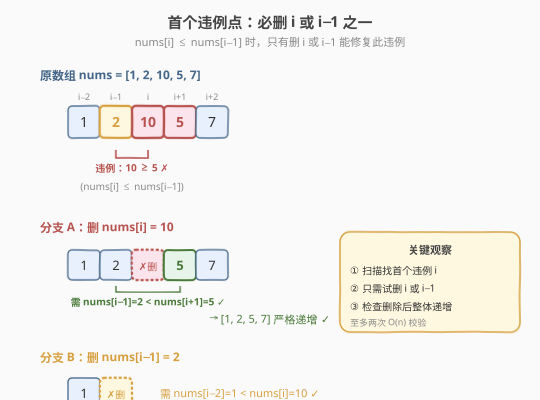
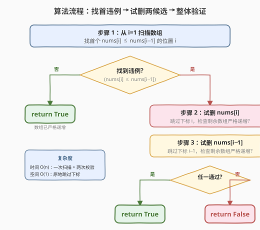

# 删除一个元素使数组严格递增

- **题目名称**：删除一个元素使数组严格递增
- **链接**：[1909. 删除一个元素使数组严格递增](https://leetcode.cn/problems/remove-one-element-to-make-the-array-strictly-increasing/)
- **难度**：简单
- **标签**：数组、贪心

## 1. 题目概述

给你一个下标从 **0** 开始的整数数组 `nums`，如果**恰好**删除**一个**元素后，数组**严格递增**，那么返回 `true`，否则返回 `false`。如果数组本身已经是严格递增的，也返回 `true`。

**严格递增**的定义：对于任意下标 $1 \le i < \text{nums.length}$ 都满足 $\text{nums}[i-1] < \text{nums}[i]$。

**示例 1**：

```text
输入：nums = [1,2,10,5,7]
输出：true
解释：从 nums 中删除下标 2 处的 10，得到 [1,2,5,7]。[1,2,5,7] 是严格递增的，所以返回 true。
```

**示例 2**：

```text
输入：nums = [2,3,1,2]
输出：false
解释：删除任意一个元素后均无法得到严格递增数组。
```

**示例 3**：

```text
输入：nums = [1,1,1]
输出：false
解释：删除任意元素后的结果都是 [1,1]，不是严格递增的。
```

**示例 4**：

```text
输入：nums = [1,2,3]
输出：true
解释：[1,2,3] 已经是严格递增的，所以返回 true。
```

**约束条件**：

- $2 \le \text{nums.length} \le 1000$
- $1 \le \text{nums}[i] \le 1000$

> 💡 本题的核心是「**只允许删一个元素**」——这意味着数组中至多存在一处「违例」（$\text{nums}[i] \le \text{nums}[i-1]$），且该违例必须能通过删一个元素修复。关键观察是：首个违例只涉及两个候选删除位置，无需枚举所有删除方案。

---

## 2. 解题思路

### 2.1 暴力思路：枚举每个删除位置

对数组中每个下标 `j`，尝试删除 $\text{nums}[j]$，然后检查剩余 $n - 1$ 个元素是否严格递增。外层枚举 $n$ 个位置，内层检查 $O(n)$，总复杂度 $O(n^2)$。

对于 $n \le 1000$ 这个数据范围，$O(n^2)$ 能过，但完全没有利用「违例」这一结构信息——大部分位置根本不需要考虑。

### 2.2 核心观察：首个违例只涉及两个候选



扫描数组，找到**第一个**满足 $\text{nums}[i] \le \text{nums}[i-1]$ 的位置 $i$（即首个违例点）。此时：

- **如果不存在违例**：数组已经严格递增，直接返回 `true`。
- **如果存在违例**：要修复这个违例，**必须**删除 $\text{nums}[i]$ 或 $\text{nums}[i-1]$ 之一——因为违例发生在相邻的 $i-1$ 与 $i$ 之间，删其他位置的元素无法改变这对相邻关系。

> 💡 **为什么只需看首个违例？** 因为如果数组能通过删一个元素变严格递增，那么删的那个元素一定与首个违例有关——首个违例不被修复，数组就不可能递增。所以只需在首个违例处试删 $i$ 和 $i-1$，检查删除后整个剩余数组是否严格递增即可。

**删除后的验证**：

- **删 $\text{nums}[i]$**：剩余数组在违例点附近变为 $\ldots, \text{nums}[i-1], \text{nums}[i+1], \ldots$，需验证 $\text{nums}[i-1] < \text{nums}[i+1]$，同时剩余数组其他部分也需严格递增。
- **删 $\text{nums}[i-1]$**：剩余数组在违例点附近变为 $\ldots, \text{nums}[i-2], \text{nums}[i], \ldots$，需验证 $\text{nums}[i-2] < \text{nums}[i]$（若 $i \ge 2$），同时其他部分也需严格递增。

任一候选删除后整个剩余数组严格递增，则返回 `true`；两个都不行则返回 `false`。

### 2.3 算法流程图



整体步骤：

1. 从 $i = 1$ 扫描数组，找首个 $\text{nums}[i] \le \text{nums}[i-1]$ 的位置。
2. 若无违例，返回 `true`（已严格递增）。
3. 若有违例，试删 $\text{nums}[i]$：跳过下标 $i$，检查剩余数组是否严格递增。
4. 试删 $\text{nums}[i-1]$：跳过下标 $i-1$，检查剩余数组是否严格递增。
5. 任一通过返回 `true`，否则返回 `false`。

### 2.4 示例演算

![示例演算：[1,2,10,5,7] 和 [2,3,1,2]](../images/1909_example_walkthrough.svg)

以**示例 1** `nums = [1, 2, 10, 5, 7]` 为例：

| 步骤 | 检查 | 结果 |
|------|------|------|
| 扫描 $i=1$ | $\text{nums}[1]=2 > \text{nums}[0]=1$ | ✓ 通过 |
| 扫描 $i=2$ | $\text{nums}[2]=10 > \text{nums}[1]=2$ | ✓ 通过 |
| 扫描 $i=3$ | $\text{nums}[3]=5 \le \text{nums}[2]=10$ | ✗ **首个违例！** |
| 试删 $i=3$（删 5） | 剩余 $[1,2,10,7]$，$10 \ge 7$ | ✗ 非递增 |
| 试删 $i-1=2$（删 10） | 剩余 $[1,2,5,7]$，$1<2<5<7$ | ✓ **严格递增** |
| 返回 | 分支 B 通过 | `true` |

以**示例 2** `nums = [2, 3, 1, 2]` 为例：

- 首个违例在 $i=2$（$1 \le 3$）。
- 试删 $i=2$（删 1）：剩余 $[2,3,2]$，$3 \ge 2$ → ✗。
- 试删 $i-1=1$（删 3）：剩余 $[2,1,2]$，$2 \ge 1$ → ✗。
- 两分支均失败 → `false`。

---

## 3. 参考代码

### C++

```cpp
class Solution {
  public:
    bool canBeIncreasing(vector<int>& nums) {
        int n = nums.size();
        auto check = [&](int skip) -> bool {
            int prev = -1;
            for (int i = 0; i < n; ++i) {
                if (i == skip) continue;
                if (prev != -1 && nums[i] <= nums[prev]) return false;
                prev = i;
            }
            return true;
        };
        for (int i = 1; i < n; ++i) {
            if (nums[i] <= nums[i - 1]) {
                return check(i) || check(i - 1);
            }
        }
        return true;
    }
};
```

### Python

```python
class Solution:
    def canBeIncreasing(self, nums: list[int]) -> bool:
        n = len(nums)

        def is_strictly_increasing(skip: int) -> bool:
            prev = -1
            for i in range(n):
                if i == skip:
                    continue
                if prev != -1 and nums[i] <= nums[prev]:
                    return False
                prev = i
            return True

        for i in range(1, n):
            if nums[i] <= nums[i - 1]:
                return is_strictly_increasing(i) or is_strictly_increasing(i - 1)
        return True
```

> ⚠️ **边界**：当 $n = 2$ 时，若 $\text{nums}[1] \le \text{nums}[0]$，试删任一元素后只剩一个元素，`check` 中 `prev` 始终只赋值一次不会触发比较，返回 `true`——正确（单元素天然严格递增）。若 $\text{nums}[1] > \text{nums}[0]$，无违例直接返回 `true`。两种情况均自然覆盖。

---

## 4. 复杂度分析

| 维度 | 复杂度 | 说明 |
|------|--------|------|
| 时间复杂度 | $O(n)$ | 一次扫描找首个违例 $O(n)$，至多两次 `check` 各 $O(n)$，总计 $O(n)$ |
| 空间复杂度 | $O(1)$ | 仅使用 `prev`、循环变量和 `skip` 参数，原地检查 |

---

## 5. 扩展：贪心一次扫描（O(n) 单趟 + 原地修改）

上述解法虽然已是 $O(n)$，但需两次 `check` 校验。可以利用**贪心策略**在一趟扫描内完成，无需二次遍历：

**思路**：当遇到违例 $\text{nums}[i] \le \text{nums}[i-1]$ 时，优先尝试"删 $\text{nums}[i-1]$"（因为 $\text{nums}[i-1]$ 偏大才导致违例，删它更合理）。若删 $\text{nums}[i-1]$ 不可行（即 $\text{nums}[i] \le \text{nums}[i-2]$，说明删 $i-1$ 后 $i-2$ 与 $i$ 之间仍有违例），则改为"删 $\text{nums}[i]$"——此时将 $\text{nums}[i]$ 设为 $\text{nums}[i-1]$（模拟删除 $i$ 后，下一个比较基准是 $\text{nums}[i-1]$）。

```cpp
class Solution {
  public:
    bool canBeIncreasing(vector<int>& nums) {
        bool removed = false;
        for (int i = 1; i < (int)nums.size(); ++i) {
            if (nums[i] <= nums[i - 1]) {
                if (removed) return false;
                removed = true;
                if (i >= 2 && nums[i] <= nums[i - 2]) {
                    nums[i] = nums[i - 1];
                }
            }
        }
        return true;
    }
};
```

```python
class Solution:
    def canBeIncreasing(self, nums: list[int]) -> bool:
        removed = False
        for i in range(1, len(nums)):
            if nums[i] <= nums[i - 1]:
                if removed:
                    return False
                removed = True
                if i >= 2 and nums[i] <= nums[i - 2]:
                    nums[i] = nums[i - 1]
        return True
```

> ⚠️ 此写法会修改输入数组。若不允许修改，可额外维护一个 `prev_val` 变量代替直接读写 `nums[i-1]`。

**两种写法对比**：

| 维度 | 两候选校验法 | 贪心单趟法 |
|------|-------------|-----------|
| 时间复杂度 | $O(n)$（至多 3 趟） | $O(n)$（仅 1 趟） |
| 空间复杂度 | $O(1)$ | $O(1)$ |
| 是否修改输入 | 否 | 是（可避免） |
| 正确性论证 | 显然正确（枚举两个候选） | 需论证贪心选择无后效性 |
| 面试推荐 | 先写此版保正确，再优化 | 作为 follow-up 优化 |

---

## 6. 面试要点

1. **为什么只需看首个违例，不用看后续违例？**

   > 如果数组能通过删一个元素变严格递增，那个被删的元素一定与首个违例有关——否则首个违例的相邻关系 $\text{nums}[i] \le \text{nums}[i-1]$ 不会被改变，数组不可能递增。所以只需在首个违例处试删 $i$ 或 $i-1$，如果两个候选都不能让剩余数组严格递增，则无解。

2. **为什么试删 $i$ 和 $i-1$ 两个就够了？**

   > 违例发生在相邻的 $i-1$ 与 $i$ 之间，删其他位置的元素不会改变这对相邻关系，无法修复此违例。所以能修复此违例的删除位置只有 $i$ 和 $i-1$ 两个，穷尽即可。

3. **贪心单趟法中，为什么 `nums[i] <= nums[i-2]` 时删 $i$ 而非 $i-1$？**

   > `nums[i] <= nums[i-2]` 意味着删 $i-1$ 后，$\text{nums}[i-2]$ 与 $\text{nums}[i]$ 之间仍有违例，所以删 $i-1$ 不可行，只能删 $i$。删 $i$ 后，下一轮比较基准应为 $\text{nums}[i-1]$，故令 $\text{nums}[i] = \text{nums}[i-1]$ 模拟跳过。

4. **如果存在两个不相邻的违例怎么办？**

   > 两个不相邻的违例意味着删一个元素无法同时修复两者（一次删除至多影响两对相邻关系），必然返回 `false`。两候选校验法中，第二次 `check` 会发现第二个违例仍存在而返回 `false`；贪心单趟法中，`removed` 已为 `true` 时遇到第二个违例直接返回 `false`。

5. **$n = 2$ 时为什么一定返回 `true`？**

   > 删任一元素后只剩一个元素，单元素数组天然严格递增。两候选校验法中，`check` 只遍历到一个元素，`prev` 赋值后不触发比较，返回 `true`。

---

## 7. 同类练习题

- [665. 非递减数列](https://leetcode.cn/problems/non-decreasing-array/)：本题的「非严格递增」版本，允许相等，贪心策略完全同源，是本题的最佳对照题
- [2869. 收集元素的最少操作次数](https://leetcode.cn/problems/minimum-operations-to-collect-elements/)：数组贪心操作题，同样关注「最小操作数」的贪心选择
- [845. 数组中的最长山脉](https://leetcode.cn/problems/longest-mountain-in-array/)：数组扫描判定单调性，关注相邻元素关系的变化点
- [162. 寻找峰值](https://leetcode.cn/problems/find-peak-element/)：利用相邻元素比较的数组扫描题，比较方向决定搜索区间
