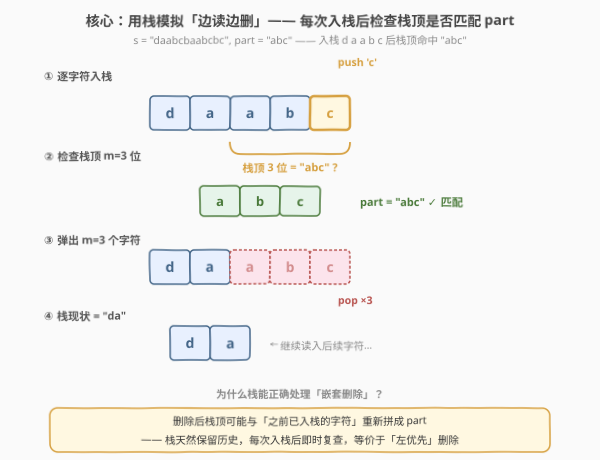
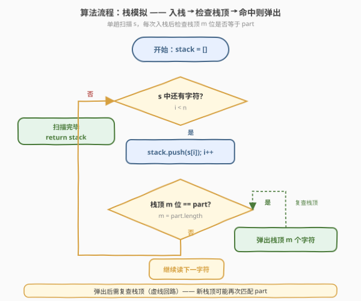
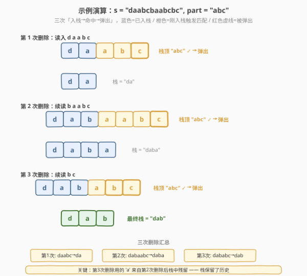

# 删除一个字符串中所有出现的给定子字符串

- **题目名称**：删除一个字符串中所有出现的给定子字符串
- **链接**：[1910. 删除一个字符串中所有出现的给定子字符串](https://leetcode.cn/problems/remove-all-occurrences-of-a-substring/)
- **难度**：中等
- **标签**：字符串、栈、模拟

## 1. 题目概述

给你两个字符串 `s` 和 `part`，请你对 `s` 反复执行以下操作，直到 `s` 中**不再出现** `part` 为止：

- 找到 `s` 中**最左边**的 `part` 子串，将其从 `s` 中删除。

返回最终删除完毕后的字符串 `s`。

> **子字符串**是字符串中一个连续的字符序列。

**示例 1**：

```text
输入：s = "daabcbaabcbc", part = "abc"
输出："dab"
解释：以下操作按顺序执行：
- "daabcbaabcbc" → 删除下标 2 开始的 "abc" → "dabaabcbc"
- "dabaabcbc"    → 删除下标 4 开始的 "abc" → "dababc"
- "dababc"       → 删除下标 3 开始的 "abc" → "dab"
此时 "dab" 中不再出现 "abc"，返回 "dab"。
```

**示例 2**：

```text
输入：s = "axxxxyyyyb", part = "xy"
输出："ab"
解释：反复删除最左边的 "xy"：
- "axxxxyyyyb" → "axxxxyyyb" → "axxxyyb" → "axxyb" → "axyb" → "ab"
```

**约束条件**：

- $1 \le \text{s.length} \le 1000$
- $1 \le \text{part.length} \le 1000$
- `s` 和 `part` 只由小写英文字母组成

> 💡 **审题关键**：① 每次只删**最左边**的一个 `part`，删完后再从头找下一个；② 删除可能让「原本不相邻的字符」拼接出新 `part`，因此必须**反复扫描**直到不再出现；③ 「最左优先」+「删后可能新生成」这两点决定了朴素模拟需要多轮，而栈可以一趟搞定。

---

## 2. 解题思路

### 2.1 暴力思路：反复查找并删除

最直观的做法是循环：每轮用 `s.find(part)` 定位最左出现的下标 `pos`，若找到则 `s.erase(pos, m)`（`m = part.length`），若找不到则结束循环返回 `s`。

- **正确性**：严格遵循题意「每次删最左」，循环到无 `part` 为止，结果正确。
- **效率**：每轮删除后字符串变短，最坏情况下每删一次只缩短 $m$ 个字符，共需 $O(n/m)$ 轮；每轮 `find` 与 `erase` 都是 $O(n)$，总计 $O(n^2/m \cdot n) = O(n^2)$ 量级。当 $n = 1000$ 时勉强可过，但不够优雅，且字符串反复搬运开销大。

> ⚠️ 暴力法的瓶颈在于「反复从头扫描整串」。事实上，删除一个 `part` 后，**只有删除点附近**的字符可能拼出新 `part`——前面的字符已经处理过且确认不含 `part`。这提示我们用**栈**保留已处理前缀，每次只在栈顶局部检查。

### 2.2 核心观察：栈模拟「边读边删」



关键洞察分两步：

**第一步：用栈逐字符读入 `s`，已处理前缀天然留在栈中。** 把 `s` 的字符从左到右依次压入栈，栈中内容始终等于「当前已读入、且尚未被删除的前缀」。读到第 $i$ 个字符时，前 $i-1$ 个字符的处理结果就在栈里，无需回头扫描。

**第二步：每次入栈后，检查栈顶 $m$ 位是否等于 `part`，命中则弹出。** 因为 `part` 只可能在「最新读入的字符 + 栈中已有字符」的交界处新形成，所以只需检查栈顶 $m$ 位：

$$\text{若 } \text{stack}[-m\,..\,] = \text{part} \implies \text{弹出栈顶 } m \text{ 个字符}$$

弹出后**继续检查**新栈顶（因为弹出可能让更早的字符与剩余栈顶再拼出 `part`），直到栈顶不再匹配为止，再读入下一个字符。

**为什么这等价于「最左优先删除」？** 因为栈是**从左到右**顺序构建的：当栈顶首次形成 `part` 时，这个 `part` 的起始位置就是当前已读入前缀中最左的 `part`（更左的位置若存在 `part`，早在之前入栈时就被弹掉了）。所以「入栈即检、命中即弹」自然实现了「最左优先」。

> 💡 **栈的精髓在于「保留历史」**：删除一个 `part` 后，被删部分**左侧**的字符仍然留在栈中，它们可能与后续读入的字符重新拼成 `part`。例如示例 1 的第三次删除：`"dabab"` + `'c'` → 栈顶 `"abc"` 命中，但其中的 `'a'` 来自第二次删除后残留的 `"daba"` 的末位。栈让这种「跨删除点」的匹配无需重新扫描。

> ⚠️ **常见误区**：以为「删除后只需从删除点继续往后读」。实际上删除点**之前**的字符也可能参与下一次匹配，必须保留。这正是朴素 `erase` 后用下标回退容易出错的原因，而栈天然规避了这个问题。

### 2.3 算法流程图



1. **初始化**：空栈 `stack`，下标 `i = 0`。
2. **逐字符读入**：当 `i < n` 时：
   - 将 `s[i]` 压入栈，`i += 1`。
   - **检查栈顶**：若 `stack.size() >= m` 且 `stack` 末尾 $m$ 位等于 `part`，则弹出栈顶 $m$ 个字符，并**重复此检查**（新栈顶可能再次匹配）。
   - 否则继续读下一字符。
3. **返回**：`i == n` 时栈中内容即为答案，将栈拼接为字符串返回。

> 💡 **「重复检查」的必要性**：弹出 $m$ 个字符后，新栈顶可能再次与剩余字符拼出 `part`。例如 `s = "aabcabc"`, `part = "abc"`：读入 `a a b c` → 命中弹出 → 栈空 → 续读 `a b c` → 再次命中弹出 → 栈空。虽然此例每次弹出后栈空无需复查，但考虑 `s = "aaabcbc"`, `part = "abc"`：读入 `a a a b c` → 栈顶 `"abc"` 命中弹出 → 栈剩 `"aa"` → 续读 `b c` → 栈 `"aabc"` → 末尾 `"abc"` 命中弹出 → 栈剩 `"a"`。可见弹出后立即复查能避免漏判。实际上由于我们每次只读一个字符，弹出后新栈顶最多只可能再匹配一次（因为只移除了末尾，而新栈顶的末位是更早读入的字符，不会因这次弹出而改变与 `part` 的关系——除非 `part` 有周期性结构）。为稳妥起见，写成 `while` 循环复查是安全且通用的写法。

### 2.4 示例演算

以官方样例 1 演示栈的三次「入栈→命中→弹出」全过程：



| 阶段 | 读入字符 | 入栈后栈内容 | 栈顶匹配? | 动作 | 弹出后栈 |
|------|---------|-------------|-----------|------|---------|
| 1 | `d a a b c` | `"daabc"` | `"abc"` ✓ | 弹出 3 | `"da"` |
| 2 | `b a a b c` | `"dabaabc"` | `"abc"` ✓ | 弹出 3 | `"daba"` |
| 3 | `b c` | `"dababc"` | `"abc"` ✓ | 弹出 3 | `"dab"` |

**第 3 次删除的关键**：栈 `"dabab"` 读入 `'c'` 后变 `"dababc"`，末尾 `"abc"` 命中。但这个 `'a'` 来自第 2 次删除后残留的 `"daba"` 末位——正是栈保留了历史，才让这次「跨删除点」的匹配得以被发现。

> 💡 **观察要点**：① 三次删除的 `part` 起始位置依次为下标 2、4、3（在当前栈中），并非原始 `s` 的固定位置——因为每次删除后字符串变化；② 栈法只需**一趟**扫描 `s`，无需回头重扫；③ 最终栈 `"dab"` 中无 `part`，确认完毕。

---

## 3. 参考代码

### C++

```cpp
class Solution {
public:
    string removeOccurrences(string s, string part) {
        int m = part.size();
        string stack;
        for (char c : s) {
            stack.push_back(c);
            // 栈顶 m 位匹配 part 则弹出
            while ((int)stack.size() >= m &&
                   stack.compare(stack.size() - m, m, part) == 0) {
                stack.erase(stack.size() - m, m);
            }
        }
        return stack;
    }
};
```

### Python

```python
class Solution:
    def removeOccurrences(self, s: str, part: str) -> str:
        m = len(part)
        stack = []
        for c in s:
            stack.append(c)
            while len(stack) >= m and "".join(stack[-m:]) == part:
                del stack[-m:]
        return "".join(stack)
```

### Python（字符串当栈，endswith 判定）

```python
class Solution:
    def removeOccurrences(self, s: str, part: str) -> str:
        stack = ""
        for c in s:
            stack += c
            if stack.endswith(part):
                stack = stack[:-len(part)]
        return stack
```

> 💡 **写法对照**：① 前两版用列表/字符栈 + 显式切片比较，逻辑清晰，C++ 与 Python 列表版完全对应；② 第三版直接用 Python 字符串的 `endswith` 判定栈顶，配合切片 `[:-m]` 弹出，最简洁，且因字符串不可变每次切片是 $O(n)$ 拷贝，对 $n \le 1000$ 完全可接受；③ 三版逻辑一致——入栈后 `while` 复查栈顶。面试中先写列表版展示栈思想，再口述 `endswith` 版作为 Pythonic 简化。

> ⚠️ **C++ 中的 `while` 与 `if`**：由于每次循环只读入**一个**字符，而 `part` 长度 $m \ge 1$，弹出 $m$ 个字符后栈顶的末位必然变成「更早读入的字符」。若 `part` 不具有「周期性自重叠」结构（如 `part = "abc"` 无自重叠），弹出一次后新栈顶不可能立即再匹配，此时 `if` 即可。但若 `part` 有自重叠（如 `part = "aba"`，删除后栈顶可能再次形成 `"aba"`），`while` 才安全。写成 `while` 是通用且无副作用的稳妥写法。

---

## 4. 复杂度分析

| 维度 | 复杂度 | 说明 |
|------|--------|------|
| 时间复杂度 | $O(n \cdot m)$ | 每个字符入栈一次、至多弹出一次；每次检查栈顶 $m$ 位是否匹配 `part` 需 $O(m)$ 字符比较，共 $n$ 次入栈 → $O(n \cdot m)$ |
| 空间复杂度 | $O(n)$ | 栈至多存放 $n$ 个字符（不计返回的字符串）；最坏情况 `s` 中无 `part`，栈保留全部字符 |

> 💡 $n, m \le 1000$，$O(n \cdot m) = 10^6$ 量级，十分宽裕。若用 KMP 预处理 `part` 的 `next` 数组，可将单次栈顶匹配降到 $O(m)$ 摊还（实际受益有限，因为 $m$ 不大）。本题的优雅之处在于把「多轮反复扫描」化简为「单趟栈模拟」——关键在于识别「删除只影响栈顶局部」这一结构。

---

## 5. 扩展：若 `part` 长度很大或需要批量删除多个 `part`？

**场景 A：`part` 有自重叠结构（如 `part = "aba"`）。** 此时弹出后新栈顶可能立即再次匹配，`while` 循环会连续弹出。例如 `s = "abababa"`, `part = "aba"`：

- 读 `a b a` → 栈顶 `"aba"` 命中 → 弹出 → 栈空
- 读 `b a` → 栈 `"ba"`，无匹配
- 读 `b` → 栈 `"bab"`，无匹配（末尾 `"bab" ≠ "aba"`）
- 读 `a` → 栈 `"baba"`，末尾 `"aba"` 命中 → 弹出 → 栈 `"b"`

最终 `"b"`。可见 `while` 复查在自重叠场景下不可或缺。

**场景 B：要删除多个不同的 `part`。** 若需同时删除 `part1, part2, ...`，栈法仍适用：每次入栈后依次检查栈顶是否匹配任一 `part`，命中则弹出对应的。但若有多个 `part` 互相嵌套（如 `part1 = "ab"`, `part2 = "abc"`），需注意检查顺序——通常按长度从长到短检查，避免短 `part` 误删导致长 `part` 永远无法形成。

> ⚠️ 本题只有一个 `part`，无需上述处理。理解自重叠对 `while` 必要性的影响，有助于在变体题中正确选择 `if` 还是 `while`。

---

## 6. 面试要点

**Q1：为什么用栈而不是反复 `find + erase`？**

> 反复 `find + erase` 每轮从头扫描整串 $O(n)$，共需 $O(n/m)$ 轮，总计 $O(n^2)$，且字符串反复搬移开销大。栈法只需单趟扫描 $s$，每次入栈后仅在栈顶局部检查 $O(m)$，总计 $O(n \cdot m)$，且栈天然保留已处理前缀，无需回头扫描——删除后「跨删除点」的新匹配也能立即发现。

**Q2：为什么弹出后要用 `while` 而不是 `if` 重新检查栈顶？**

> 因为 `part` 可能有**自重叠结构**（如 `"aba"`、`"aaa"`），弹出 $m$ 个字符后，新栈顶的末尾可能再次拼出 `part`。用 `while` 循环复查能处理这种连续弹出。即使 `part` 无自重叠（如 `"abc"`），`while` 也只多判一次即退出，无性能损失，是通用稳妥写法。

**Q3：栈法为什么等价于「最左优先删除」？**

> 栈是从左到右顺序构建的。当栈顶首次形成 `part` 时，它的起始位置就是当前已读入前缀中**最左**的 `part`——因为更左的位置若存在 `part`，早在之前入栈时就被弹掉了。所以「入栈即检、命中即弹」自然实现了「最左优先」的语义，无需显式查找最左位置。

**Q4：最坏情况下的时间复杂度是多少？举一个最坏样例。**

> 最坏 $O(n \cdot m)$。例如 `s = "aaaa...a"`（$n$ 个 `'a'`），`part = "aaa"`：每读入一个 `'a'` 后检查栈顶 3 位是否为 `"aaa"`，每次比较 $O(3)$，共 $n$ 次 → $O(3n) = O(n \cdot m)$。弹出次数约 $n/3$，每次弹出 $O(m)$，但弹出总字符数 $\le n$，故弹出总开销 $O(n)$，整体仍 $O(n \cdot m)$。

**Q5：Python 的 `endswith` 版与列表版有何性能差异？**

> `endswith` 版用不可变字符串，每次 `stack += c` 和 `stack = stack[:-m]` 都是 $O(n)$ 拷贝，最坏 $O(n^2)$，但对 $n \le 1000$ 完全可接受且代码最简洁。列表版 `stack.append` / `del stack[-m:]` 是 $O(1)$ / $O(m)$，拼接 `"".join(stack[-m:])` 每次 $O(m)$，整体严格 $O(n \cdot m)$。面试中若被追问大数据量场景，改用列表版即可。

> 💡 **一句话总结**：栈保留已处理前缀 + 入栈后检查栈顶 $m$ 位是否为 `part` + 命中则 `while` 弹出 → 单趟 $O(n \cdot m)$ 搞定「最左优先、删后可能新生成」的反复删除。

---

## 7. 同类练习题

- [71. 简化路径](https://leetcode.cn/problems/simplify-path/)（[题解](../0001-0100/71_简化路径.md)）：同样用栈处理字符串的「压入/弹出」，按 `/` 切分后压栈、遇到 `..` 弹栈，栈模拟字符串变换的典型应用
- [1047. 删除字符串中的所有相邻重复项](https://leetcode.cn/problems/remove-all-adjacent-duplicates-in-string/)：栈法删相邻重复字符的招牌题，本题的退化版（`part` 长度=2 且固定为同字符对），对照体会「入栈后检查栈顶」的通用套路
- [1209. 删除字符串中的所有相邻重复项 II](https://leetcode.cn/problems/remove-all-adjacent-duplicates-in-string-ii/)：栈 + 计数器删除连续 $k$ 个相同字符，本题的「等长删除」变体，用栈记录字符与连续长度
- [2390. 从字符串中移除星号](https://leetcode.cn/problems/removing-stars-from-a-string/)：栈模拟星号删除前一个字符，同样是「边读边删」的栈应用，删除单位为 1 个字符的简化版
