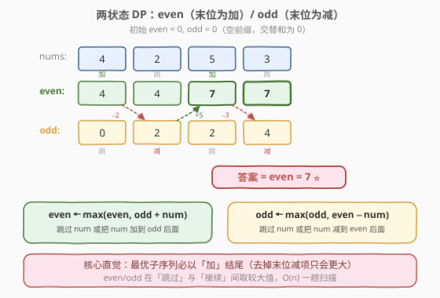
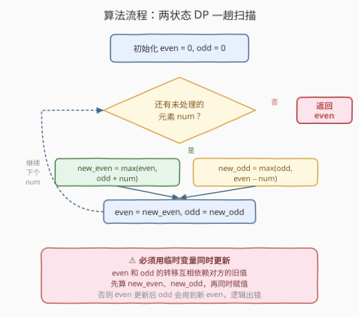

# 最大交替子序列和

- **题目名称**：最大交替子序列和
- **链接**：[1911. 最大交替子序列和](https://leetcode.cn/problems/maximum-alternating-subsequence-sum/)
- **难度**：中等
- **标签**：数组、动态规划、贪心

## 1. 题目概述

一个下标从 **0** 开始的数组的**交替和**定义为：偶数下标元素之和减去奇数下标元素之和，即 $\text{seq}[0] - \text{seq}[1] + \text{seq}[2] - \text{seq}[3] + \cdots$。

例如，`[4, 2, 5, 3]` 的交替和为 $(4 + 5) - (2 + 3) = 4$。

给定一个正整数数组 `nums`，你可以从中删除任意（包括零个）元素，得到一个**子序列**（保持原有相对顺序）。请返回所有可能子序列中**最大的交替和**。

**示例 1**：

```text
输入：nums = [4,2,5,3]
输出：7
解释：子序列 [4,2,5] 的交替和为 4 − 2 + 5 = 7，为最大值。
```

**示例 2**：

```text
输入：nums = [5,6,7,8]
输出：8
解释：子序列 [8] 的交替和为 8（单调递增数组只取末尾最大值即可）。
```

**示例 3**：

```text
输入：nums = [6,2,2,5,4,11,1,3,7,1]
输出：22
解释：子序列 [6,2,5,4,11,1,7] 的交替和为 6−2+5−4+11−1+7 = 22，为最大值。
```

**约束条件**：

- $1 \le \text{nums.length} \le 10^5$
- $1 \le \text{nums}[i] \le 10^5$

---

## 2. 解题思路

### 2.1 暴力思路

枚举 `nums` 的所有 $2^n$ 个子序列，对每个子序列计算交替和，取最大值。时间复杂度 $O(2^n \cdot n)$，$n$ 最大 $10^5$，完全不可行。

> 需要找到一种方法，在扫描数组时只维护少量状态，就能逐步得到最优解——这正是一维 DP 的典型场景。

### 2.2 核心观察：两状态 DP（even / odd）



子序列的交替和取决于每个被选元素位于**偶数位（加）**还是**奇数位（减）**。关键是：在扫描 `nums` 的过程中，我们只需要关心**当前子序列的末位是加还是减**，因为：

- 如果末位是**加**（偶数位），下一个被选元素只能出现在**奇数位（减）**或不被选。
- 如果末位是**减**（奇数位），下一个被选元素只能出现在**偶数位（加）**或不被选。

据此定义两个状态：

| 状态 | 含义 |
|------|------|
| `even` | 当前考虑过的前缀中，末位为**加**的子序列的最大交替和 |
| `odd`  | 当前考虑过的前缀中，末位为**减**的子序列的最大交替和 |

**状态转移**：对每个新元素 `num`，有两种选择——**跳过**或**接续**：

$$
\text{new\_even} = \max(\text{even},\; \text{odd} + \text{num})
$$

$$
\text{new\_odd} = \max(\text{odd},\; \text{even} - \text{num})
$$

- `even` 跳过 `num` → 保持 `even`；`odd` 接续 `num`（`num` 成为新的偶数位，加进去）→ `odd + num`。取较大。
- `odd` 跳过 `num` → 保持 `odd`；`even` 接续 `num`（`num` 成为新的奇数位，减去）→ `even - num`。取较大。

**初始化**：`even = 0, odd = 0`（空前缀的交替和为 0，由于 `nums[i]` 均为正数，至少会选一个元素使 `even > 0`）。

> 💡 **为什么答案是 `even` 而非 `max(even, odd)`？** 因为最优子序列一定以**加**结尾——如果末位是减（`odd`），去掉最后一个减项只会让和更大，所以 `even >= odd` 恒成立。

### 2.3 算法流程图



整体步骤：

1. 初始化 `even = 0, odd = 0`。
2. 遍历每个 `num`：
   - 用临时变量同时计算 `new_even = max(even, odd + num)` 和 `new_odd = max(odd, even - num)`。
   - 再同时赋值 `even = new_even, odd = new_odd`。
3. 返回 `even`。

> ⚠️ **必须用临时变量同时更新**：`even` 和 `odd` 的转移互相依赖对方的**旧值**。若先更新 `even` 再更新 `odd`，`odd` 会用到新的 `even`，导致逻辑错误。正确做法是先算出 `new_even`、`new_odd`，再一起赋值。

### 2.4 示例演算

![示例演算：nums = [4, 2, 5, 3]](../images/1911_example_walkthrough.svg)

以 `nums = [4, 2, 5, 3]` 逐步行算：

| 步 | num | even(旧) | odd(旧) | new_even | new_odd | 决策 |
|----|-----|----------|---------|----------|---------|------|
| 0  | 4   | 0        | 0       | max(0, 0+4) = **4** | max(0, 0−4) = 0 | even 接续 4 |
| 1  | 2   | 4        | 0       | max(4, 0+2) = 4 | max(0, 4−2) = **2** | odd 接续 2 |
| 2  | 5   | 4        | 2       | max(4, 2+5) = **7** | max(2, 4−5) = 2 | even 接续 5 |
| 3  | 3   | 7        | 2       | max(7, 2+3) = 7 | max(2, 7−3) = **4** | odd 接续 3 |

最终 `even = 7`，`odd = 4`，返回 `even = 7`。

对应的子序列为 `[4, 2, 5]`：交替和 $= 4 - 2 + 5 = 7$。最后一步虽然 `odd` 接续了 3（得 `odd = 4`，对应子序列 `[4, 2, 5, 3]` 交替和 $= 4 - 2 + 5 - 3 = 4$），但 `even = 7 > 4`，所以不加 3 更优。

---

## 3. 参考代码

### C++

```cpp
class Solution {
public:
    long long maxAlternatingSum(vector<int>& nums) {
        long long even = 0, odd = 0;
        for (int num : nums) {
            long long new_even = max(even, odd + num);
            long long new_odd  = max(odd,  even - num);
            even = new_even;
            odd  = new_odd;
        }
        return even;
    }
};
```

### Python

```python
class Solution:
    def maxAlternatingSum(self, nums: List[int]) -> int:
        even = 0
        odd = 0
        for num in nums:
            new_even = max(even, odd + num)
            new_odd  = max(odd,  even - num)
            even, odd = new_even, new_odd
        return even
```

> ⚠️ **数据类型注意**：`n` 最大 $10^5$，`nums[i]` 最大 $10^5$，交替和最大约 $10^{10}$，超过 `int` 范围。C++ 需用 `long long`，Python 自动处理大整数无需担心。

> 💡 **Python 的优雅写法**：利用元组解包 `even, odd = new_even, new_odd` 天然实现了「同时赋值」，无需显式声明临时变量，避免了顺序更新陷阱。

---

## 4. 复杂度分析

| 维度 | 复杂度 | 说明 |
|------|--------|------|
| 时间复杂度 | $O(n)$ | 一趟遍历 `nums`，每步 $O(1)$ 状态转移 |
| 空间复杂度 | $O(1)$ | 仅维护 `even`、`odd` 两个标量 |

---

## 5. 扩展：贪心解法（等价于买卖股票 II）

除了 DP，本题还有一个极其简洁的**贪心**视角。

> 💡 **关键观察**：将交替和拆开看，$\text{seq}[0] - \text{seq}[1] + \text{seq}[2] - \text{seq}[3] + \cdots = \text{seq}[0] + (\text{seq}[2] - \text{seq}[1]) + (\text{seq}[4] - \text{seq}[3]) + \cdots$。每个「减→加」的对子是一个**上升段**的差值。最优策略就是**抓住每一次上升**。

想象在 `nums` 前面补一个虚拟的 $0$，则最大交替和等于：

$$
\sum_{i=0}^{n-1} \max(0,\; \text{nums}[i] - \text{nums}[i-1]) \quad (\text{其中 } \text{nums}[-1] = 0)
$$

即**所有相邻上升差值之和**——这与 [122. 买卖股票的最佳时机 II](https://leetcode.cn/problems/best-time-to-buy-and-stock-ii/) 的贪心完全同构：每次「谷→峰」的涨幅都收入囊中。

**验证** `nums = [4, 2, 5, 3]`：

$$
\max(0, 4-0) + \max(0, 2-4) + \max(0, 5-2) + \max(0, 3-5) = 4 + 0 + 3 + 0 = 7 \checkmark
$$

### 贪心 C++ 代码

```cpp
class Solution {
public:
    long long maxAlternatingSum(vector<int>& nums) {
        long long ans = nums[0]; // 第一个元素：从虚拟 0 上升
        for (int i = 1; i < nums.size(); i++) {
            ans += max(0, nums[i] - nums[i - 1]);
        }
        return ans;
    }
};
```

### 贪心 Python 代码

```python
class Solution:
    def maxAlternatingSum(self, nums: List[int]) -> int:
        ans = nums[0]
        for i in range(1, len(nums)):
            ans += max(0, nums[i] - nums[i - 1])
        return ans
```

> ⚠️ 此贪心仅适用于 `nums[i]` **均为正数**的情形（保证从虚拟 0 到 `nums[0]` 的上升总是有益的）。若数组含负数，需退回 DP 解法，并视题意调整初始值（如 `even = -∞`）。

---

## 6. 面试要点

1. **为什么用两个状态 even/odd 而不是一个？**

   > 交替和的正负号取决于元素在子序列中的位置奇偶性。一个状态无法区分「末位是加」还是「末位是减」，而后续接续的符号完全由末位奇偶决定，因此必须用两个状态分别记录。

2. **为什么最终返回 `even` 而非 `max(even, odd)`？**

   > 最优子序列一定以「加」结尾。如果末位是「减」，去掉它后和只会增大，所以 `even >= odd` 恒成立，返回 `even` 即可。

3. **为什么初始化 `even = 0, odd = 0` 而不是负无穷？**

   > 题目保证 `nums[i]` 为正数，空子序列的交替和为 0。即使跳过所有元素，`even = 0` 也不会比选了正数更优。若数组含负数，则需将 `even` 初始化为 $-\infty$ 以避免「空子序列」被错误地当作最优。

4. **转移时为什么必须同时更新？**

   > `new_even` 依赖旧的 `odd`，`new_odd` 依赖旧的 `even`。若先更新 `even`，`odd` 的计算会用新的 `even`，导致状态污染。用临时变量先算后赋，或利用 Python 的元组解包，可避免此问题。

5. **贪心解法与 DP 的关系是什么？**

   > 贪心是 DP 在正整数约束下的**等价化简**。DP 的状态转移在正整数下恰好等价于「抓住每一次上升」，因此两者结果一致。贪心更简洁但适用范围窄（仅正整数），DP 更通用（可处理负数）。

---

## 7. 同类练习题

- [122. 买卖股票的最佳时机 II](https://leetcode.cn/problems/best-time-to-buy-and-sell-stock-ii/)：贪心「抓住每次上升」的经典题，与本题贪心解法完全同构
- [152. 乘积最大子数组](https://leetcode.cn/problems/maximum-product-subarray/)（[题解](../0101-0200/152_乘积最大子数组.md)）：同样维护 max/min 两状态的滚动 DP，对照「双状态交替」的通用范式
- [198. 打家劫舍](https://leetcode.cn/problems/house-robber/)（[题解](../0101-0200/198_打家劫舍.md)）：一维两状态 DP（选/不选当前位置），与本题 even/odd 的「接续/跳过」结构相似
- [740. 删除并获得点数](https://leetcode.cn/problems/delete-and-earn/)（[题解](../0701-0800/740_删除并获得点数.md)）：值域建桶后转化为打家劫舍，同属「两状态选/不选」DP 家族
- [213. 打家劫舍 II](https://leetcode.cn/problems/house-robber-ii/)（[题解](../0201-0300/213_打家劫舍II.md)）：环形约束下的两状态 DP，扩展了状态模型的适用边界
