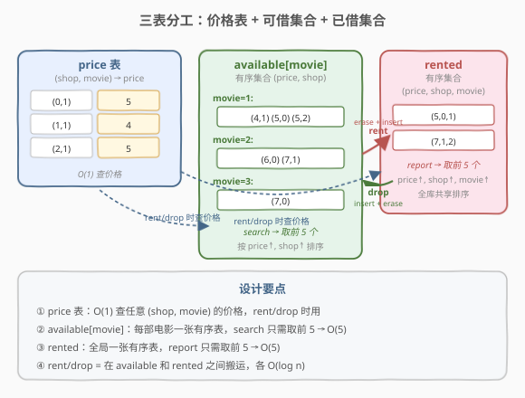
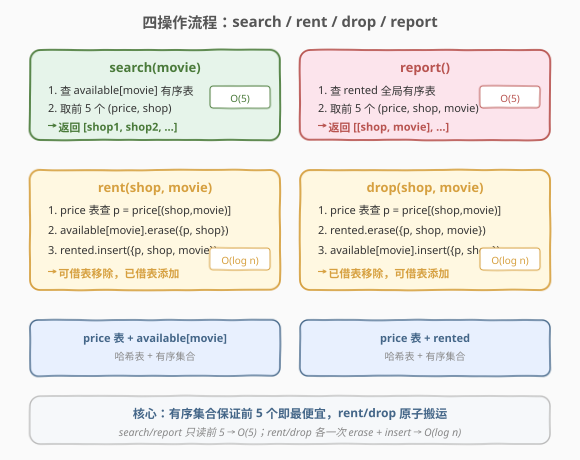
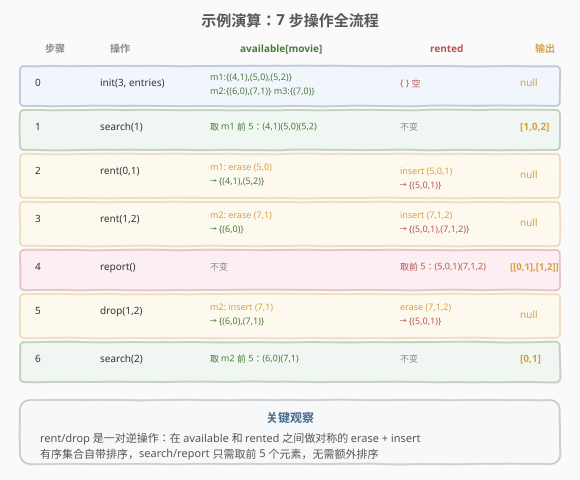

# 设计电影租借系统

- **题目名称**：设计电影租借系统
- **链接**：[1912. 设计电影租借系统](https://leetcode.cn/problems/design-movie-rental-system/)
- **难度**：困难
- **标签**：设计、哈希表、有序集合

## 1. 题目概述

你有一个电影租借公司和 $n$ 个电影商店，想要实现一个支持**查询、预订、返还和报告**的电影租借系统。

所有电影用二维整数数组 `entries` 表示，其中 `entries[i] = [shopi, moviei, pricei]` 表示商店 `shopi` 有一份电影 `moviei` 的拷贝，租借价格为 `pricei`。每个商店**至多一份**某电影的拷贝。

系统支持四种操作：

| 操作 | 说明 |
|------|------|
| **Search(movie)** | 找拥有指定电影且**未借出**的商店中**最便宜的 5 个**，按价格升序，价格相同按 shop 升序。不足 5 个返回全部，无则返回空列表 |
| **Rent(shop, movie)** | 从指定商店借出指定电影（保证该电影未借出） |
| **Drop(shop, movie)** | 在指定商店返还**之前已借出**的指定电影 |
| **Report()** | 返回**最便宜的 5 部已借出电影** `[shop, movie]`，按价格升序，价格相同按 shop 升序，再相同按 movie 升序 |

**示例 1**：

```text
输入：
["MovieRentingSystem", "search", "rent", "rent", "report", "drop", "search"]
[[3, [[0,1,5],[0,2,6],[0,3,7],[1,1,4],[1,2,7],[2,1,5]]], [1], [0,1], [1,2], [], [1,2], [2]]
输出：
[null, [1,0,2], null, null, [[0,1],[1,2]], null, [0,1]]

解释：
init  → 3 个商店，6 条 entry
search(1) → [1,0,2]  （商店 1 价格 4 最便宜，0 和 2 价格 5 按 shop 排）
rent(0,1) → 商店 0 借出电影 1
rent(1,2) → 商店 1 借出电影 2
report()  → [[0,1],[1,2]]（已借出中 (5,0,1) 和 (7,1,2)，按价格排）
drop(1,2) → 商店 1 归还电影 2
search(2) → [0,1]（商店 0 价格 6，商店 1 价格 7）
```

**约束条件**：

- $1 \le n \le 3 \times 10^5$
- $1 \le \text{entries.length} \le 10^5$
- $0 \le \text{shopi} < n$
- $1 \le \text{moviei}, \text{pricei} \le 10^4$
- 每个商店至多有一份某电影的拷贝
- `search`、`rent`、`drop`、`report` 的调用总共不超过 $10^5$ 次

---

## 2. 解题思路

### 2.1 暴力思路

最直观的做法是用一个数组存所有 `(shop, movie, price, rented)` 状态记录：

- `search(movie)`：遍历全部记录，筛出 `movie` 匹配且未借出的，排序后取前 5 → $O(E \log E)$
- `rent/drop`：线性扫描找匹配记录，改 `rented` 标志 → $O(E)$
- `report()`：遍历全部记录，筛出已借出的，排序取前 5 → $O(E \log E)$

$E$ 可达 $10^5$，操作总数也 $10^5$，总时间 $O(10^{10})$，显然超时。问题出在**每次操作都做线性扫描和重排序**。

### 2.2 核心观察：三表分工 + 有序集合



关键洞察：**不同操作需要不同的排序视角，用三张表各司其职**：

> 💡 **价格只在初始化时确定，之后不变**——因此可以预先存好 `(shop, movie) → price` 的映射，`rent`/`drop` 时 $O(1)$ 查询。真正需要动态维护的是「可借集合」和「已借集合」两个有序结构。

三张表的设计：

| 数据结构 | 类型 | 键 | 值/元素 | 服务操作 |
|----------|------|-----|---------|----------|
| **price** | 哈希表 | `(shop, movie)` | `price` | `rent`/`drop` 查价格 |
| **available** | 有序集合（按 movie 分组） | `movie` | `(price, shop)` 有序集 | `search` 取前 5 |
| **rented** | 有序集合（全局） | — | `(price, shop, movie)` 有序集 | `report` 取前 5 |

> ⚠️ **排序键的微妙差异**：`available` 按 `(price, shop)` 排——因为 `search` 只返回 shop 列表，同一部电影内 shop 唯一；`rented` 按 `(price, shop, movie)` 排——因为 `report` 返回 `[shop, movie]`，不同电影可能 shop 相同，需要 movie 做第三级排序。

### 2.3 算法流程图



四个操作的执行逻辑：

- **search(movie)**：直接遍历 `available[movie]` 有序集的前 5 个元素，提取 shop 返回。$O(5) = O(1)$。
- **report()**：直接遍历 `rented` 有序集的前 5 个元素，提取 `[shop, movie]` 返回。$O(5) = O(1)$。
- **rent(shop, movie)**：查 `price` 得 $p$，从 `available[movie]` 删除 `(p, shop)`，向 `rented` 插入 `(p, shop, movie)`。$O(\log n)$。
- **drop(shop, movie)**：查 `price` 得 $p$，从 `rented` 删除 `(p, shop, movie)`，向 `available[movie]` 插入 `(p, shop)`。$O(\log n)$。

> 💡 `rent` 和 `drop` 是一对**互逆操作**：一个把条目从 `available` 搬到 `rented`，另一个反方向搬回。各自只需一次 `erase` + 一次 `insert`，有序集合的平衡树保证 $O(\log n)$。

### 2.4 示例演算

以题目示例 `entries = [[0,1,5],[0,2,6],[0,3,7],[1,1,4],[1,2,7],[2,1,5]]` 为例，逐步演示三表状态变化：



关键步骤解读：

- **init 后**：`available[1] = {(4,1),(5,0),(5,2)}`（按 price↑, shop↑ 排好序），`rented = {}` 空。
- **search(1)**：取 `available[1]` 前 3 个（不足 5），返回 shop 列表 `[1, 0, 2]`。
- **rent(0,1)**：从 `available[1]` 删除 `(5,0)`，向 `rented` 插入 `(5,0,1)`。注意 `available[1]` 从 3 个变 2 个。
- **rent(1,2)**：从 `available[2]` 删除 `(7,1)`，向 `rented` 插入 `(7,1,2)`。`rented = {(5,0,1),(7,1,2)}`。
- **report()**：取 `rented` 前 2 个，返回 `[[0,1],[1,2]]`（按 price 排，5 < 7）。
- **drop(1,2)**：从 `rented` 删除 `(7,1,2)`，向 `available[2]` 插入 `(7,1)`。`available[2]` 恢复为 `{(6,0),(7,1)}`。
- **search(2)**：取 `available[2]` 前 2 个，返回 `[0, 1]`。

---

## 3. 参考代码

### C++

```cpp
class MovieRentingSystem {
    map<pair<int, int>, int> price;                        // (shop, movie) -> price
    unordered_map<int, set<pair<int, int>>> available;     // movie -> {(price, shop)}
    set<tuple<int, int, int>> rented;                      // {(price, shop, movie)}

  public:
    MovieRentingSystem(int n, vector<vector<int>>& entries) {
        for (auto& e : entries) {
            int shop = e[0], movie = e[1], p = e[2];
            price[{shop, movie}] = p;
            available[movie].insert({p, shop});
        }
    }

    vector<int> search(int movie) {
        vector<int> res;
        auto it = available.find(movie);
        if (it == available.end()) return res;
        int cnt = 0;
        for (auto& [p, shop] : it->second) {
            if (cnt++ >= 5) break;
            res.push_back(shop);
        }
        return res;
    }

    void rent(int shop, int movie) {
        int p = price[{shop, movie}];
        available[movie].erase({p, shop});
        rented.insert({p, shop, movie});
    }

    void drop(int shop, int movie) {
        int p = price[{shop, movie}];
        rented.erase({p, shop, movie});
        available[movie].insert({p, shop});
    }

    vector<vector<int>> report() {
        vector<vector<int>> res;
        int cnt = 0;
        for (auto& [p, shop, movie] : rented) {
            if (cnt++ >= 5) break;
            res.push_back({shop, movie});
        }
        return res;
    }
};
```

### Python

```python
from sortedcontainers import SortedList

class MovieRentingSystem:
    def __init__(self, n: int, entries: List[List[int]]):
        self.price = {}                           # (shop, movie) -> price
        self.available = defaultdict(SortedList)  # movie -> SortedList((price, shop))
        self.rented = SortedList()                # (price, shop, movie)
        for shop, movie, p in entries:
            self.price[(shop, movie)] = p
            self.available[movie].add((p, shop))

    def search(self, movie: int) -> List[int]:
        return [shop for _, shop in self.available[movie][:5]]

    def rent(self, shop: int, movie: int) -> None:
        p = self.price[(shop, movie)]
        self.available[movie].remove((p, shop))
        self.rented.add((p, shop, movie))

    def drop(self, shop: int, movie: int) -> None:
        p = self.price[(shop, movie)]
        self.rented.remove((p, shop, movie))
        self.available[movie].add((p, shop))

    def report(self) -> List[List[int]]:
        return [[shop, movie] for _, shop, movie in self.rented[:5]]
```

> 💡 **语言选择**：C++ 的 `std::set` / `std::map` 天然支持 `pair` 和 `tuple` 的字典序比较，是本题的理想工具；Python 用 `sortedcontainers.SortedList`（LeetCode 已内置），切片 `[:5]` 取前 5 极其简洁。若 Python 环境无 `sortedcontainers`，可用 `heapq` + 懒删除替代，但实现更复杂。

---

## 4. 复杂度分析

| 维度 | 操作 | 复杂度 | 说明 |
|------|------|--------|------|
| 时间复杂度 | init | $O(E \log E)$ | 每条 entry 一次有序集合插入 $O(\log E)$，共 $E$ 条 |
| 时间复杂度 | search | $O(5) = O(1)$ | 遍历有序集前 5 个元素 |
| 时间复杂度 | rent | $O(\log E)$ | 一次 `erase` + 一次 `insert` |
| 时间复杂度 | drop | $O(\log E)$ | 一次 `erase` + 一次 `insert` |
| 时间复杂度 | report | $O(5) = O(1)$ | 遍历有序集前 5 个元素 |
| 空间复杂度 | 全部 | $O(E)$ | price 表 $O(E)$ + available $O(E)$ + rented $O(E)$（任一时刻 available + rented = E） |

> ⚠️ `rent`/`drop` 的 $O(\log E)$ 来自平衡树的查找与调整。$E \le 10^5$，$\log E \approx 17$，$10^5$ 次操作总计约 $1.7 \times 10^6$ 次比较，远在时间限制内。

---

## 5. 扩展：堆 + 懒删除替代方案

若不允许使用有序集合（如 Python 环境无 `sortedcontainers`），可用**最小堆 + 懒删除**替代：

- `available[movie]` 用最小堆存 `(price, shop)`，`search` 时弹出前 5 个有效元素（跳过已借出的）后放回。
- `rented` 用最小堆存 `(price, shop, movie)`，`report` 时弹出前 5 个有效元素（跳过已归还的）后放回。
- 维护一个 `rented_set`（哈希集合）记录当前已借出的 `(shop, movie)`，用于懒删除判定。

代价是 `search`/`report` 的常数变大（需要弹出再放回），但渐近复杂度仍为 $O(5 \log E)$。此方案的核心思想与 [239. 滑动窗口最大值](../0201-0300/239_滑动窗口最大值.md) 的单调队列懒删除一脉相承——堆顶可能过期，用时再清理。

---

## 6. 面试要点

1. **为什么需要三张表而不是一张？**
   - `search` 需要按 movie 分组、按 `(price, shop)` 排序；`report` 需要全局按 `(price, shop, movie)` 排序。两种排序视角无法用一张表同时满足（除非每次重排序，但那是 $O(E \log E)$）。分表让每种操作都有现成的有序结构，各取前 5 即可。

2. **`available` 和 `rented` 的排序键为什么不同？**
   - `available` 按 `(price, shop)` 排：同一部电影内 shop 唯一，两级排序足够，`search` 只需返回 shop。
   - `rented` 按 `(price, shop, movie)` 排：不同电影可能来自同一 shop，`report` 返回 `[shop, movie]`，需要 movie 做第三级排序。

3. **`price` 表能否省掉？**
   - 不能。`rent`/`drop` 时需要知道 `(shop, movie)` 的价格才能在有序集中定位元素。没有 `price` 表就得线性扫描 `available` 或 `rented` 查找，退化为 $O(E)$。

4. **为什么 `rent`/`drop` 是 $O(\log n)$ 而不是 $O(1)$？**
   - 有序集合（平衡树）的插入和删除需要 $O(\log n)$ 调整树结构。这是用有序集合换取「前 5 查询 $O(1)$」的代价。若用堆 + 懒删除，单次操作也是 $O(\log n)$。

5. **如果 `search`/`report` 不是取前 5 而是取前 K（K 很大）会怎样？**
   - 遍历前 K 个元素变为 $O(K)$。当 $K$ 接近 $E$ 时退化为 $O(E)$，此时可考虑分块或线段树等结构优化。本题 $K = 5$ 是常数，不受影响。

---

## 7. 同类练习题

- [146. LRU 缓存](https://leetcode.cn/problems/lru-cache/)（[题解](../0101-0200/146_LRU缓存.md)）：设计题招牌，哈希表 + 双向链表分工，与本题三表分工思想同构
- [460. LFU 缓存](https://leetcode.cn/problems/lfu-cache/)（[题解](../0101-0200/460_LFU缓存.md)）：更复杂的设计题，频率桶 + 哈希表，对比本题的有序集合选型
- [981. 基于时间的键值存储](https://leetcode.cn/problems/time-based-key-value-store/)（[题解](../0901-1000/981_基于时间的键值存储.md)）：HashMap + 有序数组二分，另一种「按需查询最值」的设计范式
- [239. 滑动窗口最大值](https://leetcode.cn/problems/sliding-window-maximum/)（[题解](../0201-0300/239_滑动窗口最大值.md)）：堆 + 懒删除思想，对比本题扩展部分
- [729. 我的日程安排表 I](https://leetcode.cn/problems/my-calendar-i/)：设计题 + 有序集合判定区间重叠，对比有序集合的查找应用
