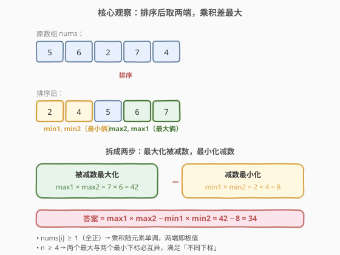
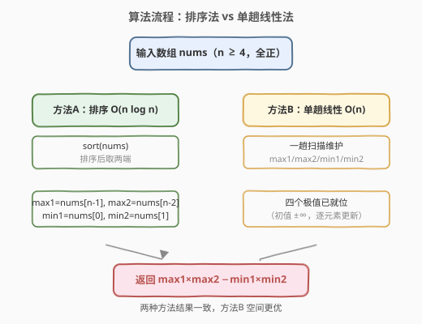
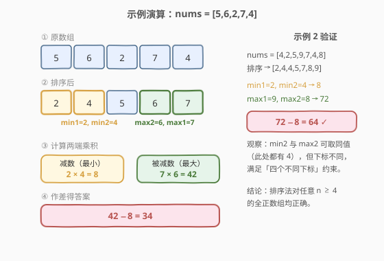

# LeetCode 两个数对之间的最大乘积差 题解

## 1. 题目概述

- **标题 / 题号**：两个数对之间的最大乘积差（#1913，easy）
- **链接**：https://leetcode.cn/problems/maximum-product-difference-between-two-pairs/
- **难度**：简单
- **标签**：数组、贪心、排序、数学

**题意**：两个数对 `(a, b)` 和 `(c, d)` 之间的**乘积差**定义为 $(a \times b) - (c \times d)$。例如 `(5, 6)` 与 `(2, 7)` 的乘积差是 $5 \times 6 - 2 \times 7 = 16$。

给定整数数组 `nums`，选出四个**不同的**下标 $w, x, y, z$，使数对 `(nums[w], nums[x])` 与 `(nums[y], nums[z])` 之间的乘积差取到**最大值**，返回该最大值。

**示例 1**：

```text
输入：nums = [5,6,2,7,4]
输出：34
解释：选下标 1,3 构成 (6,7)，选下标 2,4 构成 (2,4)。
      乘积差 = 6×7 − 2×4 = 42 − 8 = 34
```

**示例 2**：

```text
输入：nums = [4,2,5,9,7,4,8]
输出：64
解释：选下标 3,6 构成 (9,8)，选下标 1,5 构成 (2,4)。
      乘积差 = 9×8 − 2×4 = 72 − 8 = 64
```

**约束**：

- $4 \le \text{nums.length} \le 10^4$
- $1 \le \text{nums[i]} \le 10^4$

> 💡 **审题关键**：① 四个下标必须**互不相同**，但值可以相同（示例 2 中 `min2` 与 `max2` 都取到 `4`，只是来自不同下标）；② 题目只问**最大值**，不要求输出下标方案；③ $\text{nums[i]} \ge 1$——所有元素为**正整数**，这一约束是贪心正确性的基石（见 2.2）。

## 2. 解题思路

### 2.1 暴力思路：枚举四元组

最直观的做法是枚举所有满足 $w \ne x \ne y \ne z$（两两不同下标）的四元组，计算每组数对的乘积差，取最大值。

- **正确性**：穷举所有方案，取最大，显然正确。
- **效率**：四重循环 $\binom{n}{4}$ 量级，约 $O(n^4)$。对 $n = 10^4$ 完全不可行（$10^{16}$ 次运算）。

> ⚠️ 暴力法的浪费在于「盲目试所有组合」。实际上我们只需回答：**哪两个数相乘最大、哪两个数相乘最小**——这只需要数组的四个极值，根本不必枚举配对。

### 2.2 核心观察：排序取两端



关键洞察分三步：

**第一步：把目标拆成两个独立子目标。** 乘积差 $P = (\text{被减数}) - (\text{减数})$，要使 $P$ 最大，就是要**被减数尽可能大**且**减数尽可能小**。由于四个下标互异，被减数对 `(w, x)` 与减数对 `(y, z)` 各占两个元素，只要被减数对的两元素与减数对的两元素不重合即可。

**第二步：全正数让「乘积」与「元素大小」单调挂钩。** 题目保证 $\text{nums[i]} \ge 1$，所有元素为正。对正数而言：

$$a_1 \le a_2 \le b_1 \le b_2 \implies a_1 \cdot a_2 \le b_1 \cdot b_2$$

即「两个较小的数之积 $\le$ 两个较大的数之积」。因此：
- **被减数最大** = 数组中**两个最大元素**之积 $\text{max1} \times \text{max2}$；
- **减数最小** = 数组中**两个最小元素**之积 $\text{min1} \times \text{min2}$。

**第三步：四个极值的下标天然互异。** $n \ge 4$ 保证「两个最大」与「两个最小」至少能取到 4 个不同位置。即便排序后出现 $\text{min2} = \text{max2}$（如示例 2 排序后 `[2,4,4,5,7,8,9]`，`min2=4`、`max2` 其实是 `8`，但若数组更短如 `[2,4,4,9]` 则 `min2=4`、`max2=4`），它们也来自**不同下标**，满足约束。

$$\boxed{\text{答案} = \text{max1} \times \text{max2} - \text{min1} \times \text{min2}}$$

> 💡 **为什么「全正」是关键？** 若允许负数，「两个最小」之积可能是两个负数相乘得大正数（如 $(-5)\times(-4)=20$），反而比两个正数之积更大——此时「被减数最大」未必来自两个最大元素，「减数最小」也未必来自两个最小元素，结论需改写（见第 5 节扩展）。本题 $\text{nums[i]} \ge 1$ 恰好排除了这种翻转，让排序取端点的贪心直接成立。

> ⚠️ **最高频陷阱**：误以为「两个最大」与「两个最小」可能下标冲突。事实上 $n \ge 4$ 时，排序后 `nums[0], nums[1]`（最小俩）与 `nums[n-2], nums[n-1]`（最大俩）至多在 $n=4$ 且中间两值相等时数值相同，但**下标** $0,1,n-2,n-1$ 在 $n \ge 4$ 时恒为四个不同整数，绝不会冲突。

### 2.3 算法流程图



**方法 A（排序法）**：

1. 对 `nums` 升序排序。
2. 取 $\text{min1} = \text{nums}[0]$，$\text{min2} = \text{nums}[1]$，$\text{max2} = \text{nums}[n-2]$，$\text{max1} = \text{nums}[n-1]$。
3. 返回 $\text{max1} \times \text{max2} - \text{min1} \times \text{min2}$。

**方法 B（单趟线性法）**：

1. 初始化 $\text{max1}=\text{max2}=-\infty$，$\text{min1}=\text{min2}=+\infty$。
2. 遍历 `nums`，对每个 `x`：
   - 更新两个最大值：若 $x > \text{max1}$，则 $\text{max2} \leftarrow \text{max1},\ \text{max1} \leftarrow x$；否则若 $x > \text{max2}$，则 $\text{max2} \leftarrow x$。
   - 更新两个最小值：若 $x < \text{min1}$，则 $\text{min2} \leftarrow \text{min1},\ \text{min1} \leftarrow x$；否则若 $x < \text{min2}$，则 $\text{min2} \leftarrow x$。
3. 返回 $\text{max1} \times \text{max2} - \text{min1} \times \text{min2}$。

> 💡 **两种方法怎么选？** 排序法代码极简、不易出错，$O(n \log n)$ 对 $n \le 10^4$ 毫无压力，是面试首选；单趟线性法把时间压到 $O(n)$、空间 $O(1)$（不修改原数组），适合要求「原地 / 不破坏输入」或 $n$ 更大的场景。两者结果完全一致。

### 2.4 示例演算

以官方样例演示排序取端点的过程：



| 示例 | `nums` | 排序后 | $\text{min1}\times\text{min2}$ | $\text{max1}\times\text{max2}$ | 答案 |
|------|--------|--------|-------------------------------|-------------------------------|------|
| 1 | `[5,6,2,7,4]` | `[2,4,5,6,7]` | $2\times4=8$ | $7\times6=42$ | $42-8=34$ |
| 2 | `[4,2,5,9,7,4,8]` | `[2,4,4,5,7,8,9]` | $2\times4=8$ | $9\times8=72$ | $72-8=64$ |

**示例 1 排序后**：两端分别为 `2,4`（最小俩）与 `6,7`（最大俩），中间的 `5` 不参与计算。$42 - 8 = 34$。

**示例 2 排序后**：注意排序结果 `[2,4,4,5,7,8,9]` 中出现了两个 `4`。`min2` 取的是 `nums[1]=4`（下标 1），而 `max2` 取的是 `nums[n-2]=8`（下标 5）。即便数组更短使 `min2` 与 `max2` 数值相等，它们也来自不同下标，约束满足。

> 💡 **观察要点**：① 排序后只有最左两个和最右两个参与运算，中间元素全部忽略——这正是把 $O(n^4)$ 暴力压缩到 $O(n \log n)$ 的关键；② 值的重复不影响正确性，因为题目约束的是「下标不同」而非「值不同」。

## 3. 参考代码

### C++（排序法）

```cpp
class Solution {
public:
    int maxProductDifference(vector<int>& nums) {
        sort(nums.begin(), nums.end());
        int n = nums.size();
        return nums[n - 1] * nums[n - 2] - nums[0] * nums[1];
    }
};
```

### C++（单趟线性法，不修改原数组）

```cpp
class Solution {
public:
    int maxProductDifference(vector<int>& nums) {
        int max1 = INT_MIN, max2 = INT_MIN;
        int min1 = INT_MAX, min2 = INT_MAX;
        for (int x : nums) {
            if (x > max1) { max2 = max1; max1 = x; }
            else if (x > max2) { max2 = x; }
            if (x < min1) { min2 = min1; min1 = x; }
            else if (x < min2) { min2 = x; }
        }
        return max1 * max2 - min1 * min2;
    }
};
```

### Python（排序法）

```python
class Solution:
    def maxProductDifference(self, nums: List[int]) -> int:
        nums.sort()
        return nums[-1] * nums[-2] - nums[0] * nums[1]
```

### Python（单趟线性法）

```python
class Solution:
    def maxProductDifference(self, nums: List[int]) -> int:
        max1 = max2 = float("-inf")
        min1 = min2 = float("inf")
        for x in nums:
            if x > max1:
                max2, max1 = max1, x
            elif x > max2:
                max2 = x
            if x < min1:
                min2, min1 = min1, x
            elif x < min2:
                min2 = x
        return max1 * max2 - min1 * min2
```

### Python（heapq 一行流）

```python
import heapq

class Solution:
    def maxProductDifference(self, nums: List[int]) -> int:
        largest = heapq.nlargest(2, nums)
        smallest = heapq.nsmallest(2, nums)
        return largest[0] * largest[1] - smallest[0] * smallest[1]
```

> 💡 **写法对照**：① 排序法最直观，一行核心逻辑，面试默认先写这版；② 单趟线性法把时间压到 $O(n)$ 且不破坏输入，适合强调「原地 / 只读」的场景；③ `heapq` 版借助标准库的 `nlargest/nsmallest`（内部基于堆，$O(n \log 2) = O(n)$），Pythonic 且语义清晰，可作为口述替代方案。三版结果一致。

> 💡 **维护「前两大 / 前两小」的套路**：单趟线性法的 `if/elif` 链是经典模板——遇到新元素先与「第一」比较，命中则把旧的「第一」降级为「第二」、新元素顶上；否则与「第二」比较。这个模式在 [528. 按权重随机选择](../0501-0600/528_按权重随机选择.md) 的前缀和、[334. 递增的三元子序列](../0301-0400/334_递增的三元子序列.md) 的双阈值维护中反复出现，值得熟记。

## 4. 复杂度分析

| 维度 | 排序法 | 单趟线性法 | 说明 |
|------|--------|-----------|------|
| 时间复杂度 | $O(n \log n)$ | $O(n)$ | 排序法瓶颈在 `sort`；线性法一趟遍历，每元素 $O(1)$ 更新四个极值 |
| 空间复杂度 | $O(\log n)$ | $O(1)$ | 排序法为递归栈（快排/内省排序）；线性法仅 4 个标量 |

> 💡 $n \le 10^4$，两种方法都远在时限内。本题的优雅之处在于把「$O(n^4)$ 四元组枚举」化简为「$O(n \log n)$ 排序取端点」甚至「$O(n)$ 单趟找四个极值」——关键在于识别出「全正数 → 乘积随元素单调 → 端点即极值」这一结构。

## 5. 扩展：若元素允许为负会怎样？

本题能成立「两个最大之积最大、两个最小之积最小」依赖于 $\text{nums[i]} \ge 1$（全正）。若放宽为元素可负（如 `[-10, -8, 3, 5]`），结论需调整：

- **被减数最大**：候选有「两个最大正数之积」与「两个最小负数之积」（负负得正）。取两者较大者：$\max(\text{max1}\cdot\text{max2},\ \text{min1}\cdot\text{min2})$。
- **减数最小**：候选有「最大正数 × 最小负数」（异号得负，最小）与「两个最大正数之积」中较小者等。一般地，乘积的最小值出现在「最大 × 最小」（异号最负）：$\min(\text{max1}\cdot\text{min1},\ \text{max2}\cdot\text{min2},\ \ldots)$。
- 但四个下标仍需互异，被减数对与减数对的元素不能共用——需在选极值时避免下标冲突，比全正情形复杂。

> ⚠️ 本题保证 $\text{nums[i]} \ge 1$，故无需此处理。理解「全正」在证明中的作用，有助于在含负数变体题（如 [628. 三个数的最大乘积](https://leetcode.cn/problems/maximum-product-of-three-numbers/)）中快速识别需要同时考察「两负一正」与「三正」两种候选。

## 6. 面试要点

**Q1：为什么最大乘积差一定来自「两个最大」与「两个最小」？**

> 因为 $\text{nums[i]} \ge 1$ 全正，乘积随元素大小单调——两个较大正数之积严格不小于两个较小正数之积。所以被减数取两个最大、减数取两个最小时，被减数最大且减数最小，差值最大。

**Q2：四个下标互异的约束如何保证？**

> $n \ge 4$ 时，排序后 `nums[0], nums[1], nums[n-2], nums[n-1]` 的下标 $0, 1, n-2, n-1$ 是四个不同整数（$n \ge 4 \implies n-2 \ge 2 > 1$）。即便中间数值相等，下标也绝不重复。

**Q3：排序法和单趟线性法各有什么取舍？**

> 排序法代码极简、不易错，$O(n \log n)$ 对 $n \le 10^4$ 足够，是面试默认首选；单趟线性法 $O(n)$ 时间、$O(1)$ 空间且不修改原数组，适合「输入只读」或 $n$ 更大的场景。两者结果一致，按需选择。

**Q4：维护「前两大 / 前两小」的 `if/elif` 链为什么不能用两个独立 `if`？**

> 若用两个独立 `if`，同一元素可能同时命中「更新第一」和「更新第二」两个分支，导致该元素被重复计入（既当第一又当第二），破坏「四个不同元素」的语义。`elif` 保证每个元素至多更新一次「最大」链和一次「最小」链，且旧的「第一」降级为「第二」后才比较「第二」，避免重复。

**Q5：如果题目改为「三个数对」或「最大乘积和」会怎样？**

> 思路可迁移：仍是「最大化正贡献项、最小化负贡献项」。但项数增多后极值选取需更小心，且含负数时「负负得正」的翻转会更频繁。核心仍是「识别单调性结构 → 取端点」，本题是其最简形态。

> 💡 **一句话总结**：全正数组 + 乘积单调 → 排序取两端 → $\text{max1}\cdot\text{max2} - \text{min1}\cdot\text{min2}$，$O(n \log n)$ 甚至 $O(n)$ 一趟搞定。

## 同类练习题

| # | 题目 | 与本题的关联 |
|---|------|-------------|
| 628 | [三个数的最大乘积](https://leetcode.cn/problems/maximum-product-of-three-numbers/) | 含负数版的「取极值最大化乘积」，需同时考察「三正」与「两负一正」两种候选，对照本题全正的简化情形 |
| 414 | [第三大的数](https://leetcode.cn/problems/third-maximum-number/) | 单趟维护「前三大」的 `if/elif` 链模板，与本题维护「前两大 / 前两小」同源，体会「降级链」维护第 k 极值的通用写法 |
| 334 | [递增的三元子序列](https://leetcode.cn/problems/increasing-triplet-subsequence/)（[题解](../0301-0400/334_递增的三元子序列.md)） | 贪心双阈值 `first/second` 的 $O(n)$ 维护，与本题「前两大 / 前两小」同为「单趟维护前 k 极值」家族 |
| 561 | [数组拆分](https://leetcode.cn/problems/array-partition/) | 排序后取相邻配对求最大最小和，同样是「排序 + 端点/相邻取值」的贪心结构，对照本题取两端作差 |
