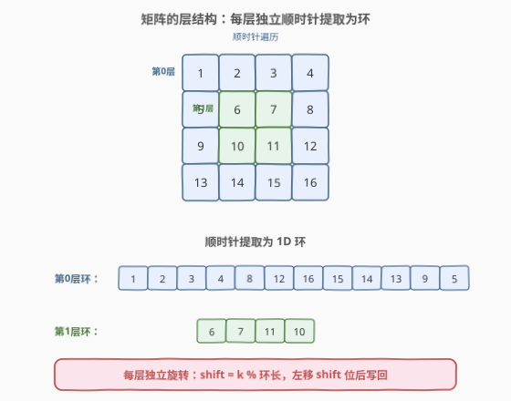
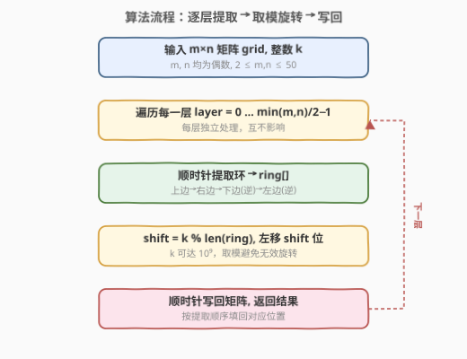
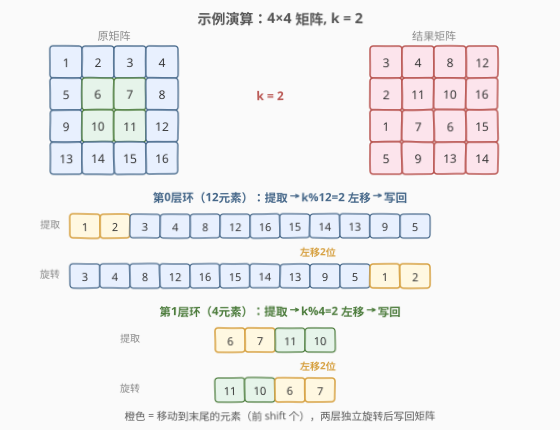

# LeetCode 循环轮转矩阵 题解

## 1. 题目概述

- **标题 / 题号**：循环轮转矩阵（#1914，medium）
- **链接**：https://leetcode.cn/problems/cyclically-rotating-a-grid/
- **难度**：中等
- **标签**：数组、矩阵、模拟

**题意**：给定一个大小为 $m \times n$ 的整数矩阵 `grid`，其中 $m$ 和 $n$ 都是**偶数**；另给定一个整数 $k$。

矩阵由若干层组成（类似洋葱圈），每种颜色代表一层。矩阵的**循环轮转**通过分别轮转每一层完成：在一次轮转操作中，层中的每个元素取代其**逆时针方向**的相邻元素。

返回执行 $k$ 次循环轮转后的矩阵。

**示例 1**：

```text
输入：grid = [[40,10],[30,20]], k = 1
输出：[[10,20],[40,30]]
解释：2×2 矩阵只有一层。逆时针轮转 1 次：
      40→左下, 10→左上, 20→右上, 30→右下
```

**示例 2**：

```text
输入：grid = [[1,2,3,4],[5,6,7,8],[9,10,11,12],[13,14,15,16]], k = 2
输出：[[3,4,8,12],[2,11,10,16],[1,7,6,15],[5,9,13,14]]
解释：4×4 矩阵有 2 层。外层 12 元素轮转 2 次，内层 4 元素轮转 2 次。
```

**约束**：

- $m == \text{grid.length}$
- $n == \text{grid[i].length}$
- $2 \le m, n \le 50$
- $m$ 和 $n$ 都是偶数
- $1 \le \text{grid[i][j]} \le 5000$
- $1 \le k \le 10^9$

> 💡 **审题关键**：① 每层**独立**轮转，互不影响；② 一次轮转 = 每个元素移动到**逆时针**相邻位置；③ $k$ 可达 $10^9$，逐次模拟必超时，需取模优化。

## 2. 解题思路

### 2.1 暴力思路：逐次模拟

最直观的做法是模拟 $k$ 次轮转：每次遍历每一层，将每个元素移动到逆时针相邻位置。

- **正确性**：忠实模拟，显然正确。
- **效率**：每次轮转 $O(m \times n)$，$k$ 次共 $O(k \times m \times n)$。$k$ 可达 $10^9$，$m \times n$ 可达 $2500$，总运算量 $\sim 2.5 \times 10^{12}$，完全不可行。

> ⚠️ 关键浪费在于「重复旋转」：一个长度为 $L$ 的环旋转 $L$ 次后回到原位，因此旋转 $k$ 次等价于旋转 $k \bmod L$ 次。

### 2.2 核心观察：逐层提取环 + 取模旋转



解题分三步：

**第一步：识别层结构。** 矩阵由 $\min(m, n) / 2$ 个同心环组成（$m, n$ 均为偶数保证每层完整）。第 $l$ 层（$l$ 从 0 开始）的边界为：

$$\text{top} = l,\; \text{bottom} = m - 1 - l,\; \text{left} = l,\; \text{right} = n - 1 - l$$

**第二步：顺时针提取环为一维数组。** 沿「上边从左到右 → 右边从上到下 → 下边从右到左 → 左边从下到上」的顺序，将每层环的元素提取为一维数组 `ring`。

> 💡 **为什么选顺时针？** 提取方向的选择不影响正确性，但顺时针是最自然的遍历方向（与 [54. 螺旋矩阵](https://leetcode.cn/problems/spiral-matrix/) 的遍历顺序一致）。关键是**提取和写回用同一方向**，保证位置对应。

**第三步：取模 + 左移旋转。** 环长为 $L = \text{len(ring)}$，旋转 $k$ 次等价于旋转 $k \bmod L$ 次。逆时针轮转 1 次对应环数组的**左移 1 位**（每个元素前移一位）。因此：

$$\text{new\_ring} = \text{ring}[\text{shift}:] + \text{ring}[:\text{shift}], \quad \text{shift} = k \bmod L$$

最后按相同的顺时针顺序将 `new_ring` 写回矩阵对应位置。

> ⚠️ **方向验证**：以示例 1 的 $2 \times 2$ 矩阵为例，顺时针提取得 `ring = [40, 10, 20, 30]`（左上→右上→右下→左下）。逆时针轮转 1 次后，左上位置应取原右上的值 `10`，即 `new_ring = [10, 20, 30, 40]`——正是左移 1 位。✓

### 2.3 算法流程图



整体步骤：

1. 计算层数 $\text{layers} = \min(m, n) / 2$。
2. 对每一层 $l = 0, 1, \ldots, \text{layers}-1$：
   - 确定边界 $\text{top}, \text{bottom}, \text{left}, \text{right}$。
   - **顺时针提取**：上边（左→右）→ 右边（上→下）→ 下边（右→左）→ 左边（下→上），收集到 `ring`。
   - $\text{shift} = k \bmod \text{len(ring)}$。
   - **左移**：`ring = ring[shift:] + ring[:shift]`。
   - **顺时针写回**：按相同顺序将 `ring` 填回矩阵。
3. 返回矩阵。

> 💡 **提取与写回的顺序必须完全一致**——上边、右边、下边、左边，每段的起止范围也要对应。写回时从 `ring[0]` 开始依次填充即可。

### 2.4 示例演算

以示例 2（$4 \times 4$，$k = 2$）演示完整过程：



**第 0 层（外层，12 元素）**：

| 步骤 | 环数组 | 说明 |
|------|--------|------|
| 提取 | `[1, 2, 3, 4, 8, 12, 16, 15, 14, 13, 9, 5]` | 顺时针遍历外层 |
| 取模 | $\text{shift} = 2 \bmod 12 = 2$ | $k = 2 < 12$，无变化 |
| 左移 | `[3, 4, 8, 12, 16, 15, 14, 13, 9, 5, 1, 2]` | 前 2 个元素移到末尾 |

写回后外层：`grid[0] = [3, 4, 8, 12]`，右侧 `16, 15, 14`，底边 `13, 9, 5`，左侧 `1, 2`。

**第 1 层（内层，4 元素）**：

| 步骤 | 环数组 | 说明 |
|------|--------|------|
| 提取 | `[6, 7, 11, 10]` | 顺时针遍历内层 |
| 取模 | $\text{shift} = 2 \bmod 4 = 2$ | $k = 2 < 4$，无变化 |
| 左移 | `[11, 10, 6, 7]` | 前 2 个元素移到末尾 |

写回后内层：`grid[1][1]=11, grid[1][2]=10, grid[2][2]=6, grid[2][1]=7`。

**最终结果**：

```text
[[3, 4, 8, 12],
 [2, 11, 10, 16],
 [1, 7, 6, 15],
 [5, 9, 13, 14]]
```

> 💡 **观察要点**：① 两层独立处理，互不干扰；② 每层旋转量 $k \bmod L$ 不同（外层 $2 \bmod 12 = 2$，内层 $2 \bmod 4 = 2$，此处恰好相同但一般不同）；③ 左移的直观效果是「前 shift 个元素搬到末尾」。

## 3. 参考代码

### C++

```cpp
class Solution {
public:
    vector<vector<int>> rotateGrid(vector<vector<int>>& grid, int k) {
        int m = grid.size(), n = grid[0].size();
        int layers = min(m, n) / 2;
        for (int l = 0; l < layers; l++) {
            int top = l, bottom = m - 1 - l;
            int left = l, right = n - 1 - l;

            // 顺时针提取环
            vector<int> ring;
            for (int j = left; j <= right; j++) ring.push_back(grid[top][j]);
            for (int i = top + 1; i <= bottom; i++) ring.push_back(grid[i][right]);
            for (int j = right - 1; j >= left; j--) ring.push_back(grid[bottom][j]);
            for (int i = bottom - 1; i >= top + 1; i--) ring.push_back(grid[i][left]);

            // 取模 + 左移
            int len = ring.size();
            int shift = k % len;
            vector<int> rotated(len);
            for (int i = 0; i < len; i++) {
                rotated[i] = ring[(i + shift) % len];
            }

            // 顺时针写回
            int idx = 0;
            for (int j = left; j <= right; j++) grid[top][j] = rotated[idx++];
            for (int i = top + 1; i <= bottom; i++) grid[i][right] = rotated[idx++];
            for (int j = right - 1; j >= left; j--) grid[bottom][j] = rotated[idx++];
            for (int i = bottom - 1; i >= top + 1; i--) grid[i][left] = rotated[idx++];
        }
        return grid;
    }
};
```

### Python

```python
class Solution:
    def rotateGrid(self, grid: List[List[int]], k: int) -> List[List[int]]:
        m, n = len(grid), len(grid[0])
        for l in range(min(m, n) // 2):
            top, bottom = l, m - 1 - l
            left, right = l, n - 1 - l

            # 顺时针提取环
            ring = []
            for j in range(left, right + 1):
                ring.append(grid[top][j])
            for i in range(top + 1, bottom + 1):
                ring.append(grid[i][right])
            for j in range(right - 1, left - 1, -1):
                ring.append(grid[bottom][j])
            for i in range(bottom - 1, top, -1):
                ring.append(grid[i][left])

            # 取模 + 左移
            shift = k % len(ring)
            ring = ring[shift:] + ring[:shift]

            # 顺时针写回
            idx = 0
            for j in range(left, right + 1):
                grid[top][j] = ring[idx]; idx += 1
            for i in range(top + 1, bottom + 1):
                grid[i][right] = ring[idx]; idx += 1
            for j in range(right - 1, left - 1, -1):
                grid[bottom][j] = ring[idx]; idx += 1
            for i in range(bottom - 1, top, -1):
                grid[i][left] = ring[idx]; idx += 1

        return grid
```

> 💡 **写法对照**：① C++ 版用 `rotated[i] = ring[(i + shift) % len]` 逐位填入，逻辑清晰；② Python 版用切片 `ring[shift:] + ring[:shift]` 一步完成左移，更 Pythonic；③ 两者提取与写回的四段循环完全对称，保证位置一一对应。

> ⚠️ **易错点**：提取时四段的起止范围——上边包含两端 `[left, right]`，右边从 `top+1` 开始（避免重复右上角），下边从 `right-1` 开始（避免重复右下角），左边从 `bottom-1` 到 `top+1`（避免重复左下角和左上角）。写回时同理。

## 4. 复杂度分析

| 维度 | 复杂度 | 说明 |
|------|--------|------|
| 时间复杂度 | $O(m \times n)$ | 每个元素提取一次、写回一次，共 $2 \times m \times n$ 次操作；取模和左移 $O(L)$ 包含在提取内 |
| 空间复杂度 | $O(m + n)$ | 最外层环最长 $2(m-1) + 2(n-1) = 2m + 2n - 4$，即环数组最大长度 |

> 💡 $m, n \le 50$，总元素 $\le 2500$，$O(m \times n)$ 远在时限内。$k$ 取模后 $\le L \le 196$，旋转操作本身 $O(L)$ 也很快。关键优化在于用 $k \bmod L$ 把 $O(k)$ 压缩到 $O(1)$。

## 5. 扩展：原地旋转（$O(1)$ 额外空间）

上述解法用 $O(m+n)$ 额外空间存储环数组。若要求 $O(1)$ 额外空间，可在环上做**原地循环替换**：

1. 对长度为 $L$ 的环，计算 $\text{shift} = k \bmod L$。
2. 将环视为 $g = \gcd(L, \text{shift})$ 组独立循环，每组从某起点出发，沿步长 shift 逐位替换，直到回到起点。
3. 共 $g$ 组，每组 $L/g$ 步，总替换 $L$ 次。

这与 [189. 轮转数组](https://leetcode.cn/problems/rotate-array/) 的原地解法完全同构。但实现复杂度更高，面试中一般优先写「提取环 + 切片左移」的清晰版本。

## 6. 面试要点

**Q1：为什么旋转 $k$ 次等价于旋转 $k \bmod L$ 次？**

> 环长为 $L$，旋转 $L$ 次后每个元素回到原位（周期性）。因此 $k$ 次旋转的效果与 $k \bmod L$ 次完全相同。$k$ 可达 $10^9$，取模后不超过 $L \le 196$，避免超时。

**Q2：为什么逆时针轮转对应环数组的左移？**

> 顺时针提取时，环数组中相邻元素在矩阵中也是顺时针相邻。逆时针轮转 1 次使每个元素移动到逆时针位置——在顺时针数组中就是「前移 1 位」（index 减 1），等价于左移 1 位。

**Q3：提取和写回的四段循环为什么起止范围不同？**

> 避免重复角点。上边包含左上和右上两个角；右边从 `top+1` 开始跳过已提取的右上角；下边从 `right-1` 开始跳过右下角；左边从 `bottom-1` 到 `top+1` 跳过左下角和左上角。四段首尾相接，恰好覆盖环上所有元素一次。

**Q4：层数为什么是 $\min(m, n) / 2$？**

> 每向内一层，矩阵的行数和列数各减 2。当行或列耗尽时无更多层。$m, n$ 均为偶数保证最后一层是 $2 \times k$ 的环（而非单行/单列），层数恰好为 $\min(m, n) / 2$。

**Q5：如果 $m$ 或 $n$ 为奇数会怎样？**

> 最内层会退化为单行或单列（非环），此时该层的「环」退化为一条线段，旋转语义需特殊处理。本题保证 $m, n$ 均为偶数，避免了这一边界。

> 💡 **一句话总结**：矩阵 = 同心环 → 每层顺时针提取为 1D 数组 → $k \bmod L$ 左移 → 写回。$O(m \times n)$ 时间、$O(m+n)$ 空间。

## 同类练习题

| # | 题目 | 与本题的关联 |
|---|------|-------------|
| 54 | [螺旋矩阵](https://leetcode.cn/problems/spiral-matrix/)（[题解](../0001-0100/54_螺旋矩阵.md)） | 顺时针遍历矩阵的母题，本题的环提取逻辑直接复用其四段循环模板 |
| 59 | [螺旋矩阵 II](https://leetcode.cn/problems/spiral-matrix-ii/)（[题解](../0001-0100/59_螺旋矩阵II.md)） | 顺时针填充矩阵，与本题的「写回」方向相同，对照理解提取与填充的对称性 |
| 48 | [旋转图像](https://leetcode.cn/problems/rotate-image/)（[题解](../0001-0100/48_旋转图像.md)） | 矩阵旋转 90° 的经典题，同样是逐层处理，但旋转方式不同（转置+翻转 vs 环轮转） |
| 189 | [轮转数组](https://leetcode.cn/problems/rotate-array/) | 一维数组的循环轮转，是本题每层环旋转的退化情形，原地替换解法可迁移到本题的 $O(1)$ 空间版本 |
