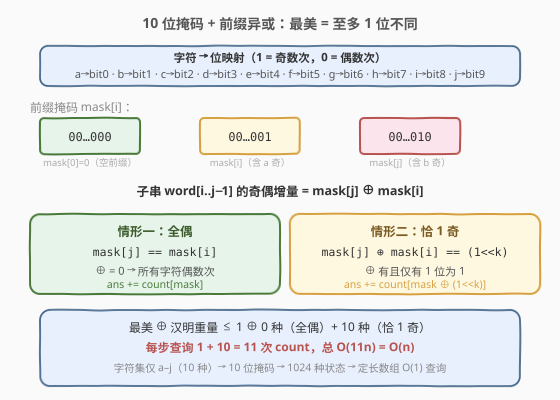
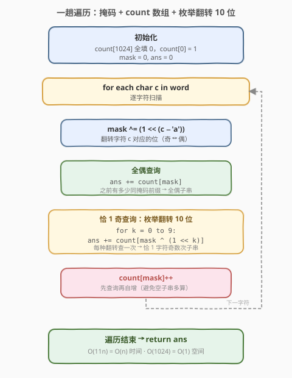
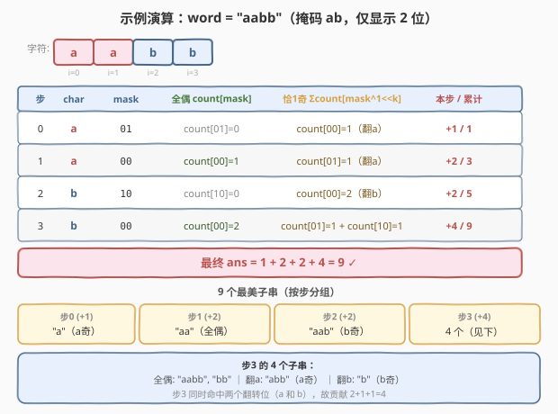

# 最美子字符串的数目

- **题目名称**：最美子字符串的数目
- **链接**：[1915. 最美子字符串的数目](https://leetcode.cn/problems/number-of-wonderful-substrings/)
- **难度**：中等
- **标签**：位运算、哈希表、字符串、前缀和

## 1. 题目概述

定义**最美字符串**：一个字符串中**至多有一个字符出现奇数次**（其余字符均出现偶数次，0 次也算偶数次）。

给定一个字符串 `word`，由前 10 个小写英文字母（`'a'` 到 `'j'`）组成。返回 `word` 中**非空最美子字符串**的数目。

**示例 1**：

```text
输入：word = "aba"
输出：4
解释：4 个最美子字符串为 "a"、"b"、"a"、"aba"。
      "aba" 中 a 出现 2 次（偶）、b 出现 1 次（奇），恰 1 个奇 → 最美。
```

**示例 2**：

```text
输入：word = "aabb"
输出：9
解释：9 个最美子字符串为 "a"、"a"、"b"、"b"、"aa"、"bb"、"aab"、"abb"、"aabb"。
```

**示例 3**：

```text
输入：word = "he"
输出：2
解释：2 个最美子字符串为 "h"、"e"。（'h' 和 'e' 均在前 10 个字母 'a'-'j' 范围内）
```

**约束条件**：

- $1 \le \text{word.length} \le 10^5$
- `word` 仅由前 10 个小写英文字母 `'a'` 到 `'j'` 组成

---

## 2. 解题思路

### 2.1 暴力思路

枚举所有 $O(n^2)$ 个子字符串，对每个子字符串统计 10 个字符的出现次数并判断奇偶。时间复杂度 $O(n^2 \cdot 10)$，$n$ 最大 $10^5$，约 $10^{11}$ 次操作，必然超时。

> 需要将"区间内至多 1 个字符奇数次"的条件转化为前缀状态之间的关系，从而在一趟遍历中完成计数。

### 2.2 核心观察：10 位掩码 + 前缀异或



**关键观察 1：状态压缩**。题目只关心每个字符出现次数的**奇偶性**（偶=0，奇=1），不关心精确次数。`word` 只含 `a`–`j` 共 10 种字符，于是 10 个奇偶状态可压缩成一个 **10 位掩码**：

- `a → bit0`、`b → bit1`、`i → bit8`、`j → bit9`
- 扫到字符 `c` 时，把对应位**翻转**（`mask ^= (1 << (c - 'a'))`）。

**关键观察 2：前缀异或**。定义前缀掩码 `mask[i]` 表示 `word[0..i-1]` 中各字符的奇偶状态（`mask[0] = 0` 表示空前缀全偶）。则子字符串 `word[i..j-1]` 中各字符的奇偶增量为：

$$
\text{mask}[j] \oplus \text{mask}[i]
$$

其中 $\oplus$ 为按位异或。该掩码中每个为 1 的位代表该字符在子串中出现奇数次。

**关键观察 3：最美条件**。子串最美 $\Leftrightarrow$ 至多 1 个字符奇数次 $\Leftrightarrow$ $\text{mask}[j] \oplus \text{mask}[i]$ 中**至多 1 位为 1**。这包含两种情形：

| 情形 | 条件 | 含义 |
|------|------|------|
| **全偶** | $\text{mask}[j] == \text{mask}[i]$ | 所有字符均偶数次，异或为 0 |
| **恰 1 奇** | $\text{mask}[j] \oplus \text{mask}[i] == (1 \ll k)$，某 $k \in [0, 9]$ | 恰好字符 $k$ 奇数次 |

> 💡 **与 1371 的对比**：[1371. 每个元音包含偶数次的最长子字符串](../1301-1400/1371_每个元音包含偶数次的最长子字符串.md) 只要求"全偶"（掩码相同），用 5 位掩码 + 首次出现位置求最长。本题允许"至多 1 奇"，需要枚举翻转每一位，且从"求最长"变为"求计数"——用哈希表记录每种掩码的**出现次数**而非首次位置。

### 2.3 计数策略：哈希表 + 枚举翻转一位

将"求最长"改为"求计数"，策略从"只记首次位置"变为"记录出现次数"：

1. 用数组 `count[1024]` 记录每种掩码（共 $2^{10} = 1024$ 种）已出现的次数。
2. 初始化 `count[0] = 1`（空前缀掩码为 0，出现 1 次）。
3. 维护当前 `mask`，每扫到一个字符就翻转对应位。
4. 每个位置 `j` 处理后，将以下计数累加到答案：
   - `count[mask]`：之前有多少前缀 `i` 与当前掩码相同 → 全偶子串。
   - `count[mask ^ (1 << k)]`（$k = 0, 1, \ldots, 9$）：之前有多少前缀 `i` 与当前掩码恰差第 $k$ 位 → 恰 1 奇子串。
5. 最后 `count[mask]++`，把当前掩码计入统计。

> ⚠️ **顺序**：必须**先查询再自增**。若先 `count[mask]++` 再查 `count[mask]`，会把当前位置自身算进去（空子串），导致多算。

### 2.4 算法流程图



整体步骤：

1. 初始化 `count[0] = 1`，`mask = 0`，`ans = 0`。
2. 遍历 `word` 的每个字符 `c`：
   - `mask ^= (1 << (c - 'a'))`（翻转对应位）。
   - `ans += count[mask]`（全偶子串）。
   - 对 $k = 0$ 到 $9$：`ans += count[mask ^ (1 << k)]`（恰 1 奇子串）。
   - `count[mask]++`。
3. 返回 `ans`。

> 💡 **为什么用数组而非哈希表？** 掩码只有 1024 种取值，定长数组 `count[1024]` 比哈希表更省内存、访问更快，且无哈希冲突开销。

### 2.5 示例演算

以 `word = "aabb"` 逐步演算（掩码按 `a b c d e f g h i j` 顺序，仅显示前 2 位 `ab`）：



**前缀掩码**：`mask[i]` 表示 `word[0..i-1]` 的奇偶状态。

| 位置 | 字符 | mask | 说明 |
|------|------|------|------|
| 0 | — | 00 | 空前缀，全偶 |
| 1 | a | 01 | a 出现 1 次（奇）→ bit0 翻转 |
| 2 | a | 00 | a 出现 2 次（偶）→ bit0 再翻转 |
| 3 | b | 10 | b 出现 1 次（奇）→ bit1 翻转 |
| 4 | b | 00 | b 出现 2 次（偶）→ bit1 再翻转 |

**逐步计数**（每步先查询再自增）：

| 步 | char | mask | 全偶 `count[mask]` | 恰1奇 $\sum$`count[mask^(1&lt;&lt;k)]` | 本步增加 | 累计 ans | count 变化 |
|----|------|------|---------------------|----------------------------------------|----------|----------|------------|
| 初始 | — | 00 | — | — | — | 0 | `count[00]=1` |
| 0 | a | 01 | `count[01]=0` | `count[00]=1`（翻转 a 位） | 0+1 = **1** | 1 | `count[01]=1` |
| 1 | a | 00 | `count[00]=1` | `count[01]=1`（翻转 a 位） | 1+1 = **2** | 3 | `count[00]=2` |
| 2 | b | 10 | `count[10]=0` | `count[00]=2`（翻转 b 位） | 0+2 = **2** | 5 | `count[10]=1` |
| 3 | b | 00 | `count[00]=2` | `count[01]=1`（翻 a）+ `count[10]=1`（翻 b） | 2+2 = **4** | 9 | `count[00]=3` |

最终答案为 **9**。

**逐步对应的 9 个最美子串**（`word[i..j-1]`，掩码差 $= \text{mask}[j] \oplus \text{mask}[i]$）：

| 步 | 子串 | 掩码差 | 奇偶情况 | 来源 |
|----|------|--------|----------|------|
| 0 | `"a"` = word[0..0] | 01 | a 奇 | 翻 a 位，命中 mask[0]=00 |
| 1 | `"aa"` = word[0..1] | 00 | 全偶 | 全偶，命中 mask[0]=00 |
| 1 | `"a"` = word[1..1] | 01 | a 奇 | 翻 a 位，命中 mask[1]=01 |
| 2 | `"aab"` = word[0..2] | 10 | b 奇 | 翻 b 位，命中 mask[0]=00 |
| 2 | `"b"` = word[2..2] | 10 | b 奇 | 翻 b 位，命中 mask[2]=00 |
| 3 | `"aabb"` = word[0..3] | 00 | 全偶 | 全偶，命中 mask[0]=00 |
| 3 | `"bb"` = word[2..3] | 00 | 全偶 | 全偶，命中 mask[2]=00 |
| 3 | `"abb"` = word[1..3] | 01 | a 奇 | 翻 a 位，命中 mask[1]=01 |
| 3 | `"b"` = word[3..3] | 10 | b 奇 | 翻 b 位，命中 mask[3]=10 |

> 💡 **验证**：每步的"本步增加"= 全偶命中数 + 恰 1 奇命中数。步 3 同时命中了两个不同的翻转位（a 和 b），因此贡献 4 个子串。

---

## 3. 参考代码

### C++

```cpp
class Solution {
public:
    long long wonderfulSubstrings(string word) {
        int count[1024] = {};
        count[0] = 1;
        int mask = 0;
        long long ans = 0;
        for (char c : word) {
            mask ^= (1 << (c - 'a'));
            ans += count[mask];
            for (int k = 0; k < 10; ++k) {
                ans += count[mask ^ (1 << k)];
            }
            ++count[mask];
        }
        return ans;
    }
};
```

### Python

```python
class Solution:
    def wonderfulSubStrings(self, word: str) -> int:
        count = [0] * 1024
        count[0] = 1
        mask = 0
        ans = 0
        for c in word:
            mask ^= (1 << (ord(c) - ord('a')))
            ans += count[mask]
            for k in range(10):
                ans += count[mask ^ (1 << k)]
            count[mask] += 1
        return ans
```

> ⚠️ **数据类型**：$n$ 最大 $10^5$，子串数最多约 $\frac{n(n+1)}{2} \approx 5 \times 10^9$，超过 `int` 范围（$\approx 2.1 \times 10^9$）。C++ 需用 `long long`，Python 自动处理大整数。

> 💡 **字符范围限定**：题目保证 `word` 只含 `'a'`–`'j'`，故 `c - 'a'` 取值 0–9，掩码不超过 10 位（$< 1024$）。若字符范围扩大，需相应增加位数和数组大小。

---

## 4. 复杂度分析

| 维度 | 复杂度 | 说明 |
|------|--------|------|
| 时间复杂度 | $O(n \cdot |\Sigma|)$ | 遍历 $n$ 个字符，每步查询 `count[mask]` 为 $O(1)$，枚举 10 位翻转各 $O(1)$，共 $O(10n) = O(n)$ |
| 空间复杂度 | $O(2^{|\Sigma|})$ | `count` 数组大小 $2^{10} = 1024$，与 $n$ 无关，视为 $O(1)$ |

> 💡 本题字符集 $|\Sigma| = 10$ 是关键——它使掩码状态数 $2^{10} = 1024$ 为常数，枚举翻转 10 位也仅需 10 次操作。若字符集扩大到 26，状态数 $2^{26} \approx 6.7 \times 10^7$ 仍可接受，但枚举 26 位翻转使每步 $O(26)$，总 $O(26n)$ 也可行。

---

## 5. 扩展：与 1371 的对比——从"最长"到"计数"

本题与 [1371. 每个元音包含偶数次的最长子字符串](../1301-1400/1371_每个元音包含偶数次的最长子字符串.md) 是**前缀状态相等**范式的两个变体：

| 维度 | 1371 | 1915（本题） |
|------|------|-------------|
| 字符集 | 5 个元音 `aeiou` | 10 个字母 `a`–`j` |
| 掩码位数 | 5 位（32 种状态） | 10 位（1024 种状态） |
| 最美条件 | **所有**元音偶数次（全偶） | **至多 1 个**字符奇数次（全偶或恰 1 奇） |
| 掩码关系 | `mask[j] == mask[i]` | `mask[j] == mask[i]` **或** `mask[j] ^ mask[i] == (1 << k)` |
| 求解目标 | **最长**子串长度 | **计数**子串数目 |
| 哈希表存什么 | 每种掩码的**首次出现位置** | 每种掩码的**出现次数** |
| 查询方式 | `pos[mask]` 取最大跨度 | `count[mask]` + `count[mask ^ (1<<k)]` 求和 |

> 💡 **通用范式**：当题目涉及"区间内若干计数满足某条件"时，用前缀状态压缩 + 哈希表。求最长用"只记首次位置"，求计数用"记出现次数"。若条件允许"至多 1 个异常"，则额外枚举翻转每一位。

---

## 6. 面试要点

1. **为什么用 10 位掩码而不是分别记录 10 个计数？**

   > 题目只问奇偶性，精确计数是冗余信息。10 个布尔（奇/偶）压成 10 位整数，状态数从"无限"降到 1024，可直接用数组 $O(1)$ 查询，避免哈希开销。

2. **"至多 1 个字符奇数次"如何转化为掩码关系？**

   > 子串 `word[i..j-1]` 的奇偶增量 = `mask[j] ^ mask[i]`。"至多 1 个奇"等价于该异或值的**汉明重量 $\le 1$**，即恰好为 0（全偶）或 $2^k$（恰 1 奇）。因此查询时除了 `count[mask]`，还要枚举 10 种 `count[mask ^ (1 << k)]`。

3. **为什么初始化 `count[0] = 1`？**

   > 掩码 0 表示"所有字符偶数次"。空前缀（处理任何字符之前）的状态就是全偶，`count[0] = 1` 确保从位置 0 开始的合法子串能被匹配到。若不初始化，会漏掉所有以 `word[0]` 开头的全偶子串。

4. **为什么先查询再自增 `count[mask]`？**

   > 查询统计的是**之前**出现的前缀数。若先自增，`count[mask]` 会包含当前位置，相当于把空子串（长度 0）也计入，导致多算。正确顺序是先用旧值查询，再自增以供后续位置使用。

5. **为什么用数组而非哈希表？**

   > 掩码取值范围 $[0, 1024)$，是紧密的整数区间。定长数组 `count[1024]` 访问 $O(1)$ 且无哈希冲突，比 `unordered_map` 更快更省空间。只有当状态空间稀疏或巨大时才考虑哈希表。

---

## 7. 同类练习题

- [1371. 每个元音包含偶数次的最长子字符串](https://leetcode.cn/problems/find-the-longest-substring-containing-vowels-in-even-counts/)（[题解](../1301-1400/1371_每个元音包含偶数次的最长子字符串.md)）：5 位掩码 + 首次出现位置求最长全偶子串，本题的"前驱"——将"至多 1 奇"退化为"全偶"，"计数"退化为"求最长"
- [525. 连续数组](https://leetcode.cn/problems/contiguous-array/)：0 当 −1，前缀和相等 ⇒ 0/1 数目相等，1 维版前缀状态相等
- [974. 和可被 K 整除的子数组](https://leetcode.cn/problems/subarray-sums-divisible-by-k/)（[题解](../0901-1000/974_和可被K整除的子数组.md)）：前缀和同余 ⇒ 区间和被 K 整除，求计数用"记次数"，与本题同为"计数型前缀状态"
- [560. 和为 K 的子数组](https://leetcode.cn/problems/subarray-sum-equals-k/)（[题解](../0501-0600/560_和为K的子数组.md)）：前缀和差等于 k，前缀状态范式的母题
- [1542. 找出最长的超赞子字符串](https://leetcode.cn/problems/find-longest-awesome-substring/)：本题的"最长"变体——至多 1 个字符奇数次，求最长子串长度，用首次出现位置而非计数
