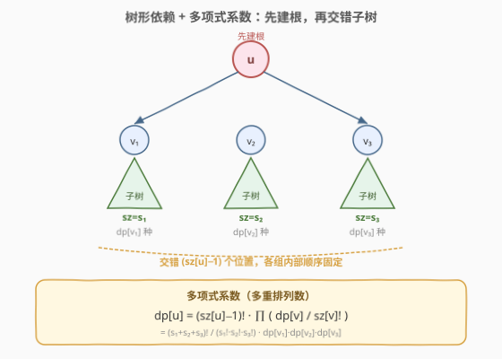
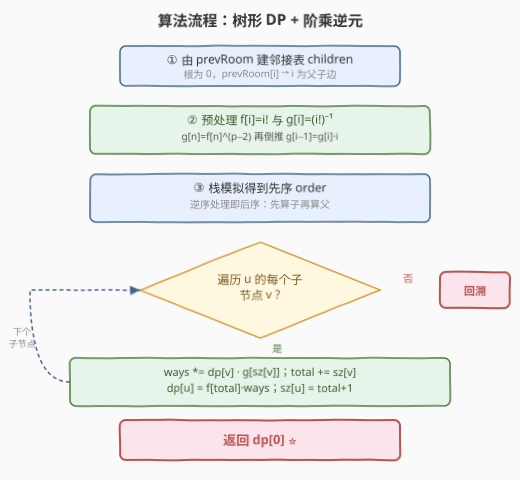

# LeetCode 统计为蚁群构筑房间的不同顺序 题解

## 1. 题目概述

- **标题 / 题号**：统计为蚁群构筑房间的不同顺序（#1916，hard）
- **链接**：https://leetcode.cn/problems/count-ways-to-build-rooms-in-an-ant-colony/
- **难度**：困难
- **标签**：树、动态规划、组合数学、数学

**题意**：你是蚁群中一只负责构筑房间的蚂蚁，需要构筑 `n` 间编号 `0` 到 `n-1` 的房间。给定数组 `prevRoom`：

- `prevRoom[i]` 表示构筑房间 `i` 之前**必须先构筑**的房间，且两房间**直接相连**；
- 房间 `0` 已建成，故 `prevRoom[0] = -1`；
- 完成后从房间 `0` 能访问到每个房间（即整体构成一棵**以 0 为根的树**）。

你一次只能构筑一个房间，只要 `prevRoom[i]` 已建成就能构筑 `i`。求构筑所有房间的**不同顺序数目**，答案对 $10^9+7$ 取余。

**示例 1**：

```text
输入：prevRoom = [-1,0,1]
输出：1
解释：只有一种顺序 0 → 1 → 2（一条链）。
```

**示例 2**：

```text
输入：prevRoom = [-1,0,0,1,2]
输出：6
解释：0 为根，1、2 是 0 的子；3、4 分别是 1、2 的子。共 6 种构筑顺序。
```

**约束**：

- $n = \text{prevRoom.length}$
- $2 \le n \le 10^5$
- `prevRoom[0] == -1`，且 $0 \le \text{prevRoom}[i] < n$（$i \ge 1$）
- 保证所有房间建成后从 `0` 可达（构成以 0 为根的树）

## 2. 解题思路

### 2.1 暴力思路

枚举所有 $n!$ 个排列，对每个排列判定是否满足「任一节点出现在其父节点之后」的偏序约束。时间复杂度 $O(n! \cdot n)$，$n=10^5$ 完全不可行。

> 关键在于利用树的**递归结构**：一棵子树的合法构筑顺序数，可以由其各子树的顺序数**组合**得到。

### 2.2 核心观察：树形 DP + 多项式系数



由于依赖关系是一棵以 `0` 为根的树，对任意节点 $u$：

- **$u$ 必须先于其子树中所有节点构筑**（是子树里第一个）；
- $u$ 建好后，其各子树 $v_1, v_2, \ldots, v_k$ 之间**互不依赖**，可以任意交错，但每棵子树**内部的相对顺序**必须合法。

设：

| 量 | 含义 |
|------|------|
| $\text{sz}[u]$ | 子树 $u$ 的大小（节点数） |
| $\text{dp}[u]$ | 构筑子树 $u$ 的合法顺序数 |

建好 $u$ 后，还剩 $\text{sz}[u]-1$ 个位置，需要被各子树的节点填满。这就是经典的**多重排列（多项式系数）**问题：

$$
\text{dp}[u] = \underbrace{\frac{(\text{sz}[u]-1)!}{\prod_{v} \text{sz}[v]!}}_{\text{交错方案数}} \;\times\; \prod_{v} \text{dp}[v]
$$

其中 $\text{sz}[u]-1 = \sum_{v} \text{sz}[v]$。**叶子节点**无子节点，$\text{dp}[\text{leaf}]=1$、$\text{sz}[\text{leaf}]=1$（$0!=1$，空积为 1）。

> 💡 **直观理解**：先把每棵子树看作一个内部顺序已固定的「块」，问把这些块排进 $\text{sz}[u]-1$ 个位置有多少种排法——这正是「把 $s_1+s_2+\cdots+s_k$ 个位置划分成大小为 $s_1,s_2,\ldots,s_k$ 的组」的多项式系数；再乘上每块自身的内部排法 $\text{dp}[v]$。

### 2.3 模运算：阶乘逆元

公式含**除法**，但答案对质数 $p=10^9+7$ 取余。在模意义下除以 $x$ 等于乘 $x$ 的**模逆元** $x^{-1} \bmod p$。

- 由**费马小定理**（$p$ 为质数且 $\gcd(x,p)=1$）：$x^{-1} \equiv x^{p-2} \pmod p$。
- 预处理阶乘 $f[i]=i! \bmod p$ 与逆阶乘 $g[i]=(i!)^{-1} \bmod p$：
  - $g[n] = f[n]^{p-2} \bmod p$（一次快速幂）；
  - 倒推 $g[i-1] = g[i] \cdot i \bmod p$（因为 $\frac{1}{(i-1)!} = \frac{1}{i!} \cdot i$），$O(n)$ 得到全部逆阶乘。

于是 $\text{dp}[u] = f[\text{total}] \cdot \prod_v \big(\text{dp}[v] \cdot g[\text{sz}[v]]\big) \bmod p$，其中 $\text{total}=\sum_v \text{sz}[v]=\text{sz}[u]-1$。

### 2.4 算法流程图



整体步骤：

1. 由 `prevRoom` 建邻接表 `children`（根为 `0`）。
2. 预处理 $f[\,]$、$g[\,]$（阶乘与逆阶乘）。
3. 用**栈**模拟 DFS 得到先序 `order`，**逆序处理**即后序（先算子、再算父）。
4. 对每个节点 $u$，遍历其子节点 $v$ 累乘 $\text{dp}[v]\cdot g[\text{sz}[v]]$ 并累加 $\text{sz}[v]$，最后 $\text{dp}[u]=f[\text{total}]\cdot \text{ways}$、$\text{sz}[u]=\text{total}+1$。
5. 返回 $\text{dp}[0]$。

> ⚠️ **避免递归爆栈**：$n$ 最大 $10^5$，树可能退化为链，Python 递归会触发 `RecursionError`，C++ 也可能栈溢出。用**显式栈**生成后序序列是稳妥做法。

### 2.5 示例演算

![示例演算：prevRoom = [-1,0,0,1,2]](../images/1916_example_walkthrough.svg)

以示例 2 `prevRoom = [-1,0,0,1,2]` 演算，树形为：

```text
      0
     / \
    1   2
    |   |
    3   4
```

后序自底向上填表：

| 节点 | $\text{sz}$ | $\text{dp}$ 计算 | $\text{dp}$ |
|------|------|------|------|
| 3 | 1 | 叶子 | 1 |
| 4 | 1 | 叶子 | 1 |
| 1 | 2 | $f[1]\cdot\text{dp}[3]\cdot g[1] = 1\cdot1\cdot1$ | 1 |
| 2 | 2 | $f[1]\cdot\text{dp}[4]\cdot g[1] = 1$ | 1 |
| 0 | 5 | $f[4]\cdot\text{dp}[1]\cdot g[2]\cdot\text{dp}[2]\cdot g[2] = 24\cdot\tfrac12\cdot\tfrac12$ | **6** |

根 `0` 建好后剩 4 个位置，交错两棵大小为 2 的子树：$\binom{4}{2}=6$，与结果一致。

## 3. 参考代码

### C++

```cpp
class Solution {
public:
    int waysToBuildRooms(vector<int>& prevRoom) {
        int n = prevRoom.size();
        const int MOD = 1e9 + 7;
        vector<vector<int>> children(n);
        for (int i = 1; i < n; i++) children[prevRoom[i]].push_back(i);

        // 阶乘 f 与 逆阶乘 g
        vector<long long> f(n + 1), g(n + 1);
        f[0] = 1;
        for (int i = 1; i <= n; i++) f[i] = f[i - 1] * i % MOD;
        auto power = [&](long long a, long long b) {
            long long r = 1; a %= MOD;
            while (b) {
                if (b & 1) r = r * a % MOD;
                a = a * a % MOD;
                b >>= 1;
            }
            return r;
        };
        g[n] = power(f[n], MOD - 2);
        for (int i = n; i >= 1; i--) g[i - 1] = g[i] * i % MOD;

        vector<long long> sz(n, 1), dp(n, 1);
        // 栈模拟得到先序，逆序即为后序
        vector<int> order, stk = {0};
        while (!stk.empty()) {
            int u = stk.back(); stk.pop_back();
            order.push_back(u);
            for (int v : children[u]) stk.push_back(v);
        }
        for (int idx = (int)order.size() - 1; idx >= 0; idx--) {
            int u = order[idx];
            long long total = 0, ways = 1;
            for (int v : children[u]) {
                ways = ways * dp[v] % MOD * g[sz[v]] % MOD;
                total += sz[v];
            }
            dp[u] = f[total] * ways % MOD;
            sz[u] = total + 1;
        }
        return (int)dp[0];
    }
};
```

### Python

```python
class Solution:
    def waysToBuildRooms(self, prevRoom: List[int]) -> int:
        MOD = 10**9 + 7
        n = len(prevRoom)
        children = [[] for _ in range(n)]
        for i in range(1, n):
            children[prevRoom[i]].append(i)

        f = [1] * (n + 1)
        for i in range(1, n + 1):
            f[i] = f[i - 1] * i % MOD
        g = [1] * (n + 1)
        g[n] = pow(f[n], MOD - 2, MOD)
        for i in range(n, 0, -1):
            g[i - 1] = g[i] * i % MOD

        sz = [1] * n
        dp = [1] * n
        order = []
        stk = [0]
        while stk:
            u = stk.pop()
            order.append(u)
            stk.extend(children[u])

        for u in reversed(order):
            total = 0
            ways = 1
            for v in children[u]:
                ways = ways * dp[v] % MOD * g[sz[v]] % MOD
                total += sz[v]
            dp[u] = f[total] * ways % MOD
            sz[u] = total + 1
        return dp[0]
```

> ⚠️ **乘法顺序**：`ways = ways * dp[v] % MOD * g[sz[v]] % MOD` 中每步取模，避免中间值溢出。C++ 用 `long long`，Python 原生支持大整数但仍应及时取模控制规模。

## 4. 复杂度分析

| 维度 | 复杂度 | 说明 |
|------|--------|------|
| 时间复杂度 | $O(n)$ | 建树 $O(n)$；预处理阶乘/逆阶乘 $O(n+\log p)$；后序遍历每个节点访问一次、每条父子边访问一次 $O(n)$ |
| 空间复杂度 | $O(n)$ | 邻接表、`order`、`sz`/`dp`、`f`/`g` 数组均为 $O(n)$ |

## 5. 扩展：递归写法与栈序的等价性

若递归深度可控（如题面保证树较平衡），也可写递归后序：

```python
import sys
sys.setrecursionlimit(200000)

def dfs(u):
    sz[u] = 1
    total = 0
    ways = 1
    for v in children[u]:
        dfs(v)
        ways = ways * dp[v] % MOD * g[sz[v]] % MOD
        total += sz[v]
    dp[u] = f[total] * ways % MOD
    sz[u] = total + 1
```

显式栈版本把「递归调用」替换为「先序压栈 + 逆序处理」，逻辑等价但规避了系统栈深度限制，是处理 $10^5$ 级树结构的通用技巧，可迁移到任意**树形 DP**（如 [310. 最小高度树](https://leetcode.cn/problems/minimum-height-trees/)、[1519. 子树中标签相同的节点数](https://leetcode.cn/problems/number-of-nodes-in-the-sub-tree-with-the-same-label/)）。

> 💡 **为什么先序的逆序一定是后序？** 先序「根-左-右」压栈时，根先入 `order`、子节点后入；逆序遍历时子节点先被处理、根最后处理，恰为「左-右-根」的后序。前提是 DFS 入栈顺序不依赖父节点已计算完成（本题 `sz`/`dp` 的子节点信息先就绪即可算父，满足）。

## 6. 面试要点

1. **为什么子树之间可以任意交错？**

   > 一旦父节点 $u$ 建好，它的各子树 $v_i$ 之间**不存在依赖**（依赖只沿父子边传递），所以只要每棵子树内部顺序合法，不同子树的节点可任意穿插。

2. **多项式系数公式是怎么来的？**

   > 把 $\text{sz}[u]-1$ 个位置分成大小为 $\text{sz}[v_1],\text{sz}[v_2],\ldots$ 的组，组数即 $\frac{(\text{sz}[u]-1)!}{\prod \text{sz}[v_i]!}$（多重排列数）；再乘每组内部的合法排法 $\text{dp}[v_i]$。

3. **为什么用逆阶乘而不是每次单独求逆？**

   > 单独求逆需 $O(\log p)$ 每次，共 $O(n)$ 次会到 $O(n\log p)$。利用 $g[i-1]=g[i]\cdot i$ 递推，只需一次快速幂 $O(\log p)$ + $O(n)$ 倒推，整体 $O(n)$。

4. **为什么不直接递归 DFS？**

   > $n$ 最大 $10^5$，最坏退化为链时递归深度 $10^5$，Python 触发 `RecursionError`，C++ 可能爆系统栈。显式栈生成后序是稳妥通用的做法。

5. **答案为什么取 $\text{dp}[0]$？**

   > 整棵树以房间 `0` 为根，$\text{dp}[0]$ 即构筑**全部** $n$ 间房间的合法顺序数，正是所求。

## 同类练习题

| # | 题目 | 与本题的关联 |
|---|------|-------------|
| 1646 | [获取生成数组中的最大值](https://leetcode.cn/problems/get-maximum-in-generated-array/) | 递推生成与树/递归结构入门，熟悉自底向上计算顺序 |
| 1519 | [子树中标签相同的节点数](https://leetcode.cn/problems/number-of-nodes-in-the-sub-tree-with-the-same-label/) | 典型树形 DP（后序合并子树信息），与本题同栈序/后序范式 |
| 310 | [最小高度树](https://leetcode.cn/problems/minimum-height-trees/) | 树上 DP / 层次剥叶，对照「以根为出发点的树形递推」思路 |
| 96 | [不同的二叉搜索树](https://leetcode.cn/problems/unique-binary-search-trees/)（[题解](../0001-0100/96_不同的二叉搜索树.md)） | 卡塔兰数计数 DP，与本题同属「树形结构 + 组合计数」家族 |
| 2338 | [统计理想数组的数目](https://leetcode.cn/problems/count-possible-approaches-creating-ideal-arrays/) | 组合计数 + 阶乘逆元预处理，强化模运算与多项式系数的运用 |
