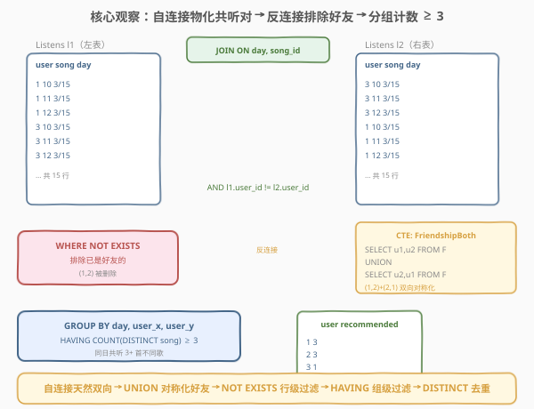
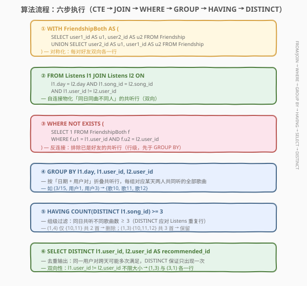
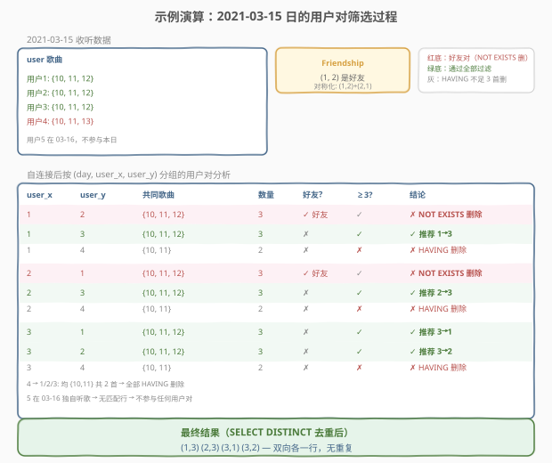

# Leetcodify 好友推荐

- **题目名称**：Leetcodify 好友推荐
- **链接**：[1917. Leetcodify 好友推荐](https://leetcode.cn/problems/leetcodify-friends-recommendations/)
- **难度**：困难
- **标签**：数据库、SQL、自连接（Self-Join）、`NOT EXISTS`、反连接（anti-join）、`UNION`、对称化、`GROUP BY` + `HAVING`、`COUNT(DISTINCT)`、`SELECT DISTINCT`、LeetCode 锁题

## 1. 题目概述

给定 `Listens`（收听记录）与 `Friendship`（好友关系）两张表，编写 SQL 查询，为 Leetcodify 用户推荐好友。将符合下列条件的用户 $x$ 推荐给用户 $y$：

- 用户 $x$ 和 $y$ **不是好友**，且
- 用户 $x$ 和 $y$ 在**同一天**收听了相同的**三首或更多不同歌曲**。

注意，好友推荐是**单向**的——若 $x$ 和 $y$ 需互相推荐，结果表要同时出现 $(x, y)$ 与 $(y, x)$。结果表不得出现重复项。按**任意顺序**返回。

**表结构**：

```text
Table: Listens
+-------------+---------+
| Column Name | Type    |
+-------------+---------+
| user_id     | int     |
| song_id     | int     |
| day         | date    |
+-------------+---------+
该表没有主键，可能存在重复项。
每行表示用户 user_id 在 day 这一天收听的歌曲 song_id。

Table: Friendship
+---------------+---------+
| Column Name   | Type    |
+---------------+---------+
| user1_id      | int     |
| user2_id      | int     |
+---------------+---------+
(user1_id, user2_id) 是主键。
每行表示 user1_id 和 user2_id 是好友。
注意，user1_id < user2_id。
```

**示例 1**：

```text
输入：
Listens 表：
+---------+---------+------------+
| user_id | song_id | day        |
+---------+---------+------------+
| 1       | 10      | 2021-03-15 |
| 1       | 11      | 2021-03-15 |
| 1       | 12      | 2021-03-15 |
| 2       | 10      | 2021-03-15 |
| 2       | 11      | 2021-03-15 |
| 2       | 12      | 2021-03-15 |
| 3       | 10      | 2021-03-15 |
| 3       | 11      | 2021-03-15 |
| 3       | 12      | 2021-03-15 |
| 4       | 10      | 2021-03-15 |
| 4       | 11      | 2021-03-15 |
| 4       | 13      | 2021-03-15 |
| 5       | 10      | 2021-03-16 |
| 5       | 11      | 2021-03-16 |
| 5       | 12      | 2021-03-16 |
+---------+---------+------------+
Friendship 表：
+----------+----------+
| user1_id | user2_id |
+----------+----------+
| 1        | 2        |
+----------+----------+

输出：
+---------+----------------+
| user_id | recommended_id |
+---------+----------------+
| 1       | 3              |
| 2       | 3              |
| 3       | 1              |
| 3       | 2              |
+---------+----------------+
```

**解释**：

| 用户对 | 同日共同歌曲 | 共同数 | 是否好友 | 结论 |
|--------|-------------|--------|---------|------|
| (1, 2) | 10, 11, 12 | 3 | ✓ 已是好友 | ✗ 排除 |
| (1, 3) | 10, 11, 12 | 3 | ✗ 非好友 | ✓ 互相推荐 |
| (1, 4) | 10, 11 | 2 | ✗ 非好友 | ✗ 不足 3 首 |
| (1, 5) | 10, 11, 12 | 3 | ✗ 非好友 | ✗ 不在同一天 |
| (2, 3) | 10, 11, 12 | 3 | ✗ 非好友 | ✓ 互相推荐 |
| (2, 4) | 10, 11 | 2 | ✗ 非好友 | ✗ 不足 3 首 |
| (3, 4) | 10, 11 | 2 | ✗ 非好友 | ✗ 不足 3 首 |

> 💡 **审题关键**：① 「同一天」——$x$ 和 $y$ 必须在**相同的 `day`** 收听共同歌曲，跨天不算；② 「三首或更多**不同**歌曲」——去重计数，若同一首歌两人各听两遍，仍只算一首；③ 好友关系表只存 `user1_id < user2_id` 的单向行，判定「是否好友」需**双向对称化**；④ 推荐是**单向**的——$(x, y)$ 与 $(y, x)$ 是两条独立结果。

> ⚠️ **Listens 表可能存在重复项**：同一 `(user_id, song_id, day)` 三元组可能出现多行。这直接影响计数方式——必须用 `COUNT(DISTINCT song_id)` 而非 `COUNT(*)`，否则重复行会虚增共同歌曲数（详见 2.2）。

---

## 2. 解题思路

### 2.1 暴力思路：逐用户对枚举

最直觉的过程式思路：枚举所有用户对 $(x, y)$，对每对检查两个条件——① 是否好友（查 `Friendship` 表）；② 是否存在某一天两人共同收听了 3+ 首不同歌曲（查 `Listens` 表按 `day` 分组）。伪代码：

```text
result = set()
users = distinct user_id from Listens
for x in users:
    for y in users:
        if x == y: continue
        if (x, y) in Friendship or (y, x) in Friendship: continue
        for day in distinct day where x listened:
            common = |songs(x, day) ∩ songs(y, day)|
            if common >= 3:
                result.add((x, y))
                break
return result
```

- **正确性**：穷举所有用户对与所有日期，条件完备。
- **效率**：用户对 $O(U^2)$，每对检查每天 $O(D)$，每天求交集 $O(S)$——总计 $O(U^2 \cdot D \cdot S)$。对 $U$、$D$、$S$ 较大时不可行。

> ⚠️ 暴力法的浪费在于「逐对扫描」。实际上「同日同曲」的共听关系可以直接通过 `Listens` 的**自连接**一次性物化——把所有「两人同日听了同一首歌」的行拼出来，再按 `(day, user_x, user_y)` 分组数不同歌曲即可。这正是 SQL 的集合式思维。

### 2.2 核心观察：自连接 + 反连接 + 分组计数



本题可拆解为**三个子问题**，分别对应 SQL 的三层过滤：

**第一步：自连接 Listens，物化「同日同曲」的用户对。**

`Listens l1 JOIN Listens l2 ON l1.day = l2.day AND l1.song_id = l2.song_id AND l1.user_id != l2.user_id`

把 `Listens` 与自身按 `(day, song_id)` 等值连接，每条结果行表示「用户 `l1.user_id` 与用户 `l2.user_id` 在 `day` 这天都听了 `song_id` 这首歌」。`l1.user_id != l2.user_id` 排除自己跟自己匹配。由于不限制 `l1.user_id < l2.user_id`，$(x, y)$ 与 $(y, x)$ **双向都会出现**——天然满足「单向推荐」要求。

> 💡 **为何不限制 `l1.user_id < l2.user_id`**：题目要求推荐是**单向**的——若 $x$、$y$ 互相满足条件，结果需同时输出 $(x, y)$ 与 $(y, x)$。若限制 `l1.user_id < l2.user_id`，只会得到一个方向，还需额外 `UNION` 反向行补全。不限制则自连接天然产出双向行，一步到位。

**第二步：反连接 Friendship，排除已是好友的对。**

`WHERE NOT EXISTS (SELECT 1 FROM FriendshipBoth f WHERE f.u1 = l1.user_id AND f.u2 = l2.user_id)`

`Friendship` 表只存 `user1_id < user2_id` 的单向行。判定「$x$ 和 $y$ 是否好友」需检查 $(x, y)$ 或 $(y, x)$ 任一存在。为此先用 CTE 把 `Friendship` **对称化**：

```sql
WITH FriendshipBoth AS (
    SELECT user1_id AS u1, user2_id AS u2 FROM Friendship
    UNION
    SELECT user2_id AS u1, user1_id AS u2 FROM Friendship
)
```

`UNION`（而非 `UNION ALL`）去重——同一对好友双向展开后只保留一行。随后用 `NOT EXISTS` 反连接：对每条共听行，检查「不存在」对称好友表中对应的 `(u1, u2)` 行——即两人不是好友。

> ⚠️ **为何用 `UNION` 而非 `UNION ALL`**：`Friendship` 中 `(1, 2)` 展开后产生 `(1, 2)` 与 `(2, 1)` 两行，互不重复。但若原表已有 `(1, 2)` 和 `(2, 1)`（违反 `user1_id < user2_id` 约束的脏数据），`UNION` 能去重避免重复行干扰 `NOT EXISTS`。`UNION ALL` 不去重虽不影响 `NOT EXISTS` 的正确性（存在性判定与行数无关），但 `UNION` 更语义化——「好友关系是无序对，每对只存一份」。

**第三步：按 (day, user_x, user_y) 分组，HAVING 计数 ≥ 3。**

`GROUP BY l1.day, l1.user_id, l2.user_id HAVING COUNT(DISTINCT l1.song_id) >= 3`

自连接后，同一 `(day, x, y)` 三元组可能有多行（每行对应一首共同歌曲）。`GROUP BY` 把它们折叠成一组，`COUNT(DISTINCT l1.song_id)` 数该组内**不同**歌曲数。`HAVING >= 3` 筛出「同日共听 3+ 首不同歌」的用户对。

> ⚠️ **必须用 `COUNT(DISTINCT l1.song_id)` 而非 `COUNT(*)`**：`Listens` 表**可能存在重复项**——同一 `(user_id, song_id, day)` 可能有多行。若用户 1 和 3 都把歌曲 10 听了两遍（同一天），自连接会为歌曲 10 产生 $2 \times 2 = 4$ 行匹配。`COUNT(*)` 会数 4，虚增共同歌曲数；`COUNT(DISTINCT l1.song_id)` 只数 1，正确反映「不同歌曲」语义。

$$\boxed{\text{推荐}(\text{user\_id}, \text{recommended\_id}) \iff \exists\,\text{day}:\ |\text{songs}(x,\text{day}) \cap \text{songs}(y,\text{day})| \ge 3 \;\wedge\; (x,y) \notin \text{Friendship}}$$

> 💡 **三层过滤的层次关系**：① `JOIN ON`（行级）——同日同曲不同人，物化共听对；② `WHERE NOT EXISTS`（行级）——排除好友，在分组前过滤；③ `HAVING`（组级）——共听不同歌曲数 ≥ 3，在分组后过滤。`WHERE` 先于 `GROUP BY` 执行，故好友对的所有共听行在分组前就被全部剔除，根本不会形成组——既正确又高效。

### 2.3 算法流程图



**逻辑执行步骤**：

| 步骤 | 子句 | 作用 |
|------|------|------|
| ① | `WITH FriendshipBoth AS (UNION ...)` | 对称化好友表，每对好友双向各存一行 |
| ② | `Listens l1 JOIN Listens l2 ON day, song_id, user_id !=` | 自连接物化「同日同曲不同人」的共听行 |
| ③ | `WHERE NOT EXISTS (... FriendshipBoth ...)` | 反连接排除已是好友的共听行 |
| ④ | `GROUP BY l1.day, l1.user_id, l2.user_id` | 按「日期 + 用户对」折叠共听行 |
| ⑤ | `HAVING COUNT(DISTINCT l1.song_id) >= 3` | 筛出同日共听 3+ 首不同歌的组 |
| ⑥ | `SELECT DISTINCT l1.user_id, l2.user_id AS recommended_id` | 去重输出（跨天可能重复） |

> 💡 **SQL 子句执行顺序**：`FROM`（含 `JOIN`/`ON`）→ `WHERE` → `GROUP BY` → `HAVING` → `SELECT`（含 `DISTINCT`）→ `ORDER BY` → `LIMIT`。步骤②的 `JOIN` 在 `FROM` 阶段物化共听行集；步骤③的 `NOT EXISTS` 在 `WHERE` 阶段逐行过滤好友对；步骤④⑤的 `GROUP BY` + `HAVING` 在聚合阶段折叠并筛组；步骤⑥的 `DISTINCT` 最后去重。理解这个顺序就能明白为何 `NOT EXISTS` 写在 `WHERE`（分组前过滤）而非 `HAVING`（分组后过滤）——提前过滤减少分组数据量。

> ⚠️ **步骤⑥ `DISTINCT` 的必要性**：同一用户对 $(x, y)$ 可能在**多个日期**都满足「共听 3+ 首」——如周一共听 {10,11,12}，周二共听 {20,21,22}。步骤④⑤按 `(day, x, y)` 分组会为每个日期各产出一行 $(x, y)$，不加 `DISTINCT` 则结果出现重复。`SELECT DISTINCT` 确保每对推荐只出现一次。

### 2.4 示例演算

以示例 1 的 5 位用户、15 条收听记录为例，观察「自连接 → 排除好友 → 分组计数 → 去重」的逐步过程：



**步骤 ①②：自连接 Listens（以 2021-03-15 为例）**

该日用户 1、2、3 都听了 {10, 11, 12}，用户 4 听了 {10, 11, 13}。自连接后按 `(day, user_x, user_y)` 分组的共听歌曲：

| day | user_x | user_y | 共同歌曲（去重） | 共同数 |
|-----|--------|--------|-----------------|--------|
| 03-15 | 1 | 2 | {10, 11, 12} | 3 |
| 03-15 | 1 | 3 | {10, 11, 12} | 3 |
| 03-15 | 1 | 4 | {10, 11} | 2 |
| 03-15 | 2 | 1 | {10, 11, 12} | 3 |
| 03-15 | 2 | 3 | {10, 11, 12} | 3 |
| 03-15 | 2 | 4 | {10, 11} | 2 |
| 03-15 | 3 | 1 | {10, 11, 12} | 3 |
| 03-15 | 3 | 2 | {10, 11, 12} | 3 |
| 03-15 | 3 | 4 | {10, 11} | 2 |
| 03-15 | 4 | 1 | {10, 11} | 2 |
| 03-15 | 4 | 2 | {10, 11} | 2 |
| 03-15 | 4 | 3 | {10, 11} | 2 |

> 💡 **双向性**：每个用户对 $(x, y)$ 与 $(y, x)$ 都各占一行——自连接不限制大小关系，天然产出双向行。如 $(1,2)$ 与 $(2,1)$ 都在表中。

**步骤 ③：WHERE NOT EXISTS（排除好友）**

`FriendshipBoth` 对称化后含 `(1,2)` 与 `(2,1)`。`NOT EXISTS` 过滤掉 `user_x=1, user_y=2` 和 `user_x=2, user_y=1` 的所有行：

| day | user_x | user_y | 共同数 | 好友? | 保留? |
|-----|--------|--------|--------|-------|-------|
| 03-15 | 1 | 2 | 3 | ✓ | ✗ 删除 |
| 03-15 | 1 | 3 | 3 | ✗ | ✓ |
| 03-15 | 1 | 4 | 2 | ✗ | ✓ |
| 03-15 | 2 | 1 | 3 | ✓ | ✗ 删除 |
| 03-15 | 2 | 3 | 3 | ✗ | ✓ |
| 03-15 | 2 | 4 | 2 | ✗ | ✓ |
| 03-15 | 3 | 1 | 3 | ✗ | ✓ |
| 03-15 | 3 | 2 | 3 | ✗ | ✓ |
| 03-15 | 3 | 4 | 2 | ✗ | ✓ |
| 03-15 | 4 | 1 | 2 | ✗ | ✓ |
| 03-15 | 4 | 2 | 2 | ✗ | ✓ |
| 03-15 | 4 | 3 | 2 | ✗ | ✓ |

> ⚠️ **(1,2) 虽有 3 首共同歌曲，但被 `NOT EXISTS` 整体删除**——好友对的所有共听行在 `WHERE` 阶段全部过滤，根本不进入 `GROUP BY`。这体现了「行级过滤先于组级过滤」的执行顺序优势。

**步骤 ④⑤：GROUP BY + HAVING ≥ 3**

| day | user_x | user_y | COUNT(DISTINCT song) | ≥ 3? | 通过? |
|-----|--------|--------|----------------------|------|-------|
| 03-15 | 1 | 3 | 3 | ✓ | ✓ |
| 03-15 | 1 | 4 | 2 | ✗ | ✗ |
| 03-15 | 2 | 3 | 3 | ✓ | ✓ |
| 03-15 | 2 | 4 | 2 | ✗ | ✗ |
| 03-15 | 3 | 1 | 3 | ✓ | ✓ |
| 03-15 | 3 | 2 | 3 | ✓ | ✓ |
| 03-15 | 3 | 4 | 2 | ✗ | ✗ |
| 03-15 | 4 | 1 | 2 | ✗ | ✗ |
| 03-15 | 4 | 2 | 2 | ✗ | ✗ |
| 03-15 | 4 | 3 | 2 | ✗ | ✗ |

**步骤 ⑥：SELECT DISTINCT**

| user_id | recommended_id |
|---------|----------------|
| 1       | 3              |
| 2       | 3              |
| 3       | 1              |
| 3       | 2              |

> 💡 **观察要点**：① 用户 4 虽与 1、2、3 都有共同歌曲，但都只有 2 首（因 4 听了 13 而非 12），全部被 `HAVING` 过滤；② 用户 5 在 03-16 独自听歌，自连接无匹配行（`l1.user_id != l2.user_id` 无法满足），不参与任何用户对；③ $(1,3)$ 与 $(3,1)$ 各占一行——单向推荐的双向性由自连接的双向匹配天然保证。

---

## 3. 参考代码

### SQL（解法 A：自连接 + `NOT EXISTS` + `GROUP BY`/`HAVING`，推荐）

```sql
WITH
    FriendshipBoth AS (
        SELECT user1_id AS u1, user2_id AS u2 FROM Friendship
        UNION
        SELECT user2_id AS u1, user1_id AS u2 FROM Friendship
    )
SELECT DISTINCT l1.user_id, l2.user_id AS recommended_id
FROM Listens l1
JOIN Listens l2
  ON l1.day = l2.day
  AND l1.song_id = l2.song_id
  AND l1.user_id != l2.user_id
WHERE NOT EXISTS (
    SELECT 1
    FROM FriendshipBoth f
    WHERE f.u1 = l1.user_id AND f.u2 = l2.user_id
)
GROUP BY l1.day, l1.user_id, l2.user_id
HAVING COUNT(DISTINCT l1.song_id) >= 3;
```

> 💡 **写法要点**：
> - **CTE `FriendshipBoth`**：`UNION` 双向展开好友关系，每对好友存 `(u1, u2)` 与 `(u2, u1)` 两行。`UNION` 去重，保证语义「无序对」。
> - **`JOIN ... ON day, song_id, user_id !=`**：自连接物化「同日同曲不同人」的共听行。不限制 `user_id` 大小关系，天然产出双向行。
> - **`WHERE NOT EXISTS`**：反连接排除好友对。在 `GROUP BY` 之前执行，好友对的全部共听行被提前剔除，不进入分组。
> - **`GROUP BY day, user_x, user_y` + `HAVING COUNT(DISTINCT song) >= 3`**：按「日期 + 用户对」折叠，数不同歌曲数。`DISTINCT` 计数应对 `Listens` 表的重复行。
> - **`SELECT DISTINCT`**：跨日期去重——同一用户对可能在多日都满足条件，只保留一行。
> - ✓ **最推荐**：层次清晰（CTE 对称化 → 自连接 → 反连接 → 分组 → 去重），语义自文档化，`NULL` 安全。

### SQL（解法 B：`LEFT JOIN` 反连接，对照思路）

```sql
WITH
    FriendshipBoth AS (
        SELECT user1_id AS u1, user2_id AS u2 FROM Friendship
        UNION
        SELECT user2_id AS u1, user1_id AS u2 FROM Friendship
    )
SELECT DISTINCT l1.user_id, l2.user_id AS recommended_id
FROM Listens l1
JOIN Listens l2
  ON l1.day = l2.day
  AND l1.song_id = l2.song_id
  AND l1.user_id != l2.user_id
LEFT JOIN FriendshipBoth f
  ON f.u1 = l1.user_id AND f.u2 = l2.user_id
WHERE f.u1 IS NULL
GROUP BY l1.day, l1.user_id, l2.user_id
HAVING COUNT(DISTINCT l1.song_id) >= 3;
```

> 💡 **解法 B 的思路**：把解法 A 的 `NOT EXISTS` 换成 `LEFT JOIN ... IS NULL`——左连接好友表后，无匹配（非好友）的行 `f.u1` 为 `NULL`，`WHERE f.u1 IS NULL` 筛出非好友对。
>
> **与解法 A 的关系**：`LEFT JOIN ... WHERE R.pk IS NULL` 与 `NOT EXISTS` 是反连接的两种等价表达（详见 [1581. 进店却未进行过交易的顾客](../1501-1600/1581_进店却未进行过交易的顾客.md)）。`NOT EXISTS` 天然 `NULL` 安全且语义自文档化；`LEFT JOIN` 更直观但需注意用右表非空列判空。
>
> ⚠️ **`LEFT JOIN` 在 `GROUP BY` 前执行**：`LEFT JOIN` 产生的中间表可能因一对多展开而放大行数（若某用户对在 `FriendshipBoth` 中有多行——但 `UNION` 已去重，每对至多一行，故不影响）。最终 `f.u1 IS NULL` 过滤掉好友对，`GROUP BY` 在过滤后的行集上折叠。

### SQL（解法 C：CTE 分层——先聚合共听数，再反连接过滤）

```sql
WITH
    FriendshipBoth AS (
        SELECT user1_id AS u1, user2_id AS u2 FROM Friendship
        UNION
        SELECT user2_id AS u1, user1_id AS u2 FROM Friendship
    ),
    CommonSongs AS (
        SELECT l1.day, l1.user_id AS u1, l2.user_id AS u2,
               COUNT(DISTINCT l1.song_id) AS common_cnt
        FROM Listens l1
        JOIN Listens l2
          ON l1.day = l2.day
          AND l1.song_id = l2.song_id
          AND l1.user_id != l2.user_id
        GROUP BY l1.day, l1.user_id, l2.user_id
        HAVING COUNT(DISTINCT l1.song_id) >= 3
    )
SELECT DISTINCT c.u1 AS user_id, c.u2 AS recommended_id
FROM CommonSongs c
WHERE NOT EXISTS (
    SELECT 1 FROM FriendshipBoth f
    WHERE f.u1 = c.u1 AND f.u2 = c.u2
);
```

> 💡 **解法 C 的思路**：把「共听数 ≥ 3」与「非好友」拆成两个 CTE 层——`CommonSongs` 先自连接 + 分组聚合出满足共听数阈值的用户对，外层再 `NOT EXISTS` 排除好友。
>
> **与解法 A 的区别**：解法 A 把 `NOT EXISTS` 放在 `WHERE`（分组前过滤），解法 C 把 `NOT EXISTS` 放在外层查询（分组后过滤）。两者结果一致，但执行顺序不同：
> - **解法 A**（先反连接后分组）：好友对的共听行在分组前全部剔除，`GROUP BY` 处理的数据量更小——**通常更快**。
> - **解法 C**（先分组后反连接）：先对所有用户对（含好友）聚合共听数，再过滤好友——聚合数据量更大，但逻辑分层更清晰，适合「共听条件复杂、好友条件简单」的场景。
>
> **取舍**：若好友对占比较大，解法 A 提前过滤更优；若共听对远多于好友对，解法 C 的分层更易读。LeetCode 数据规模下两者差异不大。

### Python（pandas）

```python
import pandas as pd


def leetcodify_friends_recommendations(
    listens: pd.DataFrame, friendship: pd.DataFrame
) -> pd.DataFrame:
    friends = set()
    for _, row in friendship.iterrows():
        friends.add((row["user1_id"], row["user2_id"]))
        friends.add((row["user2_id"], row["user1_id"]))

    merged = listens.merge(
        listens, on=["day", "song_id"], suffixes=("_x", "_y")
    )
    merged = merged[merged["user_id_x"] != merged["user_id_y"]]

    pair_not_friend = ~merged.apply(
        lambda r: (r["user_id_x"], r["user_id_y"]) in friends, axis=1
    )
    merged = merged[pair_not_friend]

    grouped = (
        merged.groupby(["day", "user_id_x", "user_id_y"])["song_id"]
        .nunique()
        .reset_index(name="common_cnt")
    )
    qualified = grouped[grouped["common_cnt"] >= 3]

    result = (
        qualified[["user_id_x", "user_id_y"]]
        .drop_duplicates()
        .rename(columns={"user_id_x": "user_id", "user_id_y": "recommended_id"})
        .reset_index(drop=True)
    )
    return result
```

> 💡 **pandas 对照**：
> - `friends` 集合双向添加——对应 CTE `FriendshipBoth` 的 `UNION` 对称化。
> - `listens.merge(listens, on=["day", "song_id"])`——对应 `Listens l1 JOIN Listens l2 ON l1.day = l2.day AND l1.song_id = l2.song_id`。`suffixes=("_x", "_y")` 区分左右表列名。
> - `merged["user_id_x"] != merged["user_id_y"]`——对应 `ON l1.user_id != l2.user_id`。
> - `~merged.apply(... in friends)`——对应 `WHERE NOT EXISTS`。用集合成员判定实现反连接，`~` 取反。
> - `.groupby(...).nunique()`——对应 `GROUP BY` + `COUNT(DISTINCT song_id)`。`nunique()` 即 `COUNT(DISTINCT)`。
> - `.drop_duplicates()`——对应 `SELECT DISTINCT`。

---

## 4. 复杂度分析

| 维度 | 解法 A（`NOT EXISTS`） | 解法 B（`LEFT JOIN`） | 解法 C（CTE 分层） | pandas |
|------|------------------------|------------------------|---------------------|--------|
| **时间** | $O(L^2/S \cdot \log F)$ | $O(L^2/S + L^2/S \cdot \log F)$ | $O(L^2/S \cdot \log F)$ | $O(L^2/S + F)$ |
| **空间** | $O(L^2/S + F)$ | $O(L^2/S + F)$ | $O(L^2/S + F)$ | $O(L^2/S + F)$ |
| **提前过滤** | ✓ `WHERE` 先于 `GROUP BY` | ✓ 同 A | ✗ 先聚合再过滤 | ✓ 同 A |
| **推荐度** | ✓ **首选** | ✓ 对照 | ✓ 分层清晰 | ✓ 验证用 |

> - $L$ = `Listens` 表行数，$F$ = `Friendship` 表行数，$S$ = 平均每日每曲的收听用户数
> - **时间**：自连接 `Listens` 按 `(day, song_id)` 等值匹配，若每天每首歌平均 $S$ 个用户收听，则连接产出 $L \cdot S$ 行（每个 `Listens` 行匹配同日同曲的 $S-1$ 个其他用户）。`NOT EXISTS`/`LEFT JOIN` 对每行检查好友表，有索引时 $O(\log F)$。解法 C 先聚合全部用户对（含好友）再过滤，聚合数据量略大。
> - **空间**：自连接中间表 $O(L \cdot S)$，好友对称表 $O(F)$。
> - **索引优化**：在 `Listens(day, song_id)` 上建复合索引可加速自连接；在 `Friendship(user1_id, user2_id)` 上建索引可加速 `NOT EXISTS` 的相关子查询。

---

## 5. 扩展：自连接的三种反连接写法与对称化技巧

### 5.1 好友关系的对称化

本题 `Friendship` 表只存 `user1_id < user2_id` 的单向行，但判定「$x$ 和 $y$ 是否好友」需双向检查。对称化的两种写法：

| 写法 | 模板 | 去重 | 语义 |
|------|------|------|------|
| **`UNION`** | `SELECT u1,u2 FROM F UNION SELECT u2,u1 FROM F` | ✓ 去重 | 无序对，每对双向各一行 |
| **`UNION ALL`** | `SELECT u1,u2 FROM F UNION ALL SELECT u2,u1 FROM F` | ✗ 不去重 | 可能含重复（脏数据时） |

> 💡 **`NOT EXISTS` 不受去重影响**：`NOT EXISTS` 只判断「是否存在匹配行」，与行数无关。故 `UNION` 与 `UNION ALL` 在 `NOT EXISTS` 语义下等价。但 `UNION` 更语义化（「好友是无序对」），且在 `LEFT JOIN` 场景下 `UNION` 去重可避免一对多展开放大行数——故统一推荐 `UNION`。

### 5.2 反连接的三种写法对照

排除好友对（反连接）有三种等价写法，与 [1581](../1501-1600/1581_进店却未进行过交易的顾客.md) 的反连接三件套同源：

| 写法 | 模板 | NULL 安全 | 语义 |
|------|------|-----------|------|
| **`NOT EXISTS`** | `WHERE NOT EXISTS (SELECT 1 FROM F WHERE ...)` | ✓ | 不存在匹配行 |
| **`LEFT JOIN` + `IS NULL`** | `LEFT JOIN F ON ... WHERE F.pk IS NULL` | ✓ | 连接后筛右表为空 |
| **`NOT IN`** | `WHERE (u1,u2) NOT IN (SELECT u1,u2 FROM F)` | ✗（需 `IS NOT NULL`） | 不在值集合中 |

> ⚠️ **`NOT IN` 的 NULL 陷阱**：若子查询结果含 `NULL`，`NOT IN` 对任何值返回 UNKNOWN——查询返回空集。本题 `Friendship` 主键非空，`NOT IN` 不加 `IS NOT NULL` 也能通过，但生产环境推荐 `NOT EXISTS` 或 `LEFT JOIN`。注意 `NOT IN` 需用**行构造器** `(u1, u2) NOT IN (...)` 而非两个独立 `NOT IN`（后者会交叉错配）。

### 5.3 `COUNT(DISTINCT)` vs `COUNT(*)` 的取舍

`Listens` 表允许重复行，计数方式直接影响正确性：

| 写法 | 含义 | 重复行影响 | 本题适用 |
|------|------|-----------|---------|
| `COUNT(DISTINCT l1.song_id)` | 不同歌曲数 | ✓ 去重 | ✓ 正确 |
| `COUNT(*)` | 所有匹配行数 | ✗ 重复行虚增 | ✗ 错误 |
| `COUNT(DISTINCT l1.day)` | 不同日期数 | — | ✗ 语义不符 |

> 💡 **何时可用 `COUNT(*)`**：若 `Listens` 表保证无重复（如有主键约束 `(user_id, song_id, day)`），则每首共同歌曲只产生一行匹配，`COUNT(*)` = `COUNT(DISTINCT song_id)`。但题目明确「可能存在重复项」，故**必须** `COUNT(DISTINCT)`。这是 SQL 计数题的高频考点。

### 5.4 单向推荐 vs 双向去重

本题要求推荐是**单向**的——$(x, y)$ 与 $(y, x)$ 各占一行。两种实现方式：

| 方式 | 写法 | 语义 |
|------|------|------|
| **不限制大小（本题）** | `ON l1.user_id != l2.user_id` | 双向行天然出现 |
| **限制大小 + UNION 反向** | `ON l1.user_id < l2.user_id` + 外层 `UNION` 反向 | 需手动补反向行 |

> 💡 本题选「不限制大小」更简洁——自连接天然产出 $(x,y)$ 与 $(y,x)$，无需额外 `UNION`。但若题目要求「每对只出现一行（按 `user1 < user2` 排序）」，则应限制 `l1.user_id < l2.user_id` 避免双向重复。

---

## 6. 面试要点

1. **为什么需要对 `Friendship` 表做对称化？**

   > `Friendship` 只存 `user1_id < user2_id` 的单向行。判定「$x$ 和 $y$ 是否好友」时，$(x, y)$ 与 $(y, x)$ 都应命中——但表中只存了较小者在前的那一行。用 `UNION` 把 `(user1, user2)` 与 `(user2, user1)` 合并，生成对称的好友表，`NOT EXISTS` 即可直接用 `(l1.user_id, l2.user_id)` 匹配，无需在条件里写两个方向的 `OR`。

2. **为什么用 `COUNT(DISTINCT l1.song_id)` 而非 `COUNT(*)`？**

   > `Listens` 表允许重复行——同一 `(user_id, song_id, day)` 可能有多行。若两人都把某首歌听了两遍，自连接为该歌产生 $2 \times 2 = 4$ 行匹配。`COUNT(*)` 会数 4，虚增共同歌曲数；`COUNT(DISTINCT song_id)` 只数 1，正确反映「不同歌曲」语义。题目要求「三首或更多**不同**歌曲」，故必须去重计数。

3. **`NOT EXISTS` 写在 `WHERE` 还是 `HAVING` 之后？有何区别？**

   > 写在 `WHERE`（解法 A）：好友对的共听行在 `GROUP BY` 之前全部剔除，不进入分组——处理数据量更小，通常更快。写在 `HAVING` 或外层（解法 C）：先对所有用户对（含好友）聚合共听数，再过滤好友——逻辑分层清晰但聚合数据量更大。两者结果一致，LeetCode 数据规模下差异不大，但「提前过滤」是 SQL 性能优化的通用原则。

4. **为什么 `SELECT DISTINCT` 不能省？**

   > 同一用户对 $(x, y)$ 可能在**多个日期**都满足「共听 3+ 首」——`GROUP BY (day, x, y)` 会为每个日期各产出一行 $(x, y)$。不加 `DISTINCT` 则结果出现重复（同一推荐对出现多次）。题目要求「结果表不得出现重复项」，故 `SELECT DISTINCT` 必不可少。

5. **如何保证推荐的双向性（$(x,y)$ 与 $(y,x)$ 都出现）？**

   > 自连接 `ON l1.user_id != l2.user_id` 不限制大小关系——对用户 1 和 3，`l1=1,l2=3` 与 `l1=3,l2=1` 都满足连接条件，故 $(1,3)$ 与 $(3,1)$ 双向各一行。若误写 `ON l1.user_id < l2.user_id`，只会得到一个方向，需额外 `UNION` 反向行补全——既冗长又易漏。

> 💡 **一句话总结**：1917 是 SQL **"自连接 + 反连接 + 分组计数"招牌题**——核心模板「CTE `UNION` 对称化好友表 → `Listens` 自连接 `ON day, song_id, user_id !=` 物化共听对 → `WHERE NOT EXISTS` 排除好友 → `GROUP BY day, user_x, user_y` + `HAVING COUNT(DISTINCT song) >= 3` → `SELECT DISTINCT` 去重」。三大要点：① **`UNION` 对称化好友关系**；② **`COUNT(DISTINCT)` 应对重复行**；③ **`NOT EXISTS` 在 `WHERE` 提前过滤**。

---

## 7. 同类练习题

- [1581. 进店却未进行过交易的顾客](https://leetcode.cn/problems/customer-who-visited-but-did-not-make-any-transactions/)（[题解](../1501-1600/1581_进店却未进行过交易的顾客.md)）：反连接入门招牌题——`LEFT JOIN ... IS NULL` / `NOT EXISTS` 排除有匹配的行，与本题 `NOT EXISTS` 排除好友同源，但 1581 是单表反连接，1917 是自连接后再反连接
- [183. 从不订购的客户](https://leetcode.cn/problems/customers-who-never-order/)：反连接最经典母题——`LEFT JOIN ... IS NULL` 找从未订购的客户，巩固反连接三件套（`LEFT JOIN`/`NOT EXISTS`/`NOT IN`）的基础写法
- [1811. 寻找面试候选人](https://leetcode.cn/problems/find-interview-candidates/)（[题解](../1801-1900/1811_寻找面试候选人.md)）：`UNION ALL` 逆透视 + 自连接三元组判定，与本题自连接 + `UNION` 对称化同为「宽表展开 + 自身关联」家族，但 1811 检测连续性，1911 检测共听数
- [197. 上升的温度](https://leetcode.cn/problems/rising-temperature/)（[题解](../0101-0200/197_上升的温度.md)）：自连接做跨行比较（找比昨天温度高的日期），体会自连接 `ON` 条件中「不等 + 跨行关联」的写法，与本题 `ON day, song_id, user_id !=` 对照
- [602. 好友申请 II - 谁有最多的好友](https://leetcode.cn/problems/friend-requests-ii-who-has-the-most-friends/)：`UNION ALL` 合并 `requester_id`/`accepter_id` 两列为一列再 `GROUP BY` 计数，与本题 `UNION` 对称化好友表同类，体会「把宽表两列展开为长表」的逆透视技巧
