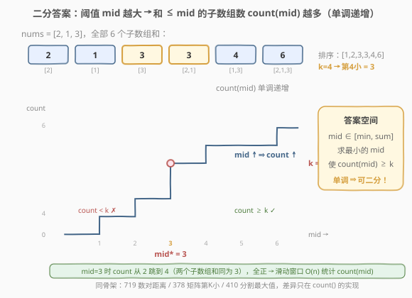
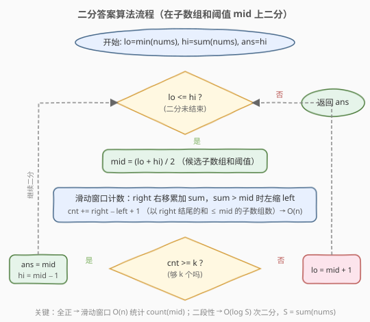

# LeetCode 第 K 小的子数组和 题解

## 1. 题目概述

- **标题 / 题号**：第 K 小的子数组和（#1918，medium）
- **链接**：https://leetcode.cn/problems/kth-smallest-subarray-sum/
- **难度**：中等
- **标签**：数组、二分查找、滑动窗口

**题意**：给定一个**正整数**数组 `nums` 和一个整数 `k`，返回所有非空**连续子数组**的和里**第 k 小**的值（k 从 1 开始）。

**示例 1**：

```text
输入：nums = [2,1,3], k = 4
输出：3
解释：全部 6 个子数组的和为 [2, 1, 3, 3, 4, 6]，排序后 [1, 2, 3, 3, 4, 6]，第 4 小为 3。
```

**示例 2**：

```text
输入：nums = [3,3,5,5], k = 7
输出：10
解释：全部 10 个子数组的和排序后为 [3, 3, 3, 5, 5, 5, 6, 8, 8, 10, 13, 16]，
      共 10 个，第 7 小为 10。
```

**约束**：

- $1 \le \text{nums.length} \le 2 \times 10^4$
- $1 \le \text{nums[i]} \le 10^5$
- $1 \le k \le \dfrac{n(n+1)}{2}$

> 💡 **审题关键**：① 子数组是**连续**的，不是子序列；② 所有元素为**正整数**——这是滑动窗口 $O(n)$ 计数的前提；③ 子数组总数达 $\binom{n+1}{2} \approx 2 \times 10^8$（$n = 2 \times 10^4$），暴力枚举全部子数组和必然超时。

## 2. 解题思路

### 2.1 暴力思路

最直接的做法是**枚举所有子数组**求和，排序后取第 k 个。子数组共 $\dfrac{n(n+1)}{2} \approx 2 \times 10^8$ 个（$n = 2 \times 10^4$），存储和排序都需要 $O(n^2)$ 时间和空间，必然超时（MLE/TLE）。

换个角度：答案（第 k 小的子数组和）一定落在 $[\min(\text{nums}),\ \sum \text{nums}]$ 之间。能否**不枚举子数组，而是枚举和的阈值**？对每个候选阈值 `mid`，只需统计「和 $\le \text{mid}$ 的子数组有多少个」。若逐个试，每次统计 $O(n^2)$，整体依然超时。

> 💡 **关键转化**：把「求第 k 小的值」变成「求最小的 `mid`，使和 $\le \text{mid}$ 的子数组数 $\ge k$」——这是**二分答案**的标准信号。

### 2.2 核心观察：二分答案 + 滑动窗口计数



注意到「和 $\le \text{mid}$ 的子数组数 `count(mid)`」关于 `mid` **单调递增**：

- `mid` 越大（阈值越宽），满足条件的子数组越多。
- `mid = min(nums)` 时只有最小单元素子数组算入；`mid = sum(nums)` 时所有子数组都算入，`count = n(n+1)/2`。

于是存在一个**分界点** `mid*`：

```text
mid < mid* → count(mid) < k    (不够 k 个，阈值太小)
mid >= mid* → count(mid) >= k  (够 k 个，阈值够大)
```

这正是二分查找所需的**二段性**。在 $[\min(\text{nums}),\ \sum \text{nums}]$ 上二分，每次 $O(n)$ 统计 `count(mid)`，可行则去左半找更小的，不可行则去右半放宽。

> 💡 **识别信号**：题目求「第 k 小/大」且能高效统计「$\le$ 某值的元素个数」→ 想「二分答案」。本题与 [找出第 K 小的数对距离](../0701-0800/719_找出第K小的数对距离.md)、[分割数组的最大值](../0401-0500/410_分割数组的最大值.md) 同骨架，只是 `count()` 换成了「滑动窗口子数组计数」。

> ⚠️ **为什么 `count(mid) >= k` 就算可行？** 因为我们找的是「使计数达到 k 的**最小**阈值」。`count >= k` 说明第 k 小的子数组和 $\le \text{mid}$，可以尝试更小；`count < k` 说明第 k 小的子数组和 $> \text{mid}$，必须放大阈值。

### 2.3 滑动窗口计数：O(n) 统计子数组

**关键前提**：所有 `nums[i]` 为正整数，因此向窗口添加元素时和**单调递增**，移除元素时和**单调递减**。这保证了滑动窗口的正确性。

对每个右端点 `right`，维护最左端 `left`，使得 $\text{sum}(\text{left} \ldots \text{right}) \le \text{mid}$ 且 $\text{sum}(\text{left}-1 \ldots \text{right}) > \text{mid}$（或 `left = 0`）。此时以 `right` 结尾、和 $\le \text{mid}$ 的子数组恰有 `right - left + 1` 个（左端点从 `left` 到 `right`）。

随着 `right` 右移，`left` 只增不减（因为新增的正元素使和变大，可能需要左缩来维持约束），两个指针各走至多 $n$ 步，总计 $O(n)$。

```text
left = 0, current_sum = 0, count = 0
for right in range(n):
    current_sum += nums[right]          # 右端纳入
    while current_sum > mid:             # 和超阈值，左缩
        current_sum -= nums[left]
        left += 1
    count += right - left + 1           # 以 right 结尾的合法子数组数
```

> ⚠️ **为什么 `left` 不用重置？** 所有元素为正。`right` 右移时 `current_sum` 增大，上一轮的 `left` 对当前 `right` 可能已经太小（和超阈值），但绝不会太大——因为少了一个正元素意味着和更小，之前合法的 `left` 仍然合法或需要继续右移。这种单调性是滑动窗口 $O(n)$ 的基石。若数组含负数，和不再随窗口扩张单调变化，`left` 不能只增不减，需改用前缀和 + 二分（$O(n \log n)$ 每次）。

### 2.4 算法流程图



注意判定为「可行」时**先记录 `ans = mid` 再收缩右界**（`hi = mid - 1`），保证最终保留的是「最小的可行阈值」。

### 2.5 示例演算

![示例演算：nums = [2, 1, 3], k = 4](../images/1918_example_walkthrough.svg)

以 `nums = [2, 1, 3]`、`k = 4` 为例。全部子数组和为 `[2, 1, 3, 3, 4, 6]`，排序后 `[1, 2, 3, 3, 4, 6]`，第 4 小为 3。在 `[1, 6]` 上二分：

- **第 1 轮** `[1,6]`，`mid=3`，滑动窗口计数：`right=0` 得子数组 `[2]`，贡献 1；`right=1` 得 `[2,1]`、`[1]`，贡献 2；`right=2` 缩窗至 `[3]`，贡献 1。`count=4 ≥ 4` ✓ → 可行，记 `ans=3`，去左半 `[1,2]`。
- **第 2 轮** `[1,2]`，`mid=1`，计数：`right=0` 时 `sum=2>1`，左缩后空窗，贡献 0；`right=1` 时 `sum=1≤1`，贡献 1；`right=2` 时 `sum=4>1`，左缩后空窗，贡献 0。`count=1 < 4` ✗ → `lo=2`。
- **第 3 轮** `[2,2]`，`mid=2`，计数：`right=0` 贡献 1；`right=1` 左缩后 `sum=1≤2`，贡献 1；`right=2` 左缩后空窗，贡献 0。`count=2 < 4` ✗ → `lo=3`。
- **第 4 轮** `lo=3 > hi=2`，循环结束，返回 `ans=3`。

> 💡 观察第 1 轮：`mid=3` 时 `count` 恰好等于 `k=4`，但答案仍可能是更小的值——只有当更小的 `mid` 的 `count` 仍 $\ge k$ 时才能更新。第 2、3 轮证明 `mid < 3` 时 `count < 4`，故 3 就是分界点。

## 3. 参考代码

### C++

```cpp
class Solution {
  public:
    int kthSmallestSubarraySum(vector<int>& nums, int k) {
        int n = nums.size();
        int lo = *min_element(nums.begin(), nums.end());
        int hi = accumulate(nums.begin(), nums.end(), 0);
        int ans = hi;
        while (lo <= hi) {
            int mid = lo + (hi - lo) / 2;
            // 滑动窗口统计和 <= mid 的子数组数
            long long cnt = 0, sum = 0;
            int left = 0;
            for (int right = 0; right < n; ++right) {
                sum += nums[right];
                while (sum > mid) {
                    sum -= nums[left];
                    ++left;
                }
                cnt += right - left + 1;
            }
            if (cnt >= k) {
                ans = mid;        // 可行，尝试更小
                hi = mid - 1;
            } else {
                lo = mid + 1;     // 不够 k 个，放大阈值
            }
        }
        return ans;
    }
};
```

### Python

```python
class Solution:
    def kthSmallestSubarraySum(self, nums: List[int], k: int) -> int:
        lo = min(nums)
        hi = sum(nums)
        ans = hi
        while lo <= hi:
            mid = (lo + hi) // 2
            # 滑动窗口统计和 <= mid 的子数组数
            cnt = current_sum = left = 0
            for right in range(len(nums)):
                current_sum += nums[right]
                while current_sum > mid:
                    current_sum -= nums[left]
                    left += 1
                cnt += right - left + 1
            if cnt >= k:
                ans = mid         # 可行，尝试更小
                hi = mid - 1
            else:
                lo = mid + 1      # 不够 k 个，放大阈值
        return ans
```

> ⚠️ **三个易错点**：
> 1. **全正前提不可省**：滑动窗口的 `left` 只增不减依赖 `nums[i] > 0`。若含负数，`current_sum` 不随窗口扩张单调递增，`left` 不能只增不减，需改用前缀和数组 + 二分查找（$O(n \log n)$ 每次）。
> 2. **计数公式 `right - left + 1`**：`while` 循环后 `sum(left..right) ≤ mid`。以 `right` 结尾的合法子数组，左端点可取 `left … right` 中的任意一个（取更左的和更大，会超阈值），共 `right - left + 1` 个。即使 `left = right + 1`（空窗），贡献为 0，恒非负。
> 3. **判定用 `cnt >= k` 而非 `==`**：可能有多个子数组和相同（如 `[2,1]` 和 `[3]` 的和都是 3），`count` 会跳跃式增长。只要 `count ≥ k`，第 k 小就 $\le \text{mid}$，用 `>=` 才不会漏掉平台期。

## 4. 复杂度分析

| 维度 | 复杂度 | 说明 |
|------|--------|------|
| 时间复杂度 | $O(n \log S)$ | 二分 $O(\log S)$ 次，每次滑动窗口 $O(n)$；$S = \sum \text{nums} \le 2 \times 10^9$ |
| 空间复杂度 | $O(1)$ | 仅 `left`/`sum`/`cnt` 等标量，原地统计 |

> ⚠️ 本题 $n = 2 \times 10^4$、$S \le 2 \times 10^9$，二分约 $\log_2 2 \times 10^9 \approx 31$ 次，每次 $O(n) = 2 \times 10^4$，总计 $\approx 6 \times 10^5$ 次操作，远快于暴力的 $O(n^2) \approx 4 \times 10^8$。**面试首选二分答案 + 滑动窗口**。

## 5. 扩展：含负数时如何处理

本题保证 $\text{nums[i]} \ge 1$，故滑动窗口 $O(n)$ 计数成立。若放宽为元素可负，和不再随窗口扩张单调递增，`left` 不能只增不减。此时可用**前缀和 + 二分**替代：

1. 预处理前缀和 `prefix[0..n]`（`prefix[0] = 0`，`prefix[i] = sum(nums[0..i-1])`）。
2. 对每个 `right`，统计有多少 `left < right` 满足 `prefix[right+1] - prefix[left] ≤ mid`，即 `prefix[left] ≥ prefix[right+1] - mid`。
3. 用**归并排序或树状数组**在前缀和数组上统计逆序对式计数，每次 $O(n \log n)$。

整体变为 $O(n \log n \log S)$，仍远优于暴力 $O(n^2)$。该思路与 [315. 计算右侧小于当前元素的个数](https://leetcode.cn/problems/count-of-smaller-numbers-after-self/) 的归并计数同源。

> ⚠️ 本题保证全正，故无需此处理。理解「全正」在滑动窗口中的作用，有助于在含负数变体题中快速切换到前缀和 + 二分方案。

## 6. 面试要点

1. **为什么能二分？二段性体现在哪？**

   - `count(mid)`（和 $\le \text{mid}$ 的子数组数）随 `mid` 单调递增。存在分界点 `mid*`，使 `mid < mid*` 时 `count < k`（不合法）、`mid >= mid*` 时 `count >= k`（合法）。这种「左不合法 / 右合法」的结构就是二段性，可用二分定位 `mid*`。

2. **滑动窗口计数为什么是 O(n)？为什么不重置 left？**

   - 所有元素为正。`right` 右移时 `current_sum` 增大，可能超过 `mid`，此时 `left` 右缩以减少和。`left` 不会超过 `right + 1`（空窗时 `sum = 0 ≤ mid`）。两个指针各自至多走 `n` 步，总计 $O(n)$。若每轮重置 `left` 则退化成 $O(n^2)$。

3. **计数公式 `right - left + 1` 怎么来的？**

   - `while` 循环后 `sum(left..right) ≤ mid`。以 `right` 结尾的合法子数组，左端点取 `left … right` 中的任意位置都合法（取 `left` 时和最小；取 `left-1` 时和更大会超阈值）。共 `right - left + 1` 个。`left = right + 1`（空窗）时贡献 0。

4. **判定条件为什么是 `cnt >= k` 而不是 `==`？**

   - 子数组和可能有重复值（如 `[2,1]` 与 `[3]` 的和都是 3），`count` 会跳跃式增长，`count == k` 可能永远不成立。我们求的是「使计数首次达到 k 的最小阈值」，只要 `count ≥ k` 就说明第 k 小 $\le \text{mid}$，应继续向左找更小。

5. **如果数组含负数怎么办？**

   - 滑动窗口的单调性失效（和不再随窗口扩张单调递增）。改用前缀和 + 归并排序/树状数组统计 `prefix[left] ≥ prefix[right+1] - mid` 的个数，每次 $O(n \log n)$，整体 $O(n \log n \log S)$。

## 同类练习题

| # | 题目 | 与本题的关联 |
|---|------|-------------|
| 719 | [找出第 K 小的数对距离](https://leetcode.cn/problems/find-k-th-smallest-pair-distance/)（[题解](../0701-0800/719_找出第K小的数对距离.md)） | 同骨架二分答案，`count` 换成排序后双指针数对计数 |
| 378 | [有序矩阵中第 K 小的元素](https://leetcode.cn/problems/kth-smallest-element-in-a-sorted-matrix/) | 二分值域，`count` 用矩阵左下角双指针计数 |
| 410 | [分割数组的最大值](https://leetcode.cn/problems/split-array-largest-sum/)（[题解](../0401-0500/410_分割数组的最大值.md)） | 同骨架二分答案，`count` 换成贪心划段数 |
| 209 | [长度最小的子数组](https://leetcode.cn/problems/minimum-size-subarray-sum/)（[题解](../0201-0300/209_长度最小的子数组.md)） | 同样利用「全正 → 滑动窗口」，求最短而非第 k 小 |
| 862 | [和至少为 K 的最短子数组](https://leetcode.cn/problems/shortest-subarray-with-sum-at-least-k/) | 含负数版的滑动窗口变体，需前缀和 + 单调队列，对照本题全正的简化情形 |
