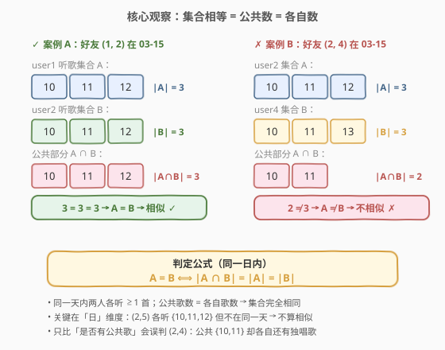
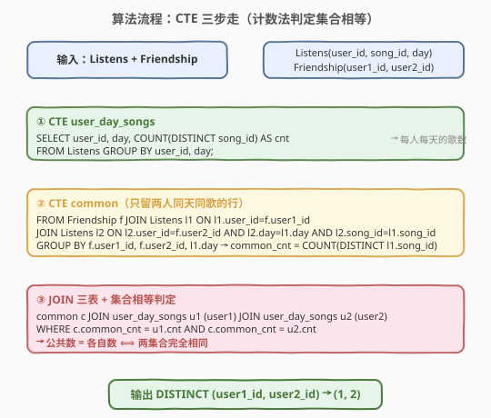
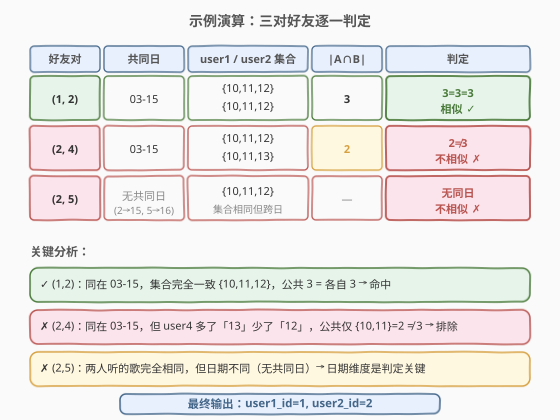

# 兴趣相同的朋友

- **题目名称**：兴趣相同的朋友
- **链接**：[1919. 兴趣相同的朋友](https://leetcode.cn/problems/leetcodify-similar-friends/)
- **难度**：困难
- **标签**：SQL、集合相等、JOIN、GROUP BY、CTE、相关子查询

## 1. 题目概述

Leetcodify 是一个音乐流媒体服务。用户每天会听若干歌曲，收听记录存于 `Listens` 表；用户之间的好友关系存于 `Friendship` 表。两个好友是「兴趣相同的朋友」（similar friends），如果**存在某一天**，他们在这一天听了**完全相同的歌曲集合**（即该天两人 `song_id` 集合完全一致，不多不少）。请编写 SQL 查询返回所有兴趣相同的好友对 `(user1_id, user2_id)`，按 `user1_id`、`user2_id` 升序排列。

**表结构**：

```text
Table: Listens
+-------------+------+
| Column Name | Type |
+-------------+------+
| user_id     | int  |
| song_id     | int  |
| day         | date |
+-------------+------+

Table: Friendship
+-------------+------+
| Column Name | Type |
+-------------+------+
| user1_id    | int  |
| user2_id    | int  |
+-------------+------+
```

> ⚠️ `Listens` 的行表示「某用户在某天听了某首歌」（一个用户一天可听多首，同一 `(user_id, song_id, day)` 不重复）。`Friendship` 每行记录一对好友，`user1_id < user2_id`，好友关系互为对称。

**示例 1**：

```text
输入：
Listens 表:
+---------+---------+------------+
| user_id | song_id | day        |
+---------+---------+------------+
| 1       | 10      | 2021-03-15 |
| 1       | 11      | 2021-03-15 |
| 1       | 12      | 2021-03-15 |
| 2       | 10      | 2021-03-15 |
| 2       | 11      | 2021-03-15 |
| 2       | 12      | 2021-03-15 |
| 3       | 10      | 2021-03-15 |
| 3       | 11      | 2021-03-15 |
| 3       | 12      | 2021-03-15 |
| 4       | 10      | 2021-03-15 |
| 4       | 11      | 2021-03-15 |
| 4       | 13      | 2021-03-15 |
| 5       | 10      | 2021-03-16 |
| 5       | 11      | 2021-03-16 |
| 5       | 12      | 2021-03-16 |
+---------+---------+------------+

Friendship 表:
+----------+----------+
| user1_id | user2_id |
+----------+----------+
| 1        | 2        |
| 2        | 4        |
| 2        | 5        |
+----------+----------+

输出：
+----------+----------+
| user1_id | user2_id |
+----------+----------+
| 1        | 2        |
+----------+----------+
```

**解释**：

| 好友对 | 共同日 | user1 当日集合 | user2 当日集合 | 公共歌数 | 各自歌数 | 结论 |
|--------|--------|----------------|----------------|----------|----------|------|
| (1, 2) | 2021-03-15 | {10, 11, 12} | {10, 11, 12} | 3 | 3 / 3 | 集合相同 → 相似 |
| (2, 4) | 2021-03-15 | {10, 11, 12} | {10, 11, 13} | 2 | 3 / 3 | user4 多「13」少「12」→ 不相似 |
| (2, 5) | 无共同日 | — | — | — | — | user2 在 03-15、user5 在 03-16 → 不相似 |

- 用户 3 虽然与 1、2 在 03-15 听了相同的歌，但与任何人都不存在好友关系，故不参与输出。
- `(2, 5)` 是最大陷阱：两人听歌集合**完全相同** `{10, 11, 12}`，但发生在**不同日期**——题目要求「同一天」，故排除。

> 💡 本题是 SQL **"集合相等判定"招牌题**——难点不在 JOIN，而在如何用关系代数表达「两个无序集合完全相同」。最优雅的判定是**计数法**：$A = B \iff |A \cap B| = |A| = |B|$。考点覆盖 SQL 三要素：**多表 JOIN（好友 × 两人听歌记录）、分组聚合（`GROUP BY` 计各自歌数 / 公共歌数）、集合相等（计数法 / `GROUP_CONCAT` 拼串 / 双重 `NOT EXISTS`）**。⚠️ 本题为 Plus 会员专享题，题面要素据公开用例与表结构整理。

---

## 2. 解题思路

### 2.1 暴力思路：只比「是否有公共歌」

最直觉但**错误**的写法是：好友两人在同一天只要有一首公共歌就算相似——把 `Listens` 自连接到 `(user, song, day)` 相同：

```sql
SELECT DISTINCT f.user1_id, f.user2_id
FROM Friendship f
JOIN Listens l1 ON l1.user_id = f.user1_id
JOIN Listens l2 ON l2.user_id = f.user2_id
                AND l2.day = l1.day AND l2.song_id = l1.song_id;
```

> ⚠️ **致命缺陷**：这只验证了「交集非空」，而非「集合相等」。示例中 `(2, 4)` 在 03-15 共享 `{10, 11}` 两首，会被误判为相似——但 user4 还独听了 `13`、user2 独听了 `12`，两人集合并不相同。正确判定必须保证**公共部分 = 各自全部**，即交集大小等于各自集合大小。

### 2.2 核心观察：集合相等 = 公共数 = 各自数



**关键洞察**：对两个有限集合 $A$、$B$，三者等价：

$$A = B \iff A \subseteq B \text{ 且 } B \subseteq A \iff |A \cap B| = |A| = |B|$$

应用到本题，对每一对好友 `(u1, u2)` 与每一个共同日期 `D`：

- $|A|$ = `u1` 在 `D` 听的**不同歌曲数**（`COUNT(DISTINCT song_id)`）；
- $|B|$ = `u2` 在 `D` 听的不同歌曲数；
- $|A \cap B|$ = 两人在 `D` **同听的歌曲数**——通过 `Listens` 自连接 `ON song_id 相同 AND day 相同` 后 `COUNT(DISTINCT song_id)` 得到。

当 $|A \cap B| = |A| = |B|$ 时，两人在 `D` 听歌集合完全相同 → 相似。

> 💡 **为什么计数法成立？** 显然 $|A \cap B| \le |A|$ 且 $|A \cap B| \le |B|$（交集不超过任一集合）。若 $|A \cap B| = |A|$，说明 $A$ 中所有元素都在交集里，即 $A \subseteq B$；同理 $|A \cap B| = |B|$ 给出 $B \subseteq A$。两者合一即 $A = B$。计数法把「无序集合相等」转化为「三个整数相等」，完美映射到 SQL 的 `COUNT` + `=` 比较。

> ⚠️ **「日」维度是判定的灵魂**：必须在 `day` 相同的前提下比较集合。`(2, 5)` 的听歌集合跨日完全相同，但没有共同日，公共数为 0（甚至无 JOIN 行），自动排除。若漏掉 `day` 维度做全局集合比较，会误纳 `(2, 5)`。

### 2.3 算法流程图



**方法 A（CTE 计数法，推荐）**：

1. **CTE `user_day_songs`**：对 `Listens` 按 `(user_id, day)` 分组，得每人每天的不同歌数 `cnt`（即 $|A|$、$|B|$）。
2. **CTE `common`**：`Friendship` JOIN `Listens`(u1) JOIN `Listens`(u2)，`ON` 条件锁定 `day` 与 `song_id` 都相同，按 `(user1_id, user2_id, day)` 分组得公共歌数 `common_cnt`（即 $|A \cap B|$）。
3. **最终查询**：`common` JOIN `user_day_songs`(u1) JOIN `user_day_songs`(u2)，`WHERE common_cnt = u1.cnt AND common_cnt = u2.cnt`，`DISTINCT` 去掉多日命中产生的重复行。

### 2.4 示例演算

以官方样例演算三对好友的判定过程：



| 好友对 | 共同日 | user1 集合 | user2 集合 | $|A \cap B|$ | $|A|,\ |B|$ | 判定 |
|--------|--------|------------|------------|--------------|-------------|------|
| (1, 2) | 03-15 | {10,11,12} | {10,11,12} | 3 | 3, 3 | 3=3=3 → 相似 ✓ |
| (2, 4) | 03-15 | {10,11,12} | {10,11,13} | 2 | 3, 3 | 2≠3 → 不相似 ✗ |
| (2, 5) | 无 | — | — | — | — | 无共同日 → 不相似 ✗ |

- **(1, 2)**：03-15 两人都听 {10,11,12}，公共 3 等于各自 3 → 命中。
- **(2, 4)**：03-15 两人共享 {10,11}（公共 2），但 user2 还听 12、user4 还听 13 → 公共 2 ≠ 各自 3 → 排除。
- **(2, 5)**：user2 只在 03-15 听歌、user5 只在 03-16，无共同日，`common` CTE 不产生行 → 排除。

> 💡 **观察要点**：① 只要在任一共同日命中即算相似（`DISTINCT` 跨日去重）；② 计数法的精妙在于「三个整数相等」一次性锁定双向子集关系，无需写两个 `NOT EXISTS`；③ `(2,5)` 揭示了「日」维度不可省——集合相同的两人若不在同日活跃，仍不算相似。

---

## 3. 参考代码

### SQL（解法 A：CTE 计数法，推荐）

```sql
WITH user_day_songs AS (
    SELECT user_id, day, COUNT(DISTINCT song_id) AS cnt
    FROM Listens
    GROUP BY user_id, day
),
common AS (
    SELECT f.user1_id, f.user2_id, l1.day,
           COUNT(DISTINCT l1.song_id) AS common_cnt
    FROM Friendship f
    JOIN Listens l1 ON l1.user_id = f.user1_id
    JOIN Listens l2 ON l2.user_id = f.user2_id
                    AND l2.day = l1.day
                    AND l2.song_id = l1.song_id
    GROUP BY f.user1_id, f.user2_id, l1.day
)
SELECT DISTINCT c.user1_id, c.user2_id
FROM common c
JOIN user_day_songs u1 ON u1.user_id = c.user1_id AND u1.day = c.day
JOIN user_day_songs u2 ON u2.user_id = c.user2_id AND u2.day = c.day
WHERE c.common_cnt = u1.cnt
  AND c.common_cnt = u2.cnt
ORDER BY c.user1_id, c.user2_id;
```

> 💡 **写法要点**：
> - **CTE `user_day_songs`** 预算每人每天的歌数 $|A|$、$|B|$，避免在 `HAVING` 里写相关子查询，逻辑分层清晰。
> - **CTE `common`** 的 `JOIN ... AND l2.song_id = l1.song_id` 只保留两人同天同歌的行，`COUNT(DISTINCT l1.song_id)` 即公共歌数 $|A \cap B|$。
> - **最终 `WHERE`** 三个整数相等即集合相等。`DISTINCT` 处理多日同时命中的重复。
> - ✓ **首选**：结构最清晰，把「求各自数 / 求公共数 / 判等」三步解耦，便于面试讲解。

### SQL（解法 B：相关子查询 + HAVING，紧凑版）

```sql
SELECT DISTINCT f.user1_id, f.user2_id
FROM Friendship f
JOIN Listens l1 ON l1.user_id = f.user1_id
JOIN Listens l2 ON l2.user_id = f.user2_id
                AND l2.day = l1.day
                AND l2.song_id = l1.song_id
GROUP BY f.user1_id, f.user2_id, l1.day
HAVING COUNT(DISTINCT l1.song_id) = (
        SELECT COUNT(DISTINCT song_id) FROM Listens
        WHERE user_id = f.user1_id AND day = l1.day
       )
   AND COUNT(DISTINCT l1.song_id) = (
        SELECT COUNT(DISTINCT song_id) FROM Listens
        WHERE user_id = f.user2_id AND day = l1.day
       )
ORDER BY 1, 2;
```

> 💡 **写法要点**：
> - 不用 CTE，把「各自歌数」作为 `HAVING` 中的相关子查询即时计算。`f.user1_id`、`l1.day` 来自 `GROUP BY` 的分组键，相关子查询合法引用。
> - 代码更紧凑但可读性略低于解法 A，且每个分组触发 2 次子查询扫描。
> - 适合不支持 CTE 的旧版 MySQL（5.6 及以下）或不允许写 CTE 的判题环境。

### SQL（解法 C：GROUP_CONCAT 拼串比较，直观版）

```sql
SELECT DISTINCT f.user1_id, f.user2_id
FROM Friendship f
JOIN (
    SELECT user_id, day, GROUP_CONCAT(DISTINCT song_id ORDER BY song_id) AS songs
    FROM Listens
    GROUP BY user_id, day
) a ON a.user_id = f.user1_id
JOIN (
    SELECT user_id, day, GROUP_CONCAT(DISTINCT song_id ORDER BY song_id) AS songs
    FROM Listens
    GROUP BY user_id, day
) b ON b.user_id = f.user2_id AND b.day = a.day
WHERE a.songs = b.songs
ORDER BY 1, 2;
```

> 💡 **写法要点**：
> - 把每人每天的听歌集合**排序后拼成字符串**（如 `10,11,12`），两个集合相等 ⟺ 两个字符串相等。`ORDER BY song_id` 保证顺序一致，`DISTINCT` 去重歌曲。
> - 思路最直观——「集合相等 = 串相等」。但 `GROUP_CONCAT` 是 MySQL 专有函数（默认上限 1024 字节，可用 `group_concat_max_len` 调大），且对 `song_id` 类型敏感。
> - 适合面试时作为「另一种思路」口述，工程上可读性高但可移植性弱于计数法。

### Python（pandas）

```python
import pandas as pd

def leetcodify_similar_friends(listens: pd.DataFrame, friendship: pd.DataFrame) -> pd.DataFrame:
    cnt = listens.groupby(['user_id', 'day'])['song_id'].nunique().reset_index(name='cnt')
    merged = (
        friendship.merge(listens, left_on='user1_id', right_on='user_id')
                  .merge(listens, left_on=['user2_id', 'day', 'song_id'],
                                      right_on=['user_id', 'day', 'song_id'],
                         suffixes=('_1', '_2'))
    )
    common = merged.groupby(['user1_id', 'user2_id', 'day'])['song_id'].nunique().reset_index(name='common_cnt')
    res = (
        common.merge(cnt, left_on=['user1_id', 'day'], right_on=['user_id', 'day'])
              .merge(cnt, left_on=['user2_id', 'day'], right_on=['user_id', 'day'],
                         suffixes=('_1', '_2'))
    )
    res = res[(res['common_cnt'] == res['cnt_1']) & (res['common_cnt'] == res['cnt_2'])]
    return res[['user1_id', 'user2_id']].drop_duplicates().sort_values(['user1_id', 'user2_id']).reset_index(drop=True)
```

> 💡 **pandas 对照**：
> - `groupby(...).nunique()` 对应 `COUNT(DISTINCT song_id)`——每人每天不同歌数。
> - 两次 `merge`（第一次对齐好友与 user1 的听歌行，第二次按 `(user2_id, day, song_id)` 三键对齐）对应 SQL 的两连 `JOIN ON day & song_id 相同`，得到公共歌行。
> - 对公共行再 `groupby(...).nunique()` 得 `common_cnt`，最后 `common_cnt == cnt_1 == cnt_2` 即集合相等，与 SQL 计数法完全同构。

---

## 4. 复杂度分析

| 维度 | 解法 A（CTE 计数法） | 解法 B（相关子查询） | 解法 C（GROUP_CONCAT） |
|------|----------------------|----------------------|------------------------|
| **时间** | $O(L + F \cdot \bar{s}^2)$ | $O(L + F \cdot \bar{s}^2 + g \cdot L)$ | $O(L \log s + F \cdot \bar{s}^2)$ |
| **空间** | $O(L)$（CTE 物化） | $O(1)$ 额外 | $O(L)$（拼串物化） |
| **全表扫描** | 2 次（`Listens` ×2） | 多次（含子查询） | 2 次 |
| **可读性** | ★★★ 分层清晰 | ★★ 紧凑 | ★★★ 直观 |
| **可移植性** | ★★★ 标准 SQL | ★★★ 标准 SQL | ★ MySQL 专有 |
| **推荐度** | ✓ **首选** | ✓ 无 CTE 环境 | ✓ 口述备选 |

> - $L$ = `Listens` 行数，$F$ = `Friendship` 行数，$\bar{s}$ = 单人单日平均听歌数，$g$ = `GROUP BY` 分组数。
> - 三解法的核心开销都在 `common` 的构造：`Friendship` 的每对好友 × 两人在共同日的听歌行做等值连接。若给 `Listens(user_id, day, song_id)` 建复合索引，连接可走索引，实际接近 $O(L + F)$。
> - 解法 B 的相关子查询在每个分组上额外扫描 `Listens`，最坏 $O(g \cdot L)$，性能弱于 A。解法 C 的 `GROUP_CONCAT ... ORDER BY` 对每人每天的 `song_id` 排序，增加 $O(s \log s)$。
> - 三种解法结果完全一致（均输出 `(1, 2)`）。

---

## 5. 扩展：集合相等的三种范式对比

### 5.1 三种集合相等判定法

| 范式 | 核心思想 | SQL 表达 | 适用场景 |
|------|----------|----------|----------|
| **计数法** | $|A \cap B| = |A| = |B|$ | `JOIN` 求公共数 + `COUNT` 求各自数 + `=` 比较 | 集合元素可计数、有自然主键 |
| **拼串法** | 排序后串相等 ⟺ 集合相等 | `GROUP_CONCAT(DISTINCT x ORDER BY x)` | 元素少、MySQL 环境 |
| **双重反链法** | $A \subseteq B$ 且 $B \subseteq A$ | 两个 `NOT EXISTS`（找反例） | 元素不可计数、需严格逻辑表达 |

> 💡 **选择口诀**：**能计数 → 计数法最简洁；元素少且 MySQL → 拼串法最直观；要严谨逻辑或元素不可数 → 双重 `NOT EXISTS`**。本题有 `song_id` 主键可计数，计数法（解法 A）最佳。

### 5.2 双重 NOT EXISTS 写法

用「不存在 user1 听了而 user2 没听的歌，反之亦然」表达集合相等：

```sql
SELECT DISTINCT f.user1_id, f.user2_id
FROM Friendship f
JOIN Listens l1 ON l1.user_id = f.user1_id
JOIN Listens l2 ON l2.user_id = f.user2_id AND l2.day = l1.day
WHERE NOT EXISTS (
      SELECT 1 FROM Listens x
      WHERE x.user_id = f.user1_id AND x.day = l1.day
        AND NOT EXISTS (SELECT 1 FROM Listens y
                        WHERE y.user_id = f.user2_id AND y.day = l1.day
                          AND y.song_id = x.song_id))
  AND NOT EXISTS (
      SELECT 1 FROM Listens x
      WHERE x.user_id = f.user2_id AND x.day = l1.day
        AND NOT EXISTS (SELECT 1 FROM Listens y
                        WHERE y.user_id = f.user1_id AND y.day = l1.day
                          AND y.song_id = x.song_id))
ORDER BY 1, 2;
```

> 💡 **逻辑解读**：外层 `WHERE` 要求「u1、u2 在同一天都有听歌」（`JOIN l1/l2` 锁共同日）；第一个 `NOT EXISTS` 断言「u1 当日听的每首歌，u2 当日都听了」（$A \subseteq B$）；第二个对称断言 $B \subseteq A$。两者合一即 $A = B$。这是最贴近数学定义的写法，但嵌套四层可读性较差。

### 5.3 「存在一日」vs「每日皆然」

本题判定是「**存在**某一天集合相同即相似」。若题意改为「两人在**每一个**共同日集合都相同」，只需把 `WHERE ... = u1.cnt AND ... = u2.cnt` 的命中结果做「反交」：找出有不命中共同日的好友对并排除。计数法框架不变，仅需把最终查询改为「不存在不命中的共同日」的 `NOT EXISTS`。这体现了计数法框架的扩展性。

---

## 6. 面试要点

**Q1：为什么「只比是否有公共歌」是错的？**

> 那只验证了 $|A \cap B| > 0$（交集非空），而非 $A = B$。`(2, 4)` 共享 `{10, 11}` 但各自还有独唱歌，交集非空却集合不等。正确判定必须保证公共部分覆盖各自全部，即 $|A \cap B| = |A| = |B|$。

**Q2：计数法 $|A \cap B| = |A| = |B|$ 为什么等价于集合相等？**

> 交集大小恒不超过任一集合：$|A \cap B| \le |A|$。若等号成立，说明 $A$ 的所有元素都在交集中，即 $A \subseteq B$；同理 $|A \cap B| = |B|$ 给出 $B \subseteq A$。双向子集即 $A = B$。计数法把无序集合相等转化为三个整数相等，完美适配 SQL 的 `COUNT` + `=`。

**Q3：「日」维度为什么不能省？**

> 题目要求「同一天」听相同集合。`(2, 5)` 两人听歌集合完全相同 `{10,11,12}`，但 user2 在 03-15、user5 在 03-16，无共同日。若省略 `day` 做全局集合比较，会误纳 `(2, 5)`。`JOIN ... AND l2.day = l1.day` 锁定共同日是判定的灵魂。

**Q4：CTE 计数法与相关子查询解法各有什么取舍？**

> CTE 法把「求各自数 / 求公共数 / 判等」三步解耦，逻辑分层清晰，每个 CTE 只扫一次表，面试讲解首选；相关子查询法代码紧凑但每个分组触发 2 次子查询扫描，可读性与性能略弱，适合不支持 CTE 的旧环境。两者结果一致。

**Q5：`GROUP_CONCAT` 拼串法有什么陷阱？**

> 三点：① `GROUP_CONCAT` 是 MySQL 专有函数，可移植性弱；② 默认上限 `group_concat_max_len = 1024` 字节，元素多时字符串会被截断导致误判；③ 必须加 `ORDER BY song_id` 保证顺序一致，否则 `{10,11}` 与 `{11,10}` 拼出不同串被误判不等。计数法无这些陷阱，故工程上首选计数法。

> 💡 **一句话总结**：1919 是 SQL **"集合相等判定"招牌题**——核心利用计数法 $|A \cap B| = |A| = |B|$ 把无序集合相等转化为三个整数相等，CTE 三步走（每人每天歌数 → 好友同天公共歌数 → 三数相等）清晰解耦。考点覆盖：**多表 JOIN 锁共同日、`GROUP BY` + `COUNT(DISTINCT)` 求集合大小、集合相等的计数法/拼串法/双重 `NOT EXISTS` 三种范式**。记住「同日 + 公共数 = 各自数」这个判定式。

---

## 7. 同类练习题

- [1809. 没有广告的年份](https://leetcode.cn/problems/ad-free-sessions/)：在 `Playback` 表上判定用户「全程无广告」，需要按 `user_id` 分组后用 `NOT EXISTS` / `LEFT JOIN` 找反例——与 1919 的「双重 `NOT EXISTS` 判集合」同源
- [1174. 即时食物配送 II](https://leetcode.cn/problems/immediate-food-delivery-ii/)：子查询筛首单 + 分组聚合统计占比，同为「筛选特定行 + 聚合」范式，对照 1919 的 CTE 分层
- [1070. 产品销售分析 III](https://leetcode.cn/problems/product-sales-analysis-iii/)：`GROUP BY` + `HAVING` + 子查询极值，与 1919 解法 B 的 `HAVING` 相关子查询同模板
- [602. 好友申请 II：谁有最多的好友](https://leetcode.cn/problems/friend-requests-ii-who-has-the-most-friends/)：`Friendship` 表的 `UNION ALL` 把 `user1_id`/`user2_id` 展平统计——理解好友表双向对称的预处理，对照 1919 直接利用好友对
- [1398. 购买了产品 A 和产品 B 却没有购买产品 C 的顾客](https://leetcode.cn/problems/customers-who-bought-products-a-and-b-but-not-c/)：`GROUP BY` + `HAVING SUM(...) > 0 AND SUM(...) = 0` 判「集合包含/排除」——与 1919 计数法同为「用聚合数判定集合关系」的范式
