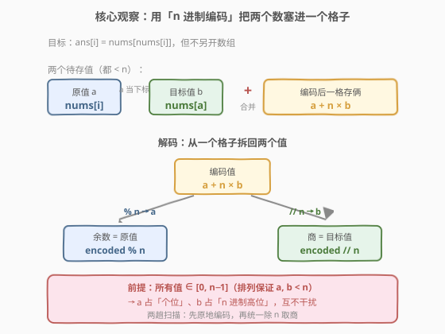
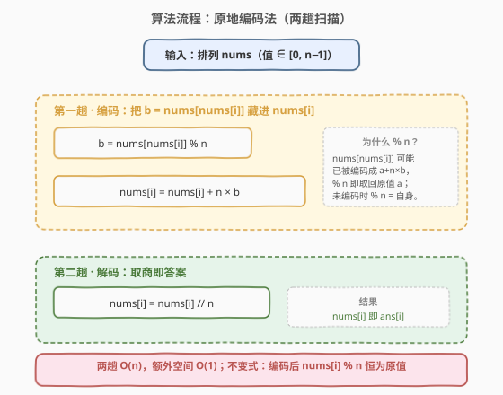
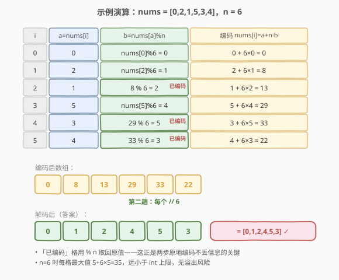

# LeetCode 基于排列构建数组 题解

## 1. 题目概述

- **标题 / 题号**：基于排列构建数组（#1920，easy）
- **链接**：https://leetcode.cn/problems/build-array-from-permutation/
- **难度**：简单
- **标签**：数组、原地哈希、数学

**题意**：给你一个下标从 **0** 开始的**排列** `nums`（即 `nums` 是 `[0, n-1]` 的一个排列），请你构造一个同样长度为 $n$ 的数组 `ans`，满足对每个 $0 \le i < n$：

$$\text{ans}[i] = \text{nums}[\text{nums}[i]]$$

返回数组 `ans`。

**示例 1**：

```text
输入：nums = [0,2,1,5,3,4]
输出：[0,1,2,4,5,3]
解释：ans[0]=nums[nums[0]]=nums[0]=0
      ans[1]=nums[nums[1]]=nums[2]=1
      ans[2]=nums[nums[2]]=nums[1]=2
      ans[3]=nums[nums[3]]=nums[5]=4
      ans[4]=nums[nums[4]]=nums[3]=5
      ans[5]=nums[nums[5]]=nums[4]=3
```

**示例 2**：

```text
输入：nums = [5,0,1,2,3,4]
输出：[4,5,0,1,2,3]
解释：ans[0]=nums[nums[0]]=nums[5]=4
      ans[1]=nums[nums[1]]=nums[0]=5
      其余依此类推。
```

**约束**：

- $1 \le \text{nums.length} \le 1000$
- $0 \le \text{nums}[i] < \text{nums.length}$
- `nums` 是一个排列（即 $[0, n-1]$ 的某种排列）

> 💡 **审题关键**：① `nums` 是**排列**——每个元素 $\text{nums}[i] \in [0, n-1]$，既可当「值」也可当「下标」，这一双重身份是原地编码技巧的前提；② 题目只是「读两次」`nums` 的映射，朴素做法开一个新数组即可；③ 真正的考点是**进阶**：能否做到 $O(1)$ 额外空间（原地完成，不另开数组）。

## 2. 解题思路

### 2.1 暴力思路：另开新数组

最直观的做法：新建数组 `ans`，一趟扫描令 `ans[i] = nums[nums[i]]` 即可。

- **正确性**：直接按定义翻译，显然正确。
- **效率**：时间 $O(n)$，空间 $O(n)$（新数组）。对 $n \le 1000$ 完全足够。

> ⚠️ 这版代码已能 AC，但用了 $O(n)$ 额外空间。若面试官追问「能不能 $O(1)$ 额外空间、原地完成」——难点在于：计算 `ans[i]` 需要 `nums[nums[i]]`，而一旦我们原地改写 `nums[i]`，原本存在 `nums[i]` 的值（它可能被别的位置当「下标」引用）就丢了。如何在不丢失原值的前提下原地完成？见 2.2。

### 2.2 核心观察：n 进制编码原地存两值



关键洞察：**排列保证所有值 $< n$**，所以一个格子可以同时容纳「原值 $a$」与「目标值 $b$」两个 $< n$ 的数——把它们编成 $a + n \times b$。

**编码**：令 $a = \text{nums}[i]$（原值），$b = \text{nums}[a] = \text{nums}[\text{nums}[i]]$（目标值）。由于 $a, b < n$，可把两者合写进同一个格子：

$$\text{nums}[i] \leftarrow a + n \times b$$

此时：
- **原值 $a$** = 编码值 $\bmod n$（即「个位」/低位）；
- **目标值 $b$** = 编码值 $\text{整除}\ n$（即「$n$ 进制高位」）。

两者互不干扰，相当于把一个 `int` 当成两位的「$n$ 进制数」用。

**关键不变式**：编码后任何位置读 `nums[j] % n` 恒等于 `nums[j]` 的**原值**。因此第一趟从左到右编码时，读 `nums[nums[i]]` 可能命中「尚未编码」（值 $< n$，`% n` = 自身）或「已编码」（值 $\ge n$，`% n` 取回原值）两种情况，但 **`nums[nums[i]] % n` 始终拿到原值** $b$，信息绝不丢失。

$$\boxed{\text{第一趟：nums}[i] \mathrel{+}= n \times (\text{nums}[\text{nums}[i]] \bmod n);\quad \text{第二趟：nums}[i] \mathrel{/}= n}$$

> 💡 **为什么必须 `% n` 而不能直接读 `nums[nums[i]]`？** 因为从左到右编码时，下标 `nums[i]` 可能小于 `i`——那格已被改写成 $a + n \times b$（$\ge n$），直接读会把 $a + n \times b$ 当成下标越界/取错值。`% n` 专门用来剥掉「高位」还原原值 $a$。例：示例 1 处理 $i=2$ 时，`nums[2]=1` 指向 `nums[1]`，而 `nums[1]` 已被编成 $8$，`8 % 6 = 2` 正是 `nums[1]` 的原值。

> ⚠️ **溢出检查**：编码值最大为 $(n-1) + n \times (n-1) = n^2 - 1$。$n \le 1000$ 时 $n^2 - 1 \le 10^6 - 1$，远小于 `int` 上限（$\approx 2.1 \times 10^9$），无溢出风险。即便 $n$ 放宽到 $10^5$，$n^2 = 10^{10}$ 才会超 `int`，届时改用 `long long` 即可。

### 2.3 算法流程图



整体两趟：

1. **第一趟 · 编码**（$i$ 从 $0$ 到 $n-1$）：
   - $b \leftarrow \text{nums}[\text{nums}[i]] \bmod n$（取目标原值，兼顾已/未编码）
   - $\text{nums}[i] \leftarrow \text{nums}[i] + n \times b$（把 $b$ 藏进高位）
2. **第二趟 · 解码**（$i$ 从 $0$ 到 $n-1$）：
   - $\text{nums}[i] \leftarrow \text{nums}[i] \ /\ n$（取出高位即答案）

> 💡 **两趟能否合并？** 不能。第二趟的「除 $n$」会破坏「`% n` 取原值」的不变式——一旦某格被除成 $b$，再用它当 `nums[nums[i]]` 的下标就取不到原值了。所以必须先**全部编码完毕**，再**统一解码**，两阶段严格分离。

### 2.4 示例演算

以官方示例 1 `nums = [0,2,1,5,3,4]`（$n=6$）演示两趟原地过程：



| $i$ | $a=\text{nums}[i]$ | $b=\text{nums}[a]\bmod n$ | 编码 $\text{nums}[i]=a+n\cdot b$ | 备注 |
|-----|--------------------|---------------------------|----------------------------------|------|
| 0 | 0 | $\text{nums}[0]\%6=0$ | $0+6\times0=0$ | 指向自身，原值 0 |
| 1 | 2 | $\text{nums}[2]\%6=1$ | $2+6\times1=8$ | nums[2] 未编码 |
| 2 | 1 | $\text{nums}[1]\%6=8\%6=2$ | $1+6\times2=13$ | nums[1] **已编码** → 取模还原 |
| 3 | 5 | $\text{nums}[5]\%6=4$ | $5+6\times4=29$ | nums[5] 未编码 |
| 4 | 3 | $\text{nums}[3]\%6=29\%6=5$ | $3+6\times5=33$ | nums[3] **已编码** → 取模还原 |
| 5 | 4 | $\text{nums}[4]\%6=33\%6=3$ | $4+6\times3=22$ | nums[4] **已编码** → 取模还原 |

- **编码后数组**：`[0, 8, 13, 29, 33, 22]`
- **第二趟每个 `// 6`**：`[0, 1, 2, 4, 5, 3]` —— 与官方答案完全一致 ✓

> 💡 **观察要点**：① 「已编码」的格子在第一趟被 `% n` 完美还原成原值，证明不变式有效；② 自映射位置 $i=0$（$\text{nums}[0]=0$）编码后仍为 $0$，是 $a=b=0$ 的退化情形，无需特判；③ 整个过程没有借助任何额外数组，仅用常数个临时变量。

## 3. 参考代码

### C++（朴素新数组，$O(n)$ 空间）

```cpp
class Solution {
public:
    vector<int> buildArray(vector<int>& nums) {
        int n = nums.size();
        vector<int> ans(n);
        for (int i = 0; i < n; ++i) {
            ans[i] = nums[nums[i]];
        }
        return ans;
    }
};
```

### C++（原地编码，$O(1)$ 额外空间）

```cpp
class Solution {
public:
    vector<int> buildArray(vector<int>& nums) {
        int n = nums.size();
        for (int i = 0; i < n; ++i) {
            nums[i] += n * (nums[nums[i]] % n);
        }
        for (int i = 0; i < n; ++i) {
            nums[i] /= n;
        }
        return nums;
    }
};
```

### Python（朴素新数组）

```python
class Solution:
    def buildArray(self, nums: list[int]) -> list[int]:
        return [nums[x] for x in nums]
```

### Python（原地编码，$O(1)$ 额外空间）

```python
class Solution:
    def buildArray(self, nums: list[int]) -> list[int]:
        n = len(nums)
        for i in range(n):
            nums[i] += n * (nums[nums[i]] % n)
        for i in range(n):
            nums[i] //= n
        return nums
```

> 💡 **写法对照**：① 朴素版直接照搬定义，可读性最高，面试默认先写这版并口述复杂度；② 原地编码版把空间压到 $O(1)$，作为「能否 $O(1)$ 空间」追问的应答。两版时间同为 $O(n)$。Python 朴素版用列表推导一行流，简洁且 Pythonic。

> ⚠️ **原地版修改了输入数组**。若调用方要求保持 `nums` 不变，应改用朴素版（返回新数组）。LeetCode 判题不关心输入是否被改，故原地版可 AC。

> 💡 **`nums[nums[i]] % n` 的顺序**：C++ 中 `nums[i] += n * (nums[nums[i]] % n)` 必须先算右值再赋值——右值里的 `nums[i]` 仍是原值（本步尚未改写），用它当 `nums[nums[i]]` 的下标才正确。切勿写成先改 `nums[i]` 再读 `nums[nums[i]]`，那样下标会被污染。

## 4. 复杂度分析

| 维度 | 朴素新数组 | 原地编码 | 说明 |
|------|-----------|----------|------|
| 时间复杂度 | $O(n)$ | $O(n)$ | 均为线性趟数（朴素 1 趟，原地 2 趟）；每元素 $O(1)$ 运算 |
| 空间复杂度 | $O(n)$ | $O(1)$ | 朴素版需新数组；原地版仅常数临时变量（不计返回所占） |

> 💡 $n \le 1000$，两版都远在时限内。本题的精妙之处在于利用「排列 $\Rightarrow$ 值即下标 $\Rightarrow$ 值 $< n$」这一结构，把「两趟读」压缩成「原地两趟写」，把 $O(n)$ 空间降到 $O(1)$。

## 5. 扩展：编码位数与一般化

「一格存两值」本质是**把一个整数当多位进制数复用**，本题是 $n$ 进制存两位。该思想有多种变体：

- **二进制位复用**：[289. 生命游戏](https://leetcode.cn/problems/game-of-life/) 用「低位存当前态、高位存下一态」原地推进，思想完全同源，只是进制取 2。
- **$+n$ 标记法**：[448. 找到所有数组中消失的数字](../0401-0500/448_找到所有数组中消失的数字.md) 与 [442. 数组中重复的数据](https://leetcode.cn/problems/find-all-duplicates-in-an-array/) 对每个值 $v$ 在 `nums[v-1]` 上 `+= n`，最后 `// n` 判断某值是否出现——只关心「高位是否非零」，是本题编码的「布尔退化版」。
- **下标归位法**：[41. 缺失的第一个正数](../0001-0100/41_缺失的第一个正数.md) 直接把值 $v$ 交换到下标 $v-1$，用「位置」本身记录信息，是另一种原地哈希范式（交换型，区别于本题的编码型）。

> ⚠️ 本题能成立「$a + n \times b$」编码，**严格依赖** $a, b < n$。若数组不是排列（值可能 $\ge n$），编码会与原值混淆，此法失效——需改用「交换归位」或额外哈希。

## 6. 面试要点

**Q1：原地编码为什么一定要先 `% n` 再读 `nums[nums[i]]`？**

> 从左到右编码时，`nums[i]` 指向的下标可能已被改写成 $a + n \times b$（$\ge n$）。直接读会把整个编码值当下标，越界或取错；`% n` 剥掉高位还原原值 $a$，才能正确取到「下标 `nums[i]` 处的原值」$b$。未编码的格子值 $< n$，`% n` 仍是自身，两种情况统一成立。

**Q2：为什么两趟不能合并成一趟？**

> 第二趟的 `// n` 会把格子改成 $b$，破坏「`% n` 取原值」的不变式。一旦某格被除成 $b$，后续若用它当 `nums[nums[i]]` 的下标，`% n` 取到的就不再是原值，信息丢失。所以必须先**全部编码完毕**（保证全程不变式成立），再**统一解码**，两阶段严格分离。

**Q3：编码值 $a + n \times b$ 会溢出吗？**

> 最大值为 $(n-1) + n(n-1) = n^2 - 1$。本题 $n \le 1000$，最大 $\approx 10^6$，远小于 `int` 上限。即便 $n$ 放宽到 $10^5$（$n^2 = 10^{10}$），改用 `long long` 即可。Python 整数任意精度，无此虑。

**Q4：朴素版和原地版该如何选择？**

> 朴素版可读性高、不破坏输入，是工程默认；原地版空间 $O(1)$，用于「限制额外空间」的追问或内存敏感场景。两者时间同为 $O(n)$。面试先写朴素版讲清思路，再以原地版作为 follow-up 优化，体现「先正确后优化」的节奏。

**Q5：题目给的是「排列」这一条件用在了哪里？**

> 排列保证 $\text{nums}[i] \in [0, n-1]$，使得：① 每个值都能当合法下标（`nums[nums[i]]` 不越界）；② 编码 $a + n \times b$ 中 $a, b < n$，互不干扰、`% n` 与 `// n` 能干净拆分。若非排列（值域更大），此编码失效，需换「交换归位」或额外哈希。

> 💡 **一句话总结**：排列 $\Rightarrow$ 值即下标且 $< n$ $\Rightarrow$ 用 $a + n \times b$ 一格存两值 $\Rightarrow$ 两趟原地扫描，$O(n)$ 时间 $O(1)$ 空间。

## 同类练习题

| # | 题目 | 与本题的关联 |
|---|------|-------------|
| 448 | [找到所有数组中消失的数字](https://leetcode.cn/problems/find-all-numbers-disappeared-in-an-array/)（[题解](../0401-0500/448_找到所有数组中消失的数字.md)） | 同样用「$+n$ 编码 / `% n` 解码」原地标记，把额外信息藏进格子高位，与本题 $n$ 进制编码同源 |
| 442 | [数组中重复的数据](https://leetcode.cn/problems/find-all-duplicates-in-an-array/) | $+n$ 编码后 `// n` 判断是否重复，同属「原地哈希」家族，对照本题的「存两值」与它的「存布尔」 |
| 289 | [生命游戏](https://leetcode.cn/problems/game-of-life/) | 用二进制位编码「当前态 + 下一态」原地推进，思想同为「一格存多位」，进制取 2 的特例 |
| 41 | [缺失的第一个正数](https://leetcode.cn/problems/first-missing-positive/)（[题解](../0001-0100/41_缺失的第一个正数.md)） | 原地哈希的「交换归位」范式，对照体会「编码型」与「交换型」两种原地技巧 |
| 268 | [丢失的数字](https://leetcode.cn/problems/missing-number/) | 同为「排列/前缀」主题的简单题，用等差求和或异或找缺失值，可作热身对照 |
