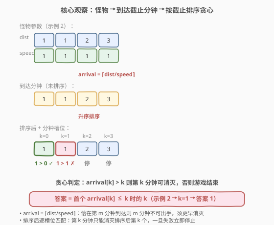
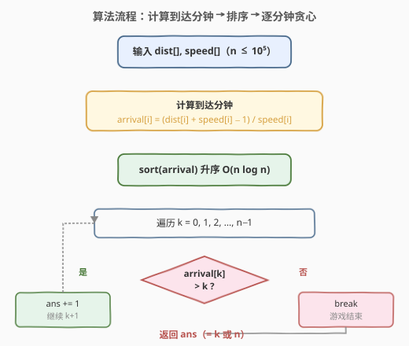
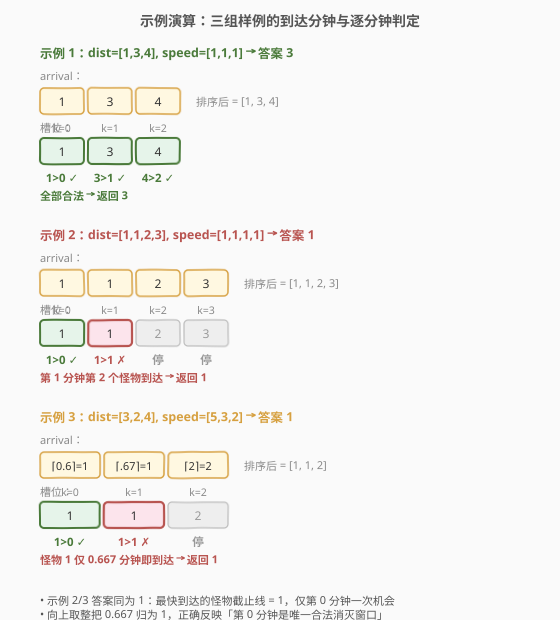

# 消灭怪物的最大数量

- **题目名称**：消灭怪物的最大数量
- **链接**：[1921. 消灭怪物的最大数量](https://leetcode.cn/problems/eliminate-maximum-number-of-monsters/)
- **难度**：中等
- **标签**：贪心、排序、数组

## 1. 题目概述

你正在玩一款电子游戏，需要保护城市免受怪物侵袭。给定下标从 0 开始的整数数组 `dist` 和 `speed`，其中 `dist[i]` 是第 $i$ 个怪物与城市的**初始距离**（千米），`speed[i]` 是第 $i$ 个怪物的**恒定速度**（千米/分）。

你有一种武器，充满电后可消灭**一个**怪物，但武器需要**一分钟**充电。武器在游戏开始时是充满电的状态，怪物从**第 0 分钟**开始移动。

一旦任一怪物到达城市（距离为 0），你就输掉游戏。若某怪物**恰好**在某一分钟开始时到达城市，也视为输掉——在你使用武器之前游戏就结束。返回你输掉游戏前可以消灭的怪物**最大数量**。若能在所有怪物到达前全部消灭，返回 $n$。

**示例 1**：

```text
输入：dist = [1,3,4], speed = [1,1,1]
输出：3
解释：
第 0 分钟开始时，怪物距离 [1,3,4]，消灭第 1 个。
第 1 分钟开始时，怪物距离 [X,2,3]，消灭第 2 个。
第 2 分钟开始时，怪物距离 [X,X,2]，消灭第 3 个。
全部 3 个怪物都被消灭。
```

**示例 2**：

```text
输入：dist = [1,1,2,3], speed = [1,1,1,1]
输出：1
解释：
第 0 分钟开始时，怪物距离 [1,1,2,3]，消灭第 1 个。
第 1 分钟开始时，怪物距离 [X,0,1,2]，第 2 个怪物恰好到达，你输了。
只能消灭 1 个怪物。
```

**示例 3**：

```text
输入：dist = [3,2,4], speed = [5,3,2]
输出：1
解释：
第 0 分钟开始时，怪物距离 [3,2,4]，消灭第 1 个。
第 1 分钟开始时，怪物距离 [X,0,2]，第 2 个怪物恰好到达，你输了。
只能消灭 1 个怪物。
```

**约束条件**：

- $n == \text{dist.length} == \text{speed.length}$
- $1 \le n \le 10^5$
- $1 \le \text{dist}[i], \text{speed}[i] \le 10^5$

> 💡 **审题关键**：① 武器**开始时充满电**——第 0 分钟即可消灭一个怪物，之后每分钟充好一次；② 怪物**恒速**移动，位置可解析计算 $\text{pos}_i(t) = \text{dist}[i] - t \cdot \text{speed}[i]$；③ 判负时机是「任一怪物到达城市」的瞬间，若恰好在某分钟开始时到达（距离为 0），**先判负再轮到你出手**——这意味着你必须在怪物到达**之前**的那一分钟就消灭它；④ 每分钟只能消灭一个，问最多消灭几个——本质是「带截止时间的单机调度」问题。

---

## 2. 解题思路

### 2.1 暴力思路：枚举消灭顺序

最直观的做法是枚举所有可能的消灭顺序（排列），对每个顺序模拟逐分钟消灭过程，检查是否在某一分钟有怪物提前到达，取所有合法顺序中消灭数量的最大值。

- **正确性**：穷举所有顺序，取最大，显然正确。
- **效率**：$n!$ 种排列，每种还需 $O(n)$ 模拟，对 $n = 10^5$ 完全不可行。

> ⚠️ 暴力法的浪费在于「盲目试顺序」。实际上，每分钟消灭哪个怪物只取决于「谁最快到达城市」——我们应当**先消灭最迫近的怪物**，把消灭顺序从「排列搜索」压缩为「按截止时间排序」一次贪心选择。

### 2.2 核心观察：把怪物换成「截止时间」再贪心调度



关键洞察分三步：

**第一步：把「距离 + 速度」换成「到达时刻」。** 怪物 $i$ 恒速移动，位置随时间线性变化 $\text{pos}_i(t) = \text{dist}[i] - t \cdot \text{speed}[i]$。它到达城市（$\text{pos} = 0$）的真实时刻为

$$t_i = \frac{\text{dist}[i]}{\text{speed}[i]} \quad (\text{实数})$$

这是怪物 $i$ 的**生死截止线**：你必须在这个时刻**之前**消灭它，否则游戏结束。

**第二步：把「连续时刻」换成「整数分钟截止」。** 你只能在整数分钟 $0, 1, 2, \ldots$ 出手。第 $k$ 次消灭发生在第 $k$ 分钟。怪物 $i$ 在第 $k$ 分钟开始时的位置为 $\text{dist}[i] - k \cdot \text{speed}[i]$；若 $\le 0$，说明它已到达。为避免浮点误差，用**向上取整**把实数截止线换成整数分钟截止线：

$$\text{arrival}_i = \left\lceil \frac{\text{dist}[i]}{\text{speed}[i]} \right\rceil = \left\lfloor \frac{\text{dist}[i] + \text{speed}[i] - 1}{\text{speed}[i]} \right\rfloor$$

> 💡 **为什么用 $\lceil \rceil$ 而非 $\lfloor \rfloor$？** 因为「恰好在某分钟开始时到达」也算输——必须在该分钟**之前**出手。例如 $\text{dist}=2, \text{speed}=1$：怪物在第 2 分钟开始时距离为 0，你**不能**在第 2 分钟消灭它，只能在第 0、1 分钟。$\lceil 2/1 \rceil = 2$，条件「$\text{arrival} > k$」在 $k=0,1$ 成立、$k=2$ 失败，正好对应「第 2 分钟前必须消灭」。

**第三步：贪心——按截止线升序消灭。** 这等价于经典的「单机调度，每个任务耗时 1，最大化按时完成的任务数」问题。最优策略是**按截止时间升序**逐分钟消灭：排序后，第 $k$ 个（0 下标）怪物分配到第 $k$ 分钟，当且仅当 $\text{arrival}[k] > k$ 时合法。

$$\text{第 } k \text{ 个怪物能消灭} \iff \text{arrival}[k] > k$$

$$\boxed{\text{答案} = \max\{k \mid \text{排序后 } \text{arrival}[0..k-1] \text{ 均满足 } \text{arrival}[j] > j\}}$$

> 💡 **为什么按截止线升序最优？** 用交换论证：若最优方案中存在相邻两次消灭 $A$（第 $k$ 分钟）和 $B$（第 $k+1$ 分钟）且 $\text{deadline}_A > \text{deadline}_B$（即先消灭了截止更晚的 $A$），交换二者后 $B$ 提前到第 $k$ 分钟、$A$ 推后到第 $k+1$ 分钟。由于 $\text{deadline}_B \le \text{deadline}_A$，$B$ 在第 $k$ 分钟更宽松（原本第 $k+1$ 分钟都合法，第 $k$ 分钟更合法）；$A$ 推后到第 $k+1$ 分钟仍可能合法（因 $\text{deadline}_A$ 更大）。反复交换消除逆序，最终得到「按截止线升序」的方案，消灭数量不减少——故升序最优。

> ⚠️ **最高频陷阱**：用浮点数 $\text{dist}[i] / \text{speed}[i]$ 直接比较 $> k$。当 $\text{dist}=10^5, \text{speed}=1$ 时浮点精度足以应付，但更稳妥的写法是整数向上取整 `(dist + speed - 1) / speed`，避免任何精度争议。另一个陷阱是误用向下取整——会少算一分钟的余量，导致示例 2 这类「恰好整分钟到达」的用例判错。

### 2.3 算法流程图



**主流程（贪心 + 排序）**：

1. 对每个怪物 $i$，计算整数到达分钟 $\text{arrival}[i] = (\text{dist}[i] + \text{speed}[i] - 1) / \text{speed}[i]$（向上取整）。
2. 将 $\text{arrival}$ 数组**升序排序**。
3. 令 $\text{ans} = 0$，从 $k = 0$ 开始遍历：
   - 若 $\text{arrival}[k] > k$，则 $\text{ans} \mathrel{+}= 1$，继续 $k \mathrel{+}= 1$；
   - 否则**break**——此怪物及之后都无法在到达前消灭，游戏结束。
4. 返回 $\text{ans}$。

> 💡 **为什么一旦失败就 break？** 排序后 $\text{arrival}$ 单调不减，若 $\text{arrival}[k] \le k$，则对任意 $j > k$ 有 $\text{arrival}[j] \ge \text{arrival}[k]$，但 $j > k$，所以 $\text{arrival}[j] > j$ 是否成立不确定——**然而**，第 $k$ 分钟时第 $k$ 个怪物已到达，游戏在第 $k$ 分钟开始就结束了，根本没有机会处理第 $k+1$ 个。因此一旦失败立即停止，前面的 $k$ 个就是最大消灭数。

### 2.4 示例演算

以三个官方样例演示「计算到达分钟 → 排序 → 逐分钟判定」的全过程：



**示例 1**：`dist=[1,3,4], speed=[1,1,1]`

| 怪物 | dist | speed | arrival = ⌈dist/speed⌉ |
|------|------|-------|------------------------|
| 0 | 1 | 1 | 1 |
| 1 | 3 | 1 | 3 |
| 2 | 4 | 1 | 4 |

排序后 `arrival = [1, 3, 4]`：
- $k=0$：$1 > 0$ ✓，消灭 1 个；
- $k=1$：$3 > 1$ ✓，消灭 2 个；
- $k=2$：$4 > 2$ ✓，消灭 3 个。
- 答案 **3**。

**示例 2**：`dist=[1,1,2,3], speed=[1,1,1,1]`

| 怪物 | dist | speed | arrival |
|------|------|-------|---------|
| 0 | 1 | 1 | 1 |
| 1 | 1 | 1 | 1 |
| 2 | 2 | 1 | 2 |
| 3 | 3 | 1 | 3 |

排序后 `arrival = [1, 1, 2, 3]`：
- $k=0$：$1 > 0$ ✓，消灭 1 个；
- $k=1$：$1 > 1$ ✗，第 1 分钟开始时第 2 个怪物距离为 0，游戏结束。
- 答案 **1**。

**示例 3**：`dist=[3,2,4], speed=[5,3,2]`

| 怪物 | dist | speed | arrival = ⌈dist/speed⌉ |
|------|------|-------|------------------------|
| 0 | 3 | 5 | ⌈0.6⌉ = 1 |
| 1 | 2 | 3 | ⌈0.667⌉ = 1 |
| 2 | 4 | 2 | ⌈2⌉ = 2 |

排序后 `arrival = [1, 1, 2]`：
- $k=0$：$1 > 0$ ✓，消灭 1 个；
- $k=1$：$1 > 1$ ✗，第 1 分钟开始时怪物 1 距离 $2 - 1\times3 = -1 < 0$（其实在 0.667 分钟就到了），游戏结束。
- 答案 **1**。

> 💡 **观察要点**：① 示例 2 与示例 3 的差异在于速度——示例 2 怪物匀速 1，示例 3 怪物 0、1 极快（0.6、0.667 分钟就到），但两者答案都是 1，因为「最快到达的怪物」决定了你只有第 0 分钟一次机会；② 排序后**前两个 arrival 都是 1**，意味着这两个怪物都只能在第 0 分钟消灭，而你只有一次第 0 分钟——这就是「截止线相同但槽位不够」的典型失败；③ 向上取整把 $0.667$ 归为 $1$，保证「第 0 分钟是唯一合法消灭窗口」的判断正确。

---

## 3. 参考代码

### C++（整数向上取整 + 排序贪心）

```cpp
class Solution {
public:
    int eliminateMaximum(vector<int>& dist, vector<int>& speed) {
        int n = dist.size();
        vector<int> arrival(n);
        for (int i = 0; i < n; ++i) {
            arrival[i] = (dist[i] + speed[i] - 1) / speed[i];
        }
        sort(arrival.begin(), arrival.end());
        for (int k = 0; k < n; ++k) {
            if (arrival[k] <= k) {
                return k;
            }
        }
        return n;
    }
};
```

### C++（避免额外数组，原地改写 dist）

```cpp
class Solution {
public:
    int eliminateMaximum(vector<int>& dist, vector<int>& speed) {
        int n = dist.size();
        for (int i = 0; i < n; ++i) {
            dist[i] = (dist[i] + speed[i] - 1) / speed[i];
        }
        sort(dist.begin(), dist.end());
        for (int k = 0; k < n; ++k) {
            if (dist[k] <= k) return k;
        }
        return n;
    }
};
```

### Python（排序贪心）

```python
class Solution:
    def eliminateMaximum(self, dist: List[int], speed: List[int]) -> int:
        arrival = sorted((d + s - 1) // s for d, s in zip(dist, speed))
        for k, t in enumerate(arrival):
            if t <= k:
                return k
        return len(arrival)
```

### Python（math.ceil 浮点版，对照整数版）

```python
import math

class Solution:
    def eliminateMaximum(self, dist: List[int], speed: List[int]) -> int:
        arrival = sorted(math.ceil(d / s) for d, s in zip(dist, speed))
        for k, t in enumerate(arrival):
            if t <= k:
                return k
        return len(arrival)
```

> 💡 **写法对照**：① 整数向上取整 `(d + s - 1) // s` 是首选，零精度风险、无需引入 `math`；② `math.ceil(d / s)` 语义直白，但依赖浮点——本题 $d, s \le 10^5$，浮点精度足够，工程上仍推荐整数版以求稳；③ 原地改写 `dist` 省一个 $O(n)$ 数组，但会破坏输入，仅在明确允许修改输入时使用。三版结果一致。

> 💡 **贪心调度模板**：「计算截止时间 → 排序 → 逐个分配最早可用槽位」是「单机调度最大化按时任务数」的通用套路。本题每个任务耗时恰好 1，所以槽位就是 $k$ 本身，判定退化为 `arrival[k] > k`。若任务耗时不同，需用堆维护「当前时间」并按截止时间堆排——见 [253. 会议室 II](https://leetcode.cn/problems/meeting-rooms-ii/) 的变体。

---

## 4. 复杂度分析

| 维度 | 复杂度 | 说明 |
|------|--------|------|
| 时间复杂度 | $O(n \log n)$ | 计算到达分钟 $O(n)$ + 排序 $O(n \log n)$ + 单趟判定 $O(n)$，瓶颈在排序 |
| 空间复杂度 | $O(n)$ | 存放 `arrival` 数组（原地版可降到 $O(\log n)$ 排序栈空间，但会破坏输入） |

> 💡 $n \le 10^5$，$O(n \log n)$ 远在时限内。本题的优雅之处在于把「$n!$ 顺序枚举」化简为「$O(n \log n)$ 排序 + 单趟贪心」——关键在于识别出「每个怪物有独立截止时间 + 每分钟固定消灭一个」的调度结构，从而用排序消除顺序搜索。

---

## 5. 扩展：若武器充电时间不同 / 怪物加速会怎样？

**变体 A：武器需要 $c$ 分钟充电（$c > 1$）。** 此时消灭时刻不再是 $0, 1, 2, \ldots$，而是 $0, c, 2c, \ldots$。第 $k$ 次消灭发生在第 $k \cdot c$ 分钟，判定条件改为 $\text{arrival}[k] > k \cdot c$。排序贪心策略不变，只需调整槽位步长。

**变体 B：怪物加速（速度随时间递增）。** 此时位置不再线性 $\text{dist} - t \cdot \text{speed}$，到达时刻需解方程 $\text{pos}_i(t) = 0$（如匀加速 $a$ 则 $\text{speed}_i \cdot t + \tfrac{1}{2} a t^2 = \text{dist}$），求根后仍得实数截止线 $t_i$，取 $\lceil t_i \rceil$ 后排序贪心同样适用——**只要「每个怪物有独立截止线 + 单位时间消灭一个」的结构不变，贪心框架就成立**。

**变体 C：每分钟可消灭多个（多武器）。** 退化为「多机调度」，需用最小堆维护每台机器的下次空闲时刻，按截止时间排序后把任务分配给最早空闲且能在截止前完成的机器。

> ⚠️ 本题保证 $\text{speed}[i] \ge 1$（怪物必动），且 $\text{dist}[i] \ge 1$（初始未到），故每个怪物都有有限正的截止线。若允许 $\text{speed}=0$（怪物不动），则该怪物永不到达，可任意延后消灭——排序时将其 arrival 视为 $+\infty$ 即可。

---

## 6. 面试要点

**Q1：为什么把距离和速度转成「到达分钟」是关键一步？**

> 因为武器按分钟离散出手，而怪物连续移动。把连续位置 $\text{dist} - t \cdot \text{speed}$ 解析地求根得到到达时刻 $t_i = \text{dist}/\text{speed}$，就把「谁先到」从动态模拟问题降维成静态排序问题——每个怪物有一个确定的截止线，剩下的就是调度。

**Q2：为什么用向上取整而不是向下取整？**

> 题目规定「恰好在某分钟开始时到达（距离为 0）也算输，且先判负再轮到你出手」。若 $\text{dist}/\text{speed}$ 是整数 $m$，怪物在第 $m$ 分钟开始时距离为 0，你**不能**在第 $m$ 分钟消灭它。向上取整 $\lceil \text{dist}/\text{speed} \rceil = m$，配合条件 $\text{arrival} > k$，在 $k = m$ 时失败，正好禁止第 $m$ 分钟出手。向下取整会得 $m-1$ 或 $m$（视是否整除），导致边界判定错乱。

**Q3：贪心「按截止时间升序消灭」为什么最优？**

> 交换论证：若最优解中存在相邻两次消灭 $A$（第 $k$ 分钟）、$B$（第 $k+1$ 分钟）且 $\text{deadline}_A > \text{deadline}_B$，交换后 $B$ 提前到第 $k$ 分钟（更宽松，因 $\text{deadline}_B$ 更小但 $k < k+1$，仍合法），$A$ 推后到第 $k+1$ 分钟（因 $\text{deadline}_A$ 更大，仍可能合法）。反复消除逆序得不劣于原解的升序方案，故升序最优。

**Q4：为什么一旦 `arrival[k] <= k` 就立即 break，而不是继续看后面的？**

> 因为第 $k$ 分钟开始时，排序后第 $k$ 个怪物（截止最早的未消灭者）已到达，游戏**在这一刻结束**，根本没有第 $k+1$ 分钟。所以前 $k$ 个就是最大消灭数，后续无需再看。即便后面有 $\text{arrival}[j] > j$ 的怪物，也轮不到你出手。

**Q5：整数向上取整 `(dist + speed - 1) / speed` 相比浮点 `ceil(dist / speed)` 有什么优势？**

> 零精度风险。虽然本题数据范围 $10^5$ 内浮点 double 精度（约 15-16 位有效数字）足够，但整数版不依赖任何浮点假设，跨语言、跨平台结果一致，是工程上的稳健首选。此外整数除法通常比浮点除法 + ceil 调用略快。

> 💡 **一句话总结**：每个怪物有到达截止线 $\lceil \text{dist}/\text{speed} \rceil$，按截止线升序排序后逐分钟消灭，第 $k$ 个能消灭当且仅当 $\text{arrival}[k] > k$——$O(n \log n)$ 贪心调度搞定。

---

## 7. 同类练习题

- [253. 会议室 II](https://leetcode.cn/problems/meeting-rooms-ii/)：经典的「带起止时间的区间调度」，用最小堆维护重叠会议数，与本题「带截止时间的任务调度」同为贪心调度家族，对照「排序 + 堆」与「排序 + 单趟」的差异
- [630. 课程表 III](https://leetcode.cn/problems/course-schedule-iii/)：每门课有持续时间和截止时间，最大化按时完成课程数——同样是「单机调度 + 截止时间」贪心，但任务耗时不同，需用大根堆维护可替换决策，是本题的进阶版
- [870. 优势洗牌](https://leetcode.cn/problems/advantage-shuffle/)：田忌赛马式贪心，按值排序后分配，与本题「排序后逐槽位匹配」的贪心结构同源，体会「排序消除顺序搜索」的通用思路
- [453. 最小移动次数使数组元素相等](https://leetcode.cn/problems/minimum-moves-to-equal-array-elements/)：把「增量操作」逆向思考为「减量」的贪心转换，对照本题把「距离+速度」转换为「截止时间」的逆向建模思维
