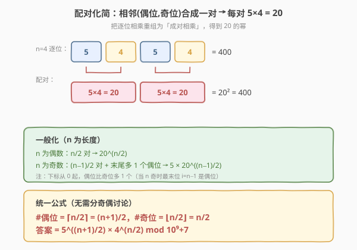
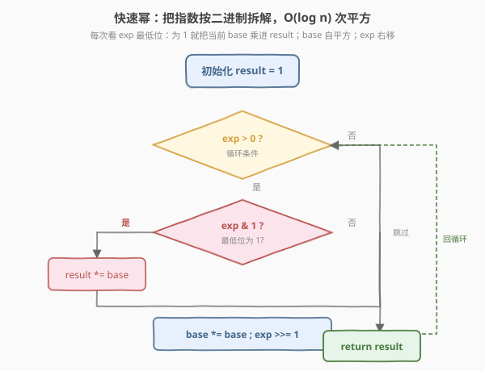
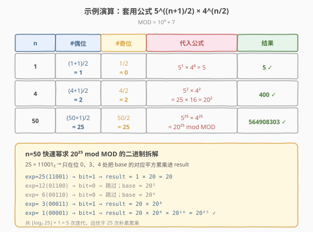

# LeetCode 统计好数字的数目 题解

## 1. 题目概述

- **标题 / 题号**：统计好数字的数目（#1922，medium）
- **链接**：https://leetcode.cn/problems/count-good-numbers/
- **难度**：中等
- **标签**：数学、快速幂、组合计数

**题意**：我们称一个数字字符串是**好数字**，当它满足（下标从 0 开始）：

- **偶数下标**处的数字为**偶数**（即 $0, 2, 4, 6, 8$ 之一）；
- **奇数下标**处的数字为**质数**（即 $2, 3, 5, 7$ 之一）。

例如 `"2582"` 是好数字：偶数下标处的 `2`、`8` 是偶数，奇数下标处的 `5`、`2` 是质数。而 `"3245"` 不是：`3` 出现在偶数下标但不是偶数。

给定整数 $n$，返回长度为 $n$ 的好数字字符串**总数**。由于答案可能很大，请对 $10^9 + 7$ 取余后返回。数字字符串每一位由 $0$–$9$ 组成，允许前导 $0$。

**示例 1**：

```text
输入：n = 1
输出：5
解释：长度为 1 的好数字包括 "0","2","4","6","8"（只有下标 0，必须是偶数）。
```

**示例 2**：

```text
输入：n = 4
输出：400
```

**示例 3**：

```text
输入：n = 50
输出：564908303
```

**约束**：

- $1 \le n \le 10^{15}$

## 2. 解题思路

### 2.1 暴力思路

枚举所有长度为 $n$ 的数字字符串（共 $10^n$ 个），逐个检查每个位置是否符合偶位为偶数、奇位为质数。时间复杂度 $O(10^n \cdot n)$，而 $n$ 可达 $10^{15}$，完全不可行——连「枚举」这一步本身在物理上就不可能完成。

> 需要换一个角度：不要「枚举后判断」，而要「直接构造计数」——这正是组合计数的典型思维反转。

### 2.2 核心观察：各位独立 → 乘法原理


关键观察：**每个位置的选择互相独立**。第 $i$ 位能放哪些数字，**只取决于 $i$ 的奇偶性**，与其它位放什么无关。因此可以用**乘法原理**直接把每位的可选数量乘起来：

| 位置类型 | 下标特征 | 允许的数字 | 选择数 |
|----------|----------|------------|--------|
| 偶位 | $i$ 为偶数（$i=0,2,4,\dots$） | $\{0,2,4,6,8\}$ | $5$ |
| 奇位 | $i$ 为奇数（$i=1,3,5,\dots$） | $\{2,3,5,7\}$ | $4$ |

设长度为 $n$ 时：

- 偶位数量 $\#\text{even} = \lceil n/2 \rceil = \lfloor (n+1)/2 \rfloor$（下标 $0, 2, \dots, n-1$ 或 $n-2$，偶位比奇位多 1 个或相等）
- 奇位数量 $\#\text{odd} = \lfloor n/2 \rfloor$

于是答案为：

$$
\text{ans} = 5^{\#\text{even}} \cdot 4^{\#\text{odd}} \bmod (10^9+7)
$$

> 💡 **为什么不需要 DP？** 经典的「构造合法串计数」问题里，如果各位选择互相独立，就直接用乘法原理；只有当某位的选择**依赖前一位**（如「相邻不能相同」「需满足某种前缀约束」）时才需要 DP。本题各位独立，因此一步组合公式即可。

### 2.3 配对化简：$20$ 的幂



公式 $5^{\#\text{even}} \cdot 4^{\#\text{odd}}$ 可以进一步重组。注意到下标总是「偶位、奇位、偶位、奇位……」交替出现，把**相邻的一个偶位和一个奇位**配成一对，每对的方案数为 $5 \times 4 = 20$：

- $n$ 为**偶数**：恰好 $n/2$ 对，无剩余 → $\text{ans} = 20^{n/2}$
- $n$ 为**奇数**：$(n-1)/2$ 对 + 最末位多出 $1$ 个偶位（下标 $n-1$） → $\text{ans} = 5 \cdot 20^{(n-1)/2}$

两种视角等价，统一公式仍为 $5^{(n+1)/2} \cdot 4^{n/2}$，但「$20$ 的幂」视角更直观地揭示了为什么答案增长得如此之快（每多一对就 $\times 20$）。

### 2.4 算法流程：快速幂



$n$ 可达 $10^{15}$，朴素循环累乘 $5$ 和 $4$ 各做 $O(n)$ 次显然不行。必须使用**快速幂（binary exponentiation）**，把 $O(n)$ 降到 $O(\log n)$：

1. 计算 $\#\text{even} = (n+1)/2$（整数除法）、$\#\text{odd} = n/2$。
2. 用快速幂分别求 $5^{\#\text{even}} \bmod \text{MOD}$ 与 $4^{\#\text{odd}} \bmod \text{MOD}$。
3. 两者相乘再取模即为答案。

快速幂核心：把指数按二进制拆解，每次看 $\text{exp}$ 最低位——为 $1$ 就把当前 $\text{base}$ 累乘进 $\text{result}$；无论是否为 $1$，$\text{base}$ 都自平方、$\text{exp}$ 右移一位。整个过程 $O(\log \text{exp})$。

> ⚠️ **取模细节**：每一步乘法后立即取模，避免中间值溢出。C++ 中 `long long` 乘 `long long` 不会溢出（最大 $\text{MOD}^2 \approx 10^{18} < 9.2 \times 10^{18}$），但务必用 `long long` 而非 `int`。

### 2.5 示例演算



| $n$ | $\#\text{even}=(n+1)/2$ | $\#\text{odd}=n/2$ | 代入公式 | 结果 |
|-----|-------------------------|--------------------|----------|------|
| $1$ | $1$ | $0$ | $5^1 \times 4^0 = 5$ | $5$ ✓ |
| $4$ | $2$ | $2$ | $5^2 \times 4^2 = 25 \times 16 = 20^2 = 400$ | $400$ ✓ |
| $50$ | $25$ | $25$ | $5^{25} \times 4^{25} = 20^{25} \bmod (10^9+7)$ | $564908303$ ✓ |

以 $n=50$ 为例，快速幂求 $20^{25}$ 时，$25 = 11001_2$，只在二进制位 $0, 3, 4$ 为 $1$ 处把 $\text{base}$ 的对应平方（$20^1, 20^8, 20^{16}$）累乘进 $\text{result}$，共 $\lfloor \log_2 25 \rfloor + 1 = 5$ 次迭代即可。

## 3. 参考代码

### C++

```cpp
class Solution {
    static const long long MOD = 1e9 + 7;

    long long quickPow(long long base, long long exp) {
        long long result = 1;
        base %= MOD;
        while (exp > 0) {
            if (exp & 1) result = result * base % MOD;
            base = base * base % MOD;
            exp >>= 1;
        }
        return result;
    }

public:
    int countGoodNumbers(long long n) {
        long long evenCnt = (n + 1) / 2; // 偶位数量：下标 0,2,... 
        long long oddCnt  = n / 2;       // 奇位数量：下标 1,3,...
        return quickPow(5, evenCnt) * quickPow(4, oddCnt) % MOD;
    }
};
```

### Python

```python
class Solution:
    def countGoodNumbers(self, n: int) -> int:
        MOD = 10**9 + 7
        even_cnt = (n + 1) // 2   # 偶位数量
        odd_cnt  = n // 2         # 奇位数量
        return pow(5, even_cnt, MOD) * pow(4, odd_cnt, MOD) % MOD
```

> 💡 **Python 的内置 `pow(x, e, mod)`** 已经是 $O(\log e)$ 的模幂快速实现，底层用 C 写成，比手写更快、更简洁。C++ 标准库没有等价物（`std::pow` 是浮点版本，不能用于大整数取模），所以需手写 `quickPow`。

> ⚠️ **`n` 的类型**：$n$ 最大 $10^{15}$，超过 32 位 `int` 范围（约 $2.1 \times 10^9$）。C++ 函数签名里 `n` 是 `long long`；Python 整数无范围限制无需关心。

## 4. 复杂度分析

| 维度 | 复杂度 | 说明 |
|------|--------|------|
| 时间复杂度 | $O(\log n)$ | 两次快速幂，每次 $O(\log n)$；$n$ 为字符串长度 |
| 空间复杂度 | $O(1)$ | 仅维护 `result`、`base`、`exp` 等常数个变量 |

## 5. 扩展：位运算视角与统一幂次

### 5.1 一次快速幂搞定

由于 $5^{(n+1)/2} \cdot 4^{n/2} = 5 \cdot 20^{n/2}$（当 $n$ 为偶数时 $5^0 \cdot 20^{n/2} = 20^{n/2}$；当 $n$ 为奇数时 $(n+1)/2 = n/2 + 1$，$5^{n/2+1} \cdot 4^{n/2} = 5 \cdot 20^{n/2}$，此处 $n/2$ 为整数除法），可统一写为：

$$
\text{ans} = 5^{(n+1)/2} \cdot 4^{n/2} \bmod \text{MOD}
$$

利用 $n$ 为奇数时 $(n+1)/2 = n/2 + 1$、$n$ 为偶数时 $(n+1)/2 = n/2$，可化简为：

$$
\text{ans} = 5^{\,n \bmod 2} \cdot 20^{\,n/2} \bmod \text{MOD}
$$

即「$n$ 奇则多乘一个 $5$，否则就是纯 $20$ 的幂」。代码仅需一次快速幂：

```cpp
int countGoodNumbers(long long n) {
    return quickPow(20, n / 2) * quickPow(5, n % 2) % MOD;
}
```

### 5.2 与「逐位 DP」的对比

若把本题改成「相邻位需满足某约束」（例如偶位之后必跟质数位、质数位之后必跟偶位，但允许「跳过」某些位），就需要一维 DP。本题没有这种约束，所以组合公式直接秒杀。可作为「判断是否需要 DP」的对比案例。

## 6. 面试要点

1. **为什么可以一步组合公式，而不需要 DP？**

   > 每个位置可选的数字集合**只依赖该位置下标的奇偶性**，与其它位置的选择无关。各位置选择互相独立时，乘法原理直接给出答案。只有当某位的选择依赖前一位（如相邻约束）才需要 DP。

2. **$n$ 最大 $10^{15}$，朴素累乘为什么不行？**

   > 朴素累乘需 $O(n)$ 次乘法，$10^{15}$ 次运算远远超出时间限制（典型 1 秒限制约 $10^8$ 次运算）。必须用快速幂把复杂度降到 $O(\log n)$，约 50 次乘法即可。

3. **快速幂的原理是什么？为什么是 $O(\log n)$？**

   > 把指数按二进制拆解：$x^e = \prod_{i:\,e_i=1} x^{2^i}$。每次循环处理一个二进制位，`base` 自平方预计算 $x^{2^i}$，`exp & 1` 决定是否累乘进 `result`。指数 $e$ 有 $\lfloor \log_2 e \rfloor + 1$ 位，故 $O(\log e)$ 次迭代。

4. **取模运算有哪些坑？**

   > 三点：(a) 每步乘法后立即取模，防止中间值溢出；(b) C++ 用 `long long` 而非 `int`（`MOD^2 ≈ 10^18` 接近 `long long` 上限但仍安全）；(c) 两个模意义下的数相乘后仍需 `% MOD`，因为乘积可能 $\ge \text{MOD}$。

5. **`n` 为奇数和偶数时公式有什么不同？**

   > 下标从 0 起，偶位总比奇位多 1 个或相等。$n$ 偶：偶奇位各 $n/2$ 个，$\text{ans} = 20^{n/2}$；$n$ 奇：偶位 $(n+1)/2$、奇位 $(n-1)/2$，$\text{ans} = 5 \cdot 20^{(n-1)/2}$。统一写为 $5^{(n+1)/2} \cdot 4^{n/2}$，整除自动处理奇偶。

## 同类练习题

| # | 题目 | 与本题的关联 |
|---|------|-------------|
| 50 | [Pow(x, n)](https://leetcode.cn/problems/powx-n/)（[题解](../0001-0100/50_Powx_n.md)） | 快速幂的母题，掌握 $O(\log n)$ 二分平方思想，本题直接复用其模板 |
| 372 | [超级次方](https://leetcode.cn/problems/super-pow/)（[题解](../0301-0400/372_超级次方.md)） | 指数以数组形式给出的模幂进阶题，同样基于快速幂 + 模运算性质 |
| 29 | [两数相除](https://leetcode.cn/problems/divide-two-integers/)（[题解](../0001-0100/29_两数相除.md)） | 位运算「倍增翻倍」思想与快速幂同源，对照 $O(\log n)$ 的二进制拆解范式 |
| 191 | [位 1 的个数](https://leetcode.cn/problems/number-of-1-bits/) | 熟悉 `n & 1`、`n >>= 1` 的位运算操作，正是快速幂循环中判断与移位的基础 |
