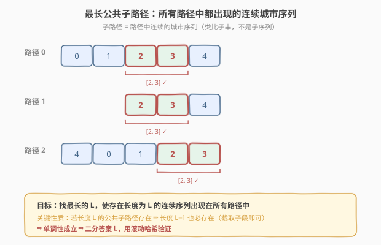
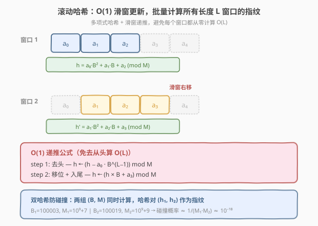
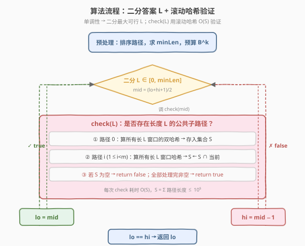
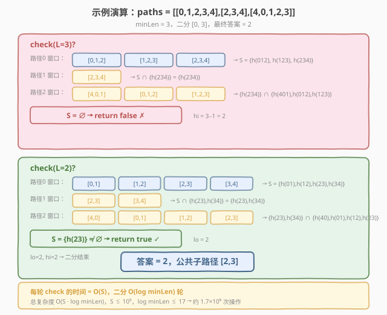

# 最长公共子路径

- **题目名称**：最长公共子路径
- **链接**：[1923. 最长公共子路径](https://leetcode.cn/problems/longest-common-subpath/)
- **难度**：困难
- **标签**：二分查找、滚动哈希、字符串匹配

## 1. 题目概述

一个国家有 $n$ 个编号为 $0$ 到 $n-1$ 的城市，任意两城市间都有道路相连。$m$ 个朋友各自走了一条路径，每条路径是一个城市序列（同一城市可在一条路径中重复出现但不连续）。求**所有朋友都走过的最长公共子路径**的长度——子路径指路径中**连续**的城市序列。不存在则返回 $0$。

**示例 1**：

```text
输入：n = 5, paths = [[0,1,2,3,4],[2,3,4],[4,0,1,2,3]]
输出：2
解释：最长公共子路径为 [2,3]。
```

**示例 2**：

```text
输入：n = 3, paths = [[0],[1],[2]]
输出：0
解释：三条路径没有公共子路径。
```

**示例 3**：

```text
输入：n = 5, paths = [[0,1,2,3,4],[4,3,2,1,0]]
输出：1
解释：最长公共子路径长度为 1（[0]、[1]、[2]、[3]、[4] 均可）。
```

**约束条件**：

- $1 \le n \le 10^5$
- $m = \text{paths.length}$，$2 \le m \le 10^5$
- $\sum \text{paths}[i].\text{length} \le 10^5$
- $0 \le \text{paths}[i][j] < n$
- `paths[i]` 中同一城市不会连续重复出现

---

## 2. 解题思路

### 2.1 暴力思路

最朴素的思路：枚举第一条路径的所有子路径（$O(L_0^2)$ 个），对每个子路径检查它是否出现在其余所有路径中（每次检查 $O(S)$ 做串匹配）。总时间 $O(L_0^2 \cdot S)$，而 $S$ 可达 $10^5$，完全不可行。

> 关键瓶颈：子路径数量是 $O(L^2)$ 级别，逐一枚举注定超时。需要换一个角度——**不枚举子路径，而是二分答案长度 $L$，只验证「是否存在长度为 $L$ 的公共子路径」**。

### 2.2 核心观察：单调性 + 二分答案



关键观察：**「存在长度为 $L$ 的公共子路径」具有单调性**。若长度 $L$ 的公共子路径存在，则长度 $L-1$ 的公共子路径也必然存在——只需截取该 $L$ 长子路径的任意一个 $L-1$ 长子段，它一定也出现在所有路径中。

单调性 $\Rightarrow$ **二分答案**：在 $[0, \text{minLen}]$ 上二分最大可行 $L$（`minLen` 为最短路径长度），每次用 `check(L)` 验证。

> 💡 **为什么上界是 minLen？** 公共子路径的长度不可能超过任何一条路径的长度，因此上界取所有路径中的最短者。

### 2.3 验证函数：滚动哈希



`check(L)` 需要高效判断「是否存在一个长度为 $L$ 的序列，出现在所有 $m$ 条路径中」。核心工具是**滚动哈希（rolling hash）**：

**多项式哈希**：对序列 $a_0, a_1, \dots, a_{L-1}$，定义哈希值

$$
h = a_0 \cdot B^{L-1} + a_1 \cdot B^{L-2} + \dots + a_{L-1} \pmod{M}
$$

**滑窗递推**：从窗口 $[i, i+L-1]$ 滑到 $[i+1, i+L]$，只需 $O(1)$ 更新：

$$
h_{\text{new}} = \big((h - a_i \cdot B^{L-1}) \cdot B + a_{i+L}\big) \bmod M
$$

**check(L) 流程**：

1. 对路径 $0$，计算所有长度为 $L$ 的窗口哈希，存入集合 $S$。
2. 对每条后续路径 $j$，计算其所有长度为 $L$ 的窗口哈希，取 $S \leftarrow S \cap \text{当前路径哈希集}$。
3. 处理完所有路径后，$S$ 非空 $\Leftrightarrow$ 存在长度 $L$ 的公共子路径。

**双哈希防碰撞**：单组 $(B, M)$ 存在极小碰撞概率。使用两组独立参数 $(B_1, M_1)$、$(B_2, M_2)$ 同时计算，以哈希对 $(h_1, h_2)$ 作为指纹，碰撞概率降至 $\approx 1/(M_1 \cdot M_2) \approx 10^{-18}$，可忽略。

> ⚠️ **基的选择**：$B$ 应大于城市编号上界 $n-1$（即 $B > 10^5$），保证无模约简时多项式编码单射。本题取 $B_1 = 100003$、$B_2 = 100019$（均为刚超过 $10^5$ 的素数），模数取孪生素数 $M_1 = 10^9+7$、$M_2 = 10^9+9$。

### 2.4 算法流程



1. **预处理**：按路径长度排序，求 `minLen`，预计算 $B_1^k \bmod M_1$ 与 $B_2^k \bmod M_2$（$k = 0 \dots \text{minLen}$）。
2. **二分**：`lo = 0, hi = minLen`，每次取 `mid = (lo + hi + 1) / 2`（上取整避免死循环），调用 `check(mid)`。
3. **check(mid) 为 true** $\Rightarrow$ `lo = mid`；**false** $\Rightarrow$ `hi = mid - 1`。
4. 收敛时 `lo == hi` 即为答案。

### 2.5 示例演算



以示例 1 为例，`paths = [[0,1,2,3,4],[2,3,4],[4,0,1,2,3]]`，`minLen = 3`。

**check(L=3)**：

| 路径 | 长度 3 窗口 | 哈希集 |
|------|-------------|--------|
| 路径 0 | [0,1,2], [1,2,3], [2,3,4] | $S = \{h_{012}, h_{123}, h_{234}\}$ |
| 路径 1 | [2,3,4] | $S \cap \{h_{234}\} = \{h_{234}\}$ |
| 路径 2 | [4,0,1], [0,1,2], [1,2,3] | $\{h_{234}\} \cap \{h_{401}, h_{012}, h_{123}\} = \emptyset$ |

$S = \emptyset \Rightarrow$ return false，`hi = 2`。

**check(L=2)**：

| 路径 | 长度 2 窗口 | 哈希集 |
|------|-------------|--------|
| 路径 0 | [0,1], [1,2], [2,3], [3,4] | $S = \{h_{01}, h_{12}, h_{23}, h_{34}\}$ |
| 路径 1 | [2,3], [3,4] | $S \cap \{h_{23}, h_{34}\} = \{h_{23}, h_{34}\}$ |
| 路径 2 | [4,0], [0,1], [1,2], [2,3] | $\{h_{23}, h_{34}\} \cap \{h_{40}, h_{01}, h_{12}, h_{23}\} = \{h_{23}\}$ |

$S = \{h_{23}\} \neq \emptyset \Rightarrow$ return true，`lo = 2`。

`lo = hi = 2`，答案为 **2**，对应公共子路径 $[2, 3]$。

---

## 3. 参考代码

### C++

```cpp
class Solution {
    typedef long long ll;
    static const ll MOD1 = 1000000007;
    static const ll MOD2 = 1000000009;
    static const ll B1   = 100003;
    static const ll B2   = 100019;

    vector<ll> pow1, pow2;
    vector<vector<int>> paths;

    bool check(int L) {
        if (L == 0) return true;
        unordered_set<ll> common;
        for (int pi = 0; pi < (int)paths.size(); pi++) {
            auto& p = paths[pi];
            int len = p.size();
            if (len < L) return false;

            ll h1 = 0, h2 = 0;
            for (int i = 0; i < L; i++) {
                h1 = (h1 * B1 + p[i]) % MOD1;
                h2 = (h2 * B2 + p[i]) % MOD2;
            }
            unordered_set<ll> cur;
            cur.insert(h1 * MOD2 + h2);

            for (int i = L; i < len; i++) {
                h1 = ((h1 - (ll)p[i - L] * pow1[L - 1]) % MOD1 + MOD1) % MOD1;
                h1 = (h1 * B1 + p[i]) % MOD1;
                h2 = ((h2 - (ll)p[i - L] * pow2[L - 1]) % MOD2 + MOD2) % MOD2;
                h2 = (h2 * B2 + p[i]) % MOD2;
                cur.insert(h1 * MOD2 + h2);
            }

            if (pi == 0) {
                common = move(cur);
            } else {
                unordered_set<ll> nxt;
                for (auto& k : cur)
                    if (common.count(k)) nxt.insert(k);
                common = move(nxt);
            }
            if (common.empty()) return false;
        }
        return !common.empty();
    }

public:
    int longestCommonSubpath(int n, vector<vector<int>>& paths) {
        sort(paths.begin(), paths.end(),
             [](const vector<int>& a, const vector<int>& b) {
                 return a.size() < b.size();
             });
        this->paths = move(paths);

        int minLen = this->paths[0].size();
        if (minLen == 0) return 0;

        pow1.resize(minLen + 1);
        pow2.resize(minLen + 1);
        pow1[0] = pow2[0] = 1;
        for (int i = 1; i <= minLen; i++) {
            pow1[i] = pow1[i - 1] * B1 % MOD1;
            pow2[i] = pow2[i - 1] * B2 % MOD2;
        }

        int lo = 0, hi = minLen;
        while (lo < hi) {
            int mid = (lo + hi + 1) / 2;
            if (check(mid)) lo = mid;
            else            hi = mid - 1;
        }
        return lo;
    }
};
```

### Python

```python
class Solution:
    def longestCommonSubpath(self, n: int, paths: List[List[int]]) -> int:
        MOD1, MOD2 = 1000000007, 1000000009
        B1, B2 = 100003, 100019

        paths.sort(key=len)
        min_len = len(paths[0])
        if min_len == 0:
            return 0

        pow1 = [1] * (min_len + 1)
        pow2 = [1] * (min_len + 1)
        for i in range(1, min_len + 1):
            pow1[i] = pow1[i - 1] * B1 % MOD1
            pow2[i] = pow2[i - 1] * B2 % MOD2

        def check(L: int) -> bool:
            if L == 0:
                return True
            common = None
            for path in paths:
                m = len(path)
                if m < L:
                    return False
                h1 = h2 = 0
                for i in range(L):
                    h1 = (h1 * B1 + path[i]) % MOD1
                    h2 = (h2 * B2 + path[i]) % MOD2
                cur = {(h1, h2)}
                for i in range(L, m):
                    h1 = ((h1 - path[i - L] * pow1[L - 1]) % MOD1 + MOD1) % MOD1
                    h1 = (h1 * B1 + path[i]) % MOD1
                    h2 = ((h2 - path[i - L] * pow2[L - 1]) % MOD2 + MOD2) % MOD2
                    h2 = (h2 * B2 + path[i]) % MOD2
                    cur.add((h1, h2))
                if common is None:
                    common = cur
                else:
                    common &= cur
                if not common:
                    return False
            return bool(common)

        lo, hi = 0, min_len
        while lo < hi:
            mid = (lo + hi + 1) // 2
            if check(mid):
                lo = mid
            else:
                hi = mid - 1
        return lo
```

> 💡 **Python 中用元组 `(h1, h2)` 作为哈希键**，天然支持双哈希去重，无需手动拼接。C++ 中将双哈希拼成 `h1 * MOD2 + h2`（单个 `long long`）以简化集合操作。

> ⚠️ **取模细节**：C++ 中 `(h - val) % MOD` 可能为负，需 `(+MOD) % MOD` 修正。`(ll)p[i-L] * pow1[L-1]` 最大约 $10^5 \times 10^9 = 10^{14}$，`long long` 安全承载。

---

## 4. 复杂度分析

| 维度 | 复杂度 | 说明 |
|------|--------|------|
| 时间复杂度 | $O(S \log \text{minLen})$ | 二分 $O(\log \text{minLen})$ 轮，每轮 `check` 遍历所有路径的长度 $L$ 窗口，合计 $O(S)$，$S = \sum \text{len}_i \le 10^5$ |
| 空间复杂度 | $O(S)$ | 哈希集合存储窗口指纹；预处理幂数组 $O(\text{minLen})$ |

---

## 5. 扩展：后缀自动机解法

本题也可用**广义后缀自动机（Generalized SAM）**求解：将所有路径依次插入 SAM，对每个状态维护「出现在多少条路径中」的计数。最终在所有被 $m$ 条路径共享的状态中取 $\text{len}_{\max}$。时间 $O(S)$，优于二分哈希的 $O(S \log \text{minLen})$，但常数较大且实现复杂，面试中二分 + 滚动哈希更实用。

此外，单哈希在极端构造数据下有被卡碰撞的风险（出题人可针对固定 $B, M$ 构造碰撞）。双哈希或随机化基底（随机选择 $B$）可有效防卡。

---

## 6. 面试要点

1. **为什么可以二分答案？**

   > 「存在长度 $L$ 的公共子路径」具有单调性：若 $L$ 可行，则 $L-1$ 也可行（截取子段即可）。单调性 $\Rightarrow$ 二分最大可行 $L$，上界为最短路径长度 `minLen`。

2. **滚动哈希的滑窗更新公式怎么推导？**

   > 窗口 $[i, i{+}L{-}1]$ 的哈希 $h = a_i B^{L-1} + \dots + a_{i+L-1}$。滑到 $[i{+}1, i{+}L]$ 时：先去头 $h \mathrel{-}= a_i B^{L-1}$，再移位入尾 $h = h \cdot B + a_{i+L}$。每步 $O(1)$，无需重算整个窗口。

3. **为什么要双哈希？基和模数怎么选？**

   > 单哈希有碰撞风险（生日攻击下约 $\sqrt{M}$ 次插入即有碰撞概率）。双哈希用两组独立 $(B, M)$，碰撞概率 $\approx 1/(M_1 M_2) \approx 10^{-18}$。基 $B$ 应大于城市编号上界 $n-1$ 保证编码单射；模数选大素数（$10^9+7$ / $10^9+9$）。

4. **check 函数中为什么要排序路径？**

   > 按长度升序处理，让最短路径先建立候选集（集合最小），后续交集运算更快。若任一路径长度 $< L$ 则直接返回 false，提前剪枝。

5. **二分时 `mid = (lo + hi + 1) / 2` 为什么要上取整？**

   > 求**最大可行值**时用上取整模板，配合 `lo = mid` / `hi = mid - 1`。若用下取整 `mid = (lo + hi) / 2`，当 `lo + 1 == hi` 且 `check(mid)` 为 true 时会 `lo = mid = lo`，陷入死循环。上取整保证 `mid` 偏向 `hi`，能正常收敛。

---

## 7. 同类练习题

- [718. 最长重复子数组](https://leetcode.cn/problems/maximum-length-of-repeated-subarray/)（[题解](../0701-0800/718_最长重复子数组.md)）：两个数组的公共子串，本题 $m$ 条路径的退化版（$m=2$），可用 DP 或滚动哈希
- [719. 找出第 K 小的数对距离](https://leetcode.cn/problems/find-k-th-smallest-pair-distance/)（[题解](../0701-0800/719_找出第K小的数对距离.md)）：二分答案 + 计数验证的经典范式，与本题的「二分 $L$ + check」框架同源
- [187. 重复的 DNA 序列](https://leetcode.cn/problems/repeated-dna-sequences/)（[题解](../0101-0200/187_重复的DNA序列.md)）：滚动哈希定长窗口的入门题，本题 `check` 函数的核心构件
- [1143. 最长公共子序列](https://leetcode.cn/problems/longest-common-subsequence/)（[题解](../1101-1200/1143_最长公共子序列.md)）：子序列（可不连续）vs 子路径（必须连续），对比两类问题的不同解法与复杂度
