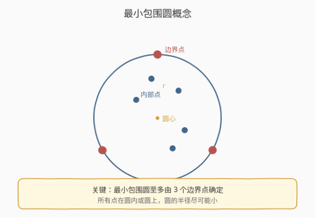
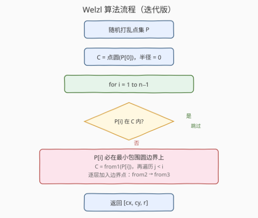
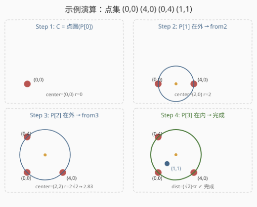

# LeetCode 安装栅栏II 题解

## 1. 题目概述

- **标题 / 题号**：安装栅栏II（#1924，hard）
- **链接**：https://leetcode.cn/problems/erect-the-fence-ii/
- **难度**：困难
- **标签**：几何、随机化、递归、计算几何

**题意**：给定二维平面上的点集 `trees`，其中 `trees[i] = [xi, yi]` 表示一棵树的位置。你需要用一个**圆形栅栏**把所有树围起来——找到能包围所有点的**最小圆**（半径最小的圆），返回圆心坐标和半径 `[x, y, r]`。

**示例 1**：

```text
输入：trees = [[0,0],[2,0],[0,2],[1,1]]
输出：[1.00000, 1.00000, 1.41421]
解释：三点 (0,0)、(2,0)、(0,2) 构成直角三角形，外接圆的圆心为 (1,1)、半径 √2；点 (1,1) 恰在圆心处，被包围。
```

**示例 2**：

```text
输入：trees = [[1,1],[2,2],[3,3]]
输出：[2.00000, 2.00000, 1.41421]
解释：三点共线，最小包围圆由最远两点 (1,1) 和 (3,3) 确定，圆心 (2,2)、半径 √2。
```

**约束**：

- `1 <= trees.length <= 3000`
- `0 <= xi, yi <= 100`
- 答案误差在 $10^{-5}$ 以内即视为正确

## 2. 解题思路

### 2.1 暴力思路

最小包围圆（Minimum Enclosing Circle, MEC）的边界**至多由 3 个点确定**（三点定圆）。暴力枚举所有 2 点组合和 3 点组合，对每个组合生成候选圆（2 点取直径圆、3 点取外接圆），检查是否包含所有点，取半径最小者。

时间复杂度 $O(n^4)$——$O(n^3)$ 个候选圆 × $O(n)$ 检查。$n = 3000$ 时完全不可行。

> 需要换一个角度：不要「枚举后检查」，而要「增量构建」——逐点加入，只在必要时扩大圆，这正是 Welzl 算法的核心思想。

### 2.2 核心观察：Welzl 算法



关键观察来自 Welzl（1991）：

- **最小包围圆至多由 3 个边界点确定**。圆由圆心 $(x, y)$ 和半径 $r$ 三个自由度决定，每个边界点给出一个约束方程，3 个约束恰好确定 3 个未知数。
- **增量构建**：逐点加入，对每个新点 $p$，若 $p$ 在当前圆内则无需变化；若 $p$ 在圆外，则 $p$ **必在**新的最小包围圆的边界上——以 $p$ 为边界点，重新构建圆。
- **随机化保证效率**：随机打乱点集后，每个点「触发重建」的概率随 $i$ 递减——第 $i$ 个点在圆外的概率至多为 $3/i$（因为至多 3 个边界点）。期望总重建代价为 $\sum_{i=1}^{n} \frac{3}{i} \cdot O(i) = O(n)$，这就是期望 $O(n)$ 的根源。

> 💡 **为什么增量构建是正确的？** 若 $p$ 在当前圆 $C$ 内，则 $C$ 仍然是最小包围圆（加入一个内部点不改变 MEC）。若 $p$ 在 $C$ 外，则新的 MEC 必须经过 $p$（否则无法包围 $p$），因此 $p$ 是边界点，需要以 $p$ 为约束重新构建。

### 2.3 算法流程



采用**迭代版** Welzl 算法（三层嵌套循环），比递归版更简洁且避免栈溢出：

1. **随机打乱**点集 $P$。
2. 初始圆 $C$ = 以 $P[0]$ 为圆心、半径 0 的点圆。
3. **外层循环** $i = 1 \to n-1$：若 $P[i]$ 在 $C$ 内，跳过；否则 $P[i]$ 必在边界上：
   - $C$ = `from1(P[i])`（以 $P[i]$ 为圆心的点圆）
   - **中层循环** $j = 0 \to i-1$：若 $P[j]$ 在 $C$ 内，跳过；否则 $P[j]$ 也在边界上：
     - $C$ = `from2(P[i], P[j])`（以 $P[i], P[j]$ 为直径的圆）
     - **内层循环** $k = 0 \to j-1$：若 $P[k]$ 在 $C$ 内，跳过；否则 $P[k]$ 是第三个边界点：
       - $C$ = `from3(P[i], P[j], P[k])`（三点外接圆）

三个基础圆构造函数：

| 函数 | 输入 | 圆心 | 半径 |
|------|------|------|------|
| `from1(a)` | 1 个点 | $a$ | $0$ |
| `from2(a, b)` | 2 个点 | $a, b$ 中点 | $\frac{|ab|}{2}$ |
| `from3(a, b, c)` | 3 个点 | 外接圆心（见下） | 外接圆半径 |

**外接圆公式**（三点 $a, b, c$）：设 $d = 2\bigl(a_x(b_y - c_y) + b_x(c_y - a_y) + c_x(a_y - b_y)\bigr)$，则：

$$
u_x = \frac{(a_x^2+a_y^2)(b_y-c_y) + (b_x^2+b_y^2)(c_y-a_y) + (c_x^2+c_y^2)(a_y-b_y)}{d}
$$

$$
u_y = \frac{(a_x^2+a_y^2)(c_x-b_x) + (b_x^2+b_y^2)(a_x-c_x) + (c_x^2+c_y^2)(b_x-a_x)}{d}
$$

> ⚠️ 当 $d \approx 0$ 时三点共线，退化为取最远两点的直径圆。

### 2.4 示例演算



以点集 $(0,0), (4,0), (0,4), (1,1)$ 为例：

| 步骤 | 当前点 | 判定 | 操作 | 圆心 | 半径 |
|------|--------|------|------|------|------|
| 1 | $P[0]=(0,0)$ | 初始 | `from1` | $(0,0)$ | $0$ |
| 2 | $P[1]=(4,0)$ | 在外 | `from2({P[0],P[1]})` | $(2,0)$ | $2$ |
| 3 | $P[2]=(0,4)$ | 在外（距 $(2,0)$ 为 $\sqrt{20}>2$） | `from3({P[0],P[1],P[2]})` | $(2,2)$ | $2\sqrt{2}\approx2.83$ |
| 4 | $P[3]=(1,1)$ | 在内（距 $(2,2)$ 为 $\sqrt{2}<2\sqrt{2}$） | 跳过 | $(2,2)$ | $2\sqrt{2}$ |

> 💡 $(0,0), (4,0), (0,4)$ 构成直角三角形（直角在原点），外接圆圆心恰为斜边中点 $(2,2)$，半径为斜边的一半 $2\sqrt{2}$。第四个点 $(1,1)$ 在圆心处，自然被包围。

## 3. 参考代码

### C++

```cpp
class Solution {
    using Point = pair<double, double>;

    double dist2(const Point& a, const Point& b) {
        double dx = a.first - b.first, dy = a.second - b.second;
        return dx * dx + dy * dy;
    }

    struct Circle { Point c; double r2; };

    Circle from1(const Point& a) {
        return {a, 0.0};
    }

    Circle from2(const Point& a, const Point& b) {
        Point c = {(a.first + b.first) / 2.0, (a.second + b.second) / 2.0};
        return {c, dist2(a, c)};
    }

    Circle from3(const Point& a, const Point& b, const Point& c) {
        double ax = a.first, ay = a.second;
        double bx = b.first, by = b.second;
        double cx = c.first, cy = c.second;
        double d = 2.0 * (ax * (by - cy) + bx * (cy - ay) + cx * (ay - by));
        if (fabs(d) < 1e-12) {
            double dab = dist2(a, b), dac = dist2(a, c), dbc = dist2(b, c);
            if (dab >= dac && dab >= dbc) return from2(a, b);
            if (dac >= dbc) return from2(a, c);
            return from2(b, c);
        }
        double a2 = ax * ax + ay * ay;
        double b2 = bx * bx + by * by;
        double c2 = cx * cx + cy * cy;
        double ux = (a2 * (by - cy) + b2 * (cy - ay) + c2 * (ay - by)) / d;
        double uy = (a2 * (cx - bx) + b2 * (ax - cx) + c2 * (bx - ax)) / d;
        Point center = {ux, uy};
        return {center, dist2(a, center)};
    }

    bool inside(const Circle& cir, const Point& p) {
        return dist2(cir.c, p) <= cir.r2 + 1e-7;
    }

public:
    vector<double> outerTrees(vector<vector<int>>& trees) {
        int n = trees.size();
        vector<Point> pts(n);
        for (int i = 0; i < n; i++)
            pts[i] = {(double)trees[i][0], (double)trees[i][1]};

        mt19937 rng(42);
        for (int i = n - 1; i > 0; i--) {
            int j = uniform_int_distribution<int>(0, i)(rng);
            swap(pts[i], pts[j]);
        }

        Circle c = from1(pts[0]);
        for (int i = 1; i < n; i++) {
            if (inside(c, pts[i])) continue;
            c = from1(pts[i]);
            for (int j = 0; j < i; j++) {
                if (inside(c, pts[j])) continue;
                c = from2(pts[i], pts[j]);
                for (int k = 0; k < j; k++) {
                    if (inside(c, pts[k])) continue;
                    c = from3(pts[i], pts[j], pts[k]);
                }
            }
        }
        return {c.c.first, c.c.second, sqrt(c.r2)};
    }
};
```

### Python

```python
import random

class Solution:
    def outerTrees(self, trees: List[List[int]]) -> List[float]:
        pts = [(float(x), float(y)) for x, y in trees]
        n = len(pts)
        random.shuffle(pts)

        def dist2(a, b):
            return (a[0] - b[0]) ** 2 + (a[1] - b[1]) ** 2

        def from1(a):
            return (a, 0.0)

        def from2(a, b):
            c = ((a[0] + b[0]) / 2, (a[1] + b[1]) / 2)
            return (c, dist2(a, c))

        def from3(a, b, c):
            ax, ay = a
            bx, by = b
            cx, cy = c
            d = 2.0 * (ax * (by - cy) + bx * (cy - ay) + cx * (ay - by))
            if abs(d) < 1e-12:
                dab, dac, dbc = dist2(a, b), dist2(a, c), dist2(b, c)
                if dab >= dac and dab >= dbc:
                    return from2(a, b)
                if dac >= dbc:
                    return from2(a, c)
                return from2(b, c)
            a2 = ax * ax + ay * ay
            b2 = bx * bx + by * by
            c2 = cx * cx + cy * cy
            ux = (a2 * (by - cy) + b2 * (cy - ay) + c2 * (ay - by)) / d
            uy = (a2 * (cx - bx) + b2 * (ax - cx) + c2 * (bx - ax)) / d
            center = (ux, uy)
            return (center, dist2(a, center))

        def inside(cir, p):
            return dist2(cir[0], p) <= cir[1] + 1e-7

        c = from1(pts[0])
        for i in range(1, n):
            if inside(c, pts[i]):
                continue
            c = from1(pts[i])
            for j in range(i):
                if inside(c, pts[j]):
                    continue
                c = from2(pts[i], pts[j])
                for k in range(j):
                    if inside(c, pts[k]):
                        continue
                    c = from3(pts[i], pts[j], pts[k])

        return [c[0][0], c[0][1], c[1] ** 0.5]
```

> ⚠️ **浮点精度**：`inside` 判断中用 `1e-7` 的容差吸收累积误差。题目要求 $10^{-5}$ 精度，`1e-7` 远小于此，安全。`from3` 中 $d \approx 0$ 表示三点共线，退化为取最远两点的直径圆。

> 💡 **随机打乱的作用**：不打乱时，最坏情况（如所有点按角度排序）退化为 $O(n^2)$。打乱后，每个点触发外层重建的概率 $\le 3/i$，期望总重建代价 $O(n)$。Python 的 `random.shuffle` 即 Fisher-Yates 洗牌。

## 4. 复杂度分析

| 维度 | 复杂度 | 说明 |
|------|--------|------|
| 时间复杂度（期望） | $O(n)$ | 随机打乱后，三层循环的期望总迭代次数为 $O(n)$（每层触发概率随 $i$ 递减） |
| 时间复杂度（最坏） | $O(n^2)$ | 不打乱或极端输入时退化为 $O(n^2)$ |
| 空间复杂度 | $O(n)$ | 存储点集副本（打乱用），算法本身为原地操作 |

> ⚠️ **为什么期望是 $O(n)$ 而非 $O(n^3)$？** 虽然有三层嵌套循环，但每层循环的**触发概率**递减：外层第 $i$ 个点在圆外的概率 $\le 3/i$，中层第 $j$ 个点在圆外的概率 $\le 2/j$，内层第 $k$ 个点在圆外的概率 $\le 1/k$。期望总迭代次数为 $\sum_i \frac{3}{i} \cdot \sum_j \frac{2}{j} \cdot \sum_k \frac{1}{k} \cdot O(1) = O(n)$。

## 5. 扩展：递归版 Welzl

递归版更接近 Welzl 原始论文的形式，逻辑更清晰但需要传递边界点集 $R$：

```text
welzl(P, R):
    if |P| == 0 or |R| == 3:
        return trivial(R)
    p = P 中随机取一个点
    D = welzl(P \ {p}, R)
    if p 在 D 内:
        return D
    return welzl(P \ {p}, R ∪ {p})
```

- `trivial(R)`：$|R|=0$ 返回空圆；$|R|=1$ 返回点圆；$|R|=2$ 返回直径圆；$|R|=3$ 返回外接圆。
- 递归深度可达 $O(n)$，$n = 3000$ 时可能栈溢出，因此实际提交推荐迭代版。
- 迭代版的三层循环本质上是递归版展开后的「move-to-front」变形：每次发现新边界点时，把它移到前面重新构建。

## 6. 面试要点

1. **为什么最小包围圆至多由 3 个点确定？**

   > 圆由圆心 $(x, y)$ 和半径 $r$ 三个自由度确定。每个**在边界上**的点给出一个约束方程 $(p_x - x)^2 + (p_y - y)^2 = r^2$。3 个约束恰好确定 3 个未知数，故至多 3 个边界点。

2. **Welzl 算法为什么需要随机打乱？**

   > 保证期望 $O(n)$。不打乱时，若输入按某种结构排序（如凸包顺序），每加入一个点都可能触发重建，退化为 $O(n^2)$。随机打乱使每个点触发重建的概率 $\le 3/i$，期望总代价 $O(n)$。

3. **三点共线时 `from3` 如何处理？**

   > 外接圆公式中分母 $d = 2(a_x(b_y - c_y) + \ldots) = 0$（三点共线时行列式为零）。此时退化为取最远两点的直径圆——共线三点的最小包围圆就是两端点确定的圆。

4. **迭代版和递归版有什么区别？**

   > 逻辑等价。递归版通过参数传递边界点集 $R$，更直观但递归深度 $O(n)$ 可能栈溢出。迭代版用三层嵌套循环模拟递归展开（move-to-front 变形），原地操作，更适合工程实现。

5. **`inside` 判断为什么需要容差 `1e-7`？**

   > 浮点运算累积误差可能导致「恰在边界上」的点被判为「在外」，从而触发不必要的重建。容差吸收这种误差，避免无限循环。容差需远小于题目要求的精度（$10^{-5}$），`1e-7` 足够安全。

## 同类练习题

| # | 题目 | 与本题的关联 |
|---|------|-------------|
| 587 | [安装栅栏](https://leetcode.cn/problems/erect-the-fence/) | 本题的前传，求凸包（多边形栅栏），同为计算几何经典题 |
| 149 | [直线上最多的点数](https://leetcode.cn/problems/max-points-on-a-line/)（[题解](../0101-0200/149_直线上最多的点数.md)） | 计算几何 + GCD 化简斜率，几何问题中的哈希分组范式 |
| 478 | [在圆内随机生成点](https://leetcode.cn/problems/generate-random-point-in-a-circle/) | 圆内均匀采样（拒绝采样），圆的几何性质应用 |
| 973 | [最接近原点的 K 个点](https://leetcode.cn/problems/k-closest-points-to-origin/) | 距离计算 + Top-K，计算几何与排序的结合 |
