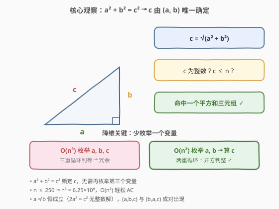
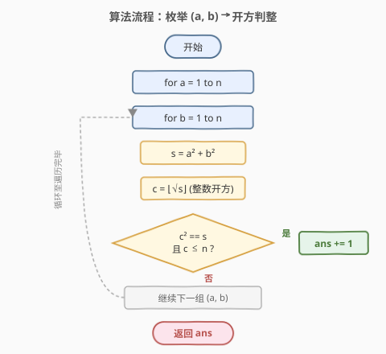
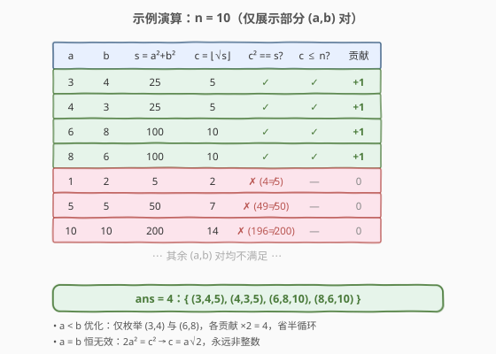

# 统计平方和三元组的数目

- **题目名称**：统计平方和三元组的数目
- **链接**：[1925. 统计平方和三元组的数目](https://leetcode.cn/problems/count-square-sum-triples/)
- **难度**：简单
- **标签**：数学、枚举、勾股数

## 1. 题目概述

一个**平方和三元组** $(a, b, c)$ 指的是满足 $a^2 + b^2 = c^2$ 的整数三元组。给定整数 $n$，返回满足 $1 \le a, b, c \le n$ 的平方和三元组数目。

**示例 1**：

```text
输入：n = 5
输出：2
解释：平方和三元组为 (3,4,5) 和 (4,3,5)。
```

**示例 2**：

```text
输入：n = 10
输出：4
解释：平方和三元组为 (3,4,5)，(4,3,5)，(6,8,10) 和 (8,6,10)。
```

**约束条件**：

- $1 \le n \le 250$

> 💡 **审题关键**：① $(a, b, c)$ 是**有序三元组**——$(3,4,5)$ 与 $(4,3,5)$ 算两个不同的答案，因此 $a, b$ 的交换都要计入；② $a^2 + b^2 = c^2$ 就是**勾股定理**，$c$ 被 $a, b$ 完全确定，无需独立枚举；③ $n \le 250$ 很小，$O(n^2)$ 枚举足以 AC，但 $O(n^3)$ 就偏浪费了。

---

## 2. 解题思路

### 2.1 暴力思路：枚举三元组

最直观的做法：三重循环枚举 $a, b, c \in [1, n]$，对每组判断 $a^2 + b^2 = c^2$ 是否成立。

- **正确性**：穷举所有有序三元组，取满足条件的，显然正确。
- **效率**：三重循环 $O(n^3)$。$n = 250$ 时约 $1.56 \times 10^7$ 次，虽能 AC，但其中大量 $c$ 的枚举是冗余的——$c$ 一旦由 $a^2 + b^2$ 确定，就不该再盲猜。

> ⚠️ 暴力法的浪费在于「把 $c$ 也当自由变量枚举」。实际上 $a^2 + b^2 = c^2$ 是一个等式约束，$c$ 被 $(a, b)$ 唯一锁定（若存在整数解）。只需枚举 $(a, b)$，算出 $c$ 并验证即可，省去一重循环。

### 2.2 核心观察：枚举 a, b 反求 c



关键洞察分两步：

**第一步：勾股定理锁定 c。** $a^2 + b^2 = c^2$ 等价于 $c = \sqrt{a^2 + b^2}$。给定 $(a, b)$，$c$ 的值唯一确定（若存在）。因此只需枚举 $(a, b)$ 两重循环，计算 $s = a^2 + b^2$，再判断 $s$ 是否为**完全平方数**且其平方根 $c \le n$。

**第二步：整数开方判整。** 用整数开方 `isqrt(s)`（Python `math.isqrt`）或 `int(sqrt(s))`（C++）取出 $c = \lfloor\sqrt{s}\rfloor$，再验证 $c \times c = s$ 是否成立。若成立则 $s$ 是完全平方数，$c$ 即为精确平方根；同时检查 $c \le n$。

$$\boxed{\text{对每组 } (a, b):\quad s = a^2 + b^2,\quad c = \lfloor\sqrt{s}\rfloor,\quad \text{若 } c^2 = s \text{ 且 } c \le n \text{ 则 } ans\!\!+\!\!+}$$

> 💡 **为什么 $a \ne b$ 恒成立？** 若 $a = b$，则 $2a^2 = c^2$，即 $c = a\sqrt{2}$。$\sqrt{2}$ 是无理数，故 $c$ 永远不是整数。这意味着每个有效的 $(a, b, c)$ 中 $a \ne b$，于是 $(a, b, c)$ 与 $(b, a, c)$ 总是成对出现——可以只枚举 $a < b$，命中后 $ans\;{+}\!= 2$，省去一半循环（见 2.4 与参考代码）。

> ⚠️ **浮点开方的精度陷阱**：C++ 的 `sqrt` 返回 `double`，对 $s \le 2 \times 250^2 = 125000$ 这样的整数，`double` 精度足够精确表示（整数 $< 2^{52}$ 均可精确存储），`int(sqrt(s))` 截断后验证 $c^2 = s$ 即可。但若 $n$ 更大（$s$ 接近 $2^{52}$），浮点误差可能导致 `sqrt` 偏差 1，此时应改用整数二分开方或 `std::sqrt` 后检查 $c$ 与 $c{+}1$ 两个候选。Python 的 `math.isqrt` 是纯整数运算，无此问题。

### 2.3 算法流程图



整体为双重循环 + 判定：

1. **外层**：$a$ 从 $1$ 到 $n$。
2. **内层**：$b$ 从 $1$ 到 $n$（或 $a{+}1$ 到 $n$ 配合 $\times 2$ 优化）。
3. **计算**：$s = a^2 + b^2$，$c = \lfloor\sqrt{s}\rfloor$（整数开方）。
4. **判定**：若 $c^2 = s$ 且 $c \le n$，则 $ans\!{+}\!+$（或 $ans\;{+}\!= 2$）。
5. **返回** $ans$。

> 💡 **判定的两个条件缺一不可**：$c^2 = s$ 保证 $c$ 是精确平方根（排除非完全平方数），$c \le n$ 保证不超过范围（如 $n = 10$ 时 $a\!=\!9, b\!=\!12$ 会算出 $c\!=\!15$，但 $b$ 和 $c$ 都越界）。

### 2.4 示例演算

以 $n = 10$ 演示枚举过程（仅展示关键 $(a, b)$ 对）：



| $a$ | $b$ | $s = a^2{+}b^2$ | $c = \lfloor\sqrt{s}\rfloor$ | $c^2 = s$? | $c \le n$? | 贡献 |
|-----|-----|-----------------|------------------------------|------------|------------|------|
| 3 | 4 | 25 | 5 | ✓ | ✓ | +1 |
| 4 | 3 | 25 | 5 | ✓ | ✓ | +1 |
| 6 | 8 | 100 | 10 | ✓ | ✓ | +1 |
| 8 | 6 | 100 | 10 | ✓ | ✓ | +1 |
| 1 | 2 | 5 | 2 | ✗ ($4 \ne 5$) | — | 0 |
| 5 | 5 | 50 | 7 | ✗ ($49 \ne 50$) | — | 0 |
| 10 | 10 | 200 | 14 | ✗ ($196 \ne 200$) | — | 0 |

- **结果**：$ans = 4$，即 $\{(3,4,5),\ (4,3,5),\ (6,8,10),\ (8,6,10)\}$，与官方答案一致 ✓
- **$a < b$ 优化**：只枚举 $(3,4)$ 与 $(6,8)$ 两组，各 $+2$，同样得 $4$，省去一半循环。

> 💡 **观察要点**：① $a = b$（如 $(5,5)$）恒无效，印证 $2a^2 = c^2$ 无整数解；② $(a,b)$ 与 $(b,a)$ 对称出现，是 $a \ne b$ 的直接推论，也是 $\times 2$ 优化的依据；③ 非完全平方数（如 $s = 5, 50, 200$）在 $c^2 = s$ 这一步即被排除，无需走到 $c \le n$ 判断。

---

## 3. 参考代码

### C++（枚举全部 $(a, b)$，$O(n^2)$）

```cpp
class Solution {
public:
    int countTriples(int n) {
        int ans = 0;
        for (int a = 1; a <= n; ++a) {
            for (int b = 1; b <= n; ++b) {
                int s = a * a + b * b;
                int c = sqrt(s);
                if (c * c == s && c <= n) ++ans;
            }
        }
        return ans;
    }
};
```

### C++（$a < b$ 优化，循环减半）

```cpp
class Solution {
public:
    int countTriples(int n) {
        int ans = 0;
        for (int a = 1; a <= n; ++a) {
            for (int b = a + 1; b <= n; ++b) {
                int s = a * a + b * b;
                int c = sqrt(s);
                if (c * c == s && c <= n) ans += 2;
            }
        }
        return ans;
    }
};
```

### Python（`math.isqrt`，无浮点误差）

```python
import math

class Solution:
    def countTriples(self, n: int) -> int:
        ans = 0
        for a in range(1, n + 1):
            for b in range(1, n + 1):
                c = math.isqrt(a * a + b * b)
                if c * c == a * a + b * b and c <= n:
                    ans += 1
        return ans
```

### Python（$a < b$ 优化 + 一行流）

```python
import math

class Solution:
    def countTriples(self, n: int) -> int:
        return sum(
            2 for a in range(1, n + 1) for b in range(a + 1, n + 1)
            if (c := math.isqrt(a * a + b * b)) <= n and c * c == a * a + b * b
        )
```

> 💡 **写法对照**：① 全枚举版直接翻译思路，可读性最高，面试默认先写这版；② $a < b$ 优化版利用 $a \ne b$ 恒成立，循环减半、命中 $\times 2$，是「先正确后优化」的典型 follow-up；③ Python `math.isqrt` 是纯整数开方，无浮点精度隐患，优于 `int(s ** 0.5)`；④ 一行流用海象运算符 `:=` 把 `c` 的计算内联到条件中，Pythonic 且紧凑。

> ⚠️ **C++ `sqrt` 的安全性**：本题 $s \le 125000$，`double` 精度绰绰有余。若 $n$ 放宽到 $10^9$（$s \le 2 \times 10^{18}$），`sqrt` 可能因浮点误差偏差 1，应改为检查 $c$ 与 $c{+}1$ 两个候选，或使用整数二分开方。

---

## 4. 复杂度分析

| 维度 | 全枚举 $O(n^2)$ | $a < b$ 优化 | 说明 |
|------|-----------------|--------------|------|
| 时间复杂度 | $O(n^2)$ | $O(n^2 / 2)$ | 均为两重循环；优化版常数减半，渐近相同 |
| 空间复杂度 | $O(1)$ | $O(1)$ | 仅常数个变量 |

> 💡 $n \le 250$，$n^2 = 62500$，远在时限内。本题的优雅之处在于识别「等式约束 $\Rightarrow$ 少枚举一个变量」，把 $O(n^3)$ 降到 $O(n^2)$；而 $a \ne b$ 的性质进一步把常数减半。

---

## 5. 扩展：勾股数公式（欧几里得公式）生成

$O(n^2)$ 对 $n \le 250$ 足够，但若 $n$ 更大（如 $10^6$），枚举 $(a, b)$ 就力不从心了。此时可用**欧几里得勾股数公式**直接生成所有勾股数，复杂度降至 $O(n / \log n)$ 级别。

**公式**：对整数 $p > q > 0$，满足 $\gcd(p, q) = 1$ 且 $p - q$ 为奇数（一奇一偶），

$$a = p^2 - q^2,\quad b = 2pq,\quad c = p^2 + q^2$$

给出一个**本原勾股数**（$\gcd(a, b, c) = 1$）。所有勾股数由本原数乘以倍数 $k$ 得到：$(ka, kb, kc)$。

**计数**：对每组 $(p, q)$ 生成的本原数，底边 $c_0 = p^2 + q^2$。倍数 $k$ 的取值范围为 $1 \le k \le \lfloor n / c_0 \rfloor$，共 $\lfloor n / c_0 \rfloor$ 个。由于 $a \ne b$（一奇一偶），每组贡献 $2 \times \lfloor n / c_0 \rfloor$（$(a, b, c)$ 与 $(b, a, c)$ 两个方向）。

```python
import math

class Solution:
    def countTriples(self, n: int) -> int:
        ans = 0
        p = 2
        while p * p + 1 <= n:          # c0 = p^2 + 1^2 <= n 是最小 c0
            for q in range(1, p):
                if (p - q) % 2 == 0 or math.gcd(p, q) != 1:
                    continue
                c0 = p * p + q * q
                if c0 > n:
                    continue
                ans += 2 * (n // c0)    # 每个本原数贡献 2 × 倍数个数
            p += 1
        return ans
```

**验证**：
- $n = 5$：$(p, q) = (2, 1)$，$c_0 = 5$，$\lfloor 5/5 \rfloor = 1$，$ans = 2 \times 1 = 2$ ✓
- $n = 10$：$(p, q) = (2, 1)$，$c_0 = 5$，$\lfloor 10/5 \rfloor = 2$（$k=1$: $(3,4,5)$；$k=2$: $(6,8,10)$），$ans = 2 \times 2 = 4$ ✓

> ⚠️ **去重的关键**：必须要求 $\gcd(p, q) = 1$ 且 $p - q$ 奇，否则会生成非本原数，与 $k$ 倍数重复计数。例如 $(p, q) = (4, 2)$（$\gcd = 2$，$p - q = 2$ 偶）生成 $(12, 16, 20) = 4 \times (3, 4, 5)$，已被 $k = 4$ 覆盖。

> 💡 **复杂度**：$p^2 + 1 \le n \Rightarrow p \le \sqrt{n}$，内层 $q$ 从 $1$ 到 $p - 1$，总迭代约 $O(n)$，但加上 $\gcd$ 与奇偶剪枝后实际远低于此。对 $n = 250$，$p \le 15$，仅需几十次迭代。

---

## 6. 面试要点

**Q1：为什么从 $O(n^3)$ 降到 $O(n^2)$？降维的依据是什么？**

> 依据是等式约束 $a^2 + b^2 = c^2$：$c$ 被 $(a, b)$ 唯一确定（若存在整数解）。因此 $c$ 不是自由变量，无需枚举——只需枚举 $(a, b)$，算出 $c = \sqrt{a^2 + b^2}$ 并验证是否为整数且 $\le n$。每去掉一个自由变量，复杂度降一阶。

**Q2：$a < b$ 优化为什么成立？为什么每个命中乘以 2 而不是 1？**

> 因为 $a = b$ 时 $2a^2 = c^2 \Rightarrow c = a\sqrt{2}$，永远非整数，所以有效解中 $a \ne b$ 恒成立。于是 $(a, b, c)$ 与 $(b, a, c)$ 总是成对出现。只枚举 $a < b$ 的那一半，命中后 $ans\;{+}\!= 2$，结果与全枚举完全一致，循环量减半。

**Q3：整数开方 `isqrt` 相比 `int(sqrt(s))` 有什么优势？**

> `math.isqrt` 是纯整数运算（类似牛顿迭代），不经过浮点数，绝对不会产生精度误差。`int(sqrt(s))` 依赖 `double`，对 $s < 2^{52}$ 足够精确，但更大时可能偏差 1。本题 $s \le 125000$ 两者等价，但养成用 `isqrt` 的习惯更稳健。C++ 无内置 `isqrt`，可用 `sqrt` + 验证 $c$ 与 $c{+}1$，或手写二分开方。

**Q4：欧几里得公式的 $\gcd(p, q) = 1$ 和 $p - q$ 奇数条件分别保证什么？**

> $\gcd(p, q) = 1$ 保证生成的是**本原**勾股数（$\gcd(a, b, c) = 1$），避免与 $k$ 倍数重复计数。$p - q$ 奇数（即 $p, q$ 一奇一偶）保证 $a, b$ 一奇一偶，$c$ 为奇数——这是勾股数的必要条件（若 $p, q$ 同奇同偶，$a, b, c$ 会全偶，可约简为本原数的倍数）。两个条件合在一起，保证每对本原勾股数恰好被生成一次。

**Q5：如果题目改为「无序三元组」（即 $(a, b, c)$ 与 $(b, a, c)$ 算同一个）怎么处理？**

> 直接把 $a < b$ 优化版的 $ans\;{+}\!= 2$ 改为 $ans\!{+}\!+$ 即可——只统计 $a < b$ 的那一半，不再翻倍。这正好说明 $a \ne b$ 性质在不同计数口径下的灵活运用。

> 💡 **一句话总结**：$a^2 + b^2 = c^2$ 锁定 $c$ $\Rightarrow$ 枚举 $(a, b)$ 反求 $c$ $\Rightarrow$ $O(n^2)$ 开方判整；$a \ne b$ 恒成立 $\Rightarrow$ 枚举 $a < b$ 命中 $\times 2$，常数减半。

---

## 7. 同类练习题

- [633. 平方数之和](https://leetcode.cn/problems/sum-of-square-numbers/)：判断给定 $c$ 是否能表示为 $a^2 + b^2$，与本题的 $a^2 + b^2 = c^2$ 同源，只是视角从「枚举 $a, b$ 找 $c$」翻转为「给定 $c$ 找 $a, b$」
- [204. 计数质数](https://leetcode.cn/problems/count-primes/)（[题解](../0201-0300/204_计数质数.md)）：数学计数题，用埃氏筛把暴力 $O(n^2)$ 优化到 $O(n \log \log n)$，对照体会「数学性质降复杂度」的思路
- [1922. 统计好数字的数目](https://leetcode.cn/problems/count-good-numbers/)（[题解](../1901-2000/1922_统计好数字的数目.md)）：数学计数 + 快速幂，同属「利用数学结构避免暴力枚举」的家族
- [400. 第 N 位数字](https://leetcode.cn/problems/nth-digit/)（[题解](../0401-0500/400_第N位数字.md)）：按位数分层定位，数学推导把逐位枚举降到 $O(\log n)$，同样是「数学降维」范式
- [878. 第 N 个神奇数字](https://leetcode.cn/problems/nth-magical-number/)：数学 + 二分答案，用容斥原理把枚举计数优化到 $O(\log(\text{ans}))$，对照本题的「枚举 → 公式」优化路径
