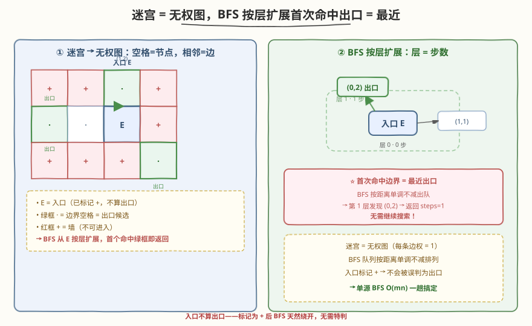
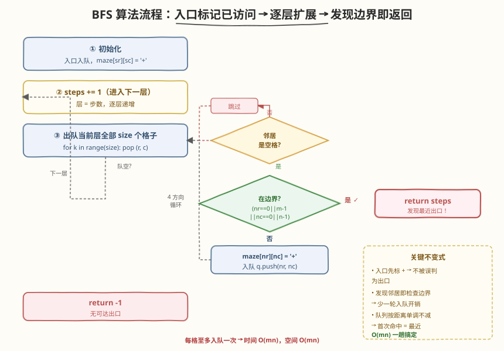
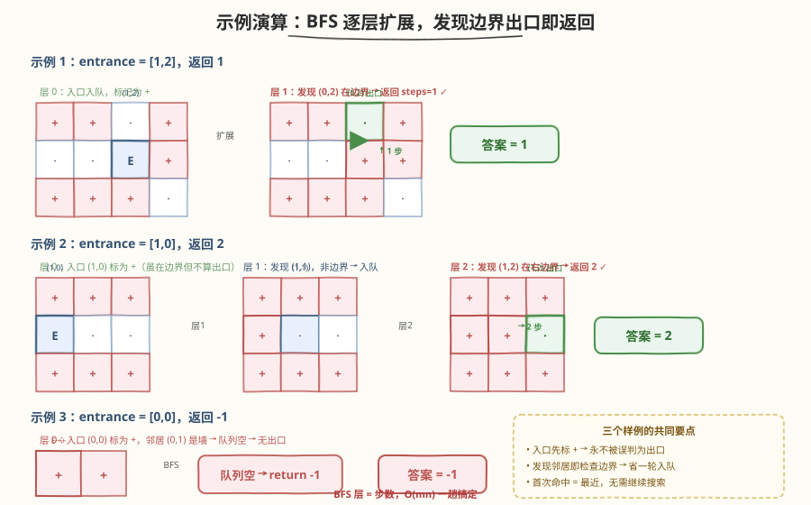

# LeetCode 迷宫中离入口最近的出口 题解

## 1. 题目概述

- **标题 / 题号**：迷宫中离入口最近的出口（#1926，medium）
- **链接**：https://leetcode.cn/problems/nearest-exit-from-entrance-in-maze/
- **难度**：中等
- **标签**：广度优先搜索、矩阵、最短路径

**题意**：给定一个 `m × n` 的迷宫矩阵 `maze`（下标从 0 开始），其中 `'.'` 表示空格子、`'+'` 表示墙。同时给定入口 `entrance = [entrancerow, entrancecol]`，表示你一开始所在的格子。

每步可以向上、下、左、右移动一格，不能进入墙所在的格子，也不能离开迷宫。**出口**的定义是 `maze` **边界**上的**空格子**，但 `entrance` 格子**不算**出口。目标是找到离入口**最近**的出口，返回最短路径的**步数**；若不存在这样的路径，返回 `-1`。

**示例 1**：

```text
输入：maze = [["+","+",".","+"],[".",".",".","+"],["+","+","+","."]], entrance = [1,2]
输出：1
解释：总共有 3 个出口，分别位于 (1,0)、(0,2) 和 (2,3)。
      从入口 (1,2) 向上走 1 步到达 (0,2)，即为最近出口。
```

**示例 2**：

```text
输入：maze = [["+","+","+"],[".",".","."],["+","+","+"]], entrance = [1,0]
输出：2
解释：迷宫中只有 1 个出口，在 (1,2) 处。(1,0) 是入口不算出口。
      从入口 (1,0) 向右走 2 步到达 (1,2)。
```

**示例 3**：

```text
输入：maze = [[".","+"]], entrance = [0,0]
输出：-1
解释：这个迷宫中没有出口。
```

**约束**：

- `maze.length == m`，`maze[i].length == n`
- $1 \le m, n \le 100$
- `maze[i][j]` 要么是 `'.'`，要么是 `'+'`
- `entrance.length == 2`，$0 \le \text{entrancerow} < m$，$0 \le \text{entrancecol} < n$
- `entrance` 一定是空格子

> 💡 **审题关键**：① 出口特指**边界**上的空格——内部空格不算出口；② 入口**即使**在边界上也不算出口（示例 2 的 `(1,0)` 在左边界但不是出口）；③ 每步走一格、四方向、不能穿墙——这是**无权图**上的最短路径问题；④ 「最近」= 步数最少，天然指向 BFS。

## 2. 解题思路

### 2.1 暴力思路：DFS 枚举所有路径

最直观的做法是从入口出发，用 DFS 枚举所有可能的行走路径，每当到达一个边界空格（非入口）就记录步数，取所有合法路径中的最小步数。

- **正确性**：穷举所有路径，取最小，显然正确。
- **效率**：路径数量是指数级的（每个格子有 4 个方向），对 $100 \times 100$ 的迷宫完全不可行；且同一格子会被反复访问，产生大量重复搜索。

> ⚠️ 暴力 DFS 的浪费在于「盲目深入一条路径到底」。实际上，求**最短**步数在无权图上有一个天然利器——BFS 按层扩展，第一次到达目标即为最短，无需搜索所有路径。

### 2.2 核心观察：无权图最短路 → 单源 BFS



关键洞察分两步：

**第一步：把迷宫建模成无权图。** 每个空格 `'.'` 是一个节点，上下左右相邻的空格之间连一条边（边权均为 1）。入口是**单源**，所有边界空格（除入口外）是**目标集合**。「最近出口」= 从源点到目标集合中任意节点的**最短路径**。

**第二步：BFS 按层扩展，层 = 步数。** BFS 从入口出发逐层向外扩展——第 0 层是入口本身，第 1 层是入口的邻居，第 $k$ 层是距离入口恰好 $k$ 步的所有格子。由于 BFS **按距离顺序**访问节点，第一次发现某个边界空格时，当前层数就是最短步数，直接返回。

$$\text{最近出口步数} = \text{BFS 首次发现边界空格时的层数}$$

> 💡 **为什么 BFS 首次命中即为最短？** BFS 的核心不变式：队列中的节点按距离**单调不减**排列。出队顺序就是距离从小到大的顺序。因此第一个被发现的边界出口一定是距离入口最近的出口，无需继续搜索。这是 BFS 在无权图上求最短路的根本性质。

> ⚠️ **最高频陷阱：入口在边界上时误判为出口。** 题目明确规定入口不算出口。例如示例 2 的入口 `(1,0)` 在左边界，但它不是出口。正确处理方式：**在 BFS 开始前就把入口标记为已访问**（如把 `maze[sr][sc]` 改成 `'+'`），这样入口永远不会被当作出口返回。

### 2.3 算法流程图



**主流程（单源 BFS + 层序遍历）**：

1. 取入口 `(sr, sc)`，**标记为已访问**（`maze[sr][sc] = '+'`），入队。`steps = 0`。
2. 当队列非空：
   - `steps += 1`（进入下一层）。
   - 取当前层大小 `size`，逐个出队 `(r, c)`：
     - 对 4 个方向 `(dr, dc)` 计算邻居 `(nr, nc)`：
       - **越界**或 `maze[nr][nc] == '+'`（墙或已访问）→ 跳过。
       - **是边界**（`nr == 0` 或 `nr == m-1` 或 `nc == 0` 或 `nc == n-1`）→ 找到出口，返回 `steps`。
       - 否则标记 `maze[nr][nc] = '+'`（已访问），入队。
3. 队列空仍未命中 → 返回 `-1`。

> 💡 **为什么在「发现邻居」时检查出口而不是「出队」时？** 因为发现邻居的瞬间就能判定它是边界出口，立即返回可避免把出口入队后再等到下一轮出队才检查——少一轮处理。更关键的是，若在出队时检查，入口本身会被出队并判定为边界（如果入口在边界上），需要额外排除入口；而在发现邻居时检查，入口已被标记为 `+`，自然不会被当作邻居发现，逻辑更干净。

> 💡 **入口标记为 `+` 的巧妙之处**：把入口直接改成 `'+'` 有双重作用——① 标记已访问，防止重复入队；② 让入口在后续 BFS 中等同于墙，不会被任何路径当作邻居发现，从而天然排除了「入口被误判为出口」的情况。无需额外的 `visited` 矩阵，原地修改即可。

### 2.4 示例演算

以三个官方样例演示 BFS 逐层扩展、发现边界出口即返回的过程：



**示例 1**：`maze = [["+","+",".","+"],[".",".",".","+"],["+","+","+","."]]`，`entrance = [1,2]`

```
迷宫布局（E=入口，·=空格，+=墙）：
  + + · +
  · · E +
  + + + ·
```

| 层 | 出队格子 | 发现的邻居 | 是否命中出口 |
|----|---------|-----------|-------------|
| 0 | (1,2) E | (1,1)·、(0,2)· | (0,2) 在边界 → **返回 1** |

- `(0,2)` 在第 0 行（边界），是出口。步数 = 1。✓

**示例 2**：`maze = [["+","+","+"],[".",".","."],["+","+","+"]]`，`entrance = [1,0]`

```
迷宫布局：
  + + +
  E · ·
  + + +
```

| 层 | 出队格子 | 发现的邻居 | 是否命中出口 |
|----|---------|-----------|-------------|
| 0 | (1,0) E | (1,1)· | (1,1) 不在边界 → 入队 |
| 1 | (1,1) | (1,2)· | (1,2) 在右边界 → **返回 2** |

- `(1,0)` 是入口（虽在左边界但不算出口），已被标记为 `+`。
- 第 1 层出队 `(1,1)`，发现邻居 `(1,2)` 在边界，步数 = 2。✓

**示例 3**：`maze = [[".","+"]]`，`entrance = [0,0]`

```
迷宫布局：
  E +
```

| 层 | 出队格子 | 发现的邻居 | 是否命中出口 |
|----|---------|-----------|-------------|
| 0 | (0,0) E | (0,1) 是墙 `+` → 跳过 | 无 |

- 队列空，未发现出口，返回 `-1`。✓

> 💡 **观察要点**：① 示例 1 的入口 `(1,2)` 在**内部**，BFS 第 1 层就命中边界出口 `(0,2)`——一步之遥；② 示例 2 的入口 `(1,0)` 在**边界**上，但因「入口不算出口」必须走到另一个边界出口 `(1,2)`——BFS 不会在入口处停下，而是继续扩展直到发现**别的**边界格；③ 示例 3 的入口是唯一的空格且在边界，但没有任何其他边界空格可达——返回 `-1`，这正说明「入口标记为 `+`」后 BFS 不会误判入口为出口。

## 3. 参考代码

### C++（层序 BFS，原地标记）

```cpp
class Solution {
public:
    int nearestExit(vector<vector<char>>& maze, vector<int>& entrance) {
        int m = maze.size(), n = maze[0].size();
        int sr = entrance[0], sc = entrance[1];
        queue<pair<int,int>> q;
        q.push({sr, sc});
        maze[sr][sc] = '+';                  // 入口标记为已访问（兼防误判为出口）
        int dirs[4][2] = {{0,1},{0,-1},{1,0},{-1,0}};
        int steps = 0;
        while (!q.empty()) {
            steps++;
            int size = q.size();
            for (int k = 0; k < size; k++) {
                auto [r, c] = q.front(); q.pop();
                for (auto& d : dirs) {
                    int nr = r + d[0], nc = c + d[1];
                    if (nr < 0 || nr >= m || nc < 0 || nc >= n) continue;
                    if (maze[nr][nc] == '+') continue;          // 墙或已访问
                    if (nr == 0 || nr == m-1 || nc == 0 || nc == n-1)
                        return steps;                           // 发现边界出口
                    maze[nr][nc] = '+';                         // 标记已访问
                    q.push({nr, nc});
                }
            }
        }
        return -1;
    }
};
```

### C++（携带距离的 BFS，无需按层计数）

```cpp
class Solution {
public:
    int nearestExit(vector<vector<char>>& maze, vector<int>& entrance) {
        int m = maze.size(), n = maze[0].size();
        int sr = entrance[0], sc = entrance[1];
        queue<tuple<int,int,int>> q;           // (row, col, dist)
        q.push({sr, sc, 0});
        maze[sr][sc] = '+';
        int dirs[4][2] = {{0,1},{0,-1},{1,0},{-1,0}};
        while (!q.empty()) {
            auto [r, c, d] = q.front(); q.pop();
            for (auto& dir : dirs) {
                int nr = r + dir[0], nc = c + dir[1];
                if (nr < 0 || nr >= m || nc < 0 || nc >= n || maze[nr][nc] == '+') continue;
                if (nr == 0 || nr == m-1 || nc == 0 || nc == n-1) return d + 1;
                maze[nr][nc] = '+';
                q.push({nr, nc, d + 1});
            }
        }
        return -1;
    }
};
```

### Python（层序 BFS）

```python
class Solution:
    def nearestExit(self, maze: List[List[str]], entrance: List[int]) -> int:
        m, n = len(maze), len(maze[0])
        sr, sc = entrance
        from collections import deque
        q = deque([(sr, sc)])
        maze[sr][sc] = '+'                    # 入口标记已访问
        dirs = [(0, 1), (0, -1), (1, 0), (-1, 0)]
        steps = 0
        while q:
            steps += 1
            for _ in range(len(q)):           # 当前层
                r, c = q.popleft()
                for dr, dc in dirs:
                    nr, nc = r + dr, c + dc
                    if not (0 <= nr < m and 0 <= nc < n):
                        continue
                    if maze[nr][nc] == '+':
                        continue
                    if nr == 0 or nr == m - 1 or nc == 0 or nc == n - 1:
                        return steps
                    maze[nr][nc] = '+'
                    q.append((nr, nc))
        return -1
```

> 💡 **写法对照**：① 层序 BFS 用 `steps` 计数器按层递增，代码紧凑、无需在队列中存距离；② 携带距离的 BFS 把 `(r, c, d)` 打包入队，逻辑直白但队列元素更大；③ Python 用 `collections.deque` 的 `popleft()` 保证 $O(1)$ 出队，切勿用 `list.pop(0)`（$O(n)$）。三版结果一致，层序版最推荐。

> 💡 **原地修改 vs 独立 visited 矩阵**：本题把 `maze[sr][sc]` 改成 `'+'` 标记已访问，省去 $O(mn)$ 的额外 `visited` 矩阵。若面试官要求不改输入，则用 `vector<vector<char>> visited(m, vector<char>(n, 0))` 替代，逻辑不变。原地修改的巧妙之处在于入口与墙共用同一符号 `'+'`，BFS 天然绕开入口，无需特判。

## 4. 复杂度分析

| 维度 | 复杂度 | 说明 |
|------|--------|------|
| 时间复杂度 | $O(m \cdot n)$ | 每个格子至多入队/出队一次，每次出队扩展 4 个邻居共 $O(1)$，总计 $O(mn)$ |
| 空间复杂度 | $O(m \cdot n)$ | BFS 队列最坏存所有空格 $O(mn)$；原地标记版无额外矩阵，携带距离版队列元素稍大但渐进相同 |

> 💡 $m, n \le 100$，$O(mn) = 10^4$，远在时限内。BFS 的高效源于「每个格子只访问一次」——已访问标记把指数级的路径搜索压缩为线性的格子遍历。这是 BFS 在无权图最短路问题上的根本优势。

## 5. 扩展：变体与优化

**变体 A：允许多个入口（多源 BFS）。** 若题目改为「多个入口，求最近出口」，只需把所有入口在初始化时同时入队（类似 [994. 腐烂的橘子](https://leetcode.cn/problems/rotting-oranges/) 的多源 BFS），BFS 框架不变。每个出口被最近的入口率先发现。

**变体 B：允许穿墙 $k$ 次。** 对应 [1293. 矑格中的最短路径](https://leetcode.cn/problems/shortest-path-in-a-grid-with-obstacles-elimination/)。状态升级为 `(r, c, elim)`——多一维「已穿墙次数」，BFS 在三维状态空间 `(行, 列, 穿墙次数)` 上搜索，每个状态仍只访问一次。

**变体 C：双向 BFS 优化。** 本题只有一个入口，但目标集合是「所有边界空格」。可以反向从所有边界出口同时 BFS（多源），与正向 BFS 在中间相遇——双向 BFS 可将搜索空间从 $O(mn)$ 降到 $O(\sqrt{mn})$ 级别。但本题 $m, n \le 100$，单向 BFS 已足够快，双向 BFS 属于优化进阶。

> ⚠️ **与 [490. 迷宫](https://leetcode.cn/problems/the-maze/) 的区别**：490 的球「滚到撞墙才停」，一步跨多格，状态是**停止位**；1926 一步走一格，状态是**每个空格**。两者都是 BFS 求最短路，但状态空间定义不同——490 的边连停止位（跨多格），1926 的边连相邻格（一步一格）。

## 6. 面试要点

**Q1：为什么用 BFS 而不是 DFS？**

> BFS 按层扩展，每层代表一步，天然求最短路径——第一次发现出口即为最近出口。DFS 会深入一条路径到底，找到的出口不一定最近，需搜索所有路径取最小值，效率是指数级的。无权图最短路首选 BFS。

**Q2：入口在边界上时如何处理？**

> 入口虽在边界但题目规定它不算出口。解法是在 BFS 开始前把入口标记为已访问（`maze[sr][sc] = '+'`），这样入口永远不会被当作邻居发现，从而不会被误判为出口。示例 2 的入口 `(1,0)` 在左边界，BFS 跳过它继续扩展到 `(1,2)` 才返回。

**Q3：为什么在发现邻居时检查出口，而不是在出队时检查？**

> 发现任意邻居是边界出口即可立即返回，少一轮入队/出队开销。更重要的是，若在出队时检查，入口（可能在边界上）会被出队并判定为边界，需额外排除；而在发现邻居时检查，入口已被标记为 `+`，不会作为邻居被发现，逻辑更干净，无需特判。

**Q4：原地修改 `maze` 有什么好处和风险？**

> 好处：省去 $O(mn)$ 的 `visited` 矩阵；入口与墙共用 `'+'` 符号，BFS 天然绕开入口。风险：破坏了输入数据，若调用方后续还需使用原 `maze` 则不能用原地修改——此时需改为独立 `visited` 矩阵。面试时主动说明这一取舍。

**Q5：这题和 994 腐烂的橘子、490 迷宫有什么异同？**

> 三者都是网格 BFS。994 是**多源** BFS（多个腐烂橘子同时入队），求所有点被最近源感染的时间；1926 是**单源** BFS（一个入口），求到边界出口的最短步数；490 的球「滚到撞墙才停」，一步跨多格，状态是停止位而非每个格子。三者的核心都是 BFS 按层扩展求最短路，区别在于**状态空间定义**和**源点数量**。

> 💡 **一句话总结**：迷宫是无权图，单源 BFS 按层扩展，入口标记已访问后入队，发现边界邻居即返回层数——$O(mn)$ 一趟搞定。

## 同类练习题

| # | 题目 | 与本题的关联 |
|---|------|-------------|
| 490 | [迷宫](https://leetcode.cn/problems/the-maze/) | 球滚到撞墙才停，状态是停止位而非每格，对照本题「一步一格」的状态定义差异 |
| 994 | [腐烂的橘子](https://leetcode.cn/problems/rotting-oranges/) | 多源 BFS 模板，对照本题「单源 BFS」——把多源改为单源只需减少初始入队的源点 |
| 1091 | [二进制矩阵中的最短路径](https://leetcode.cn/problems/shortest-path-in-binary-matrix/) | 8 方向网格 BFS 求左上到右下的最短路径，与本题同为「无权图最短路」家族 |
| 1293 | [矑格中的最短路径](https://leetcode.cn/problems/shortest-path-in-a-grid-with-obstacles-elimination/) | 允许穿墙 $k$ 次的最短路，状态升级为 `(r, c, elim)` 三维 BFS，是本题的进阶版 |
| 542 | [01 矩阵](https://leetcode.cn/problems/01-matrix/) | 多源 BFS 求每个 0 到最近 1 的距离，与本题「入口到最近出口」的最近性同构 |
