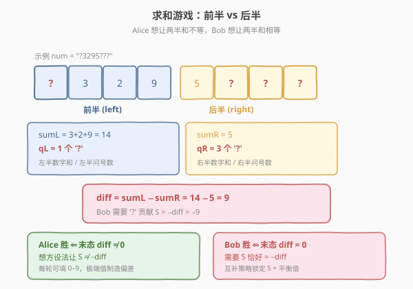
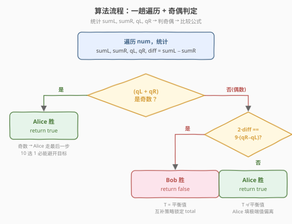
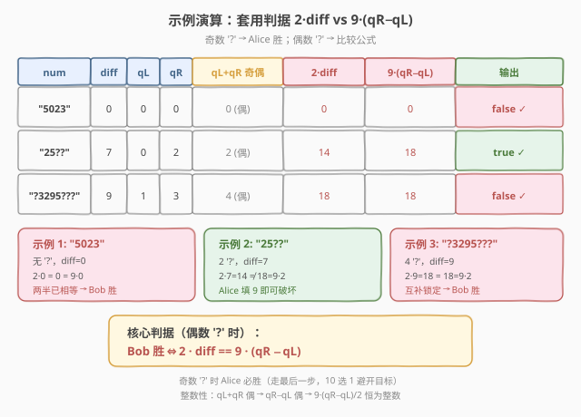

# LeetCode 求和游戏 题解

## 1. 题目概述

- **标题 / 题号**：求和游戏（#1927，medium）
- **链接**：https://leetcode.cn/problems/sum-game/
- **难度**：中等
- **标签**：数学、博弈、脑筋急转弯

**题意**：Alice 和 Bob 玩一个游戏，两人轮流行动，**Alice 先手**。给定一个**偶数长度**的字符串 `num`，每个字符为数字字符或 `'?'`。每一次操作中，如果 `num` 中至少有一个 `'?'`，玩家可以：

1. 选择一个下标 $i$ 满足 `num[i] == '?'`；
2. 将 `num[i]` 用 `'0'` 到 `'9'` 之间的一个数字字符替代。

当 `num` 中没有 `'?'` 时游戏结束。**Bob 获胜**的条件是前一半数字的和**等于**后一半数字的和；**Alice 获胜**的条件是两半和**不相等**。双方都采取**最优策略**，Alice 获胜返回 `true`，Bob 获胜返回 `false`。

**示例 1**：

```text
输入：num = "5023"
输出：false
解释：num 中没有 '?' ，无法操作。前一半和 = 5+0 = 5，后一半和 = 2+3 = 5，相等 → Bob 胜。
```

**示例 2**：

```text
输入：num = "25??"
输出：true
解释：Alice 可以将两个 '?' 中的一个替换为 '9'，Bob 无论如何都无法使两半和相等。
```

**示例 3**：

```text
输入：num = "?3295???"
输出：false
解释：Bob 总是能赢。diff=9，qL=1，qR=3，2×9 = 18 = 9×2 → Bob 用互补策略锁定。
```

**约束**：

- $2 \le \text{num.length} \le 10^5$
- `num.length` 是**偶数**
- `num` 只包含数字字符和 `'?'`

> 💡 本题是**博弈 + 数学**的脑筋急转弯。表面上是搜索博弈树，实则可以通过一次**虚拟变换**归约为经典的「互补求和博弈」，得到 $O(n)$ 的解析判据。

## 2. 解题思路

### 2.1 暴力思路：博弈树搜索

把「每个 `'?'` 填什么数字」当作博弈树的分支。每个 `'?'` 有 10 种填法（`0`–`9`），共 $q$ 个 `'?'`（$q = q_L + q_R$），博弈树规模 $10^q$。用 Minimax + $\alpha$-$\beta$ 剪枝搜索：Alice 最大化「不相等」的收益，Bob 最小化。

但 $q$ 可达 $10^5$，$10^{10^5}$ 个叶子节点——连「枚举」本身在物理上就不可能。需要寻找**不依赖枚举**的解析判据。

### 2.2 核心观察：虚拟变换 + 互补博弈



设 $n = \text{len}(\text{num})$，$\text{half} = n/2$。定义：

| 量 | 含义 |
|----|------|
| $\text{sumL}$ | 前半数字之和（不含 `'?'`） |
| $\text{sumR}$ | 后半数字之和（不含 `'?'`） |
| $q_L$ | 前半 `'?'` 的个数 |
| $q_R$ | 后半 `'?'` 的个数 |
| $\text{diff} = \text{sumL} - \text{sumR}$ | 当前差值 |

游戏结束时，所有 `'?'` 被填入数字。前半 `'?'` 贡献 $+d$（$0 \le d \le 9$），后半 `'?'` 贡献 $-d$。设所有 `'?'` 的**净贡献**为：

$$
S = (\text{前半 '?' 填数之和}) - (\text{后半 '?' 填数之和})
$$

则末态差值 $= \text{diff} + S$。**Bob 胜** $\Leftrightarrow$ $\text{diff} + S = 0$ $\Leftrightarrow$ $S = -\text{diff}$。**Alice 胜** $\Leftrightarrow$ $S \ne -\text{diff}$。

> 💡 关键转化：问题变成「Alice 和 Bob 轮流填 `'?'`，Alice 要让 $S \ne -\text{diff}$，Bob 要让 $S = -\text{diff}$」。

#### 虚拟变换：统一左右半


后半 `'?'` 填入 $d$ 时贡献 $-d$，与「前半填 $9-d$ 贡献 $+(9-d)$ 再减 $9$」等价。形式化地，对后半 `'?'` 做**虚拟变换**：

$$
\text{virtual} = 9 - \text{actual}
$$

则后半实际填 $d$ 等价于虚拟填 $9-d$，贡献 $-d = -(9 - \text{virtual}) = \text{virtual} - 9$。代入 $S$：

$$
S = \sum_{\text{左半}} \text{virtual}_i + \sum_{\text{右半}} (\text{virtual}_j - 9) = \left(\sum_{\text{所有 '?'}} \text{virtual}\right) - 9 \cdot q_R
$$

Bob 需要 $S = -\text{diff}$，即：

$$
\sum_{\text{所有 '?'}} \text{virtual} = 9 \cdot q_R - \text{diff} \;\triangleq\; T
$$

> 💡 变换后，**所有 `'?'` 统一为「填 virtual 0–9」的纯求和博弈**——不再区分左右半。每位都能填 $0$–$9$，virtual 与 actual 一一对应，策略完全等价。

#### 互补求和博弈的判据

现在问题归约为经典模型：$q = q_L + q_R$ 个槽位，Alice 和 Bob 轮流各填一个 $0$–$9$ 的数字，Alice 先手，目标是让总和等于 $T$（Bob 视角）或不等于 $T$（Alice 视角）。

**平衡值**：若每位都填 $4.5$（$0$–$9$ 的中点），总和 $= 4.5 \cdot q$。更精确地，Bob 的**互补策略**——每次 Alice 填 $d$，Bob 填 $9-d$——保证每对贡献恰好 $9$。

| $q$ 的奇偶 | 谁走最后 | 判据 |
|-----------|---------|------|
| **奇数** | Alice（多走一步） | Alice 必胜：最后一步 10 选 1，至多 1 个命中 $T$，她选其余的 |
| **偶数** | Bob（各走 $q/2$ 步） | Bob 互补策略锁定总和 $= 9 \cdot q/2$（平衡值）。Bob 胜 $\Leftrightarrow$ $T = 9q/2$ |

偶数时 Bob 胜 $\Leftrightarrow$ $T = 9q/2$，代入 $T = 9 q_R - \text{diff}$、$q = q_L + q_R$：

$$
9 q_R - \text{diff} = \frac{9(q_L + q_R)}{2} \;\;\Longleftrightarrow\;\; \text{diff} = \frac{9(q_R - q_L)}{2} \;\;\Longleftrightarrow\;\; \boxed{2 \cdot \text{diff} = 9 \cdot (q_R - q_L)}
$$

> ⚠️ **整数性**：$q_L + q_R$ 为偶数时，$q_L$ 与 $q_R$ 同奇偶，故 $q_R - q_L$ 为偶数，$9(q_R - q_L)/2$ 恒为整数。

### 2.3 算法流程图



只需一趟遍历统计四个量，再做两次判定：

1. 遍历 `num` 前半，累加 `sumL`、计数 `qL`。
2. 遍历 `num` 后半，累加 `sumR`、计数 `qR`。
3. 计算 $\text{diff} = \text{sumL} - \text{sumR}$。
4. 若 $(q_L + q_R)$ 为**奇数** → 返回 `true`（Alice 胜）。
5. 否则比较 $2 \cdot \text{diff}$ 与 $9 \cdot (q_R - q_L)$：相等返回 `false`（Bob 胜），不等返回 `true`（Alice 胜）。

### 2.4 示例演算



| num | diff | $q_L$ | $q_R$ | $q_L{+}q_R$ 奇偶 | $2 \cdot \text{diff}$ | $9(q_R{-}q_L)$ | 输出 |
|-----|------|-------|-------|------------------|----------------------|-----------------|------|
| `"5023"` | $0$ | $0$ | $0$ | $0$（偶） | $0$ | $0$ | `false` |
| `"25??"` | $7$ | $0$ | $2$ | $2$（偶） | $14$ | $18$ | `true` |
| `"?3295???"` | $9$ | $1$ | $3$ | $4$（偶） | $18$ | $18$ | `false` |

**示例 1** `"5023"`：无 `'?'`，$\text{diff}=0$，$2 \times 0 = 0 = 9 \times 0$ → Bob 胜（两半已相等）。

**示例 2** `"25??"`：$\text{diff}=7$，$q_L=0, q_R=2$。$2 \times 7 = 14 \ne 18 = 9 \times 2$ → Alice 胜。Alice 第一手填 `9`，使得后半和最多 $= 2+5=7$（填 $0$）或最少 $= 2+0=2$（填 $9$ 反向），但 $\text{diff}=7$ 时 Bob 需要 $S=-7$，即两个右半 `'?'` 之和 $= 7$。Alice 填 $9$ → 剩一个 `'?'` 需填 $7-9=-2$，不可能；Alice 填 $0$ → 剩一个需填 $7$，Bob 能做到。所以 Alice 填 $9$ 即胜。

**示例 3** `"?3295???"`：$\text{diff}=9$，$q_L=1, q_R=3$。$2 \times 9 = 18 = 18 = 9 \times 2$ → Bob 胜。Bob 用互补策略：Alice 填 $d$，Bob 填 $9-d$（虚拟视角），锁定总和 $= 9 \times 4/2 = 18$，即 $S = 18 - 9 \times 3 = -9 = -\text{diff}$，末态 $\text{diff} + S = 0$。

## 3. 参考代码

### C++

```cpp
class Solution {
public:
    bool sumGame(string num) {
        int n = num.size(), half = n / 2;
        int sumL = 0, sumR = 0, qL = 0, qR = 0;
        for (int i = 0; i < half; ++i) {
            if (num[i] == '?') qL++;
            else sumL += num[i] - '0';
        }
        for (int i = half; i < n; ++i) {
            if (num[i] == '?') qR++;
            else sumR += num[i] - '0';
        }
        int diff = sumL - sumR;
        if ((qL + qR) % 2 == 1) return true;       // 奇数 '?' → Alice 必胜
        return 2 * diff != 9 * (qR - qL);           // 偶数 '?' → 比较判据
    }
};
```

### Python

```python
class Solution:
    def sumGame(self, num: str) -> bool:
        n = len(num)
        half = n // 2
        sumL = sumR = qL = qR = 0
        for i in range(half):
            if num[i] == '?':
                qL += 1
            else:
                sumL += int(num[i])
        for i in range(half, n):
            if num[i] == '?':
                qR += 1
            else:
                sumR += int(num[i])
        diff = sumL - sumR
        if (qL + qR) % 2 == 1:
            return True
        return 2 * diff != 9 * (qR - qL)
```

> 💡 **Python 精简版**：用切片 + `count` / `sum` 一行统计，但两次遍历变四次，$O(n)$ 不变：
> ```python
> def sumGame(self, num: str) -> bool:
>     half = len(num) // 2
>     left, right = num[:half], num[half:]
>     qL, qR = left.count('?'), right.count('?')
>     diff = sum(int(c) for c in left if c != '?') - sum(int(c) for c in right if c != '?')
>     if (qL + qR) % 2: return True
>     return 2 * diff != 9 * (qR - qL)
> ```

> ⚠️ **溢出检查**：$n \le 10^5$，$\text{sumL}, \text{sumR} \le 9 \times 5 \times 10^4 \approx 4.5 \times 10^5$，$\text{diff} \le 4.5 \times 10^5$，$2 \times \text{diff} \le 9 \times 10^5$，$9 \times (q_R - q_L) \le 9 \times 10^5$。均在 `int` 范围内，无溢出风险。

## 4. 复杂度分析

| 维度 | 复杂度 | 说明 |
|------|--------|------|
| **时间复杂度** | $O(n)$ | 一趟遍历统计四个量，$O(1)$ 判定 |
| **空间复杂度** | $O(1)$ | 仅维护 `sumL`/`sumR`/`qL`/`qR` 等常数个变量 |

## 5. 扩展：互补博弈判据的完整证明

### 5.1 虚拟变换的正确性

对后半每个 `'?'`，令 $\text{virtual} = 9 - \text{actual}$。因 $\text{actual} \in [0, 9]$，故 $\text{virtual} \in [0, 9]$，双向可逆。代入净贡献：

$$
S = \sum_{\text{左}} \text{actual}_i - \sum_{\text{右}} \text{actual}_j = \sum_{\text{左}} \text{virtual}_i - \sum_{\text{右}} (9 - \text{virtual}_j) = \sum_{\text{所有}} \text{virtual} - 9 q_R
$$

Bob 需要 $S = -\text{diff}$ $\Leftrightarrow$ $\sum \text{virtual} = 9 q_R - \text{diff} = T$。$\blacksquare$

### 5.2 奇数 '?' 时 Alice 必胜

$q = q_L + q_R$ 为奇数时，Alice 走 $\lceil q/2 \rceil$ 步，Bob 走 $\lfloor q/2 \rfloor$ 步，**Alice 走最后一步**。最后一步时仅剩 1 个 `'?'`，Alice 有 10 种填法（$0$–$9$），至多 1 种使总和 $= T$。她选其余 9 种之一即可。Alice 必胜。$\blacksquare$

### 5.3 偶数 '?' 时 Bob 互补策略（$T = 9q/2$）

$q$ 为偶数，各走 $k = q/2$ 步。**Bob 的互补策略**：每次 Alice 填 $d$，Bob 填 $9 - d$（选任意剩余 `'?'` 即可，因为每个槽都接受 $0$–$9$）。

每对（Alice + Bob）贡献 $d + (9-d) = 9$，共 $k$ 对，总和 $= 9k = 9q/2$。若 $T = 9q/2$，Bob 必胜。$\blacksquare$

代入 $T = 9q_R - \text{diff}$、$q = q_L + q_R$：

$$
T = \frac{9(q_L + q_R)}{2} \;\;\Longleftrightarrow\;\; 9 q_R - \text{diff} = \frac{9 q_L + 9 q_R}{2} \;\;\Longleftrightarrow\;\; \text{diff} = \frac{9(q_R - q_L)}{2} \;\;\Longleftrightarrow\;\; 2\,\text{diff} = 9(q_R - q_L)
$$

### 5.4 偶数 '?' 时 Alice 必胜（$T \ne 9q/2$）

设 $\text{balanced} = 9q/2$。$T \ne \text{balanced}$ 时分两种情况：

**情况 1：$T < \text{balanced}$**（即 $2\,\text{diff} > 9(q_R - q_L)$）

Alice 每步都填 $9$。她的总和 $= 9k = \text{balanced}$。Bob 填 $0$–$9$，总和 $\ge 0$。故总和 $\ge \text{balanced} > T$。Bob 无法降低（数字非负），**Alice 胜**。

**情况 2：$T > \text{balanced}$**（即 $2\,\text{diff} < 9(q_R - q_L)$）

Alice 每步都填 $0$。她的总和 $= 0$。Bob 最多填 $9k = \text{balanced}$。故总和 $\le 0 + \text{balanced} < T$。Bob 无法达到，**Alice 胜**。$\blacksquare$

> 💡 **直觉**：平衡值 $9q/2$ 是「所有槽都填 $4.5$」的期望总和。Bob 的互补策略能锁定这个值，但无法偏离。当目标 $T$ 恰好等于平衡值时 Bob 胜，否则 Alice 用极端值（全 $0$ 或全 $9$）制造不可弥补的偏差。

## 6. 面试要点

1. **为什么奇数个 `'?'` 时 Alice 必胜？**

   > 奇数个 `'?'` 意味着 Alice 走最后一步。最后仅剩 1 个 `'?'`，她有 $10$ 种填法，至多 $1$ 种使两半和相等。她选其余 $9$ 种即可确保不相等。

2. **虚拟变换的核心思想是什么？**

   > 后半 `'?'` 填 $d$ 贡献 $-d$，等价于「虚拟填 $9-d$ 贡献 $+(9-d)$ 再减 $9$」。变换后所有 `'?'` 统一为「填 $0$–$9$ 的纯求和博弈」，消去左右半的差异，问题大幅简化。

3. **Bob 的互补策略为什么能锁定总和？**

   > 偶数个 `'?'` 时各走一半。Bob 每次 Alice 填 $d$ 就填 $9-d$，每对贡献恰好 $9$。$k$ 对总和 $= 9k$，与 Alice 选什么无关。只要目标 $T = 9k$，Bob 必胜。

4. **公式 $2\,\text{diff} = 9(q_R - q_L)$ 怎么推导的？**

   > Bob 胜 $\Leftrightarrow$ $T = 9q/2$（平衡值）。代入 $T = 9q_R - \text{diff}$、$q = q_L + q_R$，化简得 $9q_R - \text{diff} = 9(q_L+q_R)/2$ $\Leftrightarrow$ $\text{diff} = 9(q_R-q_L)/2$ $\Leftrightarrow$ $2\,\text{diff} = 9(q_R-q_L)$。

5. **$T \ne$ 平衡值时 Alice 的策略是什么？**

   > $T$ 低于平衡值时 Alice 每步填 $9$（推高总和），$T$ 高于平衡值时 Alice 每步填 $0$（压低总和）。Bob 的数字范围 $[0,9]$ 不足以弥补偏差，Alice 必胜。

> 💡 **一句话总结**：奇数 `'?'` → Alice 必胜（最后一步 10 选 1）；偶数 `'?'` → Bob 互补策略锁定平衡值 $9q/2$，Bob 胜当且仅当 $2\,\text{diff} = 9(q_R - q_L)$。

## 同类练习题

| # | 题目 | 与本题的关联 |
|---|------|-------------|
| 292 | [Nim 游戏](https://leetcode.cn/problems/nim-game/)（[题解](../0201-0300/292_Nim游戏.md)） | 经典博弈的数学化判据（$n \bmod 4 \ne 0$），与本题「互补策略锁定平衡值」同属「博弈找规律」家族 |
| 877 | [石子游戏](https://leetcode.cn/problems/stone-game/)（[题解](../0801-0900/877_石子游戏.md)） | 区间 DP + Minimax 博弈，对照本题「能解析化就数学化」的思路 |
| 810 | [黑板异或游戏](https://leetcode.cn/problems/chalkboard-xor-game/)（[题解](../0801-0900/810_黑板异或游戏.md)） | 用「全局异或 + 奇偶性」不变量判定胜负，同属博弈数学化家族 |
| 1025 | [除数博弈](https://leetcode.cn/problems/divisor-game/)（[题解](../1001-1100/1025_除数博弈.md)） | 手推前几个值发现 $n \bmod 2$ 周期，与本题「奇偶决定胜负」异曲同工 |
