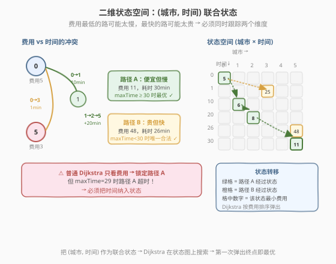
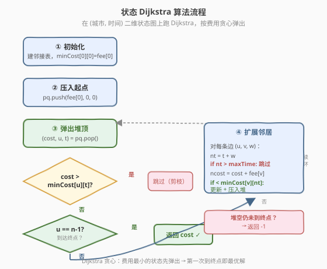
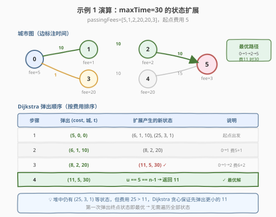

# LeetCode 规定时间内到达终点的最小花费 题解

## 1. 题目概述

- **标题 / 题号**：规定时间内到达终点的最小花费（#1928，hard）
- **链接**：https://leetcode.cn/problems/minimum-cost-to-reach-destination-in-time/
- **难度**：困难
- **标签**：图、最短路径、Dijkstra、动态规划

**题意**：一个国家有 $n$ 个城市（编号 $0$ 到 $n-1$），城市间由双向道路连接，道路由 `edges = [[x, y, time], ...]` 表示，`time` 为通行分钟数。每次经过一个城市需付通行费 `passingFees[j]`。

你在城市 $0$ 出发，要在 `maxTime` 分钟**以内**（含）到达城市 $n-1$。旅行的**费用**为经过的所有城市通行费之和（**包括起点和终点**）。求最小费用，无法到达返回 $-1$。

> 💡 **关键约束**：既要「时间不超限」，又要「费用最小」——这两个目标可能冲突：费用最低的路可能太慢，最快的路可能太贵。这正是本题区别于普通最短路的核心。

**示例 1**：

```text
输入：maxTime = 30, edges = [[0,1,10],[1,2,10],[2,5,10],[0,3,1],[3,4,10],[4,5,15]], passingFees = [5,1,2,20,20,3]
输出：11
解释：最优路径 0 → 1 → 2 → 5，耗时 30 分钟，费用 5+1+2+3 = 11。
```

**示例 2**：

```text
输入：maxTime = 29, edges = [[0,1,10],[1,2,10],[2,5,10],[0,3,1],[3,4,10],[4,5,15]], passingFees = [5,1,2,20,20,3]
输出：48
解释：路径 0 → 1 → 2 → 5 耗时 30 > 29 超限。改走 0 → 3 → 4 → 5，耗时 26，费用 5+20+20+3 = 48。
```

**示例 3**：

```text
输入：maxTime = 25, edges = [[0,1,10],[1,2,10],[2,5,10],[0,3,1],[3,4,10],[4,5,15]], passingFees = [5,1,2,20,20,3]
输出：-1
解释：无法在 25 分钟内从城市 0 到达城市 5。
```

**约束**：

- $1 \le \text{maxTime} \le 1000$
- $2 \le n \le 1000$
- $n - 1 \le \text{edges.length} \le 1000$
- $0 \le x_i, y_i \le n - 1$，$1 \le \text{time}_i \le 1000$
- $1 \le \text{passingFees}[j] \le 1000$
- 无自环，两城市间可能有多条道路

## 2. 解题思路

### 2.1 暴力思路：为什么普通 Dijkstra 不直接可行？

普通 Dijkstra 只维护 `dist[城市]`（到每个城市的最小费用），按费用从小到大锁定状态。但本题多了一条「**时间上限**」约束：

- 一条**费用更低但耗时更长**的路径可能因超过 `maxTime` 而**非法**；
- 一条**费用更高但耗时更短**的路径反而**合法**且是答案。

> ⚠️ 「费用最优」和「时间最优」会冲突。若 Dijkstra 过早锁定一个费用最低但时间已用满的状态，就会错过后续费用稍高但时间充裕的合法解——与 [787. K 站中转内最便宜的航班](../0701-0800/787_K站中转内最便宜的航班.md) 中「价格 vs 边数」的冲突如出一辙。

暴力做法是枚举所有时间 $\le \text{maxTime}$ 的路径取最小费用，但路径数随 `maxTime` 指数增长，必然超时。我们需要一种**同时跟踪城市和已用时间**的方法。

### 2.2 核心观察：二维状态 (城市, 时间)



关键观察：**把 `(城市, 已用时间)` 作为一个联合状态**。在这个二维状态空间中，从 `(u, t)` 经边 `(u, v, w)` 转移到 `(v, t + w)`，费用增加 `passingFees[v]`。转移后时间必须 $\le \text{maxTime}$。

定义：

$$\text{cost}[v][t] = \text{从城市 0 出发、恰好用 t 分钟到达城市 v 的最小通行费}$$

- 状态空间大小：$n \times (\text{maxTime}+1) \le 1000 \times 1001 \approx 10^6$，可接受。
- 所有边权（时间）为正，因此时间维度天然单调递增，**无环**，适合 Dijkstra。

> 💡 **为什么二维状态就够了？** 在 `(城市, 时间)` 状态图中，每条转移都是「时间增加 + 费用增加」，不存在「时间减少」的回路。因此 Dijkstra 按**费用**排序弹出状态时，第一次到达 `(n-1, *)` 就是最优解——不会有「绕路回来更便宜」的情况，因为绕路只会增加时间和费用。

### 2.3 算法流程：状态 Dijkstra



1. 建邻接表 `adj[u] = [(v, time), ...]`。
2. 维护 `minCost[city][time]`：到达该状态的最小费用，初始化为 $\infty$。
3. 优先队列（最小堆）存 `(总费用, 城市, 已用时间)`，初始压入 `(passingFees[0], 0, 0)`。
4. 循环弹出堆顶 `(cost, u, t)`：
   - **剪枝 1**：若 `cost > minCost[u][t]`，说明已有更优途径到达此状态，跳过。
   - **终止**：若 `u == n-1`，直接返回 `cost`（Dijkstra 保证第一次到达终点即最优）。
   - **扩展**：对每条边 `(u, v, w)`，若 `t + w ≤ maxTime` 且 `cost + passingFees[v] < minCost[v][t+w]`，则更新 `minCost` 并压入堆。
5. 堆空仍未到达终点，返回 $-1$。

> ⚠️ **剪枝 1 的作用**：同一个 `(城市, 时间)` 状态可能被多次压入堆（不同路径到达），但只有费用最小的那次值得处理。通过 `minCost` 去重，避免重复扩展。

### 2.4 示例演算

以示例 1 为例（`maxTime = 30`，图见题目），展示 Dijkstra 的状态扩展过程。



| 步骤 | 弹出状态 `(cost, 城, t)` | 扩展产生的新状态 | 说明 |
|------|--------------------------|------------------|------|
| 1 | `(5, 0, 0)` | `(6, 1, 10)`、`(25, 3, 1)` | 从起点 0 出发，费用 5（起点通行费） |
| 2 | `(6, 1, 10)` | `(8, 2, 20)` | 经 0→1，费用 5+1=6 |
| 3 | `(8, 2, 20)` | **`(11, 5, 30)`** ✓ | 经 0→1→2，费用 6+2=8 |
| 4 | `(11, 5, 30)` | — | **到达终点 5！返回 11** |

> 💡 第 3 步弹出 `(8, 2, 20)` 后扩展到 `(11, 5, 30)`：耗时 $20+10=30 \le 30$ 合法，费用 $8+3=11$。第 4 步弹出 `(11, 5, 30)` 时 `u == 5 == n-1`，直接返回 `11`。虽然堆中还有 `(25, 3, 1)` 等状态，但它们费用更大，不会影响结果——Dijkstra 的贪心性质保证了这一点。

示例 2 中 `maxTime = 29`，路径 `0→1→2→5` 耗时 30 超限，状态 `(8, 2, 20)` 无法扩展到 `(11, 5, 30)`（$30 > 29$）。Dijkstra 继续弹出后续状态，最终经 `0→3→4→5`（耗时 26，费用 48）到达终点。

## 3. 参考代码

### C++

```cpp
class Solution {
public:
    int minCost(int maxTime, vector<vector<int>>& edges,
                vector<int>& passingFees) {
        int n = passingFees.size();
        // 邻接表
        vector<vector<pair<int,int>>> adj(n);
        for (auto& e : edges) {
            adj[e[0]].push_back({e[1], e[2]});
            adj[e[1]].push_back({e[0], e[2]});
        }

        // minCost[city][time] = 到达该状态的最小费用
        vector<vector<int>> minCost(n, vector<int>(maxTime + 1, INT_MAX));
        // 最小堆：(费用, 城市, 已用时间)
        priority_queue<tuple<int,int,int>, vector<tuple<int,int,int>>,
                       greater<>> pq;

        minCost[0][0] = passingFees[0];
        pq.push({passingFees[0], 0, 0});

        while (!pq.empty()) {
            auto [cost, u, t] = pq.top(); pq.pop();
            // 剪枝：已有更优途径到达此状态
            if (cost > minCost[u][t]) continue;
            // 到达终点
            if (u == n - 1) return cost;
            // 扩展邻居
            for (auto& [v, w] : adj[u]) {
                int nt = t + w;
                if (nt > maxTime) continue;
                int ncost = cost + passingFees[v];
                if (ncost < minCost[v][nt]) {
                    minCost[v][nt] = ncost;
                    pq.push({ncost, v, nt});
                }
            }
        }
        return -1;
    }
};
```

### Python

```python
class Solution:
    def minCost(self, maxTime: int, edges: List[List[int]],
                passingFees: List[int]) -> int:
        n = len(passingFees)
        adj = [[] for _ in range(n)]
        for x, y, t in edges:
            adj[x].append((y, t))
            adj[y].append((x, t))

        # minCost[city][time] = 到达该状态的最小费用
        minCost = [[float('inf')] * (maxTime + 1) for _ in range(n)]
        # 最小堆：(费用, 城市, 已用时间)
        import heapq
        heap = [(passingFees[0], 0, 0)]
        minCost[0][0] = passingFees[0]

        while heap:
            cost, u, t = heapq.heappop(heap)
            # 剪枝
            if cost > minCost[u][t]:
                continue
            # 到达终点
            if u == n - 1:
                return cost
            # 扩展邻居
            for v, w in adj[u]:
                nt = t + w
                if nt > maxTime:
                    continue
                ncost = cost + passingFees[v]
                if ncost < minCost[v][nt]:
                    minCost[v][nt] = ncost
                    heapq.heappush(heap, (ncost, v, nt))

        return -1
```

> 💡 **空间优化**：`minCost` 是 $n \times (\text{maxTime}+1)$ 的二维数组。当 $n = 1000$、$\text{maxTime} = 1000$ 时约 4MB（`int`），可接受。若内存紧张，可改用 `unordered_map` 按 `(city, time)` 稀疏存储，但常数更大。

> ⚠️ **多重边处理**：两城市间可能有多条时间不同的道路。邻接表会全部存入，Dijkstra 自然会选择时间更短的边优先扩展，无需额外去重。

## 4. 复杂度分析

| 维度 | 复杂度 | 说明 |
|------|--------|------|
| 时间复杂度 | $O(\text{maxTime} \cdot E \cdot \log(\text{maxTime} \cdot n))$ | 状态数 $\le n \times \text{maxTime}$，每状态扩展邻居，堆操作 $\log$ 级 |
| 空间复杂度 | $O(n \cdot \text{maxTime})$ | `minCost` 二维数组 + 堆 |

> 💡 **实际远小于理论上界**：Dijkstra 的贪心剪枝使得大部分 `(城市, 时间)` 状态不会被压入堆。终点一旦弹出即终止，无需遍历全部状态。最坏情况（终点不可达）才接近理论上界。

## 5. 扩展：时间维度 DP

除 Dijkstra 外，还可用**按时间递推的 DP**：

$$\text{dp}[v][t] = \min_{(u,v,w) \in E} \text{dp}[u][t-w] + \text{passingFees}[v]$$

- 初始化 `dp[0][0] = passingFees[0]`，其余为 $\infty$。
- 按 $t$ 从 $0$ 到 $\text{maxTime}$ 递推，每个时刻遍历所有边做松弛。
- 答案 $= \min_{t \le \text{maxTime}} \text{dp}[n-1][t]$。

时间 $O(\text{maxTime} \cdot E)$，空间 $O(n \cdot \text{maxTime})$。

| 方法 | 时间 | 优势 | 劣势 |
|------|------|------|------|
| **状态 Dijkstra（主解）** | $O(\text{maxTime} \cdot E \cdot \log)$ | 到达终点即停，剪枝强 | 堆常数较大 |
| 时间维度 DP | $O(\text{maxTime} \cdot E)$ | 无堆开销，实现简单 | 必须遍历全部时间，无法提前终止 |

> 💡 DP 的正确性源于：所有边权（时间）为正，处理时刻 $t$ 时所有来源时刻 $t - w < t$ 已计算完毕，`dp[v][t]` 在处理完时刻 $t$ 后即最终确定。这与 [787](../0701-0800/787_K站中转内最便宜的航班.md) 的 Bellman-Ford 「按轮分层」同构——787 按边数分层，本题按时间分层。

## 6. 面试要点

1. **为什么普通 Dijkstra 不行？**

   > 普通Dijkstra 只按费用排序锁定 `dist[城市]`，但「费用最低」可能意味着「时间用尽」，导致后续无法到达终点。必须把时间纳入状态，用 `(城市, 时间)` 联合状态来避免过早锁定。

2. **状态空间有多大？为什么可接受？**

   > $n \times (\text{maxTime}+1) \le 1000 \times 1001 \approx 10^6$。每个状态只需存一个 `int`（费用），约 4MB。Dijkstra 的剪枝使得实际访问的状态远少于理论上界。

3. **Dijkstra 在二维状态图上为什么正确？**

   > 在 `(城市, 时间)` 状态图中，每条转移都使时间增加（边权为正）且费用增加（通行费为正），不存在负权回路。因此 Dijkstra 的贪心选择性质成立：第一次弹出 `(n-1, t)` 时，其费用就是所有可达终点状态中的最小值。

4. **`minCost` 数组的作用是什么？**

   > 去重剪枝。同一个 `(城市, 时间)` 可能被多条路径压入堆，但只有费用最小的那条值得扩展。弹出时若 `cost > minCost[u][t]` 说明已有更优途径处理过，直接跳过。

5. **和 787（K 站中转内最便宜的航班）的异同？**

   > 两者都是「带约束的最短路」：787 的约束是**边数上限**（用 Bellman-Ford 按轮分层），本题的约束是**时间上限**（用 Dijkstra 在 `(城市, 时间)` 状态图上搜索）。核心思想一致——把约束维度纳入状态，避免贪心锁定冲突。

6. **多重边和自环如何处理？**

   > 邻接表全部存入多重边，Dijkstra 自然优先选择更优的边，无需去重。题目保证无自环，无需额外处理。

## 同类练习题

| # | 题目 | 与本题的关联 |
|---|------|-------------|
| 787 | [K 站中转内最便宜的航班](https://leetcode.cn/problems/cheapest-flights-within-k-stops/)（[题解](../0701-0800/787_K站中转内最便宜的航班.md)） | 带「边数上限」约束的最短路，Bellman-Ford 按轮分层——与本题「时间上限」约束同构，对照理解两种约束的处理方式 |
| 743 | [网络延迟时间](https://leetcode.cn/problems/network-delay-time/)（[题解](../0701-0800/743_网络延迟时间.md)） | 堆优化 Dijkstra 单源最短路母题，无约束时的基础模板，本题在其上增加时间维度 |
| 1514 | [概率最大的路径](https://leetcode.cn/problems/path-with-maximum-probability/) | Dijkstra 变体，把「最大概率」转成「最长路」，同样可用状态扩展处理约束 |
| 1631 | [最小体力消耗路径](https://leetcode.cn/problems/path-with-minimum-effort/) | Dijkstra 变体，按「路径最大边权」排序，展示 Dijkstra 状态定义的灵活性 |
