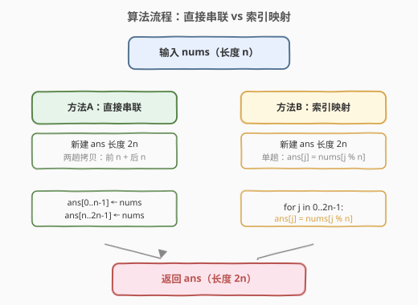
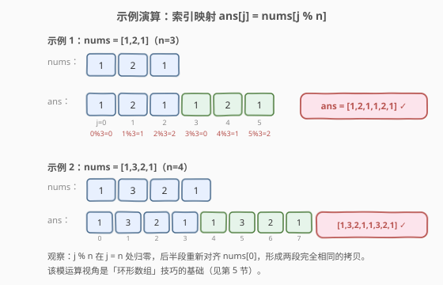

# LeetCode 数组串联 题解

## 1. 题目概述

- **标题 / 题号**：数组串联（#1929，easy）
- **链接**：https://leetcode.cn/problems/concatenation-of-array/
- **难度**：简单
- **标签**：数组、模拟、数学

**题意**：给你一个长度为 $n$ 的整数数组 `nums`。请构建一个长度为 $2n$ 的答案数组 `ans`，下标从 $0$ 开始，对所有 $0 \le i < n$ 满足：

$$\text{ans}[i] = \text{nums}[i], \qquad \text{ans}[i + n] = \text{nums}[i]$$

即 `ans` 由两个 `nums` 数组**串联**形成。返回 `ans`。

**示例 1**：

```text
输入：nums = [1,2,1]
输出：[1,2,1,1,2,1]
解释：ans = [nums[0],nums[1],nums[2],nums[0],nums[1],nums[2]] = [1,2,1,1,2,1]
```

**示例 2**：

```text
输入：nums = [1,3,2,1]
输出：[1,3,2,1,1,3,2,1]
解释：ans = [nums[0],nums[1],nums[2],nums[3],nums[0],nums[1],nums[2],nums[3]]
```

**约束**：

- $n = \text{nums.length}$
- $1 \le n \le 1000$
- $1 \le \text{nums}[i] \le 1000$

> 💡 **审题关键**：① 题目给出**两条**等式规则——`ans[i]=nums[i]`（前半段）与 `ans[i+n]=nums[i]`（后半段），二者拼起来就是「把 `nums` 复制两遍」；② 朴素做法开新数组拷两次即可，重点在于识别这两条规则可统一为一条**索引映射**公式，从而连接到「环形数组」这一通用技巧。

## 2. 解题思路

### 2.1 暴力思路：新建数组拷两遍

最直观的做法：新建长度为 $2n$ 的数组 `ans`，分两趟把 `nums` 拷进去——第一趟拷到 `ans[0..n-1]`，第二趟拷到 `ans[n..2n-1]`。

- **正确性**：直接照搬两条规则，显然正确。
- **效率**：时间 $O(n)$，空间 $O(n)$（结果数组本身就需要 $2n$ 空间，不可压缩）。

> ⚠️ 本题空间下界就是 $O(n)$——因为返回的 `ans` 长度为 $2n$，无论怎么写都至少要开这个数组。所以优化的方向不在空间，而在**视角**：能否用一条公式统一两条规则，让代码更简洁、更易推广到环形数组场景？见 2.2。

### 2.2 核心观察：索引映射 ans[j] = nums[j % n]

![核心观察：ans = nums 串联 nums，统一为 ans[j] = nums[j % n]](../images/1929_concept.svg)

关键洞察：题目的两条规则

$$\text{ans}[i] = \text{nums}[i] \quad (0 \le i < n), \qquad \text{ans}[i+n] = \text{nums}[i] \quad (0 \le i < n)$$

本质是同一件事——`ans` 的任意位置 $j$（$0 \le j < 2n$）都等于 `nums` 的位置 $j \bmod n$。因为：

- 当 $0 \le j < n$ 时，$j \bmod n = j$，$\text{ans}[j] = \text{nums}[j]$，即规则①；
- 当 $n \le j < 2n$ 时，$j \bmod n = j - n$，$\text{ans}[j] = \text{nums}[j-n]$，即规则②（令 $i = j - n$）。

于是两条规则合并为一条：

$$\boxed{\text{ans}[j] = \text{nums}[j \bmod n], \quad 0 \le j < 2n}$$

单趟循环、一个公式搞定。$j \bmod n$ 的物理意义是「把下标 $0 \sim 2n-1$ 折叠回 $0 \sim n-1$」，相当于在 `nums` 上**走两圈**——这正是**环形数组**的视角。

> 💡 **为什么这个视角有价值？** 本题只是「复制两遍」，但「模 $n$ 取下标」是处理环形数组问题的通用套路。例如 [503. 下一个更大元素 II](../0501-0600/503_下一个更大元素II.md) 中数组被视为环，寻找「下一个更大」需要绕回开头——标准做法之一就是把数组串联成两份再跑单调栈，等价于用 $j \bmod n$ 在原数组上虚拟地走两圈。本题是该技巧的最简形态，理解了它，环形系列的「串联 / 模 $n$」手法就水到渠成。

### 2.3 算法流程图



两种写法等价，区别仅在循环结构：

- **方法 A（直接串联）**：两趟拷贝，前 $n$ 与后 $n$ 各一趟，逻辑与题目两条规则一一对应，最易读。
- **方法 B（索引映射）**：单趟循环 $j$ 从 $0$ 到 $2n-1$，`ans[j] = nums[j % n]`，用模运算统一两段，代码更紧凑、视角更通用。

### 2.4 示例演算

以两个官方示例演示索引映射过程：



**示例 1**（`nums = [1,2,1]`，$n=3$）：

| $j$ | $j \bmod 3$ | $\text{ans}[j] = \text{nums}[j \bmod 3]$ |
|-----|-------------|------------------------------------------|
| 0 | 0 | $\text{nums}[0]=1$ |
| 1 | 1 | $\text{nums}[1]=2$ |
| 2 | 2 | $\text{nums}[2]=1$ |
| 3 | 0 | $\text{nums}[0]=1$ |
| 4 | 1 | $\text{nums}[1]=2$ |
| 5 | 2 | $\text{nums}[2]=1$ |

结果 `ans = [1,2,1,1,2,1]` ✓

**示例 2**（`nums = [1,3,2,1]`，$n=4$）：$j$ 从 $0$ 到 $7$，$j \bmod 4$ 依次为 $0,1,2,3,0,1,2,3$，对应 `ans = [1,3,2,1,1,3,2,1]` ✓

> 💡 **观察要点**：$j \bmod n$ 在 $j = n$ 处归零，后半段重新对齐 `nums[0]`，形成两段完全相同的拷贝。模运算的「归零」正是环形数组「绕回起点」的数学表达。

## 3. 参考代码

### C++（直接串联，两趟拷贝）

```cpp
class Solution {
public:
    vector<int> getConcatenation(vector<int>& nums) {
        int n = nums.size();
        vector<int> ans(n * 2);
        for (int i = 0; i < n; ++i) {
            ans[i] = nums[i];
            ans[i + n] = nums[i];
        }
        return ans;
    }
};
```

### C++（索引映射，单趟）

```cpp
class Solution {
public:
    vector<int> getConcatenation(vector<int>& nums) {
        int n = nums.size();
        vector<int> ans(n * 2);
        for (int j = 0; j < n * 2; ++j) {
            ans[j] = nums[j % n];
        }
        return ans;
    }
};
```

### Python（直接串联，列表拼接一行流）

```python
class Solution:
    def getConcatenation(self, nums: List[int]) -> List[int]:
        return nums + nums
```

### Python（索引映射，单趟）

```python
class Solution:
    def getConcatenation(self, nums: List[int]) -> List[int]:
        n = len(nums)
        return [nums[j % n] for j in range(n * 2)]
```

> 💡 **写法对照**：① C++ 两趟版与题目两条规则一一对应，可读性最高，面试默认先写这版；② 索引映射版用 `j % n` 统一两段，代码紧凑且视角通用，便于口述「环形数组」推广；③ Python `nums + nums` 是最 Pythonic 的一行流，语义即「串联」，工程中首选。三版时间同为 $O(n)$。

> ⚠️ **`j % n` 的开销**：模运算在现代 CPU 上是单条指令，对 $n \le 1000$ 完全可忽略。若 $n$ 极大且追求极致性能，两趟版避免了 $2n$ 次取模，略快一点——但本题规模下差异不可测，按可读性选择即可。

## 4. 复杂度分析

| 维度 | 直接串联 | 索引映射 | 说明 |
|------|---------|----------|------|
| 时间复杂度 | $O(n)$ | $O(n)$ | 均遍历 $2n$ 个位置，每位置 $O(1)$；索引映射多一次取模，常数略大 |
| 空间复杂度 | $O(n)$ | $O(n)$ | 返回数组长度 $2n$，为不可避免输出；不计返回值则额外 $O(1)$ |

> 💡 本题空间下界 $O(n)$（输出本身即 $2n$），无优化空间。两种写法的差异仅在代码结构与视角，性能等价。$n \le 1000$ 远在时限内。

## 5. 扩展：「串联 / 模 n」与环形数组

本题的 `ans[j] = nums[j % n]` 不只是写法糖，它是**环形数组**问题的通用降维工具：把「绕环一圈」转化为「在串联两份的线性数组上线性扫描」。

- **[503. 下一个更大元素 II](../0501-0600/503_下一个更大元素II.md)**：数组视为环，每个元素要找「之后第一个更大」(可绕回开头)。标准做法是把数组**串联两份**（或等价地用 $j \bmod n$ 循环 $2n-1$ 次）跑单调栈——本质上就是本题的 `ans` 当作搜索空间。
- **[918. 环形子数组的最大和](../0901-1000/918_最大环形子数组和.md)**：求环形数组上的最大子数组和。一种思路是在「串联两份」的数组上用滑动窗口/前缀和，约束子数组长度不超过 $n$——同样是把环展开成两份线段。
- **[213. 打家劫舍 II](https://leetcode.cn/problems/house-robber-ii/)**：首尾相连的环上打劫，通过「拆环为线」转化为两段线性打家劫舍，思想同源（把环切成线性区间处理）。

> ⚠️ 串联两份会带来 $O(n)$ 额外空间。若要求 $O(1)$ 额外空间处理环形，可不改数组、直接用 `j % n` 在原数组上「虚拟走两圈」——503 的进阶写法即如此，避免真正构造 `ans`。

> 💡 **一句话总结**：本题 = `nums` 复制两遍 = `ans[j] = nums[j % n]` = 环形数组「走两圈」的最简形态。记住这个模 $n$ 视角，环形系列就能举一反三。

## 6. 面试要点

**Q1：题目给的两条规则如何合并成一条公式？**

> 令 $j$ 遍历 $0 \sim 2n-1$。当 $j < n$ 时 $j \bmod n = j$，对应规则① $\text{ans}[j]=\text{nums}[j]$；当 $j \ge n$ 时 $j \bmod n = j-n$，对应规则② $\text{ans}[j]=\text{nums}[j-n]$。故统一为 $\text{ans}[j] = \text{nums}[j \bmod n]$。

**Q2：本题能否做到 $O(1)$ 空间？**

> 不能。返回的 `ans` 长度为 $2n$，这部分输出空间不可避免。若不计返回值，两种写法的额外空间都是 $O(1)$（仅常数个循环变量）。所以本题不追求空间优化，重点是视角选择。

**Q3：两趟拷贝和单趟索引映射哪个更好？**

> 性能等价，均为 $O(n)$ 时间。两趟版与题目规则一一对应、可读性高，且避免了 $2n$ 次取模，常数略小；单趟版用 `j % n` 统一两段，代码紧凑且直接体现「环形数组」视角，便于向 503/918 等环形题推广。面试先写两趟版讲清思路，再口述索引映射版作为视角升级。

**Q4：这道题和「环形数组」有什么关系？**

> `ans[j] = nums[j % n]` 等价于在 `nums` 上「虚拟走两圈」——下标用模 $n$ 折叠回原数组。这正是处理环形数组的标准技巧：把「绕环」转化为「在串联两份的线性数组上扫描」。503（下一个更大元素 II）和 918（环形子数组的最大和）都建立在这个视角之上。

**Q5：Python 的 `nums + nums` 和列表推导哪个好？**

> `nums + nums` 语义直白（即「串联」），底层由 C 实现的列表拼接，最快且最 Pythonic，工程首选。列表推导 `[nums[j % n] for j in range(n*2)]` 更体现索引映射思想，便于过渡到环形数组话题，但会多 $2n$ 次取模和 Python 层循环，略慢。按表达意图选择即可。

> 💡 **一句话总结**：`ans = nums + nums`，统一视角 `ans[j] = nums[j % n]`——$O(n)$ 时间、$O(n)$ 空间，模 $n$ 索引是通往环形数组的钥匙。

## 同类练习题

| # | 题目 | 与本题的关联 |
|---|------|-------------|
| 503 | [下一个更大元素 II](https://leetcode.cn/problems/next-greater-element-ii/)（[题解](../0501-0600/503_下一个更大元素II.md)） | 环形数组找「下一个更大」，标准做法是把数组串联两份跑单调栈，正是本题 `ans` 当搜索空间的直接应用 |
| 918 | [环形子数组的最大和](https://leetcode.cn/problems/maximum-sum-circular-subarray/)（[题解](../0901-1000/918_最大环形子数组和.md)） | 环形数组上的最大子数组和，借助「串联两份 + 限制长度 $n$」把环展开为线性，与本题同源 |
| 213 | [打家劫舍 II](https://leetcode.cn/problems/house-robber-ii/) | 首尾相连的环上打劫，通过「拆环为线」转化为两段线性区间，思想同为「把环切成线性处理」 |
| 1920 | [基于排列构建数组](../1901-2000/1920_基于排列构建数组.md) | 同区间的简单数组索引题，对照体会「直接读 nums[nums[i]]」与本题「nums[j % n]」两种索引映射的简洁性 |
