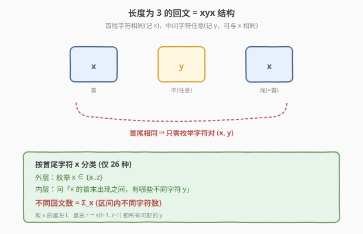
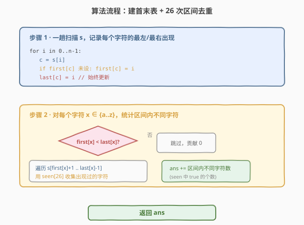
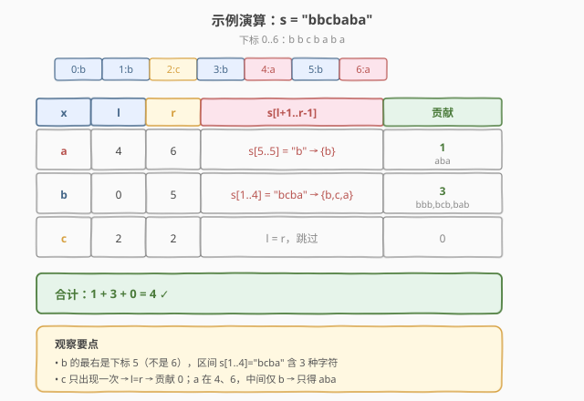

# 长度为 3 的不同回文子序列

- **题目名称**：长度为 3 的不同回文子序列
- **链接**：[1930. 长度为 3 的不同回文子序列](https://leetcode.cn/problems/unique-length-3-palindromic-subsequences/)
- **难度**：中等
- **标签**：哈希表、字符串、枚举

## 1. 题目概述

给你一个字符串 `s`，返回 `s` 中**长度为 3** 的**不同回文子序列**的个数。

即便存在多种方法来构建相同的子序列，但相同的子序列只计数一次。

- **回文** 是正着读和反着读一样的字符串。
- **子序列** 是由原字符串删除其中部分字符（也可以不删除）且不改变剩余字符之间相对顺序形成的一个新字符串。

**示例 1**：

```text
输入：s = "aabca"
输出：3
解释：长度为 3 的 3 个回文子序列分别是：
- "aba" ("a a b c a" 的子序列)
- "aaa" ("aa bc a" 的子序列)
- "aca" ("a ab ca" 的子序列)
```

**示例 2**：

```text
输入：s = "adc"
输出：0
解释："adc" 不存在长度为 3 的回文子序列。
```

**示例 3**：

```text
输入：s = "bbcbaba"
输出：4
解释：长度为 3 的 4 个回文子序列分别是：
- "bbb" ("bb c b aba" 的子序列)
- "bcb" ("b b cb aba" 的子序列)
- "bab" ("b bcb ab a" 的子序列)
- "aba" ("bbcb aba" 的子序列)
```

**约束条件**：

- $3 \le \text{s.length} \le 10^5$
- `s` 仅由小写英文字母组成

> 💡 **审题关键**：① 要数的是「**不同**」子序列——相同的 `aba` 哪怕能由多组下标构成，也只计一次；② 长度**固定为 3**——这是把一般「回文子序列计数」大幅简化的关键约束，长度为 3 的回文只有 `xyx` 一种结构；③ 是**子序列**而非子串——中间字符不必连续，只要相对顺序保持即可。

---

## 2. 解题思路

### 2.1 暴力思路：枚举三元组

最朴素的做法：枚举所有下标三元组 $i < j < k$，判断 $s[i] == s[k]$ 是否成立（长度为 3 的回文当且仅当首尾相同，中间字符任意）。若成立，则把字符串 $s[i]\,s[j]\,s[k]$ 加入一个集合去重，最后返回集合大小。

- **正确性**：穷举所有可能，显然正确。
- **效率**：三元组数量为 $\binom{n}{3} = O(n^3)$，而 $n \le 10^5$，完全不可行——仅枚举就要 $10^{15}$ 量级。

> ⚠️ 暴力枚举无法在时限内通过。需要利用「长度固定为 3」和「只关心不同子序列」这两条性质来降维。

### 2.2 核心观察：固定为 3 → 结构 xyx → 按首尾字符分类



关键洞察：**长度为 3 的回文必然形如 `xyx`**——首尾字符相同（记为 $x$），中间字符任意（记为 $y$，可与 $x$ 相同）。于是「不同的长度 3 回文子序列」$\Leftrightarrow$「不同的 $(x, y)$ 字符对」，其中 $x \in \text{'a'..'z'}$、$y \in \text{'a'..'z'}$。

于是把问题拆成两层：

- **外层**：枚举首尾字符 $x$（仅 26 种可能）；
- **内层**：对每个 $x$，问「中间可以填哪些不同字符 $y$」——即在 $s$ 中是否存在 $i < j < k$ 使 $s[i]=s[k]=x$ 且 $s[j]=y$，对每个 $y$ 只需判定存在性。

### 2.3 关键化简：取 $x$ 的首末出现即可

对固定的 $x$，要让 $i < j < k$ 且 $s[i]=s[k]=x$，可选的 $(i, k)$ 有很多对。但注意到一个事实：

> **取 $x$ 的最左出现 $l$ 与最右出现 $r$ 作为首尾，能覆盖所有可能的中间字符 $y$。**

理由：若某个 $y$ 能出现在**某对** $x$ 之间（即存在 $i < j < k$，$s[i]=s[k]=x$，$s[j]=y$），那么 $l \le i < j < k \le r$，故 $l < j < r$，即 $y$ 也出现在 $l$ 与 $r$ 之间。反过来，若 $y$ 出现在 $l$ 与 $r$ 之间（$l < j < r$，$s[j]=y$），则 $(l, j, r)$ 就是一组合法下标。**二者等价**。

因此：

$$\text{对字符 } x \text{ 的贡献} = \text{s}[l+1\,..\,r-1] \text{ 中不同字符的个数}$$

其中 $l$、$r$ 分别是 $x$ 在 $s$ 中的最左、最右出现下标。若 $x$ 只出现一次（$l = r$）或两次且相邻（$r - l = 1$，中间无字符），则贡献为 0。

$$\boxed{\text{ans} = \sum_{x \in \text{'a'..'z'}} \big|\,\text{distinct}\big(\text{s}[l_x+1\,..\,r_x-1]\big)\big|}$$

> 💡 **为什么取首末而不是任意一对？** 因为首末之间的区间最长，包含的中间字符最全。任何更短的一对 $x$ 之间的中间字符集合，都是首末之间中间字符集合的**子集**。所以只需看首末这一对，就能一次问清「$x$ 能配哪些 $y$」，避免枚举所有 $x$ 的位置对。

> ⚠️ **只对长度恰为 3 成立**。若题目改成「长度为 5 的不同回文子序列」，结构变成 `xyzwy`，中间三位不再是单字符，无法用「首末 + 区间去重」一步搞定，需状态压缩 DP 等更复杂的做法。

### 2.4 算法流程图



整体两步：

1. **建首末表**（一趟扫描 $s$，$i$ 从 $0$ 到 $n-1$）：
   - 对字符 $c = s[i]$：若 `first[c]` 未设置则设为 $i$；始终更新 `last[c] = i`。
2. **统计贡献**（对 $c$ 从 `'a'` 到 `'z'`）：
   - 若 `first[c] < last[c]`（即至少有两处出现且中间有字符）：
     - 遍历 $\text{s}[\text{first}[c]+1\,..\,\text{last}[c]-1]$，用长度 26 的布尔数组 / 集合收集出现过的字符。
     - 把去重后的字符数累加进 `ans`。
   - 否则跳过（贡献为 0）。

> 💡 **复杂度保证**：外层 26 个字符，内层每个字符 $c$ 遍历的区间长度为 $r_c - l_c - 1$。最坏情况每个字符的首末几乎覆盖整个串（如 `a..a..b..b..`），总和上界 $26 \times n$，故 $O(26n) = O(n)$。用布尔数组而非哈希集合可使单字符判定为 $O(\text{区间长} + 26)$。

### 2.5 示例演算

以官方示例 3 `s = "bbcbaba"`（下标 `0..6`）演示全过程：



| 字符 $x$ | 最左 $l$ | 最右 $r$ | 区间 $\text{s}[l+1..r-1]$ | 区间内不同字符 | 贡献 |
|----------|----------|----------|---------------------------|----------------|------|
| `a` | 4 | 6 | `s[5..5]` = `"b"` | $\{b\}$ | 1 → `aba` |
| `b` | 0 | 5 | `s[1..4]` = `"bcba"` | $\{b,c,a\}$ | 3 → `bbb`,`bcb`,`bab` |
| `c` | 2 | 2 | —（$l=r$，跳过） | — | 0 |
| 其余 | — | — | 未出现 | — | 0 |

合计 $1 + 3 = 4$，与官方答案一致 ✓。

> 💡 **观察要点**：① `b` 的最左是下标 0、最右是下标 5（不是 6，下标 6 是 `a`），区间 `s[1..4]="bcba"` 含三种不同字符，正好对应 `bbb`、`bcb`、`bab` 三个回文；② `c` 只出现一次，首末相同，贡献为 0；③ `a` 在下标 4 和 6，中间只有下标 5 的 `b`，故只贡献 `aba` 一个。

---

## 3. 参考代码

### C++

```cpp
class Solution {
public:
    int countPalindromicSubsequence(string s) {
        int n = s.size();
        vector<int> first(26, -1), last(26, -1);
        for (int i = 0; i < n; ++i) {
            int c = s[i] - 'a';
            if (first[c] == -1) first[c] = i;
            last[c] = i;
        }
        int ans = 0;
        for (int c = 0; c < 26; ++c) {
            if (first[c] == -1 || first[c] >= last[c]) continue;
            vector<bool> seen(26, false);
            for (int i = first[c] + 1; i < last[c]; ++i) {
                seen[s[i] - 'a'] = true;
            }
            for (int d = 0; d < 26; ++d) {
                if (seen[d]) ++ans;
            }
        }
        return ans;
    }
};
```

### Python

```python
class Solution:
    def countPalindromicSubsequence(self, s: str) -> int:
        first, last = {}, {}
        for i, ch in enumerate(s):
            if ch not in first:
                first[ch] = i
            last[ch] = i
        ans = 0
        for ch in first:
            if first[ch] < last[ch]:
                ans += len(set(s[first[ch] + 1:last[ch]]))
        return ans
```

> 💡 **写法对照**：① C++ 用 `vector<int>(26, -1)` 记首末下标、`vector<bool>(26)` 做区间去重，避免哈希开销，常数最小；② Python 用字典记首末、用 `set(s[l+1:r])` 一行完成区间去重，切片 + 集合语义最贴近公式。两者复杂度同为 $O(n)$。

> ⚠️ **下标边界**：C++ 中遍历 `first[c]+1` 到 `last[c]-1`（左闭右闭），`first[c] < last[c]` 保证至少有一个位置；若 `first[c]+1 == last[c]`（首末相邻，中间无字符），循环体不执行，贡献为 0，逻辑自洽。Python 切片 `s[l+1:r]` 是左闭右开，恰好等价于 C++ 的 `[l+1, r-1]` 闭区间。

---

## 4. 复杂度分析

| 维度 | 复杂度 | 说明 |
|------|--------|------|
| 时间复杂度 | $O(n)$ | 建首末表一趟 $O(n)$；统计贡献时外层 26、内层区间总长不超过 $26n$，故 $O(26n) = O(n)$ |
| 空间复杂度 | $O(1)$ | 仅用两个长度 26 的首末数组 + 一个长度 26 的布尔去重表，与 $n$ 无关（字母表大小固定为 26） |

> 💡 严格来说空间是 $O(|\Sigma|)$，其中 $|\Sigma|=26$ 为字母表大小。因 $|\Sigma|$ 是常数，故视为 $O(1)$。若字母表换成 Unicode，需改用哈希表，空间退化为 $O(\min(n, |\Sigma|))$。

---

## 5. 扩展：前缀和优化与更长回文

### 5.1 前缀和批量查询区间字符种类

当字符串非常长且要多次回答「任意区间内有多少种字符」时，可预处理**逐字符前缀和**：`pref[c][i]` 表示字符 $c$ 在 `s[0..i-1]` 中出现次数。于是 `s[l+1..r-1]` 中字符 $c$ 是否出现 $\Leftrightarrow$ `pref[c][r] - pref[c][l+1] > 0`。

```cpp
// 预处理 O(26 * n)
vector<vector<int>> pref(26, vector<int>(n + 1, 0));
for (int i = 0; i < n; ++i) {
    for (int c = 0; c < 26; ++c) pref[c][i + 1] = pref[c][i];
    pref[s[i] - 'a'][i + 1]++;
}
// 查询 s[l+1..r-1] 内字符种类数
int kinds = 0;
for (int c = 0; c < 26; ++c)
    if (pref[c][r] - pref[c][l + 1] > 0) ++kinds;
```

本题只需查询 26 次（每个 $x$ 一次），朴素区间扫描已经够快；前缀和版的优势在「查询次数远多于 26」时才体现。两种写法时间同为 $O(n)$，前缀和版空间 $O(26n)$ 较大。

### 5.2 更长回文子序列计数

本题能 O(n) 解决，得益于「长度固定为 3」把回文结构锁定为 `xyx`。若改为「长度为 5 的不同回文子序列」（结构 `xyzwy`），中间变成一段长度 3 的子问题，需配合区间 DP 或状态压缩；若改为「所有长度的不同回文子序列总数」，则属 [730. 不同子序列 II](https://leetcode.cn/problems/count-different-palindromic-subsequences-ii/) 一类，需更精细的 DP。本题可作为这类问题的「入门特例」。

---

## 6. 面试要点

**Q1：为什么长度为 3 的回文只有 `xyx` 一种结构？**

> 长度为 3 的字符串 $c_1 c_2 c_3$ 是回文 $\Leftrightarrow c_1 = c_3$，中间 $c_2$ 任意。令 $x = c_1 = c_3$、$y = c_2$ 即得 `xyx`。这是「奇数长度回文以中心为对称」的最短非平凡情形，结构极简。

**Q2：为什么取首末出现就能覆盖所有可能的中间字符？**

> 设 $x$ 在 $s$ 中的最左、最右出现为 $l$、$r$。对任意合法的 $(i, j, k)$（$s[i]=s[k]=x$，$s[j]=y$），有 $l \le i < j < k \le r$，故 $l < j < r$，即 $y$ 必在 $l$、$r$ 之间。反过来 $l$、$r$ 之间的任意字符 $y$ 配上 $(l, j, r)$ 即得合法三元组。两端等价，故首末区间内的不同字符集合 = 该 $x$ 能配的所有 $y$。

**Q3：如何保证不重复计数？**

> 每个不同的回文 `xyx` 唯一对应一个字符对 $(x, y)$。外层按 $x$ 分组、内层按 $y$ 去重，每个 $(x, y)$ 至多在 $x$ 的那次迭代中被计入一次，不同 $x$ 互不交叉。因此天然无重复，无需全局去重集合。

**Q4：时间复杂度为什么是 $O(n)$ 而非 $O(n^2)$？**

> 外层只枚举 26 个字符 $x$（常数），内层对每个 $x$ 扫描的区间长度为 $r_x - l_x - 1$。所有 $x$ 的区间总和不超过 $26n$（最坏每个 $x$ 的首末几乎覆盖全串），故 $O(26n) = O(n)$。关键在于「按字符分类」把 $O(n^2)$ 的下标对枚举压缩成了 $O(|\Sigma| \cdot n)$。

**Q5：如果字母表不是 26 个小写字母怎么办？**

> 把 `vector<int>(26)` 换成 `unordered_map<char, int>` 存首末、`unordered_set<char>` 做区间去重即可。时间复杂度变为 $O(|\Sigma| \cdot n)$，空间 $O(|\Sigma|)$。当 $|\Sigma|$ 较大时，可改用 5.1 的前缀和思路并按需懒加载。

> 💡 **一句话总结**：长度为 3 $\Rightarrow$ 回文形如 `xyx` $\Rightarrow$ 按 $x$ 分类、取首末出现、区间去重数 $y$ $\Rightarrow$ $O(n)$ 时间 $O(1)$ 空间。

---

## 7. 同类练习题

- [1876. 长度为三且各字符不同的子字符串](https://leetcode.cn/problems/substrings-of-size-three-with-distinct-characters/)（[题解](../1801-1900/1876_长度为三且各字符不同的子字符串.md)）：同样聚焦「长度为 3」的结构，但是**子串**（连续）且要求三字符各异，对照体会「子序列 vs 子串」的差异
- [1456. 定长子串中元音的最大数目](https://leetcode.cn/problems/maximum-number-of-vowels-in-a-substring-of-given-length/)：定长滑动窗口计数，可作为「固定长度」类问题的滑动窗口范式对照
- [828. 统计子串中的唯一字符](https://leetcode.cn/problems/count-unique-characters-of-all-substrings-of-a-given-string/)：按字符贡献分类统计的典型题，与本题「按 $x$ 分类算贡献」思路同源，难度更大
- [730. 统计不同回文子序列](https://leetcode.cn/problems/count-different-palindromic-subsequences/)：统计**所有长度**的不同回文子序列，需区间 DP + 去重，是本题「固定长度 3」推广到「任意长度」的进阶版
