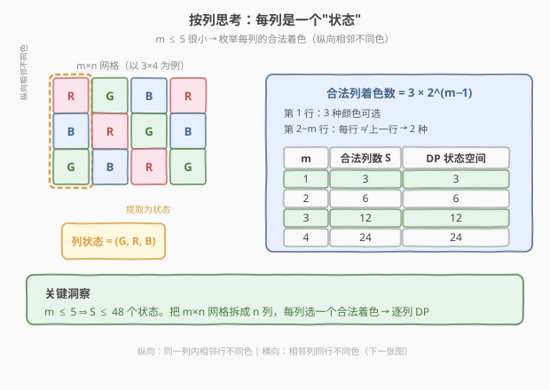
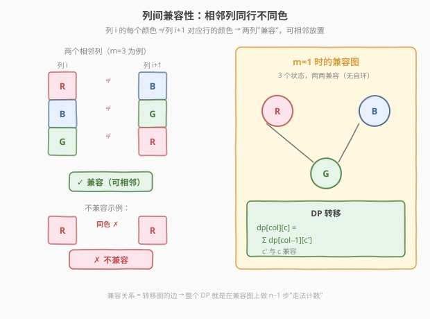
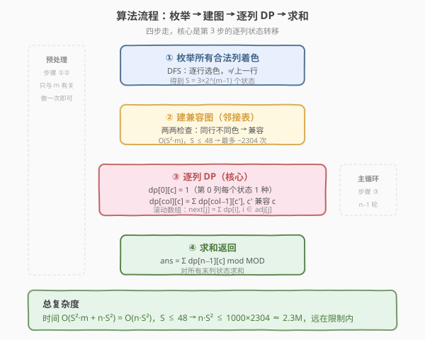
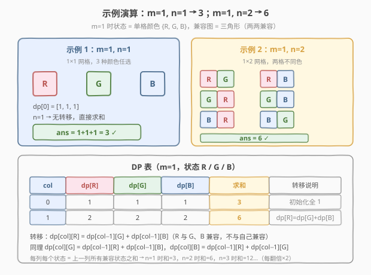

# LeetCode 用三种不同颜色为网格涂色 题解

## 1. 题目概述

- **标题 / 题号**：用三种不同颜色为网格涂色（#1931，hard）
- **链接**：https://leetcode.cn/problems/painting-a-grid-with-three-different-colors/
- **难度**：困难
- **标签**：动态规划、状态压缩、矩阵快速幂

**题意**：给定两个整数 $m$ 和 $n$，构造一个 $m \times n$ 的网格，每个单元格初始为白色。用**红（R）、绿（G）、蓝（B）**三种颜色为每个单元格涂色，所有单元格都必须被涂色。

涂色方案需满足：**不存在相邻两个单元格颜色相同**（相邻指共享一条边，即上下左右方向）。

返回合法涂色方案数，对 $10^9 + 7$ 取余。

**示例 1**：

```text
输入：m = 1, n = 1
输出：3
解释：1×1 网格，三种颜色任选其一。
```

**示例 2**：

```text
输入：m = 1, n = 2
输出：6
解释：1×2 网格，第一格 3 种选择，第二格 ≠ 第一格 → 3×2 = 6。
```

**示例 3**：

```text
输入：m = 5, n = 5
输出：580986
```

**约束**：

- $1 \le m \le 5$
- $1 \le n \le 1000$

## 2. 解题思路

### 2.1 暴力思路

最朴素的想法：枚举所有 $3^{m \times n}$ 种涂色方案，逐个检查是否满足相邻不同色。当 $m=5, n=1000$ 时，方案数达到 $3^{5000}$，这个数字本身就已经无法在物理上枚举。

> 即使只看单列，$3^5 = 243$ 种列着色中也有大量非法（纵向相邻同色）的。需要换一个角度：**不要枚举整个网格，而是按列分解**。

### 2.2 核心观察：按列状态压缩 DP



关键约束是 $m \le 5$——**行数极小，列数可以很大**。这提示我们：

1. **把网格按列拆开**，每一列是一个长度为 $m$ 的颜色序列。
2. **一列内部的约束**（纵向相邻不同色）可以预先满足——枚举出所有合法的列着色，作为一个**状态**。
3. **列与列之间的约束**（横向相邻同行不同色）通过 DP 转移来处理。

一个合法的列着色：第 1 行有 3 种颜色可选，第 2 到第 $m$ 行每行只需与上一行不同（2 种选择）。因此合法列着色数为：

$$
S = 3 \times 2^{m-1}
$$

| $m$ | 合法列数 $S$ | DP 状态空间 |
|-----|-------------|------------|
| 1 | 3 | 3 |
| 2 | 6 | 6 |
| 3 | 12 | 12 |
| 4 | 24 | 24 |
| 5 | 48 | 48 |

$S \le 48$，状态空间极小，完全可以承受 $O(n \cdot S^2)$ 的 DP。

> 💡 **为什么选列而不是选行？** 因为 $m \le 5$ 而 $n$ 可达 1000。按列分解后状态数 $\le 48$，按行分解则状态数可达 $3^{1000}$，完全不可行。**总是把小维度作为状态维度**，这是状态压缩 DP 的通用原则。

### 2.3 列间兼容性



两个合法列着色 $a$ 和 $b$ **兼容**（可以相邻放置），当且仅当它们在每一行上的颜色都不同：

$$
\text{compatible}(a, b) \iff \forall\, i \in [0, m),\; a[i] \ne b[i]
$$

兼容关系构成一个**转移图**：节点 = 合法列着色，边 = 兼容对。整个 DP 就是在这张图上做 $n - 1$ 步"走法计数"。

以 $m = 1$ 为例：3 个状态 $\{R, G, B\}$，两两兼容（无自环），形成一个三角形完全图。每走一步，每个状态的方案数 = 上一步所有邻居方案数之和。

### 2.4 算法流程



算法分四步：

1. **枚举合法列着色**：DFS 逐行选色，每行选与上一行不同的颜色，收集所有合法列着色序列。
2. **建兼容图**：两两检查所有合法列着色，同行不同色则标记兼容，构建邻接表。
3. **逐列 DP**：
   - 初始化 `dp[0][c] = 1`（第 0 列每个状态 1 种方案）。
   - 转移：`dp[col][c] = Σ dp[col-1][c']`，其中 $c'$ 遍历所有与 $c$ 兼容的状态。
   - 滚动数组优化空间：只需保留上一列的 `dp`。
4. **求和返回**：`ans = Σ dp[n-1][c] mod MOD`。

### 2.5 示例演算



以 $m = 1$ 为例，状态空间 $\{R, G, B\}$，兼容图是三角形（两两兼容，无自环）：

| col | dp[R] | dp[G] | dp[B] | 求和 | 转移说明 |
|-----|-------|-------|-------|------|---------|
| 0 | 1 | 1 | 1 | **3** | 初始化全 1 |
| 1 | 2 | 2 | 2 | **6** | dp[R] = dp[G]+dp[B] = 2 |

- $n = 1$：直接求和 $1+1+1 = 3$ ✓
- $n = 2$：每列每个状态 = 上一列两个邻居之和 $= 2$，求和 $= 6$ ✓
- $n = 3$：每列每个状态 $= 2+2 = 4$，求和 $= 12$…每多一列翻一倍

对于 $m = 5, n = 5$：$S = 48$ 个状态，4 轮 DP 转移后求和 $= 580986$ ✓。

## 3. 参考代码

### C++

```cpp
class Solution {
    static const long long MOD = 1e9 + 7;

    void generateColumns(int m, int pos, int prevColor,
                         vector<int>& cur, vector<vector<int>>& columns) {
        if (pos == m) {
            columns.push_back(cur);
            return;
        }
        for (int c = 0; c < 3; c++) {
            if (c != prevColor) {
                cur.push_back(c);
                generateColumns(m, pos + 1, c, cur, columns);
                cur.pop_back();
            }
        }
    }

    bool compatible(const vector<int>& a, const vector<int>& b) {
        for (int i = 0; i < (int)a.size(); i++) {
            if (a[i] == b[i]) return false;
        }
        return true;
    }

public:
    int colorTheGrid(int m, int n) {
        vector<vector<int>> columns;
        vector<int> cur;
        generateColumns(m, 0, -1, cur, columns);

        int S = columns.size();

        vector<vector<int>> adj(S);
        for (int i = 0; i < S; i++) {
            for (int j = 0; j < S; j++) {
                if (compatible(columns[i], columns[j])) {
                    adj[i].push_back(j);
                }
            }
        }

        vector<long long> dp(S, 1);
        for (int col = 1; col < n; col++) {
            vector<long long> nxt(S, 0);
            for (int j = 0; j < S; j++) {
                for (int i : adj[j]) {
                    nxt[j] = (nxt[j] + dp[i]) % MOD;
                }
            }
            dp = nxt;
        }

        long long ans = 0;
        for (int i = 0; i < S; i++) {
            ans = (ans + dp[i]) % MOD;
        }
        return ans;
    }
};
```

### Python

```python
class Solution:
    def colorTheGrid(self, m: int, n: int) -> int:
        MOD = 10**9 + 7

        columns = []
        def gen(pos, prev, cur):
            if pos == m:
                columns.append(tuple(cur))
                return
            for c in range(3):
                if c != prev:
                    cur.append(c)
                    gen(pos + 1, c, cur)
                    cur.pop()
        gen(0, -1, [])

        S = len(columns)

        adj = [[] for _ in range(S)]
        for i in range(S):
            for j in range(S):
                if all(columns[i][k] != columns[j][k] for k in range(m)):
                    adj[i].append(j)

        dp = [1] * S
        for _ in range(1, n):
            nxt = [0] * S
            for j in range(S):
                for i in adj[j]:
                    nxt[j] = (nxt[j] + dp[i]) % MOD
            dp = nxt

        return sum(dp) % MOD
```

> 💡 **代码要点**：
> - `generateColumns` 用 DFS 枚举，`prevColor = -1` 保证第 0 行不限色。颜色用整数 $0/1/2$ 表示，比较时直接判等。
> - `adj[i]` 存的是「与状态 $i$ 兼容的所有状态」，DP 时 `nxt[j]` 累加所有能转移到 $j$ 的前驱 $i$ 的方案数。
> - 滚动数组：`dp` 和 `nxt` 交替，空间 $O(S)$ 而非 $O(n \cdot S)$。

> ⚠️ **取模**：每步加法后立即取模，C++ 中 `long long` 足够安全（$S \times \text{MOD} < 48 \times 10^9 < 9.2 \times 10^{18}$）。

## 4. 复杂度分析

| 维度 | 复杂度 | 说明 |
|------|--------|------|
| 时间复杂度 | $O(S^2 \cdot m + n \cdot S^2)$ | 枚举列 $O(S \cdot m)$，建图 $O(S^2 \cdot m)$，DP $n-1$ 轮每轮 $O(S^2)$；$S = 3 \cdot 2^{m-1} \le 48$ |
| 空间复杂度 | $O(S^2)$ | 邻接表 $O(S^2)$，滚动数组 $O(S)$；预处理部分与 $n$ 无关 |

代入最坏情况 $m = 5, n = 1000$：$S = 48$，$n \cdot S^2 = 1000 \times 2304 \approx 2.3 \times 10^6$，远在时间限制内。

## 5. 扩展：矩阵快速幂

DP 转移 `dp[col] = T · dp[col-1]` 可以写成矩阵乘法形式，其中 $T$ 是 $S \times S$ 的转移矩阵：

$$
T[j][i] = \begin{cases} 1 & \text{if } i \text{ 与 } j \text{ 兼容} \\ 0 & \text{否则} \end{cases}
$$

则 $n$ 列的答案为：

$$
\text{ans} = \mathbf{1}^{\top} \cdot T^{\,n-1} \cdot \mathbf{1}
$$

其中 $\mathbf{1}$ 是全 1 列向量。用**矩阵快速幂**计算 $T^{n-1}$，复杂度降为 $O(S^3 \log n)$：

- $S = 48$：$S^3 = 110592$，$\log n \le 10$ → 约 $1.1 \times 10^6$ 次运算。
- 朴素 DP：$n \cdot S^2 = 2.3 \times 10^6$。

对于 $n \le 1000$，两种方法性能接近，矩阵快速幂的优势在 $n$ 更大时才显现（如此题的进阶变体 $n \le 10^9$）。但矩阵快速幂的代码更复杂，$n \le 1000$ 时朴素 DP 足矣。

```cpp
// 矩阵快速幂核心（扩展用）
typedef vector<vector<long long>> Matrix;

Matrix matMul(const Matrix& A, const Matrix& B, int S) {
    Matrix C(S, vector<long long>(S, 0));
    for (int i = 0; i < S; i++)
        for (int k = 0; k < S; k++)
            if (A[i][k])
                for (int j = 0; j < S; j++)
                    C[i][j] = (C[i][j] + A[i][k] * B[k][j]) % MOD;
    return C;
}

Matrix matPow(Matrix A, long long exp, int S) {
    Matrix R(S, vector<long long>(S, 0));
    for (int i = 0; i < S; i++) R[i][i] = 1; // 单位矩阵
    while (exp > 0) {
        if (exp & 1) R = matMul(R, A, S);
        A = matMul(A, A, S);
        exp >>= 1;
    }
    return R;
}
```

> 💡 **矩阵快速幂的适用信号**：当 DP 转移是**线性齐次**的（每个状态 = 若干前驱状态的线性组合，且转移规则不随步数变化），就可以用矩阵快速幂把 $O(n)$ 轮循环压缩为 $O(\log n)$ 次矩阵乘法。

## 6. 面试要点

1. **为什么按列分解而不是按行分解？**

   > $m \le 5$ 而 $n$ 可达 1000。按列分解后，一列的状态数 $= 3 \times 2^{m-1} \le 48$，状态空间极小。按行分解则状态数 $= 3 \times 2^{n-1}$，当 $n = 1000$ 时天文数字。**状态压缩 DP 的核心原则：把小维度作为状态维度**。

2. **合法列着色数为什么是 $3 \times 2^{m-1}$？**

   > 第 1 行 3 种颜色可选；第 2 到第 $m$ 行每行只需与上一行不同，各有 2 种选择。所以 $3 \times 2^{m-1}$。注意这是「纵向相邻不同色」约束下的计数，与横向约束无关。

3. **兼容关系如何判定？**

   > 两个合法列着色 $a$ 和 $b$ 兼容，当且仅当每一行的颜色都不同：$\forall i, a[i] \ne b[i]$。这是「横向相邻不同色」约束的直接体现。预处理时 $O(S^2 \cdot m)$ 两两检查即可。

4. **DP 的状态转移方程是什么？**

   > $\text{dp}[\text{col}][c] = \sum_{c' \text{ compatible with } c} \text{dp}[\text{col}-1][c']$。初始 $\text{dp}[0][c] = 1$。答案 $= \sum_c \text{dp}[n-1][c]$。用滚动数组把空间压到 $O(S)$。

5. **什么时候应该用矩阵快速幂？**

   > 当 DP 转移是线性的（状态 = 前驱状态的线性组合）且转移规则不随步数变化时，可写为矩阵乘法，用快速幂把 $O(n)$ 压到 $O(\log n)$。本题 $n \le 1000$ 用朴素 DP 已足够；若 $n \le 10^9$ 则必须用矩阵快速幂。

## 同类练习题

| # | 题目 | 与本题的关联 |
|---|------|-------------|
| 1411 | [给 N × 3 网格图涂色的方案数](https://leetcode.cn/problems/paint-n-x-3-grid/) | 本题的姊妹篇，列宽固定为 3，状态更少，是理解按列 DP 的入门版 |
| 526 | [优美的排列](https://leetcode.cn/problems/beautiful-arrangement/)（[题解](../0501-0600/526_优美的排列.md)） | 状态压缩 DP 的经典题，bitmask 记已用集合，与本题「枚举合法状态」的思想一脉相承 |
| 935 | [骑士拨号器](https://leetcode.cn/problems/knight-dialer/) | 线性 DP + 矩阵快速幂的经典题，转移图固定、步数大，是本题矩阵快速幂扩展的直接练习 |
| 1922 | [统计好数字的数目](https://leetcode.cn/problems/count-good-numbers/)（[题解](./1922_统计好数字的数目.md)） | 同样是对 $10^9 + 7$ 取模的计数问题，但各位独立可用乘法原理秒杀——对照理解何时需要 DP、何时直接组合公式 |
