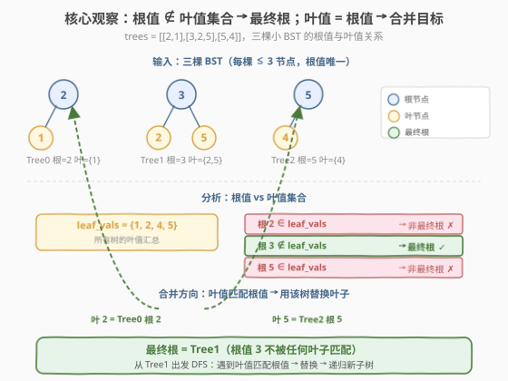
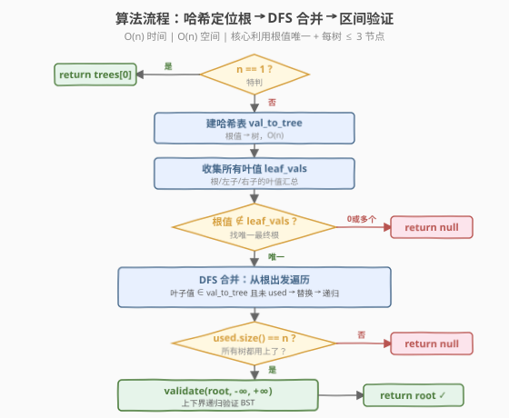
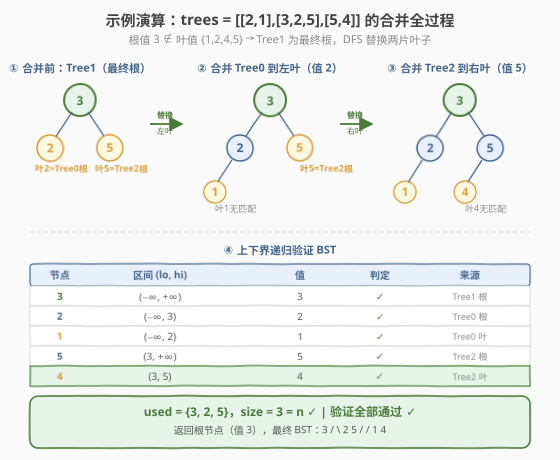

# 合并多棵二叉搜索树

- **题目名称**：合并多棵二叉搜索树
- **链接**：[1932. 合并多棵二叉搜索树](https://leetcode.cn/problems/merge-bsts-to-create-single-bst/)
- **难度**：困难
- **标签**：树、二叉搜索树、深度优先搜索、哈希表

## 1. 题目概述

给你 $n$ 个**二叉搜索树的根节点**，存储在数组 `trees` 中。每棵 BST 最多有 $3$ 个节点，且不存在值相同的两个根节点。

**一步操作**：

- 选择两个不同的下标 $i$ 和 $j$，要求 `trees[i]` 中某个**叶节点**的值等于 `trees[j]` 的**根节点值**。
- 用 `trees[j]` 替换 `trees[i]` 中的那个叶节点。
- 从 `trees` 中移除 `trees[j]`。

执行 $n-1$ 次操作后，若能形成一棵有效 BST，返回根节点；否则返回 `null`。

**示例 1**：

```text
输入：trees = [[2,1],[3,2,5],[5,4]]
输出：[3,2,5,1,null,4]

  Tree0      Tree1       Tree2
    2          3           5
   /          / \         /
  1          2   5       4

操作1: Tree0 的叶 1 ≠ 任何根 → 不操作
       Tree1 的叶 2 = Tree0 根 2 → 合并 Tree0 到 Tree1 的左叶
操作2: Tree1 的叶 5 = Tree2 根 5 → 合并 Tree2 到 Tree1 的右叶

结果:
       3
      / \
     2   5
    /   /
   1   4      ← 有效 BST ✓
```

**示例 2**：

```text
输入：trees = [[5,3,8],[3,2,6]]
输出：[]

  Tree0        Tree1
    5            3
   / \          / \
  3   8        2   6

合并 Tree1 到 Tree0 的左叶(3):
       5
      / \
     3   8
    / \
   2   6       ← 6 > 5，在左子树中违反 BST ✗
```

**示例 3**：

```text
输入：trees = [[5,4],[3]]
输出：[]
解释：叶 4 ≠ 根 3，叶 3 ≠ 根 5，无法执行任何操作。
```

**约束条件**：

- $1 \le n \le 5 \times 10^4$
- 每棵树节点数 $\in [1, 3]$
- 输入数据每个节点可能有子节点但**不存在子节点的子节点**（树高至多 2）
- `trees` 中不存在两棵树根节点值相同的情况
- 输入中所有树都是有效的 BST
- $1 \le \text{TreeNode.val} \le 5 \times 10^4$

> 💡 **审题关键**：① 每棵树**最多 3 个节点且无孙节点**——这意味着根的直接孩子必定是叶子，叶子判定只需检查 `left/right == null`；② **根值唯一**——可用哈希表将根值映射到树，一步定位合并目标；③ 合并后必须验证整棵 BST 合法性——单棵子树合法不代表拼接后全局合法（示例 2 即如此）。

---

## 2. 解题思路

### 2.1 暴力思路：枚举合并顺序

最朴素的想法：尝试所有 $n!$ 种合并顺序，每次检查是否有叶值匹配根值，执行替换，最后验证 BST。

- **正确性**：穷举所有顺序，理论上能覆盖。
- **效率**：$n!$ 种排列，每种还需 $O(n)$ 验证，$n \le 5 \times 10^4$ 时完全不可行。

> ⚠️ 问题在于：合并顺序真的重要吗？实际上，由于根值唯一，每个叶值**至多匹配一棵树的根**，合并目标由数据结构唯一确定——不存在「选哪棵树」的自由度，只有「能不能合并」的判定。一旦认识到这一点，$n!$ 穷举就完全没有必要。

### 2.2 核心观察：哈希定位根 + DFS 合并 + 区间验证



整个解法建立在**三个关键观察**上：

**观察 1：根值哈希 → 一步定位合并目标**

根值互不相同，所以可以建一张哈希表 `val_to_tree`：根值 $\to$ 树。遇到一个叶子，若其值在表中，立刻知道该用哪棵树替换——无需搜索，$O(1)$ 定位。

**观察 2：根值不在叶值集合 → 唯一确定最终根**

最终树的根是唯一**不被合并进任何其他树**的树。一棵树被合并进另一棵，当且仅当它的根值出现在某棵其他树的叶子位置。因此：

> **最终根 = 根值不出现在任何树叶子值集合中的那棵树。**

收集所有树的叶值到集合 `leaf_vals`，再扫描各树根值：不在 `leaf_vals` 中的根值对应最终根。若这样的树不唯一或不存在，直接返回 `null`。

**观察 3：合并后必须全局验证 BST**

每棵输入树本身是合法 BST，但拼接后**祖先区间约束**可能被违反（示例 2：Tree1 的右子 6 虽在 Tree1 内部合法，但拼接后处于 Tree0 根 5 的左子树中，$6 > 5$ 违规）。因此合并完毕后，必须用**上下界递归**（承接 [98. 验证二叉搜索树](../0001-0100/98_验证二叉搜索树.md)）做一次全局验证：

$$\text{validate}(node, lo, hi) \colon \quad lo < node.val < hi \;\wedge\; \text{validate}(left, lo, val) \;\wedge\; \text{validate}(right, val, hi)$$

> 💡 **为什么用上下界而非中序？** 合并后需要返回树节点（不只是布尔判定），上下界递归天然在树上操作，且一次遍历即可。中序迭代也行，但上下界递归更简洁、与合并 DFS 结构一致。

### 2.3 算法流程图



**完整步骤**：

1. **特判** $n = 1$：直接返回 `trees[0]`（输入保证是合法 BST）。
2. **建哈希表** `val_to_tree`：根值 $\to$ 树。
3. **收集叶值** `leaf_vals`：遍历每棵树，收集所有叶节点的值。
   - 根无左右孩子 $\to$ 根本身是叶（单节点树）。
   - 根有左孩子 $\to$ 左孩子是叶（无孙节点保证）。
   - 根有右孩子 $\to$ 右孩子是叶。
4. **定位最终根**：找根值 $\notin$ `leaf_vals` 的树。若不唯一或不存在 $\to$ 返回 `null`。
5. **DFS 合并**：从最终根出发，对每个**是叶子且值在** `val_to_tree` **中且未被使用**的孩子节点，用对应子树替换，递归处理新子树的叶子。
6. **检查使用数**：合并后 `used` 集合大小必须 $= n$，否则有树未用 $\to$ 返回 `null`。
7. **验证 BST**：上下界递归，`validate(root, $-\infty$, $+\infty$)`。

> ⚠️ **步骤 5 的关键细节**：替换后要**递归 DFS 新子树**——新子树的叶子可能仍需继续合并。同时用 `used` 集合防止重复使用（两个叶子值相同且都匹配同一根时，只能替换一次，另一个在验证阶段被捕获为重复值违规）。

### 2.4 示例演算

以示例 1 `trees = [[2,1],[3,2,5],[5,4]]` 演示完整流程：



**第一步 · 建表与收集叶值**

| 树 | 根值 | 叶值 | 根值 $\in$ leaf_vals？ |
|----|------|------|----------------------|
| Tree0 | 2 | 1 | 2 $\in$ {1,2,4,5} ✓ → 非根 |
| Tree1 | 3 | 2, 5 | 3 $\notin$ {1,2,4,5} ✗ → **最终根** |
| Tree2 | 5 | 4 | 5 $\in$ {1,2,4,5} ✓ → 非根 |

`val_to_tree = {2→Tree0, 3→Tree1, 5→Tree2}`，`leaf_vals = {1, 2, 4, 5}`。

最终根 = **Tree1**（根值 3 不在任何叶值中）。

**第二步 · DFS 合并**

| 步骤 | 当前节点 | 检查孩子 | 叶值 | 在表中？ | 操作 | used |
|------|---------|---------|------|---------|------|------|
| 1 | 根 3 | 左子 2 | 2 | ✓ Tree0 | `node.left = Tree0`，递归 | {3,2} |
| 2 | Tree0 根 2 | 左子 1 | 1 | ✗ | 无操作 | {3,2} |
| 3 | 根 3 | 右子 5 | 5 | ✓ Tree2 | `node.right = Tree2`，递归 | {3,2,5} |
| 4 | Tree2 根 5 | 左子 4 | 4 | ✗ | 无操作 | {3,2,5} |

`used.size() = 3 = n` ✓，所有树均被使用。

**第三步 · 验证 BST**

| 节点 | 区间 $(lo, hi)$ | 值 | 判定 |
|------|-----------------|----|------|
| 3 | $(-\infty, +\infty)$ | 3 | ✓ |
| 2 | $(-\infty, 3)$ | 2 | ✓ |
| 1 | $(-\infty, 2)$ | 1 | ✓ |
| 5 | $(3, +\infty)$ | 5 | ✓ |
| 4 | $(3, 5)$ | 4 | ✓ |

全局验证通过，返回根节点（值 3）。

> 💡 **对比示例 2**：`trees = [[5,3,8],[3,2,6]]`，合并后节点 6 的区间为 $(3, 5)$（祖先 5 的左子树），但 $6 > 5$ → 验证失败 → 返回 `null`。这正是「单棵合法不代表拼接合法」的体现。

---

## 3. 参考代码

### C++

```cpp
class Solution {
public:
    TreeNode* canMerge(vector<TreeNode*>& trees) {
        if (trees.size() == 1) return trees[0];

        unordered_map<int, TreeNode*> valToTree;
        for (TreeNode* t : trees) valToTree[t->val] = t;

        unordered_set<int> leafVals;
        for (TreeNode* t : trees) {
            if (!t->left && !t->right) leafVals.insert(t->val);
            if (t->left)  leafVals.insert(t->left->val);
            if (t->right) leafVals.insert(t->right->val);
        }

        TreeNode* root = nullptr;
        for (TreeNode* t : trees) {
            if (!leafVals.count(t->val)) {
                if (root) return nullptr;
                root = t;
            }
        }
        if (!root) return nullptr;

        unordered_set<int> used{root->val};

        function<void(TreeNode*)> merge = [&](TreeNode* node) {
            if (!node) return;
            if (node->left && !node->left->left && !node->left->right) {
                int v = node->left->val;
                if (valToTree.count(v) && !used.count(v)) {
                    node->left = valToTree[v];
                    used.insert(v);
                    merge(node->left);
                }
            }
            if (node->right && !node->right->left && !node->right->right) {
                int v = node->right->val;
                if (valToTree.count(v) && !used.count(v)) {
                    node->right = valToTree[v];
                    used.insert(v);
                    merge(node->right);
                }
            }
        };
        merge(root);

        if (used.size() != trees.size()) return nullptr;

        function<bool(TreeNode*, long long, long long)> validate =
            [&](TreeNode* node, long long lo, long long hi) -> bool {
            if (!node) return true;
            if (node->val <= lo || node->val >= hi) return false;
            return validate(node->left, lo, node->val) &&
                   validate(node->right, node->val, hi);
        };

        if (!validate(root, LLONG_MIN, LLONG_MAX)) return nullptr;
        return root;
    }
};
```

### Python

```python
class Solution:
    def canMerge(self, trees: list[TreeNode | None]) -> TreeNode | None:
        if len(trees) == 1:
            return trees[0]

        val_to_tree: dict[int, TreeNode] = {t.val: t for t in trees}

        leaf_vals: set[int] = set()
        for t in trees:
            if not t.left and not t.right:
                leaf_vals.add(t.val)
            if t.left:
                leaf_vals.add(t.left.val)
            if t.right:
                leaf_vals.add(t.right.val)

        root = None
        for t in trees:
            if t.val not in leaf_vals:
                if root:
                    return None
                root = t
        if not root:
            return None

        used: set[int] = {root.val}

        def merge(node: TreeNode | None) -> None:
            if not node:
                return
            if node.left and not node.left.left and not node.left.right:
                v = node.left.val
                if v in val_to_tree and v not in used:
                    node.left = val_to_tree[v]
                    used.add(v)
                    merge(node.left)
            if node.right and not node.right.left and not node.right.right:
                v = node.right.val
                if v in val_to_tree and v not in used:
                    node.right = val_to_tree[v]
                    used.add(v)
                    merge(node.right)

        merge(root)

        if len(used) != len(trees):
            return None

        def validate(node: TreeNode | None, lo: int, hi: int) -> bool:
            if not node:
                return True
            if not (lo < node.val < hi):
                return False
            return validate(node.left, lo, node.val) and \
                   validate(node.right, node.val, hi)

        if not validate(root, float('-inf'), float('inf')):
            return None
        return root
```

> 💡 **写法要点**：① `used` 集合防重复合并——两个叶子值相同且匹配同一根时只替换一次，另一个在验证阶段因重复值被区间检查淘汰；② Python 用 `float('-inf')` / `float('inf')` 表示无界，天然规避 int 边界问题；C++ 用 `long long` 配 `LLONG_MIN/MAX`，节点值 $\le 5 \times 10^4$ 远在范围内；③ `merge` 是后序式的——先替换当前层叶子，再递归进入新子树继续替换，保证深度方向的合并链不遗漏。

> ⚠️ **为何特判** $n=1$：单棵树无需合并直接返回。但若该树是单节点树，根值在自身叶值集合中，通用流程会误判为「无根候选」返回 `null`，故需特判兜底。

---

## 4. 复杂度分析

| 维度 | 复杂度 | 说明 |
|------|--------|------|
| **时间** | $O(n)$ | 建表 $O(n)$ + 收集叶值 $O(n)$（每树至多 3 节点）+ 定位根 $O(n)$ + DFS 合并 $O(n)$（每树访问一次）+ 验证 $O(n)$（总节点 $\le 3n$） |
| **空间** | $O(n)$ | `val_to_tree` 哈希表 $O(n)$ + `leaf_vals` 集合 $O(n)$ + `used` 集合 $O(n)$ + 验证递归栈 $O(h)$，$h$ 为最终树高（最坏 $O(n)$，但每树至多 2 层，实际 $h \le 2n$） |

> 💡 本题核心优势在于利用「每树至多 3 节点 + 根值唯一」两个约束，将看似需要搜索的合并问题降维为 $O(1)$ 哈希查找，整体线性。

---

## 5. 扩展：BST 拼接与验证的通用范式

本题是「**局部合法 → 拼接后全局验证**」范式的代表。许多 BST 题都涉及结构变更后的合法性检查：

| 场景 | 题目 | 与本题的关联 |
|------|------|-------------|
| 删除后验证 | [450. 删除 BST 中的节点](../0401-0500/450_删除二叉搜索树中的节点.md) | 删除后需保证 BST 性质，用中序后继填补 |
| 交换后验证 | [99. 恢复二叉搜索树](https://leetcode.cn/problems/recover-binary-search-tree/) | 两节点错位后中序序列出现逆序对 |
| 展开后验证 | [897. 递增顺序搜索树](https://leetcode.cn/problems/increasing-order-search-tree/) | 重排为右链后仍需保持中序有序 |
| 合并后验证 | **本题 1932** | 多棵子树拼接后用上下界递归全局验证 |

> ⚠️ **通用教训**：对 BST 做任何结构性操作（删除、交换、展开、合并），操作完毕后都应验证——局部正确不保证全局正确，**上下界递归**是最通用的验证工具。

---

## 6. 面试要点

**Q1：为什么根值不在叶值集合中的树就是最终根？**

> 一棵树被合并进另一棵的前提是它的根值出现在后者的某个叶子位置。反过来，若一棵树的根值不出现在任何树的叶子中，就没有任何树能「接纳」它——它只能作为最终根存在。根值唯一保证了这种对应是一对一的。

**Q2：为什么合并后还要验证 BST？输入树不都是合法 BST 吗？**

> 每棵输入树内部合法，但拼接后引入了**跨树祖先约束**。示例 2 中 Tree1 的右子 6 在 Tree1 内合法（$6 > 3$），但拼接后它处于 Tree0 根 5 的左子树中，需要 $6 < 5$，矛盾。上下界递归会将祖先的值作为区间端点向下传递，精准捕获这种跨层违规。

**Q3：`used` 集合的作用是什么？不检查会怎样？**

> `used` 防止同一棵树被合并两次。若两棵不同树的叶子值相同且都匹配某个根值，没有 `used` 会导致同一棵子树被重复挂接，产生环和重复值。有 `used` 时只替换第一个，第二个叶子保持原值，后续验证阶段会因重复值（同一值出现在两个位置违反严格单调）而返回 `null`。

**Q4：为什么用上下界递归而不是中序遍历验证？**

> 两者等价，但上下界递归更贴合本题：① 合并操作本身就是在树上修改指针，验证自然在树上做；② 上下界递归一次遍历即可，代码简洁；③ 无需额外数组存储中序序列，空间 $O(h)$ 而非 $O(n)$。中序迭代也可行（参考 [98 题](../0001-0100/98_验证二叉搜索树.md)），作为 follow-up 提及即可。

**Q5：如果去掉「每棵树最多 3 个节点」的约束，算法需要怎么改？**

> 叶子判定从「根的直接孩子」变为「任意深度的叶子」，收集叶值时需 DFS 到真正叶子节点。合并时被替换的叶子位置可能不再是根的直接孩子，需要维护父指针或改用 BFS 逐层替换。整体复杂度仍为 $O(N)$（$N$ 为总节点数），但实现复杂度显著上升。

> 💡 **一句话总结**：根值哈希定位合并目标 + 根值不在叶值集合定位最终根 + DFS 递归合并 + 上下界递归全局验证——四步线性时间，核心在于「局部合法不代表全局合法」的验证意识。

---

## 7. 同类练习题

- [98. 验证二叉搜索树](https://leetcode.cn/problems/validate-binary-search-tree/)（[题解](../0001-0100/98_验证二叉搜索树.md)）：BST 验证的母题，上下界递归与中序单调性两种等价视角，是本题验证阶段的前置
- [99. 恢复二叉搜索树](https://leetcode.cn/problems/recover-binary-search-tree/)：BST 结构被破坏后的修复，同样依赖中序单调性检测违规，对照本题的「拼接后验证」
- [450. 删除二叉搜索树中的节点](https://leetcode.cn/problems/delete-node-in-a-bst/)（[题解](../0401-0500/450_删除二叉搜索树中的节点.md)）：BST 结构变更后保持合法性的另一变体，删除操作后的重连与验证
- [108. 将有序数组转换为二叉搜索树](https://leetcode.cn/problems/convert-sorted-array-to-binary-search-tree/)（[题解](../0101-0200/108_将有序数组转换为二叉搜索树.md)）：从有序序列构造 BST，分治构造的思路可对比本题的「拼接构造」
- [1660. 纠正二叉树](https://leetcode.cn/problems/correct-a-binary-tree/)：BST 结构修复的另一变体，节点错误指向同级节点后的检测与纠正
