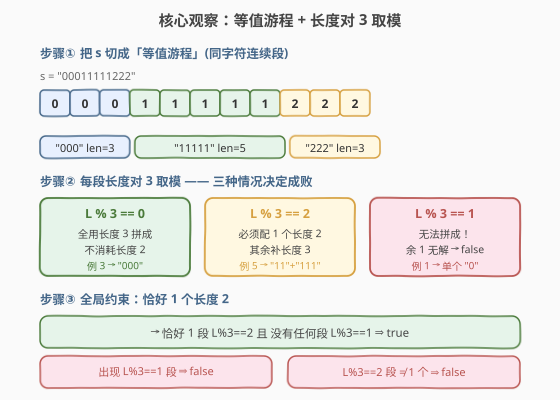
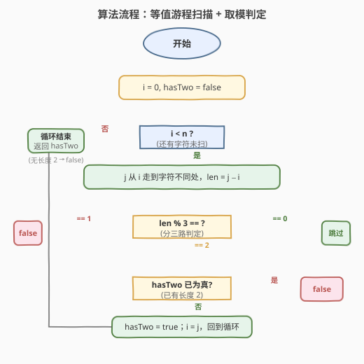
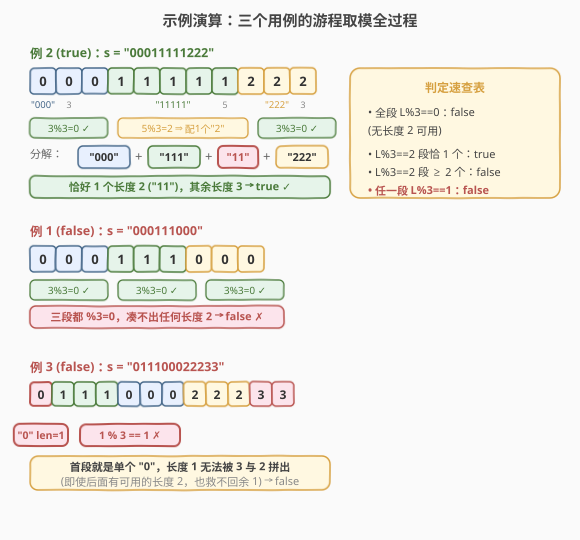

# 判断字符串是否可分解为值均等的子串

- **题目名称**：判断字符串是否可分解为值均等的子串
- **链接**：[1933. 判断字符串是否可分解为值均等的子串](https://leetcode.cn/problems/check-if-string-is-decomposable-into-value-equal-substrings/)
- **难度**：简单
- **标签**：字符串、双指针、贪心、数学

## 1. 题目概述

**等值字符串（value-equal string）** 指所有字符都相同的字符串（如 `"1111"`、`"33"`），而 `"123"` 不是。

给定一个**数字字符串** `s`，要求将其分解为若干**连续的等值子串**，且满足：

- **恰好一个**子串长度为 `2`；
- **其余**子串长度均为 `3`。

能按此规则分解则返回 `true`，否则返回 `false`。子串是原字符串中连续的字符序列。

**示例 1**：

```text
输入：s = "000111000"
输出：false
解释：s 只能分解为 ["000","111","000"]，全是长度 3，没有长度 2 的子串。
```

**示例 2**：

```text
输入：s = "00011111222"
输出：true
解释：s 可分解为 ["000","111","11","222"]——恰好一个长度 2（"11"），其余长度 3。
```

**示例 3**：

```text
输入：s = "011100022233"
输出：false
解释：开头单独一个 "0"（长度 1），无法用长度 2/3 拼出。
```

**约束条件**：

- $1 \leq \text{s.length} \leq 1000$
- `s` 仅由数字 `'0'`–`'9'` 组成

> 💡 **审题关键**：① 每个分解片段必须是**等值串**——片段边界天然受「字符变化处」约束，跨字符的片段不可能存在；② 恰好一个长度 2、其余长度 3——这是一道关于「每段连续同字符游程长度对 3 取模」的判定题，而非搜索题。

---

## 2. 解题思路

### 2.1 暴力思路：枚举切分方案

最朴素的想法：在 `s` 的每个位置尝试「切 / 不切」，枚举所有切分方式，再逐一验证「每段等值、长度 ∈ {2,3}、恰好一个长度 2」。

- **正确性**：穷举所有方案，理论上可覆盖。
- **效率**：切分方式数随长度指数增长（最坏 $2^{n-1}$），$n = 1000$ 时完全不可行。

> ⚠️ 暴力的浪费在于：它把「等值」约束当成了事后校验，而没有利用「**等值片段不可能跨越字符变化处**」这一结构性事实。一旦按字符变化把 `s` 切成**游程**，每个游程内部的切分只受长度 2/3 的组合约束，问题立刻坍缩为对游程长度的取模判定。

### 2.2 核心观察：等值游程 + 长度对 3 取模



整个解法建立在**三个关键观察**上。

**观察 1：等值片段不跨越字符变化 → 先做游程编码**

任何分解片段都必须是等值串（全同字符），所以片段边界**必然落在字符变化处**（或游程内部）。于是第一步：把 `s` 切成若干**极大等值游程**，记录每段长度 $L$。例如 `"00011111222"` → 游程长度 $[3, 5, 3]$。

**观察 2：单段长度 $L$ 的可行性由 $L \bmod 3$ 决定**

每个游程（长度 $L$、全同字符）需要被切成若干长度 2/3 的等值片段。由于「**全局恰好一个长度 2**」，每个游程**至多贡献一个长度 2**。于是：

| $L \bmod 3$ | 该游程能否拼出 | 说明 |
|-------------|---------------|------|
| $0$ | ✓ 全用长度 3 | $L = 3a$，消耗 $0$ 个长度 2 |
| $2$ | ✓ 配一个长度 2 | $L = 3a + 2$，消耗恰好 $1$ 个长度 2 |
| $1$ | ✗ **无解** | $L = 3a+1$，单独一个长度 2 余 $-1$ 无意义；不配长度 2 又余 1 → 无法用 {2,3} 表出 |

> 💡 **为什么 $L \bmod 3 = 1$ 一定无解？** 游程内只能用长度 2 和 3 的片段。若该游程贡献 $b \in \{0,1\}$ 个长度 2（全局至多一个，故单游程至多一个），则 $L = 3a + 2b$，余数只能是 $0$（$b=0$）或 $2$（$b=1$）。余 $1$ 在数学上不可表出。

**观察 3：全局「恰好一个长度 2」⇒ 恰好一段 $L \bmod 3 = 2$**

由观察 2，$L \bmod 3 = 2$ 的游程**必须**贡献一个长度 2（否则余 2 无法用 3 消化）；而 $L \bmod 3 = 0$ 的游程**不**贡献长度 2。因此全局长度 2 的总数 $= $ 「$L \bmod 3 = 2$ 的游程个数」。要求恰好一个：

$$\boxed{\text{返回 true} \iff \big(\text{无游程 } L \bmod 3 = 1\big) \;\wedge\; \big(\text{恰有一个游程 } L \bmod 3 = 2\big)}$$

### 2.3 算法流程图



**完整步骤**：

1. **初始化**：指针 $i = 0$，标记 `hasTwo = false`（是否已遇到需要长度 2 的游程）。
2. **扫游程**：对每个 $i$，用 $j$ 向右走到首个 `s[j] ≠ s[i]` 处，游程长度 `len = j − i`。
3. **取模三分支**：
   - `len % 3 == 1` → 直接返回 `false`（无解游程）。
   - `len % 3 == 2` → 若 `hasTwo` 已为真（出现第二个长度 2）返回 `false`，否则置 `hasTwo = true`。
   - `len % 3 == 0` → 无事发生，继续。
4. **推进**：`i = j`，回到步骤 2。
5. **收尾**：循环结束后返回 `hasTwo`——若全程没出现长度 2 的游程也判 `false`（不满足「恰好一个」）。

> ⚠️ **收尾的 `return hasTwo` 容易漏**：若所有游程都是 $L \bmod 3 = 0$（如示例 1），循环中没有任何分支返回，但此时长度 2 个数为 0，不满足「恰好一个」→ 必须返回 `false`。`hasTwo` 的初值 `false` 正好兜住这种情况。

### 2.4 示例演算

以三个官方用例演示完整流程：



**例 2（true）`s = "00011111222"`**：

| 游程 | 字符 | 长度 $L$ | $L \bmod 3$ | 判定 | hasTwo |
|------|------|---------|-------------|------|--------|
| 1 | 0 | 3 | 0 | 跳过 | false |
| 2 | 1 | 5 | 2 | 置真 | true |
| 3 | 2 | 3 | 0 | 跳过 | true |

无 $L\bmod 3=1$，恰一个 $L\bmod 3=2$ → 分解为 `["000","111","11","222"]` → `true`。

**例 1（false）`s = "000111000"`**：游程 $[3,3,3]$，全部 $L\bmod 3=0$，`hasTwo` 始终为 `false` → 返回 `false`。

**例 3（false）`s = "011100022233"`**：首游程 `"0"` 长度 1，$1 \bmod 3 = 1$ → 立即返回 `false`（后面再多可用长度 2 也救不回）。

> 💡 **关键对比**：例 1 与例 2 的区别仅在于「是否存在一个长度 %3==2 的游程」；例 3 则展示了「余 1 游程」的一票否决——任何一段 $L \bmod 3 = 1$ 都让整串无解，与长度 2 的个数无关。

---

## 3. 参考代码

### 方法一：双指针扫游程（$O(n)$，推荐）

### C++

```cpp
class Solution {
public:
    bool isDecomposable(string s) {
        int n = s.size();
        int i = 0;
        bool hasTwo = false;
        while (i < n) {
            int j = i;
            while (j < n && s[j] == s[i]) ++j;
            int len = j - i;
            if (len % 3 == 1) return false;
            if (len % 3 == 2) {
                if (hasTwo) return false;
                hasTwo = true;
            }
            i = j;
        }
        return hasTwo;
    }
};
```

### Python

```python
class Solution:
    def isDecomposable(self, s: str) -> bool:
        n = len(s)
        i = 0
        has_two = False
        while i < n:
            j = i
            while j < n and s[j] == s[i]:
                j += 1
            length = j - i
            r = length % 3
            if r == 1:
                return False
            if r == 2:
                if has_two:
                    return False
                has_two = True
            i = j
        return has_two
```

> 💡 **写法要点**：① 内层 `while` 把同字符游程一口气走完，外层 `i = j` 跳到下一段——经典「分组双指针」模板（与 [1446. 连续字符](https://leetcode.cn/problems/consecutive-characters/) 的游程统计同源）；② 三个分支都用 `return false` 提前剪枝，正常走完才 `return hasTwo`，逻辑清晰且常数小；③ `hasTwo` 既是「长度 2 计数」又是「是否出现过」的双重标记，省去单独计数变量。

### 方法二：`groupby` 写法（Pythonic，$O(n)$）

### Python

```python
from itertools import groupby

class Solution:
    def isDecomposable(self, s: str) -> bool:
        has_two = False
        for _, g in groupby(s):
            r = sum(1 for _ in g) % 3
            if r == 1:
                return False
            if r == 2:
                if has_two:
                    return False
                has_two = True
        return has_two
```

> 💡 `itertools.groupby` 天然按「连续相同键」分组，正好对应等值游程，省去手写双指针。逻辑与方法一完全等价。

### 方法三：暴力枚举周期切分（$O(n^2)$，仅作对照）

枚举「长度 2 片段」落在哪个游程的哪个位置，其余位置一律按长度 3 切，验证全串。仅用于理解题意，$n = 1000$ 时偏慢，不推荐作为最终解。

---

## 4. 复杂度分析

| 维度 | 方法 | 复杂度 | 说明 |
|------|------|--------|------|
| 时间 | 双指针 / groupby | $O(n)$ | $i$、$j$ 均摊单调前进，每个字符至多被内外层各访问一次 |
| 空间 | 双指针 | $O(1)$ | 仅 `i`、`j`、`len`、`hasTwo` 几个变量 |
| 空间 | groupby | $O(1)$ | `groupby` 迭代器惰性求值，不额外建表 |
| 时间 | 暴力枚举 | $O(n^2)$ | 枚举切分点 × 验证 |

> 💡 本题的线性来自两个结构事实：等值约束把搜索空间坍缩为「游程内组合」，而 {2,3} 组合的可行性又被取模运算 $O(1)$ 判定——两次降维后，无需任何搜索。

---

## 5. 扩展：片段长度集合与整除表示

本题的本质是一个**线性 Diophantine 表示问题**：给定片段长度集合 $S = \{2, 3\}$ 与一个等值游程长度 $L$，问 $L$ 能否写成

$$L = \sum_{x \in S} c_x \cdot x, \quad c_x \in \mathbb{N}$$

且全局对某个特定长度（这里是 2）的系数总和有约束（恰好 1）。

- **Frobenius 数**：对于互素的 $a, b$，不能用 $a, b$ 表出的最大整数为 $g(a,b) = ab - a - b$。对 $\{2,3\}$，$g = 6 - 2 - 3 = 1$——即**只有 1 无法表出**，这与我们「$L \bmod 3 = 1$ 无解」的结论完全吻合（$L \geq 2$ 时，$L \bmod 3 \in \{0,2\}$ 恒可表出）。
- **推广**：若题目把片段长度集换成 $\{a, b\}$（$\gcd(a,b)=1$），则单游程可行性判据变为「$L$ 不能等于那个唯一不可表出的余数类」；若 $\gcd(a,b) = d > 1$，则只有 $d$ 的倍数才可表出。

> 💡 这条线索连接到 **Coin Problem / Frobenius 数** 与 **模运算判定**，是「凑数问题」的通用视角：一旦看清「每段独立 + 组合表出」，搜索题就退化为取模判定题。

---

## 6. 面试要点

**Q1：为什么等值片段不可能跨越字符变化处？**

> 题目要求每个片段是 value-equal（全同字符）。若一个片段跨越了字符变化处（如包含 `'0'` 和 `'1'`），它就不是等值串，直接违规。因此所有合法切分方案的片段边界，要么在字符变化处，要么在游程内部——但绝不会让单个片段横跨两种字符。这就是「先做游程编码」的合法性来源。

**Q2：为什么 $L \bmod 3 = 1$ 的游程一定无解，哪怕把全局唯一的长度 2 用在它身上？**

> 设该游程贡献 $b \in \{0,1\}$ 个长度 2（全局至多一个，所以单游程至多一个）。则 $L = 3a + 2b$：$b=0$ 时 $L \bmod 3 = 0$；$b=1$ 时 $L \bmod 3 = 2$。两种情况余数都不可能是 1。换言之，$\{2,3\}$ 在「至多一个 2」的约束下，能表出的长度余数只有 0 和 2——余 1 在结构上不可达。

**Q3：如果题目改成「恰好 $k$ 个长度 2」($k > 1$)，算法怎么改？**

> 单游程仍至多贡献一个长度 2（因为 $L \bmod 3 = 2$ 才需要且只需要一个，$L \bmod 3 = 0$ 不需要）。所以「$L \bmod 3 = 2$ 的游程数」仍等于「长度 2 的总数」。只需把 `hasTwo` 布尔换成计数器 `cnt2`，收尾判定 `cnt2 == k`。但要注意：若 $k$ 较大使得单游程可能需要贡献两个长度 2（即 $L \bmod 3$ 出现新情况），结论会变化——本题 $k=1$ 恰好保证了「单游程至多一个」的最简结构。

**Q4：`return hasTwo` 这一步能否省略，直接返回 `true`？**

> 不能。如示例 1，所有游程 $L \bmod 3 = 0$，循环中没有任何分支返回，但此时长度 2 个数为 0，不满足「恰好一个」。若直接 `return true` 会误判。`hasTwo` 初值 `false` 正好兜住「一个长度 2 都没有」的情况。这是本题最易踩的坑。

**Q5：能否不用游程编码，直接对整串做某种取模？**

> 不能直接对整串长度取模——因为不同字符的游程是**独立**的（每个游程单独决定能否被 {2,3} 表出，以及是否贡献长度 2）。整串长度 $n = \sum L_k$ 的取模会把各游程的余数混在一起，丢失「哪段贡献长度 2」的信息。游程编码是必要的：它把整串分解成可独立判定的单元。这正体现了「等值约束」把全局问题切成局部问题的结构。

> 💡 **一句话总结**：等值游程编码把搜索题降维为取模判定题——每段 $L \bmod 3 \in \{0,2\}$ 才合法，且全局恰一段 $L \bmod 3 = 2$；余 1 一票否决，缺长度 2 也判 false。双指针一遍扫过，$O(n)$ 时间 $O(1)$ 空间。

---

## 7. 同类练习题

- [1446. 连续字符](https://leetcode.cn/problems/consecutive-characters/)：等值游程长度的最值——同一套双指针游程模板的最基础应用，本题游程扫描的直接前置
- [1869. 哪种连续子字符串更长](https://leetcode.cn/problems/longer-contiguous-segments-of-ones-than-zeros/)：统计 `'0'`/`'1'` 连续游程长度做比较——游程编码 + 简单判定，思路同源
- [228. 汇总区间](https://leetcode.cn/problems/summary-ranges/)：把有序连续区间按游程合并输出——另一类「连续段」处理，对照本题的游程切分
- [459. 重复的子字符串](https://leetcode.cn/problems/repeated-substring-pattern/)（[题解](../0401-0500/459_重复的子字符串.md)）：同样涉及「等值/重复子串」的分解视角，但问的是「整串是否由同一子串重复构成」，用 KMP/LPS 求最小周期，对照本题「按 {2,3} 长度分解」的取模判定
- [1758. 生成交替二进制字符串的最少操作数](https://leetcode.cn/problems/minimum-changes-to-make-alternating-binary-string/)：按位置奇偶性判定字符——另一类「连续字符统计 + 模运算」的字符串判定题
