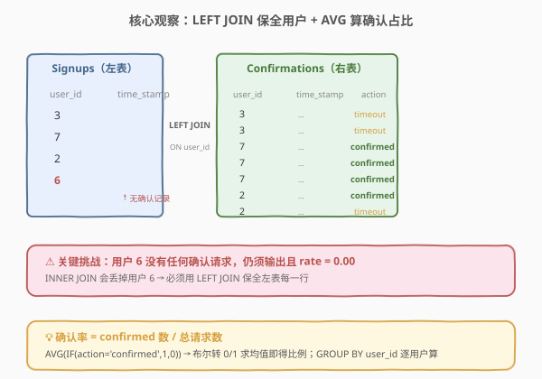
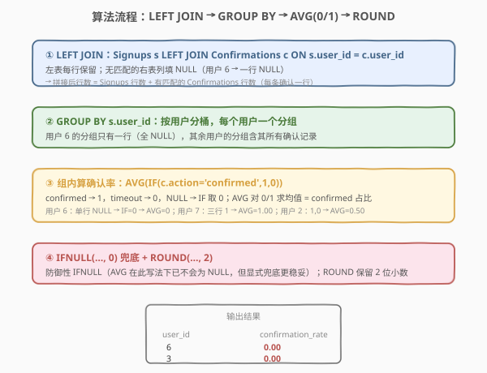
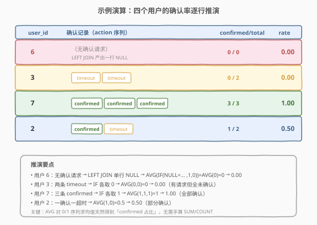

# 确认率

- **题目名称**：确认率
- **链接**：[1934. Confirmation Rate](https://leetcode.cn/problems/confirmation-rate/)
- **难度**：中等
- **标签**：SQL、LEFT JOIN、GROUP BY、AVG、IF/CASE、布尔转比例、IFNULL、ROUND、除零兜底

## 1. 题目概述

给定 `Signups`（用户注册记录）与 `Confirmations`（确认消息请求记录）两张表。每条确认消息的 `action` 为 `'confirmed'`（已确认）或 `'timeout'`（已过期）。用户的**确认率**定义为「`'confirmed'` 消息数 ÷ 请求的确认消息总数」；**没有任何确认请求**的用户确认率记为 `0`，结果**四舍五入到小数点后两位**。

编写 SQL 查询，**为每位用户**（即 `Signups` 表中的每个 `user_id`）计算确认率。结果以任意顺序返回。

**表结构**：

```text
表: Signups
+----------------+----------+
| Column Name    | Type     |
+----------------+----------+
| user_id        | int      |   ← 主键
| time_stamp     | datetime |
+----------------+----------+
user_id 是该表的主键。每行记录一位用户的注册时间。

表: Confirmations
+----------------+----------+
| Column Name    | Type     |
+----------------+----------+
| user_id        | int      |   ← 外键 -> Signups.user_id
| time_stamp     | datetime |   ← (user_id, time_stamp) 联合主键
| action         | ENUM     |   ← 取值 'confirmed' / 'timeout'
+----------------+----------+
(user_id, time_stamp) 是该表的主键。每行表示一位用户在某时刻请求了一条确认消息，结果为已确认或已过期。
```

> 💡 **审题关键**：① 结果要**为每位用户一行**——即以 `Signups` 的 `user_id` 为基准，哪怕该用户在 `Confirmations` 中一条记录都没有（如示例中的用户 6），也必须输出且确认率为 `0.00`；② 确认率是**分组比率**（逐用户算），不是总体比率，所以必须 `GROUP BY user_id`；③ 分子是 `action='confirmed'` 的行数，分母是该用户全部确认请求行数，**分母可能为 0**（无请求的用户），需兜底为 0。

**示例 1**：

```text
输入：
Signups 表:
+---------+---------------------+
| user_id | time_stamp          |
+---------+---------------------+
| 3       | 2020-03-21 10:16:13 |
| 7       | 2020-01-04 13:57:59 |
| 2       | 2020-07-29 23:09:44 |
| 6       | 2020-12-09 10:39:37 |
+---------+---------------------+
Confirmations 表:
+---------+---------------------+-----------+
| user_id | time_stamp          | action    |
+---------+---------------------+-----------+
| 3       | 2021-01-06 03:30:46 | timeout   |
| 3       | 2021-07-14 14:00:00 | timeout   |
| 7       | 2021-06-12 11:57:29 | confirmed |
| 7       | 2021-06-13 12:58:28 | confirmed |
| 7       | 2021-06-14 13:59:27 | confirmed |
| 2       | 2021-01-22 00:00:00 | confirmed |
| 2       | 2021-02-28 23:59:59 | timeout   |
+---------+---------------------+-----------+

输出:
+---------+-------------------+
| user_id | confirmation_rate |
+---------+-------------------+
| 6       | 0.00              |
| 3       | 0.00              |
| 7       | 1.00              |
| 2       | 0.50              |
+---------+-------------------+
```

**解释**：

| 用户 | 确认请求序列 | confirmed 数 | 总请求数 | 确认率 |
|------|--------------|--------------|----------|--------|
| 6 | 无 | 0 | 0 | 0.00（无请求记 0） |
| 3 | timeout, timeout | 0 | 2 | $0/2 = 0.00$ |
| 7 | confirmed ×3 | 3 | 3 | $3/3 = 1.00$ |
| 2 | confirmed, timeout | 1 | 2 | $1/2 = 0.50$ |

> 💡 本题是 SQL **「分组比率 + LEFT JOIN 保全空组」** 的经典母题。骨架与 [1174. 即时食物配送 II](../1101-1200/1174_即时食物配送II.md) 的 `AVG(布尔)` 同源，但多了一道坎：基准表 `Signups` 中的用户在右表 `Confirmations` 可能**完全缺失**，必须用 `LEFT JOIN` 保住这些「空分组」并让其比率落到 0。它是「逐组算占比」类题的入门基座，承接 [597. 好友申请 I：总体通过率](../0501-0600/597_好友申请I总体通过率.md) 的「总体比率」推广到「分组比率」。

---

## 2. 解题思路

### 2.1 暴力思路：逐用户过程式计算

最直觉的过程式思路：遍历 `Signups` 中每个用户，去 `Confirmations` 里捞该用户的所有请求行，数其中 `action='confirmed'` 的个数 `c` 与总行数 `t`，若 `t == 0` 则比率记 0，否则 `c / t` 保留两位小数。伪代码如下：

```text
result = []
for each user in Signups:
    rows = [r for r in Confirmations if r.user_id == user.user_id]
    t = len(rows)
    c = sum(1 for r in rows if r.action == 'confirmed')
    rate = round(c / t, 2) if t > 0 else 0.0
    result.append((user.user_id, rate))
return result
```

但**纯 SQL 没有显式逐行循环**——「为每位用户算一个比率」需换成集合式表达：① 用 `LEFT JOIN` 把两表按 `user_id` 拼接，保证 `Signups` 每个用户都保留；② `GROUP BY user_id` 分桶；③ 组内用聚合函数把「confirmed 行数 / 总行数」一次算出。

> ⚠️ 关键转换：把「逐用户捞行再计数」翻译成 `LEFT JOIN + GROUP BY`；把「confirmed 占比」翻译成 `AVG(IF(action='confirmed',1,0))`——MySQL 中布尔/条件可转 0/1，`AVG` 对 0/1 序列求均值即得占比；把「无请求记 0」交给 `LEFT JOIN` 产出的 `NULL` 行，配合 `IF` 把 `NULL` 当作非 confirmed（取 0），`AVG` 自然得 0。

### 2.2 核心观察：LEFT JOIN 保全用户 + AVG 算占比



**三道关卡**：

1. **保全用户（LEFT JOIN）**：题目要求「为每位用户计算」，基准是 `Signups`。若用 `INNER JOIN`，用户 6（无任何确认请求）会被丢弃，结果少一行。必须 `Signups LEFT JOIN Confirmations ON s.user_id = c.user_id`——左表每行保留，无匹配时右表列填 `NULL`。用户 6 经 `LEFT JOIN` 后得到**一行** `(6, NULL, NULL, NULL)`，确保它出现在分组结果中。

   $$\text{拼接结果} = \text{Signups} \bowtie_{\text{LEFT}} \text{Confirmations}$$

2. **分组算占比（GROUP BY + AVG）**：对拼接结果按 `s.user_id` 分组，每个用户的分组内含其所有确认请求行（用户 6 的分组只有那 1 行 `NULL`）。确认率 = 「confirmed 行数 / 总行数」。把 `action='confirmed'` 转成 1、其余转成 0，`AVG` 求均值即为占比：

   $$\text{confirmation\_rate}_u = \text{AVG}\Big(\mathbb{1}[\text{action} = \text{'confirmed'}]\Big) \;\Big|\; \text{user}=u$$

   - 用户 7：分组内 3 行全 `confirmed` → `AVG(1,1,1) = 1.00`
   - 用户 2：`AVG(1,0) = 0.50`
   - 用户 3：`AVG(0,0) = 0.00`

3. **空分组兜底（NULL → 0）**：用户 6 的分组只有 1 行，`c.action` 为 `NULL`。此时 `IF(NULL = 'confirmed', 1, 0)` 的第一个参数 `NULL = 'confirmed'` 在 SQL 中求值为 `NULL`（不是 `FALSE`），`IF(NULL, 1, 0)` 返回 `0`（`IF` 把 `NULL` 当作「非真」走 `ELSE` 分支）→ `AVG(0) = 0`。故用户 6 的确认率自然落到 `0.00`，无需额外 `IFNULL`。不过为防御性编程与可读性，外层常再加一道 `IFNULL(..., 0)`（详见 2.4 的写法选择）。

$$\boxed{\text{confirmation\_rate} = \text{ROUND}\big(\text{AVG}\big(\text{IF}(c.\text{action}=\text{'confirmed'},\,1,\,0)\big),\;2\big)}$$

> 💡 **为什么是 `AVG(IF(...))` 而不是 `SUM/COUNT`？** `AVG(x) = SUM(x) / COUNT(x 不为 NULL 的行数)`。当 `IF` 把每行映射成 1 或 0（均为非 `NULL`），`AVG` 的分母正是「该用户总请求数」、分子正是「confirmed 数」，恰好是我们要的占比——一行表达式同时表达了分子分母。对比 `SUM(IF(...,1,0)) / COUNT(*)` 需显式写分子分母，`AVG` 版更紧凑。两者数学等价。

> ⚠️ **最常见的错解**：用 `INNER JOIN` 而非 `LEFT JOIN`。这会丢掉所有「无确认请求」的用户（如用户 6），结果少行。判断口诀：**题目说「为每个 X 计算」且 X 来自左表 → 用 LEFT JOIN 保全左表**。另一类错解是忘记 `ROUND(..., 2)`，导致输出 `0.5` 而非 `0.50`，不满足「小数点后两位」的格式要求。

### 2.3 算法流程图



**逻辑执行步骤**：

| 步骤 | 子句 | 作用 |
|------|------|------|
| ① | `FROM Signups s LEFT JOIN Confirmations c ON s.user_id = c.user_id` | 左表每行保留；无匹配的右表列填 `NULL`（用户 6 → 一行全 `NULL`） |
| ② | `GROUP BY s.user_id` | 按用户分桶，每个用户一个分组 |
| ③ | `AVG(IF(c.action = 'confirmed', 1, 0))` | 组内 `confirmed`→1、`timeout`→0、`NULL`→0（走 `ELSE`）；`AVG` 对 0/1 求均值 = 确认占比 |
| ④ | `ROUND(..., 2) AS confirmation_rate` | 保留 2 位小数并命名输出列 |

> 💡 **逻辑执行顺序**：SQL 的逻辑求值顺序为 `FROM → JOIN → WHERE → GROUP BY → HAVING → SELECT → ORDER BY`。`LEFT JOIN` 在 `GROUP BY` 之前完成，故分组时每个用户的桶里已包含其所有确认行（外加用户 6 的 `NULL` 行）；`AVG` 与 `ROUND` 在 `SELECT` 阶段对每个分组求值。优化器通常对 `LEFT JOIN + GROUP BY` 走哈希连接 + 流式聚合，整体一趟扫描。

### 2.4 示例演算

以官方示例数据走一遍四名用户的推演：



| user_id | 确认记录序列 | IF 序列（confirmed→1，其余→0） | AVG | ROUND(..., 2) |
|---------|--------------|-------------------------------|-----|---------------|
| 6 | 无（LEFT JOIN 单行 `NULL`） | `IF(NULL='confirmed',1,0)` → 0 | `AVG(0) = 0` | **0.00** |
| 3 | timeout, timeout | 0, 0 | `AVG(0,0) = 0` | **0.00** |
| 7 | confirmed ×3 | 1, 1, 1 | `AVG(1,1,1) = 1` | **1.00** |
| 2 | confirmed, timeout | 1, 0 | `AVG(1,0) = 0.5` | **0.50** |

> 💡 **三个观察要点**：① 用户 6 是本题的灵魂测试——`LEFT JOIN` 让它以一行 `NULL` 进入分组，`IF` 把 `NULL` 当非 confirmed 取 0，`AVG(0)=0`，无需 `IFNULL` 也正确落到 0；② 用户 3 与用户 6 的率都是 `0.00`，但成因不同——前者**有请求但全 timeout**（分子 0 / 分母 2），后者**无请求**（分母为 0），`AVG(IF)` 写法把两者统一为「0 值序列的均值」，巧妙回避了「除以零」问题；③ 用户 7 的 3 条 `confirmed` 全在同一时刻？不——`time_stamp` 各不相同（联合主键要求 `(user_id, time_stamp)` 唯一），三条是三次独立请求。

> ⚠️ **为什么 `AVG(IF)` 版对「无请求」用户不用 `IFNULL` 也能得 0？** 因为 `LEFT JOIN` 对无匹配的左表行**产出一行**（右表列全 `NULL`），而非「零行」。于是用户 6 的分组非空（含 1 行），`AVG` 对这一行求值得 0。这与「无 `LEFT JOIN` 直接 `GROUP BY` 右表」不同——后者会让用户 6 根本不出现。`LEFT JOIN` 的「补 `NULL` 行」机制是把「分母为 0」转化为「分母为 1 且分子为 0」的关键。

---

## 3. 参考代码

### SQL（解法 A：LEFT JOIN + AVG(IF)，推荐）

```sql
SELECT s.user_id,
       ROUND(AVG(IF(c.action = 'confirmed', 1, 0)), 2) AS confirmation_rate
FROM Signups s
LEFT JOIN Confirmations c
    ON s.user_id = c.user_id
GROUP BY s.user_id;
```

> 💡 **写法要点**：
> - `LEFT JOIN` 保证 `Signups` 每个用户都出现——无确认请求的用户（如 6）得到一行 `NULL`，进入分组后 `AVG` 得 0。
> - `IF(c.action = 'confirmed', 1, 0)`：`confirmed`→1、`timeout`→0；对 `LEFT JOIN` 产出的 `NULL` 行，`NULL = 'confirmed'` 求值为 `NULL`，`IF(NULL, 1, 0)` 走 `ELSE` 取 0。三态归一为 0/1 数值。
> - `AVG` 对 0/1 序列求均值 = confirmed 占比，等价于 `SUM(1 的个数) / COUNT(总行数)`，一行同时表达分子分母。
> - `ROUND(..., 2)` 保留 2 位小数，满足「小数点后两位」的输出格式。
> - ⚠️ `IF` 是 MySQL 方言；跨数据库请用解法 B 的 `CASE WHEN`。本题平台为 MySQL，`IF` 最简洁。

### SQL（解法 B：SUM(CASE) / COUNT + IFNULL，跨数据库通用）

```sql
SELECT s.user_id,
       ROUND(
           IFNULL(
               SUM(CASE WHEN c.action = 'confirmed' THEN 1 ELSE 0 END) / COUNT(c.action),
               0
           ), 2
       ) AS confirmation_rate
FROM Signups s
LEFT JOIN Confirmations c
    ON s.user_id = c.user_id
GROUP BY s.user_id;
```

> 💡 **写法要点**：
> - 用 `CASE WHEN ... THEN 1 ELSE 0 END` 替代 `IF`，是 SQL 标准，PostgreSQL / SQL Server / Oracle 均可运行。
> - **分子**：`SUM(CASE WHEN c.action='confirmed' THEN 1 ELSE 0 END)`——对 `NULL` 行，`c.action` 为 `NULL`，`CASE` 走 `ELSE` 取 0，不影响求和。
> - **分母**：`COUNT(c.action)`——`COUNT(列)` 忽略 `NULL`，故对用户 6（单行 `NULL`）分母为 0，而非 1。这是与解法 A 的关键差异：解法 A 借 `LEFT JOIN` 的 `NULL` 行让 `AVG` 分母为 1；解法 B 显式用 `COUNT(列)` 排除 `NULL`，分母为 0。
> - **除零兜底**：分母为 0 时，MySQL 中 `x / 0` 返回 `NULL`（不报错），`IFNULL(NULL, 0)` 兜回 0 → `ROUND(0, 2) = 0.00`。⚠️ PostgreSQL / SQL Server 中 `x / 0` 会抛错，需改 `NULLIF(COUNT(c.action), 0)`（见 5.2 节）。
> - 语义最直白——「confirmed 数 ÷ 总请求数」，面试中首推此版说明思路，再提 MySQL 可用解法 A 的 `AVG(IF)` 简写。

### SQL（解法 C：CTE 分组预聚合 + LEFT JOIN，逻辑分层）

```sql
WITH UserRate AS (
    SELECT user_id,
           AVG(IF(action = 'confirmed', 1, 0)) AS rate
    FROM Confirmations
    GROUP BY user_id
)
SELECT s.user_id,
       ROUND(IFNULL(u.rate, 0), 2) AS confirmation_rate
FROM Signups s
LEFT JOIN UserRate u
    ON s.user_id = u.user_id;
```

> 💡 **写法要点**：
> - **CTE `UserRate`**：先在 `Confirmations` 上 `GROUP BY user_id` 算出「有请求用户」的确认率，结果只含出现在 `Confirmations` 的用户（用户 6 不在其中）。
> - **`Signups LEFT JOIN UserRate`**：以注册表为基准左连接预聚合结果；用户 6 无匹配 → `u.rate` 为 `NULL`。
> - **`IFNULL(u.rate, 0)`**：把无请求用户的 `NULL` 兜成 0，再 `ROUND(..., 2)`。
> - ✓ **逻辑分层最清晰**：「算有请求用户的率」与「保全无请求用户」分两步，互不干扰，适合复杂场景扩展。但代码量比解法 A 多，本题推荐解法 A。此写法的优势在于 CTE 只扫 `Confirmations` 一次，再与 `Signups` 做一次连接，避免了对 `Signups` 行做笛卡尔展开。

### Python（pandas）

```python
import pandas as pd

def confirmation_rate(signups: pd.DataFrame, confirmations: pd.DataFrame) -> pd.DataFrame:
    if confirmations.empty:
        confirmations = pd.DataFrame(columns=['user_id', 'action'])
    rate = (confirmations
            .assign(is_confirmed=(confirmations['action'] == 'confirmed').astype(int))
            .groupby('user_id', as_index=False)['is_confirmed']
            .mean())
    result = signups[['user_id']].merge(rate, on='user_id', how='left')
    result['is_confirmed'] = result['is_confirmed'].fillna(0).round(2)
    return result.rename(columns={'is_confirmed': 'confirmation_rate'})
```

> 💡 **pandas 对照**：
> - `.assign(is_confirmed=(action=='confirmed').astype(int))` 等价于 `IF(action='confirmed',1,0)`——布尔 Series 转 0/1 整数。
> - `.groupby('user_id')['is_confirmed'].mean()` 等价于 `AVG(IF(...))`——对 0/1 求均值即占比。
> - `signups.merge(rate, how='left')` 等价于 `Signups LEFT JOIN`——保全注册表所有用户。
> - `.fillna(0)` 等价于 `IFNULL(u.rate, 0)`——无请求用户的 `NaN` 兜成 0（pandas 中空分组的 `mean` 返回 `NaN` 而非 0，必须显式兜底，这与 SQL 的 `AVG(IF)` 不同，因为 pandas 不会像 `LEFT JOIN` 那样补 `NULL` 行）。
> - ⚠️ pandas 与 SQL 的关键差异：SQL 的 `LEFT JOIN` 对无匹配行**补一行 `NULL`**，使 `AVG(IF)` 分母为 1 得 0；pandas 的 `groupby` 不会补行，无请求的用户在 `rate` 中根本不存在，需靠 `merge(how='left')` 引入后再 `fillna(0)`。两种语言「保全空组」的机制不同，但思路同源。

---

## 4. 复杂度分析

| 维度 | 解法 A（AVG(IF)） | 解法 B（SUM/COUNT） | 解法 C（CTE + LEFT JOIN） |
|------|-------------------|---------------------|---------------------------|
| **时间** | $O(n + m)$ | $O(n + m)$ | $O(n + m)$ |
| **空间** | $O(u)$ | $O(u)$ | $O(u)$（CTE 物化） |
| **全表扫描** | JOIN 后一趟聚合 | JOIN 后一趟聚合 | CTE 扫 `Confirmations` + JOIN 扫 `Signups` |
| **代码量** | ★★★ 最简洁 | ★★ 中等 | ★ 最多 |
| **跨数据库** | ❌ 仅 MySQL（`IF`） | ✓ 标准（`CASE`） | ❌ 仅 MySQL（`IF`） |

> - $n$ = `Signups` 行数，$m$ = `Confirmations` 行数，$u$ = 不同用户数（$u \le n$）。
> - **时间复杂度**：`LEFT JOIN` 走哈希连接为 $O(n + m)$（对 `user_id` 建哈希表），随后 `GROUP BY` 流式聚合 $O(m)$（外加 $n$ 个 `Signups` 用户，含无匹配的 `NULL` 行）。总计 $O(n + m)$。若无索引且走嵌套循环连接则退化为 $O(n \cdot m)$，但优化器通常选哈希/归并连接。
> - **空间复杂度**：哈希连接的哈希表 + 分组聚合缓冲区，至多 $O(u)$（每个用户一个聚合状态）。
> - 三种解法的执行计划经优化器改写后通常等价；解法 C 的 CTE 物化可能多一份 $O(u)$ 中间结果，但 $u \le n$ 影响可忽略。

> ⚠️ SQL 复杂度取决于**执行计划与索引**：给 `Confirmations.user_id` 建索引可加速连接（嵌套循环时按索引查为 $O(\log m)$ 每行）。面试中说明「`LEFT JOIN` 走哈希连接 $O(n+m)$，`GROUP BY` 流式聚合 $O(m)$，给 `user_id` 建索引可优化」即可。本题数据量小，性能非瓶颈，重点是逻辑正确性（保全空用户 + 除零兜底）。

---

## 5. 扩展：AVG vs SUM/COUNT 的等价性与跨库除零

### 5.1 `AVG(IF(...))` 与 `SUM(IF(...)) / COUNT(*)` 的等价性

解法 A 的 `AVG(IF(c.action='confirmed',1,0))` 与 `SUM(IF(c.action='confirmed',1,0)) / COUNT(*)` 在**有匹配行**时数学等价：

$$\text{AVG}(x) = \frac{\text{SUM}(x)}{\text{COUNT}(x \ne \text{NULL})}$$

`IF` 永远返回 1 或 0（非 `NULL`），故 `COUNT(x ≠ NULL) = COUNT(*)`，两者完全相等。优化器也会把 `AVG` 改写为 `SUM/COUNT` 走同一套聚合逻辑。

**但对 `LEFT JOIN` 的 `NULL` 行，两者分母不同**：

| 用户 | 分组内行数 | `COUNT(*)`（含 `NULL` 行） | `COUNT(c.action)`（忽略 `NULL`） |
|------|-----------|----------------------------|----------------------------------|
| 6（无请求） | 1（`NULL` 行） | 1 | **0** |
| 7（3 条 confirmed） | 3 | 3 | 3 |

- 解法 A 用 `AVG(IF)`：分母 = `COUNT(*)` = 1（含 `NULL` 行），分子 `IF` 取 0 → `0/1 = 0`。
- 解法 B 用 `SUM / COUNT(c.action)`：分母 = `COUNT(c.action)` = 0（忽略 `NULL`）→ `0/0 = NULL` → `IFNULL` 兜 0。

两者最终都得 `0.00`，但**路径不同**：解法 A 借 `LEFT JOIN` 的 `NULL` 行让分母为 1；解法 B 显式排除 `NULL` 让分母为 0 再兜底。这是「分组比率 + 空组」问题中两种等价但思路不同的处理范式，面试中能说出此区别为佳。

> 💡 **若把解法 A 的 `AVG` 换成 `SUM(IF)/COUNT(*)`**：`SUM(IF(...)) / COUNT(*)` 对用户 6 得 `0 / 1 = 0`，与 `AVG(IF)` 完全一致——因为 `COUNT(*)` 数 `NULL` 行。这也是为何解法 A 不需要 `IFNULL`：分母永不为 0（`LEFT JOIN` 至少补 1 行）。

### 5.2 除以零：MySQL vs PostgreSQL vs SQL Server

解法 B 在用户 6 处触发 `x / 0`，不同数据库行为不同：

| 数据库 | `x / 0` 行为 | 兜底写法 |
|--------|--------------|----------|
| **MySQL** | 返回 `NULL`（不报错） | `IFNULL(x / cnt, 0)` 或 `COALESCE(x / cnt, 0)` |
| **PostgreSQL** | 抛 `division by zero` 错误 | `x / NULLIF(cnt, 0)` → `NULL` → 再 `COALESCE(..., 0)` |
| **SQL Server** | 抛 `Divide by zero error` 错误 | 同 PostgreSQL，`x / NULLIF(cnt, 0)` + `COALESCE(..., 0)` |

```sql
-- 跨库通用写法（PostgreSQL / SQL Server / MySQL 均可）
SELECT s.user_id,
       ROUND(COALESCE(
           SUM(CASE WHEN c.action = 'confirmed' THEN 1 ELSE 0 END) / NULLIF(COUNT(c.action), 0),
           0
       ), 2) AS confirmation_rate
FROM Signups s
LEFT JOIN Confirmations c ON s.user_id = c.user_id
GROUP BY s.user_id;
```

> 💡 **`NULLIF(x, 0)` 的妙用**：`NULLIF(a, b)` 在 `a = b` 时返回 `NULL`，否则返回 `a`。`NULLIF(COUNT(c.action), 0)` 把「分母 = 0」转成 `NULL`，于是 `x / NULL = NULL`（任何数除 `NULL` 得 `NULL`），再用 `COALESCE(..., 0)` 兜回 0。这套写法**跨库通用**——MySQL 中 `x / 0` 本就返回 `NULL`，加 `NULLIF` 多余但无害；PostgreSQL/SQL Server 中 `NULLIF` 是必须的（否则直接抛错）。面试中若不确定目标数据库，用 `NULLIF + COALESCE` 最稳妥。本题平台是 MySQL，解法 B 的 `IFNULL` 足矣。

### 5.3 从「分组比率」到「总体比率」

本题是「**分组比率**」——按 `user_id` 分组，每组算一个比率，结果多行（每用户一行）。SQL 比率题还有「**总体比率**」变体：不分组，对全表算一个比率，结果 1 行 1 列。典型如 [597. 好友申请 I：总体通过率](../0501-0600/597_好友申请I总体通过率.md)（全表 confirmed/sent 比）。两者的骨架对比：

| 维度 | 总体比率（597） | 分组比率（1934） |
|------|----------------|------------------|
| 分组 | 无 `GROUP BY`，整表一组 | `GROUP BY user_id`，每用户一组 |
| 结果行数 | 1 行 | $n$ 行（$n$ = 用户数） |
| 保全空组 | 不适用 | `LEFT JOIN` 保无请求用户 |
| 聚合 | `SELECT 标量子查询 / 标量子查询` | `AVG(IF(...))` 或 `SUM/COUNT` |

1934 是 597 的「分组版」升级——多了 `GROUP BY` 与 `LEFT JOIN` 保全空组两道坎。掌握 1934 后，可推广到任意「逐组算占比」场景，如 [1303. 求团队人数](https://leetcode.cn/problems/find-the-team-size/)、[1070. 产品销售分析 III](https://leetcode.cn/problems/product-sales-analysis-iii/)。

---

## 6. 面试要点

**Q1：为什么用 `LEFT JOIN` 而不是 `INNER JOIN`？**

> 题目要求「为每位用户计算确认率」，基准是 `Signups` 表。`INNER JOIN` 只保留两表都有匹配的 `user_id`，会丢掉所有「在 `Signups` 注册但从未请求确认」的用户（如示例中的用户 6），结果少行。`LEFT JOIN` 保留左表（`Signups`）每行，无匹配时右表列填 `NULL`，确保每个注册用户都出现在结果中。判断口诀：**题目说「为每个 X 计算」且 X 来自左表 → 用 `LEFT JOIN` 保全左表**。

**Q2：用户 6 没有任何确认请求，解法 A 为什么不用 `IFNULL` 也能得 0？**

> `LEFT JOIN` 对无匹配的左表行**产出一行**（右表列全 `NULL`），而非「零行」。所以用户 6 的分组非空——含 1 行 `(6, NULL, NULL, NULL)`。`IF(NULL = 'confirmed', 1, 0)` 中 `NULL = 'confirmed'` 求值为 `NULL`（三值逻辑），`IF` 把 `NULL` 当「非真」走 `ELSE` 取 0，`AVG(0) = 0`。分母是 `COUNT(*)` = 1（含 `NULL` 行），故不触发除零。这与「直接 `GROUP BY` 右表」不同——后者用户 6 根本不出现。`LEFT JOIN` 的「补 `NULL` 行」机制把「分母为 0」转化为「分母为 1 且分子为 0」，巧妙回避除零。

**Q3：解法 A 的 `AVG(IF)` 与解法 B 的 `SUM/COUNT` 有何区别？**

> 在有匹配行的用户上两者数学等价：`AVG(x) = SUM(x)/COUNT(x≠NULL)`，`IF` 永返非 `NULL` 的 0/1，故 `COUNT(x≠NULL) = COUNT(*)`。但对用户 6（`LEFT JOIN` 的 `NULL` 行），分母不同：解法 A 用 `AVG`（分母 `COUNT(*)` = 1，含 `NULL` 行）得 `0/1 = 0`；解法 B 用 `COUNT(c.action)`（忽略 `NULL`，分母 = 0）触发 `x/0` → `NULL` → `IFNULL` 兜 0。两者最终都得 `0.00`，但路径不同——解法 A 借 `LEFT JOIN` 的 `NULL` 行让分母为 1；解法 B 显式排除 `NULL` 让分母为 0 再兜底。解法 A 更简洁（MySQL），解法 B 更直白且跨库（`CASE WHEN`）。

**Q4：`IF` 和 `CASE WHEN` 该用哪个？**

> `IF(cond, a, b)` 是 MySQL 方言，简洁但不可移植；`CASE WHEN cond THEN a ELSE b END` 是 SQL 标准，PostgreSQL / SQL Server / Oracle 均支持。LeetCode 平台是 MySQL，两种写法都能 AC。面试中推荐先写 `CASE WHEN`（通用、语义清晰），再提「MySQL 中可用 `IF` 简写」作为优化。生产环境跨库迁移时务必用 `CASE WHEN`。本题解法 A 用 `IF` 展示最简形态，解法 B 用 `CASE WHEN` 展示通用形态，两者对照。

**Q5：如果用 PostgreSQL，解法 B 会出什么问题？怎么改？**

> PostgreSQL 中 `x / 0` 会直接抛 `division by zero` 错误（不像 MySQL 返回 `NULL`）。用户 6 的 `COUNT(c.action) = 0`，`SUM / 0` 会抛错。改法：用 `NULLIF(COUNT(c.action), 0)` 把分母 0 转 `NULL`，于是 `x / NULL = NULL`，再 `COALESCE(..., 0)` 兜回 0。完整跨库写法见 5.2 节。这是 SQL 比率题的通用考点——「分母可能为 0」时，MySQL 靠 `IFNULL`，跨库靠 `NULLIF + COALESCE`。解法 A 的 `AVG(IF)` 因分母永不为 0（`LEFT JOIN` 补行）则无此问题，这也是 `AVG` 版的另一优势。

> 💡 **一句话总结**：1934 是 SQL **「分组比率 + LEFT JOIN 保全空组」** 的母题——`Signups LEFT JOIN Confirmations` 保住无请求用户，`GROUP BY user_id` 分桶，`AVG(IF(action='confirmed',1,0))` 把确认状态转 0/1 求均值即得占比，`ROUND(..., 2)` 收尾。考点在「LEFT JOIN 保全用户」「AVG 借 NULL 行回避除零」「IF vs CASE 的方言取舍」三连，是所有「逐组算占比」题的入门基座。

---

## 7. 同类练习题

- [597. 好友申请 I：总体通过率](https://leetcode.cn/problems/friend-requests-i-overall-acceptance-rate/)（[站内题解](../0501-0600/597_好友申请I总体通过率.md)）：SQL 比率题的「总体版」母题——两表独立计数取比 + 除零兜底。1934 是其「分组版」升级，多了 `GROUP BY` 与 `LEFT JOIN` 保全空组
- [1174. 即时食物配送 II](https://leetcode.cn/problems/immediate-food-delivery-ii/)（[站内题解](../1101-1200/1174_即时食物配送II.md)）：`AVG(布尔) × 100` 算即时订单比例的「首次订单」版。与 1934 同用 `AVG(0/1)` 套路，但 1174 是总体比例（单行结果），1934 是分组比例（多行结果）
- [580. 统计各专业学生人数](https://leetcode.cn/problems/count-student-number-in-departments/)（[站内题解](../0501-0600/580_统计各专业学生人数.md)）：`LEFT JOIN + COUNT(右表列)` 保全空组的分组计数母题。与 1934 的 `LEFT JOIN` 保全空用户同源，对比「分组计数保空组」（580）与「分组比率保空组」（1934）
- [1303. 求团队人数](https://leetcode.cn/problems/find-the-team-size/)：`LEFT JOIN` 自连接 + 分组统计的分组计数变体，结合 580 的 `LEFT JOIN` 与 1934 的分组思路
- [1070. 产品销售分析 III](https://leetcode.cn/problems/product-sales-analysis-iii/)：每产品最低价年份的「分组 Top-1」题。与 1934 同为「逐组算指标」家族，对比「分组取最值」（1070）与「分组算占比」（1934）
