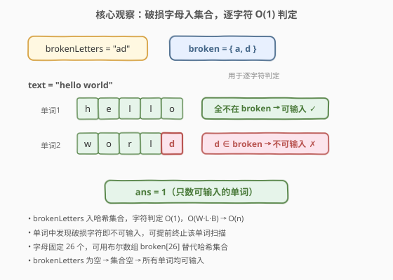
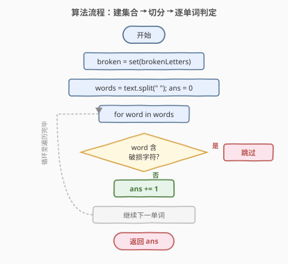
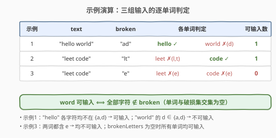

# LeetCode 可以输入的最大单词数 题解

## 1. 题目概述

- **标题 / 题号**：可以输入的最大单词数（#1935，easy）
- **链接**：https://leetcode.cn/problems/maximum-number-of-words-you-can-type/
- **难度**：简单
- **标签**：哈希表、字符串、模拟

**题意**：键盘有些字母键失灵，其余键正常。给定由**单个空格**分隔的字符串 `text`（不含前导/尾随空格），以及由**互不相同**小写字母组成的 `brokenLetters`，返回 `text` 中能**完全输入**的单词数目——即不包含任何破损字母的单词个数。

**示例 1**：

```text
输入：text = "hello world", brokenLetters = "ad"
输出：1
解释："world" 含破损字母 'd'，无法输入；"hello" 可输入。
```

**示例 2**：

```text
输入：text = "leet code", brokenLetters = "lt"
输出：1
解释："leet" 含 'l'、't'，无法输入；"code" 可输入。
```

**示例 3**：

```text
输入：text = "leet code", brokenLetters = "e"
输出：0
解释：两个单词都含 'e'，均无法输入。
```

**约束**：

- $1 \le \text{text.length} \le 10^4$
- $0 \le \text{brokenLetters.length} \le 26$
- `text` 由若干用单个空格分隔的单词组成，不含前导/尾随空格
- 每个单词仅由小写英文字母组成
- `brokenLetters` 由**互不相同**的小写英文字母组成

> 💡 **审题关键**：①「完全输入」= 单词中**每个字符都不破损**，即单词字符集合与 `brokenLetters` **交集为空**；② `brokenLetters` 字母**互不相同**，天然适合做集合键；③ `text` 单词间是**单个空格**，可直接 `split`。

## 2. 解题思路

### 2.1 暴力思路：逐字符线性查找

最直觉的做法：把 `text` 按空格切成单词，对每个单词的每个字符，**线性扫描** `brokenLetters` 判断是否破损。

```text
for word in text.split(" "):
    ok = True
    for c in word:
        for b in brokenLetters:
            if c == b: ok = False
    if ok: ans += 1
```

- **正确性**：穷举每个字符是否破损，无误。
- **效率**：设单词数为 $W$、平均词长 $L$、破损字母数 $B$，则 $O(W \cdot L \cdot B)$。`text` 长度上限 $10^4$、$B \le 26$，最坏约 $2.6 \times 10^5$ 次比较，虽能 AC，但每次都线性扫 `brokenLetters` 是冗余的——同一个字母是否破损，本应 $O(1)$ 查表。

> ⚠️ 浪费在于「重复线性查找同一个破损表」。`brokenLetters` 集合在整次输入中**固定不变**，应预先建索引（哈希集合 / 布尔数组），把每次判定的 $B$ 次比较降为 $1$ 次。

### 2.2 核心观察：破损字母入哈希集合，O(1) 判定



关键洞察：`brokenLetters` 在整个判定过程中**不变**，应一次性装入哈希集合（或长度 26 的布尔数组）。此后「字符 $c$ 是否破损」退化为集合成员判定，$O(1)$ 完成。

$$\text{broken} = \text{set}(\text{brokenLetters}),\quad \text{word 可输入} \iff \forall\, c \in \text{word}:\ c \notin \text{broken}$$

逐单词扫描其字符：一旦发现某个字符 $\in \text{broken}$，该单词即不可输入，**立即终止该单词的扫描**（提前终止）；若扫完整个单词都未命中，则 $ans\!{+}\!+$。

> 💡 **两种等价建表方式**：① 哈希集合 `set(brokenLetters)`，通用、可读性好；② 长度 26 的布尔数组 `broken[26]`（或 26 位位掩码），因字母固定 26 个，下标 $c - \text{'a'}$ 直接寻址，比哈希更快（无哈希计算与冲突处理）。本题 $B \le 26$，两者差异微小，工程中任选。

### 2.3 算法流程图



整体为一次遍历：

1. **建表**：`broken = set(brokenLetters)`。
2. **切分**：`words = text.split(" ")`。
3. **计数**：`ans = 0`；对每个 `word`，检查是否含 `broken` 字符；不含则 `ans += 1`。
4. **返回** `ans`。

> 💡 **提前终止**体现在单词内部：发现破损字符即判定该单词不可输入，不再扫描剩余字符。最坏情况（无破损字符）才扫完整词。

### 2.4 示例演算

以题目给出的三组示例逐个验证（详见下图）：



| 示例 | `broken` 集合 | 单词 | 破损字符命中 | 可输入 | $ans$ |
|------|--------------|------|-------------|--------|-------|
| 1 | `{a, d}` | hello | 无 | ✓ | 1 |
| 1 | | world | d | ✗ | |
| 2 | `{l, t}` | leet | l, t | ✗ | 1 |
| 2 | | code | 无 | ✓ | |
| 3 | `{e}` | leet | e | ✗ | 0 |
| 3 | | code | e | ✗ | |

- **示例 1**：`broken = {a, d}`。"hello" 各字符均不在集合 → 可输入；"world" 的 'd' $\in$ broken → 不可输入。$ans = 1$ ✓
- **示例 2**：`broken = {l, t}`。"leet" 的 'l' $\in$ broken → 不可输入（发现 'l' 即终止）；"code" 全不在 → 可输入。$ans = 1$ ✓
- **示例 3**：`broken = {e}`。两词都含 'e' → 均不可输入。$ans = 0$ ✓

> 💡 **观察要点**：① 一个单词含多个破损字母仍只算「1 个不可输入」，故「命中即跳过」不影响计数正确性；② `brokenLetters` 为空时集合为空，`c in broken` 恒为假，所有单词均可输入，无需特判。

## 3. 参考代码

### C++（哈希集合）

```cpp
class Solution {
public:
    int canBeTypedWords(string text, string brokenLetters) {
        unordered_set<char> broken(brokenLetters.begin(), brokenLetters.end());
        int ans = 0;
        istringstream iss(text);
        string word;
        while (iss >> word) {
            bool ok = true;
            for (char c : word) {
                if (broken.count(c)) { ok = false; break; }
            }
            if (ok) ++ans;
        }
        return ans;
    }
};
```

### C++（布尔数组，更轻量）

```cpp
class Solution {
public:
    int canBeTypedWords(string text, string brokenLetters) {
        bool broken[26] = {false};
        for (char c : brokenLetters) broken[c - 'a'] = true;
        int ans = 0;
        istringstream iss(text);
        string word;
        while (iss >> word) {
            bool ok = true;
            for (char c : word) {
                if (broken[c - 'a']) { ok = false; break; }
            }
            if (ok) ++ans;
        }
        return ans;
    }
};
```

### Python（哈希集合 + `any` 提前终止）

```python
class Solution:
    def canBeTypedWords(self, text: str, brokenLetters: str) -> int:
        broken = set(brokenLetters)
        ans = 0
        for word in text.split():
            if not any(c in broken for c in word):
                ans += 1
        return ans
```

### Python（一行流，对照用）

```python
class Solution:
    def canBeTypedWords(self, text: str, brokenLetters: str) -> int:
        broken = set(brokenLetters)
        return sum(not any(c in broken for c in w) for w in text.split())
```

> 💡 **写法对照**：① 哈希集合版通用直观，面试默认先写；② 布尔数组版因字母固定 26 个，下标直接寻址无哈希开销，常数更小；③ Python `any()` 自带短路：发现破损字符即返回 `True`，天然实现单词内提前终止；④ 一行流用 `not any(...)` 表达「全不在集合」，紧凑但可读性略降。

## 4. 复杂度分析

| 维度 | 复杂度 | 说明 |
|------|--------|------|
| 时间复杂度 | $O(n + B)$ | $n = \text{text.length}$，遍历每个字符一次；$B = \text{brokenLetters.length}$ 建表一次；单词内提前终止只降常数 |
| 空间复杂度 | $O(B) = O(1)$ | `broken` 集合最多 26 个字母，常数空间 |

> 💡 $n \le 10^4$，$O(n)$ 轻松 AC。本题精髓不在复杂度而在「把重复的线性查找固化为一次建表 + $O(1)$ 查询」——这是哈希表最经典的应用场景：**不变的小集合 + 高频成员查询**。

## 5. 扩展：位掩码表示破损字母

破损字母仅 26 个小写字母，可用一个 32 位整数的 26 个比特位表示（与 [1832. 判断句子是否为全字母句](https://leetcode.cn/problems/check-if-the-sentence-is-pangram/) 的位掩码同源）：

$$\text{mask}_{\text{broken}} = \bigcup_{c \in \text{brokenLetters}} 1 \ll (c - \text{'a'})$$

判定字符 $c$ 破损：`mask_broken & (1 << (c - 'a'))` 非零则破损。判定单词可输入：单词所有字符对应位与 `mask_broken` 按位与后为 0，即 `word_mask & mask_broken == 0`。

```cpp
class Solution {
public:
    int canBeTypedWords(string text, string brokenLetters) {
        int broken = 0;
        for (char c : brokenLetters) broken |= 1 << (c - 'a');
        int ans = 0;
        istringstream iss(text);
        string word;
        while (iss >> word) {
            int wm = 0;
            for (char c : word) wm |= 1 << (c - 'a');
            if ((wm & broken) == 0) ++ans;   // 单词字母与破损字母无交集
        }
        return ans;
    }
};
```

> 💡 位掩码把「逐字符查询」改为「单词整体按位与」，判定 `wm & broken == 0` 一次完成「全不在集合」。代价是仍需扫完整个单词构建 `word_mask`（无法单词内提前终止），故对「破损字符靠前」的单词反不如哈希集合 + `break` 快。两种思路对照：哈希集合重「查询快 + 可提前终止」，位掩码重「整体并行判定」。

## 6. 面试要点

**Q1：为什么先建集合再判定，而不是每次线性扫 `brokenLetters`？**

> `brokenLetters` 在整个判定中不变，是「不变的小集合 + 高频成员查询」的典型场景。预先装入哈希集合（或布尔数组），把每次 $O(B)$ 的线性查找固化为 $O(1)$ 查询。总复杂度从 $O(W \cdot L \cdot B)$ 降到 $O(n + B)$。

**Q2：哈希集合与布尔数组在本题中如何取舍？**

> 字母表固定 26 个小写字母，布尔数组 `broken[26]` 用 $c - \text{'a'}$ 直接寻址，无哈希计算与冲突处理，常数最小。哈希集合 `set` 通用性好、代码简洁。本题 $B \le 26$ 两者差异微小；若字符集扩大（如 Unicode），布尔数组不可行，须用哈希集合。

**Q3：单词内的提前终止如何实现？收益何在？**

> 扫描单词字符时一旦发现破损字符，该单词即不可输入，立即 `break` 跳到下一单词。Python 用 `any(c in broken for c in word)` 天然短路。收益：破损字符越靠前、单词越长，省下的字符比较越多；最坏情况（无破损字符）仍需扫完整词。

**Q4：`brokenLetters` 为空时结果是什么？需要特判吗？**

> `brokenLetters` 为空 → `broken` 集合为空 → 任何字符都不破损 → 所有单词均可输入，返回单词数。无需特判，通用逻辑自然处理（空集合的 `count`/`in` 恒为假）。

**Q5：若 `text` 含前导/尾随空格或多个连续空格，原逻辑还成立吗？**

> 题目保证单词间单个空格、无前导尾随空格，故 `text.split()` 或 `istringstream >>` 均安全。若放宽为任意空格，`text.split()`（无参）会自动合并连续空白并去除首尾，仍正确；但 `text.split(" ")`（指定单空格）会产生空串，需额外过滤。

> 💡 **一句话总结**：破损字母建集合 → 逐单词逐字符 $O(1)$ 查表 → 命中即跳过、全无则计数；「不变小集合 + 高频查询」是哈希表的招牌场景。

## 同类练习题

| # | 题目 | 与本题的关联 |
|---|------|-------------|
| 1684 | [统计一致字符串的数目](https://leetcode.cn/problems/count-the-number-of-consistent-strings/)（[题解](../1601-1700/1684_统计一致字符串的数目.md)） | 给定 `allowed` 字符集统计「仅由允许字符组成」的字符串数，是本题的镜像——本题数「不含禁用字符」，1684 数「只含允许字符」，同为集合成员判定 |
| 1832 | [判断句子是否为全字母句](https://leetcode.cn/problems/check-if-the-sentence-is-pangram/)（[题解](../1801-1900/1832_判断句子是否为全字母句.md)） | 用位掩码 / 哈希集合判定 26 字母是否全出现，与本题「破损字母建集合」同属字符级集合判定家族 |
| 1160 | [拼写单词](https://leetcode.cn/problems/find-words-that-can-be-formed-by-characters/)（[题解](../1101-1200/1160_拼写单词.md)） | 给定字符集判断单词能否拼出，是本题「字符存在性判定」升级为「字符频率计数」的版本 |
| 500 | [键盘行](https://leetcode.cn/problems/keyboard-row/)（[题解](../0401-0500/500_键盘行.md)） | 判断单词能否用键盘单行打出，同为「字符是否属于某集合」的判定，三行各自建集合 |
| 1941 | [检查是否每个字符出现次数相同](https://leetcode.cn/problems/check-if-all-characters-have-equal-number-of-occurrences/) | 字符频率统计 + 均匀性判定，从「是否出现」升级到「出现几次」，对照本题的集合存在性判定 |
