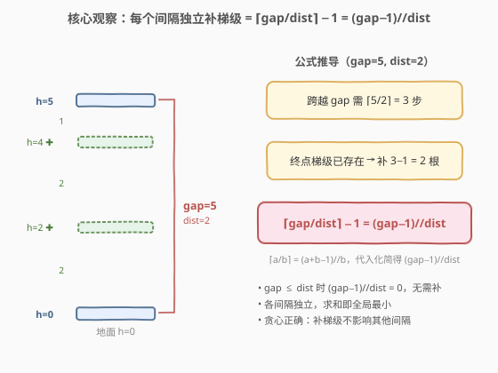
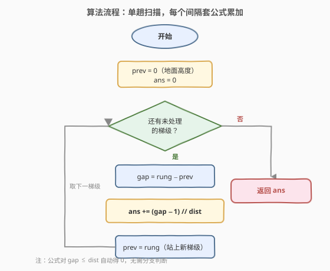

# LeetCode 新增的最少台阶数 题解

## 1. 题目概述

- **标题 / 题号**：新增的最少台阶数（#1936，medium）
- **链接**：https://leetcode.cn/problems/add-minimum-number-of-rungs/
- **难度**：中等
- **标签**：贪心、数组、数学

**题意**：给你一个**严格递增**的整数数组 `rungs`，表示梯子上每个台阶的高度。你当前站在高度为 $0$ 的地板上，要爬到最后一个台阶。另给整数 `dist`：每次移动只能到达距当前位置不超过 `dist` 高度的下一个台阶。你可以在任意**正整数**高度处插入新台阶。返回必须添加的**最少**台阶数。

**示例 1**：

```text
输入：rungs = [1,3,5,10], dist = 2
输出：2
解释：在高度 7 和 8 处增设新台阶，梯子变为 [1,3,5,7,8,10]。
      0→1(1)→3(2)→5(2)→7(2)→8(1)→10(2)，每步 ≤ 2。
```

**示例 2**：

```text
输入：rungs = [3,6,8,10], dist = 3
输出：0
解释：每段间隔 ≤ 3，无需增设台阶。
```

**示例 3**：

```text
输入：rungs = [3,4,6,7], dist = 2
输出：1
解释：0→3 间隔 3 > 2，在高度 1 处增设台阶：0→1(1)→3(2)→4(1)→6(2)→7(1)。
```

**示例 4**：

```text
输入：rungs = [5], dist = 10
输出：0
```

**约束**：

- $1 \le \text{rungs.length} \le 10^5$
- $1 \le \text{rungs}[i] \le 10^9$
- $1 \le \text{dist} \le 10^9$
- `rungs` 严格递增

> 💡 **审题关键**：①「严格递增」保证相邻台阶间隔 $> 0$，且每个间隔独立可解；②起点是地板高度 $0$（不是 `rungs[0]`），第一个间隔是 $\text{rungs}[0] - 0$；③只在**正整数**高度插台阶，但题目保证原台阶高度均为正整数、`dist` 为正整数，故补的台阶位置天然落在正整数高度，无需额外处理。

## 2. 解题思路

### 2.1 暴力思路：逐级模拟填补

最直观的做法：从地板（高度 $0$）出发，面对下一个目标台阶，若当前高度 $+\ \text{dist}$ 还够不到目标，就在「当前高度 $+\ \text{dist}$」处补一根台阶、站上去，重复直到能直接到达目标；然后转向下一个目标台阶。

```text
cur = 0
对每个目标台阶 r：
    while cur + dist < r:      # 还够不到
        cur += dist            # 在 cur+dist 处补台阶并站上去
        ans += 1
    cur = r                    # 跳上已有台阶
```

- **正确性**：每次尽量往上跳满 `dist`，贪心铺满间隔，显然是最少补法。
- **效率**：最坏情况单个间隔 $\text{gap} = 10^9$、$\text{dist}=1$ 时 `while` 要循环 $10^9$ 次，总时间 $O(\sum \text{gap}/\text{dist})$，**严重超时**。

> ⚠️ 瓶颈在于「一个间隔要补多少根」其实是个**纯数学问题**——间隔固定、步长固定，补的根数可直接算出，根本不用一步步模拟。这就是 2.2 的优化方向。

### 2.2 核心观察：每个间隔独立，补的根数 = ⌈gap/dist⌉ − 1



关键洞察有两条：

**① 间隔之间相互独立。** 站在每个已有台阶上时，下方已经铺好，只需考虑「当前台阶到下一个台阶」这一段间隔。在某段间隔内补的台阶**不影响**其他间隔（因为下一段从下一个已有台阶重新起跳）。因此全局最少 = 各间隔最少的求和。

**② 单个间隔补的根数有闭式解。** 设间隔 $\text{gap} = r - \text{prev}$，每次最多跨 `dist`。跨越整个间隔需要的**步数**为 $\lceil \text{gap}/\text{dist} \rceil$（向上取整，因为最后一步即使不足 `dist` 也算一步）。但**终点台阶已存在**，无需补，所以要补的根数 = 步数 $-\ 1$：

$$\text{add} = \left\lceil \frac{\text{gap}}{\text{dist}} \right\rceil - 1$$

用整数除法等价改写（经典向上取整恒等式 $\lceil a/b \rceil = (a+b-1)//b$）：

$$\left\lceil \frac{\text{gap}}{\text{dist}} \right\rceil - 1 = \frac{\text{gap} + \text{dist} - 1}{\text{dist}} - 1 = \frac{\text{gap} - 1}{\text{dist}} \;\;\text{(整除)}$$

于是得到一行公式：

$$\boxed{\text{add} = (\text{gap} - 1) // \text{dist}}$$

> 💡 **边界自检**：当 $\text{gap} \le \text{dist}$ 时，$\text{gap}-1 < \text{dist}$，整除结果为 $0$——即「一步就能到，无需补台阶」，公式自动给出 $0$，**无需特判**。这正是 $(\text{gap}-1)//\text{dist}$ 比 $\text{gap}//\text{dist}$ 更优雅的原因：后者在 $\text{gap}=\text{dist}$ 时会错误地给出 $1$。

### 2.3 算法流程图



流程极简：单趟遍历 `rungs`，维护 `prev`（初始为 $0$，即地板高度），对每个台阶计算间隔 $\text{gap} = r - \text{prev}$，套公式累加，再更新 `prev = r`。

### 2.4 示例演算

以示例 1（`rungs = [1,3,5,10]`，`dist = 2`）逐间隔套公式：

![示例演算：rungs=[1,3,5,10]，dist=2](../images/1936_example_walkthrough.svg)

| 步骤 | prev | rung | gap | (gap−1)//2 | ans |
|------|------|------|-----|-----------|-----|
| 1 | 0 | 1 | 1 | 0 | 0 |
| 2 | 1 | 3 | 2 | 0 | 0 |
| 3 | 3 | 5 | 2 | 0 | 0 |
| 4 | 5 | 10 | 5 | 2 | **2** |

前三个间隔 $\le 2$ 自动得 $0$；只有 $5 \to 10$ 的 $\text{gap}=5$ 需补 $(5-1)//2 = 2$ 根（在高度 $7$、$8$ 处）。最终 `ans = 2` ✓。

> 💡 **观察要点**：公式对 $\text{gap} \le \text{dist}$ 自动归零，代码里**没有 if 分支**——这正是闭式解相对于暴力 `while` 模拟的最大价值：把 $O(\text{gap}/\text{dist})$ 的循环压成 $O(1)$ 一次除法。

## 3. 参考代码

### C++

```cpp
class Solution {
public:
    int addRungs(vector<int>& rungs, int dist) {
        long long ans = 0;
        int prev = 0;
        for (int r : rungs) {
            ans += (r - prev - 1) / dist;
            prev = r;
        }
        return ans;
    }
};
```

### Python

```python
class Solution:
    def addRungs(self, rungs: List[int], dist: int) -> int:
        ans = 0
        prev = 0
        for r in rungs:
            ans += (r - prev - 1) // dist
            prev = r
        return ans
```

> 💡 **写法要点**：① `prev` 初始化为 $0$（地板高度），不是 `rungs[0]`——第一个间隔是 $\text{rungs}[0] - 0$；② 用 `r - prev - 1` 直接表达 $\text{gap}-1$，因为 `rungs` 严格递增且 $\text{rungs}[i] \ge 1$，故 $r - \text{prev} \ge 1$，$r-\text{prev}-1 \ge 0$，不会出现负数整除的歧义；③ `ans` 用 `long long`：虽然总和 $\le 10^9$（不超过末阶高度）在 `int` 范围内，但 `rungs[i]`、`dist` 均可达 $10^9$，用 `long long` 累加更稳妥，避免面试时被追问边界。

> ⚠️ **Python 无溢出问题**：Python 整数任意精度，`(r - prev - 1) // dist` 对 $10^9$ 级别完全无虞。C++ 中 `(r - prev - 1)` 也在 `int` 范围内（$\le 10^9 - 1 < 2^{31}-1$），但累加和用 `long long` 是防御性写法。

## 4. 复杂度分析

| 维度 | 暴力模拟 | 公式法 | 说明 |
|------|---------|--------|------|
| 时间复杂度 | $O(\sum \text{gap}/\text{dist})$ | $O(n)$ | 暴力最坏 $10^9$ 次循环超时；公式法每个间隔 $O(1)$ 除法 |
| 空间复杂度 | $O(1)$ | $O(1)$ | 仅维护 `prev`、`ans` 两个变量 |

> 💡 公式法把暴力的「按步模拟」替换为「一次整除」，时间从 $O(\text{gap})$ 降到 $O(1)$，是典型的**用数学消除内层循环**的优化。$n \le 10^5$ 下 $O(n)$ 轻松通过。

## 5. 扩展：与「二分答案 + ceiling-division」家族的对照

本题的 $(\text{gap}-1)//\text{dist}$ 本质是向上取整 $\lceil \text{gap}/\text{dist}\rceil$ 的整数实现。这个技巧在另一类题中频繁出现，但**用法不同**：

- **本题（直接求和）**：各间隔独立，每个间隔的补梯数直接算出再求和，**无需搜索**。
- **[875. 爱吃香蕉的珂珂](../0801-0900/875_爱吃香蕉的珂珂.md)**：每堆香蕉需要 $\lceil \text{piles}[i]/k \rceil$ 小时吃完，总时间 $= \sum \lceil \text{piles}[i]/k \rceil$。但 $k$ 未知且需满足「总时间 $\le h$」，故**二分搜索**最小 $k$，每次验证用 ceiling-division 求和。
- **[1011. 在 D 天内送达包裹的能力](../1001-1100/1011_在D天内送达包裹的能力.md)**、**[410. 分割数组的最大值](https://leetcode.cn/problems/split-array-largest-sum/)**：同理，二分答案（船载重 / 最大子段和），验证时用 $\lceil \text{段和}/\text{容量} \rceil$ 累加天数。

> 💡 **一句话对照**：同样是「$\sum \lceil a_i/b \rceil$」，本题 $b$（`dist`）给定 → 直接算；875/1011 的 $b$ 待求且带全局约束 → 二分答案。识别「$b$ 是否给定」决定用直接求和还是二分搜索。

## 6. 面试要点

**Q1：为什么贪心是正确的？各间隔真的独立吗？**

> 严格递增保证每个已有台阶比前一个高，站在第 $i$ 个台阶上时，下方所有间隔已铺好。在第 $i$ 到 $i+1$ 个台阶之间补的台阶，其高度都 $< \text{rungs}[i+1]$，不影响从 $\text{rungs}[i+1]$ 出发的下一段（下一段从更高的已有台阶起跳）。因此各间隔的最少补梯数可独立计算，求和即全局最小。

**Q2：为什么公式是 $(\text{gap}-1)//\text{dist}$ 而不是 $\text{gap}//\text{dist}$？**

> 跨越间隔需 $\lceil \text{gap}/\text{dist} \rceil$ 步，但终点台阶已存在无需补，所以补 $\lceil \text{gap}/\text{dist} \rceil - 1$ 根。用 $\lceil a/b \rceil = (a+b-1)//b$ 化简得 $(\text{gap}-1)//\text{dist}$。若用 $\text{gap}//\text{dist}$，当 $\text{gap}=\text{dist}$ 时会错误返回 $1$（实际一步可达、补 $0$ 根），差 $1$。

**Q3：暴力模拟和公式法差在哪？**

> 暴力用 `while cur+dist < r` 一步步补，单间隔最坏 $O(\text{gap}/\text{dist})$，$\text{gap}=10^9,\text{dist}=1$ 时循环 $10^9$ 次超时。公式法把「补多少根」直接用一次整除算出，单间隔 $O(1)$，总 $O(n)$。本质是**用数学消除内层循环**。

**Q4：需要处理溢出吗？**

> $\text{rungs}[i]$、`dist` 均可达 $10^9$，但全程只做减法和整除，不涉及乘法。`gap = r - prev` 至多 $10^9$，`int` 可容纳（$< 2^{31}-1$）。累加和 $\le \text{rungs}[n-1] \le 10^9$ 也在 `int` 内，但 C++ 习惯用 `long long` 累加做防御。Python 整数任意精度，无此顾虑。

**Q5：为什么这道题不用二分答案（像 875/1011 那样）？**

> 二分答案适用于「参数 $b$ 待求且带全局约束（如总时间 $\le h$）」。本题 `dist` 是**给定**的，各间隔补梯数直接确定，没有待搜索的未知量，也不存在「调大某参数让总和变小」的单调关系可二分。识别「待求量是否给定」是区分直接贪心与二分答案的关键。

> 💡 **一句话总结**：严格递增 → 间隔独立 → 每段补 $(\text{gap}-1)//\text{dist}$ → 求和，$O(n)$ 时间 $O(1)$ 空间。

## 同类练习题

| # | 题目 | 与本题的关联 |
|---|------|-------------|
| 875 | [爱吃香蕉的珂珂](https://leetcode.cn/problems/koko-eating-bananas/)（[题解](../0801-0900/875_爱吃香蕉的珂珂.md)） | 同用 $\lceil a/b \rceil$ 向上取整求和，但速度 $k$ 待求需二分答案；本题 `dist` 给定可直接算，对照体会「参数是否给定」决定直接求和还是二分 |
| 1011 | [在 D 天内送达包裹的能力](https://leetcode.cn/problems/capacity-to-ship-packages-within-d-days/)（[题解](../1001-1100/1011_在D天内送达包裹的能力.md)） | ceiling-division 求和 + 二分答案的又一例，船载重待求 |
| 45 | [跳跃游戏 II](https://leetcode.cn/problems/jump-game-ii/)（[题解](../0001-0100/45_跳跃游戏%20II.md)） | 同为「有限步长跨越距离求最少步数」的贪心，但步长随位置变化需维护当前可达上界，本题步长固定可直接除法 |
| 55 | [跳跃游戏](https://leetcode.cn/problems/jump-game/)（[题解](../0001-0100/55_跳跃游戏.md)） | 贪心可达性判定（能否到终点），是 45 的判定版，贪心维护最远可达位置 |
