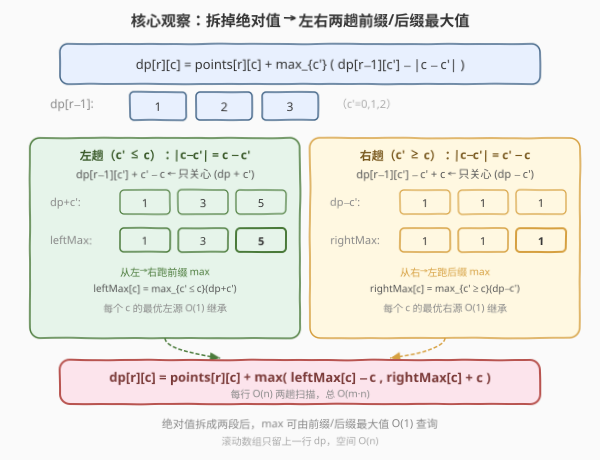
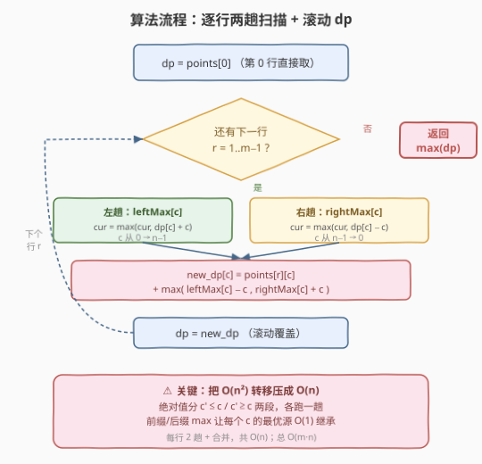
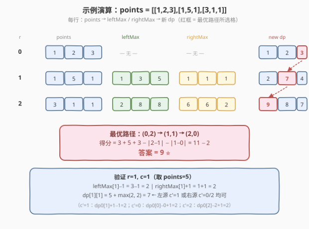

# LeetCode 扣分后的最大得分 题解

## 1. 题目概述

- **标题 / 题号**：扣分后的最大得分（#1937，medium）
- **链接**：https://leetcode.cn/problems/maximum-number-of-points-with-cost/
- **难度**：中等
- **标签**：数组、动态规划、前缀和

**题意**：给你一个 `m x n` 的整数矩阵 `points`（下标从 0 开始）。一开始得分为 `0`，要最大化从矩阵中得到的分数。

得分规则：**每一行**中选取一个格子，选中 `(r, c)` 给总得分**增加** `points[r][c]`；但相邻行 `r` 和 `r+1` 之间，若选中 `(r, c1)` 与 `(r+1, c2)`，总得分**减少** `abs(c1 - c2)`。返回能得到的**最大**得分。

**示例 1**：

```text
输入：points = [[1,2,3],[1,5,1],[3,1,1]]
输出：9
解释：选 (0,2)、(1,1)、(2,0)。得分 3+5+3=11，扣除 |2−1|+|1−0|=2，最终 11−2=9。
```

**示例 2**：

```text
输入：points = [[1,5],[2,3],[4,2]]
输出：11
解释：选 (0,1)、(1,1)、(2,0)。得分 5+3+4=12，扣除 |1−1|+|1−0|=1，最终 12−1=11。
```

**约束**：

- `m == points.length`，`n == points[r].length`
- $1 \le m, n \le 10^5$
- $1 \le m \cdot n \le 10^5$
- $0 \le \text{points}[r][c] \le 10^5$

## 2. 解题思路

### 2.1 暴力思路

设 `dp[r][c]` 表示第 `r` 行选中第 `c` 列时，前 `r+1` 行能获得的最大得分。则：

$$
\text{dp}[r][c] = \text{points}[r][c] + \max_{c'} \big( \text{dp}[r-1][c'] - |c - c'| \big)
$$

对每个 `(r, c)` 枚举上一行所有 `c'`，时间复杂度 $O(m \cdot n^2)$。由于 $m \cdot n \le 10^5$ 但 $n$ 可达 $10^5$（单行情况），$n^2$ 高达 $10^{10}$，必然超时。

> 瓶颈在「对每个 `c` 都重新扫一遍上一行取 max」。能否把 $\max_{c'}(\text{dp}[r-1][c'] - |c-c'|)$ 这一坨拆成只与 $c$ 有关、且可递推的形式？

### 2.2 核心观察：拆掉绝对值 → 左右两趟前缀/后缀最大值



绝对值 $|c - c'|$ 按 $c'$ 与 $c$ 的大小关系分两段：

- **$c' \le c$**：$|c - c'| = c - c'$，于是 $\text{dp}[r-1][c'] - |c-c'| = (\text{dp}[r-1][c'] + c') - c$。括号内只与 $c'$ 有关，对 $c' \le c$ 取 max 就是前缀最大值。
- **$c' \ge c$**：$|c - c'| = c' - c$，于是 $\text{dp}[r-1][c'] - |c-c'| = (\text{dp}[r-1][c'] - c') + c$。括号内只与 $c'$ 有关，对 $c' \ge c$ 取 max 就是后缀最大值。

据此定义两个一趟扫描即可得到的数组：

| 数组 | 定义 | 扫描方向 |
|------|------|----------|
| `leftMax[c]`  | $\max_{c' \le c} (\text{dp}[r-1][c'] + c')$ | 从左 → 右，前缀 max |
| `rightMax[c]` | $\max_{c' \ge c} (\text{dp}[r-1][c'] - c')$ | 从右 → 左，后缀 max |

于是转移被压成 $O(1)$：

$$
\text{dp}[r][c] = \text{points}[r][c] + \max\big(\text{leftMax}[c] - c,\; \text{rightMax}[c] + c\big)
$$

> 💡 **关键直觉**：绝对值把「上一行任意列」与「当前列」耦合在一起；按 $c' \le c$ / $c' \ge c$ 拆开后，耦合项 $(\text{dp} \pm c')$ 与当前 $c$ 无关，可预先用前缀/后缀 max 算好，查询时再补上 $\mp c$。这是把 $O(n^2)$ 转移降为 $O(n)$ 的经典套路（与 [1014. 最佳观光组合](https://leetcode.cn/problems/best-sightseeing-pair/) 同构）。

### 2.3 算法流程图



整体步骤：

1. **初始化**：`dp = points[0]`（第 0 行没有上一行可扣分，直接取该行点数）。
2. 对每一行 `r = 1 .. m-1`：
   - **左趟**：令 `cur = -∞`，从 `c=0` 到 `n-1`，`cur = max(cur, dp[c] + c)`，`leftMax[c] = cur`。
   - **右趟**：令 `cur = -∞`，从 `c=n-1` 到 `0`，`cur = max(cur, dp[c] - c)`，`rightMax[c] = cur`。
   - **合并**：`new_dp[c] = points[r][c] + max(leftMax[c] - c, rightMax[c] + c)`。
   - **滚动**：`dp = new_dp`。
3. 返回 `max(dp)`。

> ⚠️ **数据范围注意**：`points[r][c]` 可达 $10^5$，累加 $m$ 行最大约 $10^{10}$，超过 32 位 `int`。C++ 用 `long long`；中间的 `cur` 初值要取足够小的负数（如 `LLONG_MIN/2`），避免负无穷相加溢出。

### 2.4 示例演算



以示例 1 逐步推演（`dp` 只保留上一行）：

| r | points[r] | leftMax (dp+c') | rightMax (dp−c') | new dp |
|---|-----------|-----------------|------------------|--------|
| 0 | [1,2,3]   | —               | —                | [1,2,3] |
| 1 | [1,5,1]   | [1,3,5]         | [1,1,1]          | [2,7,4] |
| 2 | [3,1,1]   | [2,8,8]         | [6,6,2]          | [9,8,7] |

以 `r=1, c=1`（取 `points=5`）验证：`leftMax[1]-1 = 3-1 = 2`，`rightMax[1]+1 = 1+1 = 2`，`dp[1][1] = 5 + max(2,2) = 7`。对应左源 `c'=1`（`dp0[1]+1-1=2`）或右源 `c'=0`（`dp0[0]-0+1=2`）均可。

最终 `dp = [9,8,7]`，`max = 9`。最优路径 `(0,2)→(1,1)→(2,0)`：$3+5+3 - |2-1| - |1-0| = 11-2 = 9$。

## 3. 参考代码

### C++

```cpp
class Solution {
public:
    long long maxPoints(vector<vector<int>>& points) {
        int m = points.size(), n = points[0].size();
        vector<long long> dp(points[0].begin(), points[0].end());

        for (int r = 1; r < m; ++r) {
            vector<long long> leftMax(n), rightMax(n);
            // 左趟：前缀 max of (dp[c] + c)
            long long cur = LLONG_MIN / 2;
            for (int c = 0; c < n; ++c) {
                cur = max(cur, dp[c] + c);
                leftMax[c] = cur;
            }
            // 右趟：后缀 max of (dp[c] - c)
            cur = LLONG_MIN / 2;
            for (int c = n - 1; c >= 0; --c) {
                cur = max(cur, dp[c] - c);
                rightMax[c] = cur;
            }
            // 合并 + 滚动
            vector<long long> ndp(n);
            for (int c = 0; c < n; ++c) {
                ndp[c] = points[r][c] + max(leftMax[c] - c, rightMax[c] + c);
            }
            dp = move(ndp);
        }
        return *max_element(dp.begin(), dp.end());
    }
};
```

### Python

```python
class Solution:
    def maxPoints(self, points: List[List[int]]) -> int:
        m, n = len(points), len(points[0])
        dp = [x for x in points[0]]

        for r in range(1, m):
            leftMax = [0] * n
            cur = -10**18
            for c in range(n):
                cur = max(cur, dp[c] + c)
                leftMax[c] = cur
            rightMax = [0] * n
            cur = -10**18
            for c in range(n - 1, -1, -1):
                cur = max(cur, dp[c] - c)
                rightMax[c] = cur
            dp = [points[r][c] + max(leftMax[c] - c, rightMax[c] + c) for c in range(n)]

        return max(dp)
```

> 💡 **空间优化**：上面每行额外开了 `leftMax`/`rightMax` 两个长度 $n$ 的数组，空间 $O(n)$。还可以进一步原地化——先把右趟结果写进 `rightMax`，再边跑左趟边直接算 `ndp`，省掉 `leftMax`，但可读性略降。鉴于 $m \cdot n \le 10^5$，$O(n)$ 辅助空间已足够，无需过度优化。

## 4. 复杂度分析

| 维度 | 复杂度 | 说明 |
|------|--------|------|
| 时间复杂度 | $O(m \cdot n)$ | 每行两趟扫描 + 一次合并，各 $O(n)$，共 $m-1$ 行 |
| 空间复杂度 | $O(n)$ | 滚动只保留上一行 `dp` 及两个辅助数组 `leftMax`/`rightMax` |

## 5. 扩展：原地双指针写法

若追求极致空间，可把左趟结果直接累加进新 `dp`，右趟边算边合并，省掉两个辅助数组：

```cpp
for (int r = 1; r < m; ++r) {
    // 先把 leftMax 直接写进 ndp[c] = dp[c] + c 的前缀 max
    vector<long long> ndp(n);
    long long cur = LLONG_MIN / 2;
    for (int c = 0; c < n; ++c) {
        cur = max(cur, dp[c] + c);
        ndp[c] = cur - c;            // 左源贡献
    }
    // 右趟边算边和左源取 max
    cur = LLONG_MIN / 2;
    for (int c = n - 1; c >= 0; --c) {
        cur = max(cur, dp[c] - c);
        ndp[c] = points[r][c] + max(ndp[c], cur + c);
    }
    dp = move(ndp);
}
```

这样每行只用一个 `ndp` 数组，空间仍 $O(n)$ 但常数更小。

## 6. 面试要点

1. **为什么直接枚举 $c'$ 会超时？**

   > 转移是 $\max_{c'}(\text{dp}[r-1][c'] - |c-c'|)$，对每个 $c$ 扫一遍 $c'$ 共 $O(n^2)$ 每行。$n$ 可达 $10^5$，单行就 $10^{10}$ 次操作。

2. **拆绝对值为什么能降到 $O(n)$？**

   > 按 $c' \le c$ / $c' \ge c$ 分两段后，$|c-c'|$ 变成 $c \mp c'$，与 $c'$ 相关的部分 $(\text{dp}[r-1][c'] \pm c')$ 可用前缀/后缀 max 预计算，每个 $c$ 查询 $O(1)$。

3. **`leftMax` 和 `rightMax` 的物理含义是什么？**

   > `leftMax[c]` 是「上一行列号 $\le c$ 的格子中，`dp+c'` 最大者」——即从左边某格过来、扣完距离后剩余贡献的上界（再减 $c$ 即得实际值）。`rightMax` 同理对应右源。

4. **初始化 `cur` 为什么用 `LLONG_MIN/2` 而不是 `LLONG_MIN`？**

   > 转移中 `cur` 会与 `c`（可达 $10^5$）相加减。若用 `LLONG_MIN`，`cur + c` 可能下溢。除以 2 留出余量，既足够小（不会误选空集）又安全。

5. **第 0 行为什么不参与转移？**

   > 第 0 行没有上一行，不存在跨行扣分，选哪格就得哪格的点数，所以 `dp = points[0]` 直接作为基准，从 `r=1` 开始才有转移。

## 同类练习题

| # | 题目 | 与本题的关联 |
|---|------|-------------|
| 1014 | [最佳观光组合](https://leetcode.cn/problems/best-sightseeing-pair/) | 同样把 `values[i]+values[j]+i−j` 拆成 `(values[i]+i)` 与 `(values[j]−j)` 两段，前缀 max 优化，与本题拆绝对值同构 |
| 42 | [接雨水](https://leetcode.cn/problems/trapping-rain-water/)（[题解](../0001-0100/42_接雨水.md)） | 用左右前缀/后缀最大值数组预处理每列水位，同属「前缀后缀 max 预计算」家族 |
| 121 | [买卖股票的最佳时机](https://leetcode.cn/problems/best-time-to-buy-and-sell-stock/)（[题解](../0101-0200/121_买卖股票的最佳时机.md)） | 维护历史最小价（前缀 min）一次扫描求最大差，与本题前缀 max 思路镜像 |
| 239 | [滑动窗口最大值](https://leetcode.cn/problems/sliding-window-maximum/)（[题解](../0201-0300/239_滑动窗口最大值.md)） | 另一类「窗口内 max」的 O(n) 求法（单调队列），对照不同 max 维护手段的适用场景 |
| 1567 | [乘积为正数的最长子数组长度](https://leetcode.cn/problems/maximum-length-of-subarray-with-positive-product/) | 滚动维护正/负两种状态做 O(1) 转移，与本题「按行滚动 dp」的思路相通 |
