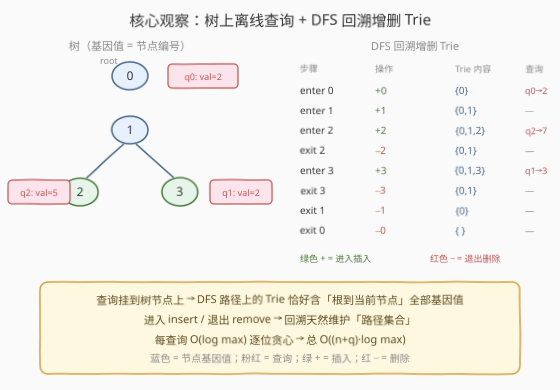
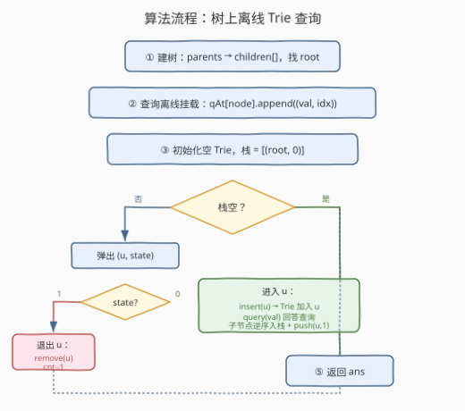
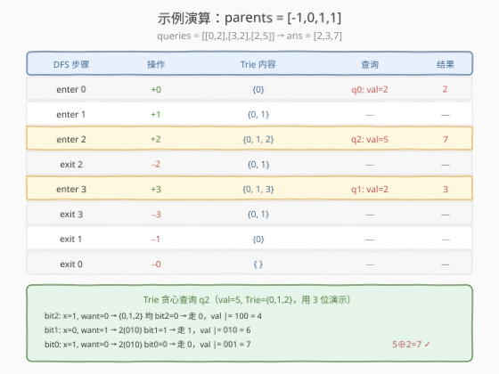

# LeetCode 查询最大基因差 题解

## 1. 题目概述

- **标题 / 题号**：查询最大基因差（#1938，hard）
- **链接**：https://leetcode.cn/problems/maximum-genetic-difference-query/
- **难度**：困难
- **标签**：字典树、位运算、树、深度优先搜索、离线查询

**题意**：给定一棵 $n$ 个节点的有根树，节点编号 $0$ 到 $n-1$，每个节点的**基因值**就是它的编号。两个基因值的**基因差**定义为两者的**异或和**（$\oplus$）。给你 `parents` 数组（`parents[i]` 为节点 $i$ 的父节点，根节点为 $-1$）和查询数组 `queries`，其中 `queries[i] = [node_i, val_i]`。

对每条查询，求 `val_i` 与「节点 `node_i` 到根路径上的任意节点基因值」的**最大异或值**，返回答案数组 `ans`。

**示例 1**：

```text
输入：parents = [-1,0,1,1], queries = [[0,2],[3,2],[2,5]]
输出：[2,3,7]

  树结构:        路径:
     0           node 0 → [0]
     |           node 2 → [2,1,0]
     1           node 3 → [3,1,0]
    / \
   2   3

  q0: node=0, val=2 → max(2⊕0) = 2
  q1: node=3, val=2 → max(2⊕3, 2⊕1, 2⊕0) = 3
  q2: node=2, val=5 → max(5⊕2, 5⊕1, 5⊕0) = 7
```

**示例 2**：

```text
输入：parents = [3,7,-1,2,0,7,0,2], queries = [[4,6],[1,15],[0,5]]
输出：[6,14,7]
```

**约束**：

- $2 \le \text{parents.length} \le 10^5$
- `parents[root] == -1`，其余 $0 \le \text{parents}[i] \le n-1$
- $1 \le \text{queries.length} \le 3 \times 10^4$
- $0 \le \text{node}_i \le n-1$
- $0 \le \text{val}_i \le 2 \times 10^5$

> 💡 **关键观察**：每条查询要在一个**树路径**（根到 `node_i`）上求 `val_i` 的最大异或伙伴。这正是 [421. 数组中两个数的最大异或值](../0401-0500/421_数组中两个数的最大异或值.md) 的二进制 Trie 贪心在**树路径**上的推广。突破口是**离线 + DFS 回溯**：把查询挂到对应树节点上，DFS 自根向下遍历时用 Trie 维护「当前路径上所有基因值」，进入节点插入、退出节点删除——Trie 始终恰好是根到当前节点的路径集合。

## 2. 解题思路

### 2.1 暴力思路：逐查询回溯路径

对每条查询 $(node_i, val_i)$，从 `node_i` 沿 `parents` 逐层回溯到根，收集路径上所有基因值，逐个计算 $val_i \oplus p$ 取最大值。时间复杂度 $O(q \cdot n)$（树退化为链时单条查询路径长 $O(n)$），$q = 3 \times 10^4$、$n = 10^5$ 时约 $3 \times 10^9$，必然超时。

> ⚠️ **症结**：每条查询独立回溯整条路径，重复扫描大量公共祖先。且「在集合中找最大异或伙伴」本身是 $O(\text{集合大小})$——若能用二进制 Trie 把这一步降为 $O(\log \max)$（见 [421](../0401-0500/421_数组中两个数的最大异或值.md)），再配合 DFS 让路径集合**增量维护**，就能同时消去两个瓶颈。

### 2.2 核心观察：树上离线查询 + DFS 回溯增删 Trie



本题的关键转换分三步：

**第一步：查询离线挂载到树节点。**

每条查询 $(node_i, val_i)$ 的答案只依赖于「根到 $node_i$ 的路径」和 $val_i$，不依赖其他查询的结果——满足**离线处理**条件。把查询挂到 $node_i$ 上：`qAt[node].append((val, idx))`，等 DFS 访问到该节点时统一回答。

**第二步：DFS 维护路径 Trie。**

DFS 自根向下遍历，用一个二进制 Trie 维护「**当前路径上所有基因值**」：

- **进入节点 $u$**：`insert(u)`——把基因值 $u$ 插入 Trie；
- **回答查询**：`qAt[u]` 中的每条查询调用 `query(val)`——在 Trie 上逐位贪心求 $val$ 的最大异或伙伴，$O(\log \max)$；
- **递归子节点**；
- **退出节点 $u$**：`remove(u)`——把基因值 $u$ 从 Trie 删除（节点 `cnt−1`）。

$$\boxed{\text{Trie 始终} = \{\text{root} \to \text{当前节点} 的路径基因值\}}$$

> 💡 **为什么回溯天然正确？** DFS 进入时插入、退出时删除，保证了访问节点 $u$ 时 Trie 中恰好是根到 $u$ 路径上的值——不多不少。$u$ 的子树尚未访问（不在 Trie 中），$u$ 的已退出兄弟分支也已删除。这与 [1766. 互质树](../1701-1800/1766_互质树.md) 中「路径栈」思想同源，只是把「按值分桶的栈」换成了「二进制 Trie」。

**第三步：带 `cnt` 的二进制 Trie 支持删除。**

与 [421](../0401-0500/421_数组中两个数的最大异或值.md) 的 Trie 相比，每个节点额外维护 `cnt`——**子树中已插入元素的总数**。删除时沿路径 `cnt−1`（不释放节点）。查询贪心走「相反位」时，需检查 `child[want] && child[want]->cnt > 0`——只有子树非空才能走，否则只能走相同位。

> ⚠️ **与 1707 的区别**：[1707. 与数组中元素的最大异或值](../1701-1800/1707_与数组中元素的最大异或值.md) 在**线性数组**上用「离线排序 + 游标前进」增量建 Trie，只增不删；本题在**树**上用「DFS 回溯」增删 Trie，进入插、退出删。两者共用二进制 Trie + 逐位贪心骨架，区别在「维护候选集的数据结构生命周期」——1707 用单调游标，1938 用 DFS 进出栈。

### 2.3 算法流程图



**步骤**：

1. **建树**：遍历 `parents` 构建 `children[]` 邻接表，找根（`parents[i] == -1` 的节点）。
2. **查询挂载**：遍历 `queries`，将 `(val, idx)` 追加到 `qAt[node]`。
3. **初始化**空 Trie（节点含 `child[0/1]` 与 `cnt`），迭代 DFS 栈 `= [(root, 0)]`。
4. **迭代 DFS**（`state` 0=进入 1=退出，规避链状树递归栈溢出）：
   - `state=0` 进入 $u$：`insert(u)` → 回答 `qAt[u]` 所有查询 → `push(u, 1)` → 子节点逆序入栈。
   - `state=1` 退出 $u$：`remove(u)`。
5. **返回** `ans`。

> 💡 **为何用迭代 DFS？** $n \le 10^5$，树可能退化为链，递归深度达 $10^5$，Python 默认递归上限 1000 必爆栈，C++ 也有栈溢出风险。迭代版用显式栈 + 进/出标记，彻底规避（与 [1766](../1701-1800/1766_互质树.md) 同模式）。

### 2.4 示例演算

以示例 1 `parents = [-1,0,1,1]`、`queries = [[0,2],[3,2],[2,5]]` 为例：



树结构：根 0 → 子 1 → 子 2、3。查询挂载：`qAt[0]=[(2,0)]`、`qAt[3]=[(2,1)]`、`qAt[2]=[(5,2)]`。

| DFS 步骤 | 操作 | Trie 内容 | 查询 | 结果 |
|---------|------|----------|------|------|
| enter 0 | +0 | {0} | q0: val=2 | 2 ⊕ 0 = **2** |
| enter 1 | +1 | {0,1} | — | — |
| enter 2 | +2 | {0,1,2} | q2: val=5 | 5 ⊕ 2 = **7** |
| exit 2 | −2 | {0,1} | — | — |
| enter 3 | +3 | {0,1,3} | q1: val=2 | 2 ⊕ 1 = **3** |
| exit 3 | −3 | {0,1} | — | — |
| exit 1 | −1 | {0} | — | — |
| exit 0 | −0 | {} | — | — |

**最终答案**：`[2, 3, 7]` ✓

> 💡 **看 Trie 贪心如何工作**：以 `q2`（`val=5`，Trie=`{0,1,2}`，用 3 位演示）为例，`5 = 101`：
> - `bit2`：`x=1`，`want=0` → `{0,1,2}` 的 `bit2` 均为 0 → 走 0，`val |= 100 = 4`；
> - `bit1`：`x=0`，`want=1` → `2(010)` 的 `bit1=1` → 走 1，`val |= 010 = 6`；
> - `bit0`：`x=1`，`want=0` → `2(010)` 的 `bit0=0` → 走 0，`val |= 001 = 7`。
>
> 命中基因值 2，`5 ⊕ 2 = 7`。每步优先走「相反位」使该位异或为 1（高位优先），走不到才取相同位——与 421 的贪心逻辑完全一致。

## 3. 参考代码

### C++

```cpp
class Solution {
    struct Node {
        Node* child[2] = {nullptr, nullptr};
        int cnt = 0;
    };

    static const int HIGH_BIT = 17;

    void insert(Node* root, int x) {
        Node* cur = root;
        for (int i = HIGH_BIT; i >= 0; i--) {
            int b = (x >> i) & 1;
            if (!cur->child[b]) cur->child[b] = new Node();
            cur = cur->child[b];
            cur->cnt++;
        }
    }

    void remove(Node* root, int x) {
        Node* cur = root;
        for (int i = HIGH_BIT; i >= 0; i--) {
            int b = (x >> i) & 1;
            cur = cur->child[b];
            cur->cnt--;
        }
    }

    int query(Node* root, int x) {
        Node* cur = root;
        int val = 0;
        for (int i = HIGH_BIT; i >= 0; i--) {
            int b = (x >> i) & 1;
            int want = 1 - b;
            if (cur->child[want] && cur->child[want]->cnt > 0) {
                val |= (1 << i);
                cur = cur->child[want];
            } else {
                cur = cur->child[b];
            }
        }
        return val;
    }

public:
    vector<int> maxGeneticDifference(vector<int>& parents, vector<vector<int>>& queries) {
        int n = parents.size();
        int root = -1;
        vector<vector<int>> children(n);
        for (int i = 0; i < n; i++) {
            if (parents[i] == -1) root = i;
            else children[parents[i]].push_back(i);
        }

        int q = queries.size();
        vector<vector<pair<int,int>>> qAt(n);
        for (int i = 0; i < q; i++) {
            int node = queries[i][0], val = queries[i][1];
            qAt[node].push_back({val, i});
        }

        Node* trieRoot = new Node();
        vector<int> ans(q);

        // 迭代 DFS：state 0=进入 1=退出，规避链状树递归栈溢出
        vector<pair<int,int>> stk;
        stk.reserve(n * 2);
        stk.push_back({root, 0});
        while (!stk.empty()) {
            auto [u, state] = stk.back();
            stk.pop_back();
            if (state == 0) {
                insert(trieRoot, u);
                for (auto& [val, idx] : qAt[u]) {
                    ans[idx] = query(trieRoot, val);
                }
                stk.push_back({u, 1});
                for (int i = (int)children[u].size() - 1; i >= 0; i--) {
                    stk.push_back({children[u][i], 0});
                }
            } else {
                remove(trieRoot, u);
            }
        }
        return ans;
    }
};
```

### Python

```python
class Solution:
    def maxGeneticDifference(self, parents: List[int], queries: List[List[int]]) -> List[int]:
        HIGH_BIT = 17

        class TrieNode:
            __slots__ = ('child', 'cnt')
            def __init__(self):
                self.child = [None, None]
                self.cnt = 0

        trie_root = TrieNode()

        def insert(x):
            cur = trie_root
            for i in range(HIGH_BIT, -1, -1):
                b = (x >> i) & 1
                if not cur.child[b]:
                    cur.child[b] = TrieNode()
                cur = cur.child[b]
                cur.cnt += 1

        def remove(x):
            cur = trie_root
            for i in range(HIGH_BIT, -1, -1):
                b = (x >> i) & 1
                cur = cur.child[b]
                cur.cnt -= 1

        def query(x):
            cur = trie_root
            val = 0
            for i in range(HIGH_BIT, -1, -1):
                b = (x >> i) & 1
                want = 1 - b
                nxt = cur.child[want]
                if nxt and nxt.cnt > 0:
                    val |= (1 << i)
                    cur = nxt
                else:
                    cur = cur.child[b]
            return val

        n = len(parents)
        root = -1
        children = [[] for _ in range(n)]
        for i, p in enumerate(parents):
            if p == -1:
                root = i
            else:
                children[p].append(i)

        q = len(queries)
        q_at = [[] for _ in range(n)]
        for i, (node, val) in enumerate(queries):
            q_at[node].append((val, i))

        ans = [0] * q

        # 迭代 DFS：state 0=进入 1=退出，规避链状树递归栈溢出
        stack = [(root, 0)]
        while stack:
            u, state = stack.pop()
            if state == 0:
                insert(u)
                for val, idx in q_at[u]:
                    ans[idx] = query(val)
                stack.append((u, 1))
                for v in reversed(children[u]):
                    stack.append((v, 0))
            else:
                remove(u)

        return ans
```

> 💡 **实现细节**：① `HIGH_BIT = 17`：约束 $\text{val}_i \le 2 \times 10^5 < 2^{18} = 262144$，最高有效位是 `bit17`，故从 `bit17 → bit0` 共 18 层。② `remove` 不释放节点，仅沿路径 `cnt−1`——后续 `insert` 相同值时复用已有节点并 `cnt++`，避免反复分配。③ `query` 中 `child[want] && child[want]->cnt > 0` 双重检查：节点可能存在但 `cnt=0`（已被删除），此时不能走。④ 子节点**逆序入栈**保证处理顺序与邻接表顺序一致（栈是 LIFO）。⑤ `__slots__` 减少 Python 对象内存开销。

> ⚠️ **C++ 注意**：`Node` 用 `new` 分配，LeetCode 环境无需手动释放。$n = 10^5$ 时 Trie 最坏 $n \cdot 18 \approx 1.8 \times 10^6$ 个节点，但基因值是 $0$ 到 $n-1$，高位前缀大量共享，实际节点数远小于理论上界。若需无内存泄漏，可改用 `vector<Node>` 预分配节点池以索引代替指针。

## 4. 复杂度分析

| 维度 | 复杂度 | 说明 |
|------|--------|------|
| 时间 | $O((n + q) \cdot \log \max)$ | 建树 $O(n)$；每个节点进入/退出各操作 Trie 一次 $O(\log \max)$，共 $2n$ 次；每条查询在 Trie 上贪心走 18 层 $O(\log \max)$；$\log \max = 18$ |
| 空间 | $O(n \cdot \log \max + q)$ | Trie 最坏 $n \cdot 18$ 个节点（高位前缀共享后实际更少）；`children` 邻接表 $O(n)$；`qAt` 挂载 $O(q)$；迭代栈 $O(n)$ |

> 💡 **与暴力对比**：暴力 $O(q \cdot n) \approx 3 \times 10^9$；本解法 $\approx (10^5 + 3 \times 10^4) \times 18 \approx 2.3 \times 10^6$，快约 $1000$ 倍。核心增益来自 Trie 把「路径中找最大异或」从 $O(\text{路径长})$ 降为 $O(\log \max)$，且 DFS 回溯让 Trie 随路径自然增删，无重复建树。

> ⚠️ **为什么是 18 层？** $\text{val}_i \le 2 \times 10^5 < 2^{18} = 262144$，最高有效位是 `bit17`（$2^{17} = 131072 \le 2 \times 10^5$）。用 `bit17 → bit0`（18 层）覆盖所有可能值。若取 `HIGH_BIT = 16`（17 层）会丢掉 `bit17`，对 $\ge 131072$ 的 `val_i` 判定错误。

## 5. 扩展：树上路径查询的通用范式

本题是「**树上路径离线查询 + DFS 回溯维护数据结构**」范式的代表。核心思想：DFS 进入/退出天然对应路径集合的「加入/移除」，任何支持 $O(\log)$ 插入删除的数据结构都能套用。

| 数据结构 | 维护内容 | 对应题目 | 关联 |
|---------|---------|---------|------|
| 路径栈（按值分桶） | 各值的祖先节点栈 | [1766. 互质树](../1701-1800/1766_互质树.md) | 值域极小（$\le 50$）时按值分桶，栈顶即最近祖先 |
| 二进制 Trie（带 cnt） | 路径上所有基因值 | **本题 1938** | 值域大（$\le 2 \times 10^5$）时用 Trie，支持最大异或查询 |
| 前缀和数组 | 路径上的权值前缀 | 树上点/边权前缀和 | 不可变路径用前缀和，可变用树状数组+DFS 序 |
| 持久化线段树 | 根到各节点的权值线段树 | 区间第 $k$ 小（树上） | 不需回溯删除，每节点建一个版本 |

> 💡 **何时用回溯增删，何时用持久化？** 回溯增删（本题）要求「同时只有一个活跃路径」——DFS 任意时刻只走一条根到叶的路径，Trie 维护当前路径即可。若需**同时**查询多条不同路径（如在线查询任意两节点路径），回溯不够用，需持久化 Trie/线段树保存所有版本。本题查询可离线、只问根到某节点路径，回溯增删是最低空间方案。

> ⚠️ **DFS 序 + 树状数组**不适合本题：树状数组擅长「路径权值之和」类查询（进/出时间戳做差），但「路径上最大异或」是**非可加**的位运算，无法用前缀和分解，必须依赖 Trie 的逐位贪心结构。

## 6. 面试要点

**Q1：为什么把查询挂到树节点上，而不是按原始顺序逐条处理？**

> 每条查询只依赖于「根到 `node_i` 的路径」和 `val_i`，不依赖其他查询结果——满足离线条件。挂到节点上后，DFS 访问到该节点时路径 Trie 恰好就绪，一次性回答所有该节点上的查询，无需为每条查询单独回溯路径。这与 [1707](../1701-1800/1707_与数组中元素的最大异或值.md) 的「查询排序」异曲同工：都是重排查询顺序以复用数据结构状态。

**Q2：Trie 的 `cnt` 字段有什么用？不维护会怎样？**

> `cnt` 记录子树中已插入元素总数，有两个作用：① **支持删除**——`remove` 沿路径 `cnt−1`，不释放节点；② **查询时判空**——`child[want]` 可能存在但 `cnt=0`（子树元素全被删除），此时不能走该分支。不维护 `cnt` 的话，删除后无法区分「节点不存在」和「节点存在但为空」，查询会走入已清空的子树返回错误结果。

**Q3：为什么用迭代 DFS 而不是递归？**

> $n \le 10^5$，树可能退化为单链，递归深度达 $10^5$。Python 默认递归上限 1000 必爆栈；C++ 默认栈 8MB 也可能不够。迭代 DFS 用显式栈 + `(node, state)` 进/出标记，把调用栈换成堆内存，彻底规避栈深度问题。与 [1766. 互质树](../1701-1800/1766_互质树.md)、[1376. 通知所有员工所需的时间](../1301-1400/1376_通知所有员工所需的时间.md) 同模式。

**Q4：`HIGH_BIT` 取 17 的依据？取 16 行不行？**

> 约束 $\text{val}_i \le 2 \times 10^5$。$2^{17} = 131072 \le 2 \times 10^5 < 2^{18} = 262144$，故最高有效位是 `bit17`，`HIGH_BIT = 17`（18 层）。取 16（17 层）会丢掉 `bit17`，对所有 $\ge 131072$ 的 `val_i` 判定错误。取 18 也正确但多一层恒 `0` 前缀，浪费空间。

**Q5：本题与 1707、421、1803 的核心区别？**

> 四者共用二进制 Trie 骨架，但**查询场景与候选集维护方式**不同：[421](../0401-0500/421_数组中两个数的最大异或值.md) 在全量数组上一次性建 Trie 求最大异或；[1707](../1701-1800/1707_与数组中元素的最大异或值.md) 在线性数组上用离线排序 + 游标前进增量建 Trie（只增不删）；[1803](../1801-1900/1803_统计异或值在范围内的数对有多少.md) 在 Trie 上加 `cnt` 做区间计数（非最值）；**本题 1938** 在树上用 DFS 回溯增删 Trie（进入插、退出删），候选集是「当前路径」。可记忆为：421 全量、1707 线性增量、1803 计数、1938 树上回溯。

> 💡 **一句话总结**：查询挂到树节点 → DFS 路径 Trie 恰好含根到当前节点全部基因值 → 进入 insert / 退出 remove 回溯维护 → 每查询 $O(\log \max)$ 逐位贪心。本质是 421 的 Trie 贪心 + 树上 DFS 回溯增删。

## 同类练习题

| # | 题目 | 与本题的关联 |
|---|------|-------------|
| 421 | [数组中两个数的最大异或值](https://leetcode.cn/problems/maximum-xor-of-two-numbers-in-an-array/)（[题解](../0401-0500/421_数组中两个数的最大异或值.md)） | 二进制 Trie 求最大异或的母题——掌握其「逐位贪心取相反位」后，本题只需叠加「树上 DFS 回溯增删 Trie」 |
| 1707 | [与数组中元素的最大异或值](https://leetcode.cn/problems/maximum-xor-with-an-element-from-array/)（[题解](../1701-1800/1707_与数组中元素的最大异或值.md)） | 线性数组上的离线 Trie 查询——对比「离线排序 + 游标增量」与本题「DFS 回溯增删」两种候选集维护方式 |
| 1803 | [统计异或值在范围内的数对有多少](https://leetcode.cn/problems/count-pairs-with-xor-in-a-range/)（[题解](../1801-1900/1803_统计异或值在范围内的数对有多少.md)） | 二进制 Trie 加 `cnt` 做区间计数——与本题共用带 `cnt` 的 Trie 骨架，对比「计数」与「最值」两种查询逻辑 |
| 1766 | [互质树](https://leetcode.cn/problems/tree-of-coprimes/)（[题解](../1701-1800/1766_互质树.md)） | 树上路径离线查询的同模式——DFS 回溯维护「路径上各值祖先栈」，与本题「路径 Trie」思想同源，对比值域大小对数据结构选择的影响 |
| 208 | [实现 Trie（前缀树）](https://leetcode.cn/problems/implement-trie-prefix-tree/)（[题解](../0201-0300/208_实现Trie.md)） | 字符串 Trie 基础模板——本题把字符换为 0/1 位并加上 `cnt`，是理解二进制 Trie 的前置知识 |
