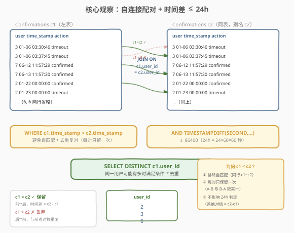
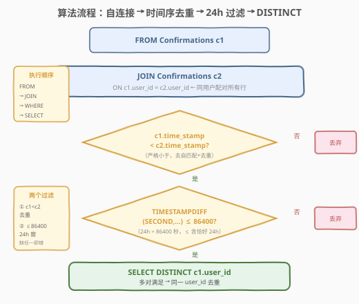
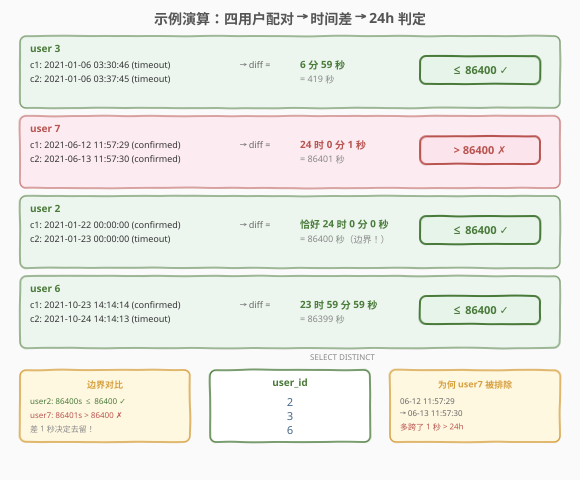

# LeetCode 主动请求确认消息的用户 题解

## 1. 题目概述

- **标题 / 题号**：主动请求确认消息的用户（#1939，easy）
- **链接**：https://leetcode.cn/problems/users-that-actively-request-confirmation-messages/
- **难度**：简单
- **标签**：数据库、SQL、自连接（self-join）、`TIMESTAMPDIFF`、时间差比较、`DISTINCT`、窗口函数 `LAG`、LeetCode 锁题

**题意**：给定 `Signups`（注册）和 `Confirmations`（确认消息请求）两张表，编写 SQL 查询，找出**在 24 小时窗口内两次请求确认消息**的用户 ID。两个恰好相隔 24 小时的请求被认为在窗口内。`action` 字段不影响答案，只影响请求时间。

**表结构**：

```text
Table: Signups
+----------------+----------+
| Column Name    | Type     |
+----------------+----------+
| user_id        | int      |  ← 主键
| time_stamp     | datetime |
+----------------+----------+
每行包含有关 ID 为 user_id 的用户的注册时间的信息。

Table: Confirmations
+----------------+----------+
| Column Name    | Type     |
+----------------+----------+
| user_id        | int      |  ← 外键 → Signups
| time_stamp     | datetime |
| action         | ENUM     |  ← ('confirmed', 'timeout')
+----------------+----------+
(user_id, time_stamp) 是主键。
每行表示 ID 为 user_id 的用户在 time_stamp 请求了确认消息，
该消息已被确认（'confirmed'）或已过期（'timeout'）。
```

**示例 1**：

```text
Signups 表:
+---------+---------------------+
| user_id | time_stamp          |
+---------+---------------------+
| 3       | 2020-03-21 10:16:13 |
| 7       | 2020-01-04 13:57:59 |
| 2       | 2020-07-29 23:09:44 |
| 6       | 2020-12-09 10:39:37 |
+---------+---------------------+

Confirmations 表:
+---------+---------------------+-----------+
| user_id | time_stamp          | action    |
+---------+---------------------+-----------+
| 3       | 2021-01-06 03:30:46 | timeout   |
| 3       | 2021-01-06 03:37:45 | timeout   |
| 7       | 2021-06-12 11:57:29 | confirmed |
| 7       | 2021-06-13 11:57:30 | confirmed |
| 2       | 2021-01-22 00:00:00 | confirmed |
| 2       | 2021-01-23 00:00:00 | timeout   |
| 6       | 2021-10-23 14:14:14 | confirmed |
| 6       | 2021-10-24 14:14:13 | timeout   |
+---------+---------------------+-----------+

输出:
+---------+
| user_id |
+---------+
| 2       |
| 3       |
| 6       |
+---------+
```

**解释**：

| user_id | c1 时间 | c2 时间 | 时间差 | 秒数 | ≤ 86400? | 结论 |
|---------|---------|---------|--------|------|----------|------|
| 3 | 03:30:46 | 03:37:45 | 6 分 59 秒 | 419 | ✓ | 包含 |
| 7 | 06-12 11:57:29 | 06-13 11:57:30 | 24 时 0 分 1 秒 | 86401 | ✗ | 排除 |
| 2 | 01-22 00:00:00 | 01-23 00:00:00 | 恰好 24 时 | 86400 | ✓ | 包含 |
| 6 | 10-23 14:14:14 | 10-24 14:14:13 | 23 时 59 分 59 秒 | 86399 | ✓ | 包含 |

> 💡 **审题关键**：① **24 小时窗口含边界**——「恰好相隔 24 小时」算在窗口内，即条件是 $\le 86400$ 秒而非 $< 86400$；② **action 不影响判定**——只看 `time_stamp`，`confirmed`/`timeout` 都是请求记录；③ **`Signups` 表是干扰项**——查询只需 `Confirmations`，注册表不参与判定；④ 题目只要求「存在一对」满足条件，不要求所有对都满足。

**约束**：

- `Signups.user_id` 是主键
- `Confirmations` 的 `(user_id, time_stamp)` 是复合主键
- `Confirmations.user_id` 是指向 `Signups` 的外键
- `action` 是 `ENUM('confirmed', 'timeout')`
- 结果可按任意顺序返回

> 💡 本题是 SQL **"自连接时间差比较招牌题"**——核心套路：将 `Confirmations` 与自身按 `user_id` 连接，用 `c1.time_stamp < c2.time_stamp` 消除自匹配和重复对，再用 `TIMESTAMPDIFF(SECOND, ...) <= 86400` 判定 24 小时窗口。难点在于理解自连接去重的必要性以及边界条件 $\le$ vs $<$ 的选择。

## 2. 解题思路

### 2.1 暴力思路：逐用户逐对比较

最直觉的过程式思路：对每位用户，取出其全部确认请求，两两配对计算时间差，若存在任何一对 $\le 24$ 小时则收录该用户。伪代码：

```text
result = set()
for user in users:
    reqs = sorted(Confirmations where user_id == user, by time_stamp)
    for i in range(len(reqs)):
        for j in range(i+1, len(reqs)):
            diff = reqs[j].time - reqs[i].time
            if diff <= 86400:
                result.add(user)
                break
```

但**纯 SQL 没有显式双重循环**——"同用户内两两配对"需换成集合式表达。将表与自身按 `user_id` 连接，自然产生同用户的所有行对（笛卡尔积受 `user_id` 约束），再用 `WHERE` 过滤时间差。

### 2.2 核心观察：自连接配对 + 时间序去重 + 24h 过滤



**问题拆解为三个子问题**：

1. **同用户配对所有行对**：`Confirmations c1 JOIN Confirmations c2 ON c1.user_id = c2.user_id`。自连接按 `user_id` 匹配，每位用户的 $k$ 条请求产生 $k^2$ 个行对（含自身与自身、正反两种顺序）。

2. **时间序去重——只保留前→后对**：`WHERE c1.time_stamp < c2.time_stamp`。自连接产生的行对中有三类需要排除：
   - **自身对**（`c1.time_stamp = c2.time_stamp`）：同一行与自己配对，时间差恒为 0，无意义；
   - **反序对**（`c1.time_stamp > c2.time_stamp`）：与正序对（`c2 → c1`）对称重复，时间差绝对值相同；
   - 用**严格小于** `<`（而非 `≤`）一举排除两者，每对只保留一次，且 `c2 - c1` 恰为正时间差。

3. **24h 窗口判定**：`TIMESTAMPDIFF(SECOND, c1.time_stamp, c2.time_stamp) <= 86400`。由于已保证 `c1 < c2`，`TIMESTAMPDIFF` 返回值为正，直接与 $86400$（$24 \times 60 \times 60$）比较即可。$\le$ 含边界——题目明确「恰好 24 小时算在窗口内」。

> ⚠️ **为何用 `<` 而非 `≤` 去重**：若写 `c1.time_stamp ≤ c2.time_stamp`，自身对（`c1 = c2`，即同一行）不会被排除——时间差为 0，满足 $\le 86400$，导致**每位用户只要有一条请求就必然命中**（自身与自身配对差为 0）。用严格 `<` 排除自身对，只比较真正不同的两条请求。

> 💡 **`Signups` 表的作用**：题目给出 `Signups` 表但查询不需要它——`Confirmations.user_id` 是外键，保证每位有确认请求的用户都已注册。`Signups` 仅提供注册时间上下文，不参与"24 小时窗口"判定。若误将 `Signups` 纳入连接，只会增加不必要的复杂度。

### 2.3 算法流程图



**逻辑执行步骤**：

| 步骤 | 子句 | 作用 |
|------|------|------|
| ① | `FROM Confirmations c1` | 读取左表实例 `c1` |
| ② | `JOIN Confirmations c2 ON c1.user_id = c2.user_id` | 自连接：同用户配对所有行对 |
| ③ | `WHERE c1.time_stamp < c2.time_stamp` | 排除自身对 + 反序对，只留前→后 |
| ④ | `AND TIMESTAMPDIFF(SECOND, ...) <= 86400` | 24h 窗口过滤（含边界） |
| ⑤ | `SELECT DISTINCT c1.user_id` | 去重输出（同一用户可能多对满足） |

> 💡 **SQL 子句执行顺序**：`FROM`（含 `JOIN`/`ON`）→ `WHERE` → `GROUP BY` → `HAVING` → `SELECT`（含 `DISTINCT`）→ `ORDER BY` → `LIMIT`。自连接在 `FROM` 阶段完成（生成全部行对），`WHERE` 在其上做两层过滤（时间序去重 + 24h 窗口），最后 `DISTINCT` 在 `SELECT` 阶段去重。

### 2.4 示例演算

以示例 1 的 4 位用户为例，观察「自连接配对 → 时间序去重 → 24h 过滤」的逐步过程：



**自连接后每位用户产生的行对**（经 `c1 < c2` 去重后）：

| user_id | c1.time_stamp | c2.time_stamp | 时间差 | 秒数 | ≤ 86400? | 命中? |
|---------|---------------|---------------|--------|------|----------|-------|
| 3 | 01-06 03:30:46 | 01-06 03:37:45 | 6m59s | 419 | ✓ | ✓ 包含 |
| 7 | 06-12 11:57:29 | 06-13 11:57:30 | 24h0m1s | 86401 | ✗ | ✗ 排除 |
| 2 | 01-22 00:00:00 | 01-23 00:00:00 | 24h0m0s | 86400 | ✓ | ✓ 包含 |
| 6 | 10-23 14:14:14 | 10-24 14:14:13 | 23h59m59s | 86399 | ✓ | ✓ 包含 |

每位用户恰好 2 条请求，自连接去重后各剩 1 对，直接判定。

> ⚠️ **边界陷阱**：user 2（恰好 86400 秒）包含而 user 7（86401 秒）排除——**差 1 秒决定去留**。题目明确「恰好 24 小时算在窗口内」，故用 $\le$ 而非 $<$。若误写 $<$ 则 user 2 被错误排除。这是 SQL 时间比较中最经典的边界考点。

> 💡 **若用户有 3+ 条请求**：自连接会产生 $C_k^2 = \frac{k(k-1)}{2}$ 个行对（经 `<` 去重后）。只要**任意一对**满足 $\le 86400$ 秒，该用户即被收录。`DISTINCT` 确保同一用户多对命中时只输出一次。

## 3. 参考代码

### SQL（解法 A：自连接 + `TIMESTAMPDIFF`，推荐）

```sql
SELECT DISTINCT c1.user_id
FROM Confirmations c1
JOIN Confirmations c2
  ON c1.user_id = c2.user_id
WHERE c1.time_stamp < c2.time_stamp
  AND TIMESTAMPDIFF(SECOND, c1.time_stamp, c2.time_stamp) <= 24 * 60 * 60;
```

> 💡 **写法要点**：
> - **`JOIN ... ON c1.user_id = c2.user_id`**：自连接，同用户的所有行两两配对。用 `JOIN`（即 `INNER JOIN`）即可——不需要 `LEFT JOIN`，因为我们只关心有配对的行。
> - **`c1.time_stamp < c2.time_stamp`**：严格小于，排除自身对（同一行）和反序对（对称重复），每对只保留一次。这一步是正确性的关键——缺它会导致自身对命中（差为 0 ≤ 86400），每位用户都入选。
> - **`TIMESTAMPDIFF(SECOND, c1, c2)`**：MySQL 内置函数，返回 `c2 - c1` 的秒数（整数）。因 `c1 < c2`，返回值为正。`24 * 60 * 60 = 86400`，写成乘法表达式更可读。
> - **`DISTINCT`**：同一用户可能有多对满足条件（3+ 条请求时），去重保证每位用户只出现一次。
> - ✓ **最推荐**：语义清晰、直接对应题意、MySQL 标准写法。

### SQL（解法 B：自连接 + `INTERVAL` 算术，避免 `TIMESTAMPDIFF`）

```sql
SELECT DISTINCT c1.user_id
FROM Confirmations c1
JOIN Confirmations c2
  ON c1.user_id = c2.user_id
WHERE c1.time_stamp < c2.time_stamp
  AND c2.time_stamp - INTERVAL 24 HOUR <= c1.time_stamp;
```

> 💡 **解法 B 的思路**：将 24h 判定从「正算差值」改为「倒推窗口」——`c2.time_stamp - INTERVAL 24 HOUR` 得到 c2 往前推 24 小时的时刻，若该时刻 $\le c1$（即 c1 落在 c2 的前 24h 内），则 $c2 - c1 \le 24h$。
>
> **与解法 A 的区别**：不使用 `TIMESTAMPDIFF` 函数，改用 `INTERVAL` 算术。`INTERVAL` 是 SQL 标准语法，在 MySQL、PostgreSQL 中均受支持（PostgreSQL 写 `INTERVAL '24 hours'`）。两种写法语义等价，选择取决于个人偏好与数据库兼容性。
>
> ⚠️ **不可写 `c2.time_stamp - c1.time_stamp <= 86400`**：MySQL 中 `datetime` 相减不会返回秒数——它会被隐式转为 `YYYYMMDDHHMMSS` 格式的数值再相减，结果是**无意义的数字**（如 `20210123000000 - 20210122000000 = 1000000`，并非 86400 秒）。MySQL 计算 datetime 差值**必须用 `TIMESTAMPDIFF` 或 `DATEDIFF`**，不能直接相减。

### SQL（解法 C：`LAG` 窗口函数，O(n log n) 优化）

```sql
WITH Ordered AS (
    SELECT user_id,
           time_stamp,
           LAG(time_stamp) OVER (
               PARTITION BY user_id
               ORDER BY time_stamp
           ) AS prev_ts
    FROM Confirmations
)
SELECT DISTINCT user_id
FROM Ordered
WHERE prev_ts IS NOT NULL
  AND TIMESTAMPDIFF(SECOND, prev_ts, time_stamp) <= 86400;
```

> 💡 **解法 C 的思路**：用 `LAG()` 窗口函数取每位用户**按时间排序后的前一条请求**，只比较相邻对。若相邻对的差 $\le 24h$，则该用户命中。
>
> **为何只检查相邻对就足够？** 设某用户有请求 $t_1 < t_2 < \cdots < t_k$。若存在非相邻对 $(t_i, t_j)$（$j > i+1$）满足 $t_j - t_i \le 24h$，则相邻对 $(t_i, t_{i+1})$ 满足 $t_{i+1} - t_i \le t_j - t_i \le 24h$（因 $t_i < t_{i+1} < t_j$）。故**任意对满足 $\Rightarrow$ 某相邻对也满足**，检查相邻对即可覆盖全部情况。
>
> **与解法 A 的区别**：解法 A 的自连接产生 $O(k^2)$ 个行对（$k$ 为用户请求数），最坏 $O(n^2)$；解法 C 排序后线性扫描，$O(n \log n)$。当用户请求数较多时解法 C 显著更优。但本题数据量小，两者实际差异不大。
>
> ⚠️ **`LAG` 需 MySQL 8.0+**：窗口函数在 MySQL 8.0 引入，LeetCode 在线判题使用 MySQL 8.0，可放心使用。

### Python（pandas）

```python
import pandas as pd

def users_that_actively_request_confirmation_messages(
    confirmations: pd.DataFrame,
) -> pd.DataFrame:
    merged = confirmations.merge(
        confirmations, on='user_id', suffixes=('_1', '_2')
    )
    mask = (
        merged['time_stamp_1'] < merged['time_stamp_2']
    ) & (
        (merged['time_stamp_2'] - merged['time_stamp_1']).dt.total_seconds() <= 86400
    )
    return merged.loc[mask, ['user_id']].drop_duplicates().reset_index(drop=True)
```

> 💡 **pandas 对照**：
> - `confirmations.merge(confirmations, on='user_id', suffixes=('_1', '_2'))` 对应 SQL 的自连接 `JOIN ... ON c1.user_id = c2.user_id`——`suffixes` 给同名列加后缀以区分 `c1`/`c2`。
> - `merged['time_stamp_1'] < merged['time_stamp_2']` 对应 `WHERE c1.time_stamp < c2.time_stamp`——布尔索引做时间序去重。
> - `(merged['time_stamp_2'] - merged['time_stamp_1']).dt.total_seconds()` 对应 `TIMESTAMPDIFF(SECOND, ...)`——pandas 的 `datetime` 相减得到 `Timedelta`，`.dt.total_seconds()` 转秒数。
> - `.drop_duplicates()` 对应 `SELECT DISTINCT`——去重输出。
> - **pandas 等价于解法 A 的自连接写法**，同样可改用 `sort_values` + `groupby().shift()` 模拟 `LAG`（解法 C 的 pandas 版）。

## 4. 复杂度分析

| 维度 | 解法 A（自连接 + `TIMESTAMPDIFF`） | 解法 B（自连接 + `INTERVAL`） | 解法 C（`LAG` 窗口） | pandas |
|------|-------------------------------------|-------------------------------|----------------------|--------|
| **时间** | $O(n + \sum k_i^2)$ | $O(n + \sum k_i^2)$ | $O(n \log n)$ | $O(n + \sum k_i^2)$ |
| **空间** | $O(\sum k_i^2)$ | $O(\sum k_i^2)$ | $O(n)$ | $O(\sum k_i^2)$ |
| **可读性** | ✓ 最直观 | ✓ 等价 | 中（需理解 LAG 等价性） | ✓ |
| **推荐度** | ✓ **首选** | ✓ 跨库通用 | ✓ 大数据优化 | ✓ 验证用 |

> - $n$ = `Confirmations` 总行数，$k_i$ = 用户 $i$ 的请求数，$\sum k_i = n$
> - **时间**：解法 A/B 的自连接为每位用户产生 $k_i^2$ 个行对（含去重前），总计 $\sum k_i^2$；当每位用户请求数少（本题示例每人 2 条）时接近 $O(n)$，最坏（单用户 $n$ 条请求）退化为 $O(n^2)$。解法 C 排序 $O(n \log n)$ + 线性扫描 $O(n)$，与用户请求数无关。
> - **空间**：解法 A/B 需 $O(\sum k_i^2)$ 存连接中间表；解法 C 仅需 $O(n)$ 存排序后的 CTE。
> - **索引优化**：在 `Confirmations(user_id, time_stamp)` 上建复合索引可让自连接走索引等值查找 + 排序优化；解法 C 的 `PARTITION BY user_id ORDER BY time_stamp` 直接利用该复合索引。

## 5. 扩展：自连接去重的三种写法与时间函数辨析

### 5.1 自连接去重的三种等价写法

自连接产生的行对需去除自身对和反序对，有三种等价写法：

| 写法 | 条件 | 排除自身对 | 排除反序对 | 说明 |
|------|------|-----------|-----------|------|
| **A. 严格小于** | `c1.time_stamp < c2.time_stamp` | ✓ | ✓ | 一举排除两者，最简洁 |
| **B. 小于等于 + 不等行** | `c1.time_stamp <= c2.time_stamp AND c1.time_stamp <> c2.time_stamp` | ✓ | ✓ | 冗长，不推荐 |
| **C. 行标识去重** | `c1.time_stamp < c2.time_stamp`（用主键保证唯一） | ✓ | ✓ | 与 A 等价（`time_stamp` 是主键的一部分，唯一） |

> 💡 本题 `(user_id, time_stamp)` 是复合主键，同一用户的 `time_stamp` 互不相同，故 `c1.time_stamp < c2.time_stamp`（在同一 `user_id` 内）即可保证排除自身对。若 `time_stamp` 不唯一（非主键），则需额外用 `c1 <> c2`（行不等）或自增主键比较来排除自身对。

### 5.2 MySQL 时间差计算函数辨析

| 函数/写法 | 返回值 | 单位 | 示例 |
|-----------|--------|------|------|
| `TIMESTAMPDIFF(SECOND, t1, t2)` | 整数 | 秒 | `t2 - t1` 的秒数 |
| `TIMESTAMPDIFF(MINUTE, t1, t2)` | 整数 | 分钟（截断） | 不足 60 秒的部分被丢弃 |
| `DATEDIFF(t1, t2)` | 整数 | 天 | `t1 - t2` 的天数 |
| `TIME_TO_SEC(TIMEDIFF(t2, t1))` | 整数 | 秒 | 限于 TIME 范围（±838h） |
| `t2 - t1`（datetime 直接相减） | **无意义** | — | MySQL 隐式转数值，**不可用** |
| `t2 - INTERVAL 24 HOUR <= t1` | 布尔 | — | 倒推窗口，避免函数调用 |

> ⚠️ **`TIMESTAMPDIFF` 的参数顺序**：`TIMESTAMPDIFF(unit, datetime1, datetime2)` 返回 `datetime2 - datetime1`（**后者减前者**），与直觉可能相反。本题 `c1 < c2`，故 `TIMESTAMPDIFF(SECOND, c1.time_stamp, c2.time_stamp)` 返回正值。若写反参数顺序会得到负值，`<= 86400` 恒为真（负数 ≤ 正数），导致错误。

### 5.3 从"任意对"到"相邻对"的等价证明

解法 C 只检查相邻对，其正确性基于以下性质：

**定理**：设 $t_1 < t_2 < \cdots < t_k$ 为某用户的请求时间序列。若存在 $i < j$ 使 $t_j - t_i \le W$（$W = 86400$），则存在某个 $m$ 使 $t_{m+1} - t_m \le W$。

**证明**：取满足条件的最小 $j - i$。若 $j - i = 1$，即为相邻对，得证。若 $j - i > 1$，取 $m = i$，则 $t_{i+1} - t_i < t_j - t_i \le W$（因 $t_i < t_{i+1} < t_j$），故 $(t_i, t_{i+1})$ 也是满足条件的相邻对。$\square$

> 💡 这一性质使得 $O(n^2)$ 的全配对检查可降为 $O(n \log n)$ 的排序 + 相邻检查，是**时间窗口存在性判定**的经典优化。

## 6. 面试要点

1. **为什么用 `c1.time_stamp < c2.time_stamp` 而非 `≤`？**

   > 若用 `≤`，同一行与自身配对（`c1.time_stamp = c2.time_stamp`）不会被排除——时间差为 0，满足 $\le 86400$，导致每位只要有至少一条请求就必然命中。用严格 `<` 排除自身对，只比较真正不同的两条请求。由于 `(user_id, time_stamp)` 是主键，同一用户的 `time_stamp` 互不相同，`<` 同时也排除了反序对，每对只保留一次。

2. **为什么用 `≤ 86400` 而非 `< 86400`？**

   > 题目明确「两个恰好相隔 24 小时的消息被认为是在窗口内」，即 24h 整 = 86400 秒算命中。用 $\le$ 含边界，`<` 会错误排除恰好 24h 的 user 2。这是时间窗口题的经典边界陷阱——**务必逐字读题确认含/不含边界**。

3. **`Signups` 表需要参与查询吗？**

   > 不需要。`Signups` 只提供注册时间，与"24 小时窗口内两次请求"的判定无关。`Confirmations.user_id` 是指向 `Signups` 的外键，保证有确认请求的用户必然已注册。误将 `Signups` 纳入连接只会增加复杂度，不改变结果。

4. **解法 C 只检查相邻对，会不会遗漏非相邻对？**

   > 不会。若存在非相邻对 $(t_i, t_j)$ 满足 $t_j - t_i \le 24h$，则相邻对 $(t_i, t_{i+1})$ 满足 $t_{i+1} - t_i < t_j - t_i \le 24h$（因 $t_{i+1}$ 在 $t_i$ 和 $t_j$ 之间）。故任意对满足 $\Rightarrow$ 某相邻对也满足，检查相邻对即可覆盖。这使得 $O(n^2)$ 的自连接可优化为 $O(n \log n)$ 的排序 + `LAG`。

5. **MySQL 中 `datetime` 直接相减能得到秒数吗？**

   > 不能。MySQL 中 `datetime` 相减会被隐式转为 `YYYYMMDDHHMMSS` 格式的数值再算术减，结果无意义。计算 datetime 差值必须用 `TIMESTAMPDIFF(unit, t1, t2)` 或 `DATEDIFF(t1, t2)`，或用 `INTERVAL` 算术做倒推比较（`t2 - INTERVAL 24 HOUR <= t1`）。

> 💡 **一句话总结**：1939 是 SQL **"自连接时间差比较招牌题"**——核心模板「`Confirmations c1 JOIN Confirmations c2 ON user_id` → `WHERE c1.time_stamp < c2.time_stamp` → `AND TIMESTAMPDIFF(SECOND,...) ≤ 86400` → `SELECT DISTINCT`」。三大要点：**`<` 去重（禁 `≤`）、`≤ 86400` 含边界（禁 `<`）、`DISTINCT` 去多对重复**。

## 同类练习题

| # | 题目 | 与本题的关联 |
|---|------|-------------|
| 197 | [上升的温度](https://leetcode.cn/problems/rising-temperature/)（[题解](../0101-0200/197_上升的温度.md)） | 自连接 + `DATEDIFF` 比较相邻日期温度，与 1939 共享「自连接 + 时间函数」骨架，但比较的是日期差而非秒级时间差 |
| 196 | [删除重复的电子邮箱](https://leetcode.cn/problems/delete-duplicate-emails/)（[题解](../0101-0200/196_删除重复的电子邮箱.md)） | 自连接 + `c1.id > c2.id` 去重保留最小 id，与 1939 的 `c1 < c2` 去重思路同源——自连接后用不等式选其一 |
| 180 | [连续出现的数字](https://leetcode.cn/problems/consecutive-numbers/)（[题解](../0101-0200/180_连续出现的数字.md)） | 三表自连接 + `c1.num = c2.num = c3.num` 找连续行，自连接的经典应用，对照 1939 的双表自连接 |
| 176 | [第二高的薪水](https://leetcode.cn/problems/second-highest-salary/)（[题解](../0101-0200/176_第二高的薪水.md)） | 自连接 + `MAX` 找次大值，与 1939 同为"自连接 + 比较"范式但用于排名而非时间差 |
| 1174 | [即时食物配送 II](https://leetcode.cn/problems/immediate-food-delivery-ii/) | `LAG` 窗口函数取首单 + 比较配送类型，与 1939 解法 C 共享 `LAG + PARTITION BY` 模板 |
