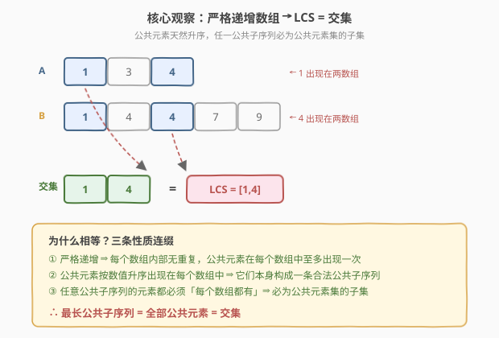
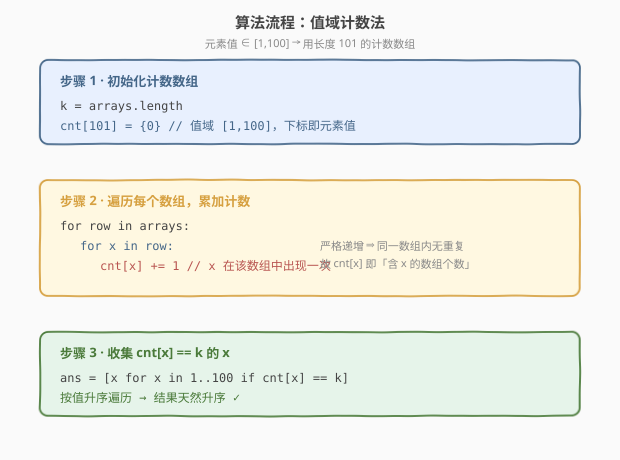
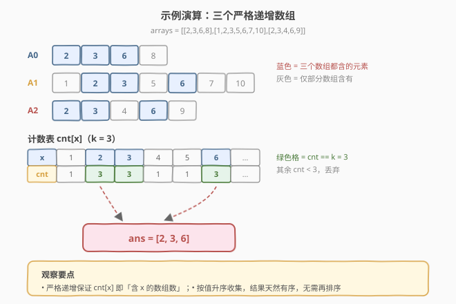

# LeetCode 排序数组之间的最长公共子序列 题解

## 1. 题目概述

- **标题 / 题号**：排序数组之间的最长公共子序列（#1940，medium）
- **链接**：https://leetcode.cn/problems/longest-common-subsequence-between-sorted-arrays/
- **难度**：中等
- **标签**：数组、哈希表、计数

**题意**：给定一个由整数数组组成的数组 `arrays`，其中每个 `arrays[i]` 都是**严格递增**排序的。返回一个**所有数组均包含**的**最长公共子序列**，结果也必须是升序数组。

- **子序列**是从另一个序列派生出来的序列，删除一些元素或不删除任何元素，而不改变其余元素的顺序。

**示例 1**：

```text
输入：arrays = [[1,3,4],[1,4,7,9]]
输出：[1,4]
解释：这两个数组中的最长公共子序列是 [1,4]。
```

**示例 2**：

```text
输入：arrays = [[2,3,6,8],
              [1,2,3,5,6,7,10],
              [2,3,4,6,9]]
输出：[2,3,6]
解释：这三个数组中的最长公共子序列是 [2,3,6]。
```

**示例 3**：

```text
输入：arrays = [[1,2,3,4,5],[6,7,8]]
输出：[]
解释：这两个数组之间没有公共子序列。
```

**约束**：

- $2 \le \text{arrays.length} \le 100$
- $1 \le \text{arrays[i].length} \le 100$
- $1 \le \text{arrays[i][j]} \le 100$
- `arrays[i]` 是严格递增排序

> 💡 **审题关键**：① **严格递增**是题眼——每个数组内部无重复值，公共元素在每个数组中至多出现一次；② 要求「**所有**数组均包含」的子序列，即元素必须在每个数组中都出现；③ 元素值域极小（$[1,100]$），可直接用值域计数数组；④ 题目看似「最长公共子序列（LCS）」这一经典 NP-难题的变种，但「排序 + 严格递增」两个约束把它降维成了求**交集**。

## 2. 解题思路

### 2.1 暴力思路：套用经典 LCS

最朴素的想法：把「最长公共子序列」当作经典 DP 问题套用。两个序列的 LCS 用二维 DP（参考 [1143. 最长公共子序列](../1101-1200/1143_最长公共子序列.md)），$k$ 个序列则需要 $k$ 维 DP，状态数为 $\prod_i |arrays[i]|$，再乘上转移代价。

- **正确性**：穷举所有下标组合，理论上能覆盖。
- **效率**：$k$ 维 DP 的状态空间是 $\prod_i n_i$，本题 $k \le 100$、$n_i \le 100$，状态数达 $100^{100}$，完全不可行。

> ⚠️ 经典 LCS 在序列数 $k \ge 3$ 时是 NP-hard。本题之所以可解，全靠「**严格递增**」这一约束——它把「子序列顺序」问题转化为「元素是否都出现」的集合问题。继续套用通用 LCS 的 DP 思路，会完全忽略这个关键约束，走入死胡同。

### 2.2 核心观察：严格递增 → LCS = 交集



整个解法建立在一个关键定理上：

> **当所有数组都严格递增时，最长公共子序列 = 所有数组的交集（按值升序）。**

证明分三步：

**① 严格递增 ⇒ 每个数组内部无重复**

`arrays[i]` 严格递增意味着同一值在其中至多出现一次。所以「某值 $x$ 在 `arrays[i]` 中出现」是一个布尔事实，不存在「出现几次」的歧义。

**② 公共元素本身构成一条合法公共子序列**

设公共元素集为 $C = \{x \mid x \text{ 出现在每个数组中}\}$。把 $C$ 中元素按值升序排列得 $c_1 < c_2 < \dots < c_m$。由于每个数组都是严格递增的，$c_1, c_2, \dots, c_m$ 在每个数组中的出现下标也严格递增——即它们作为子序列的相对顺序在所有数组中一致。所以 $C$ 本身是一条合法的公共子序列，长度为 $|C|$。

**③ 任意公共子序列必为 $C$ 的子集**

若某条子序列 $S$ 是所有数组的公共子序列，则 $S$ 中每个元素都必须出现在每个数组中，即 $S \subseteq C$。故 $|S| \le |C|$。

由 ② 和 ③，$C$ 就是最长的公共子序列。$\blacksquare$

$$\boxed{\text{LCS}(\text{arrays}) = \bigcap_{i} \text{arrays}[i] \quad(\text{每个数组严格递增时})}$$

> 💡 **降维的本质**：经典 LCS 的难点在于「下标顺序」——子序列要求相对顺序保持。但严格递增让「值的大小关系」与「下标顺序」完全一致，顺序约束自动满足，于是问题退化为纯集合运算——求每个数组都出现的元素。

### 2.3 算法流程图



由 2.2，只需找出「在每个数组中都出现」的元素。配合**元素值域 $[1,100]$ 极小**这一约束，用值域计数数组最直接：

1. **初始化** `cnt[101] = {0}`（下标即元素值，长度 101 覆盖 $0..100$，下标 0 不用）。
2. **遍历计数**：对每个数组 `row`，对其中每个元素 `x` 执行 `cnt[x] += 1`。
   - 严格递增保证同一数组内无重复，故 `cnt[x]` 最终等于「含 $x$ 的数组个数」。
3. **收集结果**：从 $1$ 到 $100$ 升序遍历 `cnt`，凡 `cnt[x] == k`（$k$ 为数组个数）的 $x$ 加入答案。
   - 按值升序遍历，结果天然升序，无需再排序。

> ⚠️ **为何 `cnt[x] == k` 而非 `cnt[x] >= k`**？严格递增保证 $x$ 在单个数组中至多出现一次，故 $x$ 出现的总次数即「含 $x$ 的数组个数」。要「所有数组都含 $x$」，即次数等于数组总数 $k$。

### 2.4 示例演算

以示例 2 `arrays = [[2,3,6,8],[1,2,3,5,6,7,10],[2,3,4,6,9]]` 演示完整流程：



**第一步 · 遍历计数**

| 元素 $x$ | 在 A0 | 在 A1 | 在 A2 | cnt | $== k=3$？ |
|----------|:-----:|:-----:|:-----:|:---:|:---------:|
| 1 | ✗ | ✓ | ✗ | 1 | ✗ |
| **2** | ✓ | ✓ | ✓ | **3** | **✓** |
| **3** | ✓ | ✓ | ✓ | **3** | **✓** |
| 4 | ✗ | ✗ | ✓ | 1 | ✗ |
| 5 | ✗ | ✓ | ✗ | 1 | ✗ |
| **6** | ✓ | ✓ | ✓ | **3** | **✓** |
| 7 | ✗ | ✓ | ✗ | 1 | ✗ |
| 8 | ✓ | ✗ | ✗ | 1 | ✗ |
| 9 | ✗ | ✗ | ✓ | 1 | ✗ |
| 10 | ✗ | ✓ | ✗ | 1 | ✗ |

**第二步 · 收集**

按值升序取 `cnt[x] == 3` 的 $x$：$2, 3, 6$ → `ans = [2, 3, 6]`，与官方答案一致 ✓。

> 💡 **对照示例 3**：`arrays = [[1,2,3,4,5],[6,7,8]]`，两数组值域不交，所有 `cnt[x] ≤ 1 < k=2`，答案为空数组 `[]`。

## 3. 参考代码

### C++

```cpp
class Solution {
public:
    vector<int> longestCommonSubsequence(vector<vector<int>>& arrays) {
        int cnt[101]{};
        int k = arrays.size();
        for (const auto& row : arrays) {
            for (int x : row) {
                ++cnt[x];
            }
        }
        vector<int> ans;
        for (int x = 1; x <= 100; ++x) {
            if (cnt[x] == k) ans.push_back(x);
        }
        return ans;
    }
};
```

### Python

```python
class Solution:
    def longestCommonSubsequence(self, arrays: list[list[int]]) -> list[int]:
        cnt = [0] * 101
        k = len(arrays)
        for row in arrays:
            for x in row:
                cnt[x] += 1
        return [x for x in range(1, 101) if cnt[x] == k]
```

> 💡 **写法要点**：① 计数数组长度取 101，下标即元素值，省去哈希开销，常数最小；② 收集时从 $1$ 升序遍历到 $100$，结果天然升序，无需 `sort`；③ 严格递增是「`cnt[x] == k` 判定」成立的前提——若数组非严格递增（允许重复），同一数组内 $x$ 可能出现多次，`cnt[x]` 会虚高，需改用「每数组去重后再计数」或第 5 节的多指针法。

> ⚠️ **若值域不限于** $[1,100]$：把 `cnt` 换成 `unordered_map<int, int>`，最后需对键排序（或遍历时维护最小/最大值确定范围）。时间复杂度变为 $O(N \log N)$（排序键）或 $O(N + V)$（$V$ 为值域跨度），见第 5 节。

## 4. 复杂度分析

| 维度 | 复杂度 | 说明 |
|------|--------|------|
| **时间** | $O(N + V)$ | 遍历所有元素计数 $O(N)$（$N = \sum_i \lvert\text{arrays}[i]\rvert \le 10^4$）+ 升序扫描值域 $O(V)$（$V = 101$）；值域为常数，故 $O(N)$ |
| **空间** | $O(V)$ | 计数数组 `cnt[101]`，$V = 101$ 为常数，故 $O(1)$；不计返回答案 |

> 💡 本题的线性复杂度完全得益于两个约束的叠加：**严格递增**把 LCS 降维为求交集，**值域 $[1,100]$** 把交集运算降维为值域计数。去掉任一约束，复杂度都会上升——见第 5 节。

## 5. 扩展：多指针求交集（任意值域）

若去掉「值域 $[1,100]$」的约束（元素为任意大整数），计数数组不再适用，但「严格递增 ⇒ LCS = 交集」的结论仍成立。此时可用**多指针归并求交集**——这是 $k$ 个有序列表求交集的经典做法，复杂度不依赖值域。

### 5.1 算法思路

维护 $k$ 个指针 `p[i]`，分别指向 `arrays[i]` 的当前位置。每轮：

1. 取当前 $k$ 个指针所指元素的最大值 `mx`（即「最落后的右端」）。
2. 凡 `arrays[i][p[i]] < mx` 的指针，向前推进直到不小于 `mx`（利用严格递增，二分可加速）。
3. 若推进后所有指针都指向 `mx`，说明 `mx` 在所有数组中出现 → 加入答案，所有指针各前进一格。
4. 否则回到第 1 步。

### 5.2 参考代码

```cpp
class Solution {
public:
    vector<int> longestCommonSubsequence(vector<vector<int>>& arrays) {
        int k = arrays.size();
        vector<int> p(k, 0), ans;
        while (true) {
            bool done = false;
            for (int i = 0; i < k; ++i) {
                if (p[i] == (int)arrays[i].size()) { done = true; break; }
            }
            if (done) break;

            int mx = arrays[0][p[0]];
            for (int i = 1; i < k; ++i) mx = max(mx, arrays[i][p[i]]);

            bool allEq = true;
            for (int i = 0; i < k; ++i) {
                while (p[i] < (int)arrays[i].size() && arrays[i][p[i]] < mx) ++p[i];
                if (p[i] == (int)arrays[i].size()) { done = true; break; }
                if (arrays[i][p[i]] != mx) allEq = false;
            }
            if (done) break;
            if (allEq) {
                ans.push_back(mx);
                for (int i = 0; i < k; ++i) ++p[i];
            }
        }
        return ans;
    }
};
```

> 💡 **复杂度**：每个元素至多被访问常数次（线性推进版）或被二分跳过（$O(\log n_i)$ 每轮），总时间 $O(N)$（线性）或 $O(N \log(\max n_i))$（二分版），空间 $O(k)$ 仅指针数组，不依赖值域。这是处理「有序列表求交集」的通用范式，常见于搜索引擎倒排表合并。

> ⚠️ **两种解法对照**：值域计数法依赖 $V$ 小（本题 $V=100$ 甜区），实现极简；多指针法不依赖值域，但实现复杂、常数较大。本题 $V \ll N$，计数法是首选；若面试官追问「值域很大怎么办」，再抛出多指针法作为 follow-up。

## 6. 面试要点

**Q1：为什么严格递增数组的最长公共子序列等于交集？**

> 三步：① 严格递增 ⇒ 每个数组内部无重复，公共元素在每个数组中至多一次；② 公共元素按值升序在每个数组中下标也升序，本身构成合法公共子序列；③ 任意公共子序列的元素必须每个数组都有，故是公共元素集的子集。由 ② 和 ③，公共元素集就是最长的。

**Q2：为什么 `cnt[x] == k` 就代表 $x$ 在所有数组中出现？**

> 严格递增保证 $x$ 在单个数组中至多出现一次，所以遍历所有数组累计的 `cnt[x]` 恰好等于「含 $x$ 的数组个数」。等于 $k$（数组总数）即「每个数组都含 $x$」。若数组允许重复，此判定失效，需先对每数组去重。

**Q3：如果元素值域不是 $[1,100]$ 而是任意整数，怎么改？**

> 两种方案：① 仍用计数，但把数组换成哈希表 `unordered_map<int,int>`，收集时对键排序，时间 $O(N \log N)$；② 改用第 5 节的多指针归并求交集，时间 $O(N)$、空间 $O(k)$，不依赖值域——这是更通用的做法。

**Q4：本题和经典 LCS（如 1143）有何本质区别？**

> 经典 LCS 的难点在「下标顺序约束」——子序列要求相对顺序保持，需要 DP 对齐下标。本题的「严格递增」让值的大小关系与下标顺序完全一致，顺序约束自动满足，问题退化为集合运算（求交集）。同样的降维思路见 [349. 两个数组的交集](https://leetcode.cn/problems/intersection-of-two-arrays/)（排序后双指针求交集）。

**Q5：为什么结果天然升序，无需排序？**

> 计数法按值 $1 \to 100$ 升序遍历 `cnt`，收集顺序即值升序；多指针法每轮取当前最大值 `mx` 加入答案，`mx` 单调递增。两种解法都因「严格递增 ⇒ 公共元素按值升序」而天然有序。

> 💡 **一句话总结**：严格递增让 LCS 退化为求交集，值域 $[1,100]$ 让交集运算退化为值域计数——两重降维后，三步线性 $O(N)$ 即可解决这个看似 NP-hard 的变种。

## 同类练习题

| # | 题目 | 与本题的关联 |
|---|------|-------------|
| 1143 | [最长公共子序列](https://leetcode.cn/problems/longest-common-subsequence/)（[题解](../1101-1200/1143_最长公共子序列.md)） | 经典 LCS 二维 DP 母题，对照体会「无序序列需 DP 对齐下标」与本题「有序序列退化为求交集」的差异 |
| 349 | [两个数组的交集](https://leetcode.cn/problems/intersection-of-two-arrays/) | 排序 + 双指针求两数组交集，是本题多指针解法在 $k=2$ 时的特例，思路同源 |
| 718 | [最长重复子数组](https://leetcode.cn/problems/maximum-length-of-repeated-subarray/)（[题解](../0701-0800/718_最长重复子数组.md)） | 求最长公共**子串**（连续），需 DP 且不匹配归零，对照本题「子序列 vs 子串」的解法分野 |
| 2248 | [多个数组求交集](https://leetcode.cn/problems/intersection-of-multiple-arrays/) | 本质与本题完全相同（多个升序数组求交集），题面更直白，可作为本题的等价练习 |
| 1213 | [三个有序数组求交集](https://leetcode.cn/problems/intersection-of-three-sorted-arrays/)🔒 | 三指针求交集，是本题多指针解法在 $k=3$ 时的特例，适合先练手再推广到 $k$ 个 |
