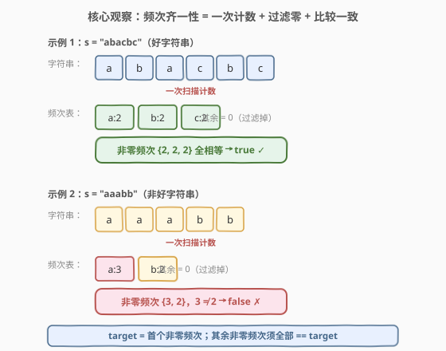
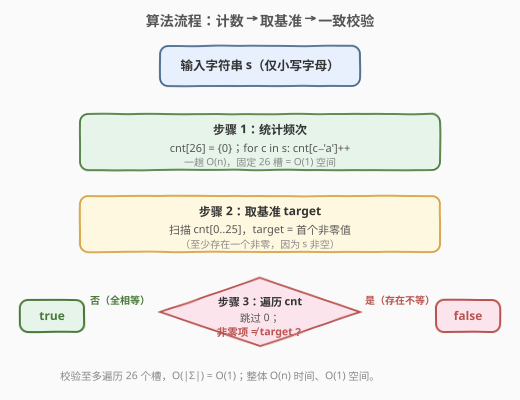
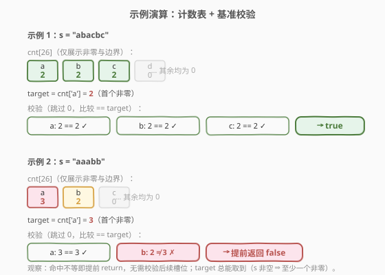

# 检查是否所有字符出现次数相同

- **题目名称**：检查是否所有字符出现次数相同
- **链接**：[1941. 检查是否所有字符出现次数相同](https://leetcode.cn/problems/check-if-all-characters-have-equal-number-of-occurrences/)
- **难度**：简单
- **标签**：哈希表、字符串、计数

## 1. 题目概述

给你一个字符串 $s$，如果 $s$ 是一个**好**字符串，返回 `true`，否则返回 `false`。好字符串的定义是：$s$ 中**出现过的所有字符**的出现次数**相同**。

**示例 1**：

```text
输入：s = "abacbc"
输出：true
解释：s 中出现过的字符为 'a'、'b'、'c'，三者均出现 2 次。
```

**示例 2**：

```text
输入：s = "aaabb"
输出：false
解释：s 中出现过的字符为 'a'、'b'。'a' 出现 3 次，'b' 出现 2 次，次数不同。
```

**约束条件**：

- $1 \le \text{s.length} \le 1000$
- $s$ 只包含小写英文字母

> 💡 **审题关键**：① 只关心**出现过的**字符——未出现的字符（频次为 0）不参与比较，需过滤；② 「次数相同」指的是所有非零频次取同一值，等价于「非零频次集合的大小为 1」；③ 字符集仅为 26 个小写字母，是定长频次数组 $O(1)$ 空间的天然信号。

---

## 2. 解题思路

### 2.1 暴力思路：排序后按字符分组比较

最直觉的做法：把 $s$ 排序，相同字符便聚成连续段；逐段数出长度，比较所有段长是否相等。

```text
排序 "abacbc" → "aabbcc" → 段长 [2, 2, 2] → 全等 → true
排序 "aaabb"   → "aaabb"  → 段长 [3, 2]    → 不等 → false
```

- **正确性**：排序后同字符相邻，段长即该字符频次，段长全相等即「好字符串」定义。
- **效率**：时间 $O(n \log n)$（排序主导），空间 $O(n)$（排序需拷贝字符串）。能 AC，但**没有利用「只需频次」这一结构**——排序回答了一个比题目更强的疑问（字符的字典序排列），远超「统计频次」所需。

> ⚠️ 排序法的浪费与 [242. 有效的字母异位词](../0201-0300/242_有效的字母异位词.md) 的排序解法同病：题目只需判断「频次分布是否齐一」，而排序把字符按字典序重排，做了 $O(n \log n)$ 的多余工作。可优化到 $O(n)$。

### 2.2 核心观察：频次齐一性判定（计数 + 取基准 + 一致校验）



关键洞察分三步：

**第一步：定长频次表。** 字符集只有 26 个小写字母，可用长度为 26 的数组 `cnt` 代替通用哈希表：`cnt[c - 'a']` 即字符 $c$ 的频次。一趟扫描 $s$ 即可填满，$O(n)$ 时间、$O(1)$ 空间（26 是与 $n$ 无关的常数）。

**第二步：取基准 target。** 扫描 `cnt`，取**首个非零值**作为基准 `target`。由于 $s$ 非空（$|s| \ge 1$），至少有一个字符出现过，故 `target` 必能取到。

**第三步：一致校验。** 继续扫描 `cnt` 的其余槽位：跳过 0（未出现字符不参与比较），每个非零项须等于 `target`；一旦发现不等立即返回 `false`。全部通过则返回 `true`。

$$\boxed{\text{target} = \text{首个非零 } \text{cnt}[i],\quad \forall\, \text{cnt}[i] > 0:\ \text{cnt}[i] \stackrel{?}{=} \text{target}}$$

> 💡 **为什么「取首个非零」是对的？** 若所有非零频次相同，则任取一个非零值作基准，其余必然与之相等；若存在不同频次，则基准与那个不同的值必在某一步被比较出来。所以基准的选取不影响正确性，只影响代码简洁度——「首个非零」无需额外判断、最易实现。

> ⚠️ **易错点：忘记过滤零。** 若不过滤 0 而直接比较，会把「未出现的字符」误判为「频次与 target 不同」从而返回 `false`。例如 `"aabb"` 的 `cnt` 中 `c..z` 均为 0，但 0 不应参与比较——好字符串的判定只针对**出现过的**字符。

### 2.3 算法流程图



整体为「一趟计数 + 一趟校验」的线性流程：

1. **计数**：`cnt[26] = {0}`，遍历 $s$ 执行 `cnt[c - 'a']++`。
2. **取基准**：扫描 `cnt[0..25]`，`target = ` 首个非零值。
3. **校验**：继续扫描 `cnt`，跳过 0，非零项 $\ne$ `target` 则立即 `return false`。
4. **通过**：全部非零项相等，`return true`。

> 💡 **提前返回**：校验阶段一旦命中不等即可 `return false`，无需扫描完所有 26 个槽。最坏情况（全部相等或末位才不等）才扫满 26，但 26 是常数，渐近仍为 $O(1)$。

### 2.4 示例演算

以两个官方示例演示计数表与基准校验过程：



**示例 1**（`s = "abacbc"`）：

| 字符 | 频次 | 与 target 比较 | 结果 |
|------|------|----------------|------|
| a | 2 | — | 取为 target = 2 |
| b | 2 | $2 = 2$ | ✓ |
| c | 2 | $2 = 2$ | ✓ |
| d..z | 0 | 跳过 | — |

全部非零项相等 → 返回 `true` ✓

**示例 2**（`s = "aaabb"`）：

| 字符 | 频次 | 与 target 比较 | 结果 |
|------|------|----------------|------|
| a | 3 | — | 取为 target = 3 |
| b | 2 | $2 \ne 3$ | ✗ 提前返回 |
| c..z | 0 | — | — |

`b` 的频次 $2 \ne 3$，立即返回 `false` ✓

> 💡 **观察要点**：① `target` 总取首个非零（字母序最小的出现字符），其值即「期望频次」；② 命中不等即提前 `return`，校验步至多遍历 26 槽；③ 未出现字符（频次 0）被 `continue` 跳过，不干扰判定。

---

## 3. 参考代码

### C++（定长频次数组 + 基准校验）

```cpp
class Solution {
public:
    bool areOccurrencesEqual(string s) {
        int cnt[26] = {0};
        for (char c : s) ++cnt[c - 'a'];
        int target = 0;
        for (int x : cnt) {
            if (x == 0) continue;
            if (target == 0) target = x;
            else if (x != target) return false;
        }
        return true;
    }
};
```

### Python（定长频次数组 + 基准校验）

```python
class Solution:
    def areOccurrencesEqual(self, s: str) -> bool:
        cnt = [0] * 26
        for c in s:
            cnt[ord(c) - ord('a')] += 1
        target = 0
        for x in cnt:
            if x == 0:
                continue
            if target == 0:
                target = x
            elif x != target:
                return False
        return True
```

### Python（`collections.Counter` 一行流）

```python
from collections import Counter

class Solution:
    def areOccurrencesEqual(self, s: str) -> bool:
        return len(set(Counter(s).values())) == 1
```

> 💡 **写法对照**：① 定长数组版直接翻译思路，显式体现「26 槽 + 取基准 + 一致校验」三步，面试默认先写这版；② `Counter` 一行流用 `set` 去重频次值——若所有出现字符频次相同，则 `values()` 去重后只剩 1 个元素，`len(...) == 1` 即真，Pythonic 且紧凑；③ 两版时间同为 $O(n)$，`Counter` 版底层为哈希表，常数略大但 $n \le 1000$ 无差异。

> ⚠️ **`Counter` 一行流的隐含过滤**：`Counter(s)` 只记录出现过的字符，未出现的字符不在 `values()` 中——天然过滤了零，无需手动 `continue`。这正是 `len(set(...)) == 1` 成立的前提。若改用 `cnt[26]` 数组，则必须显式跳过 0。

---

## 4. 复杂度分析

| 维度 | 排序法 | 频次表法 | 说明 |
|------|--------|----------|------|
| 时间复杂度 | $O(n \log n)$ | $O(n)$ | 排序法由排序主导；频次表法一趟计数 $O(n)$ + 一趟校验 $O(|\Sigma|)=O(1)$ |
| 空间复杂度 | $O(n)$ | $O(1)$ | 排序需拷贝字符串；频次表仅 26 槽，与 $n$ 无关 |

> 💡 $|\Sigma|=26$ 为字符集大小。频次表法的校验步至多遍历 26 个槽，渐近 $O(1)$，故整体由计数步的 $O(n)$ 主导。$n \le 1000$ 远在时限内。

---

## 5. 扩展：字符集泛化与 Counter 妙用

### 5.1 Unicode 字符集：数组 → 哈希表

本题字符集仅为 26 个小写字母，定长数组最合适。若字符集扩大为 Unicode（如中文、emoji），`cnt[26]` 不再适用，应改用 `HashMap`/`dict`：

```python
def areOccurrencesEqual(self, s: str) -> bool:
    cnt = {}
    for c in s:
        cnt[c] = cnt.get(c, 0) + 1
    return len(set(cnt.values())) == 1
```

复杂度从 $O(n) + O(26)$ 变为 $O(n) + O(k)$，其中 $k$ 为 $s$ 中不同字符数（$k \le n$）。渐近时间仍为 $O(n)$，空间 $O(k)$。

> 💡 这与 [242. 有效的字母异位词](../0201-0300/242_有效的字母异位词.md) 的「进阶：Unicode 适配」是同一思路——定长数组适用于小而连续的字符集，哈希表适用于大而稀疏的字符集，两者骨架一致（计数 → 比较），只是容器不同。

### 5.2 `len(set(values)) == 1` 的普适性

「所有非零频次相同」等价于「非零频次集合的大小为 1」。这一判据在 Python 中可一行表达：

```python
len(set(Counter(s).values())) == 1
```

- `Counter(s).values()` 给出所有出现字符的频次（天然无零）；
- `set(...)` 去重；
- `len(...) == 1` 即「所有频次取同一值」。

该写法适用于任何「齐一性判定」场景：校验各科成绩是否全相同、各桶负载是否均衡等，是 Python 工程中值得收藏的惯用法。

> ⚠️ 若需在 $k$ 很大时追求极致性能，`set` 构造需 $O(k)$ 且无法提前返回。可改用基准校验版（首个非零作 target，命中不等即 `return`），平均更优。本题 $k \le 26$，差异可忽略。

---

## 6. 面试要点

**Q1：为什么要过滤频次为 0 的字符？**

> 题目定义的「好字符串」只要求**出现过的**字符次数相同。未出现的字符频次为 0，不参与比较。若不过滤 0，会把 `c..z`（频次 0）误判为「与 target 不同」从而错返 `false`。例如 `"aabb"` 是好字符串（a、b 各 2 次），但其 `cnt` 中 0 占多数，必须 `continue` 跳过。

**Q2：「取首个非零作 target」为什么正确？能否取别的值？**

> 若所有非零频次相同，任取一个非零值作基准，其余必与之相等；若存在不同，基准与那个异类必在某步被比较出来。故基准选取不影响正确性。「首个非零」无需额外判断、最易实现，是工程上的自然选择。也可取 `cnt` 中任意非零项，甚至取 `max`/`min`——但首个非零最简洁。

**Q3：排序法和频次表法各有什么取舍？**

> 排序法 $O(n \log n)$ 时间、$O(n)$ 空间，直觉但未利用「只需频次」的结构，做了多余的字典序重排；频次表法 $O(n)$ 时间、$O(1)$ 空间（26 槽），一趟计数 + 一趟校验，渐近更优且常数极小。$n \le 1000$ 时两者都能 AC，但频次表法体现了「识别固定字符集 → 定长数组降空间」的通用思维，是面试期望的解法。

**Q4：如果字符集是 Unicode 怎么办？**

> 把定长数组换成哈希表（`dict` / `HashMap`）。骨架不变：一趟计数 + 一致校验。复杂度从 $O(n) + O(26)$ 变为 $O(n) + O(k)$（$k$ 为不同字符数），渐近仍 $O(n)$。Python 中直接用 `collections.Counter` 即天然支持任意字符。这与 242 题「进阶 Unicode」同思路。

**Q5：`len(set(Counter(s).values())) == 1` 为什么成立？**

> `Counter(s)` 只记录出现过的字符，`values()` 天然不含 0（隐含过滤）。若所有出现字符频次相同，则 `values()` 去重后只剩 1 个元素，`len(set(...)) == 1` 为真；若有不同频次，则去重后至少 2 个元素，判定为假。该写法把「齐一性」转化为「集合基数」，Pythonic 且一行表达，但无法提前返回，$k$ 大时不如基准校验版。

> 💡 **一句话总结**：定长频次表 $O(n)$ 计数 + 取首个非零作 target + 跳过 0 一致校验 = 好字符串判定；本质是「非零频次集合大小为 1」。

---

## 7. 同类练习题

- [242. 有效的字母异位词](https://leetcode.cn/problems/valid-anagram/)（[题解](../0201-0300/242_有效的字母异位词.md)）：同样用字符频次表判定，只是从「单串内频次齐一」翻转为「两串间频次多重集相同」，共享「计数 + 比较」骨架，对照排序法 vs 频次表法的取舍
- [387. 字符串中的第一个唯一字符](https://leetcode.cn/problems/first-unique-character-in-a-string/)（[题解](../0301-0400/387_字符串中的第一个唯一字符.md)）：同一套 26 槽频次表，从「判定齐一」变为「查询首个频次为 1 的位置」，体会计数骨架的不同用法
- [451. 根据字符出现频率排序](https://leetcode.cn/problems/sort-characters-by-frequency/)（[题解](../0401-0500/451_根据字符出现频率排序.md)）：频次计数 + 按频次排序输出，频次家族的排序应用，对照本题只判定不排序的简洁性
- [389. 找不同](https://leetcode.cn/problems/find-the-difference/)（[题解](../0301-0400/389_找不同.md)）：频次计数找差异字符，再次体会「计数 + 比较」在不同问题中的变形
