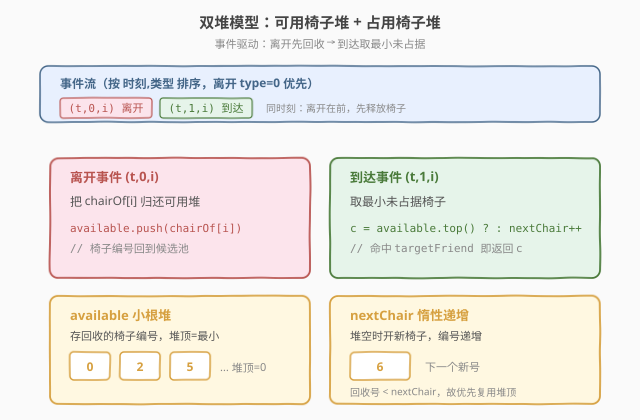
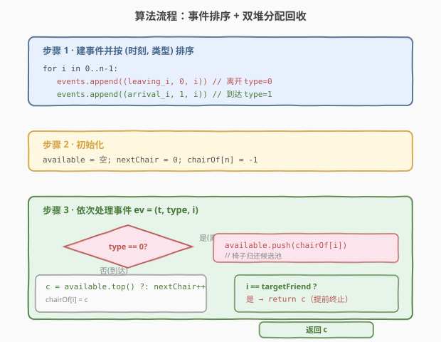
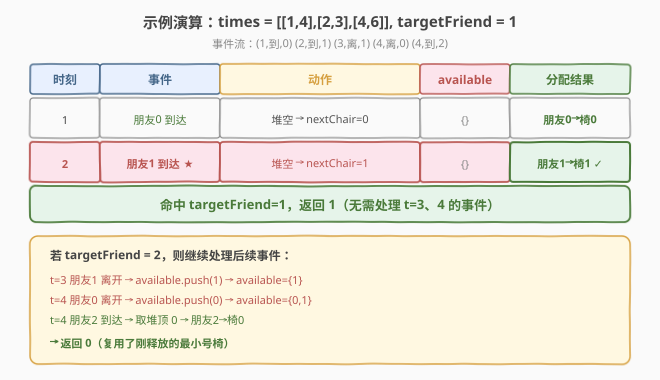

# LeetCode 最小未被占据椅子的编号 题解

## 1. 题目概述

- **标题 / 题号**：最小未被占据椅子的编号（#1942，medium）
- **链接**：https://leetcode.cn/problems/the-number-of-the-smallest-unoccupied-chair/
- **难度**：中等
- **标签**：堆（优先队列）、排序、模拟、事件驱动

**题意**：有 `n` 个朋友在举办派对，编号 `0` 到 `n-1`。派对里有**无数**张椅子，编号 `0` 到 `infinity`。当一个朋友到达时，占据**编号最小**且未被占据的椅子；当朋友离开时，椅子立刻变为未占据。若同一时刻有人离开和到达，离开先释放椅子，到达者可立即占据。

给定 `times[i] = [arrival_i, leaving_i]` 和 `targetFriend`，所有到达时刻互不相同，返回 `targetFriend` 占据的椅子编号。

**示例 1**：

```text
输入：times = [[1,4],[2,3],[4,6]], targetFriend = 1
输出：1
解释：
- 朋友 0 时刻 1 到达，占据椅子 0。
- 朋友 1 时刻 2 到达，占据椅子 1。
- 朋友 1 时刻 3 离开，椅子 1 释放。
- 朋友 0 时刻 4 离开，椅子 0 释放。
- 朋友 2 时刻 4 到达，占据椅子 0。
朋友 1 占据椅子 1，返回 1。
```

**示例 2**：

```text
输入：times = [[3,10],[1,5],[2,6]], targetFriend = 0
输出：2
解释：
- 朋友 1 时刻 1 到达，占据椅子 0。
- 朋友 2 时刻 2 到达，占据椅子 1。
- 朋友 0 时刻 3 到达，占据椅子 2。
朋友 0 占据椅子 2，返回 2。
```

**约束**：

- $n = \text{times.length}$
- $2 \le n \le 10^4$
- $\text{times[i].length} = 2$
- $1 \le \text{arrival}_i < \text{leaving}_i \le 10^5$
- $0 \le \text{targetFriend} \le n - 1$
- 每个 $\text{arrival}_i$ 互不相同

> 💡 **审题关键**：① 椅子编号从 0 开始递增，新到者取「最小未占据」——这正是**小根堆**的自然语义；② 同一时刻离开先于到达，需在事件排序中保证「离开事件 < 到达事件」；③ 只关心 `targetFriend` 的椅子，但分配取决于此前所有朋友的进出，故必须**完整模拟到 targetFriend 到达为止**。

## 2. 解题思路

### 2.1 暴力思路：逐时刻扫描

最朴素的做法：按时间轴逐个时刻推进，在每个时刻先处理离开（释放椅子），再处理到达（从 `0` 号椅子开始线性查找第一个未被占据的）。

- **正确性**：忠实模拟，显然正确。
- **效率**：时刻范围达 $10^5$，每个到达时刻需 $O(n)$ 扫描椅子、$O(n)$ 检查占用，总体 $O(n^2)$。当 $n = 10^4$ 时约 $10^8$ 量级，勉强但不优雅；更关键的是「逐时刻」在时刻稀疏时大量空转。

> ⚠️ 暴力做法暴露两个瓶颈：① 找「最小未占据椅子」需线性扫描；② 逐时刻推进有空转。两者都可用**堆 + 事件驱动**消除。

### 2.2 核心观察：两个小根堆 + 事件驱动



把「椅子」和「时间」解耦为两条数据流：

- **可用椅子堆**（`available`）：小根堆，存当前空闲的椅子编号。取堆顶即「最小未占据椅子」，$O(\log n)$。
- **占用椅子堆**（`occupied`）：小根堆，按**离开时刻**排序，存 `(离开时刻, 椅子编号)`。到达时先把堆顶所有 $\text{leaving} \le \text{当前到达时刻}$ 的元素弹出、椅子归还 `available`。

**事件排序**的关键：将每个朋友拆成「到达」和「离开」两个事件，按 `(时刻, 类型)` 排序，**同时刻离开优先**（类型值离开=0、到达=1）。这样处理到达时，同一时刻的离开已先回收椅子。

> 💡 **为什么离开优先？** 题目明确「同一时刻离开者释放椅子后，到达者可立即占据」。离开事件先执行，把椅子塞回 `available`，到达事件随后从 `available` 取最小——天然满足题意。

> ⚠️ **到达时刻互不相同**，但「某人的离开」可能等于「另一人的到达」。事件排序中离开类型优先正好覆盖此情形，无需额外特判。

### 2.3 椅子编号的来源：惰性递增

派对有无数椅子，但实际至多用到 $n$ 张（每个朋友最多占一张）。维护一个计数器 `nextChair`，从 0 递增：

- 分配时：若 `available` 非空，取堆顶（回收的旧椅子，编号更小）；否则用 `nextChair++`（开新椅子）。
- 这保证了「最小未占据」语义——回收的椅子编号一定小于 `nextChair`，优先复用。

### 2.4 算法流程图



整体三步：

1. **建事件**：对每个朋友 $i$，生成到达事件 $(\text{arrival}_i, 1, i)$ 和离开事件 $(\text{leaving}_i, 0, i)$。按 `(时刻, 类型)` 升序排序。
2. **初始化**：`available` 空堆、`occupied` 空堆、`nextChair = 0`、`chairOf[]` 记录每人椅子。
3. **处理事件**（按序）：
   - **离开事件** $(t, 0, i)$：把 `chairOf[i]` 压回 `available`。
   - **到达事件** $(t, 1, i)$：
     - 若 `available` 非空，`c = available.top(); pop()`；否则 `c = nextChair++`。
     - 记 `chairOf[i] = c`，把 $(t_{\text{leave}_i}, c)$ 压入 `occupied`。
     - 若 $i = \text{targetFriend}$，立即返回 $c$（无需继续模拟）。

> 💡 **提前终止**：只需模拟到 `targetFriend` 到达那一刻即可返回，无需处理后续事件——因为 `targetFriend` 的椅子在其到达瞬间已确定。

### 2.5 示例演算

以示例 1 `times = [[1,4],[2,3],[4,6]]`、`targetFriend = 1` 演示：



| 时刻 | 事件 | 动作 | available | occupied | nextChair | 分配结果 |
|------|------|------|-----------|----------|-----------|----------|
| 1 | 朋友 0 到达 | available 空 → 取 nextChair=0 | `{}` | `{(4,0)}` | 1 | 朋友0→椅0 |
| 2 | 朋友 1 到达 | available 空 → 取 nextChair=1 | `{}` | `{(4,0),(3,1)}` | 2 | **朋友1→椅1** |
| — | — | targetFriend=1 命中，返回 **1** | — | — | — | — |

> 💡 **注意**：示例 1 中 targetFriend=1 在时刻 2 到达时即命中，根本无需处理时刻 3、4 的事件——这正是「提前终止」的收益。若 targetFriend=2，则需继续：时刻 3 朋友 1 离开（椅 1 归入 available），时刻 4 朋友 0 离开（椅 0 归入 available）后朋友 2 到达，取 available 堆顶 0 号椅。

## 3. 参考代码

### C++

```cpp
class Solution {
public:
    int smallestChair(vector<vector<int>>& times, int targetFriend) {
        int n = times.size();
        vector<array<int,3>> events;
        for (int i = 0; i < n; ++i) {
            events.push_back({times[i][0], 1, i});
            events.push_back({times[i][1], 0, i});
        }
        sort(events.begin(), events.end());

        priority_queue<int, vector<int>, greater<int>> available;
        vector<int> chairOf(n, -1);
        int nextChair = 0;

        for (auto& ev : events) {
            int t = ev[0], type = ev[1], i = ev[2];
            if (type == 0) {
                available.push(chairOf[i]);
            } else {
                int c;
                if (available.empty()) {
                    c = nextChair++;
                } else {
                    c = available.top();
                    available.pop();
                }
                chairOf[i] = c;
                if (i == targetFriend) return c;
            }
        }
        return -1;
    }
};
```

### Python

```python
class Solution:
    def smallestChair(self, times: List[List[int]], targetFriend: int) -> int:
        events = []
        for i, (arr, leave) in enumerate(times):
            events.append((arr, 1, i))
            events.append((leave, 0, i))
        events.sort()

        available = []
        chair_of = {}
        next_chair = 0

        for t, etype, i in events:
            if etype == 0:
                heapq.heappush(available, chair_of[i])
            else:
                if available:
                    c = heapq.heappop(available)
                else:
                    c = next_chair
                    next_chair += 1
                chair_of[i] = c
                if i == targetFriend:
                    return c
        return -1
```

> 💡 **写法对照**：① C++ 用 `array<int,3>` 存事件，`sort` 默认按字典序——恰好 `(时刻, 类型, 编号)`，同时刻离开(type=0)在前；② Python 用元组列表 `events.sort()`，元组天然字典序，同样保证离开优先。两者都用 `greater` 小根堆保证堆顶为最小椅子号。

> ⚠️ **无需 `occupied` 堆**：本写法用**显式离开事件**驱动椅子回收，`available` 堆在离开事件时直接 push 回收的椅子，到达事件时 pop 取最小。无需像 5.1 那样在到达时惰性弹 `occupied`——事件排序已保证离开先于到达执行。

## 4. 复杂度分析

| 维度 | 复杂度 | 说明 |
|------|--------|------|
| 时间复杂度 | $O(n \log n)$ | 建事件 $O(n)$；排序 $O(n \log n)$；每个事件最多一次堆 push/pop（$O(\log n)$），共 $2n$ 个事件 $\Rightarrow O(n \log n)$ |
| 空间复杂度 | $O(n)$ | 事件数组 $O(n)$、`available` 堆至多 $n$、`chairOf` 数组 $O(n)$ |

> 💡 **为什么是 $O(n \log n)$ 而非 $O(n)$？** 关键在事件排序——$2n$ 个事件需整体排序以确定处理顺序。堆操作虽为 $O(\log n)$，但被排序的 $O(n \log n)$ 主导。若到达时刻本就有序（如已按 arrival 排好），可降为 $O(n \log n) \to O(n)$（仅堆操作），但本题无此保证。

## 5. 扩展：离线贪心与「最早离开」回收

### 5.1 用 occupied 堆在到达时惰性回收

另一种等价写法：只按**到达时刻**排序朋友，处理每个到达时先从 `occupied` 堆弹出所有 $\text{leaving} \le \text{当前 arrival}$ 的椅子归还 `available`，再分配。此法无需显式离开事件：

```cpp
sort(friends by arrival);
for each arriving friend i (in arrival order):
    while (!occupied.empty() && occupied.top().first <= arrival_i)
        available.push(occupied.top().second), occupied.pop();
    c = available.empty() ? nextChair++ : available.top(), available.pop();
    occupied.push({leaving_i, c});
    if (i == targetFriend) return c;
```

此法把「离开」隐式折叠进「到达时的惰性清理」，逻辑更紧凑。注意 $\le$ 而非 $<$：同一时刻离开先回收。两种写法等价，复杂度同为 $O(n \log n)$。

### 5.2 椅子数上界

虽题目说「无数椅子」，但实际至多开 $n$ 张——因为任一时刻在场的朋友数 $\le n$，且 `nextChair` 单调递增、每个朋友至多触发一次「开新椅」。故 `chairOf` 数组大小 $n$ 足够，空间 $O(n)$。

## 6. 面试要点

**Q1：为什么同时刻离开要排在到达之前？**

> 题目规定「离开者释放椅子后，到达者可立即占据」。事件按 `(时刻, 类型)` 排序、离开类型=0 优先，保证处理到达时同一时刻的离开已先把椅子归还 `available`，到达者能取到刚释放的小号椅子。

**Q2：`available` 堆和 `nextChair` 的分工是什么？**

> `available` 存回收的旧椅子（编号较小），`nextChair` 是未启用的新椅子计数器。分配时优先取 `available` 堆顶（最小回收号），堆空才用 `nextChair++`。这保证始终取「全局最小未占据号」——回收号一定 $< \text{nextChair}$。

**Q3：能否只模拟到 targetFriend 到达就停止？**

> 可以。`targetFriend` 的椅子在其**到达瞬间**确定，此后的事件不影响该椅子分配。故命中 `i == targetFriend` 即返回，无需处理后续离开/到达，最坏也只处理 $2n$ 个事件。

**Q4：`occupied` 堆是否必须？两种写法有何区别？**

> 非必须。写法一用**显式离开事件**驱动回收，`occupied` 仅记录不读取，可省；写法二在**到达时惰性弹** `occupied` 堆中所有 $\text{leaving} \le \text{arrival}$ 的椅子。两者等价、复杂度相同，写法二更紧凑、写法一更直观。

**Q5：如果到达时刻不互不相同会怎样？**

> 同一时刻多人到达时，分配顺序未定义会导致结果不确定。题目保证到达时刻互不相同正是消除歧义；若取消此约束，需补充「同时刻到达按朋友编号排序」等规则，算法结构不变。

> 💡 **一句话总结**：事件排序（离开优先）+ `available` 小根堆取最小椅子 + `nextChair` 惰性递增 → $O(n \log n)$ 模拟，命中 targetFriend 即返回。

## 同类练习题

| # | 题目 | 与本题的关联 |
|---|------|-------------|
| 1882 | [使用服务器处理任务](https://leetcode.cn/problems/process-tasks-using-servers/) | 同样双堆（空闲堆 + 忙堆）+ 事件驱动分配，是本题「服务器版」升级——权重和编号双重比较 |
| 1834 | [单线程 CPU](https://leetcode.cn/problems/single-threaded-cpu/) | 按时间推进 + 就绪任务堆，结构同本题的「到达时清理 + 取最优」范式 |
| 239 | [滑动窗口最大值](https://leetcode.cn/problems/sliding-window-maximum/) | 单调队列维护窗口最值，与本题「堆维护可用最小」对照体会「堆 vs 单调队列」在窗口问题中的取舍 |
| 253 | [会议室 II](https://leetcode.cn/problems/meeting-rooms-ii/)（会员题） | 区间最小组间分配，结构同本题——按开始时间排序 + 最小堆维护最早结束，是本题「求最小房间数」的镜像 |
