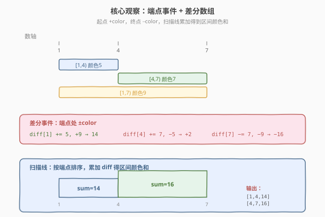
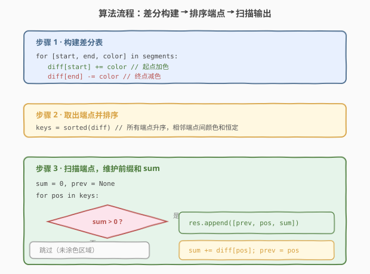
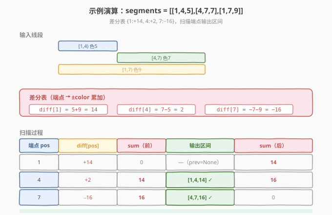

# 描述绘画结果

- **题目名称**：描述绘画结果
- **链接**：[1943. 描述绘画结果](https://leetcode.cn/problems/describe-the-painting/)
- **难度**：中等
- **标签**：差分数组、扫描线、排序、哈希表

## 1. 题目概述

数轴上有一幅画，由若干**半开区间**线段 `[start_i, end_i)` 表示，每条线段有**独一无二**的颜色 `color_i`。重叠部分的颜色会被**混合**，用一个**集合**表示；为简化输出，只需用集合中所有元素的**和**来代表该混合颜色。

要求用**最少数目**的不重叠半开区间表示最终的画，返回 `painting = [[left_j, right_j, mix_j], ...]`，其中 `mix_j` 是该区间内所有颜色之和。未被涂色的部分不出现在结果中。

**示例 1**：

```text
输入：segments = [[1,4,5],[4,7,7],[1,7,9]]
输出：[[1,4,14],[4,7,16]]
解释：
- [1,4) 颜色 {5,9}（和 14），来自第一和第三条线段。
- [4,7) 颜色 {7,9}（和 16），来自第二和第三条线段。
```

**示例 2**：

```text
输入：segments = [[1,7,9],[6,8,15],[8,10,7]]
输出：[[1,6,9],[6,7,24],[7,8,15],[8,10,7]]
解释：
- [1,6) 颜色 9（仅第一条）。
- [6,7) 颜色 {9,15}（和 24，第一+第二条）。
- [7,8) 颜色 15（仅第二条）。
- [8,10) 颜色 7（仅第三条）。
```

**示例 3**：

```text
输入：segments = [[1,4,5],[1,4,7],[4,7,1],[4,7,11]]
输出：[[1,4,12],[4,7,12]]
解释：
- [1,4) 颜色 {5,7}（和 12）。
- [4,7) 颜色 {1,11}（和 12）。
注意：不能合并为 [1,7,12]，因为两段的颜色集合不同。
```

**约束条件**：

- $1 \le \text{segments.length} \le 2 \times 10^4$
- $\text{segments}[i].\text{length} = 3$
- $1 \le \text{start}_i < \text{end}_i \le 10^5$
- $1 \le \text{color}_i \le 10^9$
- 每种颜色 $\text{color}_i$ **互不相同**

> 💡 **审题关键**：① 线段是**半开区间** `[start, end)`，端点处颜色恰好切换——这天然契合差分数组的「左加右减」；② 颜色互不相同，故「颜色集合」的「和」能无歧义地代表该段混合色（不同段只要和不同，集合必不同）；③ 要求**最少**不重叠区间——相邻端点之间的区域颜色和恒定，恰好是结果的一个区间，不可能再细分，故「按端点切分」即最优。

---

## 2. 解题思路

### 2.1 暴力思路：逐坐标累加

最朴素的做法：建一个长度为 $\max(\text{end}_i) + 1$ 的数组 `paint[]`，对每条线段把 `[start, end)` 内每个位置都加上 `color`。最后扫描数组，把颜色和相同的相邻位置合并成区间。

- **正确性**：忠实模拟每个位置的混合色。
- **效率**：坐标系达 $10^5$，线段达 $2 \times 10^4$，逐位置累加最坏 $O(n \cdot L) = O(2 \times 10^9)$，超时。

> ⚠️ 暴力做法暴露瓶颈：逐位置累加太慢。但注意到**颜色和只在端点处变化**——这正是差分数组的用武之地。

### 2.2 核心观察：差分数组 + 扫描线



**关键洞察**：在任意两个相邻端点之间，没有任何线段开始或结束，因此**活跃颜色集合不变**，颜色和恒定。所以：

1. **结果区间的边界**恰好是所有 `start_i` 和 `end_i` 的**去重排序**——不多不少。
2. 每个端点处，颜色和发生**突变**：起点处增加 `color`，终点处减少 `color`。

这恰好是**差分数组**的语义：

- 对每条线段 `[start, end, color]`：`diff[start] += color`，`diff[end] -= color`。
- 按端点排序后，**前缀和** `sum` 即为当前位置的颜色和。
- 相邻端点 `prev → pos` 之间，若 `sum > 0`，则 `[prev, pos, sum]` 是一个结果区间。

> 💡 **为什么用哈希表（有序映射）而非数组？** 坐标范围 $10^5$ 虽可用数组，但端点最多 $2n = 4 \times 10^4$ 个，用 `map`/排序键更省空间且天然有序。C++ 的 `std::map` 按 key 排序，一次遍历即可；Python 用 `dict` + `sorted()` 同理。

> ⚠️ **半开区间的妙处**：`[start, end)` 的差分是 `diff[start] += c, diff[end] -= c`。在端点 `end` 处，`sum` 先参与「输出 `[prev, end, sum]`」再减去 `c`——这保证 `end` 之前的区间含该色、之后不含，与半开语义一致。

### 2.3 算法流程图



整体三步：

1. **构建差分表**：遍历 `segments`，对每条 `[start, end, color]`，`diff[start] += color`，`diff[end] -= color`。
2. **取出端点并排序**：取 `diff` 的所有 key 升序排列。
3. **扫描端点**：维护 `sum = 0`、`prev = None`。对每个端点 `pos`：
   - 若 `prev != None` 且 `sum > 0`，输出 `[prev, pos, sum]`。
   - `sum += diff[pos]`，`prev = pos`。

> 💡 **为什么先输出再更新？** 在端点 `pos` 处，`sum` 是 `[prev, pos)` 这段的颜色和——它只受 `prev` 之前（含）的差分影响，`pos` 处的差分属于 `pos` 之后。所以先用旧 `sum` 输出 `[prev, pos]`，再用 `diff[pos]` 更新 `sum`。

### 2.4 示例演算

以示例 1 `segments = [[1,4,5],[4,7,7],[1,7,9]]` 演示：



**第一步：构建差分表**

| 线段 | diff[start] | diff[end] |
|------|-------------|-----------|
| [1,4,5] | diff[1] += 5 | diff[4] -= 5 |
| [4,7,7] | diff[4] += 7 | diff[7] -= 7 |
| [1,7,9] | diff[1] += 9 | diff[7] -= 9 |

合并后：`diff = {1: 14, 4: 2, 7: -16}`

**第二步：扫描端点**

| 端点 pos | diff[pos] | sum（前） | 输出 | sum（后） |
|----------|-----------|-----------|------|-----------|
| 1 | +14 | 0 | —（prev=None） | 14 |
| 4 | +2 | 14 | **[1,4,14]** ✓ | 16 |
| 7 | −16 | 16 | **[4,7,16]** ✓ | 0 |

最终结果：`[[1,4,14],[4,7,16]]`，与期望一致。

> 💡 **示例 3 的验证**：`segments = [[1,4,5],[1,4,7],[4,7,1],[4,7,11]]` → `diff = {1: 12, 4: 0, 7: -12}`。扫描：pos=1（sum→12），pos=4（sum=12>0 输出 `[1,4,12]`，sum+=0→12），pos=7（sum=12>0 输出 `[4,7,12]`，sum→0）。注意 `diff[4]=0` 但仍需作为端点切分——因为颜色集合在 4 处发生了变化（{5,7}→{1,11}），尽管和都是 12。

---

## 3. 参考代码

### C++

```cpp
class Solution {
public:
    vector<vector<long long>> splitPainting(vector<vector<int>>& segments) {
        map<int, long long> diff;
        for (auto& seg : segments) {
            diff[seg[0]] += seg[2];
            diff[seg[1]] -= seg[2];
        }
        vector<vector<long long>> res;
        long long sum = 0;
        int prev = -1;
        for (auto& [pos, delta] : diff) {
            if (prev != -1 && sum > 0) {
                res.push_back({prev, pos, sum});
            }
            sum += delta;
            prev = pos;
        }
        return res;
    }
};
```

### Python

```python
class Solution:
    def splitPainting(self, segments: List[List[int]]) -> List[List[int]]:
        diff = {}
        for start, end, color in segments:
            diff[start] = diff.get(start, 0) + color
            diff[end] = diff.get(end, 0) - color

        res = []
        sum_ = 0
        prev = None
        for pos in sorted(diff):
            if prev is not None and sum_ > 0:
                res.append([prev, pos, sum_])
            sum_ += diff[pos]
            prev = pos
        return res
```

> 💡 **写法对照**：① C++ 用 `map<int, long long>` 自动按 key 排序，遍历即升序；Python 用 `dict` + `sorted(diff)` 显式排序键。② 两者都在**输出后**才 `sum += delta`，保证 `[prev, pos)` 段用的是该段的颜色和。③ `color` 达 $10^9$、线段达 $2 \times 10^4$，和可达 $2 \times 10^{13}$，C++ 需 `long long`，Python 整数天然无溢出。

> ⚠️ **`prev = -1` vs `prev = None`**：C++ 中坐标 $\ge 1$，用 `-1` 作哨兵安全；Python 用 `None` 更语义化。两者都表示「尚未遇到第一个端点」，此时无区间可输出。

---

## 4. 复杂度分析

| 维度 | 复杂度 | 说明 |
|------|--------|------|
| 时间复杂度 | $O(n \log n)$ | 构建 `diff` 表 $O(n)$；排序端点 $O(n \log n)$（$2n$ 个端点）；扫描输出 $O(n)$。总计由排序主导 |
| 空间复杂度 | $O(n)$ | `diff` 表至多 $2n$ 个键值对；结果数组至多 $2n - 1$ 个区间 |

> 💡 **为什么是 $O(n \log n)$ 而非 $O(n + L)$？** 若用长度 $L = 10^5$ 的数组做差分，复杂度 $O(n + L)$，在 $L$ 较小时更快。但 `map`/排序键方案更通用（坐标系大时不退化），且 $n = 2 \times 10^4$ 时 $O(n \log n) \approx 3 \times 10^5$，远优于 $O(L) = 10^5$ 量级，两者均可接受。

---

## 5. 扩展：差分数组的两种实现

### 5.1 数组版差分（坐标系紧凑时）

当坐标系范围不大（如本题 $L \le 10^5$）时，可用定长数组代替 `map`，省去排序：

```cpp
vector<vector<long long>> splitPainting(vector<vector<int>>& segments) {
    int maxPos = 0;
    for (auto& s : segments) maxPos = max(maxPos, s[1]);
    vector<long long> diff(maxPos + 1, 0);
    for (auto& s : segments) {
        diff[s[0]] += s[2];
        diff[s[1]] -= s[2];
    }
    vector<vector<long long>> res;
    long long sum = 0;
    int prev = -1;
    for (int i = 1; i <= maxPos; ++i) {
        if (prev != -1 && sum > 0)
            res.push_back({prev, i, sum});
        sum += diff[i];
        if (diff[i] != 0) prev = i;   // 只在端点处更新 prev
        else if (prev == i - 1 && diff[i] == 0) {} // 连续非端点位置 prev 不变
    }
    return res;
}
```

> ⚠️ 上式需仔细处理 `prev` 的更新——只在 `diff[i] != 0`（即端点）处更新 `prev`。更简洁的写法是预先收集端点集合，只扫端点位置。`map` 方案天然只存端点，更不易出错。

### 5.2 端点事件去重 vs 差分累加

差分数组本质是「端点事件」的累加形式。也可显式建事件列表 `events = [(pos, delta), ...]`，按 `pos` 排序后扫描。与 `map` 方案的区别：

- **map 方案**：相同 `pos` 的多个 delta 自动合并（`diff[pos] += delta`），一次遍历即可。
- **事件列表**：相同 `pos` 的事件需在扫描时**合并处理**——先输出 `[prev, pos, sum]`，再把同 `pos` 的所有 delta 累加到 `sum`。若逐事件处理，可能错误地在同一 `pos` 处输出多个零宽区间。

> 💡 **`map` 的优势**：自动合并同 key 的 delta，避免零宽区间。这正是选用 `map`/`dict` 而非事件列表的原因。

---

## 6. 面试要点

**Q1：为什么结果区间的边界恰好是所有端点？**

> 两个相邻端点之间没有任何线段开始或结束，活跃颜色集合不变，颜色和恒定。所以这段区域不可再分，是一个最小结果区间。端点之外的位置不可能是边界——颜色和在那里不变。

**Q2：为什么用 `long long` 而非 `int`？**

> `color` 达 $10^9$，线段达 $2 \times 10^4$，最坏所有线段重叠时颜色和达 $2 \times 10^{13}$，超过 `int` 上界 $2.1 \times 10^9$。C++ 必须 `long long`；Python 整数无溢出风险。

**Q3：示例 3 中 `diff[4] = 0`，为何 4 仍是边界？**

> 颜色和虽未变（12→12），但颜色**集合**变了（{5,7}→{1,11}）。题目要求按集合区分，和相同但集合不同必须分段。差分数组在 `4` 处同时有 `+1+11` 和 `−5−7`，净变化为 0 但端点存在——`map` 保留了 `diff[4]=0` 这个键，扫描时仍以 4 为切分点，正确输出两段。

**Q4：先输出再更新 `sum`，顺序能反过来吗？**

> 不能。在端点 `pos` 处，`diff[pos]` 影响的是 `[pos, next)` 段的颜色和，不影响 `[prev, pos)` 段。若先 `sum += delta` 再输出，则 `[prev, pos]` 用了更新后的 `sum`，把 `pos` 处的突变提前应用了——错误。正确顺序：旧 `sum` 输出 `[prev, pos]`，再更新 `sum`。

**Q5：如果颜色可以相同（去掉「互不相同」约束）会怎样？**

> 题目用「和」简化集合表示，前提是不同集合的和不同。若颜色可重复，两个不同集合可能有相同和（如 {2,2} 和 {4}），此时用和无法区分，需输出集合本身。差分框架不变，但 `sum` 应改为「颜色多重集」。

> 💡 **一句话总结**：差分数组（`map` 版）+ 排序端点 + 前缀和扫描 → $O(n \log n)$ 输出最少不重叠区间，半开区间的「左加右减」与输出顺序天然契合。

---

## 7. 同类练习题

- [1109. 航班预订统计](https://leetcode.cn/problems/corporate-flight-bookings/)：差分数组模板题，区间加值后求前缀和还原，本题的「数值版」前置
- [1094. 拼车](https://leetcode.cn/problems/car-pooling/)：差分数组判断容量溢出，与本题同为「端点事件 + 前缀和」范式
- [1854. 人口最多的年份](https://leetcode.cn/problems/maximum-population-year/)：差分数组求最大重叠区间，结构同本题——人生区间映射为 +1/−1 事件
- [56. 合并区间](https://leetcode.cn/problems/merge-intervals/)：区间排序合并，对照本题体会「按端点切分」vs「按端点合并」的互补思路
- [731. 我的日程安排表 II](https://leetcode.cn/problems/my-calendar-ii/)：差分数组判定三重重叠，是本题「只判重叠」的简化版
