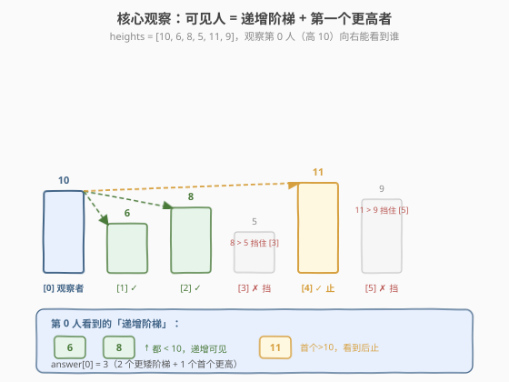
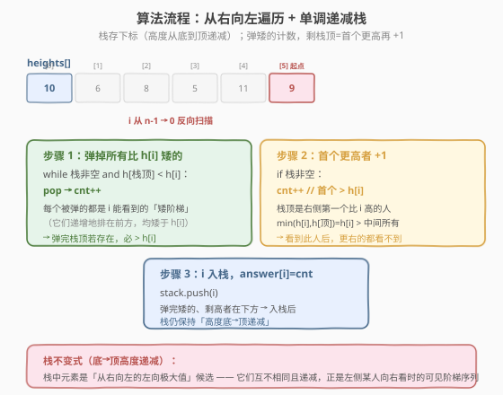
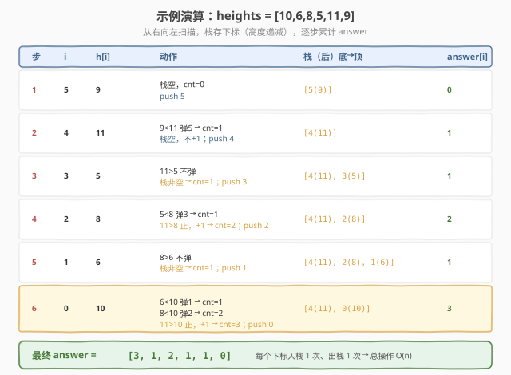

# 队列中可以看到的人数

- **题目名称**：队列中可以看到的人数
- **链接**：[1944. 队列中可以看到的人数](https://leetcode.cn/problems/number-of-visible-people-in-a-queue/)
- **难度**：困难
- **标签**：栈、单调栈、数组

## 1. 题目概述

有 `n` 个人排成一个队列，**从左到右**编号 `0` 到 `n-1`。给定整数数组 `heights`，**所有元素互不相同**，`heights[i]` 表示第 `i` 个人的高度。

第 `i` 个人能**看到**第 `j` 个人（`i < j`）的条件是两人之间的所有人都比他们两人**矮**，即：

$$\min(\text{heights}[i], \text{heights}[j]) > \max(\text{heights}[i+1], \dots, \text{heights}[j-1])$$

返回长度为 `n` 的数组 `answer`，其中 `answer[i]` 是第 `i` 个人在右侧队列中能**看到**的人数。

**示例 1**：

```text
输入：heights = [10,6,8,5,11,9]
输出：[3,1,2,1,1,0]
解释：
  第 0 人（高 10）能看到 1、2、4 号（共 3 人）
  第 1 人（高 6）能看到 2 号（共 1 人）
  第 2 人（高 8）能看到 3、4 号（共 2 人）
  第 3 人（高 5）能看到 4 号（共 1 人）
  第 4 人（高 11）能看到 5 号（共 1 人）
  第 5 人右侧无人，看到 0 人
```

**示例 2**：

```text
输入：heights = [5,1,2,3,10]
输出：[4,1,1,1,0]
```

**约束条件**：

- $n = \text{heights.length}$
- $1 \le n \le 10^5$
- $1 \le \text{heights}[i] \le 10^5$
- `heights` 中所有数**互不相同**

> 💡 **审题关键**：① 「能看到」的本质是两人之间没有更高的挡板——这与「下一个更大元素」一脉相承；② `heights` 互不相同是关键简化，保证比较无等于歧义，单调栈可严格处理；③ 一旦遇到右侧第一个比自己**高**的人，再往右就都被此人挡住，**看到即止**——这决定了 `answer[i]` 是一个有限的小序列而非全部右侧。

---

## 2. 解题思路

### 2.1 暴力思路：对每个 i 向右扫描

对每个 `i`，从 `j = i+1` 起向右扫，维护「到目前为止 i 与 j 之间的最大值」`mx`：

```text
for i in 0..n:
    mx = 0
    for j in i+1..n:
        if min(h[i], h[j]) > mx:   // j 可见
            answer[i]++
        mx = max(mx, h[j])          // 更新中间最大值
        if h[j] > h[i]:             // 首个更高者之后全挡住
            break
```

- **正确性**：忠实模拟可见条件，`mx` 即 `max(h[i+1..j-1])` 的滚动维护。
- **效率**：最坏 `O(n²)`（如严格递增序列 `[1,2,3,...,n]`，每个 `i` 要扫到末尾才遇到更高者，但更高者就是 `i+1`，内层只走 1 步；真正的最坏是**递减序列** `[n,...,2,1]`，每个 `i` 都要扫到 `n-1` 才停止）。当 $n = 10^5$ 时 `O(n²)` 约 $10^{10}$，**超时**。

> ⚠️ 暴力法的问题：每个 `i` 独立向右扫描，**重复比较了大量已被更左侧元素「看过的」人**。例如 `[10,6,8,5,11,9]` 中，第 0 人扫过 6、8、5、11；第 1 人又从 8 开始扫……。这种重复可以用**单调栈**一次性消除——栈里暂存「尚未被左侧某人结算」的右侧人，遇到更高者批量弹栈结算。

### 2.2 核心观察：可见序列 = 递增阶梯 + 第一个更高者



固定观察者 `i`（高度 `h[i]`），向右看能看到的人呈现如下结构：

1. **递增阶梯**（均矮于 `h[i]`）：从 `i+1` 开始，每个**新的右向极大值**且仍 `< h[i]` 的人都可见。它们的高度**严格递增**——因为只有比之前所有人都高，才能「冒出头」被 `i` 看到。例：`i=0`（高 10）右侧看到 6 → 8（递增，都 < 10）。
2. **第一个更高者**（首个 `> h[i]`）：可见。因为 `min(h[i], h[j]) = h[i] >` 中间所有（中间都 `< h[i]`）。**看到此人即止**——它挡住了更右的所有人（此后任何 `k > j`，中间最大值已含 `h[j] > h[i] ≥ min(h[i],h[k])`）。

> 💡 **关键推论**：`answer[i] =` 「比 `h[i]` 矮的阶梯个数」` + `「首个更高者存在则 +1」。若右侧无人比 `h[i]` 高，则只数阶梯、不 +1。

**单调栈如何捕捉这个结构？** 从右向左扫描，维护一个**高度从底到顶递减**的栈（存下标）。处理 `i` 时：

- **弹掉栈顶所有 `< h[i]` 的元素**——它们正是 `i` 右侧的「递增阶梯」（被弹的顺序是从矮到高的阶梯，每个都是某个左向极大值）。每弹一个 `answer[i]++`。
- **弹完后若栈非空**，栈顶就是右侧第一个 `> h[i]` 的人（首个更高者），`answer[i]++`。
- **`i` 入栈**——弹掉矮的、剩高者在下方，入栈后栈仍保持「底→顶递减」，作为更左侧某人的可见候选。

> ⚠️ **为什么是递减栈（底→顶递减）？** 栈中存的是「右侧尚未被结算的左向极大值候选」。递减保证：栈顶是最矮的、最容易被下一个左侧元素「看穿」结算的；栈底是最高的、能挡住一切的。这与 [739 每日温度](../0701-0800/739_每日温度.md) 的递减栈**同构**——只是扫描方向从左→右换成右→左，结算内容从「距离」换成「计数」。

### 2.3 算法流程图



**完整步骤**：

1. **初始化**：空栈 `stack`（存下标），`answer` 全填 0。
2. **反向遍历** `i` **从 `n-1` 到 `0`**：
   - `cnt = 0`
   - `while stack 非空 且 heights[stack.top()] < heights[i]`：
     - `stack.pop()`，`cnt++`（弹掉矮的阶梯）
   - `if stack 非空`：`cnt++`（栈顶是首个更高者，可见）
   - `answer[i] = cnt`
   - `stack.push(i)`
3. **结束**：返回 `answer`（栈中剩余无需处理，它们的可见性已被各自左侧元素结算）。

> ⚠️ **存下标而非值**：比较需要 `heights[stack.top()]`，但入栈的是下标 `i`——因为结算 `answer[i]` 时要回写结果到下标位置。这是单调栈题通用技巧，与 [739 每日温度](../0701-0800/739_每日温度.md) 一致。

### 2.4 示例演算

以 `heights = [10,6,8,5,11,9]` 为例：



| 步骤 | i | h[i] | 动作 | 栈（底→顶） | cnt | answer |
|------|---|------|------|------------|-----|--------|
| 1 | 5 | 9 | 栈空，不弹；栈空不+1；push 5 | `[5(9)]` | 0 | `[0,0,0,0,0,0]` |
| 2 | 4 | 11 | 9<11 弹5→cnt=1；栈空不+1；push 4 | `[4(11)]` | 1 | `[0,0,0,0,1,0]` |
| 3 | 3 | 5 | 11>5 不弹；栈非空→+1；push 3 | `[4(11),3(5)]` | 1 | `[0,0,0,1,1,0]` |
| 4 | 2 | 8 | 5<8 弹3→cnt=1；11>8 止→+1；push 2 | `[4(11),2(8)]` | 2 | `[0,0,2,1,1,0]` |
| 5 | 1 | 6 | 8>6 不弹；栈非空→+1；push 1 | `[4(11),2(8),1(6)]` | 1 | `[0,1,2,1,1,0]` |
| 6 | 0 | 10 | 6<10 弹1→cnt=1；8<10 弹2→cnt=2；11>10 止→+1；push 0 | `[4(11),0(10)]` | 3 | `[3,1,2,1,1,0]` |

注意步骤 6：`i=0`（高 10）一次性弹掉栈顶的 6 和 8——它们正是 `i=0` 右侧的「递增阶梯」（6→8，都 < 10），弹完剩 11（首个更高）再 +1，得到 `answer[0]=3`。这正是单调栈「一次结算多个」的威力。

> 💡 对比暴力法：找 `i=0` 的答案，暴力要从 `j=1` 扫到 `j=4`（扫 4 步）；单调栈在 `i=0` 时连续弹 2 个栈顶 + 看 1 个栈顶，3 次操作搞定。每个元素入栈 1 次、出栈 1 次，总操作 `O(n)`。

---

## 3. 参考代码

### C++

```cpp
// 队列中可以看到的人数.cpp —— 单调递减栈（从右向左）
// 编译: g++ -O2 -std=c++17 队列中可以看到的人数.cpp -o visible
#include <vector>
#include <stack>
using namespace std;

class Solution {
  public:
    vector<int> canSeePersons(vector<int>& heights) {
        int n = heights.size();
        vector<int> answer(n, 0);
        stack<int> stk; // 存下标，对应高度从底到顶递减

        for (int i = n - 1; i >= 0; --i) {
            int cnt = 0;
            // 弹掉所有比 heights[i] 矮的（递增阶梯，每个可见）
            while (!stk.empty() && heights[stk.top()] < heights[i]) {
                stk.pop();
                cnt++;
            }
            // 栈非空：栈顶是右侧第一个更高者，可见
            if (!stk.empty()) cnt++;
            answer[i] = cnt;
            stk.push(i); // 当前入栈，作为更左侧某人的可见候选
        }
        return answer;
    }
};
```

### Python

```python
class Solution:
    def canSeePersons(self, heights: list[int]) -> list[int]:
        n = len(heights)
        answer = [0] * n
        stack = []  # 存下标，高度从底到顶递减

        for i in range(n - 1, -1, -1):
            cnt = 0
            # 弹掉所有比 heights[i] 矮的（递增阶梯，每个可见）
            while stack and heights[stack[-1]] < heights[i]:
                stack.pop()
                cnt += 1
            # 栈非空：栈顶是右侧第一个更高者，可见
            if stack:
                cnt += 1
            answer[i] = cnt
            stack.append(i)  # 作为更左侧某人的可见候选
        return answer
```

> 💡 **写法对照**：C++ 用 `stack<int>` 存下标，`stk.top()` 取栈顶下标、`heights[stk.top()]` 取高度；Python 用 `list` 当栈，`stack[-1]` 是栈顶下标。两者逻辑完全一致：弹矮的计数 → 剩栈顶存在再 +1 → 当前入栈。

> ⚠️ **`<` 而非 `<=`**：因为题目保证 `heights` 互不相同，没有等于的情况，用 `<` 即可。若题目允许相等，需仔细界定「可见」是否含等高（等高时 `min = max` 不满足严格大于 `>`，故等高者不可见，仍用 `<` 弹栈但首个「更高」应改为「更高或等高」——本题无此歧义）。

---

## 4. 复杂度分析

| 维度 | 复杂度 | 说明 |
|------|--------|------|
| **时间复杂度** | $O(n)$ | 每个下标恰好入栈 1 次、出栈 1 次，`while` 的总弹出次数 $\le n$，总操作 $2n$ |
| **空间复杂度** | $O(n)$ | 栈最多存 $n$ 个下标（严格递减序列时全部入栈） |

> ⚠️ 虽然有 `while` 嵌套在 `for` 里，看似 $O(n^2)$，但**均摊分析**：每个元素至多入栈 1 次出栈 1 次，`while` 的总弹出次数 $\le n$，所以总时间 $O(n)$。这是单调栈「均摊 $O(1)$」的特性，与 [739 每日温度](../0701-0800/739_每日温度.md) 完全一致。

---

## 5. 扩展：与「下一个更大元素」家族的关系

### 5.1 统一视角：单调栈的「结算」语义

| 题目 | 扫描方向 | 栈单调性 | 结算内容 |
|------|---------|---------|---------|
| [739 每日温度](../0701-0800/739_每日温度.md) | 左→右 | 递减 | 算距离 `i - top` |
| [496 下一个更大元素 I](https://leetcode.cn/problems/next-greater-element-i/) | 左→右 | 递减 | 记值到哈希 |
| [901 股票价格跨度](../0901-1000/901_股票价格跨度.md) | 左→右（在线） | 递减 | 累加跨度 |
| **本题 1944** | **右→左** | **递减** | **计数（弹栈 +1 + 首个更高 +1）** |

骨架完全相同：`遍历 → while 弹栈满足条件者 → 结算 → 入栈`。差别仅在：① 扫描方向（左→右找「下一个更大」，右→左找「右侧信息」）；② 结算内容（距离/值/跨度/计数）。

### 5.2 为什么本题要从右向左？

「下一个更大元素」找的是**每个元素右侧第一个更大者**，从左向右扫描时，新来的更大元素**结算栈顶**（栈顶的下一个更大就是当前）。

本题则不同：`answer[i]` 取决于 `i` 右侧**一整段**可见序列（阶梯 + 首个更高），而非单个目标。从右向左扫描时，栈中天然维护了「`i` 右侧的左向极大值序列」——这正是 `i` 的可见候选。若从左向右，则无法在处理 `i` 时一次性获取其右侧序列。

> 💡 **口诀**：找「右侧单个目标」（如下一个更大）用左→右扫描；找「右侧一段序列的统计」（如本题计数）用右→左扫描，让栈预先攒好右侧信息。

### 5.3 互不相同的作用

`heights` 互不相同带来两个简化：

- 比较无等于歧义，`<` 严格处理即可；
- 可见序列的「递增阶梯」严格递增，无连续等高挡板的边界争议。

若允许相等，需重新界定 `min > max` 中的严格性：等高两人间无更高挡板时，`min = max` 不满足 `>`，故等高者**互不可见**。算法需调整弹栈条件与「首个更高」判定为「首个 ≥」，复杂度不变。

---

## 6. 面试要点

1. **为什么用单调栈而不是暴力或并查集？**

   - 暴力 `O(n²)` 重复扫描右侧，$n=10^5$ 超时。
   - 单调栈把「右侧可见序列」抽象为栈中暂存的左向极大值，每个元素入栈 1 次出栈 1 次，`O(n)` 一次性结算。并查集不适合此类「方向性 + 高度比较」问题。

2. **为什么从右向左扫描？**

   - `answer[i]` 依赖 `i` 右侧的**整段可见序列**，需在处理 `i` 时已知其右侧信息。从右向左让栈预先攒好「右侧左向极大值」（即可见候选），处理 `i` 时直接弹栈结算。
   - 若从左向右，处理 `i` 时栈里是左侧信息，无法回答右侧可见性。

3. **栈为什么是递减（底→顶）？为什么存下标？**

   - **递减**：栈存「右侧尚未被结算的左向极大值候选」。递减保证栈顶最矮、最易被下一个左侧元素看穿结算；栈底最高、能挡住一切。若递增，矮的压在下面永远等不到结算。
   - **存下标**：比较用 `heights[stack.top()]`，回写用 `answer[i]`，都需要下标定位。与 [739 每日温度](../0701-0800/739_每日温度.md) 同理。

4. **`answer[i]` 的两部分各对应什么？**

   - `while` 弹栈的 `cnt`：`i` 右侧所有比 `h[i]` 矮的左向极大值（递增阶梯），每个可见。
   - 弹完后的 `+1`：栈顶是右侧第一个 `> h[i]` 的人，可见；之后全被它挡住。
   - 若右侧无更高者（弹完栈空），则不 `+1`，只数阶梯。

5. **时间复杂度为什么是 $O(n)$？**

   - `while` 嵌套在 `for` 里，但**均摊**：每个元素入栈 1 次、出栈 1 次，`while` 总弹出 $\le n$。`for` 跑 $n$ 轮 + 总弹出 $n$ 次 = $O(n)$。这是「每个元素均摊 $O(1)$」的经典例子。

> 💡 **一句话总结**：本题是单调栈的「计数变体」——从右向左维护递减栈，弹掉矮的数阶梯、剩栈顶数首个更高，把「右侧可见人数」从 `O(n²)` 降到 `O(n)`。核心是看清「可见序列 = 递增阶梯 + 第一个更高者」，与 [739 每日温度](../0701-0800/739_每日温度.md) 同骨架、异结算。

---

## 7. 同类练习题

- [739. 每日温度](https://leetcode.cn/problems/daily-temperatures/)（[题解](../0701-0800/739_每日温度.md)）：单调递减栈招牌题，左→右扫描算距离，本题的「母模板」
- [496. 下一个更大元素 I](https://leetcode.cn/problems/next-greater-element-i/)（[题解](../0401-0500/496_下一个更大元素 I.md)）：单调栈找右侧首个更大，本题「首个更高 +1」的简化版
- [901. 股票价格跨度](https://leetcode.cn/problems/online-stock-span/)（[题解](../0901-1000/901_股票价格跨度.md)）：单调递减栈 + 跨度累加，与本题「弹栈累加计数」同构
- [1776. 车队 II](https://leetcode.cn/problems/car-fleet-ii/)（[题解](../1701-1800/1776_车队II.md)）：单调栈从右向左 + 弹栈结算，与本题同为「右侧信息驱动」的高阶单调栈
