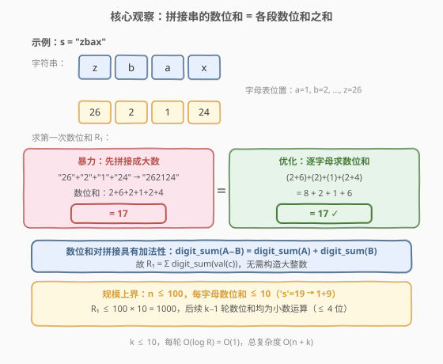
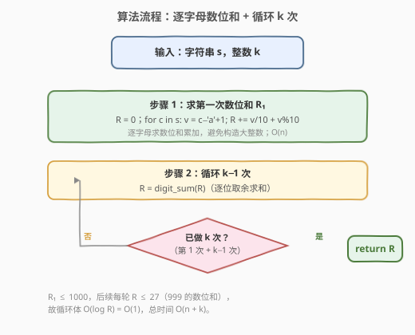
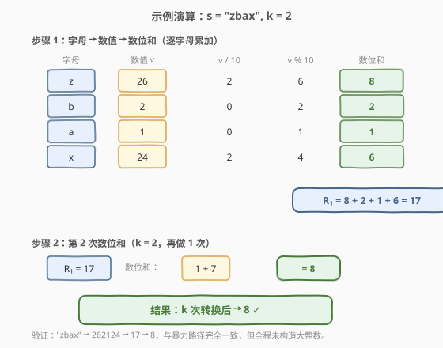

# LeetCode 字符串转化后的各位数字之和 题解

## 1. 题目概述

- **标题 / 题号**：字符串转化后的各位数字之和（#1945，easy）
- **链接**：https://leetcode.cn/problems/sum-of-digits-of-string-after-convert/
- **难度**：简单
- **标签**：字符串、模拟、数学

**题意**：给你一个由小写字母组成的字符串 $s$ 和一个整数 $k$。执行以下操作：

1. **转化**：用字母在字母表中的位置替换该字母（`'a'`→1, `'b'`→2, …, `'z'`→26），将 $s$ 转化为一个整数（拼接各数值的十进制串）。
2. **转换**：将整数转换为其各位数字之和。
3. 共重复**转换**操作（第 2 步）$k$ 次。

返回结果整数。

**示例 1**：

```text
输入：s = "iiii", k = 1
输出：36
解释："iiii" ➝ "9999" ➝ 9999 ➝ 9+9+9+9 = 36
```

**示例 2**：

```text
输入：s = "leetcode", k = 2
输出：6
解释："leetcode" ➝ "12552031545" ➝ 12552031545
      转换 #1：1+2+5+5+2+0+3+1+5+4+5 = 33
      转换 #2：3+3 = 6
```

**示例 3**：

```text
输入：s = "zbax", k = 2
输出：8
解释："zbax" ➝ "262124" ➝ 262124
      转换 #1：2+6+2+1+2+4 = 17
      转换 #2：1+7 = 8
```

**约束**：

- $1 \le \text{s.length} \le 100$
- $1 \le k \le 10$
- $s$ 由小写英文字母组成

> 💡 **审题关键**：① 第 1 步只是**拼接**数值的十进制串，不做求和；② 第 2 步「数位求和」重复 $k$ 次，不是「求到一位为止」（区别于 [258. 各位相加](../0201-0300/258_各位相加.md) 的数字根）；③ $s$ 长度至多 100，每字母对应 1–2 位数字，拼接后整数可达 **200 位**——`long long` 溢出是 C++ 暴力解法的核心陷阱。

## 2. 解题思路

### 2.1 暴力思路：构造大整数 + 循环数位求和

最直觉的做法：先把 $s$ 中每个字母替换为数值字符串并拼接，得到大整数 $N$；然后对 $N$ 做 $k$ 次数位求和。

```text
"zbax" → 拼接 "26"+"2"+"1"+"24" → "262124" → int N = 262124
         第 1 次数位和：2+6+2+1+2+4 = 17
         第 2 次数位和：1+7 = 8
```

- **正确性**：严格按题意模拟，无歧义。
- **效率**：构建串 $O(n)$；每次数位和 $O(L)$（$L$ 为当前数字串长度），共 $k$ 次。总体 $O(n + kL)$，$L$ 初始可达 $2n$。
- **致命问题（C++）**：$n = 100$ 时拼接串长达 200 位，`long long` 最多容纳约 19 位——**直接 `stoi` / `stoll` 会溢出**。C++ 必须以**字符串形式**存储大数、逐字符求数位和，绕过数值类型。Python 的 `int` 天然支持任意精度，无此问题，但构造大数本身是**不必要的浪费**。

> ⚠️ **C++ 溢出陷阱**：`to_string` 拼接得到的串可能长达 200 字符，`stoi` 会抛 `out_of_range`，`stoll` 同理。暴力法在 C++ 中必须全程用 `string` 操作数字位，不能转成整型。这暴露了暴力法没有利用「只需数位和」这一结构——题目根本不关心大数本身，只关心其数位和。

### 2.2 核心观察：数位和的加法性（逐字母累加，跳过大整数）



关键洞察：**数位和对拼接具有加法性**。将若干数字串拼接后求数位和，等于各串分别求数位和再相加：

$$\text{digit\_sum}(A \frown B) = \text{digit\_sum}(A) + \text{digit\_sum}(B)$$

这是因为数位和只是把**所有数字位**加起来，与位的位置无关——拼接只是把更多数字位排在一起，逐位求和的结果自然等于各段数位和之和。

**推论**：第 1 步拼接得到的大整数 $N$，其数位和（即第 1 次转换的结果 $R_1$）可直接对每个字母的数值单独求数位和再累加：

$$\boxed{R_1 = \sum_{c \in s} \text{digit\_sum}(\text{val}(c)), \quad \text{val}(c) = c - \text{'a'} + 1 \in [1, 26]}$$

每个字母的数值 $v \in [1, 26]$，其数位和为 $v / 10 + v \% 10$（如 $26 \to 2+6=8$，$5 \to 0+5=5$）。一趟扫描即可算出 $R_1$，**无需构造大整数**。

**规模上界**：$n \le 100$，每个字母数位和 $\le 10$（最大为 `'s'`=19 → $1+9=10$），故：

$$R_1 \le 100 \times 10 = 1000$$

$R_1$ 至多 4 位数，后续 $k-1$ 轮数位和均为小数运算（$R_2 \le 27$，$R_3 \le 10$，…），每轮 $O(\log R) = O(1)$。

> 💡 **为什么加法性成立？** 数位和 $\text{digit\_sum}(N) = \sum_i d_i$，其中 $d_i$ 是 $N$ 的第 $i$ 位数字。拼接 $A \frown B$ 只是把 $A$ 的各位和 $B$ 的各位排成一列，$\sum d_i$ 不变。因此 $\text{digit\_sum}(A \frown B) = \text{digit\_sum}(A) + \text{digit\_sum}(B)$，与位权无关。这与 [258. 各位相加](../0201-0300/258_各位相加.md) 中「$10 \equiv 1 \pmod{9}$⇒ 数位和不改变 mod 9 余数」是同一性质的两面——前者关注**加法分解**，后者关注**模 9 不变性**。

### 2.3 算法流程图



整体为「一趟累加 + $k-1$ 轮数位和」的线性流程：

1. **求 $R_1$**：`R = 0`；遍历 $s$，对每个字符 $c$ 取 $v = c - \text{'a'} + 1$，执行 `R += v/10 + v%10`。
2. **循环 $k-1$ 次**：对 `R` 做数位求和（逐位取余 `t += R%10; R /= 10`，最终 `R = t`）。
3. **返回** `R`。

> 💡 **循环次数**：第 1 步已经完成了「转化 + 第 1 次转换」，故只需再做 $k - 1$ 次数位和。$k = 1$ 时循环 0 次，直接返回 $R_1$。

### 2.4 示例演算

以 $s = \text{"zbax"}, k = 2$ 演示逐字母数位和累加过程：



**第 1 次数位和 $R_1$**：

| 字母 | 数值 $v$ | $v/10$ | $v\%10$ | 数位和 |
|------|----------|--------|---------|--------|
| z | 26 | 2 | 6 | 8 |
| b | 2 | 0 | 2 | 2 |
| a | 1 | 0 | 1 | 1 |
| x | 24 | 2 | 4 | 6 |

$$R_1 = 8 + 2 + 1 + 6 = 17$$

**第 2 次数位和**（$k = 2$，再做 1 次）：

$$R_2 = \text{digit\_sum}(17) = 1 + 7 = 8$$

> 💡 **对照暴力路径**："zbax" → 拼接 "262124" → 数位和 2+6+2+1+2+4 = 17 → 数位和 1+7 = 8。两条路径结果完全一致，但优化版全程未构造大整数，$R_1$ 仅 17，远小于 262124。

## 3. 参考代码

### C++（逐字母数位和 + 循环）

```cpp
class Solution {
public:
    int getLucky(string s, int k) {
        int R = 0;
        for (char c : s) {
            int v = c - 'a' + 1;
            R += v / 10 + v % 10;
        }
        for (int i = 1; i < k; ++i) {
            int t = 0;
            for (; R; R /= 10) t += R % 10;
            R = t;
        }
        return R;
    }
};
```

### Python（逐字母数位和 + 循环）

```python
class Solution:
    def getLucky(self, s: str, k: int) -> int:
        R = 0
        for c in s:
            v = ord(c) - ord('a') + 1
            R += v // 10 + v % 10
        for _ in range(k - 1):
            R = sum(int(d) for d in str(R))
        return R
```

### Python（暴力对照版：构造大整数）

```python
class Solution:
    def getLucky(self, s: str, k: int) -> int:
        num = int(''.join(str(ord(c) - 96) for c in s))
        for _ in range(k):
            num = sum(int(d) for d in str(num))
        return num
```

> 💡 **写法对照**：① 优化版直接翻译「数位和加法性」思路，显式体现「逐字母 $v/10 + v\%10$ 累加 → 循环 $k-1$ 次」两步，面试默认先写这版；② 暴力版利用 Python 任意精度 `int` 一行构造大数，简洁但做了不必要的字符串拼接与大数创建；③ 两版时间同为 $O(n + k)$，但优化版常数更小、且不依赖语言的大数支持，C++ 友好。

> ⚠️ **`ord(c) - 96` 的含义**：`ord('a')` = 97，故 `ord(c) - 96` = `ord(c) - ord('a') + 1` = 字母位置。两种写法等价，`- 96` 更紧凑，`- ord('a') + 1` 更可读。C++ 中等价写法为 `c - 'a' + 1`。

## 4. 复杂度分析

| 维度 | 暴力法（构造大数） | 数位和加法性法 | 说明 |
|------|---------------------|----------------|------|
| 时间复杂度 | $O(n + kL)$ | $O(n + k)$ | 暴力法每轮遍历大数字符串（$L$ 初始达 $2n$）；优化法第 1 步 $O(n)$ 累加，后续每轮 $O(\log R) = O(1)$ |
| 空间复杂度 | $O(n)$ | $O(1)$ | 暴力法需存储大数字符串（达 $2n$ 位）；优化法仅几个整型变量 |

> 💡 **$k$ 的贡献**：$R_1 \le 1000$，后续每轮 $R$ 迅速缩小（$R_2 \le 27$，$R_3 \le 10$），故 $k - 1$ 轮数位和总计 $O(k)$ 但常数极小。$k \le 10$ 时几乎可忽略。

## 5. 扩展：与数字根的关联

### 5.1 大 $k$ 时的收敛

本题固定做 $k$ 次数位和，而非「求到一位为止」。但由于 $R_1 \le 1000$，数位和迅速收敛：

| 轮次 | 上界 | 说明 |
|------|------|------|
| $R_1$ | 1000 | $100 \times 10$（每字母数位和 $\le 10$） |
| $R_2$ | 27 | $\text{digit\_sum}(999) = 27$ |
| $R_3$ | 10 | $\text{digit\_sum}(19) = 10$ |
| $R_4$ | 9 | $\text{digit\_sum}(10) = 1$，此后稳定为一位数 |

因此 $k \ge 4$ 时结果必为一位数，等于 $R_1$ 的**数字根**（digital root）。可套用 [258. 各位相加](../0201-0300/258_各位相加.md) 的 $O(1)$ 公式：

$$\text{digital\_root}(R_1) = 1 + (R_1 - 1) \% 9$$

但本题 $k \le 10$ 且每轮 $O(1)$，循环模拟已足够快，无需引入数字根公式。这一关联主要体现**知识迁移**价值：数位和的模 9 不变性（$10 \equiv 1 \pmod{9}$）是数字根公式的根基，而数位和的加法性是本题优化的根基——两者同源不同面。

### 5.2 数位和加法性的其他应用

「拼接串的数位和 = 各段数位和之和」这一性质还可用于：

- **校验和计算**：ISBN 条形码、信用卡号的 Luhn 校验中，分段数位和累加与整体数位和等价。
- **大数模 9**：由加法性可推出 $\text{digit\_sum}(N) \equiv N \pmod{9}$，故拼接大数的 mod 9 可逐段累加，无需构造大数。

## 6. 面试要点

**Q1：为什么可以不构造大整数直接算第一次数位和？**

> 数位和对拼接具有加法性：$\text{digit\_sum}(A \frown B) = \text{digit\_sum}(A) + \text{digit\_sum}(B)$。因为数位和只把所有数字位加起来，与位权无关，拼接只是排列更多数字位。故 $R_1 = \sum_{c \in s} \text{digit\_sum}(\text{val}(c))$，每个字母的数值 $v \in [1, 26]$，数位和为 $v/10 + v\%10$，一趟扫描即可累加完成。

**Q2：暴力法在 C++ 中的溢出问题是什么？**

> $n \le 100$ 时拼接串可达 200 位（每字母 1–2 位），而 `long long` 最多容纳约 19 位十进制数。`stoi` 会抛 `out_of_range` 异常，`stoll` 同理。C++ 暴力法必须全程以 `string` 存储数字、逐字符 `'d' - '0'` 求数位和，无法转成整型。这正是优化法（逐字母累加）的价值——绕过大数，$R_1$ 直接是 `int` 范围内的值（$\le 1000$）。

**Q3：$R_1$ 的上界是多少？为什么后续循环是 $O(1)$？**

> $R_1 \le 100 \times 10 = 1000$：$n \le 100$，每字母数位和 $\le 10$（'s'=19 → 1+9=10）。$R_1$ 至多 4 位数，故 $R_2 \le \text{digit\_sum}(999) = 27$，$R_3 \le 10$，之后必为一位数。每轮数位和只需处理 $\le 4$ 位数字，$O(\log R) = O(1)$，$k \le 10$ 轮总计 $O(k) = O(1)$。

**Q4：本题与 258. 各位相加有什么联系与区别？**

> 联系：都涉及反复数位求和，核心操作相同，且都依赖 $10 \equiv 1 \pmod{9}$ 的数论性质——258 题用其推导数字根公式 $1 + (n-1)\%9$，本题用其解释数位和的加法性。区别：258 题求到一位为止（数字根），可用 $O(1)$ 公式直接出答案；本题固定做 $k$ 次，$k$ 可能小于收敛所需次数，故不能直接套数字根公式，需模拟 $k$ 次数位和。

**Q5：如果字符集扩大（如 Unicode），思路如何调整？**

> 字母位置值的计算需相应调整（如 Unicode 码点），但核心思路不变：第 1 步仍可用加法性逐字符累加数位和，只要每个字符的数值 $v$ 不太大（数位和为 $O(\log v)$）。若 $v$ 很大（如中文码点 > 20000），数位和仍可 $O(\log v)$ 算出，$R_1$ 上界变为 $O(n \log_{10}(\max v))$，后续循环同理。关键是不依赖大整数构造，加法性对任意数值成立。

> 💡 **一句话总结**：利用数位和对拼接的加法性，$R_1 = \sum \text{digit\_sum}(\text{val}(c))$ 逐字母累加，跳过大整数构造；$R_1 \le 1000$ 后续 $k-1$ 轮为小数运算，总复杂度 $O(n + k)$。

## 同类练习题

| # | 题目 | 与本题的关联 |
|---|------|-------------|
| 258 | [各位相加](https://leetcode.cn/problems/add-digits/)（[题解](../0201-0300/258_各位相加.md)） | 反复数位求和直到一位数（数字根），核心操作相同，区别在于「求到一位为止」可用 $O(1)$ 公式 $1 + (n-1)\%9$ 直达，而本题固定 $k$ 次需模拟 |
| 202 | [快乐数](https://leetcode.cn/problems/happy-number/)（[题解](../0001-0100/202_快乐数.md)） | 数位**平方**和反复变换 + Floyd 判圈，数位和的变体（平方取代求和），对照「收敛」与「判圈」两种终止条件 |
| 7 | [整数反转](https://leetcode.cn/problems/reverse-integer/)（[题解](../0001-0100/7_整数反转.md)） | 逐位取余 + 重组数字的基本操作，数位处理的底层技法，对照本题「数位求和」与「数位反转」的异同 |
| 13 | [罗马数字转整数](https://leetcode.cn/problems/roman-to-integer/)（[题解](../0001-0100/13_罗马数字转整数.md)） | 字符串到数值的映射转换，对照本题「字母→位置值」的映射思路，体会「符号映射 + 数值累加」的通用模式 |
