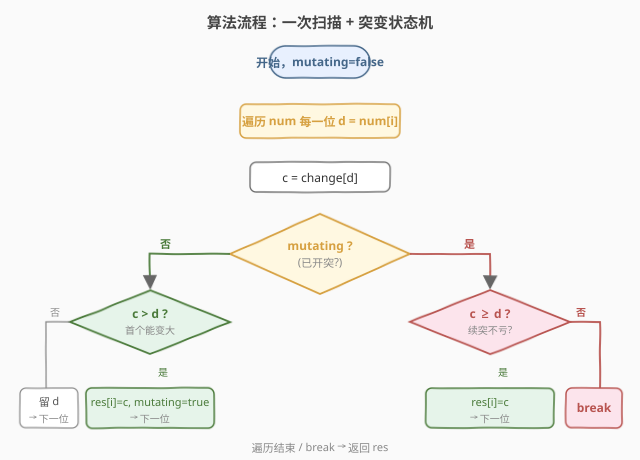
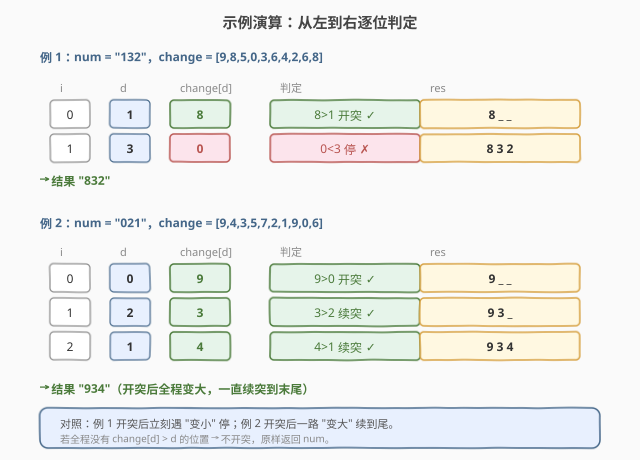

# 子字符串突变后可能得到的最大整数

- **题目名称**：子字符串突变后可能得到的最大整数
- **链接**：[1946. 子字符串突变后可能得到的最大整数](https://leetcode.cn/problems/largest-number-after-mutating-substring/)
- **难度**：中等
- **标签**：贪心、字符串

## 1. 题目概述

给定一个表示大整数的字符串 `num`，以及长度为 10 的数组 `change`，其中 `change[d]` 表示数字 `d` 经「突变」后变成的数字。可以选 `num` 的**任一连续子字符串**执行一次突变（把子串里每一位 `num[i]` 替换为 `change[num[i]]`），也可以不突变。返回突变后能得到的**最大整数**（字符串形式）。

**示例 1**：

```text
输入：num = "132", change = [9,8,5,0,3,6,4,2,6,8]
输出："832"
解释：突变子串 "1"：1 → change[1] = 8，故 "132" → "832"。
```

**示例 2**：

```text
输入：num = "021", change = [9,4,3,5,7,2,1,9,0,6]
输出："934"
解释：突变子串 "021"：0→9, 2→3, 1→4，故 "021" → "934"。
```

**示例 3**：

```text
输入：num = "5", change = [1,4,7,5,3,2,5,6,9,4]
输出："5"
解释：change[5]=2 < 5，突变只会变小，不突变最优。
```

**约束条件**：

- $1 \le \text{num.length} \le 10^5$
- `num` 仅由数字 `0-9` 组成
- $\text{change.length} = 10$
- $0 \le \text{change}[d] \le 9$

> 💡 **审题关键**：① 整数大小按**字典序**比较（位数相同时即逐位比），高位优先；② 突变是**一段连续子串**，只能选一次——所以突变段必须是一个区间，不能跳着选；③ 突变后某位可能变大、变小或不变，目标是挑一个区间让结果字典序最大。

---

## 2. 解题思路

### 2.1 暴力思路：枚举所有子串

枚举所有 $O(n^2)$ 个连续子串 $[l, r]$，对每个子串模拟突变并比较字典序，取最大。

- **正确性**：穷举所有可能，显然正确。
- **效率**：$O(n^2)$ 个子串 × 每次 $O(n)$ 构造比较 = $O(n^3)$，$n = 10^5$ 完全不可行。

> ⚠️ 暴力暴露的瓶颈：把「选子串」当成自由组合。实际上「高位优先 + 单段连续」强烈约束了最优子串的形状，可用贪心直接锁定。

### 2.2 核心观察：贪心——找首个能变大的位置开突，遇变小即停

![核心观察：按 change[d] 与 d 的大小分三类，贪心锁定突变段](../images/1946_greedy_concept.svg)

整数比较是**字典序**：高位大则整体大。所以最大化策略逐位看：

- 若某位 `change[d] > d`：突变后这位**变大**——在尽可能高（尽可能靠左）的位置变大收益最大；
- 若 `change[d] == d`：突变后这位**不变**，突变它「不亏不赚」；
- 若 `change[d] < d`：突变后这位**变小**，必须避开。

由于突变是**连续单段**，最优策略呼之欲出：

1. 从左到右扫描，找到**首个** `change[d] > d` 的位置 $l$，在此**开始突变**（最显著位的变大收益最值钱）；
2. 从 $l$ 起继续向右，只要 `change[d] >= d` 就**续突**（`==` 不亏、`>` 赚）；
3. 一旦遇到 `change[d] < d` 立刻**停止**（再突会让这位变小，得不偿失）；
4. 若全程没有 `change[d] > d`，则**不突变**，原样返回 `num`。

> 💡 **为什么「首个 `>`」开突最优？** 字典序下，靠左一位的变大胜过右边任意位的变大。所以若有 `>`，必然在**最左**的 `>` 处开突——延后开突只会丢失这个最显著的收益。开突后续突到首个 `<` 为止，是因为段必须连续：`==` 续进去不改变值（无副作用），而 `>` 续进去只会更赚；遇 `<` 必须截断，否则拖累。

> ⚠️ **`==` 的两种身份**：未开突时遇到 `==`，**先不动**（开突它没收益，反而可能把段提前、被迫吞掉后面的 `<`）；已开突时遇到 `==`，**顺延续突**（段必须连续，跨过它去吃后面的 `>`）。两种处理都等价于「保持当前值」，但对段的起点选择不同——标准实现里只在首个 `>` 才置 `mutating=true`，自然规避了 `==` 误开突。

### 2.3 算法流程图



一次遍历 + 布尔状态 `mutating`：

- `mutating == false`：看 `c = change[d]`。`c > d` 则 `res[i] = c` 并置 `mutating = true`；否则 `res[i] = d`（原样）继续。
- `mutating == true`：看 `c = change[d]`。`c >= d` 则 `res[i] = c` 继续；`c < d` 则 `break`（停止突变，后续位保持原样）。

### 2.4 示例演算

以示例 1、2 逐位演示三种判定的触发：



| 例 | num | 关键判定 | 结果 |
|------|-----|----------|------|
| 1 | "132" | 1→8（`>` 开突）→ 3→0（`<` 停） | "832" |
| 2 | "021" | 0→9（`>` 开突）→ 2→3（`>` 续）→ 1→4（`>` 续） | "934" |
| 3 | "5" | 5→2（`<`，全程无 `>`，不突） | "5" |

> 💡 **对比体会**：例 1 开突后**立刻**遇 `<` 停（只突 1 位）；例 2 开突后**一路** `>` 续到尾（突整串）。两种极端都由同一条规则覆盖。

---

## 3. 参考代码

### C++

```cpp
class Solution {
public:
    string maximumNumber(string num, vector<int>& change) {
        int n = num.size();
        bool mutating = false;
        for (int i = 0; i < n; ++i) {
            int d = num[i] - '0';
            int c = change[d];
            if (mutating) {
                if (c >= d) {
                    num[i] = char('0' + c);
                } else {
                    break;
                }
            } else {
                if (c > d) {
                    num[i] = char('0' + c);
                    mutating = true;
                }
            }
        }
        return num;
    }
};
```

### Python

```python
class Solution:
    def maximumNumber(self, num: str, change: List[int]) -> str:
        res = list(num)
        mutating = False
        for i, ch in enumerate(num):
            d = ord(ch) - 48
            c = change[d]
            if mutating:
                if c >= d:
                    res[i] = str(c)
                else:
                    break
            else:
                if c > d:
                    res[i] = str(c)
                    mutating = True
        return "".join(res)
```

> 💡 **写法对照**：① C++ 直接在原 `string` 上改（值传递，不影响外部），省去额外数组；Python 因 `str` 不可变，转 `list` 改完 `join`。② 两版逻辑一致：未开突只认 `>`，已开突认 `>=` 续、`<` 停。③ 无需提前找起点——遍历中遇首个 `>` 自然开突，`break` 自然收尾。

> ⚠️ **「不突变」情形**：若遍历完都没遇到 `c > d`，`mutating` 始终为 `false`，`res` 与 `num` 完全一致，正确返回原串。无需特判。

---

## 4. 复杂度分析

| 维度 | 复杂度 | 说明 |
|------|--------|------|
| 时间复杂度 | $O(n)$ | 最多遍历一遍 `num`，遇首个 `<`（开突后）即 `break`，每位 $O(1)$ |
| 空间复杂度 | $O(n)$ | Python 需 `list(num)` 转可变；C++ 原地修改为 $O(1)$ 额外空间（输出不计） |

> 💡 **为什么是 $O(n)$ 而非 $O(n^2)$？** 贪心把「选子串」从枚举 $O(n^2)$ 降为「一次扫描定起点与终点」——`mutating` 状态机在单趟遍历里同时锁定段的左端（首个 `>`）和右端（首个 `<` 或串尾）。

---

## 5. 扩展：正确性证明与变体

### 5.1 贪心最优性证明

设最优解突变段为 $[L, R]$，贪心选的是 $[l, r]$。

- **起点 $l \le L$**：若 $L$ 之前存在某位 $k$ 满足 `change[d_k] > d_k`，则突变 $k$ 能让更高位变大，得到字典序更大的串，与 $[L,R]$ 最优矛盾。故 $L$ 之前**没有** `>`，即 $l$（首个 `>`）就是 $L$；若全串无 `>`，$[L,R]$ 必然不优于原串，贪心不突也最优。
- **终点 $r \ge R$ 的右界**：从 $l$ 起只要 `>=` 就续，遇到首个 `<` 停。若最优解提前停在某个 `>=` 位，把它纳入段内不改变该位（`==`）或让它变大（`>`），结果不更差，故可延到首个 `<` 前；若最优解越过首个 `<` 继突，该位变小，结果更差，矛盾。故 $r$ 即首个 `<` 前一位（或串尾）。

### 5.2 若允许「选任意子序列」（非连续）

则问题退化为：对每一位独立决定是否突变——`change[d] > d` 就突、`<` 就不突、`==` 随意。失去连续性约束后连 `mutating` 状态都不需要，逐位贪心即可。本题的难点恰在于「连续」迫使 `==` 必须与相邻 `>` 共进退。

---

## 6. 面试要点

**Q1：为什么在首个 `change[d] > d` 处开突，而不是更早的 `==` 处？**

> 字典序下高位变大收益最大。在 `==` 处开突不改变该位（无收益），却会强制段从那里开始、可能被迫吞掉夹在中间的 `<`；等到首个 `>` 再开突，既拿到最显著的变大，又让段尽可能短而精。两者在「`==` 后紧跟 `>`」时结果相同，但在「`==` 后跟 `<`」时贪心更优。

**Q2：开突后遇到 `change[d] == d` 要不要停？**

> 不停。段必须连续，跨过 `==` 才能吃到后面可能的 `>`；`==` 不改变该位值，续突无副作用。只在 `change[d] < d` 时停。

**Q3：若全程没有 `change[d] > d` 怎么办？**

> 不突变，原样返回 `num`。此时任何突变要么全 `==`（串不变）要么含 `<`（某位变小），都不可能严格变大，原串即最大。

**Q4：突变会不会产生前导零导致位数变化？**

> 不会。开突条件是 `change[d] > d`，首位 `d >= 1`（题目保证无前导零，`num` 为正整数），故突变后首位 `c > d >= 1`，仍非零。即便 `num` 首位为 `d` 且 `change[d] == 0`，那是 `<` 情形不会开突。

**Q5：算法为什么是 $O(n)$？暴力错在哪？**

> 暴力枚举 $O(n^2)$ 个子串各 $O(n)$ 构造比较。贪心利用「字典序高位优先 + 段连续」把起点锁定为首个 `>`、终点锁定为开突后首个 `<`，单趟扫描 + 状态机即可，每位 $O(1)$。

> 💡 **一句话总结**：一次扫描 + `mutating` 状态机——首个 `change[d] > d` 开突，续突只要 `>=`，遇 `<` 即停，$O(n)$ 搞定。

---

## 7. 同类练习题

- [1935. 可以输入的最大单词数](https://leetcode.cn/problems/maximum-number-of-words-you-can-type/)：同样按映射逐位判定，本题「最大化单段」对照其「按坏键切词计数」的映射消费视角
- [1881. 插入后的最大值](https://leetcode.cn/problems/maximum-value-after-insertion/)：在数字串中插入一位求最大，同为「字典序高位优先」贪心，对照「插入单点」vs「突变单段」
- [132. 分割回文串 II](https://leetcode.cn/problems/palindrome-partitioning-ii/)：单段区间 DP + 预处理，对照本题「单段贪心直接锁定区间」体会约束强弱差异
- [409. 最长回文串](https://leetcode.cn/problems/longest-palindrome/)：按字符计数贪心构造最大结果，对照本题「按映射分类贪心」的同类决策风味
