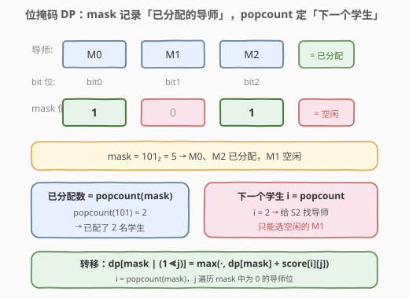
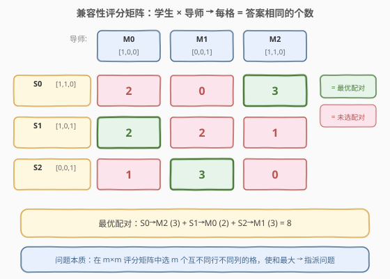
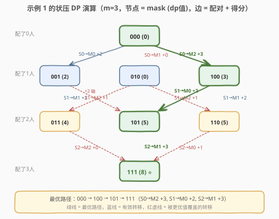

# LeetCode 最大兼容性评分和 题解

## 1. 题目概述

- **标题 / 题号**：最大兼容性评分和（#1947，medium）
- **链接**：https://leetcode.cn/problems/maximum-compatibility-score-sum/
- **难度**：中等
- **标签**：位运算、动态规划、状态压缩、回溯

**题意**：有一份由 `n` 个问题组成的调查问卷，每个问题的答案要么是 `0`（否），要么是 `1`（是）。问卷分发给 `m` 名学生和 `m` 名导师，编号均为 `0` 到 `m-1`。`students[i]` 是第 `i` 名学生的答案数组，`mentors[j]` 是第 `j` 名导师的答案数组。

每个学生分配给**一名**导师，每位导师也分配到**一名**学生（即一一配对）。配对学生与导师的**兼容性评分** = 两者答案**相同**的问题个数。求使**兼容性评分和最大**的配对方案，返回该最大和。

**示例 1**：

```text
输入：students = [[1,1,0],[1,0,1],[0,0,1]], mentors = [[1,0,0],[0,0,1],[1,1,0]]
输出：8
解释：
  学生 0 分配给导师 2，兼容性评分为 3（答案完全相同）
  学生 1 分配给导师 0，兼容性评分为 2
  学生 2 分配给导师 1，兼容性评分为 3
  最大兼容性评分和 = 3 + 2 + 3 = 8
```

**示例 2**：

```text
输入：students = [[0,0],[0,0],[0,0]], mentors = [[1,1],[1,1],[1,1]]
输出：0
解释：任意配对的兼容性评分都是 0（答案全不同）。
```

**约束**：

- `m == students.length == mentors.length`
- `n == students[i].length == mentors[j].length`
- `1 <= m, n <= 8`
- `students[i][k]` 为 `0` 或 `1`
- `mentors[j][k]` 为 `0` 或 `1`

> ⚠️ **关键信号**：`m ≤ 8` 是**状压 DP（bitmask DP）**的标志性数据范围——`2^8 = 256` 个状态，恰好落在「可以枚举所有子集」的甜区。问题本质是**指派问题（Assignment Problem）**：在 `m × m` 评分矩阵中选 `m` 个互不同行不同列的格，使和最大。看到小范围 + 一一配对，第一反应应是状压 DP。

## 2. 解题思路

### 2.1 暴力思路

枚举学生的所有全排列（共 `m!` 种），每个排列 `perm` 表示「学生 `i` 分配给导师 `perm[i]`」，计算对应的兼容性评分和取最大。`m=8` 时 `8! = 40320`，每种方案需 `O(m·n)` 计算评分，总量约 `40320 × 8 × 8 ≈ 2.6×10^6`，看似能过但**无法利用子问题重叠**——同一个「已分配导师集合」可以从不同顺序到达，重复计算很多。状压 DP 用记忆化消除这种重复。

### 2.2 核心观察：用位掩码记录「已分配的导师集合」

配对是逐个学生进行的。在任意中间时刻，我们只关心两件事：

1. **哪些导师已经被分配了**（决定还能选哪些）；
2. **下一个要配对的学生是谁**（决定本轮的评分行）。

而「下一个学生」由「已分配个数」唯一确定——若已经配了 `c` 个学生，下一个就是学生 `c`（按 `0`-indexed 顺序）。因此**只需要一维信息「已分配导师集合」就能完整刻画状态**。



用一个 `m` 位的二进制整数 `mask` 作为状态：

- `mask` 的第 `j` 位为 `1`，表示导师 `j` **已被分配**；
- 已分配个数 = `popcount(mask)`；
- 下一个学生 `i = popcount(mask)`（**0-indexed**）。

例如 `m=3`、`mask = 101₂ = 5`：M0、M2 已分配，下一个给学生 `i = 2` 配导师，只能选空闲的 M1。

### 2.3 状态转移

**预处理**评分矩阵：`score[i][j]` = 学生 `i` 与导师 `j` 答案相同的问题数，计算复杂度 $O(m^2 \cdot n)$。

定义 `dp[mask]` = 已将前 `popcount(mask)` 名学生分配给 `mask` 所示导师集合时，能得到的**最大**兼容性评分和。

对当前状态 `mask`，下一个学生 `i = popcount(mask)`。枚举每一个**尚未分配**的导师 `j`（即 `mask` 的第 `j` 位为 `0`），把学生 `i` 配给导师 `j`，得分 `score[i][j]`：

$$dp[\text{mask} \mid (1 \ll j)] = \max\big(dp[\text{mask} \mid (1 \ll j)],\; dp[\text{mask}] + \text{score}[i][j]\big)$$



- **初始**：`dp[0] = 0`（一个学生都没配，分数为 0）。
- **答案**：`dp[(1 << m) - 1]`（所有导师都分配完毕）。
- **无效状态**：`dp[mask] = -∞`（不可达），转移时跳过。

> 💡 **为什么不会遗漏？** 每个状态 `mask` 对应一个**确定的已分配导师集合**，下一个学生 `i` 被 `popcount(mask)` 唯一确定。从 `mask` 出发配 `j` 走到的新状态 `mask | (1<<j)` 是唯一确定的，所以每条「配对序列」对应 DAG 上从 `0` 到全 `1` 的一条路径，**一一对应**，无重复无遗漏。取 `max` 保证最优。

### 2.4 示例演算（示例 1）

`students = [[1,1,0],[1,0,1],[0,0,1]]`，`mentors = [[1,0,0],[0,0,1],[1,1,0]]`，`m=3`。

**预处理评分矩阵**：

|  | M0 `[1,0,0]` | M1 `[0,0,1]` | M2 `[1,1,0]` |
|--|------|------|------|
| **S0** `[1,1,0]` | 2 | 0 | 3 |
| **S1** `[1,0,1]` | 2 | 2 | 1 |
| **S2** `[0,0,1]` | 1 | 3 | 0 |

**逐层填充 dp**（节点形如 `mask (dp值)`）：

```text
dp[000]=0 → 配S0→M0: dp[001]=2, 配S0→M1: dp[010]=0, 配S0→M2: dp[100]=3
dp[001]=2 → 配S1→M1: dp[011]=4, 配S1→M2: dp[101]=3
dp[010]=0 → 配S1→M0: dp[011]=max(4,0+2)=4, 配S1→M2: dp[110]=1
dp[100]=3 → 配S1→M0: dp[101]=max(3,3+2)=5, 配S1→M1: dp[110]=max(1,3+2)=5
dp[011]=4 → 配S2→M2: dp[111]=max(0,4+0)=4
dp[101]=5 → 配S2→M1: dp[111]=max(4,5+3)=8        ⭐ 最优
dp[110]=5 → 配S2→M0: dp[111]=max(8,5+1)=8
dp[111]=8 ⭐
```



最优路径：`000 → 100 → 101 → 111`，即 S0→M2 (+3)、S1→M0 (+2)、S2→M1 (+3)，总分 8。注意 `010 → 011` 这条边虽得分 +2，但 `dp[010]=0` 太小，被 `001 → 011`（2+2=4）覆盖——这正是 `max` 取最优的体现。

## 3. 参考代码

### 方法一：记忆化搜索（自顶向下，最直观）

### Python

```python
class Solution:
    def maxCompatibilitySum(self, students: List[List[int]], mentors: List[List[int]]) -> int:
        m, n = len(students), len(students[0])
        # 预处理评分矩阵
        score = [[0] * m for _ in range(m)]
        for i in range(m):
            for j in range(m):
                score[i][j] = sum(students[i][k] == mentors[j][k] for k in range(n))

        full = (1 << m) - 1

        @lru_cache(None)
        def dfs(mask: int) -> int:
            if mask == full:
                return 0
            i = mask.bit_count()                       # 下一个学生（0-indexed）
            best = 0
            for j in range(m):
                if mask & (1 << j):
                    continue                           # 导师 j 已分配
                best = max(best, score[i][j] + dfs(mask | (1 << j)))
            return best

        return dfs(0)
```

### C++

```cpp
class Solution {
  public:
    int maxCompatibilitySum(vector<vector<int>>& students, vector<vector<int>>& mentors) {
        int m = students.size(), n = students[0].size();
        // 预处理评分矩阵
        vector<vector<int>> score(m, vector<int>(m, 0));
        for (int i = 0; i < m; ++i)
            for (int j = 0; j < m; ++j)
                for (int k = 0; k < n; ++k)
                    score[i][j] += (students[i][k] == mentors[j][k]);

        int full = (1 << m) - 1;
        vector<int> memo(1 << m, -1);
        function<int(int)> dfs = [&](int mask) -> int {
            if (mask == full) return 0;
            if (memo[mask] != -1) return memo[mask];
            int i = __builtin_popcount(mask);          // 下一个学生（0-indexed）
            int best = 0;
            for (int j = 0; j < m; ++j) {
                if (mask & (1 << j)) continue;         // 导师 j 已分配
                best = max(best, score[i][j] + dfs(mask | (1 << j)));
            }
            return memo[mask] = best;
        };
        return dfs(0);
    }
};
```

### 方法二：递推（自底向上，常数更小）

从小到大枚举 `mask`，把贡献「推」给更大的状态。无需递归栈，工程上更快。

### C++

```cpp
class Solution {
  public:
    int maxCompatibilitySum(vector<vector<int>>& students, vector<vector<int>>& mentors) {
        int m = students.size(), n = students[0].size();
        vector<vector<int>> score(m, vector<int>(m, 0));
        for (int i = 0; i < m; ++i)
            for (int j = 0; j < m; ++j)
                for (int k = 0; k < n; ++k)
                    score[i][j] += (students[i][k] == mentors[j][k]);

        int full = (1 << m) - 1;
        vector<int> dp(1 << m, -1);
        dp[0] = 0;
        for (int mask = 0; mask <= full; ++mask) {
            if (dp[mask] < 0) continue;                // 不可达状态，跳过
            int i = __builtin_popcount(mask);          // 下一个学生
            for (int j = 0; j < m; ++j) {
                if (mask & (1 << j)) continue;         // 导师 j 已分配
                int nxt = mask | (1 << j);
                dp[nxt] = max(dp[nxt], dp[mask] + score[i][j]);
            }
        }
        return dp[full];
    }
};
```

### Python

```python
class Solution:
    def maxCompatibilitySum(self, students: List[List[int]], mentors: List[List[int]]) -> int:
        m, n = len(students), len(students[0])
        score = [[0] * m for _ in range(m)]
        for i in range(m):
            for j in range(m):
                score[i][j] = sum(students[i][k] == mentors[j][k] for k in range(n))

        full = (1 << m) - 1
        dp = [-1] * (1 << m)
        dp[0] = 0
        for mask in range(1 << m):
            if dp[mask] < 0:
                continue
            i = mask.bit_count()
            for j in range(m):
                if mask & (1 << j):
                    continue
                nxt = mask | (1 << j)
                dp[nxt] = max(dp[nxt], dp[mask] + score[i][j])
        return dp[full]
```

> 💡 **小技巧**：用 `dp[mask] < 0` 判断不可达状态（初始 `-1`），跳过大量「从空集走不到」的状态。`__builtin_popcount` / `int.bit_count()` 是 CPU 单指令 popcount，比手写循环数 `1` 更快。由于本题求最大值且所有分数非负，记忆化搜索版可直接用 `best = 0` 初始值（无需 `-∞`）；递推版需用 `-1` 标记不可达。

## 4. 复杂度分析

| 维度 | 复杂度 | 说明 |
|------|--------|------|
| 时间复杂度 | $O(m \cdot 2^m + m^2 \cdot n)$ | 状压 DP 共 $2^m$ 状态 × 每状态枚举 $m$ 个导师；预处理评分 $m^2 n$ |
| 空间复杂度 | $O(2^m + m^2)$ | `dp`/`memo` 数组 $2^m$；评分矩阵 $m^2$ |

$m=8$ 时约为 $8 \times 256 + 64 \times 8 = 2048 + 512 = 2560$ 次操作，微秒级完成。即便 `m=n=8`，总分也极小，是状压 DP 的舒适区。

## 5. 扩展：匈牙利算法（KM 算法）

本题本质是**最大权二分图匹配**（指派问题）。当 `m` 很大（如 `m ≤ 500`）时，状压 DP 的 $O(m \cdot 2^m)$ 不可行，应使用**匈牙利算法（Kuhn-Munkres / KM）**，时间复杂度 $O(m^3)$。

- 将学生和导师视为二分图的两部，边权 = 兼容性评分；
- KM 算法通过维护顶标（potential）和相等子图，在 $O(m^3)$ 内求出最大权完美匹配；
- 对本题 `m ≤ 8` 的小规模，状压 DP 更简洁直接；**面试中 `m ≤ 20` 用状压 DP，`m` 更大用匈牙利**。

> 💡 **何时该用哪种？** 经验阈值：`m ≤ 20` → 状压 DP（$2^{20} \approx 10^6$ 可承受）；`m > 20` → 匈牙利 / KM（$O(m^3)$）。本题 `m ≤ 8`，状压 DP 是最优选择。

## 6. 面试要点

1. **为什么 `m ≤ 8` 提示用状压 DP？**
   - $2^8 = 256$ 个状态，极小。一般 `m ≤ 20` 的「选/不选」计数/最值问题都可考虑状压 DP，这是**面试中识别该套路的经验阈值**。

2. **状态为什么只需一维 `mask`，不用再记「当前学生」？**
   - 学生 `i` 由 `popcount(mask)` 唯一确定：配了几个学生，下一个就是第 `i` 个。所以「已分配导师集合」已包含全部信息，无需额外维度。这与 [526. 优美的排列](../0501-0600/526_优美的排列.md)「位置由 popcount 确定」完全同构。

3. **本题与 526 优美的排列有什么异同？**
   - **同**：都用 `mask` 记录已用集合，`popcount` 定下一个位置/学生，状态空间 $O(2^m)$。**异**：526 是**计数型**（累加方案数），本题是**最值型**（取 max）；526 判整除条件，本题查预处理的评分矩阵。

4. **为什么不用全排列暴力？**
   - `m=8` 时 `8!=40320`，暴力虽能过但**无法利用子问题重叠**——同一个「已分配导师集合」可从不同顺序到达。状压 DP 把 `m!` 条路径压缩到 $2^m$ 个状态，消除了重复计算。

5. **如何输出具体的最优配对方案？**
   - 在递推 DP 表上从 `dp[full]` **回溯**：对最终状态，找到哪个前驱 `mask ^ (1<<j)` 满足 `dp[mask] == dp[mask ^ (1<<j)] + score[i][j]`，记录 `j` 即导师编号，逐步还原配对。或直接在 DFS 回溯里维护 `path`。

## 同类练习题

| # | 题目 | 与本题的关联 |
|---|------|-------------|
| 526 | [优美的排列](https://leetcode.cn/problems/beautiful-arrangement/)（[站内题解](../0501-0600/526_优美的排列.md)） | 状压 DP 母题，`mask` 记已放数字集合、`popcount` 定位置，计数型——与本题最值型同构，对照学习 |
| 1799 | [N 次操作后的最大分数](https://leetcode.cn/problems/maximize-score-after-n-operations/) | `mask` 表示剩余可用数字，成对取数求最大得分，最值型状压 DP，思路与本题一致 |
| 1655 | [分配重复整数](https://leetcode.cn/problems/distribute-repeating-integers/) | 状压 DP 进阶，`mask` 表示已分配的需求子集，难度上一档 |
| 691 | [贴纸拼词](https://leetcode.cn/problems/stickers-to-spell-word/) | `mask` 表示已拼出的目标字符子集，求最少贴纸数，最值型状压 DP |
| 1879 | [两个数组最小的异或值之和](https://leetcode.cn/problems/minimum-xor-sum-of-two-arrays/)（[站内题解](../1801-1900/1879_两个数组最小的异或值之和.md)） | 与本题**完全同构**的指派问题，只是求最小异或和而非最大兼容性——同一套状压 DP 模板，max 换 min |
