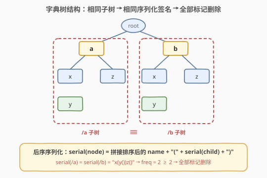
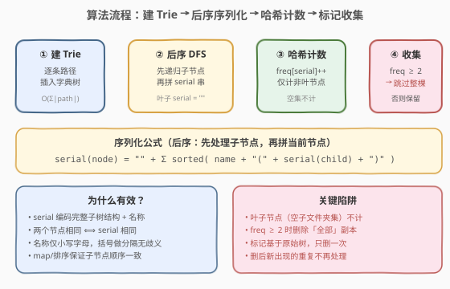
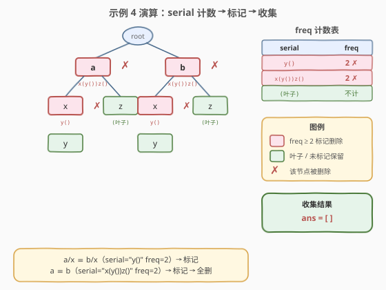

# LeetCode 删除系统中的重复文件夹 题解

## 1. 题目概述

- **标题 / 题号**：删除系统中的重复文件夹（#1948，hard）
- **链接**：https://leetcode.cn/problems/delete-duplicate-folders-in-system/
- **难度**：困难
- **标签**：深度优先搜索、字典树、哈希表、字符串、排序、哈希函数

**题意**：由于一个漏洞，文件系统中存在许多重复文件夹。给定二维数组 `paths`，其中 `paths[i]` 是一个表示文件系统中第 `i` 个文件夹**绝对路径**的字符串数组（如 `["a","b","c"]` 表示 `/a/b/c`）。

**相同文件夹**的定义：两个文件夹（不需要在同一层级）包含**非空且相同**的子文件夹集合，并具有相同的子文件夹结构。相同文件夹的根层级不需要相同。如果存在两个或以上相同文件夹，则需要将这些文件夹**及其所有子文件夹**标记为待删除。

> ⚠️ **关键规则**：
> - 文件系统**只执行一次删除操作**——基于原始树结构标记，删除后新出现的重复文件夹不再处理。
> - 子文件夹集合必须**非空**——两个空（叶子）文件夹即使同名也**不算**相同。
> - 出现重复时**全部删除**，而非保留一份。

**示例 1**：

```text
输入：paths = [["a"],["c"],["d"],["a","b"],["c","b"],["d","a"]]
输出：[["d"],["d","a"]]
解释：文件夹 "/a" 和 "/c"（及其子文件夹）都会被标记删除，
      因为它们都包含名为 "b" 的空文件夹。
```

**示例 2**：

```text
输入：paths = [["a"],["c"],["a","b"],["c","b"],["a","b","x"],["a","b","x","y"],["w"],["w","y"]]
输出：[["c"],["c","b"],["a"],["a","b"]]
解释：文件夹 "/a/b/x" 和 "/w"（及其子文件夹）都会被标记删除，
      因为它们都包含名为 "y" 的空文件夹。
      注意 "/a" 和 "/c" 删除后虽变为相同，但不在本次删除范围内。
```

**示例 4**：

```text
输入：paths = [["a"],["a","x"],["a","x","y"],["a","z"],["b"],["b","x"],["b","x","y"],["b","z"]]
输出：[]
解释："/a/x" ≡ "/b/x"（都含子文件夹 y）→ 标记删除；
      "/a" ≡ "/b"（都含子文件夹结构 x→y 和 z）→ 标记删除 → 全部删除。
```

**示例 5**：

```text
输入：paths = [["a"],["a","x"],["a","x","y"],["a","z"],["b"],["b","x"],["b","x","y"],["b","z"],["b","w"]]
输出：[["b"],["b","w"],["b","z"],["a"],["a","z"]]
解释：与示例 4 相比仅新增 "/b/w"。"/a/x" ≡ "/b/x" 仍被标记，
      但 "/a" 和 "/b" 因 "/b" 多了 "w" 而不再相同。
      "/a/z" 和 "/b/z" 都是空文件夹，不算相同。
```

**约束**：

- $1 \le \text{paths.length} \le 2 \times 10^4$
- $1 \le \text{paths[i].length} \le 500$
- $1 \le \text{paths[i][j].length} \le 10$，`paths[i][j]` 为小写英文字母
- $1 \le \sum \text{paths[i][j].length} \le 2 \times 10^5$
- 不会存在两条路径指向同一个文件夹；任意非根文件夹的父文件夹也包含在输入中

> 💡 **关键信号**：文件夹路径天然构成一棵**多叉树（Trie）**，而「相同子树结构」的判定本质是**子树序列化 + 哈希计数**——这与 [652. 寻找重复的子树](../0601-0700/652_寻找重复的子树.md) 是同一套路，只是从二叉树推广到了一般多叉 Trie。

## 2. 解题思路

### 2.1 暴力思路

将所有路径插入字典树后，对树中**每一对节点**做递归结构比较：两节点相同当且仅当它们的子节点名称集合相同且对应的子树也相同。共有 $O(N^2)$ 对节点，每对比较 $O(\text{子树大小})$，总复杂度 $O(N^2 \cdot S)$，$N$ 为节点数（可达 $2 \times 10^5$），完全不可行。

### 2.2 核心观察：后序序列化 + 哈希计数

**关键洞察**：如果能为每个节点计算一个**唯一表示其子树结构**的「签名」（serial），那么两个节点相同 $\iff$ serial 相同。用哈希表统计每种 serial 出现次数，出现 $\ge 2$ 次的即为重复。

serial 的计算采用**后序 DFS**——先递归处理所有子节点，再将子节点的名称和 serial 拼接成当前节点的 serial：

$$\text{serial}(\text{node}) = \prod_{\text{child} \in \text{sorted}(\text{children})} \Big(\text{name} + \text{``(''} + \text{serial}(\text{child}) + \text{``)''}\Big)$$

- **叶子节点**（无子节点）的 serial 为空串 `""`，**不计入** freq（空子文件夹集合不算相同）。
- 子节点按名称排序，保证相同结构的 serial 拼接顺序一致。
- 名称仅含小写字母，括号 `()` 作为分隔符不会与名称混淆，无歧义。



以示例 4 为例：

| 节点 | 子节点 | serial | freq | 是否标记 |
|------|--------|--------|------|----------|
| `y`（叶） | 无 | `""` | 不计 | 否 |
| `x`（a 下） | `{y}` | `"y()"` | 2 | ✗ 是 |
| `x`（b 下） | `{y}` | `"y()"` | 2 | ✗ 是 |
| `z`（叶） | 无 | `""` | 不计 | 否 |
| `a` | `{x, z}` | `"x(y())z()"` | 2 | ✗ 是 |
| `b` | `{x, z}` | `"x(y())z()"` | 2 | ✗ 是 |

`a` 和 `b` 的 serial 完全相同 → freq = 2 → 全部标记删除 → 结果为空。

> ⚠️ **为什么全部删除而非保留一份？** 题目明确要求「将这些文件夹和所有它们的子文件夹**标记**为待删除」——出现重复时，**所有**副本一并删除，不保留任何一个。这与 652 题（保留一个）不同。

### 2.3 算法流程



**四步走**：

1. **构建 Trie**：逐条路径插入字典树，共用公共前缀。
2. **后序 DFS 序列化**：对每个非叶节点，先递归子节点得到子 serial，再拼接 `name(serial(child))` 得到当前 serial。将 serial 存在节点上，同时 `freq[serial]++`。
3. **标记**：freq $\ge 2$ 的节点即为重复，需删除。
4. **收集**：从根 DFS，遇到标记节点**跳过整棵子树**（不收集、不递归），否则收集当前路径并继续递归。

> 💡 **为什么标记节点要跳过整棵子树？** 标记一个节点意味着它和它的所有子文件夹都被删除。由于 serial 编码了完整子树结构，父节点被标记时子节点必然也在被删除范围内（即使子节点自身的 freq < 2）。跳过整棵子树即可正确处理。

### 2.4 示例演算（示例 4）

以 `paths = [["a"],["a","x"],["a","x","y"],["a","z"],["b"],["b","x"],["b","x","y"],["b","z"]]` 为例：



**第一步：建 Trie**

```
root
├── a
│   ├── x
│   │   └── y
│   └── z
└── b
    ├── x
    │   └── y
    └── z
```

**第二步：后序序列化 + 计数**

```
dfs(y)       → 叶子, return ""          (不计入 freq)
dfs(x, /a/x) → "y()"                    freq["y()"] = 1
dfs(z, /a/z) → 叶子, return ""          (不计入 freq)
dfs(a)       → "x(y())z()"              freq["x(y())z()"] = 1
dfs(y)       → 叶子, return ""
dfs(x, /b/x) → "y()"                    freq["y()"] = 2  ← 重复!
dfs(z, /b/z) → 叶子, return ""
dfs(b)       → "x(y())z()"              freq["x(y())z()"] = 2  ← 重复!
dfs(root)    → "a(x(y())z())b(x(y())z())"  freq = 1
```

**第三步：标记 + 收集**

- `root`：freq = 1，不标记。递归进入 `a` 和 `b`。
- `a`：freq["x(y())z()"] = 2 ≥ 2，**标记** → 跳过 `a` 整棵子树。
- `b`：freq["x(y())z()"] = 2 ≥ 2，**标记** → 跳过 `b` 整棵子树。

**结果**：`ans = []`（全部删除）。

## 3. 参考代码

### Python

```python
class Solution:
    def deleteDuplicateFolder(self, paths: List[List[str]]) -> List[List[str]]:
        class Node:
            __slots__ = ('children', 'serial')
            def __init__(self):
                self.children = {}
                self.serial = ""

        root = Node()
        for p in paths:
            node = root
            for name in p:
                if name not in node.children:
                    node.children[name] = Node()
                node = node.children[name]

        freq = {}
        def serialize(node: Node) -> str:
            if not node.children:
                return ""
            parts = []
            for name in sorted(node.children):
                parts.append(name + "(" + serialize(node.children[name]) + ")")
            node.serial = "".join(parts)
            freq[node.serial] = freq.get(node.serial, 0) + 1
            return node.serial

        serialize(root)

        ans = []
        def collect(node: Node, path: List[str]):
            if node.children and freq[node.serial] >= 2:
                return
            if path:
                ans.append(path[:])
            for name in sorted(node.children):
                path.append(name)
                collect(node.children[name], path)
                path.pop()

        collect(root, [])
        return ans
```

### C++

```cpp
struct Node {
    map<string, Node*> children;
    string serial;
};

class Solution {
  public:
    vector<vector<string>> deleteDuplicateFolder(vector<vector<string>>& paths) {
        Node* root = new Node();
        for (auto& p : paths) {
            Node* cur = root;
            for (auto& name : p) {
                if (!cur->children.count(name))
                    cur->children[name] = new Node();
                cur = cur->children[name];
            }
        }

        unordered_map<string, int> freq;
        serialize(root, freq);

        vector<vector<string>> ans;
        vector<string> path;
        collect(root, freq, path, ans);
        return ans;
    }

  private:
    string serialize(Node* node, unordered_map<string, int>& freq) {
        if (node->children.empty()) return "";
        string s;
        for (auto& [name, child] : node->children) {   // map 已按 key 排序
            s += name + "(" + serialize(child, freq) + ")";
        }
        node->serial = s;
        freq[s]++;
        return s;
    }

    void collect(Node* node, unordered_map<string, int>& freq,
                 vector<string>& path, vector<vector<string>>& ans) {
        if (!node->children.empty() && freq[node->serial] >= 2) return;
        if (!path.empty()) ans.push_back(path);
        for (auto& [name, child] : node->children) {
            path.push_back(name);
            collect(child, freq, path, ans);
            path.pop_back();
        }
    }
};
```

> 💡 **实现细节**：
> - C++ 用 `map<string, Node*>`（红黑树，自动按 key 排序）保证子节点遍历顺序一致；Python 用 `sorted(node.children)` 显式排序。
> - `__slots__` 减少 Python 对象内存开销；C++ 用 `struct` + `new` 手动管理。
> - 递归深度最大 500（`paths[i].length ≤ 500`），Python 默认递归上限 1000 足够。
> - 收集时 `path[:]` / `push_back` 拷贝路径，避免回溯污染。

## 4. 复杂度分析

| 维度 | 复杂度 | 说明 |
|------|--------|------|
| 时间复杂度 | $O(N \cdot D + S)$ | $N$ 为节点数，$D$ 为平均深度；序列化时每节点拼接 serial 需遍历子节点，总串长 $S$；排序子键 $O(\sum \text{children} \log \text{children})$ |
| 空间复杂度 | $O(N \cdot D)$ | Trie 结构 $O(N)$；所有 serial 字符串总长 $O(N \cdot D)$（每节点 serial 含全部后代信息）；freq 哈希表 $O(\text{distinct serials})$ |

> 其中 $N \le 2 \times 10^5$（受 $\sum \text{paths[i][j].length} \le 2 \times 10^5$ 约束），$D \le 500$（路径最大深度）。最坏情况下（多条等长并行链）serial 总长可达 $O(N \cdot D)$，但实际测试用例远低于此上界。

## 5. 扩展：Merkle 哈希优化

当节点数极大时，字符串拼接的 $O(N \cdot D)$ 空间开销可能成为瓶颈。可借鉴 **Merkle 树**思想，用**整数哈希**替代字符串：

```python
def serialize_hash(node):
    if not node.children:
        return 0                       # 叶子的特殊哈希
    child_hashes = []
    for name in sorted(node.children):
        h = serialize_hash(node.children[name])
        child_hashes.append((name, h))
    # 用元组作为键，或对 (name, child_hash) 序列做多项式滚动哈希
    key = tuple(child_hashes)
    freq[key] += 1
    node.key = key
    return hash(key)                   # 返回整数哈希供父节点使用
```

- 每节点存储一个整数哈希而非长字符串，空间降为 $O(N)$。
- 父节点哈希 = `hash(tuple(sorted((name, child_hash))))`，碰撞概率极低。
- **权衡**：哈希有碰撞风险（可双哈希降低），字符串完全精确但更耗空间。面试中优先用字符串法（清晰无歧义），数据量极大时再切换哈希。

> 💡 这与 [652. 寻找重复的子树](../0601-0700/652_寻找重复的子树.md) 中「用 serial 字符串或元组做子树签名」是完全相同的设计模式——后序序列化产生子树指纹，哈希表统计重复。

## 6. 面试要点

1. **这道题和 652 寻找重复的子树有什么异同？**
   - **同**：都是「后序序列化子树 → 哈希计数找重复」的核心套路。652 是二叉树（固定左右子节点），本题是 Trie（子节点数量不定，需排序后拼接）。
   - **异**：652 重复时**保留一份**（返回其中一棵的根），本题重复时**全部删除**；652 只需返回根节点列表，本题需输出所有保留路径。

2. **为什么叶子节点不计入 freq？**
   - 题目要求子文件夹集合**非空且相同**。叶子节点的子文件夹集合为空，不满足「非空」条件。因此即使两个叶子同名（如 `/a/z` 和 `/b/z`），也不算相同文件夹。实现上，叶子 serial 为 `""` 且不加入 freq 表。

3. **「只删一次」是什么意思？为什么重要？**
   - 标记和删除都基于**原始树结构**。删除后可能产生新的重复（如示例 2 中 `/a` 和 `/c` 删除 `/a/b/x` 和 `/c/b` 后变得相同），但这些**不处理**。实现上，序列化和计数都在原始 Trie 上一次性完成，收集时只跳过被标记的节点，不做二次标记。

4. **serial 拼接时为什么要加括号 `name + "(" + serial + ")"`？**
   - 括号作为分隔符防止歧义。例如：子节点名 `"bc"`（叶子）拼接为 `"bc()"`，而两个子节点 `"b"` 和 `"c"`（均叶子）拼接为 `"b()c()"`，两者不同。若不加括号，`"bc"` vs `"b"+"c" = "bc"` 会碰撞。名称仅含小写字母，`(` `)` 不会出现在名称中，无歧义。

5. **收集时遇到标记节点为什么要跳过整棵子树？**
   - 标记一个节点意味着它和所有后代都被删除。即使某个子节点自身的 freq < 2，只要其祖先被标记，它也在删除范围内。跳过整棵子树是最自然的实现——从根 DFS，遇到 freq ≥ 2 的节点直接 return，不收集也不递归。

## 同类练习题

| # | 题目 | 与本题的关联 |
|---|------|-------------|
| 652 | [寻找重复的子树](https://leetcode.cn/problems/find-duplicate-subtrees/)（[站内题解](../0601-0700/652_寻找重复的子树.md)） | **最直接的同构题**——二叉树版的后序序列化 + 哈希计数找重复子树，与本题核心思想完全一致，对照学习 |
| 208 | [实现 Trie](https://leetcode.cn/problems/implement-trie-prefix-tree/)（[站内题解](../0201-0300/208_实现Trie.md)） | 字典树基础模板，本题建树阶段的前置知识 |
| 212 | [单词搜索 II](https://leetcode.cn/problems/word-search-ii/)（[站内题解](../0201-0300/212_单词搜索II.md)） | Trie + DFS 回溯的经典组合，巩固字典树操作 |
| 297 | [二叉树的序列化与反序列化](https://leetcode.cn/problems/serialize-and-deserialize-binary-tree/)（[站内题解](../0201-0300/297_二叉树的序列化与反序列化.md)） | 树结构序列化的范式题，理解如何用字符串唯一表示一棵树 |
| 449 | [序列化和反序列化二叉搜索树](https://leetcode.cn/problems/serialize-and-deserialize-bst/)（[站内题解](../0401-0500/449_序列化和反序列化二叉搜索树.md)） | 利用 BST 性质优化序列化，拓展对「树指纹」设计的理解 |
