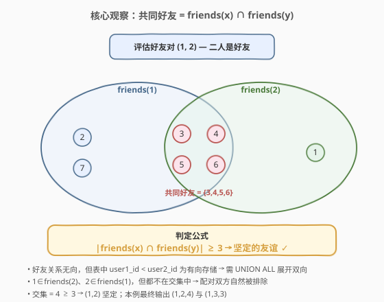
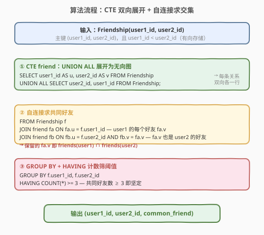
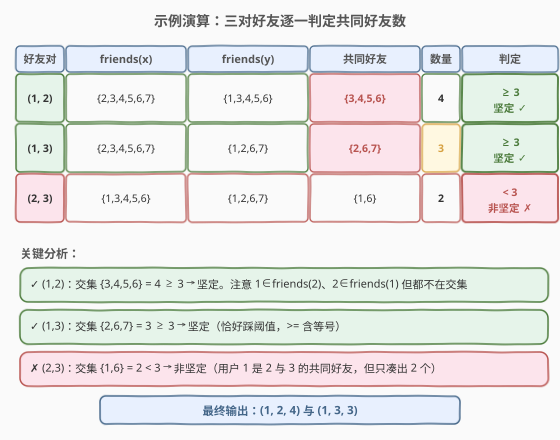

# 坚定的友谊

- **题目名称**：坚定的友谊
- **链接**：[1949. 坚定的友谊](https://leetcode.cn/problems/strong-friendship/)
- **难度**：中等
- **标签**：SQL、数据库、JOIN、GROUP BY、HAVING、UNION ALL、CTE、集合交集

## 1. 题目概述

给定 `Friendship` 表记录用户间的好友关系。如果 $x$ 与 $y$ 是**好友**且他们**至少有 3 个共同好友**，则 $x$ 与 $y$ 之间的友谊是**坚定的**。请编写 SQL 查询找出所有坚定的友谊，返回 `user1_id`、`user2_id`、`common_friend`（共同好友数）。结果不含重复行，`user1_id < user2_id`，任意顺序返回。

**表结构**：

```text
Table: Friendship
+-------------+------+
| Column Name | Type |
+-------------+------+
| user1_id    | int  |
| user2_id    | int  |
+-------------+------+
(user1_id, user2_id) 是该表主键（具有唯一值的列的组合）。
每行表示 user1_id 与 user2_id 是好友，且 user1_id < user2_id。
```

> ⚠️ 表中好友关系以 `user1_id < user2_id` 的**有向方式存储**（每对好友只存一行），但好友关系本质是**无向**的——这是本题的关键陷阱。

**示例 1**：

```text
输入：
Friendship 表:
+----------+----------+
| user1_id | user2_id |
+----------+----------+
| 1        | 2        |
| 1        | 3        |
| 2        | 3        |
| 1        | 4        |
| 2        | 4        |
| 1        | 5        |
| 2        | 5        |
| 1        | 7        |
| 3        | 7        |
| 1        | 6        |
| 3        | 6        |
| 2        | 6        |
+----------+----------+

输出：
+----------+----------+---------------+
| user1_id | user2_id | common_friend |
+----------+----------+---------------+
| 1        | 2        | 4             |
| 1        | 3        | 3             |
+----------+----------+---------------+
```

**解释**：

| 好友对 | friends(x) | friends(y) | 共同好友 | 数量 | 结论 |
|--------|------------|------------|----------|------|------|
| (1, 2) | {2,3,4,5,6,7} | {1,3,4,5,6} | {3,4,5,6} | 4 | ≥3 → 坚定 ✓ |
| (1, 3) | {2,3,4,5,6,7} | {1,2,6,7} | {2,6,7} | 3 | ≥3 → 坚定 ✓ |
| (2, 3) | {1,3,4,5,6} | {1,2,6,7} | {1,6} | 2 | <3 → 非坚定 ✗ |

- 用户 1 和 2 有 4 个共同好友（3、4、5、6）→ 坚定。
- 用户 1 和 3 有 3 个共同好友（2、6、7）→ 坚定。
- 用户 2 和 3 只有 2 个共同好友（1、6）→ 不坚定。

> 💡 本题是 SQL **"集合交集计数"招牌题**——难点不在 JOIN 本身，而在如何把「有向存储的好友表」转化为「无向好友集合」再做交集。考点覆盖：**UNION ALL 展开双向、自连接求交集、GROUP BY + HAVING 阈值过滤**。⚠️ 本题为 Plus 会员专享题，题面据公开用例与表结构整理。

---

## 2. 解题思路

### 2.1 暴力思路：直接自连接的陷阱

最直觉的写法是直接对 `Friendship` 自连接找共同好友。但 `Friendship` 以 `user1_id < user2_id` 有向存储——「$z$ 是 $x$ 的好友」这个事实可能出现在 `(x, z)` 行（$x < z$）也可能出现在 `(z, x)` 行（$z < x$），需要 `OR` 条件覆盖两种情况：

```sql
-- ✗ 笨重写法：每个好友判定都要 OR 两个方向
SELECT f.user1_id, f.user2_id, COUNT(DISTINCT z.??) AS common_friend
FROM Friendship f
JOIN Friendship z
  ON (z.user1_id = f.user1_id OR z.user2_id = f.user1_id)  -- z 是 user1 的好友
 AND (z.user1_id = f.user2_id OR z.user2_id = f.user2_id)  -- z 也是 user2 的好友
GROUP BY f.user1_id, f.user2_id;
```

> ⚠️ **致命缺陷**：`OR` 条件让优化器难以走索引，且 $z$ 的好友身份横跨两列，`COUNT` 与去重逻辑极易出错（$z$ 可能等于 $x$ 或 $y$ 本身，需额外排除；`DISTINCT` 也无法直接对「两列之一」去重）。根因是**存储有向、关系无向**的不匹配——「$z$ 是 $x$ 的好友」被拆进了两个列里。

### 2.2 核心观察：UNION ALL 展开为无向图 + 集合交集



**关键洞察**：先把 `Friendship` 用 `UNION ALL` 展开成**无向邻接表**——每条好友关系 $(a, b)$ 同时产生 $(a, b)$ 与 $(b, a)$ 两行。展开后，「$z$ 是 $x$ 的好友」只需单列等值 `u = x`，`v` 即好友列表，无需 `OR`。

在此基础上，**共同好友**就是两个好友集合的交集：

$$\text{common}(x, y) = \text{friends}(x) \cap \text{friends}(y)$$

用 SQL 表达：对每个好友对 $(x, y)$，取 $x$ 的每个好友 $z$（`fa.u = x`），再要求 $z$ 也是 $y$ 的好友（`fb.u = y AND fb.v = z`）。保留下的 $z$ 即交集元素，`COUNT(*)` 即交集大小。

> 💡 **配对双方为何自然被排除？** 展开后 `friends(x)` 不含 $x$ 自身（原图无自环，`UNION ALL` 也不产生 `(x,x)`），故 $x \notin \text{friends}(x)$；而 $y \in \text{friends}(x)$（$x$、$y$ 互为好友）但 $y \notin \text{friends}(y)$。因此 $x$、$y$ 都不会出现在交集中——交集天然只含「第三方」共同好友，无需手动排除。

### 2.3 算法流程图



**方法 A（CTE 双向展开 + 自连接，推荐）**：

1. **CTE `friend`**：`Friendship` `UNION ALL` 列互换的自身，得无向邻接表 `(u, v)`，每条关系双向各一行。
2. **自连接求交集**：`Friendship f`（驱动，保证只考察真实好友对且 `user1_id < user2_id`）`JOIN friend fa ON fa.u = f.user1_id`（$x$ 的好友 $z$）`JOIN friend fb ON fb.u = f.user2_id AND fb.v = fa.v`（$z$ 也是 $y$ 的好友）。
3. **分组计数筛阈值**：`GROUP BY f.user1_id, f.user2_id`，`HAVING COUNT(*) >= 3`。

### 2.4 示例演算

以官方样例演算三对好友的判定过程：



| 好友对 | friends(x) | friends(y) | 共同好友 | 数量 | 判定 |
|--------|------------|------------|----------|------|------|
| (1, 2) | {2,3,4,5,6,7} | {1,3,4,5,6} | {3,4,5,6} | 4 | ≥3 → 坚定 ✓ |
| (1, 3) | {2,3,4,5,6,7} | {1,2,6,7} | {2,6,7} | 3 | ≥3 → 坚定 ✓ |
| (2, 3) | {1,3,4,5,6} | {1,2,6,7} | {1,6} | 2 | <3 → 非坚定 ✗ |

- **(1, 2)**：friends(1) ∩ friends(2) = {3,4,5,6}，4 个 ≥ 3 → 命中。
- **(1, 3)**：friends(1) ∩ friends(3) = {2,6,7}，3 个 ≥ 3 → 命中（恰好踩阈值，`>=` 含等号）。
- **(2, 3)**：friends(2) ∩ friends(3) = {1,6}，仅 2 个 < 3 → 排除（用户 1 虽是 2 与 3 的共同好友，但只凑出 2 个）。

> 💡 **观察要点**：① 配对双方（1、2）分别只出现在对方的 friends 集合里，不在交集中，无需额外排除；② 阈值是「至少 3」即 `>= 3`，含等号；③ 驱动表用 `Friendship` 而非展开后的 `friend`，天然保证只考察真实好友对且 `user1_id < user2_id`。

---

## 3. 参考代码

### SQL（解法 A：CTE 双向展开 + 自连接，推荐）

```sql
WITH friend AS (
    SELECT user1_id AS u, user2_id AS v FROM Friendship
    UNION ALL
    SELECT user2_id AS u, user1_id AS v FROM Friendship
)
SELECT f.user1_id, f.user2_id, COUNT(*) AS common_friend
FROM Friendship f
JOIN friend fa ON fa.u = f.user1_id
JOIN friend fb ON fb.u = f.user2_id AND fb.v = fa.v
GROUP BY f.user1_id, f.user2_id
HAVING COUNT(*) >= 3;
```

> 💡 **写法要点**：
> - **CTE `friend`** 用 `UNION ALL`（不是 `UNION`）展开双向。由于原表 `user1_id < user2_id` 保证每对好友只存一行，展开后每个有向边 `(u, v)` 恰出现一次，不会产生重复行——`COUNT(*)` 精确等于交集大小。
> - **驱动表 `Friendship f`** 保证只考察真实好友对，且 `user1_id < user2_id` 天然满足输出约束。
> - **双 JOIN** 中 `fa.v` 是 $x$ 的好友，`fb.v = fa.v` 且 `fb.u = y` 要求该好友也是 $y$ 的好友 → 交集。配对双方因无自环自动排除。
> - ✓ **首选**：把「展开双向 / 求交集 / 阈值筛选」三步解耦，结构最清晰。

### SQL（解法 B：三路自连接变体）

```sql
WITH t AS (
    SELECT user1_id, user2_id FROM Friendship
    UNION ALL
    SELECT user2_id, user1_id FROM Friendship
)
SELECT t1.user1_id, t1.user2_id, COUNT(1) AS common_friend
FROM t AS t1
JOIN t AS t2 ON t1.user2_id = t2.user1_id
JOIN t AS t3 ON t1.user1_id = t3.user1_id
WHERE t3.user2_id = t2.user2_id AND t1.user1_id < t1.user2_id
GROUP BY t1.user1_id, t1.user2_id
HAVING COUNT(1) >= 3;
```

> 💡 **写法要点**：
> - 与解法 A 同构，换一种 JOIN 书写：`t1` 遍历所有有向边（`WHERE t1.user1_id < t1.user2_id` 筛回原始好友对），`t2` 取 `t1.user2_id` 的好友，`t3` 取 `t1.user1_id` 的好友，`t3.user2_id = t2.user2_id` 锁定共同好友。
> - 驱动表是展开后的 `t`（含双向边），故需 `WHERE t1.user1_id < t1.user2_id` 防止每对好友被双向各算一次。
> - 逻辑等价于解法 A，适合作为面试时的第二种口述写法。

### SQL（解法 C：IN 半连接求交集，紧凑版）

```sql
WITH friend AS (
    SELECT user1_id AS u, user2_id AS v FROM Friendship
    UNION ALL
    SELECT user2_id AS u, user1_id AS v FROM Friendship
)
SELECT f.user1_id, f.user2_id, COUNT(*) AS common_friend
FROM Friendship f
JOIN friend fa ON fa.u = f.user1_id
WHERE fa.v IN (SELECT v FROM friend WHERE u = f.user2_id)
GROUP BY f.user1_id, f.user2_id
HAVING COUNT(*) >= 3;
```

> 💡 **写法要点**：
> - 用 `IN` 半连接替代解法 A 的第二个 `JOIN`：`fa.v` 是 $x$ 的好友，`fa.v IN friends(y)` 即「也是 $y$ 的好友」→ 交集。
> - 半连接不复制行，`COUNT(*)` 同样精确。相关子查询 `(SELECT v FROM friend WHERE u = f.user2_id)` 引用外层 `f.user2_id`，每组触发一次。
> - 思路最贴近数学定义「$z \in \text{friends}(x) \land z \in \text{friends}(y)$」，可读性高。

### Python（pandas）

```python
import pandas as pd

def strong_friendship(friendship: pd.DataFrame) -> pd.DataFrame:
    bidir = pd.concat([
        friendship[['user1_id', 'user2_id']].rename(columns={'user1_id': 'u', 'user2_id': 'v'}),
        friendship[['user2_id', 'user1_id']].rename(columns={'user2_id': 'u', 'user1_id': 'v'}),
    ], ignore_index=True)
    common = (
        friendship.merge(bidir.rename(columns={'u': 'user1_id', 'v': 'friend_of_1'}), on='user1_id')
                  .merge(bidir.rename(columns={'u': 'user2_id', 'v': 'friend_of_2'}), on='user2_id')
                  .query('friend_of_1 == friend_of_2')
    )
    res = (
        common.groupby(['user1_id', 'user2_id']).size().reset_index(name='common_friend')
              .query('common_friend >= 3')
              .sort_values(['user1_id', 'user2_id']).reset_index(drop=True)
    )
    return res
```

> 💡 **pandas 对照**：
> - `pd.concat` 两份列互换的 `friendship` 对应 `UNION ALL` 展开双向。
> - 两次 `merge`：第一次对齐好友对与 `user1` 的好友行，第二次对齐 `user2` 的好友行；`query('friend_of_1 == friend_of_2')` 即 `fb.v = fa.v` 锁定共同好友。
> - `groupby(...).size()` 对应 `COUNT(*)`，`query('common_friend >= 3')` 对应 `HAVING`，与 SQL 解法 A 完全同构。

---

## 4. 复杂度分析

| 维度 | 解法 A（CTE 双 JOIN） | 解法 B（三路自连接） | 解法 C（IN 半连接） |
|------|----------------------|----------------------|----------------------|
| **时间** | $O(F + F \cdot \bar{d}^2)$ | $O(F + F \cdot \bar{d}^2)$ | $O(F + F \cdot \bar{d}^2)$ |
| **空间** | $O(F)$（CTE 物化） | $O(F)$（CTE 物化） | $O(F)$（CTE 物化） |
| **全表扫描** | 2 次（`Friendship` ×2） | 2 次 | 2 次 + 子查询 |
| **可读性** | ★★★ 分层清晰 | ★★ JOIN 链较长 | ★★★ 贴近定义 |
| **推荐度** | ✓ **首选** | ✓ 备选口述 | ✓ 直观备选 |

> - $F$ = `Friendship` 行数，$\bar{d}$ = 单人平均好友数（图平均度数）。
> - 三解法核心开销都在「对每对好友 × 各自好友列表做等值连接」——即 $F$ 对好友 × $\bar{d}^2$ 量级的局部笛卡尔。若给 `friend(u, v)` 建索引，等值连接走索引，实际接近 $O(F \cdot \bar{d})$。
> - 解法 C 的相关子查询每组触发一次 `friends(y)` 查询，有索引时为 $O(\log F)$，整体仍同阶。
> - 三种解法结果完全一致（均输出 `(1,2,4)` 与 `(1,3,3)`）。

---

## 5. 扩展：图论视角与 UNION 去重

### 5.1 共同好友 = 共同邻居（三角形计数）

把 `Friendship` 视作无向图 $G=(V,E)$，好友即邻接点。$x$、$y$ 的共同好友即两者的**共同邻居** $N(x) \cap N(y)$。每个共同好友 $z$ 与边 $(x,y)$ 构成一个**三角形** $(x,y,z)$，故「共同好友数」= 经过边 $(x,y)$ 的三角形数。`HAVING COUNT(*) >= 3` 即「该边至少落在 3 个三角形中」。

> 💡 这与图算法中的**三角形计数**（triangle counting）一脉相承——后者统计全图三角形总数，本题统计**每条边的三角形数**并筛阈值。在稠密社交图上，共同邻居数也是**链路预测**（预测两个未连边用户是否会成为好友）的经典指标（Common Neighbors index）。

### 5.2 UNION ALL vs UNION

| 选项 | 去重 | 开销 | 适用 |
|------|------|------|------|
| `UNION ALL` | 否 | $O(F)$ | 数据无重复有向边（本题：主键 + `user1_id < user2_id` 保证） |
| `UNION` | 是 | $O(F \log F)$ | 数据可能含重复行，需去重保 `COUNT` 正确 |

> ⚠️ 若误用 `UNION` 去重虽结果正确但多一次排序；若数据有重复却用 `UNION ALL`，`COUNT(*)` 会虚高。本题主键保证无重复，`UNION ALL` 最优。

---

## 6. 面试要点

**Q1：为什么要用 UNION ALL 而不是直接自连接？**

> `Friendship` 以 `user1_id < user2_id` 有向存储，但好友关系无向。直接自连接时，「$z$ 是 $x$ 的好友」要 `OR` 覆盖 `(x,z)` 与 `(z,x)` 两种存储位置，`OR` 难走索引、`COUNT` 易重复、且要手动排除 $z = x$ 或 $z = y$。`UNION ALL` 把每条关系展开成双向两行，后续好友判定退化为单列等值 `u = x`，干净且可走索引。

**Q2：配对双方（x、y）为什么不会被误算作共同好友？**

> 展开后 `friends(x)` 不含 $x$ 自身（原图无自环，`UNION ALL` 也不产生 `(x,x)`）。而 $y \in \text{friends}(x)$（$x$、$y$ 互为好友）但 $y \notin \text{friends}(y)$，故 $y$ 不在交集；对称地 $x$ 也不在交集。交集天然只含第三方共同好友，无需额外 `WHERE z != x AND z != y`。

**Q3：为什么用 UNION ALL 而不是 UNION？**

> 原表主键 `(user1_id, user2_id)` 且 `user1_id < user2_id`，保证每对好友只存一行，展开后每个有向边恰出现一次，无重复。`UNION ALL` 不去重，省去排序去重的 $O(F \log F)$ 开销，且 `COUNT(*)` 精确。若数据源可能含重复行，则必须用 `UNION` 去重以防 `COUNT` 虚高。

**Q4：驱动表为什么用 Friendship 而不是展开后的 friend？**

> 用 `Friendship f` 作驱动，天然只考察真实好友对，且 `user1_id < user2_id` 直接满足输出约束。若用展开后的 `friend` 作驱动（如解法 B），每对好友会被双向各遍历一次，需额外 `WHERE t1.user1_id < t1.user2_id` 筛回——多一步过滤且易漏写。

**Q5：阈值「至少 3 个共同好友」如何映射到 SQL？**

> `GROUP BY f.user1_id, f.user2_id` 后，每组即一个好友对的全部共同好友行，`COUNT(*)` 即共同好友数。`HAVING COUNT(*) >= 3` 筛选 ≥ 3 的组。注意是 `>=`（含等号，3 个也算坚定）。无共同好友的好友对在 `INNER JOIN` 下不产生行，自动排除——符合「只输出坚定友谊」的题意。

> 💡 **一句话总结**：1949 是 SQL **"集合交集计数"招牌题**——核心利用 `UNION ALL` 把有向存储展开为无向邻接表，再自连接求 `friends(x) ∩ friends(y)`，`GROUP BY + HAVING COUNT(*) >= 3` 筛阈值。记住「展开双向 → 单列等值求交集 → 配对双方因无自环自动排除」这条主线。

---

## 7. 同类练习题

- [602. 好友申请 II：谁有最多的好友](https://leetcode.cn/problems/friend-requests-ii-who-has-the-most-friends/)：`UNION ALL` 把 `user1_id`/`user2_id` 展平统计好友数——与 1949 的「展开双向」同源预处理
- [181. 超过经理薪水的员工](https://leetcode.cn/problems/employees-earning-more-than-their-managers/)：自连接做关联比较，对照 1949 的自连接求交集
- [1971. 寻找图中是否存在路径](https://leetcode.cn/problems/find-if-path-exists-in-graph/)：无向图的邻接表 + 连通性判定，与 1949 把好友表视作无向图同思路（算法题，可对照 SQL 的图建模）
- [1757. 可回收且低脂的产品](https://leetcode.cn/problems/recyclable-and-low-fat-products/)：`WHERE` 多条件交集筛选（最简形态），对照 1949 用 `HAVING` 做计数型交集
- [1398. 购买了产品 A 和产品 B 却没有购买产品 C 的顾客](https://leetcode.cn/problems/customers-who-bought-products-a-and-b-but-not-c/)：`GROUP BY + HAVING` 用聚合数判定集合包含/排除——与 1949 的 `HAVING COUNT(*) >= 3` 同为「用计数表达集合关系」范式
