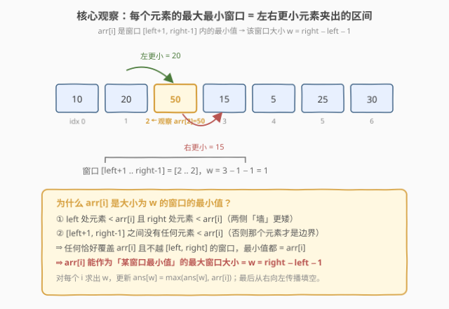
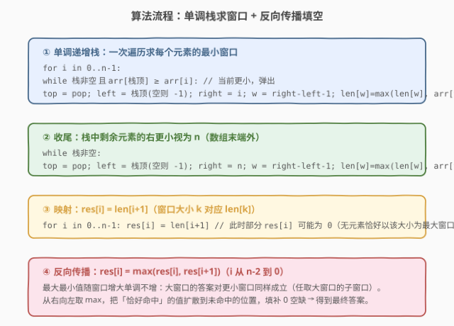
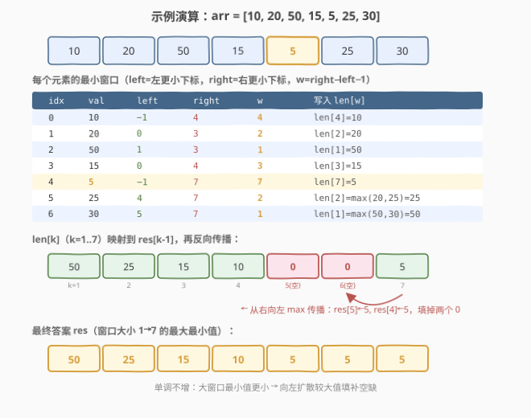

# LeetCode 所有子数组最小值中的最大值 题解

## 1. 题目概述

- **标题 / 题号**：所有子数组最小值中的最大值（#1950，medium）
- **链接**：https://leetcode.cn/problems/maximum-of-minimum-values-in-all-subarrays/
- **难度**：中等
- **标签**：栈、单调栈、数组

**题意**：给定一个长度为 $n$ 的整数数组 `arr`。对于每一个窗口大小 $k$（$1 \le k \le n$），考察所有长度为 $k$ 的连续子数组，取出每个子数组的**最小值**，再在这些最小值中取**最大值**，作为 $k$ 对应的答案。

返回长度为 $n$ 的数组 `ans`，其中 `ans[i]` 为窗口大小 $k = i + 1$ 的答案。

**示例 1**：

```text
输入：arr = [10,20,50,15,5,25,30]
输出：[50,25,15,10,5,5,5]
解释：
- 窗口大小 1：各子数组最小值 = [10,20,50,15,5,25,30]，最大值 = 50
- 窗口大小 2：各子数组最小值 = [10,20,15,5,5,25]，最大值 = 25
- 窗口大小 3：各子数组最小值 = [10,15,5,5,5]，最大值 = 15
- 窗口大小 4：各子数组最小值 = [10,5,5,5]，最大值 = 10
- 窗口大小 5、6、7：最小值均为 5，最大值 = 5
```

**约束**：

- $1 \le n \le 10^5$
- $-10^9 \le \text{arr}[i] \le 10^9$

> 💡 **审题关键**：① 要对**每一个**窗口大小 $k \in [1, n]$ 都给出答案，而非单个 $k$；② 答案随 $k$ 增大**单调不增**——窗口越大，最小值越小，最大值自然不增；③ $n$ 可达 $10^5$，必须做到 $O(n)$，排除对每个 $k$ 重新滑窗的 $O(n^2)$ 做法。

## 2. 解题思路

### 2.1 暴力思路：枚举每个窗口大小

最直白的做法：对每个 $k$ 从 $1$ 到 $n$，滑动所有 $O(n)$ 个窗口、每个窗口 $O(k)$ 求最小值，跟踪最大。总体 $O(n^3)$。

稍加改进：对每个 $k$ 用**单调队列** $O(n)$ 求所有窗口最小值，再取 max，总体 $O(n^2)$。当 $n = 10^5$ 时仍超时。

> ⚠️ 暴力的瓶颈在于「**对每个 $k$ 重复滑窗**」。突破口是**换视角**：不再问「每个 $k$ 的答案是谁」，而是问「**每个元素能作为哪个窗口大小的最小值**」——把 $n$ 个窗口大小的求解压缩成 $n$ 个元素的一次扫描。

### 2.2 核心观察：每个元素的最大最小窗口



对每个元素 $\text{arr}[i]$，定义：

- $\text{left}[i]$：**左侧最近的更小元素**的下标（不存在则 $-1$）；
- $\text{right}[i]$：**右侧最近的更小元素**的下标（不存在则 $n$）。

那么在开区间 $(\text{left}[i], \text{right}[i])$ 内，$\text{arr}[i]$ 是**最小值**（两侧有更矮的「墙」挡着，区间内没有任何元素比它更小）。因此 $\text{arr}[i]$ 能作为最小值的**最大窗口大小**为：

$$w_i = \text{right}[i] - \text{left}[i] - 1$$

> 💡 **为什么是「最大」窗口？** 任何恰好覆盖 $i$ 且不越过 $\text{left}[i]$、$\text{right}[i]$ 的窗口，最小值都是 $\text{arr}[i]$。这些窗口大小可以是从 $1$ 到 $w_i$ 的任意值——但 $\text{arr}[i]$ 对「窗口大小恰好 $w_i$」的贡献是确定的。对于更小的窗口大小，会有别的元素提供不劣于 $\text{arr}[i]$ 的答案（见 2.4 反向传播）。

于是得到关键映射：**窗口大小 $w_i$ 的答案候选里包含 $\text{arr}[i]$**，即

$$\text{len}[w_i] = \max(\text{len}[w_i],\ \text{arr}[i])$$

其中 $\text{len}[\cdot]$ 是长度 $n+1$ 的辅助数组，$\text{len}[k]$ 表示「恰好以某元素的最大窗口 $= k$」中的最大元素值。

### 2.3 算法流程图



整体四步：

1. **单调递增栈求窗口**：一次从左到右扫描。栈中保存**下标**且对应值单调递增。遇到 $\text{arr}[i]$ 更小时，栈顶元素出栈——此时 $\text{right}[\text{top}] = i$，$\text{left}[\text{top}]$ 为出栈后新的栈顶（空则 $-1$），计算 $w$ 并更新 $\text{len}[w]$。
2. **收尾**：扫描结束后栈中剩余元素，其 $\text{right}$ 视为 $n$（右侧无更小元素），同样计算 $w$ 并更新 $\text{len}[w]$。
3. **映射**：$\text{res}[i] = \text{len}[i+1]$（窗口大小 $k = i+1$ 对应 $\text{len}[k]$）。此时部分 $\text{res}[i]$ 可能为 $0$（没有元素恰好以该大小为最大窗口）。
4. **反向传播**：从 $i = n-2$ 到 $0$，$\text{res}[i] = \max(\text{res}[i], \text{res}[i+1])$。

> ⚠️ **相等元素的处理**：栈判定用 `arr[栈顶] >= arr[i]`（带等号）弹出。这样对相等元素，**左边那个的右边界会被右边那个截断**，避免重复计算同一窗口大小——只要有一个相等元素能撑起该窗口即可，取 max 不影响结果。

### 2.4 为什么反向传播能填空

$\text{len}[k]$ 只记录了「**恰好**以 $k$ 为最大窗口」的元素。但有些 $k$ 可能没有元素恰好命中（例如示例中 $k=5,6$），$\text{len}[k]=0$。

关键性质：**答案随窗口大小单调不增**。若某元素是窗口大小 $w$ 的最大最小值（$\text{len}[w]=v$），那么对任意 $k < w$，答案至少为 $v$（因为可以取该 $w$ 窗口的任意 $k$ 长子窗口，其最小值 $\ge v$，于是 $k$ 的最大最小值 $\ge v$）。

因此从右向左取 max：$\text{res}[i] = \max(\text{res}[i], \text{res}[i+1])$，把较大值向左扩散，自然填平所有 $0$ 空缺。

### 2.5 示例演算

以 `arr = [10,20,50,15,5,25,30]` 演示：



| idx | val | left | right | $w$ | 写入 $\text{len}[w]$ |
|-----|-----|------|-------|-----|----------------------|
| 0 | 10 | $-1$ | 4 | 4 | $\text{len}[4]=10$ |
| 1 | 20 | 0 | 3 | 2 | $\text{len}[2]=20$ |
| 2 | 50 | 1 | 3 | 1 | $\text{len}[1]=50$ |
| 3 | 15 | 0 | 4 | 3 | $\text{len}[3]=15$ |
| 4 | 5 | $-1$ | 7 | 7 | $\text{len}[7]=5$ |
| 5 | 25 | 4 | 7 | 2 | $\text{len}[2]=\max(20,25)=25$ |
| 6 | 30 | 5 | 7 | 1 | $\text{len}[1]=\max(50,30)=50$ |

$\text{len}[1..7] = [50, 25, 15, 10, 0, 0, 5]$ → 映射得 $\text{res} = [50,25,15,10,0,0,5]$ → 反向传播填两个 $0$ → 最终 $[50,25,15,10,5,5,5]$。

> 💡 **注意 $k=5,6$ 为何空**：没有任何元素的「最大最小窗口」恰好是 $5$ 或 $6$（最小元素 $5$ 直接撑到 $7$，$10$ 撑到 $4$）。反向传播时 $\text{res}[6] \leftarrow \text{res}[7]=5$、$\text{res}[5] \leftarrow \text{res}[6]=5$，正好补上。

## 3. 参考代码

### C++

```cpp
#include <climits>
class Solution {
public:
    vector<int> findMaximums(vector<int>& arr) {
        int n = arr.size();
        // 初始化为 INT_MIN：未被任何元素「恰好命中」的窗口大小留待反向传播填空
        vector<int> len(n + 1, INT_MIN), res(n);
        stack<int> st; // 存下标，对应值单调递增

        for (int i = 0; i < n; ++i) {
            while (!st.empty() && arr[st.top()] >= arr[i]) {
                int top = st.top(); st.pop();
                int left = st.empty() ? -1 : st.top();
                int right = i;
                int w = right - left - 1;
                len[w] = max(len[w], arr[top]);
            }
            st.push(i);
        }
        while (!st.empty()) {
            int top = st.top(); st.pop();
            int left = st.empty() ? -1 : st.top();
            int right = n;
            int w = right - left - 1;
            len[w] = max(len[w], arr[top]);
        }

        for (int i = 0; i < n; ++i) res[i] = len[i + 1];
        for (int i = n - 2; i >= 0; --i) res[i] = max(res[i], res[i + 1]);
        return res;
    }
};
```

### Python

```python
class Solution:
    def findMaximums(self, arr: List[int]) -> List[int]:
        n = len(arr)
        # 初始化为 -inf：未被任何元素「恰好命中」的窗口大小留待反向传播填空
        length = [float('-inf')] * (n + 1)
        st = []  # 存下标，对应值单调递增

        for i in range(n):
            while st and arr[st[-1]] >= arr[i]:
                top = st.pop()
                left = st[-1] if st else -1
                right = i
                w = right - left - 1
                length[w] = max(length[w], arr[top])
            st.append(i)

        while st:
            top = st.pop()
            left = st[-1] if st else -1
            right = n
            w = right - left - 1
            length[w] = max(length[w], arr[top])

        res = [length[i + 1] for i in range(n)]
        for i in range(n - 2, -1, -1):
            res[i] = max(res[i], res[i + 1])
        return res
```

> 💡 **写法对照**：① C++ 用 `stack<int>` 存下标，出栈后 `st.top()` 即为左更小元素，空栈用 $-1$ 哨兵；② Python 用列表模拟栈，`st[-1]` 取栈顶，逻辑完全对称。两者都把「右更小」分为两种来源——扫描中遇到 `arr[i]` 更小（`right=i`）与收尾时栈内剩余（`right=n`）。

## 4. 复杂度分析

| 维度 | 复杂度 | 说明 |
|------|--------|------|
| 时间复杂度 | $O(n)$ | 每个下标至多入栈、出栈各一次，栈操作合计 $O(n)$；反向传播一次 $O(n)$ |
| 空间复杂度 | $O(n)$ | 栈至多 $n$ 个元素、`len` 数组 $n+1$、`res` 数组 $n$（输出不计则 $O(n)$ 辅助） |

> 💡 **为什么是 $O(n)$ 而非 $O(n \log n)$？** 本题无需排序，仅靠单调栈的「每个元素进出栈各一次」即可在 $O(n)$ 内确定所有窗口大小。这是单调栈家族（739 每日温度、84 柱状图最大矩形）的共性：用栈维护单调性，把「找最近更小」的 $O(n^2)$ 暴搜摊还到 $O(n)$。

## 5. 扩展：与「柱状图最大矩形」的同构

本题与 [84. 柱状图中的最大矩形](https://leetcode.cn/problems/largest-rectangle-in-histogram/) 共享同一套单调栈骨架：

- **84 题**：对每根柱子，找左右**更矮**的柱子，得到以该柱高度为高的最大矩形宽度 $w = \text{right} - \text{left} - 1$，更新面积 $h \times w$。
- **本题**：对每个元素，找左右**更小**的元素，得到以该元素为最小值的最大窗口宽度 $w = \text{right} - \text{left} - 1$，更新 $\text{len}[w] = \max(\text{len}[w], \text{arr}[i])$。

两者都是「**用左右更小元素界定某个值的最大作用范围**」。差别只在后续处理：84 题对所有柱子取最大面积，本题按窗口大小分桶后反向传播。理解了 84 题的「以每根柱子为最矮」思路，本题就是它的「分桶 + 传播」变体。

## 6. 面试要点

**Q1：为什么答案是单调不增的？**

> 窗口越大，包含的元素越多，最小值只会更小或不变。所以窗口大小 $k$ 的「最大最小值」随 $k$ 增大单调不增。这也是反向传播 `res[i] = max(res[i], res[i+1])` 成立的数学依据。

**Q2：栈判定为什么用 `>=` 而非 `>`？**

> 用 `>=` 弹出相等元素，使左侧相等元素的右边界被右侧相等元素截断，避免两个相等元素都 claiming 同一最大窗口。由于取 max，只需其中一个撑起该窗口即可，结果不受影响；而严格 `>` 会导致相等元素互相不截断，可能把窗口算大、产生错误答案。

**Q3：`len` 数组里为什么会有 0 空缺？**

> $\text{len}[k]$ 只记录「恰好以 $k$ 为最大窗口」的元素。若所有元素的 $w$ 都不等于某个 $k$（被更小元素直接撑到更大窗口），该位就是 0。反向传播用右侧较大值填平——因为大窗口的答案对小窗口同样成立。

**Q4：能否不用反向传播，直接对每个 $k$ 取所有 $w \ge k$ 的元素最大值？**

> 可以，等价于对 $\text{len}$ 做「后缀最大」$\text{sufMax}[k] = \max_{j \ge k} \text{len}[j]$，而反向传播 `res[i] = max(res[i], res[i+1])` 正是计算后缀最大。两者完全等价，反向传播写法更简洁、原地完成。

**Q5：如果只问单个窗口大小 $k$ 的答案，能否更快？**

> 可以用滑动窗口最小值（单调队列）$O(n)$ 直接求所有大小 $k$ 窗口的最小值再取 max。但本题要求**所有** $k$ 都给答案，逐个做是 $O(n^2)$。单调栈一次扫描产出所有 $k$ 的候选，是 $O(n)$ 全量求解的关键。

> 💡 **一句话总结**：单调栈求每个元素的「左右更小」→ 算出其最大最小窗口 $w$ → 按桶更新 $\text{len}[w]$ → 反向传播（后缀 max）填空 → $O(n)$ 全量求解。

## 同类练习题

| # | 题目 | 与本题的关联 |
|---|------|-------------|
| 84 | [柱状图中的最大矩形](https://leetcode.cn/problems/largest-rectangle-in-histogram/) | 同一套单调栈骨架，找左右更矮柱子界定每根柱子的最大宽度，是本题的「面积版」原型 |
| 739 | [每日温度](https://leetcode.cn/problems/daily-temperatures/) | 单调栈求「右侧下一个更大」的经典入门，对照体会「更大」与「更小」的方向反转 |
| 239 | [滑动窗口最大值](https://leetcode.cn/problems/sliding-window-maximum/) | 单调队列求固定窗口最值，对照「单窗口 $k$」与「全窗口 $k$」两种问法的解法差异 |
| 907 | [子数组的最小值之和](https://leetcode.cn/problems/sum-of-subarray-minimums/) | 同样用「左右更小元素」界定每个元素作为最小值的作用范围，求和而非取最大，是本题的「求和版」变体 |
| 1856 | [子数组最小乘积的最大值](https://leetcode.cn/problems/maximum-subarray-min-product/) | 单调栈求每元素作为最小值的最大窗口，再结合前缀和算子数组元素和取最大乘积，综合 84 与前缀和 |
