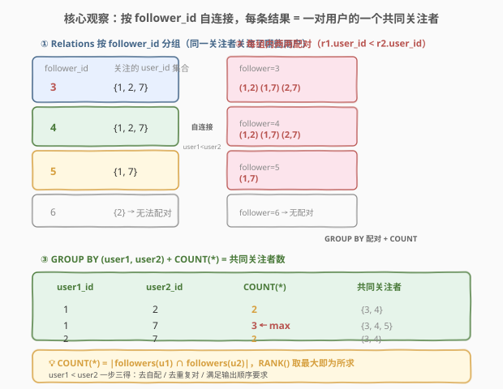
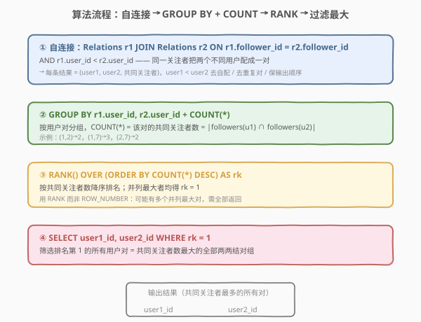
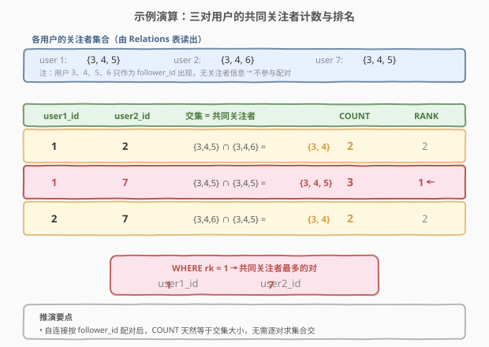

# LeetCode 查询具有最多共同关注者的所有两两结对组 题解

## 1. 题目概述

- **标题 / 题号**：查询具有最多共同关注者的所有两两结对组（#1951，medium）
- **链接**：https://leetcode.cn/problems/all-the-pairs-with-the-maximum-number-of-common-followers/
- **难度**：中等
- **标签**：SQL、自连接、GROUP BY、COUNT、RANK、窗口函数、集合交集

**题意**：给定 `Relations` 表，每行记录一条关注关系：`follower_id` 这个用户关注了 `user_id` 这个用户。两个用户的**共同关注者**是指同时关注这两个人的用户，即两人关注者集合的交集。编写 SQL 查询，找到**具有最多共同关注者的所有两两结对组**——如果有多个并列最大的对，全部返回。

**表结构**：

```text
表: Relations
+-------------+------+
| Column Name | Type |
+-------------+------+
| user_id     | int  |   ← 被关注者（主键之一）
| follower_id | int  |   ← 关注者（主键之一）
+-------------+------+
(user_id, follower_id) 是该表的主键。
每行表示 follower_id 这个用户关注了 user_id 这个用户。
```

> 💡 **审题关键**：① **共同关注者 = 两人关注者集合的交集**——followers(u1) ∩ followers(u2)，不是「两人共同被多少人关注」之外的其他含义；② 结果要求 `user1_id < user2_id`，既避免了自配对（u,u），又避免了同一对出现两次（(a,b) 和 (b,a)）；③ **「所有」并列最大的对**——不止返回一个，需用 `RANK()` 或 `MAX` 子查询保留全部并列第一；④ 只作为 `follower_id` 出现的用户（如示例中的 3、4、5、6）没有关注者信息，不参与配对——它们天然被排除，无需特殊处理。

**示例 1**：

```text
输入：
Relations 表:
+---------+-------------+
| user_id | follower_id |
+---------+-------------+
| 1       | 3           |
| 2       | 3           |
| 7       | 3           |
| 1       | 4           |
| 2       | 4           |
| 7       | 4           |
| 1       | 5           |
| 2       | 6           |
| 7       | 5           |
+---------+-------------+

输出:
+----------+----------+
| user1_id | user2_id |
+----------+----------+
| 1        | 7        |
+----------+----------+
```

**解释**：

| 用户对 | followers(u1) | followers(u2) | 交集（共同关注者） | 数量 |
|--------|---------------|---------------|---------------------|------|
| (1, 2) | {3, 4, 5} | {3, 4, 6} | {3, 4} | 2 |
| (1, 7) | {3, 4, 5} | {3, 4, 5} | {3, 4, 5} | **3 ← max** |
| (2, 7) | {3, 4, 6} | {3, 4, 5} | {3, 4} | 2 |

最大共同关注者数为 3，只有 (1, 7) 这一对达到，故返回 `(1, 7)`。

> 💡 本题是 SQL **「自连接求集合交集 + 窗口函数取最值」** 的经典题。骨架与 [602. 好友申请 II：谁有最多的好友](../0601-0700/602_好友申请II谁有最多的好友.md) 的「自连接 + 聚合求最值」同源，但 1951 多了两道坎：① 不是对单个用户求最值，而是对**用户对**求最值——需要自连接配对；② 不是取唯一最大，而是取**所有并列最大**——需要 `RANK()` 或子查询 `MAX`。它是「集合交集 + 并列最值」组合的母题。

## 2. 解题思路

### 2.1 暴力思路：逐对求交集

最直觉的过程式思路：枚举所有用户对 (u1, u2)（u1 < u2），分别收集两人的关注者集合，求交集大小，最后取最大值并返回所有达到最大值的对。伪代码如下：

```text
pairs = []
for u1 in all_users:
    for u2 in all_users where u2 > u1:
        common = followers(u1) ∩ followers(u2)
        pairs.append((u1, u2, len(common)))
max_cnt = max(p.cnt for p in pairs)
return [(p.u1, p.u2) for p in pairs if p.cnt == max_cnt]
```

但**纯 SQL 没有显式的双层循环与集合求交**——「枚举用户对 + 求交集」需换成集合式表达。关键转换在于：**与其逐对求交集，不如让同一个关注者把所有他关注的人两两配对**——自连接天然完成这件事。

> ⚠️ 关键转换：把「枚举用户对 → 求交集」翻译成「按 `follower_id` 自连接 → 每条连接结果就是一个共同关注者」；把「取最大值并保留并列」翻译成 `RANK() OVER (ORDER BY COUNT DESC)` + `WHERE rk = 1`，或等价的 `HAVING COUNT = (SELECT MAX(...))`。

### 2.2 核心观察：自连接按 follower_id 配对



**三道关卡**：

1. **自连接配对（JOIN ON follower_id）**：把 `Relations` 与自身连接，条件是 `r1.follower_id = r2.follower_id`——意思是「同一个关注者同时关注了 r1.user_id 和 r2.user_id」。每条连接结果就是「一对用户的一个共同关注者」。例如关注者 3 关注了用户 {1, 2, 7}，自连接后产生 (1,2), (1,7), (2,7) 三对，每对都「共享关注者 3」。

   $$\text{连接结果} = \{(u_1, u_2, f) \mid f \in \text{followers}(u_1) \cap \text{followers}(u_2)\}$$

2. **去自配 + 去重 + 保序（r1.user_id < r2.user_id）**：附加条件 `r1.user_id < r2.user_id` 一步三得——① 排除自配对 (u, u)（自己与自己不算「两两结对」）；② 去除重复对（只保留 (1,2) 不保留 (2,1)）；③ 满足输出要求 `user1_id < user2_id`。

3. **分组计数 = 交集大小（GROUP BY + COUNT）**：对连接结果按 (user1, user2) 分组，`COUNT(*)` 即为该对的共同关注者数——因为每条连接行对应一个共同关注者，组内行数就是交集大小。

   $$\text{COUNT}^*\big|_{(u_1, u_2)} = \big|\text{followers}(u_1) \cap \text{followers}(u_2)\big|$$

4. **取所有并列最大（RANK / MAX 子查询）**：题目要求返回**所有**共同关注者数最大的对。用 `RANK() OVER (ORDER BY COUNT(*) DESC)` 排名，`WHERE rk = 1` 筛出全部并列第一；或用 `HAVING COUNT(*) = (SELECT MAX(cnt) FROM ...)` 子查询等价实现。

$$\boxed{\text{结果} = \{(u_1, u_2) \mid \text{COUNT}^*(u_1, u_2) = \max_{(a,b)} \text{COUNT}^*(a, b),\; u_1 < u_2\}}$$

> 💡 **为什么自连接天然求交集？** 集合交集的定义是「同时属于两个集合的元素」。自连接 `r1.follower_id = r2.follower_id` 找的正是「同时出现在两个用户关注者列表中的 follower_id」——每条匹配就是一个交集元素。`GROUP BY` 用户对后 `COUNT` 即得交集大小。这比「先收集两人各自的关注者集合再求交」高效得多——SQL 引擎在连接时就完成了配对。

> ⚠️ **最常见的错解**：① 忘记 `r1.user_id < r2.user_id`，导致出现 (1,2) 和 (2,1) 两个重复对，以及自配对 (1,1)；② 用 `ROW_NUMBER()` 而非 `RANK()`——`ROW_NUMBER` 即使并列也只给一行 rk=1，会漏掉并列最大的对；③ 在 `GROUP BY` 后直接写 `HAVING COUNT(*) = MAX(COUNT(*))`——这在 MySQL 中不合法，`MAX(COUNT(*))` 不是有效的聚合嵌套，必须用子查询。

### 2.3 算法流程图



**逻辑执行步骤**：

| 步骤 | 子句 | 作用 |
|------|------|------|
| ① | `Relations r1 JOIN Relations r2 ON r1.follower_id = r2.follower_id AND r1.user_id < r2.user_id` | 同一关注者把两个不同用户配成一对；每条结果 = (user1, user2, 共同关注者) |
| ② | `GROUP BY r1.user_id, r2.user_id` | 按用户对分桶 |
| ③ | `COUNT(*)` + `RANK() OVER (ORDER BY COUNT(*) DESC) AS rk` | 组内计数 = 共同关注者数；按计数降序排名，并列最大者均得 rk = 1 |
| ④ | `WHERE rk = 1` | 筛出共同关注者数最大的所有用户对 |

> 💡 **CTE 分层**：解法 A 把 ①②③ 封装进 CTE `t`，外层只需 `WHERE rk = 1`——逻辑分层清晰，且窗口函数 `RANK()` 必须在 `GROUP BY` 聚合之后使用，CTE 正好提供一个物化的中间层。逻辑执行顺序为 `FROM → JOIN → GROUP BY → SELECT(含 COUNT + RANK) → WHERE(rk=1)`，注意 `RANK()` 作为窗口函数在 `SELECT` 阶段求值，而 `WHERE rk = 1` 在其之后——所以 `rk` 不能直接写在同一层 `WHERE` 中，必须包进 CTE 或子查询。

### 2.4 示例演算

以官方示例数据走一遍三对用户的推演：



| user1_id | user2_id | followers(u1) | followers(u2) | 交集 | COUNT(*) | RANK |
|----------|----------|---------------|---------------|------|----------|------|
| 1 | 2 | {3, 4, 5} | {3, 4, 6} | {3, 4} | 2 | 2 |
| **1** | **7** | {3, 4, 5} | {3, 4, 5} | {3, 4, 5} | **3** | **1 ← 筛出** |
| 2 | 7 | {3, 4, 6} | {3, 4, 5} | {3, 4} | 2 | 2 |

> 💡 **三个观察要点**：① 用户 1 与用户 7 的关注者集合完全相同（{3, 4, 5}），交集 = 3 是全局最大，故 (1, 7) 是唯一被筛出的对；② 用户 3、4、5、6 只作为 `follower_id` 出现，从不作为 `user_id` 出现——它们没有关注者，自连接时不会出现在 `r1.user_id` 或 `r2.user_id` 中，天然被排除，无需额外过滤；③ `r1.user_id < r2.user_id` 让 (7, 1) 不可能出现——只保留 (1, 7)，满足输出顺序要求。

> ⚠️ **为什么用户 6（follower_id=6）不产生任何配对？** 关注者 6 只关注了用户 2（表中只有一行 `(2, 6)`）。自连接 `r1.follower_id = r2.follower_id` 时，follower_id=6 的分组只有一条记录（user_id=2），无法形成 `r1.user_id < r2.user_id` 的两行配对——单行无法自连接出对，故不贡献任何 (user1, user2) 行。这是自连接的天然行为：只有被 2 个以上用户共同关注的 follower 才会产生配对。

## 3. 参考代码

### SQL（解法 A：CTE + RANK()，推荐）

```sql
WITH t AS (
    SELECT
        r1.user_id AS user1_id,
        r2.user_id AS user2_id,
        RANK() OVER (ORDER BY COUNT(1) DESC) AS rk
    FROM Relations r1
    JOIN Relations r2
        ON r1.follower_id = r2.follower_id
        AND r1.user_id < r2.user_id
    GROUP BY r1.user_id, r2.user_id
)
SELECT user1_id, user2_id
FROM t
WHERE rk = 1;
```

> 💡 **写法要点**：
> - **自连接**：`r1 JOIN r2 ON r1.follower_id = r2.follower_id`——同一个关注者关注了两个不同用户，每条匹配 = 一个共同关注者。
> - **`r1.user_id < r2.user_id`**：一步三得——去自配 / 去重复对 / 保输出顺序。
> - **`GROUP BY r1.user_id, r2.user_id` + `COUNT(1)`**：按用户对分组计数，`COUNT` = 共同关注者数 = 交集大小。
> - **`RANK() OVER (ORDER BY COUNT(1) DESC)`**：按共同关注者数降序排名，并列最大者均得 `rk = 1`。用 `RANK` 而非 `ROW_NUMBER`，因为可能有多个对并列最大，需全部返回。
> - **CTE `t`**：`RANK()` 是窗口函数，在 `SELECT` 阶段求值，不能直接在同一层的 `WHERE` 中引用 `rk`——必须包进 CTE 或子查询，外层再 `WHERE rk = 1`。
> - ⚠️ `COUNT(1)` 与 `COUNT(*)` 等价，均统计组内行数（含 NULL 行，但自连接结果不含 NULL）。

### SQL（解法 B：子查询 + HAVING，无窗口函数）

```sql
SELECT r1.user_id AS user1_id, r2.user_id AS user2_id
FROM Relations r1
JOIN Relations r2
    ON r1.follower_id = r2.follower_id
    AND r1.user_id < r2.user_id
GROUP BY r1.user_id, r2.user_id
HAVING COUNT(*) = (
    SELECT MAX(cnt)
    FROM (
        SELECT COUNT(*) AS cnt
        FROM Relations r1
        JOIN Relations r2
            ON r1.follower_id = r2.follower_id
            AND r1.user_id < r2.user_id
        GROUP BY r1.user_id, r2.user_id
    ) tmp
);
```

> 💡 **写法要点**：
> - **不用窗口函数**：用嵌套子查询 `(SELECT MAX(cnt) FROM (... GROUP BY ...) tmp)` 算出全局最大共同关注者数，外层 `HAVING COUNT(*) = 最大值` 筛出所有达到最大值的对。
> - **子查询逻辑**：最内层 `tmp` 与外层相同的自连接 + `GROUP BY`，算出每对的 `COUNT`；中层 `SELECT MAX(cnt) FROM tmp` 取全局最大；外层 `HAVING` 比对。
> - ✓ **跨数据库通用**：不依赖窗口函数，MySQL 5.7 及以下、旧版 SQLite 等不支持 `RANK()` 的环境也能运行。
> - ⚠️ **重复计算**：自连接 + `GROUP BY` 执行了两遍（外层 + 子查询），优化器可能无法合并。解法 A 的 CTE 只算一遍。本题数据量小，性能差异可忽略。

### SQL（解法 C：CTE 预聚合 + 子查询 MAX，逻辑分层最清晰）

```sql
WITH PairCount AS (
    SELECT
        r1.user_id AS user1_id,
        r2.user_id AS user2_id,
        COUNT(*) AS cnt
    FROM Relations r1
    JOIN Relations r2
        ON r1.follower_id = r2.follower_id
        AND r1.user_id < r2.user_id
    GROUP BY r1.user_id, r2.user_id
)
SELECT user1_id, user2_id
FROM PairCount
WHERE cnt = (SELECT MAX(cnt) FROM PairCount);
```

> 💡 **写法要点**：
> - **CTE `PairCount`**：先完成自连接 + `GROUP BY` + `COUNT`，物化为「用户对 → 共同关注者数」的中间表，只算一遍。
> - **`WHERE cnt = (SELECT MAX(cnt) FROM PairCount)`**：从 CTE 中取全局最大值，筛出所有达到最大值的对。
> - ✓ **逻辑最清晰**：「算每对的共同关注者数」与「取最大值的对」分两步，互不干扰，适合面试中逐步讲解。
> - 与解法 A 相比，解法 C 用 `MAX` 子查询代替 `RANK`，语义更直白；与解法 B 相比，解法 C 用 CTE 避免了重复计算自连接。
> - ⚠️ 若有多对并列最大，`WHERE cnt = MAX(cnt)` 会全部返回，与 `RANK() = 1` 语义等价。

### Python（pandas）

```python
import pandas as pd

def find_pairs_with_max_common_followers(relations: pd.DataFrame) -> pd.DataFrame:
    merged = relations.merge(
        relations, on='follower_id', suffixes=('_1', '_2')
    )
    merged = merged[merged['user_id_1'] < merged['user_id_2']]
    counts = (merged
              .groupby(['user_id_1', 'user_id_2'])
              .size()
              .reset_index(name='cnt'))
    counts = counts.rename(columns={'user_id_1': 'user1_id', 'user_id_2': 'user2_id'})
    if counts.empty:
        return pd.DataFrame(columns=['user1_id', 'user2_id'])
    max_cnt = counts['cnt'].max()
    return counts[counts['cnt'] == max_cnt][['user1_id', 'user2_id']]
```

> 💡 **pandas 对照**：
> - `relations.merge(relations, on='follower_id', suffixes=('_1', '_2'))` 等价于 `r1 JOIN r2 ON r1.follower_id = r2.follower_id`——DataFrame 自合并按 `follower_id` 配对。
> - `merged['user_id_1'] < merged['user_id_2']` 等价于 `r1.user_id < r2.user_id`——去自配 / 去重 / 保序。
> - `.groupby(['user_id_1', 'user_id_2']).size()` 等价于 `GROUP BY user1, user2 + COUNT(*)`——`size()` 返回每组行数。
> - `counts['cnt'] == counts['cnt'].max()` 等价于 `WHERE rk = 1` 或 `HAVING COUNT = MAX(COUNT)`——筛出最大值的所有行。
> - ⚠️ 若 `relations` 中没有共同关注者（所有 follower 只关注一个人），`merged` 为空 DataFrame，`groupby` 后 `counts` 也为空，`max()` 会抛错——需显式判空返回空 DataFrame（SQL 中则自然返回空表）。

## 4. 复杂度分析

| 维度 | 解法 A（CTE + RANK） | 解法 B（子查询 + HAVING） | 解法 C（CTE + MAX 子查询） |
|------|----------------------|---------------------------|---------------------------|
| **时间** | $O(n^2)$ 最坏 / $O(F \cdot k)$ 典型 | $O(n^2)$ 最坏（×2） | $O(n^2)$ 最坏 |
| **空间** | $O(P)$ | $O(P)$ | $O(P)$（CTE 物化） |
| **自连接次数** | 1 次 | 2 次 | 1 次 |
| **跨数据库** | ✓（窗口函数） | ✓（纯聚合 + 子查询） | ✓（CTE + 子查询） |
| **代码量** | ★★ 简洁 | ★ 最多 | ★★ 清晰 |

> - $n$ = `Relations` 行数，$F$ = 不同 `follower_id` 数，$k$ = 每个 follower 关注的平均用户数，$P$ = 用户对数（$P \le \binom{F \cdot k}{2}$）。
> - **时间复杂度**：自连接的成本取决于「同一 `follower_id` 下有多少用户」。若关注者 $f$ 关注了 $k_f$ 个用户，自连接在该关注者下产生 $\binom{k_f}{2}$ 行配对。总连接行数 = $\sum_f \binom{k_f}{2}$，最坏情况（一个关注者关注所有人）为 $O(n^2)$，典型情况（关注者分散）为 $O(F \cdot k^2)$。`GROUP BY` 聚合为 $O(\text{连接行数})$。
> - **空间复杂度**：连接结果 + 分组缓冲区，至多 $O(P)$（每对一个聚合状态）。
> - **解法 B 的两倍开销**：子查询重复执行了自连接 + `GROUP BY`，理想情况下优化器可复用中间结果，但 MySQL 对 CTE 的物化优化有限，实际可能执行两遍。解法 A 和 C 的 CTE 只物化一遍。
> - ⚠️ 给 `Relations.follower_id` 和 `Relations.user_id` 建索引可加速连接（嵌套循环时按索引查为 $O(\log n)$ 每行）。面试中说明「自连接按 `follower_id` 哈希连接 $O(n)$，`GROUP BY` 流式聚合 $O(P)$，给 `follower_id` 建索引可优化」即可。

> ⚠️ SQL 复杂度取决于**执行计划与索引**：若优化器选择哈希连接，自连接为 $O(n)$ 扫描 + 哈希探测；若走嵌套循环无索引，退化为 $O(n^2)$。本题数据量小，性能非瓶颈，重点是逻辑正确性（自连接配对 + 并列最大处理）。

## 5. 扩展：RANK vs DENSE_RANK vs ROW_NUMBER 的并列处理

本题要求返回**所有**共同关注者数最大的用户对——这意味着如果有多个对并列第一，必须全部返回。三种窗口函数对并列的处理不同：

| 函数 | 并列处理 | 示例（值为 3, 3, 2, 2, 1） | 适合本题？ |
|------|----------|----------------------------|------------|
| **`ROW_NUMBER()`** | 不允许并列，强制唯一 | 1, 2, 3, 4, 5 | ❌ 只返回 1 行，漏并列 |
| **`RANK()`** | 并列同号，跳过后续 | 1, 1, 3, 3, 5 | ✓ 全部并列第一 |
| **`DENSE_RANK()`** | 并列同号，不跳过 | 1, 1, 2, 2, 3 | ✓ 也全部并列第一 |

```sql
-- RANK 和 DENSE_RANK 在"筛 rk = 1"时结果相同（都返回所有最大值对）
-- 区别仅在 rk > 1 的行的编号：
--   RANK:       1, 1, 3, 3, 5  （跳过 2 和 4）
--   DENSE_RANK: 1, 1, 2, 2, 3  （不跳过）
-- 本题只取 rk = 1，两者等价
```

> 💡 **为什么本题用 `RANK` 和 `DENSE_RANK` 都行？** 因为我们只筛 `rk = 1`——即所有并列第一的对。`RANK` 和 `DENSE_RANK` 对最大值都赋予 `rk = 1`，区别仅在第 2 名及以后的编号。如果题目进一步要求「第 2 多的共同关注者对」，则 `RANK` 会跳过并列第 1 的数量后从 3 开始，`DENSE_RANK` 从 2 开始——语义不同，需根据题意选择。

### 5.1 不用窗口函数的等价写法

解法 B 和 C 用 `HAVING COUNT = (SELECT MAX(cnt) FROM ...)` 代替窗口函数，语义完全等价——`MAX` 子查询取全局最大值，`HAVING/WHERE` 筛出所有等于最大值的行。这种写法在 MySQL 5.7（不支持窗口函数）中是唯一选择。

### 5.2 从「两两结对」到「N 元组合」

本题是**两两结对**（pairwise）的集合交集——固定 2 个用户求共同关注者。若推广到「3 个用户的共同关注者」，则需要三表自连接：

```sql
-- 三元共同关注者（3 个用户共享的关注者数）
SELECT r1.user_id AS u1, r2.user_id AS u2, r3.user_id AS u3, COUNT(*) AS cnt
FROM Relations r1
JOIN Relations r2 ON r1.follower_id = r2.follower_id AND r1.user_id < r2.user_id
JOIN Relations r3 ON r2.follower_id = r3.follower_id AND r2.user_id < r3.user_id
GROUP BY r1.user_id, r2.user_id, r3.user_id;
```

连接数随元数线性增长，但组合数指数增长——$k$ 元组合需要 $k$ 表自连接，实际中 $k \le 3$ 为宜。本题 $k = 2$ 是最基础也是最常见的情况。

## 6. 面试要点

**Q1：为什么用自连接（self-join）而不是逐对求集合交集？**

> SQL 没有原生的「集合求交」操作符。自连接 `r1 JOIN r2 ON r1.follower_id = r2.follower_id` 把「求交集」翻译成了「连接」——同一个关注者出现在两个用户的关注者列表中，就产生一条匹配。每条匹配 = 一个交集元素。`GROUP BY` 用户对后 `COUNT` = 交集大小。这比「先收集两人各自关注者再逐对求交」高效——SQL 引擎在连接时就完成了配对，且能利用索引和哈希连接加速。核心思想是**把集合运算翻译成关系运算**。

**Q2：`r1.user_id < r2.user_id` 为什么要加？去掉会怎样？**

> 三个作用：① **去自配对**——不加的话 (1, 1) 这样的自配对会出现（同一个用户与自己配对），无意义；② **去重复对**——不加的话 (1, 2) 和 (2, 1) 都会出现，是同一对的两份副本；③ **满足输出格式**——题目要求 `user1_id < user2_id`。用 `<` 而非 `<=` 或 `!=`，一步同时解决三个问题。这是 SQL 自连接配对题的通用技巧——**凡需两两结对，必加 `id1 < id2`**。

**Q3：为什么用 `RANK()` 而不是 `ROW_NUMBER()`？**

> 题目要求返回**所有**共同关注者数最大的对——可能有多个对并列第一。`ROW_NUMBER()` 不允许并列，即使两对的 `COUNT` 相同也只给其中一个 `rk = 1`，会漏掉并列最大的对。`RANK()` 对相同的 `COUNT` 赋予相同的排名，所有并列第一都得 `rk = 1`，`WHERE rk = 1` 全部筛出。`DENSE_RANK()` 也可以——筛 `rk = 1` 时与 `RANK` 结果相同。判断口诀：**题目说「所有最大/最高」→ 用 `RANK` 或 `DENSE_RANK`；题目说「第 N 个」且允许并列 → 用 `DENSE_RANK`**。

**Q4：为什么 `WHERE rk = 1` 不能直接写在 `RANK()` 同一层？**

> SQL 的逻辑求值顺序为 `FROM → JOIN → WHERE → GROUP BY → HAVING → SELECT → ORDER BY`。`RANK()` 是窗口函数，在 `SELECT` 阶段求值——即 `GROUP BY` 聚合之后。而 `WHERE` 在 `GROUP BY` 之前执行，此时 `rk` 还未计算，无法引用。必须把 `RANK()` 包进 CTE 或子查询（使其在 `SELECT` 阶段物化为 `rk` 列），外层再 `WHERE rk = 1`。这是窗口函数使用的通用约束——**窗口函数不能出现在 `WHERE` 中**。

**Q5：解法 A（RANK）和解法 C（MAX 子查询）有什么区别？**

> 语义完全等价——都返回 `COUNT` 等于全局最大值的所有用户对。区别在于实现方式：解法 A 用 `RANK() OVER (ORDER BY COUNT DESC)` 排名后筛 `rk = 1`，需要窗口函数支持（MySQL 8.0+）；解法 C 用 `WHERE cnt = (SELECT MAX(cnt) FROM PairCount)` 子查询取最大值比对，不需要窗口函数，兼容 MySQL 5.7。性能上，解法 A 的 `RANK` 在 `GROUP BY` 后一趟排序即可，解法 C 的子查询多一次 `MAX` 扫描（但 CTE 只物化一次自连接结果）。面试中推荐先写解法 C（逻辑最直白），再提「可用 `RANK` 简化」作为优化。

> 💡 **一句话总结**：1951 是 SQL **「自连接求集合交集 + 窗口函数取并列最值」** 的母题——`Relations JOIN Relations ON follower_id` 让同一关注者把用户两两配对，`GROUP BY 用户对 + COUNT(*)` 即得交集大小，`RANK() OVER (ORDER BY COUNT DESC)` + `WHERE rk = 1` 筛出所有并列最大。考点在「自连接配对」「`user1 < user2` 一步三得」「`RANK` vs `ROW_NUMBER` 并列处理」三连，是所有「两两结对求最值」题的入门基座。

## 同类练习题

| # | 题目 | 与本题的关联 |
|---|------|-------------|
| 602 | [好友申请 II：谁有最多的好友](https://leetcode.cn/problems/friend-requests-ii-who-has-the-most-friends/)（[站内题解](../0601-0700/602_好友申请II谁有最多的好友.md)） | 同样在关系表上自连接 + 聚合求最值，但 602 是对单个用户求最多好友（UNION ALL 双向统计），1951 是对用户对求最多共同关注者（JOIN 配对计数） |
| 197 | [上升的温度](https://leetcode.cn/problems/rising-temperature/)（[站内题解](../0101-0200/197_上升的温度.md)） | SQL 自连接入门母题——`Weather JOIN Weather ON DATEDIFF = 1 AND t1 > t2`。与 1951 同为自连接配对，但 197 是「同行比较」，1951 是「同值配对后分组计数」 |
| 570 | [至少有5名直接下属的经理](https://leetcode.cn/problems/managers-with-at-least-5-direct-reports/)（[站内题解](../0501-0600/570_至少有5名直接下属的经理.md)） | 自连接 / 子查询 + `GROUP BY` + `HAVING COUNT >= 5`。与 1951 同为「自连接 + 聚合计数」，但 570 是阈值过滤（≥5），1951 是最值过滤（= MAX） |
| 580 | [统计各专业学生人数](https://leetcode.cn/problems/count-student-number-in-departments/)（[站内题解](../0501-0600/580_统计各专业学生人数.md)） | `LEFT JOIN + COUNT` 分组计数保空组。与 1951 的 `GROUP BY + COUNT` 同源，对比「分组计数保空组」（580）与「自连接配对计数取最值」（1951） |
| 571 | [给定数字的频率查询中位数](https://leetcode.cn/problems/find-median-given-frequency-of-numbers/)（[站内题解](../0501-0600/571_给定数字的频率查询中位数.md)） | 自连接 + 累加频率求中位数。与 1951 同为「自连接 + 聚合」，但 571 用自连接做累加求和（前缀和思想），1951 用自连接做集合交集 |
