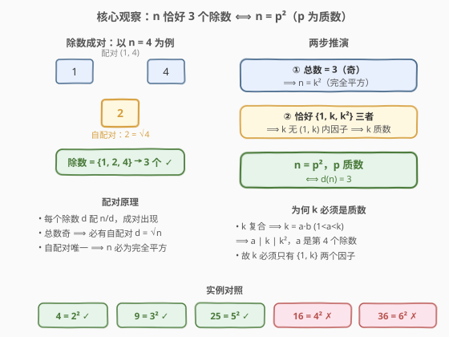
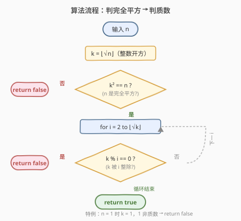
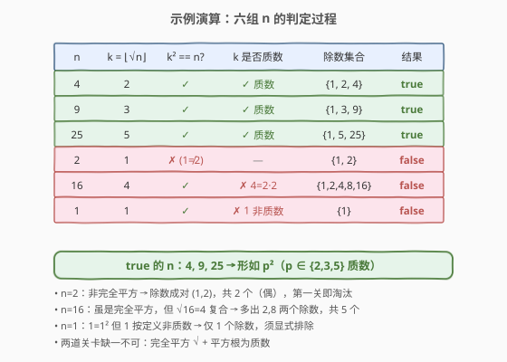

# 三除数

- **题目名称**：三除数
- **链接**：[1952. 三除数](https://leetcode.cn/problems/three-divisors/)
- **难度**：简单
- **标签**：数学、数论、质数判定

## 1. 题目概述

给你一个整数 $n$。如果 $n$ **恰好有三个正除数**，返回 `true`；否则返回 `false`。

若存在整数 $k$ 满足 $n = k \times m$，则整数 $m$ 是 $n$ 的一个**除数**。

**示例 1**：

```text
输入：n = 2
输出：false
解释：2 只有两个除数：1 和 2。
```

**示例 2**：

```text
输入：n = 4
输出：true
解释：4 有三个除数：1、2 和 4。
```

**约束条件**：

- $1 \le n \le 10^4$

> 💡 **审题关键**：① 「恰好三个」——多一个少一个都不行，$n=1$（仅 1 个除数）与 $n=6$（4 个除数）都要返回 `false`；② 除数成对出现（$d$ 与 $n/d$），总数为奇数意味着存在「自配对」$d = n/d$，即 $n$ 是**完全平方数**；③ $n \le 10^4$ 极小，但识别出「质数平方」结构后连质数判定也只需试除到 $\sqrt{\sqrt{n}} \le \sqrt{100} = 10$。

---

## 2. 解题思路

### 2.1 暴力思路：枚举所有除数计数

最直觉的做法：从 $1$ 到 $n$ 逐一枚举，统计能整除 $n$ 的个数，最后判断是否等于 $3$。

- **正确性**：穷举所有可能除数，取满足 $d \mid n$ 的，计数为 $3$ 即返回 `true`。
- **效率**：一重循环 $O(n)$。$n = 10^4$ 时仅 $10^4$ 次，能 AC，但**没有利用除数成对的结构**——其实只需枚举到 $\sqrt{n}$，且「恰好 3」这一条件蕴含极强的数学约束，可一步到位判定。

> ⚠️ 暴力法的浪费在于「把判定问题当成计数问题」。题目只要回答「是否等于 3」，而非「到底有几个」。结合除数成对性，可推出 $n$ 必形如 $p^2$（$p$ 质数），从而把 $O(n)$ 枚举化为 $O(\sqrt{\sqrt{n}})$ 的两次判定。

### 2.2 核心观察：除数成对 → 奇数个必为完全平方 → 恰好 3 即质数平方



关键洞察分两步，对应「总数为奇」与「总数恰为 3」两层约束：

**第一步：除数成对 ⟹ 奇数个必为完全平方。** 对 $n$ 的每个除数 $d$，$n/d$ 也是除数，二者配成一对 $(d,\, n/d)$。配对只在 $d = n/d$ 即 $d^2 = n$ 时「自配对」合并为一个——此时 $d = \sqrt{n}$。因此除数总数 $=$ 成对数 $\times 2$ $+$ （$0$ 或 $1$ 个自配对）。**总数为奇 ⟺ 存在自配对 ⟺ $n$ 是完全平方数**，记 $n = k^2$。

**第二步：恰好 3 个 ⟹ $k$ 必为质数。** $n = k^2$ 时，除数集合至少包含 $\{1,\, k,\, k^2\}$（配对 $(1, k^2)$ 与自配对 $k$），共 $3$ 个。若 $k$ 是**合数**，设 $k = a \cdot b$（$1 < a < k$），则 $a \mid k \mid k^2$，$a$ 是异于 $1, k, k^2$ 的第四个除数，总数 $\ge 4$。反之若 $k$ 是**质数**，则 $k$ 只有 $\{1, k\}$ 两个因子，$k^2$ 的除数恰为 $\{1, k, k^2\}$。故「恰好 3 个」$\Leftrightarrow$ 「$k$ 质数」。

$$\boxed{d(n) = 3 \;\Longleftrightarrow\; n = p^2 \text{，其中 } p \text{ 为质数}}$$

> 💡 **除数函数视角**：若 $n = p_1^{a_1} \cdots p_r^{a_r}$，则除数个数 $d(n) = (a_1+1)\cdots(a_r+1)$。令其等于 $3$（质数），只能是单一因子 $(a_1+1) = 3$，即 $r=1,\, a_1 = 2$，故 $n = p^2$。这是配对论证的代数镜像，殊途同归。

> ⚠️ **易错点：忽略 $n=1$。** $1 = 1^2$ 是完全平方，但 $1$ 按定义**不是质数**（质数要求恰两个除数 $1$ 与自身，而 $1$ 只有 $1$ 个除数）。所以 $n=1$ 时 $k=1$ 非质数，须返回 `false`。试除法判质数时循环 `for i in 2..√k` 对 $k=1$ 自然不执行，但需确保「循环完毕即视为质数」的逻辑不被 $k=1$ 误触发——见 2.4 与参考代码的特判。

### 2.3 算法流程图



整体为「两道关卡」串联判定：

1. **整数开方**：取 $k = \lfloor\sqrt{n}\rfloor$（Python `math.isqrt`，C++ `int(sqrt(n))`）。
2. **第一关——完全平方**：若 $k^2 \ne n$，说明 $n$ 非完全平方，除数总数为偶数 $\ne 3$，立即 `return false`。
3. **第二关——$k$ 是否质数**：对 $i$ 从 $2$ 试除到 $\lfloor\sqrt{k}\rfloor$，一旦 $k \bmod i = 0$ 则 $k$ 合数，`return false`；全部不整除则 $k$ 质数。
4. **通过**：$k$ 是质数（且 $k \ge 2$），`return true`。

> 💡 **两关缺一不可**：第一关筛掉非完全平方（如 $n=2$），第二关筛掉「平方但根为合数」（如 $n=16$，$k=4=2\times2$）。两关的复杂度分别为 $O(1)$ 与 $O(\sqrt{k}) = O(n^{1/4})$，对 $n \le 10^4$ 而言 $k \le 100$、$\sqrt{k} \le 10$，试除至多 $9$ 次。

### 2.4 示例演算

以六组 $n$ 演示两道关卡的判定过程：



| $n$ | $k = \lfloor\sqrt{n}\rfloor$ | $k^2 = n$? | $k$ 是否质数 | 除数集合 | 结果 |
|-----|------------------------------|------------|--------------|----------|------|
| 4 | 2 | ✓ | ✓ 质数 | $\{1, 2, 4\}$ | `true` |
| 9 | 3 | ✓ | ✓ 质数 | $\{1, 3, 9\}$ | `true` |
| 25 | 5 | ✓ | ✓ 质数 | $\{1, 5, 25\}$ | `true` |
| 2 | 1 | ✗ ($1 \ne 2$) | — | $\{1, 2\}$ | `false` |
| 16 | 4 | ✓ | ✗ $4 = 2\cdot2$ | $\{1, 2, 4, 8, 16\}$ | `false` |
| 1 | 1 | ✓ | ✗ $1$ 非质数 | $\{1\}$ | `false` |

- **`true` 的 $n$**：$4, 9, 25$，均为质数平方（$2^2, 3^2, 5^2$），除数恰为 $\{1, p, p^2\}$ 三个 ✓
- **$n=2$**：非完全平方 → 除数成对 $(1,2)$ 共 $2$ 个（偶），第一关即淘汰 ✗
- **$n=16$**：虽是完全平方，但 $\sqrt{16}=4$ 合数 → 多出 $2, 8$ 两个除数，共 $5$ 个 ✗
- **$n=1$**：$1 = 1^2$ 但 $1$ 非质数 → 仅 $1$ 个除数，须显式排除 ✗

> 💡 **观察要点**：① 第一关（$k^2 = n$）过滤掉所有「偶数个除数」的 $n$；② 第二关（$k$ 质数）过滤掉「平方但根合数」的 $n$，如 $16, 36, 100$；③ $n=1$ 是唯一的边界陷阱——它是完全平方但根为 $1$，需靠质数判定排除。

---

## 3. 参考代码

### C++（整数开方 + 试除判质数）

```cpp
class Solution {
public:
    bool isThree(int n) {
        int k = sqrt(n);
        if (k * k != n) return false;       // 第一关：n 必为完全平方
        if (k < 2) return false;            // 特判 k = 1（n = 1），1 非质数
        for (int i = 2; i * i <= k; ++i) {  // 第二关：k 是否质数
            if (k % i == 0) return false;
        }
        return true;
    }
};
```

### Python（`math.isqrt` + 试除判质数）

```python
import math

class Solution:
    def isThree(self, n: int) -> bool:
        k = math.isqrt(n)
        if k * k != n:          # 第一关：n 必为完全平方
            return False
        if k < 2:               # 特判 k = 1（n = 1），1 非质数
            return False
        i = 2
        while i * i <= k:       # 第二关：k 是否质数
            if k % i == 0:
                return False
            i += 1
        return True
```

### Python（`sympy` 不可用时的纯手写一行流）

```python
import math

class Solution:
    def isThree(self, n: int) -> bool:
        k = math.isqrt(n)
        return k * k == n and k >= 2 and all(k % i for i in range(2, math.isqrt(k) + 1))
```

> 💡 **写法对照**：① 标准版直接翻译思路，显式体现「两道关卡」，面试默认先写这版；② 一行流用 `all(k % i ...)` 把试除判质数压缩为生成器表达式，`k % i` 非 $0$ 即真，Pythonic 且紧凑；③ 三版时间同为 $O(n^{1/4})$，对 $n \le 10^4$ 均即时返回。

> ⚠️ **`k < 2` 特判的必要性**：若省略 `if (k < 2) return false;`，当 $n = 1$ 时 $k = 1$，试除循环 `for i = 2; i*i <= 1` 不执行，直接落到 `return true`——但 $1$ 非质数，答案应为 `false`。特判 `k < 2` 一并排除 $k = 0$（$n = 0$，虽不在约束内但稳健）与 $k = 1$ 两种非质数情形。Python 一行流中由 `k >= 2` 短路实现同样保护。

---

## 4. 复杂度分析

| 维度 | 暴力计数 $O(n)$ | 质数平方判定 | 说明 |
|------|-----------------|--------------|------|
| 时间复杂度 | $O(n)$ | $O(\sqrt{k}) = O(n^{1/4})$ | 暴力法遍历 $1..n$；判定法开方 $O(1)$ + 试除到 $\sqrt{k}$，$k = \sqrt{n}$ |
| 空间复杂度 | $O(1)$ | $O(1)$ | 均仅常数个变量 |

> 💡 $n \le 10^4$ 时 $k \le 100$、$\sqrt{k} \le 10$，试除至多 $9$ 次，近乎瞬时。即便 $n$ 放宽到 $10^{12}$，$k \le 10^6$、$\sqrt{k} \le 1000$，试除仍仅千次量级——这正是「识别数学结构」带来的巨大收益：把 $O(n)$ 降为 $O(n^{1/4})$。

---

## 5. 扩展：大 $n$ 与除数计数公式

### 5.1 大 $n$ 下的质数判定

本题 $n \le 10^4$，试除法绰绰有余。若 $n$ 放宽到 $10^{18}$（$k \le 10^9$、$\sqrt{k} \le 31623$），试除仍可行但偏慢；再大则需 **Miller–Rabin 概率质数判定**：基于费马小定理的多次 witnesses 检验，对 $< 2^{64}$ 的整数有确定的 $4\sim12$ 个 witnesses 集合可做到 $O(\log^2 n)$ 严格判定。Python 中可直接用 `sympy.isprime`（底层即 Miller–Rabin + 预筛）。

```python
import math, sympy

class Solution:
    def isThree(self, n: int) -> bool:
        k = math.isqrt(n)
        return k * k == n and k >= 2 and sympy.isprime(k)
```

> ⚠️ LeetCode 在线评测环境**不一定预装** `sympy`，提交前需确认。无 `sympy` 时手写 Miller–Rabin 即可，比试除更适配大 $n$。

### 5.2 除数计数函数 $d(n)$ 的普适性

「恰好 3 个除数」是除数计数函数 $d(n)$ 取特定值的特例。由乘积公式 $d(n) = \prod (a_i + 1)$，可推广判定任意「除数个数恰为 $m$」的问题：

- $d(n) = 1$ ⟺ $n = 1$（空乘积）
- $d(n) = 2$ ⟺ $n$ 为质数（单一 $(a_1+1) = 2$，即 $a_1 = 1$）
- $d(n) = 3$ ⟺ $n = p^2$（本题）
- $d(n) = 4$ ⟺ $n = p^3$ 或 $n = p \cdot q$（$p, q$ 不同质数）
- $d(n) = 5$ ⟺ $n = p^4$

> 💡 这与 [507. 完美数](../0501-0600/507_完美数.md) 的「真因子之和」是不同维度：完美数关心因子的**和**，本题关心因子的**个数**。二者都建立在「除数成对 $\Rightarrow$ 枚举到 $\sqrt{n}$」的同一骨架上，只是聚合方式不同（求和 vs 计数）。

---

## 6. 面试要点

**Q1：为什么「除数个数为奇数」等价于「$n$ 是完全平方数」？**

> 除数成对出现：$d$ 与 $n/d$ 配对。配对只在 $d = n/d$ 即 $d^2 = n$ 时合并为单个（自配对 $d = \sqrt{n}$）。故总数 $=$ 成对数 $\times 2$ $+$ 自配对数（$0$ 或 $1$）。总数为奇 ⟺ 自配对数为 $1$ ⟺ 存在整数 $\sqrt{n}$ ⟺ $n$ 是完全平方数。这是除数计数的核心结构。

**Q2：为什么 $n = k^2$ 时「恰好 3 个除数」要求 $k$ 是质数？**

> $n = k^2$ 的除数至少有 $\{1, k, k^2\}$（配对 $(1, k^2)$ + 自配对 $k$），共 $3$ 个。若 $k$ 合数，设 $k = a \cdot b$（$1 < a < k$），则 $a \mid k \mid k^2$，$a$ 是第四个除数，总数 $\ge 4$。若 $k$ 质数，则 $k$ 无 $[1, k]$ 内的中间因子，$k^2$ 的除数恰为 $\{1, k, k^2\}$。故「恰好 3」$\Leftrightarrow$ 「$k$ 质数」。

**Q3：$n = 1$ 为什么返回 `false`？代码如何处理？**

> $1 = 1^2$ 是完全平方，第一关 $k^2 = n$ 通过。但 $1$ 按定义**不是质数**（质数要求恰有两个除数，$1$ 只有一个），所以第二关应判 `false`。陷阱在于试除循环 `for i = 2; i*i <= 1` 根本不执行，若不特判会误落 `return true`。代码用 `if (k < 2) return false;` 显式排除 $k = 1$（与 $k = 0$）。

**Q4：为什么不直接枚举 $1$ 到 $n$ 数除数个数？**

> 暴力枚举 $O(n)$ 对 $n \le 10^4$ 能 AC，但未利用结构。识别「除数成对 $\Rightarrow$ 奇数个必为平方 $\Rightarrow$ 恰 3 即质数平方」后，化为「开方 + 试除到 $\sqrt{k}$」两步，复杂度 $O(n^{1/4})$。对 $n = 10^4$，试除至多 $9$ 次；即便 $n = 10^{12}$ 也仅千次量级。这是「判定问题不必计数」的典型范例——题目只要 yes/no，应寻找充分必要条件而非穷举。

**Q5：除数计数公式 $d(n) = \prod(a_i+1)$ 如何推出 $d(n)=3 \Leftrightarrow n=p^2$？**

> 设 $n = p_1^{a_1}\cdots p_r^{a_r}$，则 $d(n) = (a_1+1)\cdots(a_r+1)$。令其等于 $3$：因 $3$ 是质数，乘积分解只能是单一因子 $(a_1+1) = 3$，故 $r = 1$（单一质因子）、$a_1 = 2$，即 $n = p_1^2$。这是配对论证的代数镜像，也是推广到 $d(n) = m$ 任意值的通用工具。

> 💡 **一句话总结**：除数成对 ⟹ 奇数个必为完全平方 $n = k^2$ ⟹ 恰好 3 个要求 $k$ 质数 ⟺ $n = p^2$；两道关卡「判完全平方 + 判 $\sqrt{n}$ 质数」，$O(n^{1/4})$ 一步到位。

---

## 7. 同类练习题

- [367. 有效的完全平方数](https://leetcode.cn/problems/valid-perfect-square/)（[题解](../0301-0400/367_有效的完全平方数.md)）：本题第一关的母题，专注「判定 $n$ 是否完全平方」，可用二分/牛顿迭代避免浮点 `sqrt`，对照体会整数开方的稳健写法
- [204. 计数质数](https://leetcode.cn/problems/count-primes/)（[题解](../0201-0300/204_计数质数.md)）：本题第二关的延伸，从「判定单数是否质数」升级为「统计区间内质数个数」，埃氏筛/线性筛是质数家族的基石工具
- [507. 完美数](https://leetcode.cn/problems/perfect-number/)（[题解](../0501-0600/507_完美数.md)）：同属除数家族，从「除数个数」翻转为「真因子之和」，共享「除数成对 ⟹ 枚举到 $\sqrt{n}$」骨架，体会计数与求和的两种聚合
- [728. 自除数](https://leetcode.cn/problems/self-dividing-numbers/)（[题解](../0701-0800/728_自除数.md)）：除数判定变体，从「$n$ 的除数性质」转为「$n$ 能被自身每位数字整除」，数位与整除性结合的轻量练习
