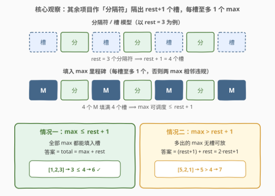
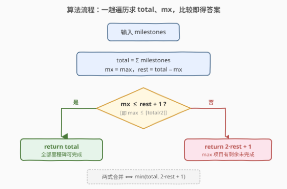

# 你可以工作的最大周数

- **题目名称**：你可以工作的最大周数
- **链接**：[1953. 你可以工作的最大周数](https://leetcode.cn/problems/maximum-number-of-weeks-for-which-you-can-work/)
- **难度**：中等
- **标签**：贪心、数学、计数

## 1. 题目概述

给你 $n$ 个项目，编号从 $0$ 到 $n-1$。同时给你一个整数数组 `milestones`，其中每个 `milestones[i]` 表示第 $i$ 个项目中的阶段任务数量。

你可以按下面两个规则参与项目中的工作：

- 每周，你将会完成**某一个**项目中的**恰好一个**阶段任务。你每周都**必须**工作。
- 在**连续的**两周中，你**不能**参与并完成同一个项目中的两个阶段任务。

一旦所有项目中的全部阶段任务都完成，或者执行仅剩的一个阶段任务将会导致你违反上面的规则，你将**停止工作**。注意，由于这些条件的限制，你可能无法完成所有阶段任务。

返回在不违反上面规则的情况下你**最多**能工作多少周。

**示例 1**：

```text
输入：milestones = [1,2,3]
输出：6
解释：一种可能的情形是：
- 第 1 周，完成项目 0 中的一个阶段任务。
- 第 2 周，完成项目 2 中的一个阶段任务。
- 第 3 周，完成项目 1 中的一个阶段任务。
- 第 4 周，完成项目 2 中的一个阶段任务。
- 第 5 周，完成项目 1 中的一个阶段任务。
- 第 6 周，完成项目 2 中的一个阶段任务。
总周数是 6。
```

**示例 2**：

```text
输入：milestones = [5,2,1]
输出：7
解释：一种可能的情形是：
- 第 1 周，完成项目 0 中的一个阶段任务。
- 第 2 周，完成项目 1 中的一个阶段任务。
- 第 3 周，完成项目 0 中的一个阶段任务。
- 第 4 周，完成项目 1 中的一个阶段任务。
- 第 5 周，完成项目 0 中的一个阶段任务。
- 第 6 周，完成项目 2 中的一个阶段任务。
- 第 7 周，完成项目 0 中的一个阶段任务。
总周数是 7。注意，你不能在第 8 周完成项目 0 中的最后一个阶段任务，因为这会违反规则。
```

**约束条件**：

- $n = \text{milestones.length}$
- $1 \le n \le 10^5$
- $1 \le \text{milestones}[i] \le 10^9$

> 💡 **审题关键**：① 「连续两周不能同一项目」即**相邻两个里程碑不能来自同一项目**——本质是「重排使无相邻相同」的调度问题；② 答案问的是**最多能工作多少周**，而非「能否全部完成」——允许留下部分里程碑不做；③ $\text{milestones}[i] \le 10^9$、$n \le 10^5$，总数可达 $10^{14}$，**逐周模拟必然超时**，必须推导出 $O(n)$ 的闭式公式。

---

## 2. 解题思路

### 2.1 暴力思路：贪心模拟每周选项目

最直觉的做法：**逐周贪心**——每周从「非上一周项目」中挑剩余里程碑最多的项目做一个，用**大根堆**维护各项目剩余数。这能保证尽量不把高频项目挤到末尾扎堆。

- **正确性**：「每次取剩余最多且非上一项目」的贪心策略，对于「无相邻相同」调度问题是**最优的**（交换论证：若最优解在某周选了非最多的项目，可与贪心解交换而不恶化）。
- **效率**：堆操作 $O(\log n)$ / 周，总周数最坏 $O(\text{total})$。而 $\text{total} \le 10^{14}$，**必定 TLE**。

> ⚠️ 暴力的核心痛点：**逐周模拟的步数等于答案本身**，而答案可达 $10^{14}$。需要跳过「模拟」，直接用数学公式算出「最终能排下几个」。

### 2.2 核心观察：分隔符与槽位模型



把**里程碑数最多的项目**（设为 $M$，共 $\text{mx}$ 个里程碑）视为「主角」，**其余所有项目的里程碑**合并视为「分隔符」，总数 $\text{rest} = \text{total} - \text{mx}$。

**关键建模**：$M$ 的任意两个里程碑之间，必须插入至少一个「分隔符」（否则相邻违规）。所以 $\text{rest}$ 个分隔符把序列切成 $\text{rest} + 1$ 个**槽位**：

$$\underbrace{[\,\text{槽}\,]}_{0}\ \text{分}\ \underbrace{[\,\text{槽}\,]}_{1}\ \text{分}\ \cdots\ \text{分}\ \underbrace{[\,\text{槽}\,]}_{\text{rest}}$$

**每个槽位至多放 1 个 $M$ 的里程碑**——若同一槽放两个，则它们中间无分隔符，必然相邻违规。因此 $M$ 可调度的里程碑数 $\le \text{rest} + 1$。

由此得到**上界**：

$$\text{可调度周数} \le \min(\text{total},\; \underbrace{(\text{rest}+1)}_{\text{max 里程碑}} + \underbrace{\text{rest}}_{\text{分隔符}}) = \min(\text{total},\; 2 \cdot \text{rest} + 1)$$

**分两种情况**：

| 情况 | 条件 | 含义 | 答案 |
|------|------|------|------|
| **全部可完成** | $\text{mx} \le \text{rest} + 1$ | $M$ 的里程碑不多于槽位数，全部能填入 | $\text{total}$ |
| **受限** | $\text{mx} > \text{rest} + 1$ | $M$ 多出的里程碑无槽可放，只能做 $\text{rest}+1$ 个 | $2 \cdot \text{rest} + 1$ |

> 💡 **上界可达性**：当 $\text{mx} \le \text{rest}+1$ 时，贪心策略（或直接构造）必能排完全部——这正是 [767. 重构字符串](../0701-0800/767_重构字符串.md) 的可行性条件 $\text{mx} \le \lceil \text{total}/2 \rceil$（因 $\text{rest}+1 = \text{total} - \text{mx} + 1 \ge \text{mx} \Leftrightarrow 2\cdot\text{mx} \le \text{total}+1$）。当 $\text{mx} > \text{rest}+1$ 时，把 $\text{rest}+1$ 个 $M$ 填入槽位、用尽 $\text{rest}$ 个分隔符，恰好 $2\cdot\text{rest}+1$ 周，剩余 $M$ 无法再放。

> ⚠️ **为什么停在这？** 当 $\text{mx} > \text{rest}+1$，排满 $2\cdot\text{rest}+1$ 周后，分隔符已耗尽，剩余里程碑**全属 $M$**，而最后一周恰是 $M$ → 下一周只能做 $M$ → 相邻违规 → 被迫停止。

### 2.3 算法流程图



只需一趟遍历求 `total` 与 `mx`，再做一次比较：

1. 遍历 `milestones`，累加 `total`、维护 `mx`。
2. 计算 $\text{rest} = \text{total} - \text{mx}$。
3. 若 $\text{mx} \le \text{rest} + 1$，返回 $\text{total}$；否则返回 $2 \cdot \text{rest} + 1$。
4. 两式合并即 $\min(\text{total},\; 2\cdot\text{rest}+1)$。

### 2.4 示例演算

![示例 2 演算：milestones = [5,2,1]](../images/1953_example_walkthrough.svg)

以**示例 2** `milestones = [5, 2, 1]` 演算：

- $\text{mx} = 5$（项目 0），$\text{rest} = 2 + 1 = 3$，$\text{rest} + 1 = 4 < 5 = \text{mx}$ → 受限情况。
- 槽位视角：4 个槽填入 4 个 P0，3 个分隔符（P1、P1、P2）消耗完 rest：

| 槽 | 分隔符 | 槽 | 分隔符 | 槽 | 分隔符 | 槽 |
|----|--------|----|--------|----|--------|----|
| P0 | P1 | P0 | P1 | P0 | P2 | P0 |

- 逐周展开即 W1~W7：`P0 P1 P0 P1 P0 P2 P0`，相邻无同项目 ✓
- 第 8 周：仅剩 P0 的 1 个里程碑，但 W7 是 P0 → 相邻违规 → 停止。
- 答案 $= 2 \times 3 + 1 = 7$，项目 0 余 $5 - 4 = 1$ 个未完成。

**示例 1** `milestones = [1, 2, 3]`：$\text{mx} = 3$，$\text{rest} = 3$，$3 \le 3 + 1 = 4$ → 全部可完成，答案 $= \text{total} = 6$ ✓

> 💡 **对照要点**：两例的唯一差别是 $\text{mx}$ 与 $\text{rest}+1$ 的大小关系——这正是「能做完全部」与「被迫截断」的分界线。

---

## 3. 参考代码

### C++（注意 `long long` 防溢出）

```cpp
class Solution {
public:
    long long numberOfWeeks(vector<int>& milestones) {
        long long total = 0;
        int mx = 0;
        for (int m : milestones) {
            total += m;
            mx = max(mx, m);
        }
        long long rest = total - mx;
        if (mx <= rest + 1) return total;
        return 2 * rest + 1;
    }
};
```

### Python

```python
class Solution:
    def numberOfWeeks(self, milestones: List[int]) -> int:
        total = sum(milestones)
        mx = max(milestones)
        rest = total - mx
        if mx <= rest + 1:
            return total
        return 2 * rest + 1
```

### Python（合并为一行）

```python
class Solution:
    def numberOfWeeks(self, milestones: List[int]) -> int:
        total = sum(milestones)
        return min(total, 2 * (total - max(milestones)) + 1)
```

> 💡 **写法对照**：① 标准版显式体现「两种情况」的分判，面试默认先写这版；② 一行版用 `min` 把两分支压缩为一个表达式——当 $\text{mx} \le \text{rest}+1$ 时 $2\cdot\text{rest}+1 \ge \text{total}$，`min` 取 `total`；否则取 $2\cdot\text{rest}+1$，逻辑等价。

> ⚠️ **溢出陷阱**：$n \le 10^5$、$\text{milestones}[i] \le 10^9$，故 $\text{total} \le 10^{14}$，**超出 `int` 范围**（$\approx 2.1 \times 10^9$）。C++ 中 `total`、`rest`、返回值均须用 `long long`；`mx` 用 `int` 即可（$\le 10^9$），但比较 `mx <= rest + 1` 时 `rest + 1` 为 `long long`，`mx` 自动提升，安全。Python 原生大整数无此问题。

---

## 4. 复杂度分析

| 维度 | 贪心模拟（大根堆） | 数学公式 |
|------|-------------------|----------|
| **时间复杂度** | $O(\text{total} \cdot \log n)$ | $O(n)$ |
| **空间复杂度** | $O(n)$（堆） | $O(1)$ |
| **能否通过** | ✗（$\text{total} \le 10^{14}$ 必 TLE） | ✓ |

> 💡 识别出「分隔符 / 槽位」结构后，把 $O(\text{total})$ 的逐周模拟降为 $O(n)$ 的一趟求和——这正是「判定 / 计数问题不必构造」的典型范例：题目只要最终周数，无需真的排出每周安排。

---

## 5. 扩展：与 767 / 1405 / 621 的关系

本题属于「**按频率安排使无相邻相同**」问题家族，三个维度定位它在家族中的坐标：

| 维度 | 767 重构字符串 | 1953 本题 | 1405 最长快乐字符串 | 621 任务调度器 |
|------|---------------|-----------|---------------------|---------------|
| **相邻约束** | 无相邻相同 | 无相邻相同 | 无三连相同 | 间隔至少 $n$ |
| **目标** | 能否排完（可行性） | 最多排几个（计数） | 最长多少（计数） | 最少总时长（含 idle） |
| **答案** | $\text{mx} \le \lceil \text{total}/2 \rceil$ ? 可 : 不可 | $\min(\text{total}, 2\cdot\text{rest}+1)$ | 贪心构造最长串 | $(\text{mx}-1)(n+1)+\text{cnt}_{\text{mx}}$ |
| **是否用全部** | 必须用全部 | 可留余 | 可留余 | 必须用全部 |

**1953 = 767 的约束 + 1405 的目标**：

- 与 [767](../0701-0800/767_重构字符串.md) 共享「无相邻相同」约束与可行性分界 $\text{mx} \le \text{rest}+1$。767 问「能否全部排完」，1953 问「排不完时最多几个」——后者是前者的**松弛计数版**，答案 $\min(\text{total}, 2\cdot\text{rest}+1)$ 恰好把 767 的可行性阈值自然延伸为计数公式。
- 与 [1405](../1401-1500/1405_最长快乐字符串.md) 共享「求最长、可留余」的目标。1405 的约束是「无三连相同」（每组至多 2 个），1953 是「无相邻相同」（每组至多 1 个）——1953 是 1405 在「最大连续 = 1」时的特例，公式更简洁。
- [621](../0601-0700/621_任务调度器.md) 是最一般形式（冷却期 $n$），用公式 $(\text{mx}-1)(n+1) + \text{cnt}_{\text{mx}}$ 求**含 idle 的总槽位**；本题相当于 $n=1$（相邻即违规）但不允许 idle、改为「能排几个」。

> 💡 **统一视角**：这一族问题的核心都是「最高频元素是瓶颈，其余元素作分隔符」。分隔符数 $\text{rest}$ 决定能隔出多少组、每组容量上限由约束决定（1953 每组 1 个、1405 每组 2 个、621 每组 1 个但组间需 $n$ 格）。

---

## 6. 面试要点

**Q1：为什么「其余项目的里程碑」能当作分隔符合并看待？**

> 约束只区分「同一项目 / 不同项目」，不关心具体是哪个其它项目。所以只要不是 $M$（最大项目）的里程碑，都能充当 $M$ 两个里程碑之间的「分隔符」。把所有非 $M$ 里程碑合并计数为 $\text{rest}$，不影响上界推导——上界只取决于「有多少个分隔符」而非「分隔符内部如何排列」。

**Q2：上界 $2\cdot\text{rest}+1$ 是怎么来的？为什么不可能更多？**

> $\text{rest}$ 个分隔符把序列切成 $\text{rest}+1$ 个槽位，每个槽位至多放 1 个 $M$（否则同槽两个 $M$ 中间无分隔符，相邻违规）。故 $M$ 至多调度 $\text{rest}+1$ 个，加上 $\text{rest}$ 个分隔符，总数 $\le (\text{rest}+1) + \text{rest} = 2\cdot\text{rest}+1$。同时总数也不超过 $\text{total}$，故取 $\min$。

**Q3：$\text{mx} \le \text{rest}+1$ 时为什么一定能排完全部？**

> 这是 [767](../0701-0800/767_重构字符串.md) 的经典可行性条件：$\text{mx} \le \lceil \text{total}/2 \rceil \Leftrightarrow \text{mx} \le \text{rest}+1$。此时贪心策略（每周取剩余最多且非上一项目）必能排完，或直接构造：把 $\text{rest}$ 个分隔符铺开，$\text{mx} \le \text{rest}+1$ 个 $M$ 逐一填入槽位即可。

**Q4：为什么 $\text{mx} > \text{rest}+1$ 时恰好停在 $2\cdot\text{rest}+1$ 而不是更早？**

> 构造表明 $2\cdot\text{rest}+1$ 可达：把 $\text{rest}+1$ 个 $M$ 填满所有槽位、用尽 $\text{rest}$ 个分隔符。排完后分隔符耗尽，剩余里程碑全属 $M$，而最后一周恰是 $M$ → 下一周只能做 $M$ → 相邻违规 → 被迫停止。故既不会更早停（构造已排满），也无法更晚（上界封顶）。

**Q5：C++ 中为什么 `total` 必须用 `long long`？**

> $n \le 10^5$、$\text{milestones}[i] \le 10^9$，$\text{total}$ 可达 $10^{14}$，远超 `int` 上界 $\approx 2.1\times10^9$。`2 * rest + 1` 同理。`mx` 虽 $\le 10^9$ 可用 `int`，但参与 `mx <= rest + 1` 时 `rest+1` 为 `long long`，`mx` 自动提升，无需单独处理。

> 💡 **一句话总结**：最大项目的里程碑是瓶颈，其余项目作分隔符隔出 $\text{rest}+1$ 个槽、每槽至多 1 个 $\text{mx}$；故答案 $= \min(\text{total},\; 2\cdot\text{rest}+1)$，$O(n)$ 一趟求和即可，注意 `long long` 防溢出。

---

## 7. 同类练习题

- [767. 重构字符串](https://leetcode.cn/problems/reorganize-string/)（[题解](../0701-0800/767_重构字符串.md)）：本题的「可行性」母题——问能否用完全部字符且无相邻相同，判定条件 $\text{mx} \le \lceil n/2 \rceil$ 即本题的 $\text{mx} \le \text{rest}+1$
- [1405. 最长快乐字符串](https://leetcode.cn/problems/longest-happy-string/)（[题解](../1401-1500/1405_最长快乐字符串.md)）：同目标「求最长、可留余」，约束放宽为「无三连相同」（每组 2 个），是本题「每组 1 个」的泛化，对照体会分组容量对公式的影响
- [621. 任务调度器](https://leetcode.cn/problems/task-scheduler/)（[题解](../0601-0700/621_任务调度器.md)）：最一般形式——冷却期 $n$、求含 idle 的最少总槽位，公式 $(\text{mx}-1)(n+1)+\text{cnt}_{\text{mx}}$，本题相当于 $n=1$ 且不允许 idle 的计数变体
- [1054. 距离相等的条形码](https://leetcode.cn/problems/distant-barcodes/)（[题解](../1001-1100/1054_距离相等的条形码.md)）：与 767 完全同构（无相邻相同、保证有解），巩固「按频率贪心安排」的构造模板
- [358. K 距离间隔重排字符串](https://leetcode.cn/problems/rearrange-string-k-distance-apart/)（[题解](../0301-0400/358_K距离间隔重排字符串.md)）：相同元素间隔至少 $k$ 的重排判定，$k=2$ 即本题的「无相邻」约束，是间隔约束家族的一般化入口
