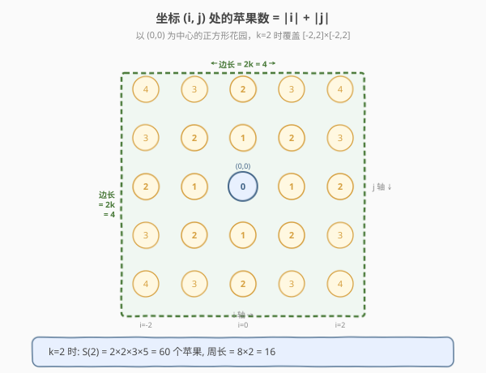
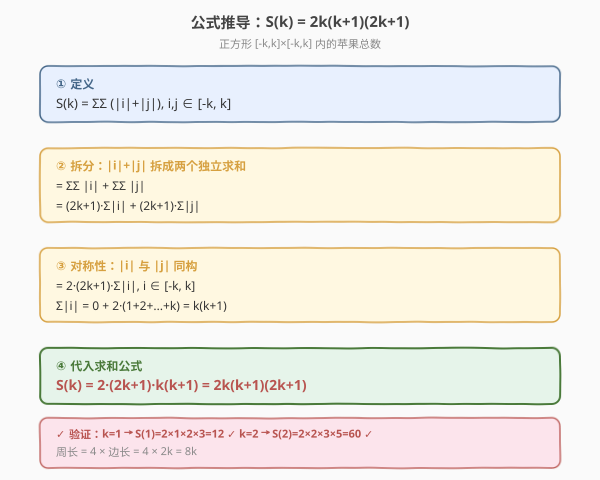
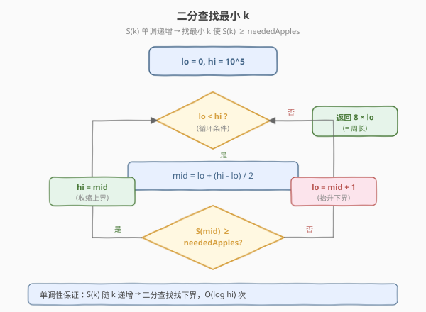
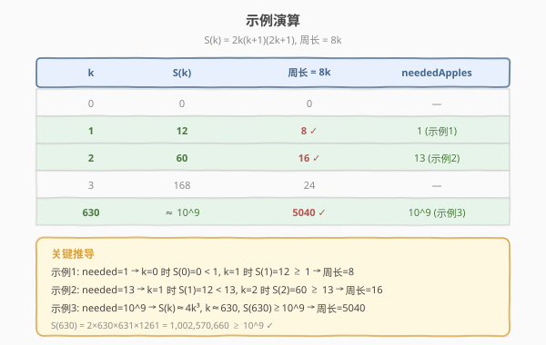

# 收集足够苹果的最小花园周长

- **题目名称**：收集足够苹果的最小花园周长
- **链接**：[1954. 收集足够苹果的最小花园周长](https://leetcode.cn/problems/minimum-garden-perimeter-to-collect-enough-apples/)
- **难度**：中等
- **标签**：数学、二分查找

## 1. 题目概述

在一个无限二维网格中，每个整数坐标 `(i, j)` 处有一棵苹果树，该树上有 `|i| + |j|` 个苹果。你要买一块以 `(0, 0)` 为中心的**正方形土地**（边与坐标轴平行），使得土地**内部及边缘上**的苹果总数 **至少** 为 `neededApples`。返回满足条件的最小**周长**。

**示例 1**：

```text
输入：neededApples = 1
输出：8
解释：边长为 2 的正方形包含 12 个苹果，周长 = 2 × 4 = 8。
```

**示例 2**：

```text
输入：neededApples = 13
输出：16
```

**示例 3**：

```text
输入：neededApples = 1000000000
输出：5040
```

**约束条件**：

- $1 \le \text{neededApples} \le 10^{15}$

---

## 2. 解题思路

### 2.1 暴力思路

从周长 $8, 16, 24, \dots$（即 $k = 1, 2, 3, \dots$）逐个枚举，对每个 $k$ 遍历正方形 $[-k, k] \times [-k, k]$ 内所有 $(2k+1)^2$ 个格点，累加 $|i| + |j|$，直到总和 $\ge \text{neededApples}$。

问题：$\text{neededApples}$ 可达 $10^{15}$，对应的 $k \approx 63000$，每个 $k$ 需遍历 $\sim 4k^2$ 个格点，总工作量 $\sim k^3 \approx 2.5 \times 10^{14}$，远超时限。

> 需要换角度：不要逐格点累加，而是**用数学公式直接算出正方形内苹果总数**，再配合二分查找。

### 2.2 核心观察：正方形内苹果总数的闭式公式



以 `(0, 0)` 为中心、半边长为 $k$ 的正方形覆盖区域 $[-k, k] \times [-k, k]$（边长 $= 2k$，周长 $= 8k$）。其中的苹果总数为：

$$
S(k) = \sum_{i=-k}^{k} \sum_{j=-k}^{k} (|i| + |j|)
$$

> 💡 **关键直觉**：$|i| + |j|$ 可以拆成两个**独立**的求和——对 $|i|$ 的求和与对 $|j|$ 的求和。且由于正方形关于 $x$ 轴、$y$ 轴对称，这两个求和**完全同构**。

### 2.3 公式推导



**第一步：拆分求和**

$$
S(k) = \sum_{i=-k}^{k} \sum_{j=-k}^{k} |i| + \sum_{i=-k}^{k} \sum_{j=-k}^{k} |j|
$$

**第二步：提取公因子**

对第一个求和，$|i|$ 不依赖 $j$，内层对 $j$ 求和就是 $(2k+1)$：

$$
\sum_{i=-k}^{k} \sum_{j=-k}^{k} |i| = (2k+1) \sum_{i=-k}^{k} |i|
$$

同理第二个求和 $= (2k+1) \sum_{j=-k}^{k} |j|$。

**第三步：利用对称性**

$|i|$ 与 $|j|$ 的求和结构完全相同，且 $\sum_{i=-k}^{k} |i| = 0 + 2(1 + 2 + \dots + k) = k(k+1)$：

$$
S(k) = 2 \cdot (2k+1) \cdot k(k+1) = 2k(k+1)(2k+1)
$$

**验证**：
- $k = 1$：$S(1) = 2 \times 1 \times 2 \times 3 = 12$ ✓（与示例 1 一致）
- $k = 2$：$S(2) = 2 \times 2 \times 3 \times 5 = 60$ ✓

### 2.4 算法流程：二分查找



$S(k) = 2k(k+1)(2k+1)$ 关于 $k$ **严格单调递增**，因此可以用二分查找找**最小 $k$** 使 $S(k) \ge \text{neededApples}$。

1. **确定搜索范围**：$S(k) \approx 4k^3$，$\text{neededApples} \le 10^{15}$，所以 $k \le (10^{15}/4)^{1/3} \approx 6.3 \times 10^4$。取上界 $10^5$ 足够安全。
2. **二分**：`lo = 0, hi = 10^5`，每次取 `mid`，计算 $S(\text{mid})$：
   - 若 $S(\text{mid}) \ge \text{neededApples}$ → `hi = mid`（收缩上界，`mid` 可能是答案）
   - 否则 → `lo = mid + 1`（抬升下界）
3. **返回**：周长 $= 8 \times \text{lo}$。

> ⚠️ **溢出注意**：C++ 中 $S(k) = 2k(k+1)(2k+1)$ 在 $k = 10^5$ 时约为 $4 \times 10^{15}$，需用 `long long`。$k = 10^5$ 时 $S(k) \approx 4 \times 10^{15} < 9.2 \times 10^{18}$（`long long` 上限），不会溢出。

### 2.5 示例演算



| $k$ | $S(k) = 2k(k+1)(2k+1)$ | 周长 $= 8k$ | neededApples |
|-----|------------------------|-------------|--------------|
| $0$ | $0$ | $0$ | — |
| $1$ | $12$ | $8$ ✓ | $1$（示例 1） |
| $2$ | $60$ | $16$ ✓ | $13$（示例 2） |
| $3$ | $168$ | $24$ | — |
| $630$ | $1{,}002{,}570{,}660$ | $5040$ ✓ | $10^9$（示例 3） |

- **示例 1**：$S(0) = 0 < 1$，$S(1) = 12 \ge 1$ → 最小 $k = 1$，周长 $= 8$。
- **示例 2**：$S(1) = 12 < 13$，$S(2) = 60 \ge 13$ → 最小 $k = 2$，周长 $= 16$。
- **示例 3**：$S(629) = 997{,}807{,}860 < 10^9$，$S(630) = 1{,}002{,}570{,}660 \ge 10^9$ → 最小 $k = 630$，周长 $= 5040$。

---

## 3. 参考代码

### C++

```cpp
class Solution {
  public:
    long long minimumPerimeter(long long neededApples) {
        long long lo = 0, hi = 100000;
        while (lo < hi) {
            long long mid = lo + (hi - lo) / 2;
            // S(k) = 2k(k+1)(2k+1)
            long long apples = 2 * mid * (mid + 1) * (2 * mid + 1);
            if (apples >= neededApples) {
                hi = mid;
            } else {
                lo = mid + 1;
            }
        }
        return 8 * lo;
    }
};
```

### Python

```python
class Solution:
    def minimumPerimeter(self, neededApples: int) -> int:
        lo, hi = 0, 100000
        while lo < hi:
            mid = (lo + hi) // 2
            apples = 2 * mid * (mid + 1) * (2 * mid + 1)
            if apples >= neededApples:
                hi = mid
            else:
                lo = mid + 1
        return 8 * lo
```

> 💡 **Python 一行公式解法**（数学推导 + 直接求解）：由于 $S(k) \approx 4k^3$，可以用 `ceil((neededApples / 4) ** (1/3))` 近似后微调。但二分写法更直观、更不容易出精度问题，面试推荐二分。

---

## 4. 复杂度分析

| 维度 | 复杂度 | 说明 |
|------|--------|------|
| 时间复杂度 | $O(\log(\text{neededApples}^{1/3}))$ | 二分查找的次数为 $\log_2(10^5) \approx 17$ 次，每次 $O(1)$ 计算 $S(k)$ |
| 空间复杂度 | $O(1)$ | 仅使用 `lo`、`hi`、`mid` 等常数个变量 |

> 💡 上界 $10^5$ 的来源：$\text{neededApples} \le 10^{15}$，$S(k) \approx 4k^3 \ge 10^{15}$ → $k \ge 6.3 \times 10^4$，取 $10^5$ 留足余量。

---

## 5. 扩展：数学直接求解

二分依赖 $S(k)$ 单调，但其实可以**直接解方程** $2k(k+1)(2k+1) \ge \text{neededApples}$。展开得 $4k^3 + 6k^2 + 2k \ge \text{neededApples}$，近似 $4k^3 \ge \text{neededApples}$，即 $k \ge \sqrt[3]{\text{neededApples} / 4}$。取 $k_0 = \lceil (\text{neededApples} / 4)^{1/3} \rceil$，然后微调 $k$ 直到 $S(k) \ge \text{neededApples}$（通常只需 $\pm 1$ 步）。

```python
import math
class Solution:
    def minimumPerimeter(self, neededApples: int) -> int:
        k = math.ceil((neededApples / 4) ** (1 / 3))
        while 2 * k * (k + 1) * (2 * k + 1) < neededApples:
            k += 1
        return 8 * k
```

> ⚠️ 浮点精度风险：`neededApples` 可达 $10^{15}$，`** (1/3)` 的浮点误差可能导致 $k_0$ 偏差 1。因此微调循环不可或缺。二分法则完全规避精度问题，**面试首选二分**。

---

## 6. 面试要点

1. **怎么想到要用数学公式而不是模拟？**

   > $\text{neededApples}$ 高达 $10^{15}$，暴力遍历格点根本无法在时限内完成。关键在于 $|i| + |j|$ 的**可分离性**——能拆成对 $|i|$ 和 $|j|$ 两个独立求和，再配合对称性化简，得到 $O(1)$ 的闭式公式。

2. **$S(k) = 2k(k+1)(2k+1)$ 是怎么推导出来的？**

   > 三步：(a) 把 $|i|+|j|$ 拆成两个独立求和；(b) 对 $j$ 求和得到因子 $(2k+1)$；(c) 利用 $|i|$ 和 $|j|$ 同构，$S(k) = 2(2k+1)\sum_{i=-k}^{k}|i|$，而 $\sum|i| = k(k+1)$（$0$ 加上 $1$ 到 $k$ 的两倍）。

3. **为什么用二分查找？**

   > $S(k)$ 关于 $k$ 严格单调递增（$k$ 增大时正方形覆盖更多格点，苹果数只增不减），因此「找最小 $k$ 使 $S(k) \ge \text{neededApples}$」是一个经典的**下界二分**问题。

4. **C++ 中如何避免溢出？**

   > $k \le 10^5$，$S(k) = 2k(k+1)(2k+1) \le 4 \times 10^{15}$，需要 `long long`（上限 $\sim 9.2 \times 10^{18}$）。计算时注意先乘再取类型提升：`2LL * mid * (mid+1) * (2*mid+1)`，或确保 `mid` 为 `long long`（本题签名已是 `long long`）。

5. **上界为什么取 $10^5$？**

   > $S(k) \approx 4k^3$，令 $4k^3 \ge 10^{15}$ 得 $k \ge 6.3 \times 10^4$。取 $10^5$ 既保证覆盖最大输入，又让二分次数仅约 17 次。

---

## 7. 同类练习题

- [704. 二分查找](https://leetcode.cn/problems/binary-search/)（[题解](../0701-0800/704_二分查找.md)）：二分查找母题，本题「找下界」的模板即源于此
- [875. 爱吃香蕉的珂珂](https://leetcode.cn/problems/koko-eating-bananas/)（[题解](../0801-0900/875_爱吃香蕉的珂珂.md)）：二分答案 + $O(n)$ 验证，与本题「二分 $k$ + 公式验证」同框架
- [1011. 在 D 天内送达包裹的能力](https://leetcode.cn/problems/capacity-to-ship-packages-within-d-days/)（[题解](../1001-1100/1011_在D天内送达包裹的能力.md)）：二分答案 + 贪心验证，同样是「单调性 → 二分找下界」
- [69. x 的平方根](https://leetcode.cn/problems/sqrtx/)（[题解](../0001-0100/69_x的平方根.md)）：二分答案求 $\lfloor\sqrt{x}\rfloor$，与本题「二分 + 数学公式」思想一致，只是验证函数不同
- [400. 第 N 位数字](https://leetcode.cn/problems/nth-digit/)（[题解](../0301-0400/400_第N位数字.md)）：数学分层数位定位，同样是「按位数分层 + 公式推导」的数学思维
