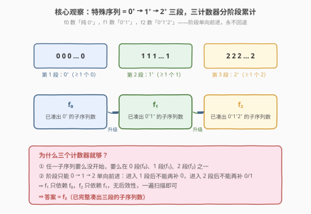
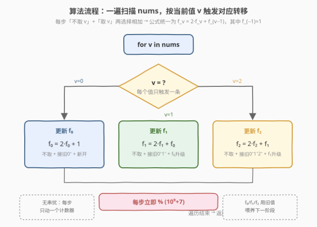
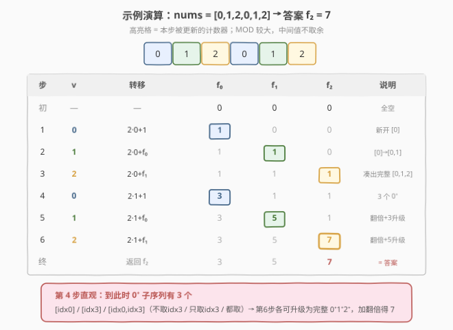

# LeetCode 统计特殊子序列的数目 题解

## 1. 题目概述

- **标题 / 题号**：统计特殊子序列的数目（#1955，hard）
- **链接**：https://leetcode.cn/problems/count-number-of-special-subsequences/
- **难度**：困难
- **标签**：动态规划、数组

**特殊序列** 是由**正整数**个 `0`，紧接着**正整数**个 `1`，最后**正整数**个 `2` 组成的序列。

- `[0,1,2]`、`[0,0,1,1,1,2]` 是特殊序列。
- `[2,1,0]`、`[1]`、`[0,1,2,0]` 不是特殊序列（顺序错、缺段、2 后又出现 0）。

给定**仅**包含 `0,1,2` 的数组 `nums`，返回**不同的特殊子序列**的数目。答案对 $10^9+7$ 取余。两个子序列若**下标集合**不同，则视为不同。

**示例 1**：

```text
输入：nums = [0,1,2,2]
输出：3
解释：特殊子序列为 [0,1,2,2]、[0,1,2](取第1个2)、[0,1,2](取第2个2)
```

**示例 2**：

```text
输入：nums = [2,2,0,0]
输出：0
解释：没有 1，无法组成特殊序列。
```

**示例 3**：

```text
输入：nums = [0,1,2,0,1,2]
输出：7
```

**约束**：

- $1 \le \text{nums.length} \le 10^5$
- $0 \le \text{nums}[i] \le 2$

> 💡 **审题关键**：① 特殊序列严格分三段：`0⁺ → 1⁺ → 2⁺`，每段至少一个，**顺序不可乱**；② 子序列按**下标集合**区分，相同值的序列只要来自不同下标就算不同——因此「计数」而非「去重枚举」；③ $n$ 可达 $10^5$，必须 $O(n)$，排除指数级枚举。

## 2. 解题思路

### 2.1 暴力思路：枚举所有子序列

最直白做法：枚举每个下标「取/不取」，共 $2^n$ 个子序列，逐个检查是否形如 `0⁺1⁺2⁺`。$n=10^5$ 时完全不可行。

> ⚠️ 暴力的瓶颈在于「**按子序列枚举**」。突破口是**换视角**：特殊序列天然分三段，且 `nums` 只有三种值——把「是否合法」拆成「**当前处于哪一段**」，用三个计数器分别累计「已凑出第 1/2/3 段」的子序列数，一遍扫描即可。

### 2.2 核心观察：分阶段计数 DP



把特殊序列的形成看成**三阶段通关**：

| 计数器 | 含义 | 已凑出的形状 |
|--------|------|--------------|
| $f_0$ | 只含若干 `0` 的非空子序列数 | `0⁺` |
| $f_1$ | `0⁺` 后接 `1⁺` 的子序列数（两段都非空） | `0⁺1⁺` |
| $f_2$ | `0⁺1⁺2⁺` 的完整特殊子序列数（三段都非空） | `0⁺1⁺2⁺` |

从左到右扫描 `nums`，每遇到一个值，就把它**「接」到对应阶段的已有子序列后面**，或**开启新的子序列**。关键不变式：**计数器只依赖更靠前阶段的计数器**（$f_1$ 依赖 $f_0$，$f_2$ 依赖 $f_1$），阶段之间单向流动，永不回退。

> 💡 **为什么这样定义状态就够？** 一个子序列要么还没开始凑 `0`，要么正在凑 `0` 段（$f_0$），要么 `0` 段已完成、正在凑 `1` 段（$f_1$），要么 `1` 段也完成、正在凑 `2` 段（$f_2$）。由于序列值只有 `0/1/2` 且顺序固定，这三个计数器**无后效性**地刻画了所有合法前缀形态。

### 2.3 状态转移推导

遇到 `nums[i] = v` 时，每个计数器都有「**不取 $v$**（保留原值）」与「**取 $v$**（接到对应子序列后）」两种选择，相加即可。设 `MOD = 10^9+7`，且先取模再迭代。

**当 $v = 0$**（只能作用于 $f_0$）：

- 不取：保留 $f_0$ 个已有 `0⁺` 子序列；
- 取：① 接到已有的 $f_0$ 个 `0⁺` 后面（$f_0$ 种）；② 单独开一个新子序列 `[0]`（$1$ 种）。

$$f_0 \leftarrow f_0 + f_0 + 1 = 2f_0 + 1$$

**当 $v = 1$**（只能作用于 $f_1$）：

- 不取：保留 $f_1$；
- 取：① 接到已有 $f_1$ 个 `0⁺1⁺` 后面（$f_1$ 种）；② 把已有的 $f_0$ 个 `0⁺` 升级成 `0⁺1⁺`（$f_0$ 种）。

$$f_1 \leftarrow f_1 + f_1 + f_0 = 2f_1 + f_0$$

**当 $v = 2$**（只能作用于 $f_2$）：

- 不取：保留 $f_2$；
- 取：① 接到已有 $f_2$ 个 `0⁺1⁺2⁺` 后面（$f_2$ 种）；② 把已有的 $f_1$ 个 `0⁺1⁺` 升级成 `0⁺1⁺2⁺`（$f_1$ 种）。

$$f_2 \leftarrow f_2 + f_2 + f_1 = 2f_2 + f_1$$

> ⚠️ **为什么 1 不影响 $f_0$、2 不影响 $f_0/f_1$？** 特殊序列顺序固定为 `0→1→2`。一旦进入 `1` 段就**不能再补 0**（否则破坏 `0⁺1⁺` 形状），所以遇到 `1` 时 $f_0$ 不变；同理遇到 `2` 时 $f_0,f_1$ 不变。**阶段单调前进**是该 DP 成立的核心。

### 2.4 算法流程图



整体步骤：

1. 初始化 $f_0 = f_1 = f_2 = 0$，`MOD = 10^9+7`。
2. 顺序遍历 `nums`，按当前值 $v$ 选择对应转移（三个公式其一），每步取模。
3. 返回 $f_2 \bmod \text{MOD}$。

> 💡 **顺序很重要**：三个计数器必须用**旧值**互相喂养。若先更新 $f_0$ 再用 $f_0$ 去更新 $f_1$，就会把「本步新产生的 `0⁺`」错误地算成「本步就能升级成 `0⁺1⁺`」。但本题中每步只触发**一条**转移（$v$ 唯一），所以天然不会串扰——这是该题比一般状态机 DP 简洁的地方。

### 2.5 示例演算

以 `nums = [0,1,2,0,1,2]` 演示（`MOD` 较大，中间值不取余）：



| 步 | $v$ | 转移 | $f_0$ | $f_1$ | $f_2$ | 说明 |
|----|-----|------|-------|-------|-------|------|
| 初 | — | — | 0 | 0 | 0 | 全空 |
| 1 | 0 | $f_0=2\cdot0+1$ | 1 | 0 | 0 | 新开 `[0]` |
| 2 | 1 | $f_1=2\cdot0+f_0$ | 1 | 1 | 0 | `[0]`→`[0,1]` |
| 3 | 2 | $f_2=2\cdot0+f_1$ | 1 | 1 | 1 | `[0,1]`→`[0,1,2]` |
| 4 | 0 | $f_0=2\cdot1+1$ | 3 | 1 | 1 | 可不取/接旧/新开 →3 个 `0⁺` |
| 5 | 1 | $f_1=2\cdot1+f_0$ | 3 | 5 | 1 | 旧 `0⁺1⁺` 翻倍 + 3 个 `0⁺` 升级 |
| 6 | 2 | $f_2=2\cdot1+f_1$ | 3 | 5 | 7 | 旧 `0⁺1⁺2⁺` 翻倍 + 5 个 `0⁺1⁺` 升级 |

最终 $f_2 = 7$，与示例一致。

> 💡 **第 4 步的直观理解**：到第 4 步时，`0⁺` 子序列有 3 个——`[idx0]`、`[idx3]`、`[idx0,idx3]`（不取 idx3 / 只取 idx3 / 两个都取）。它们在第 6 步时各自可被「升级」成完整的 `0⁺1⁺2⁺`，加上原有的翻倍，正是 7 的由来。

## 3. 参考代码

### C++

```cpp
using ll = long long;
const int MOD = 1e9 + 7;

class Solution {
public:
    int countSpecialSubsequences(vector<int>& nums) {
        ll f0 = 0, f1 = 0, f2 = 0;
        for (int v : nums) {
            if (v == 0) {
                f0 = (2 * f0 + 1) % MOD;
            } else if (v == 1) {
                f1 = (2 * f1 + f0) % MOD;
            } else { // v == 2
                f2 = (2 * f2 + f1) % MOD;
            }
        }
        return (int)f2;
    }
};
```

### Python

```python
class Solution:
    def countSpecialSubsequences(self, nums: List[int]) -> int:
        MOD = 10**9 + 7
        f0 = f1 = f2 = 0
        for v in nums:
            if v == 0:
                f0 = (2 * f0 + 1) % MOD
            elif v == 1:
                f1 = (2 * f1 + f0) % MOD
            else:  # v == 2
                f2 = (2 * f2 + f1) % MOD
        return f2
```

> 💡 **写法对照**：① 三计数器只需 $O(1)$ 空间，无需数组；② 每步立即取模，避免大数溢出（C++ 用 `long long` 中间值防 `2*f` 溢出 int）；③ 因为每个 $v$ 只触发一条转移，无需像背包那样倒序或拷贝旧值——天然无串扰。

## 4. 复杂度分析

| 维度 | 复杂度 | 说明 |
|------|--------|------|
| 时间复杂度 | $O(n)$ | 单趟遍历 `nums`，每步 $O(1)$ 的常数次乘加与取模 |
| 空间复杂度 | $O(1)$ | 仅维护 $f_0,f_1,f_2$ 三个变量，与 $n$ 无关 |

> 💡 **为什么能做到 $O(1)$ 空间？** 状态定义精简到三个标量，且转移只读旧值、原地更新。这是「分阶段计数」型 DP 的典型优势——把指数级的子序列空间压缩成阶段数（本题 3）个计数器。

## 5. 扩展：推广到 $k$ 段与「不相邻子序列计数」

本题可推广为：序列由值 $0,1,\dots,k-1$ 依序组成的 $k$ 段，每段非空。维护 $k$ 个计数器 $f_0,\dots,f_{k-1}$，遇到值 $v$ 时：

$$f_v = (2f_v + f_{v-1}) \bmod \text{MOD},\quad f_{-1} = 1$$

（$f_{-1}=1$ 对应「开启新子序列」那一项，本题 $v=0$ 时的 $+1$ 即 $f_{-1}$ 的特例）。整体 $O(nk)$ 时间、$O(k)$ 空间。这类「**用阶段下标做状态、按值触发转移**」的套路，也见于**不同子序列计数**（[115. 不同的子序列](https://leetcode.cn/problems/distinct-subsequences/)）——只是 115 题按「匹配字符」推进阶段，本题按「值是否等于阶段号」推进。

## 6. 面试要点

**Q1：为什么遇到 `1` 时 $f_0$ 不更新？**

> 特殊序列要求 `0` 段在 `1` 段之前。一旦某个子序列进入了 `1` 段（$f_1$），后面再遇到 `1` 只能接在已有 `1` 段后，不能回头补 `0`。而 $f_0$ 代表「尚未进入 1 段」的纯 `0⁺` 子序列，遇到 `1` 时这些子序列被「升级」进 $f_1$ 后就**脱离了 $f_0$ 池**——但 $f_0$ 本身的计数不变（没有新的 `0` 加入）。所以 `1` 只触发 $f_1$ 的转移。

**Q2：$f_0 = 2f_0+1$ 里的「$+1$」从哪来，$f_1,f_2$ 却没有？**

> `+1` 表示「以当前 `0` 单独开一个新子序列 `[0]`」。而 `1`、`2` 不能单独成段（缺前面的段就不是特殊序列），必须接在已有前序阶段子序列后面，所以没有单独的「$+1$」项，只有「接旧阶段」$f_{v-1}$ 与「接同阶段」$f_v$ 两部分。形式上可统一为 $f_v = 2f_v + f_{v-1}$，其中 $f_{-1}=1$。

**Q3：为什么不用考虑重复计数？**

> 题目定义「下标集合不同即不同子序列」。我们的 DP 每一步的「取/不取」正是对**当前下标**的二选一，不同决策路径天然对应不同下标集合，因此不会把同一组下标算两遍。这与「值相同但下标不同」的子序列要分别计数完全契合。

**Q4：能否先收集所有 `0`、`1`、`2` 再用组合数算？**

> 不行。子序列要求**保持原相对顺序**，但 `0/1/2` 在原数组中是交错出现的（如示例 3 的 `0,1,2,0,1,2`）。一个后出现的 `0` 不能接到已含 `1` 的子序列上。组合数法会无视顺序约束，过度计数。DP 的「按位置推进 + 阶段单向流动」正是用来守住这个顺序约束。

**Q5：取模时机有什么讲究？**

> 每步转移后立即 `% MOD`。因为 $f$ 会指数增长（$2f$ 每步翻倍），$n=10^5$ 时数值远超 64 位。中间用 `long long`（C++）容纳 $2f + f_{v-1}$ 后再取模即可，Python 天然大整数无溢出但仍需取模控制规模。

> 💡 **一句话总结**：特殊序列 = `0⁺1⁺2⁺` 三段 → 用 $f_0,f_1,f_2$ 三计数器分阶段累计 → 遇值 $v$ 只更新 $f_v$，公式 $f_v = 2f_v + f_{v-1}$（$f_{-1}=1$）→ $O(n)$ 一趟扫描、$O(1)$ 空间出答案。

## 同类练习题

| # | 题目 | 与本题的关联 |
|---|------|-------------|
| 115 | [不同的子序列](https://leetcode.cn/problems/distinct-subsequences/) | 同样是「按字符匹配推进阶段」的子序列计数 DP，对照体会阶段由「目标串字符」驱动 vs 本题由「值等于阶段号」驱动 |
| 940 | [不同的子序列 II](https://leetcode.cn/problems/distinct-subsequences-ii/) | 统计所有不同非空子序列数，$f=2f+1-\text{重复项}$，是本题「单段版」并引入去重技巧 |
| 1987 | [不同的好子序列数目](https://leetcode.cn/problems/number-of-unique-good-subsequences/) | 在 940 基础上区分前导零，仍是阶段/字符计数 DP 的变体，可与本题互为参照 |
| 790 | [多米诺和托米诺平铺](https://leetcode.cn/problems/domino-and-tromino-tiling/) | 多状态 DP，转移含「翻倍 + 跨阶段喂养」，结构与本题 $f_v=2f_v+f_{v-1}$ 同构 |
